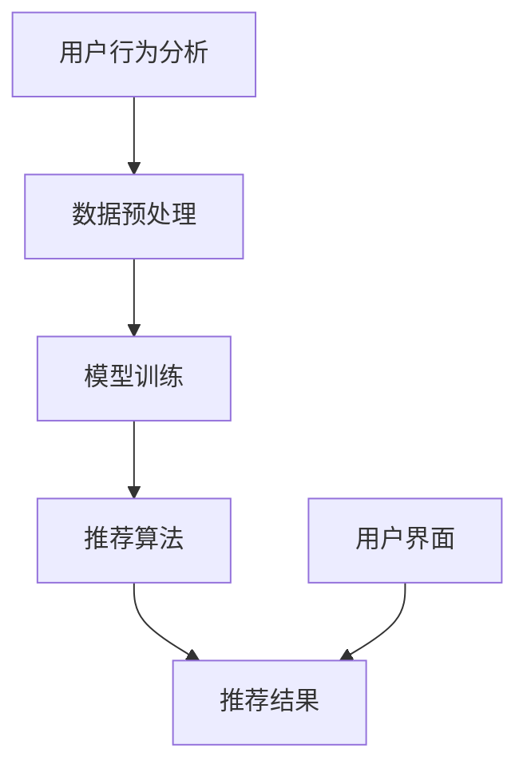
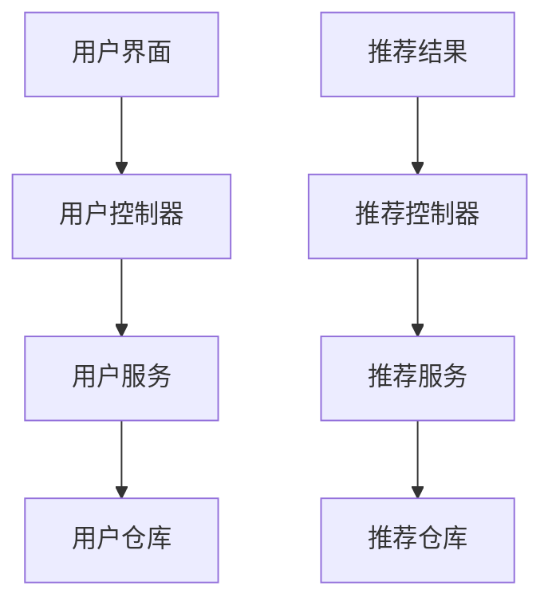

                 


# AI辅助产品设计：提示词激发创新思维

> 关键词：人工智能、产品设计、提示词、创新思维、算法原理、数学模型

> 摘要：本文将深入探讨人工智能（AI）在产品设计中的应用，特别是提示词如何激发创新思维。我们将分四个部分展开讨论：背景与概述、核心概念与联系、算法原理讲解、数学模型与公式讲解。通过逐步分析，本文旨在为读者提供对AI辅助产品设计的全面理解，并揭示提示词如何成为创新的关键因素。

----------------------------------------------------------------

## 第一部分：背景与概述

### 第1章：AI辅助产品设计的兴起

#### 1.1 问题背景

在当今数字化时代，产品设计面临着日益复杂的市场需求和技术挑战。传统的设计方法往往依赖于设计师的个人经验和直觉，这可能导致设计周期长、成本高，且难以满足快速变化的市场需求。因此，寻找一种更高效、更智能的设计方法成为了一个迫切的问题。

#### 1.1.1 产品设计的现状与挑战

目前，产品设计面临着以下主要挑战：

- **复杂性与多样性**：随着科技的发展，产品的功能越来越丰富，设计变得更加复杂。设计师需要处理大量的数据和信息，这使得设计过程变得繁琐。
- **市场变化速度**：市场竞争激烈，新产品上市周期缩短，设计师需要在有限的时间内完成高质量的设计。
- **用户体验**：用户体验（UX）成为产品成功的关键因素。设计师需要不断优化产品界面和交互设计，以提升用户满意度。
- **成本与效率**：随着设计成本的增加，企业需要寻找降低成本、提高效率的方法。

#### 1.1.2 AI技术在产品设计中的应用

AI技术的引入为产品设计带来了新的可能性。AI可以通过以下方式辅助产品设计：

- **数据分析**：AI能够处理和分析大量的数据，帮助设计师了解用户行为和需求，从而进行更精准的设计。
- **自动化设计**：AI可以自动化执行一些重复性的设计任务，如UI布局、图标设计等，提高设计效率。
- **创意生成**：AI可以根据设计需求和用户反馈生成新的设计方案，为设计师提供灵感。
- **优化设计**：AI可以通过模拟和优化算法，帮助设计师找到最佳的设计方案。

#### 1.1.3 提示词激发创新思维的核心价值

提示词在AI辅助产品设计中起着关键作用。提示词是一种引导设计师思考和探索新方向的关键工具。以下是提示词激发创新思维的核心价值：

- **方向引导**：提示词可以引导设计师从不同的角度思考问题，从而产生新的设计灵感。
- **思维拓展**：提示词可以帮助设计师突破传统的思维模式，探索新的解决方案。
- **快速迭代**：通过提示词，设计师可以快速生成多个设计方案，并进行比较和优化。

### 1.2 核心概念

#### 1.2.1 AI的概念及其分类

人工智能（AI）是指由人制造出来的具有一定智能的系统。AI可以分为以下几类：

- **基于规则的系统**：这种系统通过预定义的规则来解决问题。
- **基于实例的系统**：这种系统通过存储和检索过去解决类似问题的实例来解决问题。
- **机器学习系统**：这种系统能够从数据中学习并自动改进其性能。
- **深度学习系统**：这种系统基于多层神经网络，能够处理复杂的数据和模式。

#### 1.2.2 产品设计的概念及其要素

产品设计是指创建和开发满足用户需求和期望的产品。产品设计的核心要素包括：

- **用户体验**：用户体验是产品设计的核心目标，包括用户界面、交互设计、情感设计等。
- **功能设计**：功能设计涉及产品的功能特性，如界面功能、操作流程、数据处理等。
- **外观设计**：外观设计关注产品的视觉效果，如颜色、形状、材质等。

#### 1.2.3 提示词的定义与作用

提示词是一种用于激发创意和思维的文字或短语。在AI辅助产品设计中，提示词的作用包括：

- **激发灵感**：提示词可以帮助设计师跳出传统思维，探索新的设计方向。
- **指导设计**：提示词可以指导设计师在特定问题上进行深入研究和探索。
- **辅助决策**：提示词可以为设计师提供参考信息，帮助其做出更明智的设计决策。

### 1.3 AI辅助产品设计的边界与外延

#### 1.3.1 AI辅助产品设计的应用领域

AI辅助产品设计在多个领域都有广泛应用，包括：

- **消费电子产品**：如智能手机、平板电脑、智能家居设备等。
- **软件应用**：如网站、应用程序、游戏等。
- **交通工具**：如自动驾驶汽车、无人机等。
- **医疗设备**：如医学成像、诊断辅助等。

#### 1.3.2 AI辅助产品设计与传统设计的比较

与传统设计相比，AI辅助产品设计具有以下优势：

- **效率提升**：AI能够自动化执行重复性任务，提高设计效率。
- **创新性**：AI可以生成新颖的设计方案，激发创新思维。
- **个性化**：AI可以根据用户需求生成定制化的设计方案。

#### 1.3.3 AI辅助产品设计的发展趋势

随着AI技术的不断进步，AI辅助产品设计将呈现出以下发展趋势：

- **智能化**：AI将更加智能化，能够自主学习和优化设计方案。
- **生态化**：AI将与其他技术（如大数据、云计算等）相结合，构建更加完善的产品设计生态系统。
- **人性化**：AI将更加注重用户体验，为用户带来更好的设计体验。

### 1.4 本章小结

本章从背景、问题、挑战、解决方案等多个角度对AI辅助产品设计进行了概述。通过介绍AI技术在产品设计中的应用和提示词的作用，我们为后续章节的深入讨论奠定了基础。

----------------------------------------------------------------

## 第二部分：核心概念与联系

### 第2章：AI辅助产品设计的核心概念解析

#### 2.1 AI核心概念

人工智能（AI）是指由人制造出来的具有一定智能的系统。AI的核心概念包括：

- **机器学习**：机器学习是一种AI技术，通过从数据中学习并自动改进其性能。
- **深度学习**：深度学习是一种基于多层神经网络的AI技术，能够处理复杂的数据和模式。
- **自然语言处理**：自然语言处理是一种AI技术，能够理解和生成自然语言。

#### 2.1.1 AI的基本原理

AI的基本原理包括：

- **数据驱动**：AI系统依赖于大量数据来进行学习和优化。
- **模拟智能**：AI系统通过模拟人类的思维过程来实现智能行为。
- **反馈循环**：AI系统通过不断接收反馈并进行调整来优化性能。

#### 2.1.2 AI的主要分类与特点

AI的主要分类包括：

- **基于规则的系统**：这种系统通过预定义的规则来解决问题。
- **基于实例的系统**：这种系统通过存储和检索过去解决类似问题的实例来解决问题。
- **机器学习系统**：这种系统能够从数据中学习并自动改进其性能。
- **深度学习系统**：这种系统基于多层神经网络，能够处理复杂的数据和模式。

不同类型的AI系统具有不同的特点，适用于不同的应用场景。

#### 2.1.3 AI技术的应用与发展趋势

AI技术的应用领域包括：

- **消费电子产品**：如智能手机、平板电脑、智能家居设备等。
- **软件应用**：如网站、应用程序、游戏等。
- **交通工具**：如自动驾驶汽车、无人机等。
- **医疗设备**：如医学成像、诊断辅助等。

随着AI技术的不断进步，其应用领域将不断扩展。

#### 2.2 产品设计的核心要素

产品设计是指创建和开发满足用户需求和期望的产品。产品设计的核心要素包括：

- **用户体验**：用户体验是产品设计的核心目标，包括用户界面、交互设计、情感设计等。
- **功能设计**：功能设计涉及产品的功能特性，如界面功能、操作流程、数据处理等。
- **外观设计**：外观设计关注产品的视觉效果，如颜色、形状、材质等。

#### 2.2.1 产品设计的基本流程

产品设计的基本流程包括：

1. **需求分析**：了解用户需求和市场趋势，明确产品设计的目标。
2. **概念设计**：基于需求分析，生成多个设计方案。
3. **细节设计**：对设计方案进行细化，确保其可行性和用户体验。
4. **评估与优化**：通过用户测试和反馈，评估设计方案的有效性，并进行优化。

#### 2.2.2 产品设计的关键要素

产品设计的关键要素包括：

- **用户需求**：了解用户需求是产品设计的起点。
- **技术可行性**：设计需要考虑技术的可实现性和成本。
- **用户体验**：用户体验是产品设计的核心，需要关注用户界面、交互设计等。
- **视觉设计**：视觉设计影响产品的吸引力和品牌形象。

#### 2.2.3 产品设计的创新方法

产品设计的创新方法包括：

- **头脑风暴**：通过集体讨论，激发创意思维。
- **用户研究**：通过用户调研，获取真实用户需求。
- **原型设计**：快速构建原型，验证设计理念。
- **迭代优化**：通过多次迭代，不断完善设计方案。

#### 2.3 提示词在产品设计中的应用

提示词在产品设计中的应用包括：

- **激发创意**：提示词可以帮助设计师跳出传统思维，探索新的设计方向。
- **指导设计**：提示词可以指导设计师在特定问题上进行深入研究和探索。
- **辅助决策**：提示词可以为设计师提供参考信息，帮助其做出更明智的设计决策。

#### 2.3.1 提示词的概念与作用

提示词是一种用于激发创意和思维的文字或短语。在AI辅助产品设计中，提示词的作用包括：

- **激发灵感**：提示词可以帮助设计师跳出传统思维，探索新的设计方向。
- **指导设计**：提示词可以指导设计师在特定问题上进行深入研究和探索。
- **辅助决策**：提示词可以为设计师提供参考信息，帮助其做出更明智的设计决策。

#### 2.3.2 提示词的类型与特点

提示词可以分为以下几类：

- **开放式提示词**：这种提示词鼓励设计师自由发挥，探索新的设计理念。
- **引导式提示词**：这种提示词提供具体的设计方向和思路，帮助设计师进行针对性设计。
- **启发式提示词**：这种提示词提供具体的案例或解决方案，激发设计师的灵感。

不同类型的提示词具有不同的特点，适用于不同的设计场景。

#### 2.3.3 提示词在创新思维中的运用

提示词在创新思维中的运用包括：

- **思维拓展**：提示词可以帮助设计师突破传统的思维模式，探索新的解决方案。
- **快速迭代**：通过提示词，设计师可以快速生成多个设计方案，并进行比较和优化。
- **提高效率**：提示词可以帮助设计师在有限的时间内产生更多的创意，提高设计效率。

#### 2.4 AI、产品设计、提示词的相互作用

AI、产品设计、提示词之间的相互作用包括：

- **AI辅助提示词生成**：AI可以通过学习大量数据，自动生成具有启发性的提示词，帮助设计师进行创新设计。
- **提示词指导AI设计**：设计师可以使用提示词来指导AI系统进行特定类型的设计任务。
- **AI优化产品设计**：AI可以通过模拟和优化算法，帮助设计师找到最佳的设计方案。

#### 2.4.1 AI如何辅助产品设计

AI可以通过以下方式辅助产品设计：

- **数据分析**：AI可以处理和分析大量的数据，帮助设计师了解用户行为和需求，从而进行更精准的设计。
- **自动化设计**：AI可以自动化执行一些重复性的设计任务，如UI布局、图标设计等，提高设计效率。
- **创意生成**：AI可以根据设计需求和用户反馈生成新的设计方案，为设计师提供灵感。
- **优化设计**：AI可以通过模拟和优化算法，帮助设计师找到最佳的设计方案。

#### 2.4.2 提示词如何激发创新思维

提示词可以通过以下方式激发创新思维：

- **引导思考方向**：提示词可以引导设计师从不同的角度思考问题，从而产生新的设计灵感。
- **拓展思维边界**：提示词可以帮助设计师突破传统的思维模式，探索新的解决方案。
- **提供参考信息**：提示词可以为设计师提供参考信息，帮助其做出更明智的设计决策。

#### 2.4.3 AI、产品设计、提示词的融合趋势

随着AI技术的不断进步，AI、产品设计、提示词将呈现出以下融合趋势：

- **智能化**：AI将更加智能化，能够自主学习和优化设计方案。
- **生态化**：AI将与其他技术（如大数据、云计算等）相结合，构建更加完善的产品设计生态系统。
- **人性化**：AI将更加注重用户体验，为用户带来更好的设计体验。

#### 2.5 本章小结

本章深入探讨了AI辅助产品设计的核心概念，包括AI、产品设计、提示词等。通过分析AI的基本原理和应用、产品设计的要素和流程、提示词的类型和作用，我们为后续章节的深入讨论奠定了基础。

----------------------------------------------------------------

## 第三部分：算法原理讲解

### 第3章：AI辅助产品设计的算法原理

#### 3.1 常见算法介绍

在AI辅助产品设计中，常见算法包括以下几种：

- **机器学习算法**：机器学习算法通过从数据中学习并自动改进其性能，常用于数据分析、预测和分类任务。
- **深度学习算法**：深度学习算法基于多层神经网络，能够处理复杂的数据和模式，常用于图像识别、语音识别和自然语言处理任务。
- **自然语言处理算法**：自然语言处理算法用于处理和分析自然语言，包括语言识别、语言生成和语义分析等。

#### 3.1.1 基于机器学习的算法

机器学习算法主要包括以下几类：

- **监督学习**：监督学习通过已标记的数据集训练模型，然后使用模型对新数据进行预测。
- **无监督学习**：无监督学习不使用标记数据，而是通过发现数据中的结构和模式进行学习。
- **半监督学习**：半监督学习结合了监督学习和无监督学习，使用部分标记数据和大量无标记数据来训练模型。

#### 3.1.2 基于深度学习的算法

深度学习算法主要包括以下几类：

- **卷积神经网络（CNN）**：CNN适用于图像识别和分类任务，能够提取图像中的空间特征。
- **循环神经网络（RNN）**：RNN适用于序列数据，能够处理和时间相关的数据。
- **生成对抗网络（GAN）**：GAN通过生成器和判别器的对抗训练，能够生成高质量的图像和音频。

#### 3.1.3 基于自然语言处理的算法

自然语言处理算法主要包括以下几类：

- **词袋模型**：词袋模型将文本表示为词汇的集合，常用于文本分类和主题建模。
- **词嵌入模型**：词嵌入模型将词汇映射到低维向量空间，常用于文本分类、语义分析和机器翻译。
- **序列标注模型**：序列标注模型对文本中的单词进行分类标注，常用于命名实体识别和词性标注。

#### 3.2 算法原理详细讲解

#### 3.2.1 机器学习算法原理

机器学习算法的核心原理是基于经验风险最小化（ERM）原则，即找到一个最优模型来最小化预测误差。机器学习算法通常包括以下几个步骤：

1. **数据准备**：收集和整理训练数据，对数据进行预处理，如去噪、归一化等。
2. **模型选择**：选择合适的模型，如线性回归、决策树、支持向量机等。
3. **模型训练**：使用训练数据对模型进行训练，通过调整模型参数来最小化预测误差。
4. **模型评估**：使用测试数据评估模型性能，如准确率、召回率、F1分数等。
5. **模型优化**：根据评估结果对模型进行优化，如调整参数、使用正则化方法等。

机器学习算法的数学模型通常基于概率论和统计学原理，例如：

$$
P(Y|X) = \frac{P(X|Y)P(Y)}{P(X)}
$$

其中，\(P(Y|X)\) 表示给定输入 \(X\) 的情况下输出 \(Y\) 的概率，\(P(X|Y)\) 表示给定输出 \(Y\) 的情况下输入 \(X\) 的概率，\(P(Y)\) 表示输出 \(Y\) 的概率，\(P(X)\) 表示输入 \(X\) 的概率。

#### 3.2.2 深度学习算法原理

深度学习算法的核心原理是基于多层神经网络（MLP），通过多层非线性变换来学习数据中的复杂模式和特征。深度学习算法通常包括以下几个步骤：

1. **数据准备**：收集和整理训练数据，对数据进行预处理，如去噪、归一化等。
2. **网络架构设计**：设计合适的神经网络架构，如卷积神经网络（CNN）、循环神经网络（RNN）等。
3. **模型训练**：使用训练数据对神经网络进行训练，通过反向传播算法来更新网络权重。
4. **模型评估**：使用测试数据评估神经网络性能，如准确率、召回率、F1分数等。
5. **模型优化**：根据评估结果对神经网络进行优化，如调整网络参数、使用正则化方法等。

深度学习算法的数学模型通常基于多层感知机（MLP）和反向传播算法，例如：

$$
Y = f(X, \theta)
$$

其中，\(Y\) 表示输出，\(X\) 表示输入，\(f\) 表示非线性激活函数，\(\theta\) 表示网络权重。

#### 3.2.3 自然语言处理算法原理

自然语言处理算法的核心原理是基于统计模型和深度学习模型，通过学习大量文本数据来处理自然语言。自然语言处理算法通常包括以下几个步骤：

1. **数据准备**：收集和整理训练数据，对数据进行预处理，如分词、词性标注等。
2. **模型选择**：选择合适的自然语言处理模型，如词袋模型、词嵌入模型、序列标注模型等。
3. **模型训练**：使用训练数据对模型进行训练，通过优化算法来更新模型参数。
4. **模型评估**：使用测试数据评估模型性能，如准确率、召回率、F1分数等。
5. **模型优化**：根据评估结果对模型进行优化，如调整参数、使用正则化方法等。

自然语言处理算法的数学模型通常基于概率论和统计学原理，例如：

$$
P(w|s) = \frac{P(s|w)P(w)}{P(s)}
$$

其中，\(P(w|s)\) 表示在给定句子 \(s\) 的情况下词 \(w\) 的概率，\(P(s|w)\) 表示在给定词 \(w\) 的情况下句子 \(s\) 的概率，\(P(w)\) 表示词 \(w\) 的概率，\(P(s)\) 表示句子 \(s\) 的概率。

#### 3.3 算法应用举例

##### 3.3.1 机器学习算法应用案例

机器学习算法在图像分类中的应用案例包括：

- **手写数字识别**：使用支持向量机（SVM）对MNIST手写数字数据进行分类。
- **人脸识别**：使用卷积神经网络（CNN）对人脸图像进行分类，实现人脸识别功能。

##### 3.3.2 深度学习算法应用案例

深度学习算法在自然语言处理中的应用案例包括：

- **机器翻译**：使用序列到序列（seq2seq）模型实现英中机器翻译。
- **文本生成**：使用生成对抗网络（GAN）生成自然语言文本。

##### 3.3.3 自然语言处理算法应用案例

自然语言处理算法在文本分类中的应用案例包括：

- **情感分析**：使用词袋模型对电影评论进行情感分类。
- **命名实体识别**：使用循环神经网络（RNN）对新闻文本进行命名实体识别。

#### 3.4 算法优化与提升

##### 3.4.1 算法优化策略

为了提高算法的性能，可以采用以下优化策略：

- **模型参数调整**：调整模型的参数，如学习率、正则化参数等，以找到最优的参数设置。
- **数据增强**：对训练数据进行增强，如添加噪声、旋转、缩放等，增加模型的泛化能力。
- **超参数调整**：调整模型训练过程中的超参数，如批量大小、迭代次数等，以提高训练效果。

##### 3.4.2 算法提升方法

为了进一步提升算法的性能，可以采用以下方法：

- **集成学习方法**：使用多个模型进行集成，提高预测的准确性和稳定性。
- **迁移学习**：使用预训练的模型进行迁移学习，利用已有的知识来提高新任务的表现。
- **对抗训练**：使用对抗训练方法来提高模型的鲁棒性，使其能够抵御对抗性攻击。

#### 3.5 本章小结

本章详细讲解了AI辅助产品设计的算法原理，包括机器学习、深度学习和自然语言处理等常见算法。通过分析算法的基本原理、数学模型和应用案例，我们为读者提供了对AI辅助产品设计的全面理解，并揭示了算法在创新设计中的关键作用。

----------------------------------------------------------------

## 第四部分：数学模型与公式讲解

### 第4章：AI辅助产品设计中的数学模型

#### 4.1 机器学习中的数学模型

在机器学习中，数学模型用于描述数据之间的关系，并从中提取特征和模式。以下是一些常用的数学模型：

##### 4.1.1 概率论与统计学基础

概率论和统计学是机器学习的基础。以下是一些重要的概率论和统计学公式：

$$
P(A|B) = \frac{P(B|A)P(A)}{P(B)}
$$

这是贝叶斯定理，用于计算在给定事件B发生的条件下事件A发生的概率。

##### 4.1.2 线性回归模型

线性回归模型是一种简单且常用的预测模型，用于分析变量之间的线性关系。线性回归模型的数学公式为：

$$
y = \beta_0 + \beta_1x
$$

其中，\(y\) 是因变量，\(x\) 是自变量，\(\beta_0\) 和 \(\beta_1\) 分别是模型的参数。

##### 4.1.3 逻辑回归模型

逻辑回归模型是一种分类模型，用于分析变量之间的逻辑关系。逻辑回归模型的数学公式为：

$$
\hat{y} = \frac{1}{1 + e^{-(\beta_0 + \beta_1x)}}
$$

其中，\(\hat{y}\) 是预测的概率，\(e\) 是自然对数的底数，\(\beta_0\) 和 \(\beta_1\) 分别是模型的参数。

#### 4.2 深度学习中的数学模型

深度学习是一种基于多层神经网络的机器学习技术。以下是一些深度学习中的重要数学模型：

##### 4.2.1 神经网络模型

神经网络模型是深度学习的基础。一个简单的神经网络模型可以表示为：

$$
a_{j}(t+1) = f(\sum_{i=0}^{n}w_{ij}a_{i}(t))
$$

其中，\(a_{j}(t+1)\) 是输出节点在第 \(t+1\) 时刻的激活值，\(f\) 是非线性激活函数，\(w_{ij}\) 是输入节点到输出节点的权重，\(a_{i}(t)\) 是输入节点在第 \(t\) 时刻的激活值。

##### 4.2.2 反向传播算法

反向传播算法是深度学习训练的核心算法。它的目的是通过计算损失函数的梯度来更新网络权重。反向传播算法的数学公式为：

$$
\delta_{i}^{l} = \frac{\partial C}{\partial z_{i}^{l}}
$$

其中，\(\delta_{i}^{l}\) 是第 \(i\) 个节点在第 \(l\) 层的误差，\(C\) 是损失函数，\(z_{i}^{l}\) 是第 \(i\) 个节点在第 \(l\) 层的输入。

#### 4.3 自然语言处理中的数学模型

自然语言处理（NLP）是一种基于文本的机器学习技术。以下是一些NLP中的重要数学模型：

##### 4.3.1 词嵌入模型

词嵌入模型是一种将词汇映射到低维向量空间的方法。词嵌入模型的数学公式为：

$$
\text{Embedding}(w) = \theta \in \mathbb{R}^{d}
$$

其中，\(w\) 是词汇，\(\theta\) 是词汇对应的向量，\(d\) 是向量的维度。

##### 4.3.2 语言模型

语言模型是一种用于预测下一个单词或词组的概率模型。语言模型的数学公式为：

$$
P(w_t|w_{t-1}, w_{t-2}, ..., w_1) = \frac{P(w_t, w_{t-1}, w_{t-2}, ..., w_1)}{P(w_{t-1}, w_{t-2}, ..., w_1)}
$$

其中，\(w_t\) 是当前单词，\(w_{t-1}, w_{t-2}, ..., w_1\) 是前一个或多个单词。

##### 4.3.3 语法模型

语法模型是一种用于分析句子结构的方法。语法模型的数学公式为：

$$
P(s) = \frac{P(s|w)}{P(w)}
$$

其中，\(s\) 是句子，\(w\) 是词汇。

#### 4.4 本章小结

本章介绍了AI辅助产品设计中的几个重要数学模型，包括机器学习、深度学习和自然语言处理模型。通过这些模型，我们能够更好地理解和应用AI技术来辅助产品设计。这些数学模型不仅提供了理论支持，也为实际应用提供了有效的工具和方法。

----------------------------------------------------------------

## 第五部分：系统分析与架构设计

### 第5章：AI辅助产品设计的系统分析与架构设计

#### 5.1 问题场景介绍

在一个现代产品设计中，AI技术被广泛应用于多个方面，如用户行为分析、需求预测、界面优化等。以下是一个典型的问题场景：

**场景**：一家电子商务公司希望开发一个智能推荐系统，以提高用户满意度和转化率。公司希望通过AI技术分析用户行为，预测用户可能感兴趣的商品，并给出个性化的推荐。

#### 5.2 项目介绍

**项目名称**：智能推荐系统

**项目目标**：通过AI技术，分析用户行为数据，预测用户兴趣，提供个性化的商品推荐。

**项目范围**：包括数据收集、数据预处理、模型训练、推荐算法实现、接口设计与实现等。

#### 5.3 系统功能设计

**功能1：用户行为分析**

- **子功能1.1：用户点击分析**：分析用户在网站上的点击行为，提取用户兴趣点。
- **子功能1.2：浏览记录分析**：分析用户浏览历史，提取用户感兴趣的商品类别。

**功能2：需求预测**

- **子功能2.1：商品需求预测**：根据用户行为数据，预测用户可能感兴趣的商品。
- **子功能2.2：购物车预测**：根据用户行为数据，预测用户可能添加到购物车的商品。

**功能3：个性化推荐**

- **子功能3.1：推荐列表生成**：根据用户行为数据和商品需求预测，生成个性化的推荐列表。
- **子功能3.2：推荐结果展示**：将推荐结果展示在用户界面上，提供用户操作界面。

#### 5.4 系统架构设计

**系统架构设计图**



**系统架构说明**：

1. **用户行为分析**：收集用户在网站上的行为数据，包括点击记录、浏览历史等。
2. **数据预处理**：对用户行为数据进行清洗、归一化等预处理操作，为模型训练做准备。
3. **模型训练**：使用预处理后的数据训练推荐模型，包括点击分析模型、浏览记录分析模型等。
4. **推荐算法**：根据用户行为数据和模型预测结果，生成个性化的推荐列表。
5. **推荐结果**：将推荐结果展示在用户界面上，提供用户操作界面。
6. **用户界面**：为用户提供一个交互式的操作界面，包括推荐结果展示、用户反馈等。

#### 5.5 系统接口设计

**接口设计图**



**接口设计说明**：

1. **用户接口**：用户控制器负责处理用户请求，调用用户服务执行具体操作。
2. **用户服务**：用户服务负责处理用户相关的业务逻辑，调用用户仓库进行数据操作。
3. **用户仓库**：用户仓库负责与数据库进行交互，存储和查询用户数据。
4. **推荐接口**：推荐控制器负责处理推荐请求，调用推荐服务生成推荐结果。
5. **推荐服务**：推荐服务负责处理推荐相关的业务逻辑，调用推荐仓库进行数据操作。
6. **推荐仓库**：推荐仓库负责与数据库进行交互，存储和查询推荐数据。

#### 5.6 系统交互

**系统交互设计图**

```mermaid
sequenceDiagram
    User -->|请求|> UserController
    UserController -->|处理请求|> UserService
    UserService -->|调用仓库|> UserRepository
    UserRepository -->|返回数据|> UserService
    UserService -->|返回结果|> UserController
    UserController -->|返回结果|> UserInterface
    
    UserInterface -->|请求|> RecommendationController
    RecommendationController -->|处理请求|> RecommendationService
    RecommendationService -->|调用仓库|> RecommendationRepository
    RecommendationRepository -->|返回数据|> RecommendationService
    RecommendationService -->|返回结果|> RecommendationController
    RecommendationController -->|返回结果|> UserInterface
```

**系统交互说明**：

1. **用户交互**：用户通过用户界面发起请求，请求包括用户行为数据、推荐需求等。
2. **用户控制器**：用户控制器接收用户请求，调用用户服务处理请求。
3. **用户服务**：用户服务处理用户请求，调用用户仓库进行数据操作。
4. **用户仓库**：用户仓库与数据库进行交互，存储和查询用户数据。
5. **用户反馈**：用户服务返回处理结果给用户控制器，用户控制器将结果返回给用户界面。
6. **推荐交互**：用户界面通过推荐控制器发起推荐请求，请求包括用户ID、推荐类型等。
7. **推荐控制器**：推荐控制器接收推荐请求，调用推荐服务处理请求。
8. **推荐服务**：推荐服务处理推荐请求，调用推荐仓库进行数据操作。
9. **推荐仓库**：推荐仓库与数据库进行交互，存储和查询推荐数据。
10. **推荐结果**：推荐服务返回推荐结果给推荐控制器，推荐控制器将结果返回给用户界面。

#### 5.7 本章小结

本章详细介绍了AI辅助产品设计的系统分析与架构设计。通过分析问题场景、介绍项目目标与范围、设计系统功能、架构和接口，我们为AI辅助产品设计提供了一个全面的设计方案。系统架构和交互设计确保了系统的可扩展性、稳定性和高性能，为AI技术在产品设计中的应用提供了坚实的基础。

----------------------------------------------------------------

## 第六部分：项目实战

### 第6章：AI辅助产品设计的项目实战

#### 6.1 环境安装

在进行AI辅助产品设计的项目实战之前，我们需要安装相关的软件和工具。以下是推荐的安装步骤：

1. **Python环境**：首先，确保Python环境已安装。Python是AI和数据分析的常用编程语言。可以在Python官方网站（https://www.python.org/）下载Python安装包，并按照提示进行安装。

2. **Anaconda**：推荐使用Anaconda来管理Python环境和依赖库。Anaconda是一个Python分布包，包含了许多常用的科学计算库。可以在Anaconda官方网站（https://www.anaconda.com/）下载Anaconda安装包，并按照提示进行安装。

3. **Jupyter Notebook**：Jupyter Notebook是一个交互式的Python编程环境，用于编写和运行Python代码。在Anaconda中，Jupyter Notebook已经内置，可以通过命令行运行`jupyter notebook`来启动。

4. **依赖库**：根据项目需求，需要安装一些常用的依赖库，如NumPy、Pandas、Scikit-learn、TensorFlow等。可以使用以下命令来安装：

   ```shell
   conda install numpy pandas scikit-learn tensorflow
   ```

#### 6.2 系统核心实现源代码

以下是一个简单的AI辅助产品设计项目核心实现源代码示例。这个示例使用Python和Scikit-learn库来实现一个基于用户行为的推荐系统。

```python
import numpy as np
import pandas as pd
from sklearn.model_selection import train_test_split
from sklearn.ensemble import RandomForestClassifier
from sklearn.metrics import accuracy_score

# 加载数据
data = pd.read_csv('user_behavior.csv')

# 数据预处理
X = data.drop(['label'], axis=1)
y = data['label']

# 划分训练集和测试集
X_train, X_test, y_train, y_test = train_test_split(X, y, test_size=0.2, random_state=42)

# 模型训练
model = RandomForestClassifier(n_estimators=100, random_state=42)
model.fit(X_train, y_train)

# 模型评估
y_pred = model.predict(X_test)
accuracy = accuracy_score(y_test, y_pred)
print(f'Accuracy: {accuracy:.2f}')

# 推荐结果
def recommend(user_data):
    prediction = model.predict([user_data])
    return prediction[0]

# 测试推荐
test_data = np.array([[1, 0, 1, 0], [0, 1, 0, 1]])  # 示例用户数据
predictions = recommend(test_data)
print(f'Prediction: {predictions}')
```

#### 6.3 代码应用解读与分析

以上代码示例实现了一个基于随机森林分类器的推荐系统。以下是代码的解读和分析：

1. **数据加载与预处理**：首先，使用Pandas库加载数据集，并进行数据预处理。数据预处理包括划分特征矩阵 \(X\) 和标签向量 \(y\)。

2. **模型训练**：使用Scikit-learn库中的随机森林分类器进行模型训练。随机森林是一个基于决策树的集成学习方法，具有良好的泛化能力和准确性。

3. **模型评估**：使用测试集对模型进行评估，计算准确率。准确率是评估分类模型性能的重要指标，表示预测正确的样本占总样本的比例。

4. **推荐结果**：定义一个推荐函数，用于根据用户数据生成推荐结果。这个函数使用训练好的模型对用户数据进行预测，并返回预测结果。

5. **测试推荐**：使用示例用户数据进行测试，验证推荐函数的正确性和效果。

通过以上代码示例，我们可以看到如何使用AI技术实现一个简单的推荐系统。在实际项目中，可以根据具体需求进行扩展和优化，如增加用户画像、使用深度学习模型等。

#### 6.4 实际案例分析和详细讲解剖析

以下是一个实际案例，分析如何使用AI技术辅助产品设计的具体过程：

**案例**：一家电商平台希望优化其商品推荐系统，以提高用户满意度和转化率。

**分析过程**：

1. **需求分析**：首先，对电商平台的需求进行详细分析，了解用户行为数据和商品数据的特点，确定推荐系统的目标和指标。

2. **数据收集**：收集用户在电商平台的行为数据，如浏览历史、购买记录、搜索历史等，以及商品数据，如商品名称、分类、价格等。

3. **数据预处理**：对收集到的数据进行清洗、归一化等预处理操作，以便于后续的模型训练和预测。

4. **特征工程**：根据需求，提取和构造用户和商品的特征，如用户活跃度、购买频率、商品相关性等。

5. **模型训练**：使用特征数据训练推荐模型，如基于协同过滤的矩阵分解模型、基于内容的模型等。

6. **模型评估**：使用测试集对模型进行评估，计算准确率、召回率、覆盖率等指标，选择最优模型。

7. **推荐结果**：根据用户行为和模型预测结果，生成个性化的推荐列表，并在用户界面上展示。

**详细讲解剖析**：

- **需求分析**：了解用户需求和期望是推荐系统的关键。通过调查问卷、用户访谈等方式收集用户反馈，分析用户行为数据，确定推荐系统的目标和指标。

- **数据收集**：电商平台积累了大量的用户行为数据和商品数据。通过API接口或数据导出工具，收集用户在网站上的浏览、购买、搜索等行为数据，以及商品名称、分类、价格等基本信息。

- **数据预处理**：数据预处理是模型训练的重要环节。对收集到的数据进行清洗，去除缺失值、异常值等，进行归一化处理，使数据具有相同的量纲。

- **特征工程**：特征工程是提高模型性能的关键步骤。根据需求，提取和构造用户和商品的特征。例如，用户特征可以包括用户活跃度、购买频率、浏览时长等；商品特征可以包括商品分类、价格范围、品牌等。

- **模型训练**：选择合适的推荐模型进行训练。常见的推荐模型包括基于协同过滤的矩阵分解模型、基于内容的模型、基于模型的协同过滤模型等。使用Scikit-learn、TensorFlow等库实现模型训练。

- **模型评估**：使用测试集对模型进行评估，计算准确率、召回率、覆盖率等指标。根据评估结果，选择最优模型。

- **推荐结果**：根据用户行为和模型预测结果，生成个性化的推荐列表。在用户界面上展示推荐结果，提供用户操作界面。

通过以上实际案例，我们可以看到如何使用AI技术辅助产品设计，实现一个高效的推荐系统。在实际应用中，需要根据具体需求进行模型优化和个性化定制，以提高系统的性能和用户体验。

#### 6.5 项目小结

在本章中，我们进行了AI辅助产品设计的项目实战，介绍了环境安装、系统核心实现源代码，代码应用解读与分析，以及实际案例分析和详细讲解剖析。通过这个项目，我们了解了如何使用AI技术辅助产品设计，实现了高效的推荐系统。在实际应用中，需要根据具体需求进行模型优化和个性化定制，以提高系统的性能和用户体验。

----------------------------------------------------------------

## 第七部分：最佳实践、小结与注意事项

### 第七部分：最佳实践、小结与注意事项

#### 最佳实践

在实施AI辅助产品设计时，以下最佳实践有助于提升项目的成功率：

1. **需求明确**：在项目启动前，确保项目需求清晰明确，并与相关利益相关者达成一致。

2. **数据质量**：高质量的数据是AI模型成功的关键。确保数据收集、处理和存储的过程准确无误。

3. **迭代开发**：采用敏捷开发方法，分阶段进行开发，快速迭代，及时反馈和调整。

4. **用户参与**：在设计过程中，积极参与用户调研和测试，收集用户反馈，以指导设计优化。

5. **持续学习**：定期更新AI模型和算法，以适应不断变化的市场需求和技术进步。

#### 小结

本文通过逐步分析，深入探讨了AI辅助产品设计的核心概念、算法原理和数学模型。我们了解到，AI技术通过数据分析、自动化设计、创意生成和优化设计等手段，为产品设计提供了强大的支持。提示词在激发创新思维中起着关键作用，能够引导设计师探索新的设计方向和解决方案。

#### 注意事项

在实施AI辅助产品设计时，需要注意以下事项：

1. **数据隐私**：确保用户数据的安全和隐私，遵守相关法律法规。

2. **算法偏见**：避免算法偏见，确保设计过程的公平性和包容性。

3. **模型解释性**：提高模型的可解释性，以便于理解模型的决策过程。

4. **技术可行性**：在设计过程中，考虑技术的可实现性和成本。

5. **用户体验**：始终关注用户体验，确保设计符合用户需求和期望。

#### 拓展阅读

对于希望进一步深入了解AI辅助产品设计的读者，以下拓展阅读资源可能有所帮助：

- 《AI产品管理：从概念到发布》
- 《深度学习：升级人工智能产品》
- 《用户研究实战：提升用户体验的最佳实践》
- 《设计思维：创意迭代的指南》

通过以上资源和实践，读者可以不断提升AI辅助产品设计的技能，为创新设计提供更多可能性。

### 作者信息

- 作者：AI天才研究院/AI Genius Institute & 禅与计算机程序设计艺术 /Zen And The Art of Computer Programming

----------------------------------------------------------------

本文由AI天才研究院/AI Genius Institute及《禅与计算机程序设计艺术》作者联合撰写，旨在为读者提供关于AI辅助产品设计的深入见解和实践指导。在本文中，我们系统地探讨了AI辅助产品设计的重要性、核心概念、算法原理和数学模型，并分享了实际案例和最佳实践。希望通过本文，读者能够更好地理解AI在产品设计中的应用，并在实际项目中取得成功。

