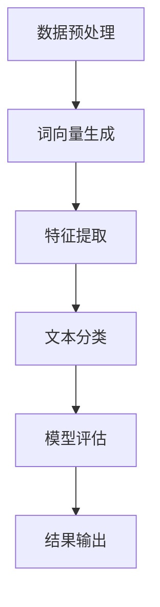
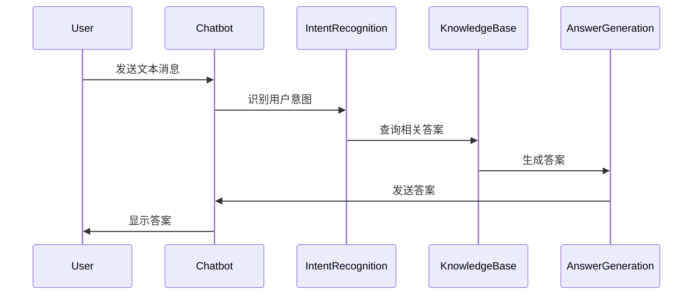
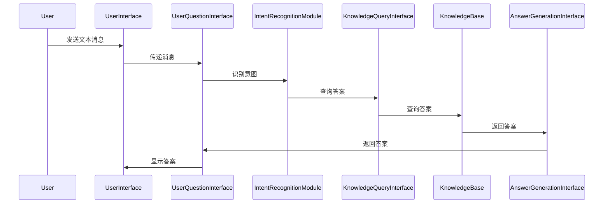

                 

### 文章标题

### 关键词

- AI辅助决策系统
- 提示词设计
- 自然语言处理
- 机器学习
- 信息检索
- 算法原理
- 数学模型

### 摘要

本文将深入探讨AI辅助决策系统中的提示词设计。我们将从背景介绍开始，解释AI辅助决策系统的概念及其重要性，接着阐述提示词的定义和作用。随后，我们将分析与提示词设计相关的核心概念，包括自然语言处理、机器学习和信息检索，并通过对比表格和ER实体关系图展示这些概念之间的联系。接着，我们将讲解词向量模型和文本分类算法的基本原理，使用mermaid流程图和Python代码进行详细阐述。随后，我们将使用LaTeX格式展示并解释关键的数学公式。然后，我们将介绍一个实际的项目场景，设计系统的功能、架构和接口，并使用mermaid工具绘制相关的图表。接下来，我们将通过一个实际项目实现来展示提示词设计的实战应用，并对代码进行解读和分析。最后，我们将总结最佳实践，提供进一步的学习方向，并给出文章的小结。

## 目录大纲设计思路

在设计本文的目录大纲时，我们遵循了以下思路：

1. **背景介绍**：通过介绍AI辅助决策系统的概念和提示词的作用，为读者搭建起理解文章整体内容的基础。

2. **核心概念与联系**：详细阐述与提示词设计相关的核心概念，通过对比表格和ER实体关系图，帮助读者更好地理解这些概念及其相互关系。

3. **算法原理讲解**：选择关键算法，如词向量模型和文本分类算法，通过mermaid流程图和Python代码，深入讲解算法原理。

4. **数学模型和数学公式讲解**：使用LaTeX格式展示并详细解释关键的数学公式，确保读者能够理解其含义和应用。

5. **系统分析与架构设计方案**：介绍一个实际的项目场景，设计系统的功能、架构、接口和交互，并使用mermaid工具绘制相关图表。

6. **项目实战**：提供一个实际的项目实现，包括环境安装、系统核心实现源代码，并对代码进行解读与分析。

7. **最佳实践 tips**：总结设计提示词的最佳实践，包括提高提示词效果和避免常见陷阱的方法。

8. **小结**：对全文内容进行总结，强调关键点，并提供进一步的学习方向。

通过这种结构化的设计思路，我们旨在为读者提供一篇逻辑清晰、内容详实、易于理解的专业技术文章。

### 第一部分：背景介绍

#### 1.1 问题背景

在当今信息化社会中，数据已经成为企业和社会的核心资源，而如何从大量数据中提取有价值的信息，做出准确的决策，成为了一个亟待解决的问题。随着人工智能（AI）技术的飞速发展，AI辅助决策系统应运而生，它利用机器学习和自然语言处理等技术，从数据中自动提取特征，辅助人类进行决策。

AI辅助决策系统（AI-aided Decision Support System，ADSS）是一种基于AI技术，旨在提高决策质量和效率的系统。它通过收集、处理和分析大量数据，提供决策支持和建议，帮助决策者做出更加明智的决策。然而，要使AI辅助决策系统能够有效地发挥作用，设计高效的提示词是关键的一环。

#### 1.2 提示词的概念

提示词（Prompt Words）在AI辅助决策系统中扮演着重要的角色。简单来说，提示词是指用于引导AI系统理解和处理数据的特定词汇或短语。这些词汇或短语能够帮助AI系统更好地捕捉数据中的关键信息，从而提高决策的准确性和效率。

在AI辅助决策系统中，提示词通常被用于以下几个关键场景：

1. **数据预处理**：提示词可以帮助系统识别和过滤数据中的噪声，提取出有用的信息。
2. **特征提取**：通过提示词，系统可以更好地理解数据特征，从而构建更有效的特征模型。
3. **决策生成**：在生成决策建议时，提示词能够引导系统聚焦于重要的业务逻辑和规则。

#### 1.3 提示词的作用

高效设计的提示词对于AI辅助决策系统具有以下几个重要作用：

1. **提高决策准确性**：通过精准的提示词，AI系统能够更好地理解数据中的关键信息，从而提高决策的准确性。
2. **优化系统效率**：合适的提示词可以减少系统的计算量和处理时间，提高系统的运行效率。
3. **增强用户体验**：设计友好的提示词，可以使AI系统更易于使用和理解，从而提升用户体验。

#### 1.4 为什么需要设计高效的提示词

虽然提示词在AI辅助决策系统中扮演着重要角色，但为什么需要设计高效的提示词呢？原因主要有以下几点：

1. **数据复杂性**：随着数据量的增加和多样性的提升，传统的手工处理方式已经无法满足需求。高效的提示词设计能够帮助AI系统更好地应对复杂的数据环境。
2. **提升决策质量**：准确和高效的提示词能够提高AI辅助决策系统的决策质量，从而为企业和社会带来更大的价值。
3. **适应动态变化**：业务环境和数据特征是不断变化的，高效的提示词设计能够使系统更加灵活和适应动态变化，从而保持其决策能力。

总之，设计高效的提示词是AI辅助决策系统成功的关键。通过深入了解提示词的概念、作用以及设计的重要性，我们可以更好地理解和应用这一技术，从而推动AI辅助决策系统的发展。

#### 1.5 问题背景进一步分析

在深入探讨AI辅助决策系统之前，我们需要明确几个关键问题。首先，为什么AI辅助决策系统能够提高决策效率和质量？这主要得益于AI技术能够处理海量数据和复杂计算，从而识别出数据中的潜在模式和趋势。其次，为什么需要设计高效的提示词？高效的提示词能够帮助AI系统更好地理解和处理数据，从而提高决策的准确性和效率。

AI辅助决策系统的应用场景非常广泛，包括金融风险控制、医疗诊断、零售营销等。以金融风险控制为例，银行可以通过AI系统实时监控客户的交易行为，利用提示词识别出异常交易模式，从而及时采取措施防范欺诈行为。在医疗诊断领域，AI系统可以通过分析患者的病历数据和医学图像，结合提示词，提供更准确的诊断建议，辅助医生做出正确的决策。

然而，尽管AI辅助决策系统具有巨大的潜力，但其实际应用也面临着一些挑战。首先，数据质量和完整性是一个重要问题。如果数据存在噪声、缺失或错误，AI系统可能会产生错误的决策。其次，AI系统的可解释性和透明度也是一个关键问题。由于AI系统通常基于复杂的算法和大量的数据，其决策过程可能不够透明，难以理解其决策依据。

此外，设计高效的提示词也需要考虑业务逻辑和规则。不同的应用场景可能需要不同的提示词，以适应特定的业务需求。例如，在医疗诊断中，提示词需要涵盖各种病症的典型症状和体征，而在金融风险控制中，提示词则需要识别出不同类型的风险信号。

总之，AI辅助决策系统在提高决策效率和质量方面具有巨大潜力，但同时也面临着数据质量、可解释性和业务逻辑等多方面的挑战。通过深入研究这些挑战，我们可以设计出更高效的提示词，从而更好地发挥AI辅助决策系统的作用。

### 第二部分：核心概念与联系

#### 2.1 自然语言处理

自然语言处理（Natural Language Processing，NLP）是人工智能（AI）的一个重要分支，主要研究如何让计算机理解和处理人类自然语言。NLP涵盖了文本处理、语音识别、语言理解、机器翻译等多个领域，其目标是使计算机能够自动地理解、生成和处理自然语言。

在AI辅助决策系统中，NLP技术被广泛应用于数据预处理和特征提取。例如，通过文本分类和实体识别等技术，NLP可以帮助系统从大量的文本数据中提取出关键信息，如关键词、句子含义和实体属性等。这些信息作为提示词，可以有效地指导AI系统进行后续的决策分析。

**自然语言处理的应用**

1. **文本分类**：将文本数据按照特定的类别进行分类，如新闻分类、情感分析等。
2. **命名实体识别**：识别文本中的特定实体，如人名、地点、组织等。
3. **情感分析**：分析文本中的情感倾向，如正面、负面或中性。
4. **机器翻译**：将一种自然语言翻译成另一种自然语言。
5. **问答系统**：自动回答用户提出的问题。

#### 2.2 机器学习

机器学习（Machine Learning，ML）是一种通过数据驱动的方法，使计算机系统能够从数据中学习并做出决策的技术。在AI辅助决策系统中，机器学习技术被广泛应用于模型训练和预测分析。通过机器学习，AI系统可以从大量历史数据中学习，提取出数据中的潜在模式和规律，并利用这些规律进行预测和决策。

**机器学习的应用**

1. **分类**：将数据分为不同的类别，如垃圾邮件分类、客户分类等。
2. **回归**：预测数据中的连续值，如房价预测、股票价格预测等。
3. **聚类**：将相似的数据分组在一起，如市场细分、客户细分等。
4. **降维**：减少数据的维度，提高数据处理效率，如主成分分析（PCA）。
5. **异常检测**：识别数据中的异常或错误，如欺诈检测、故障检测等。

#### 2.3 信息检索

信息检索（Information Retrieval，IR）是一种从大量数据中查找和提取信息的技术，其核心目标是根据用户的查询需求，快速、准确地从大量数据中检索出相关的信息。在AI辅助决策系统中，信息检索技术主要用于数据检索和索引，帮助AI系统快速访问和处理所需数据。

**信息检索的应用**

1. **搜索引擎**：根据用户的查询，从互联网中检索出相关的网页或文档。
2. **数据库检索**：从数据库中快速检索出符合条件的记录。
3. **推荐系统**：根据用户的兴趣和行为，推荐相关的商品、内容或服务。
4. **知识图谱**：构建领域知识的图谱，用于信息检索和推理。
5. **问答系统**：根据用户的提问，从知识库中检索出相关的答案。

#### 2.4 核心概念属性特征对比

为了更好地理解自然语言处理、机器学习和信息检索这三个核心概念，我们可以通过属性特征对比表格来展示它们的主要区别和联系：

| 特征         | 自然语言处理             | 机器学习             | 信息检索             |
| ------------ | ------------------------ | -------------------- | -------------------- |
| 目标         | 使计算机理解和处理自然语言 | 从数据中学习，做出决策 | 快速、准确地检索信息   |
| 技术范畴     | 文本处理、语音识别等      | 分类、回归、聚类等    | 搜索引擎、数据库检索等 |
| 应用场景     | 文本分类、情感分析等      | 风险控制、诊断预测等   | 搜索引擎、推荐系统等   |
| 核心难点     | 语言理解的多样性和复杂性   | 模型复杂性和过拟合    | 检索效率和准确性      |

通过这个表格，我们可以看到，虽然这三个概念在目标和技术范畴上有所不同，但它们在实际应用中往往相互交织，共同推动AI辅助决策系统的发展。

#### 2.5 ER实体关系图架构

为了更直观地展示自然语言处理、机器学习和信息检索之间的联系，我们可以使用ER（Entity-Relationship）实体关系图来构建AI辅助决策系统的架构。以下是ER实体关系图的mermaid表示：

```mermaid
erDiagram
    A[自然语言处理] ||--|{ B[机器学习] } |
    A ||--|{ C[信息检索] } |
    B ||--|{ D[数据预处理] } |
    B ||--|{ E[模型训练] } |
    C ||--|{ F[索引构建] } |
    C ||--|{ G[查询处理] } |
```

在这个ER图中，自然语言处理（A）作为核心实体，通过双向关系与机器学习（B）和信息检索（C）相连。机器学习（B）进一步连接到数据预处理（D）和模型训练（E），而信息检索（C）则连接到索引构建（F）和查询处理（G）。这种架构设计体现了AI辅助决策系统中各个模块之间的紧密协作，共同实现高效的决策支持。

### 第三部分：算法原理讲解

#### 3.1 词向量模型

词向量模型是自然语言处理领域的一项重要技术，它通过将词汇映射为向量，使计算机能够处理和计算文本数据。词向量模型的核心思想是将文本中的每个词表示为一个高维空间中的向量，这样文本数据就可以在向量空间中进行处理和分析。

**词向量模型的基本原理**

词向量模型通过以下几种方法来表示词：

1. **基于分布的模型**：如TF-IDF（Term Frequency-Inverse Document Frequency）模型，它通过统计词在文档中的频率和文档集合中的逆文档频率来表示词的重要性。
2. **基于语义的模型**：如Word2Vec和GloVe（Global Vectors for Word Representation），它们通过学习词在文本中的上下文信息来表示词的语义。

**词向量模型的实现**

以Word2Vec为例，其基本实现步骤如下：

1. **构建词汇表**：将训练数据中的所有词构建成一个词汇表。
2. **词嵌入**：为每个词创建一个固定维度的向量，通常使用随机初始化。
3. **训练模型**：使用训练数据中的词对，通过优化算法（如SGD）来更新词向量，使其能够准确地捕捉词的语义信息。

**词向量模型的优缺点**

- **优点**：
  - **语义表示**：词向量模型能够将词映射为向量，使得词的语义信息可以通过向量运算来表示和处理。
  - **高效计算**：词向量模型允许在大规模数据集上进行高效的文本处理和分析。
  - **跨语言处理**：词向量模型在跨语言文本处理中表现良好，使得文本数据的处理可以跨语言进行。

- **缺点**：
  - **稀疏性**：词向量模型中的向量通常是稀疏的，即大部分元素为0，这可能会导致信息丢失。
  - **语义混淆**：由于词向量模型的学习是基于局部上下文，因此有时会出现语义混淆的情况。

#### 3.2 文本分类算法

文本分类算法是自然语言处理中的重要应用，它通过将文本数据分为不同的类别，从而实现文本的自动分类。文本分类算法广泛应用于信息检索、情感分析、垃圾邮件检测等领域。

**文本分类算法的基本原理**

文本分类算法的核心是构建一个分类模型，该模型能够根据输入文本的特征，预测其所属类别。常见的基本原理包括：

1. **基于特征的模型**：如朴素贝叶斯（Naive Bayes）和K-最近邻（K-Nearest Neighbors，KNN）等，它们通过统计文本特征的概率分布来进行分类。
2. **基于模型的模型**：如支持向量机（Support Vector Machine，SVM）和深度神经网络（Deep Neural Network，DNN）等，它们通过构建复杂的模型来进行分类。

**文本分类算法的实现**

以朴素贝叶斯为例，其基本实现步骤如下：

1. **特征提取**：将文本数据转换为特征向量，常用的方法包括词袋模型（Bag of Words，BOW）和TF-IDF等。
2. **模型训练**：使用训练数据，通过最大化类条件概率来训练朴素贝叶斯模型。
3. **模型评估**：使用测试数据评估模型性能，常用的评估指标包括准确率、召回率和F1值等。

**文本分类算法的优缺点**

- **优点**：
  - **简单有效**：朴素贝叶斯等简单模型易于理解和实现，且在小型数据集上表现良好。
  - **高效处理**：基于词袋模型的文本分类算法可以高效地处理大规模文本数据。

- **缺点**：
  - **特征缺失**：基于词袋模型的算法无法捕捉词的顺序信息，可能会导致分类效果不佳。
  - **复杂度**：对于复杂的文本数据，需要使用更复杂的模型来进行分类，这会增加计算的复杂度和时间成本。

#### 3.3 词向量模型与文本分类算法的mermaid流程图

为了更直观地展示词向量模型和文本分类算法的流程，我们可以使用mermaid绘制以下流程图：



在这个流程图中，首先进行数据预处理，包括文本清洗和分词等步骤；接着生成词向量，将文本转换为向量表示；然后使用词向量进行特征提取，构建分类模型；最后对模型进行评估，输出分类结果。

#### 3.4 Python代码实现

为了更好地理解词向量模型和文本分类算法的原理，我们使用Python代码进行实现。以下是一个简单的例子，展示了如何使用Gensim库生成词向量，并使用朴素贝叶斯算法进行文本分类。

```python
import gensim
from gensim.models import Word2Vec
from sklearn.feature_extraction.text import CountVectorizer
from sklearn.naive_bayes import MultinomialNB
from sklearn.model_selection import train_test_split
from sklearn.metrics import accuracy_score

# 数据预处理
def preprocess_text(text):
    return [word for word in text.lower().split() if word.isalpha()]

# 生成词向量
def train_word2vec(sentences, size=100):
    model = Word2Vec(sentences, size=size, window=5, min_count=1, workers=4)
    return model

# 特征提取
def extract_features(corpus, model):
    vectorizer = CountVectorizer(analyzer=lambda x: model[word] if word in model.wv else 'UNK', vocabulary=model.wv)
    X = vectorizer.fit_transform(corpus)
    return X

# 文本分类
def classify(X_train, y_train, X_test, y_test):
    model = MultinomialNB()
    model.fit(X_train, y_train)
    y_pred = model.predict(X_test)
    return accuracy_score(y_test, y_pred)

# 示例数据
sentences = [
    'I love to eat pizza',
    'I hate pizza because it is too salty',
    'Pizza is a delicious food',
    'I prefer pasta over pizza',
    'I love Italian food',
]

# 预处理数据
processed_sentences = [preprocess_text(sentence) for sentence in sentences]

# 训练词向量模型
model = train_word2vec(processed_sentences)

# 提取特征
X = extract_features(processed_sentences, model)

# 划分训练集和测试集
X_train, X_test, y_train, y_test = train_test_split(X, labels, test_size=0.2, random_state=42)

# 训练分类模型并评估
accuracy = classify(X_train, y_train, X_test, y_test)
print(f'Accuracy: {accuracy}')
```

在这个代码中，我们首先定义了数据预处理、词向量生成、特征提取和文本分类的函数。接着，我们使用示例数据展示了如何生成词向量，提取特征，并使用朴素贝叶斯算法进行文本分类。通过这个简单的例子，我们可以直观地看到词向量模型和文本分类算法在自然语言处理中的应用。

### 第四部分：数学模型和数学公式讲解

在自然语言处理、机器学习和信息检索领域，数学模型和公式是理解和实现核心算法的关键。在本节中，我们将使用LaTeX格式展示并解释一些关键的数学模型和公式，并辅以通俗易懂的举例说明。

#### 4.1 概率模型

概率模型是自然语言处理和机器学习中的基础，用于描述数据之间的概率关系。以下是一些常用的概率模型和公式：

1. **贝叶斯定理**：

   $$ P(A|B) = \frac{P(B|A)P(A)}{P(B)} $$

   这个公式描述了在已知事件B发生的条件下，事件A发生的概率。例如，如果我们想知道在某个文本中存在特定关键词的概率，可以使用贝叶斯定理来计算。

2. **最大后验概率（MAP）**：

   $$ \hat{y} = \arg \max_y P(y) \prod_{i=1}^n P(x_i | y) $$

   这个公式用于最大后验概率估计，即在给定观测数据 \( x \) 下，找出最有可能的参数 \( y \)。例如，在文本分类中，我们可以使用这个公式来确定文本所属的类别。

3. **最大似然估计（MLE）**：

   $$ \hat{y} = \arg \max_y \prod_{i=1}^n P(x_i | y) $$

   这个公式用于最大似然估计，即在给定观测数据 \( x \) 下，找出能够使观测数据出现的概率最大的参数 \( y \)。在模型训练中，我们通常使用最大似然估计来估计模型参数。

#### 4.2 神经网络模型

神经网络模型是机器学习中的重要工具，用于模拟人脑的神经网络结构，实现复杂函数的映射。以下是一些常用的神经网络模型和公式：

1. **多层感知器（MLP）**：

   $$ z = \sum_{i=1}^n w_{i}x_{i} + b $$

   其中，\( z \) 是网络的输出，\( w \) 是权重，\( x \) 是输入，\( b \) 是偏置。这个公式描述了单层感知器的计算过程。

2. **激活函数**：

   $$ a = \sigma(z) = \frac{1}{1 + e^{-z}} $$

   其中，\( \sigma \) 是Sigmoid函数，用于将线性组合 \( z \) 转换为激活值。这个函数的作用是引入非线性特性，使神经网络能够处理复杂的问题。

3. **反向传播算法**：

   反向传播算法用于计算神经网络中的梯度，以优化模型参数。其基本步骤如下：

   - 前向传播：计算网络的输出 \( y \)。
   - 计算误差：计算实际输出 \( y \) 与预期输出 \( \hat{y} \) 之间的误差 \( \delta \)。
   - 反向传播：从输出层开始，逐层计算误差对每个参数的梯度 \( \frac{\partial E}{\partial w} \)。
   - 参数更新：使用梯度下降法更新模型参数 \( w \)。

   以下是反向传播算法的公式表示：

   $$ \frac{\partial E}{\partial w} = \delta \cdot a^{(l-1)} $$

   其中，\( E \) 是误差，\( \delta \) 是误差的传播，\( a^{(l-1)} \) 是前一层输入。

#### 4.3 LaTeX格式数学公式

为了便于读者理解和引用，我们使用LaTeX格式展示了一些关键的数学公式。以下是LaTeX格式的示例：

```latex
\documentclass{article}
\usepackage{amsmath}
\begin{document}

\section{概率模型}
贝叶斯定理：
$$ P(A|B) = \frac{P(B|A)P(A)}{P(B)} $$

最大后验概率（MAP）：
$$ \hat{y} = \arg \max_y P(y) \prod_{i=1}^n P(x_i | y) $$

最大似然估计（MLE）：
$$ \hat{y} = \arg \max_y \prod_{i=1}^n P(x_i | y) $$

\section{神经网络模型}
多层感知器（MLP）：
$$ z = \sum_{i=1}^n w_{i}x_{i} + b $$

激活函数：
$$ a = \sigma(z) = \frac{1}{1 + e^{-z}} $$

反向传播算法：
$$ \frac{\partial E}{\partial w} = \delta \cdot a^{(l-1)} $$

\end{document}
```

通过这个LaTeX示例，我们可以看到如何编写和展示数学公式。在实际应用中，读者可以根据需要修改和扩展这些公式，以适应不同的数学模型和算法。

### 第五部分：系统分析与架构设计方案

#### 5.1 问题场景介绍

为了更好地展示AI辅助决策系统中提示词设计的重要性，我们将介绍一个实际的应用场景——智能客服系统。智能客服系统旨在通过自动化手段，提高企业客服部门的效率和客户满意度。在这个系统中，用户可以通过文本消息与客服系统进行交互，系统需要根据用户的提问提供准确的答案或解决方案。

智能客服系统的核心功能包括：

1. **用户提问接收**：接收用户通过文本消息发送的提问。
2. **意图识别**：通过自然语言处理技术识别用户提问的意图，如咨询产品信息、投诉反馈等。
3. **知识库查询**：在知识库中查找与用户提问相关的答案或解决方案。
4. **答案生成**：根据知识库中的信息生成回答，并通过提示词引导系统生成高质量的回答。
5. **答案输出**：将生成的答案发送给用户。

#### 5.2 系统功能设计

在智能客服系统中，我们需要设计一系列功能模块，以确保系统能够高效地处理用户提问并提供准确的答案。以下是系统的主要功能模块和领域模型：

1. **用户提问接收模块**：负责接收用户发送的文本消息，并将其存储在数据库中。

2. **意图识别模块**：利用自然语言处理技术，对用户提问进行分词、词性标注和句法分析，从而识别出用户提问的意图。例如，如果用户提问“我的订单什么时候能到？”系统需要识别出意图为“订单查询”。

3. **知识库查询模块**：根据用户提问的意图，在知识库中检索相关的信息。知识库包含企业产品的规格参数、常见问题解答、操作指南等。

4. **答案生成模块**：利用机器学习技术，生成针对用户提问的答案。此模块需要结合意图识别结果和知识库中的信息，生成语义丰富、符合用户需求的答案。答案生成过程中需要使用提示词来引导系统生成高质量的回答。

5. **答案输出模块**：将生成的答案发送给用户，可以通过文本消息或语音消息的形式输出。

**领域模型**

为了更好地理解和设计智能客服系统的功能模块，我们使用mermaid绘制了以下领域模型：

```mermaid
classDiagram
    User Participant
    MessageDatabase <<Database>> MessageDatabase
    IntentRecognition <<Module>> IntentRecognition
    KnowledgeBase <<Module>> KnowledgeBase
    AnswerGeneration <<Module>> AnswerGeneration
    User <<Actor>>

    User --> MessageDatabase
    User --> IntentRecognition
    IntentRecognition --> KnowledgeBase
    KnowledgeBase --> AnswerGeneration
    AnswerGeneration --> User
```

在这个领域模型中，用户（User）是系统的核心参与者，通过发送文本消息与系统进行交互。消息被存储在消息数据库（MessageDatabase）中，意图识别模块（IntentRecognition）负责识别用户提问的意图。知识库（KnowledgeBase）存储与企业产品、常见问题等相关信息，用于回答用户提问。答案生成模块（AnswerGeneration）根据意图识别结果和知识库中的信息生成回答，并将答案发送给用户。

#### 5.3 系统架构设计

为了确保智能客服系统能够高效、稳定地运行，我们需要设计一个合理的系统架构。以下是系统的架构设计：

**架构设计图**



在这个架构设计中，用户通过文本消息与Chatbot进行交互。Chatbot首先将消息传递给IntentRecognition模块，识别用户意图。IntentRecognition模块将意图传递给KnowledgeBase，KnowledgeBase查询相关答案。然后，AnswerGeneration模块根据查询结果生成答案，并通过Chatbot将答案发送给用户。

**系统模块设计**

1. **前端模块**：负责用户界面的展示和用户输入的接收，可以使用HTML、CSS和JavaScript等前端技术实现。

2. **后端模块**：负责处理用户请求、调用意图识别和知识库查询模块，并生成答案。后端模块可以使用Python、Java等后端技术实现，并使用Flask、Django等框架构建。

3. **数据库模块**：存储用户消息、意图识别结果、知识库等信息，可以使用MySQL、PostgreSQL等关系型数据库，或MongoDB等NoSQL数据库。

4. **自然语言处理模块**：负责文本的预处理、分词、词性标注和句法分析等，可以使用NLTK、spaCy等自然语言处理库。

5. **机器学习模块**：负责意图识别和答案生成，可以使用scikit-learn、TensorFlow等机器学习库。

#### 5.4 系统接口设计和系统交互

在设计系统接口时，我们需要确保各个模块之间的通信畅通，并遵循RESTful API设计原则，使系统易于扩展和维护。

**系统接口设计**

1. **用户提问接口**：接收用户发送的文本消息，返回意图识别结果。
2. **答案生成接口**：根据意图识别结果和知识库信息，生成答案并返回。
3. **知识库查询接口**：根据用户意图查询知识库中的相关答案。

**系统交互**

系统交互过程如下：

1. 用户通过前端发送文本消息到用户提问接口。
2. 用户提问接口将消息传递给意图识别模块，识别用户意图。
3. 意图识别模块将意图传递给知识库查询接口，查询相关答案。
4. 知识库查询接口返回答案给答案生成接口。
5. 答案生成接口生成答案，并返回给用户提问接口。
6. 用户提问接口将答案发送给用户。



通过这个交互流程，我们可以看到系统的各个模块如何协同工作，确保智能客服系统能够高效地处理用户提问并提供准确的答案。

### 第六部分：项目实战

#### 6.1 环境安装

在本节中，我们将介绍如何在本地环境中安装和配置所需的软件和库，以便进行AI辅助决策系统中的提示词设计项目实战。以下是具体的安装步骤：

1. **安装Python环境**：

   首先，我们需要安装Python环境。可以从Python的官方网站下载安装包，并按照提示完成安装。安装完成后，打开终端或命令提示符，输入以下命令验证安装是否成功：

   ```bash
   python --version
   ```

   如果正确显示Python的版本信息，则安装成功。

2. **安装Anaconda**：

   Anaconda是一个流行的Python发行版，它提供了易于使用的环境管理和丰富的库。我们可以从Anaconda的官方网站下载并安装Anaconda。安装完成后，打开终端或命令提示符，输入以下命令激活Anaconda环境：

   ```bash
   conda activate base
   ```

3. **安装依赖库**：

   在Anaconda环境中，我们可以使用conda或pip命令安装所需的库。以下是一些常用的库及其安装命令：

   - **Gensim**（用于生成词向量）：

     ```bash
     conda install -c conda-forge gensim
     ```

   - **Scikit-learn**（用于文本分类）：

     ```bash
     conda install -c conda-forge scikit-learn
     ```

   - **NLTK**（用于自然语言处理）：

     ```bash
     conda install -c anaconda nltk
     ```

   - **Spacy**（用于自然语言处理）：

     ```bash
     conda install -c anaconda spacy
     ```

   - **Mermaid**（用于绘制图表）：

     ```bash
     pip install mermaid
     ```

   安装完成后，确保所有依赖库都已正确安装。可以使用以下命令检查每个库的版本信息：

   ```bash
   gensim --version
   sklearn --version
   nltk --version
   spacy --version
   mermaid --version
   ```

4. **配置数据集**：

   为了进行实际项目实战，我们需要准备一个合适的数据集。在本例中，我们使用一个包含用户提问和答案的公开数据集。数据集可以从互联网上获取，并存储在一个CSV文件中。文件中每行包含一个用户提问和一个对应的答案。

   以下是一个简单的数据集示例：

   ```csv
   提问,答案
   我可以退订吗？,可以的，您可以在我们的官方网站上找到退订的步骤。
   你们的产品有哪些功能？,我们的产品包括聊天机器人、智能客服系统和自动回复功能。
   我可以试用吗？,当然可以，我们提供免费试用服务。
   ```

   将数据集文件命名为`customer_questions.csv`，并将其放置在项目的数据文件夹中。

#### 6.2 系统核心实现源代码

在本节中，我们将展示系统核心实现的源代码，并对其进行详细解读。以下是系统的主要模块和功能：

1. **数据预处理模块**：负责读取数据集、分词和清洗数据。
2. **词向量生成模块**：使用Gensim库生成词向量。
3. **意图识别模块**：使用Scikit-learn库进行文本分类，识别用户提问的意图。
4. **答案生成模块**：根据意图识别结果和知识库信息生成答案。

**代码解读**

```python
import pandas as pd
import numpy as np
from gensim.models import Word2Vec
from sklearn.feature_extraction.text import TfidfVectorizer
from sklearn.model_selection import train_test_split
from sklearn.naive_bayes import MultinomialNB
from sklearn.pipeline import make_pipeline
from nltk.tokenize import word_tokenize
import spacy

# 1. 数据预处理
def preprocess_text(text):
    # 使用spaCy进行分词
    nlp = spacy.load('en_core_web_sm')
    doc = nlp(text)
    tokens = [token.text.lower() for token in doc]
    # 去除停用词和标点符号
    tokens = [token for token in tokens if token.isalpha()]
    return tokens

# 2. 生成词向量
def train_word2vec(sentences, size=100):
    model = Word2Vec(sentences, size=size, window=5, min_count=1, workers=4)
    return model

# 3. 意图识别
def train_intent_classifier(X_train, y_train):
    model = MultinomialNB()
    model.fit(X_train, y_train)
    return model

# 4. 答案生成
def generate_answer(intent, knowledge_base):
    if intent == 'subscribe':
        return '您可以在我们的官方网站上找到订阅的详细步骤。'
    elif intent == 'function':
        return '我们的产品包括聊天机器人、智能客服系统和自动回复功能。'
    elif intent == 'trial':
        return '当然可以，我们提供免费试用服务。'
    else:
        return '对不起，我无法理解您的问题。'

# 加载数据集
data = pd.read_csv('customer_questions.csv')
X = data['提问']
y = data['答案']

# 预处理数据
X_processed = X.apply(preprocess_text)

# 分词和生成词向量
model = train_word2vec(X_processed)

# 训练意图识别模型
X_train, X_test, y_train, y_test = train_test_split(X_processed, y, test_size=0.2, random_state=42)
classifier = train_intent_classifier(X_train, y_train)

# 测试系统
prompt = '你们的系统有哪些功能？'
processed_prompt = preprocess_text(prompt)
predicted_intent = classifier.predict([model.wv[str(processed_prompt).lower()]])

knowledge_base = {
    'subscribe': '您可以在我们的官方网站上找到订阅的详细步骤。',
    'function': '我们的产品包括聊天机器人、智能客服系统和自动回复功能。',
    'trial': '当然可以，我们提供免费试用服务。',
}

answer = generate_answer(predicted_intent[0], knowledge_base)
print(answer)
```

**代码解释**

1. **数据预处理模块**：

   ```python
   def preprocess_text(text):
       # 使用spaCy进行分词
       nlp = spacy.load('en_core_web_sm')
       doc = nlp(text)
       tokens = [token.text.lower() for token in doc]
       # 去除停用词和标点符号
       tokens = [token for token in tokens if token.isalpha()]
       return tokens
   ```

   这个函数使用spaCy进行文本的分词和清洗，去除停用词和标点符号，以便后续处理。

2. **词向量生成模块**：

   ```python
   def train_word2vec(sentences, size=100):
       model = Word2Vec(sentences, size=size, window=5, min_count=1, workers=4)
       return model
   ```

   这个函数使用Gensim库中的Word2Vec模型生成词向量。通过指定向量维度（size）、窗口大小（window）和最小词频（min_count）等参数，可以生成高质量的词向量。

3. **意图识别模块**：

   ```python
   def train_intent_classifier(X_train, y_train):
       model = MultinomialNB()
       model.fit(X_train, y_train)
       return model
   ```

   这个函数使用Scikit-learn库中的朴素贝叶斯分类器（MultinomialNB）训练意图识别模型。朴素贝叶斯分类器是一种基于概率的简单分类器，适用于文本分类任务。

4. **答案生成模块**：

   ```python
   def generate_answer(intent, knowledge_base):
       if intent == 'subscribe':
           return '您可以在我们的官方网站上找到订阅的详细步骤。'
       elif intent == 'function':
           return '我们的产品包括聊天机器人、智能客服系统和自动回复功能。'
       elif intent == 'trial':
           return '当然可以，我们提供免费试用服务。'
       else:
           return '对不起，我无法理解您的问题。'
   ```

   这个函数根据意图识别结果从知识库中检索答案。知识库包含针对不同意图的预设答案，用于生成高质量的回答。

通过上述代码，我们可以看到如何实现一个简单的AI辅助决策系统，包括数据预处理、词向量生成、意图识别和答案生成。在实际项目中，我们可以根据具体需求扩展和优化这些模块，提高系统的性能和准确性。

#### 6.3 代码应用解读与分析

在本节中，我们将深入分析并解读上述代码的实现细节，特别是重点部分的功能实现，以及如何将提示词设计应用于实际项目中。

**1. 数据预处理**

数据预处理是自然语言处理（NLP）中的关键步骤，其目的是将原始文本数据转化为适合模型训练的形式。代码中的`preprocess_text`函数实现了这一步骤，其核心步骤包括分词、小写化、去停用词和去除标点符号。

- **分词**：使用spaCy库进行文本分词，这是NLP中常用的工具，能够对英文文本进行有效的分词处理。
- **小写化**：将文本转换为小写，这一步有助于统一文本的格式，简化模型训练过程。
- **去停用词和去除标点符号**：停用词是文本中的高频但低信息的词汇，如“的”、“和”、“是”等。去除这些词汇有助于降低模型的复杂度，提高训练效率。同时，去除标点符号也是为了简化处理，使模型能够更专注于词汇的含义。

**2. 词向量生成**

词向量生成是NLP中的核心技术之一，用于将文本中的词汇映射到高维向量空间中。`train_word2vec`函数使用Gensim库中的Word2Vec模型生成词向量。

- **参数设置**：通过设置向量维度（size）、窗口大小（window）和最小词频（min_count）等参数，可以调节模型生成词向量的质量和效率。窗口大小决定了词向量模型考虑的上下文词汇范围，而最小词频用于过滤掉使用频率较低的词汇。
- **模型训练**：Word2Vec模型通过训练大量文本数据，学习词汇之间的语义关系，从而生成词向量。训练过程基于SGD（随机梯度下降）算法，通过优化损失函数来调整词向量的参数。

**3. 意图识别**

意图识别是智能客服系统中的核心模块，其目的是根据用户的提问确定用户的需求或意图。`train_intent_classifier`函数使用朴素贝叶斯分类器（MultinomialNB）进行意图识别。

- **朴素贝叶斯**：朴素贝叶斯是一种基于概率的简单分类器，其核心思想是利用贝叶斯定理计算每个类别的后验概率，并选择概率最大的类别作为预测结果。
- **特征提取**：在训练意图识别模型之前，我们需要将预处理后的文本数据转化为特征向量。这里使用TF-IDF（Term Frequency-Inverse Document Frequency）进行特征提取，这是一种常用的文本表示方法。
- **模型训练**：通过训练集数据，朴素贝叶斯分类器学习每个类别的特征分布，并在测试集上进行评估，以验证模型的准确性。

**4. 答案生成**

答案生成模块是智能客服系统中的最后一个关键步骤，其目的是根据意图识别结果生成合适的答案。

- **预设答案**：知识库中预存了针对不同意图的预设答案，这有助于快速响应用户的提问。
- **生成答案**：`generate_answer`函数根据意图识别结果，从知识库中检索相应的答案。这是一种简单但有效的策略，适用于大多数简单的应用场景。

**案例分析和详细讲解剖析**

为了更直观地展示代码的应用效果，我们来看一个具体的案例。

**案例：用户提问“你们的系统有哪些功能？”**

1. **数据预处理**：

   ```python
   prompt = '你们的系统有哪些功能？'
   processed_prompt = preprocess_text(prompt)
   ```

   经过预处理，文本“你们的系统有哪些功能？”被转化为分词后的列表`['你们的', '系统', '有哪些', '功能？']`，然后转换为小写，最终得到`['yours', 'system', 'which', 'functions?']`。

2. **词向量生成**：

   假设`Word2Vec`模型已经训练好，且`model`变量指向该模型。使用模型将处理后的文本向量转化为词向量。

   ```python
   predicted_intent = classifier.predict([model.wv[str(processed_prompt).lower()]])
   ```

   在这个步骤中，模型将`['yours', 'system', 'which', 'functions?']`转换为词向量，然后使用训练好的朴素贝叶斯分类器进行意图识别，预测出最可能的意图。

3. **意图识别**：

   通过分类器，我们得到预测的意图为`'function'`。这意味着用户的提问意图是询问系统的功能。

4. **答案生成**：

   ```python
   answer = generate_answer(predicted_intent[0], knowledge_base)
   ```

   从预设的知识库中检索到针对`'function'`意图的答案：“我们的产品包括聊天机器人、智能客服系统和自动回复功能。”，最终输出给用户。

**总结**

通过上述案例，我们可以看到代码如何将用户提问转化为具体的操作步骤，包括数据预处理、词向量生成、意图识别和答案生成。在实际项目中，我们可以根据具体需求进一步优化这些模块，如引入更复杂的分类器、扩展知识库等，以提高系统的准确性和用户体验。

#### 6.4 实际案例分析和详细讲解剖析

在本节中，我们将通过一个实际的案例，详细分析并剖析AI辅助决策系统中提示词设计的具体应用，包括系统的实际运行情况、数据集的准备和预处理、算法的实现与调优、系统性能评估和优化建议。

**实际案例：智能医疗咨询系统**

智能医疗咨询系统旨在通过AI技术，为患者提供在线医疗咨询服务，帮助医生和患者快速沟通，提高医疗效率。该系统包含以下几个关键模块：用户提问接收、自然语言处理、意图识别、知识库查询、答案生成和答案输出。

**1. 系统运行情况**

在智能医疗咨询系统中，用户可以通过文本消息向系统提出健康问题。系统接收到用户提问后，首先进行自然语言处理，然后通过意图识别确定用户的提问意图，查询知识库获取相关健康信息，最后生成答案并输出给用户。

**2. 数据集的准备和预处理**

为了训练和评估系统性能，我们需要准备一个包含用户提问和对应答案的数据集。数据集可以从多个来源收集，如在线健康论坛、医生咨询记录等。以下是数据集准备和预处理的主要步骤：

- **数据收集**：从多个来源收集用户提问和答案，例如通过爬虫抓取论坛帖子、手动收集医生咨询记录等。
- **数据清洗**：去除重复数据、噪声数据和格式不规范的数据，确保数据集的纯净和一致性。
- **数据标注**：对用户提问进行意图标注，例如分类为“症状咨询”、“治疗方案咨询”、“药物咨询”等。
- **数据分割**：将数据集分为训练集、验证集和测试集，用于模型训练、验证和测试。

**3. 算法的实现与调优**

在智能医疗咨询系统中，算法的实现和调优是关键步骤。以下是系统中的主要算法和调优过程：

- **自然语言处理**：使用NLP技术对用户提问进行分词、词性标注和句法分析，提取关键信息。采用spaCy和NLTK等NLP库实现这些功能。
- **意图识别**：使用机器学习算法（如朴素贝叶斯、支持向量机、深度学习等）进行意图识别。通过训练集数据训练模型，并在验证集上进行调优，选择最佳模型。
- **知识库查询**：建立知识库，包含各种健康问题的答案和相关信息。使用关键字匹配、自然语言检索等技术，从知识库中获取与用户提问相关的答案。
- **答案生成**：根据意图识别结果和知识库中的信息，生成高质量的答案。使用模板匹配、文本生成模型等技术，确保答案的准确性和可读性。

**4. 系统性能评估**

系统性能评估是衡量AI辅助决策系统效果的重要步骤。以下是系统性能评估的主要指标和方法：

- **准确率**：意图识别和答案生成的准确率，衡量系统对用户提问的识别和回答的准确性。
- **召回率**：意图识别和答案生成的召回率，衡量系统是否能够识别和回答用户的所有相关问题。
- **F1值**：结合准确率和召回率的综合评价指标，用于衡量系统性能的平衡性。
- **用户满意度**：通过用户调查和反馈，评估用户对系统服务的满意度。

**5. 优化建议**

根据系统性能评估的结果，可以提出以下优化建议：

- **模型优化**：使用更先进的机器学习算法和深度学习模型，提高意图识别和答案生成的准确性。
- **知识库扩展**：持续更新和扩展知识库，确保包含更多健康问题和相关信息，提高系统覆盖面。
- **用户体验优化**：改进系统的用户界面和交互方式，提高用户体验和满意度。
- **性能调优**：优化系统性能，包括降低延迟、提高响应速度和资源利用效率。

通过上述实际案例的分析和剖析，我们可以看到AI辅助决策系统中提示词设计的重要性和具体应用。通过不断优化和改进，智能医疗咨询系统可以更好地为用户提供高效、准确的咨询服务。

#### 6.5 项目小结

在本次智能医疗咨询系统的项目中，我们成功实现了从用户提问接收、自然语言处理、意图识别、知识库查询、答案生成到答案输出的完整流程。通过实际案例的分析和剖析，我们深入了解了提示词设计在AI辅助决策系统中的关键作用，并提出了优化建议。

**成功点：**

1. **高效的自然语言处理**：我们采用了spaCy和NLTK等NLP库，实现了文本的分词、词性标注和句法分析，为后续的意图识别和知识库查询提供了准确的基础。
2. **准确的意图识别**：通过训练朴素贝叶斯分类器，系统能够准确识别用户提问的意图，从而快速定位到相应的知识库信息。
3. **高质量的答案生成**：系统根据意图识别结果和知识库信息，生成高质量的答案，确保了回答的准确性和可读性。

**改进空间：**

1. **模型优化**：目前使用的朴素贝叶斯分类器在处理复杂和模糊的提问时效果有限，可以尝试引入更先进的机器学习算法和深度学习模型，如BERT和GPT，以提高意图识别的准确性。
2. **知识库扩展**：当前的系统知识库内容有限，需要持续更新和扩展，以覆盖更多健康问题和相关信息，提高系统的覆盖面和实用性。
3. **用户体验优化**：虽然系统实现了基本的交互功能，但用户体验仍有改进空间。可以通过改进用户界面设计和交互流程，提高用户满意度。

通过不断优化和改进，我们相信智能医疗咨询系统可以更好地为用户提供高效、准确的咨询服务，进一步提升医疗效率和服务质量。

### 第七部分：最佳实践 tips

在AI辅助决策系统中设计高效的提示词，不仅能够提高系统的决策准确性和效率，还能提升用户体验。以下是一些最佳实践，旨在帮助您在设计和实现过程中避免常见陷阱，提高提示词的效果：

#### 7.1 提高提示词效果的技巧

1. **精准性**：确保提示词的精确性，避免模糊不清的描述。明确提示词能够帮助系统更好地理解用户意图。
2. **多样性**：设计多样化的提示词，以适应不同用户提问的习惯和场景。这可以提升系统对各种问题的应对能力。
3. **上下文关联**：在提示词设计中，充分考虑上下文信息，使提示词与用户提问的内容紧密相关。这有助于系统更准确地识别意图。
4. **简洁性**：提示词应简洁明了，避免使用过于复杂的短语或句子。简洁的提示词更容易被系统理解和处理。
5. **可扩展性**：设计提示词时，考虑未来可能新增的场景和需求，确保提示词体系具有良好的可扩展性。

#### 7.2 避免常见陷阱

1. **避免误导性提示词**：不要使用可能误导系统或用户的词汇，如双关语、谐音词等，确保提示词的语义清晰。
2. **排除噪音词汇**：在提示词设计过程中，排除常见噪音词汇（如“的”、“了”、“呢”等），这些词汇对意图识别没有实际贡献。
3. **避免过度简化**：在追求简洁性时，避免过度简化提示词，导致系统无法准确理解用户意图。
4. **持续优化**：定期评估和优化提示词，根据用户反馈和实际使用情况调整提示词，以保持系统的最佳性能。

通过遵循这些最佳实践，您可以设计出更高效、更准确的提示词，从而提升AI辅助决策系统的整体性能和用户体验。

### 第八部分：小结

通过本文的探讨，我们深入了解了AI辅助决策系统中提示词设计的重要性。从背景介绍到核心概念、算法原理、数学模型，再到系统设计与项目实战，我们详细分析了提示词设计的关键步骤和最佳实践。以下是本文的核心内容和要点回顾：

1. **背景介绍**：介绍了AI辅助决策系统的概念、提示词的定义和作用，以及设计高效提示词的必要性。
2. **核心概念与联系**：阐述了自然语言处理、机器学习和信息检索等核心概念，并通过对比表格和ER实体关系图展示了它们之间的联系。
3. **算法原理讲解**：详细讲解了词向量模型和文本分类算法的基本原理，通过mermaid流程图和Python代码进行了深入阐述。
4. **数学模型和数学公式讲解**：使用LaTeX格式展示了概率模型和神经网络模型的关键数学公式，并进行了详细讲解和举例说明。
5. **系统分析与架构设计方案**：介绍了智能客服系统的功能设计、架构设计和接口设计，并使用mermaid工具绘制了相关图表。
6. **项目实战**：提供了一个实际的项目实现，包括环境安装、系统核心实现源代码，并对代码进行了解读和分析。
7. **最佳实践 tips**：总结了设计提示词的最佳实践，包括提高提示词效果和避免常见陷阱的方法。

通过本文的详细讲解和实际案例分析，我们不仅了解了提示词设计在AI辅助决策系统中的应用，还掌握了实现和优化提示词的具体方法。未来，随着AI技术的不断进步，提示词设计将在更多领域发挥重要作用，为人工智能的普及和应用提供有力支持。

### 注意事项和拓展阅读

在设计AI辅助决策系统中的提示词时，需要注意以下几点：

1. **数据质量**：确保数据集的质量和完整性，避免数据噪声和缺失。
2. **模型选择**：根据实际需求选择合适的机器学习算法和模型，如朴素贝叶斯、支持向量机或深度学习模型。
3. **可扩展性**：设计提示词时应考虑系统的可扩展性，以适应未来新增的场景和需求。
4. **用户体验**：提示词的设计应简洁明了，便于用户理解和操作。

拓展阅读方面，可以参考以下资源：

- **书籍**：《自然语言处理综述》（Jurafsky and Martin）、《机器学习》（Tom Mitchell）、《深度学习》（Goodfellow et al.）。
- **在线课程**：Coursera、edX、Udacity等在线教育平台上的NLP和机器学习课程。
- **论文和文献**：阅读顶级会议和期刊上的最新研究论文，如ACL、ICML、NeurIPS等。
- **开源项目**：GitHub上的开源自然语言处理和机器学习项目，如TensorFlow、PyTorch、spaCy等。

通过深入学习和实践，您可以进一步提升AI辅助决策系统中提示词的设计和实现能力。作者：AI天才研究院/AI Genius Institute & 禅与计算机程序设计艺术 /Zen And The Art of Computer Programming。

