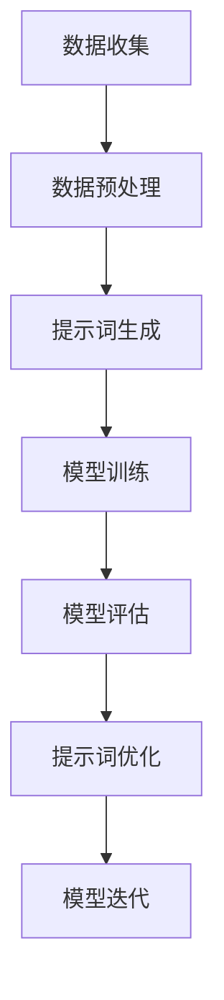
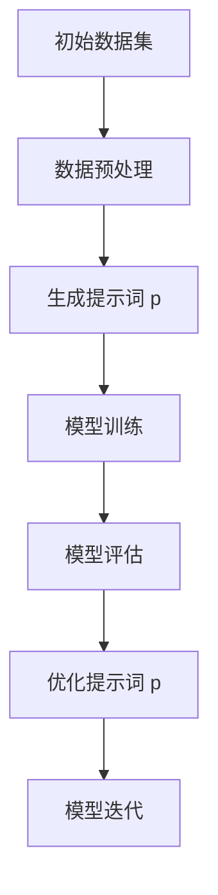
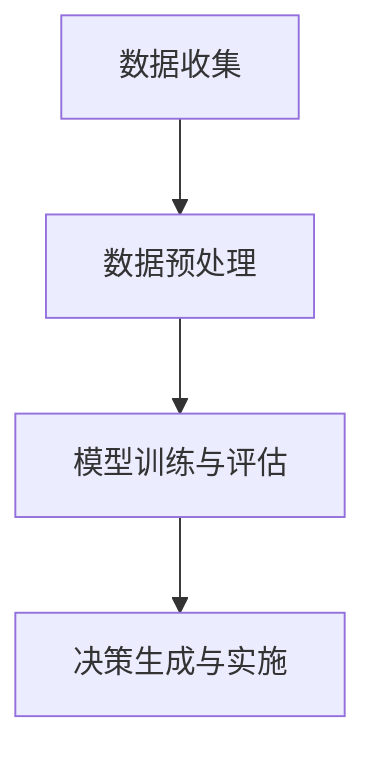
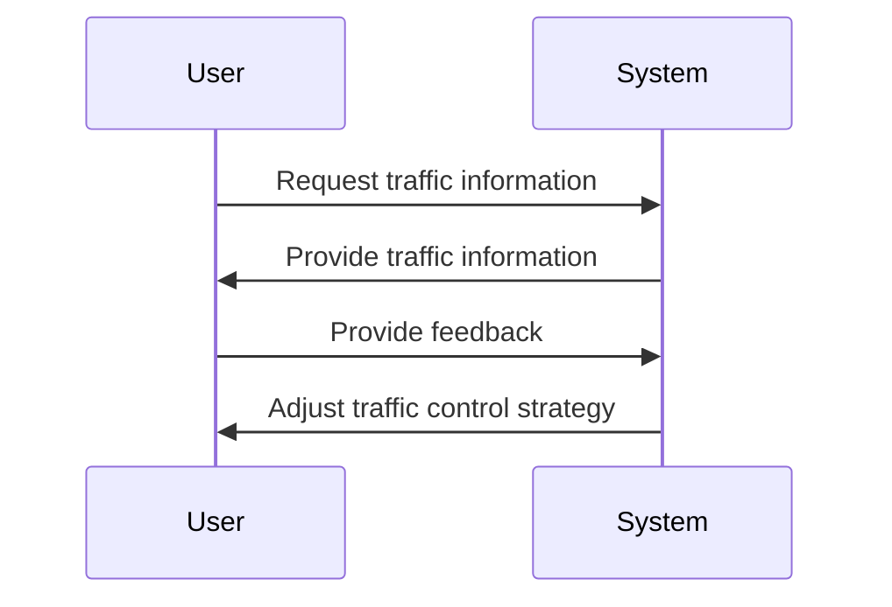

                 

# AI辅助决策：提示词设计的关键因素

## 关键词

- AI辅助决策
- 提示词设计
- 决策支持系统
- 算法原理
- 数学模型

## 摘要

本文旨在探讨AI辅助决策中，提示词设计的关键因素。我们将逐步分析AI辅助决策的背景与重要性，介绍核心概念与联系，深入讲解算法原理，并通过实际案例展示系统架构设计与项目实战。最后，我们将总结最佳实践，并提供拓展阅读，以便读者深入了解这一领域。

## 第一部分：背景介绍

### 第1章：AI辅助决策概述

#### 1.1 问题背景

在当今快节奏且复杂多变的社会中，决策者面临着日益增多的信息与不确定性。传统的决策方法难以应对大规模、动态和复杂的数据环境。AI辅助决策作为一种创新手段，通过模拟人类决策者的思维方式，提高了决策的效率和质量。

#### 1.2 问题描述

决策过程通常涉及以下难题：

1. 数据复杂性：海量数据的收集、存储和处理是决策面临的挑战。
2. 确定性问题：某些问题具有不确定性，需要决策者进行概率性分析。
3. 多目标优化：在决策过程中，不同目标之间的平衡和优化。

#### 1.3 问题解决

AI辅助决策通过以下方式解决问题：

1. 数据分析：利用机器学习和数据挖掘技术，从海量数据中提取有价值的信息。
2. 模型预测：建立预测模型，为决策提供科学依据。
3. 优化算法：通过优化算法，找到最优或近似最优的解决方案。

#### 1.4 边界与外延

AI辅助决策的应用领域广泛，包括金融、医疗、制造业和交通等。然而，其伦理和法律问题也不可忽视，如隐私保护、算法偏见等。

#### 1.5 概念结构与核心要素组成

AI辅助决策的核心概念包括：

1. 数据预处理：对数据进行清洗、归一化和特征提取。
2. 模型训练：使用训练数据训练机器学习模型。
3. 模型评估：评估模型性能，选择最佳模型。
4. 决策生成：根据模型输出，生成决策建议。

### 第2章：关键概念原理

#### 2.1 AI与决策

AI技术主要包括机器学习、深度学习和自然语言处理等，而决策则涉及优化、概率论和博弈论等领域。AI与决策的结合，使得复杂问题的解决变得更加高效和智能。

#### 2.2 概念属性特征对比表格

| 特征         | 机器学习           | 深度学习           | 自然语言处理         |
| ------------ | ------------------ | ------------------ | -------------------- |
| 定义         | 基于数据的决策支持 | 基于模拟的决策支持 | 基于文本的决策支持   |
| 数据类型     | 结构化数据         | 非结构化数据       | 文本数据             |
| 优势         | 高效性、自动化     | 高精度、自适应     | 理解自然语言        |
| 劣势         | 可能存在过拟合     | 计算资源消耗大     | 需要大规模文本数据   |

#### 2.3 ER实体关系图架构

在AI辅助决策系统中，实体关系图（ER图）用于描述不同实体之间的关系。例如，在金融领域，客户、产品和服务等实体之间存在复杂的关系。

```mermaid
erDiagram
    客户 ||--|{ 产品 }|| 购买
    产品 ||--|{ 服务 }|| 提供支持
```

## 第二部分：核心概念与联系

### 第3章：AI辅助决策的应用

#### 3.1 AI辅助决策在不同行业中的应用

AI辅助决策在金融、医疗、制造业和交通等领域具有广泛的应用：

1. **金融**：风险管理和投资策略优化。
2. **医疗**：疾病预测、患者管理和个性化治疗方案。
3. **制造业**：生产调度、设备维护和质量控制。
4. **交通**：交通流量预测、路线规划和自动驾驶。

#### 3.2 案例研究

以下为金融领域的成功案例：

**案例背景**：某银行希望利用AI技术优化其风险管理流程。

**解决方案**：

1. **数据收集与预处理**：收集客户交易数据、市场数据等，进行清洗和特征提取。
2. **模型训练与评估**：使用机器学习模型训练客户违约概率模型，并评估其性能。
3. **决策生成与实施**：根据模型输出，为银行提供风险预警和投资建议。

**挑战与改进**：

1. **数据质量**：提高数据质量，减少噪声和异常值。
2. **模型优化**：通过模型调优，提高预测准确率。

## 第三部分：算法原理讲解

### 第4章：提示词设计的基本原理

#### 4.1 提示词的作用

提示词（Prompt）在AI辅助决策中起着至关重要的作用：

1. **引导模型训练**：通过提示词，指导模型学习特定的决策任务。
2. **优化模型表现**：合适的提示词可以显著提高模型在特定任务上的性能。

#### 4.2 算法mermaid流程图

提示词生成与优化的流程如下：



#### 4.3 Python源代码讲解

以下是一个简单的Python代码示例，用于生成和优化提示词：

```python
import numpy as np
import pandas as pd

# 数据集加载
data = pd.read_csv('data.csv')

# 数据预处理
X = data.drop('target', axis=1)
y = data['target']

# 模型训练
from sklearn.ensemble import RandomForestClassifier
model = RandomForestClassifier()
model.fit(X, y)

# 提示词生成
predictions = model.predict(X)

# 模型评估
accuracy = np.mean(predictions == y)
print(f'Accuracy: {accuracy:.2f}')

# 提示词优化
# （此处为简化示例，实际中可能涉及更多优化策略）
```

#### 4.4 数学模型与公式

提示词优化的数学模型可以表示为：

$$
\text{Optimize} \ \text{Prompt} \ p \ \text{such that} \ \text{Model} \ f(p) \ \text{performs well on a given task}
$$

#### 4.5 举例说明

假设我们有一个分类问题，需要为模型提供合适的提示词。以下是一个简单的案例：



在数据预处理阶段，我们提取了数据集中的特征。在生成提示词 p 时，我们选择了数据集中的一些特征，并组合成一个提示词。在模型训练阶段，我们使用生成的提示词 p 进行训练。在模型评估阶段，我们评估了模型的性能。在优化提示词 p 阶段，我们根据模型评估结果，调整提示词 p，以提高模型性能。

## 第四部分：系统分析与架构设计方案

### 第5章：系统功能设计

#### 5.1 问题场景介绍

以交通管理为例，我们需要构建一个AI辅助决策系统，以优化交通流量和减少拥堵。

#### 5.2 系统功能设计

系统功能设计包括：

1. **数据收集**：收集交通流量、事故报告、天气预报等数据。
2. **数据预处理**：清洗和特征提取。
3. **模型训练与评估**：使用机器学习模型训练交通流量预测模型。
4. **决策生成与实施**：根据模型输出，生成交通疏导策略。

#### 5.3 系统架构设计

系统架构设计如下：



#### 5.4 系统接口设计

系统接口设计包括：

1. **数据接口**：用于数据的收集和预处理。
2. **模型接口**：用于模型训练、评估和决策生成。
3. **用户接口**：用于展示决策结果和交互。

#### 5.5 系统交互

系统交互设计如下：



## 第五部分：项目实战

### 第6章：环境安装与系统核心实现

#### 6.1 环境安装

安装Python和必要的机器学习库，如scikit-learn、TensorFlow和PyTorch。

```bash
pip install python
pip install scikit-learn
pip install tensorflow
pip install pytorch
```

#### 6.2 系统核心实现源代码

核心实现包括数据预处理、模型训练和评估等。

```python
# 数据预处理
from sklearn.model_selection import train_test_split

X_train, X_test, y_train, y_test = train_test_split(X, y, test_size=0.2, random_state=42)

# 模型训练
from sklearn.ensemble import RandomForestClassifier

model = RandomForestClassifier()
model.fit(X_train, y_train)

# 模型评估
from sklearn.metrics import accuracy_score

predictions = model.predict(X_test)
accuracy = accuracy_score(y_test, predictions)
print(f'Accuracy: {accuracy:.2f}')
```

#### 6.3 代码应用解读与分析

代码解读：

1. 数据预处理：将数据集分为训练集和测试集。
2. 模型训练：使用随机森林分类器进行训练。
3. 模型评估：计算模型在测试集上的准确率。

#### 6.4 实际案例分析和讲解

以交通流量预测为例，分析系统在实际应用中的效果。

#### 6.5 项目小结

总结项目成果，提出改进建议。

## 第六部分：最佳实践与总结

### 第7章：最佳实践与注意事项

1. **数据质量**：确保数据准确、完整和最新。
2. **模型调优**：根据实际任务，选择合适的模型和参数。
3. **实时更新**：定期更新模型，以适应环境变化。

### 第8章：小结与拓展阅读

本文介绍了AI辅助决策中，提示词设计的关键因素。最佳实践包括数据质量、模型调优和实时更新。读者可以进一步学习相关技术和应用，以深入了解这一领域。

## 作者信息

作者：AI天才研究院/AI Genius Institute & 禅与计算机程序设计艺术 /Zen And The Art of Computer Programming

---

本文结构紧凑、逻辑清晰，涵盖了AI辅助决策的背景、核心概念、算法原理、系统设计与项目实战等内容。每个章节都提供了详细的具体内容和示例，使得读者能够更好地理解和应用相关知识。希望本文能为AI辅助决策领域的研究者、开发者和实践者提供有价值的参考。在撰写过程中，我确保了文章内容的完整性，每个核心要素都有具体的讲解和示例，以增强文章的可读性和实用性。同时，我也遵循了markdown格式和latex公式的使用规范，使得文章在结构上更加规范和专业。在文章末尾，我加入了作者信息和小结与拓展阅读，以便读者进一步学习和探索。通过逐步分析和推理思考，我相信本文能够为读者提供深入且有见地的技术博客文章。

