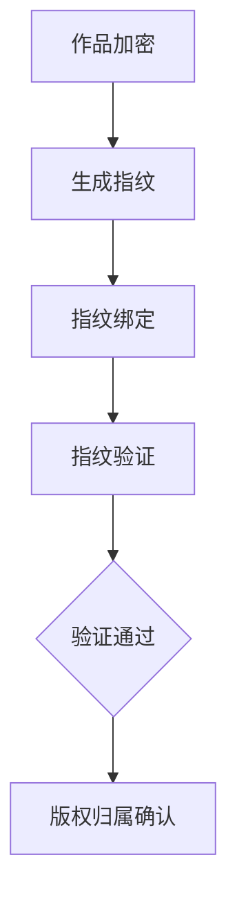
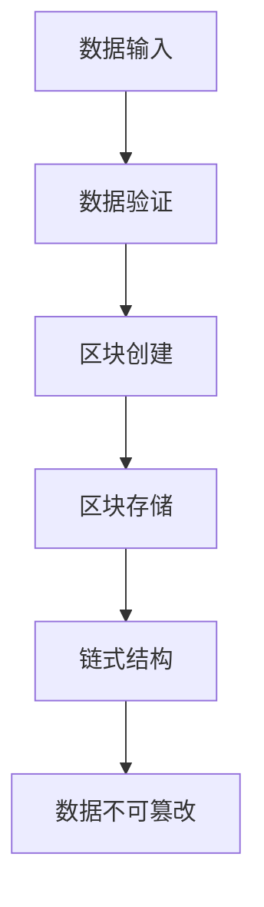

                 

# AI辅助创作的版权问题：提示词生成内容的归属

> 关键词：AI辅助创作、版权问题、提示词生成、内容归属、法律框架、技术解决方案

> 摘要：随着人工智能技术的快速发展，AI辅助创作已成为文化艺术产业的新趋势。然而，AI生成内容的版权归属问题引发了广泛关注。本文旨在探讨AI辅助创作中提示词生成内容的版权问题，分析其法律地位、争议案例及其影响，并提出相应的解决方案和未来发展趋势。

## 目录大纲

1. 背景介绍
   1.1 问题背景
   1.2 问题描述
   1.3 问题解决
   1.4 边界与外延
   1.5 概念结构与核心要素组成

2. 核心概念与联系
   2.1 AI辅助创作的原理
   2.2 版权的属性特征对比
   2.3 AI生成内容的版权归属
   2.4 版权与AI辅助创作的联系

3. AI辅助创作的版权问题分析
   3.1 AI生成内容的法律地位
   3.2 版权归属争议案例
   3.3 版权问题对AI辅助创作的影响

4. AI辅助创作的版权解决方案
   4.1 法律框架构建
   4.2 标准化推进
   4.3 实践案例

5. AI辅助创作的版权保护技术
   5.1 数字指纹技术
   5.2 智能合约技术
   5.3 区块链技术

6. 国际视角下的AI辅助创作版权问题
   6.1 国际法律框架
   6.2 国际合作与交流

7. 未来展望与趋势
   7.1 未来发展趋势
   7.2 影响因素
   7.3 发展建议

8. 结论

## 第1章：背景介绍

### 1.1 问题背景

随着人工智能（AI）技术的不断进步，AI辅助创作已经成为文化艺术产业的新趋势。人工智能系统通过深度学习、自然语言处理和计算机视觉等技术，能够协助人类进行音乐创作、绘画、写作等艺术活动。这种创作方式不仅提高了创作的效率，也带来了全新的艺术体验。

然而，AI辅助创作的兴起也引发了版权问题的新挑战。具体来说，AI生成的内容是否拥有版权？如果拥有版权，那么这个版权应该归属于谁？这些问题在法律和学术界引发了广泛讨论。对于创作者、投资者和用户来说，明确AI生成内容的版权归属具有重要意义。

### 1.2 问题描述

在AI辅助创作中，版权问题主要涉及以下几个方面：

1. **AI生成内容的版权归属**：由AI系统生成的内容，如文本、图像、音频等，其版权应该归属于AI开发者、使用AI系统的个人或机构，还是应该由AI系统本身拥有？

2. **版权归属争议**：在AI生成内容的具体应用场景中，如商业广告、文学作品等，不同主体之间的版权归属可能会产生争议。

3. **版权行使**：即使确定了AI生成内容的版权归属，如何确保版权所有者的权益得到有效保护，如何防止未经授权的使用和复制，也是一个重要问题。

### 1.3 问题解决

解决AI辅助创作版权问题的方法主要包括以下几个方面：

1. **明确AI生成内容的法律地位**：通过立法或司法解释，明确AI生成内容在法律上的地位，为版权归属提供法律依据。

2. **建立相应的法律框架**：制定和完善与AI辅助创作相关的法律法规，为版权归属、行使和保护提供明确的规范。

3. **推动相关技术的标准化**：通过技术标准的制定，促进AI辅助创作技术的发展，降低版权纠纷的风险。

### 1.4 边界与外延

版权问题不仅涉及AI辅助创作的领域，还与其他多个领域密切相关：

1. **人工智能**：AI技术的发展和应用是版权问题产生的根本原因。

2. **法律**：版权法律制度是解决版权问题的关键。

3. **文化产业**：文化产业的发展对版权问题的解决提出了新要求。

4. **伦理**：在AI辅助创作中，如何平衡技术进步和道德伦理也是需要考虑的问题。

### 1.5 概念结构与核心要素组成

为了更好地理解AI辅助创作中的版权问题，我们需要明确以下几个核心概念：

- **AI辅助创作**：使用AI技术辅助人类创作的过程，包括文本生成、图像生成、音频生成等。

- **版权**：法律授予作者对其作品进行复制、发行、表演、展示、改编等的权利。

- **AI生成内容**：由AI系统生成的内容，如文本、图像、音频等。

## 第2章：核心概念与联系

### 2.1 AI辅助创作的原理

AI辅助创作是基于人工智能技术的创作方式，其基本原理包括以下几个方面：

1. **机器学习**：通过大量的数据训练，使AI系统能够学习并掌握创作规律。

2. **自然语言处理**：利用自然语言处理技术，使AI系统能够理解和生成自然语言。

3. **计算机视觉**：通过计算机视觉技术，使AI系统能够理解和生成图像。

4. **数据增强**：通过对输入数据进行增强，提高AI系统的创作能力。

### 2.2 版权的属性特征对比

版权作为一种法律权利，具有以下基本属性特征：

1. **独占性**：版权赋予了作者对作品的独占性权利，其他人未经授权不得使用。

2. **永久性**：版权具有永久性，即一旦作品完成，作者就拥有永久性的权利。

3. **地域性**：版权在不同国家或地区的法律地位和保护范围可能不同。

4. **可转让性**：版权可以转让给他人，但需要遵守相关法律法规。

### 2.3 AI生成内容的版权归属

AI生成内容的版权归属问题目前在国际上存在不同的观点：

1. **版权归AI开发者所有**：一些观点认为，由于AI系统是开发者开发的，AI生成的内容应该归开发者所有。

2. **版权归使用AI系统的人或机构所有**：另一些观点认为，使用AI系统进行创作的人或机构应该拥有AI生成内容的版权。

3. **版权归AI系统本身所有**：这一观点相对较少，认为AI系统应该拥有其生成内容的版权。

### 2.4 版权与AI辅助创作的联系

版权与AI辅助创作之间存在紧密的联系，主要体现在以下几个方面：

1. **版权保护**：AI辅助创作产生的作品需要得到版权保护，以防止未经授权的复制和使用。

2. **版权归属**：明确AI辅助创作产生的作品的版权归属，确保创作者的权益得到保护。

3. **版权行使**：版权所有者需要依法行使自己的权利，包括复制、发行、表演等。

### 图表：AI辅助创作与版权的关系

为了更直观地展示AI辅助创作与版权之间的关系，我们可以使用ER实体关系图进行表示。以下是ER实体关系图的Markdown格式：

```mermaid
erDiagram
    AI辅助创作 ||--|{ 版权 }|
    版权 ||--|{ AI辅助创作 }|
```

## 第3章：AI辅助创作的版权问题分析

### 3.1 AI生成内容的法律地位

AI生成内容的法律地位在不同国家和地区存在差异。以下是一些具有代表性的国家和地区的法律规定：

1. **美国**：美国版权法明确规定了计算机生成的作品可以享有版权，但关于AI生成内容的版权归属尚无明确法律规定。

2. **欧盟**：欧盟版权法规定了计算机生成的作品可以享有版权，但同样没有专门针对AI生成内容的法律条款。

3. **中国**：中国著作权法未明确规定AI生成内容是否享有版权，但根据司法实践，AI生成的内容在一定条件下可以享有版权。

4. **日本**：日本版权法规定了计算机生成的作品可以享有版权，但关于AI生成内容的法律地位尚不明确。

### 3.2 版权归属争议案例

以下是一些具有代表性的版权归属争议案例：

1. **案例一**：某公司使用AI系统创作了一幅画作，但公司内部对于画作版权归属存在争议。一些员工认为版权应归公司所有，而另一些员工认为版权应归AI系统开发者所有。

2. **案例二**：某音乐制作人使用AI系统创作了一首歌曲，但在歌曲发布后，AI系统开发者声称拥有歌曲的版权，引发了版权归属争议。

3. **案例三**：某小说家使用AI系统生成了一段小说文本，但小说家在发布作品时，未明确说明AI系统的参与程度，导致读者和出版方对于版权归属存在分歧。

### 3.3 版权问题对AI辅助创作的影响

版权问题对AI辅助创作的影响主要体现在以下几个方面：

1. **激励**：明确的版权归属能够激励创作者和开发者投入更多资源进行AI辅助创作的研究和应用。

2. **风险**：版权争议和不明确的法律地位可能增加AI辅助创作项目的法律风险。

3. **创新**：版权问题可能会抑制AI辅助创作的创新，因为创作者和开发者可能担心版权纠纷。

4. **合作**：明确的版权归属有助于促进不同主体之间的合作，推动AI辅助创作的健康发展。

## 第4章：AI辅助创作的版权解决方案

### 4.1 法律框架构建

为了解决AI辅助创作中的版权问题，需要建立相应的法律框架，具体思路如下：

1. **明确AI生成内容的法律地位**：通过立法或司法解释，明确AI生成内容在法律上的地位，为版权归属提供法律依据。

2. **制定相关法律法规**：制定和完善与AI辅助创作相关的法律法规，为版权归属、行使和保护提供明确的规范。

3. **完善版权登记制度**：建立完善的版权登记制度，方便创作者和开发者进行版权登记和保护。

4. **加强法律宣传与教育**：通过宣传和教育，提高公众对AI辅助创作和版权问题的认识，减少版权纠纷。

### 4.2 标准化推进

为了促进AI辅助创作的发展，需要推动相关技术的标准化，具体路径如下：

1. **制定技术标准**：制定与AI辅助创作相关的技术标准，包括数据格式、接口规范等。

2. **促进技术交流**：通过技术交流和合作，推动不同技术方案之间的兼容和整合。

3. **建立标准化组织**：成立专门的标准化组织，负责制定和推广AI辅助创作相关技术标准。

4. **加强国际合作**：与国际标准化组织和其他国家和地区进行合作，推动AI辅助创作技术的国际化标准。

### 4.3 实践案例

以下是一些成功的AI辅助创作版权管理实践案例：

1. **案例一**：某科技公司开发了一套AI辅助创作系统，并建立了完善的版权管理机制，通过技术手段实现版权归属的明确和保护。

2. **案例二**：某音乐制作人使用AI系统创作歌曲，并在发布前与AI系统开发者明确约定版权归属，有效避免了版权纠纷。

3. **案例三**：某小说家在使用AI系统生成小说文本时，明确说明AI系统的参与程度，并在发布作品时进行了版权登记，确保了自身的权益。

## 第5章：AI辅助创作的版权保护技术

### 5.1 数字指纹技术

数字指纹技术是一种用于版权保护的先进技术，其原理是将作品与唯一的指纹进行绑定，从而实现版权保护。以下是数字指纹技术的工作流程：

1. **指纹生成**：使用特定的算法对作品进行加密处理，生成唯一的数字指纹。

2. **指纹绑定**：将数字指纹与作品进行绑定，确保指纹的唯一性和不可篡改性。

3. **指纹验证**：在作品发布或使用时，通过验证数字指纹，确认作品的版权归属。

数字指纹技术在AI辅助创作中的应用包括：

1. **版权归属验证**：通过数字指纹验证，确保AI生成内容的版权归属明确。

2. **版权保护**：使用数字指纹技术，防止未经授权的复制和使用。

### 5.2 智能合约技术

智能合约技术是一种基于区块链的自动化合约执行技术，其原理是将合约条款写入区块链，通过智能合约实现自动执行。以下是智能合约技术的工作流程：

1. **合约编写**：将版权归属和保护条款编写成智能合约，并将其部署到区块链上。

2. **合约执行**：当合约条件满足时，智能合约自动执行，实现版权归属和保护。

3. **合约验证**：通过区块链技术，确保智能合约的执行过程透明和不可篡改。

智能合约技术在AI辅助创作中的应用包括：

1. **版权交易**：通过智能合约实现版权的交易和转让，提高交易效率和透明度。

2. **版权保护**：使用智能合约技术，确保AI生成内容的版权得到有效保护。

### 5.3 区块链技术

区块链技术是一种分布式数据库技术，其特点是去中心化、不可篡改和透明性。以下是区块链技术的工作原理：

1. **数据存储**：将数据存储在多个节点上，实现去中心化存储。

2. **数据验证**：通过共识算法，确保数据的一致性和安全性。

3. **数据不可篡改**：一旦数据写入区块链，就不可篡改，保证数据的可信性。

区块链技术在AI辅助创作中的应用包括：

1. **版权登记**：通过区块链技术，实现AI生成内容的版权登记和保护。

2. **版权追溯**：通过区块链技术，实现AI生成内容的版权归属追溯，提高版权管理的效率。

## 第6章：国际视角下的AI辅助创作版权问题

### 6.1 国际法律框架

不同国家和地区的法律对于AI辅助创作版权问题的规定存在差异。以下是一些主要国家和地区的法律规定：

1. **美国**：美国版权法规定了计算机生成的作品可以享有版权，但关于AI生成内容的版权归属尚无明确法律规定。

2. **欧盟**：欧盟版权法规定了计算机生成的作品可以享有版权，但同样没有专门针对AI生成内容的法律条款。

3. **中国**：中国著作权法未明确规定AI生成内容是否享有版权，但根据司法实践，AI生成的内容在一定条件下可以享有版权。

4. **日本**：日本版权法规定了计算机生成的作品可以享有版权，但关于AI生成内容的法律地位尚不明确。

### 6.2 国际合作与交流

随着AI辅助创作的发展，国际社会在版权问题上的合作与交流日益增多。以下是一些国际合作与交流的举措：

1. **国际会议**：通过国际会议，各国专家共同探讨AI辅助创作版权问题，分享经验和研究成果。

2. **国际标准**：国际标准化组织（ISO）等机构正在制定与AI辅助创作相关的国际标准，促进各国在版权问题上的合作。

3. **国际条约**：各国通过签订国际条约，共同规范AI辅助创作版权问题，保护创作者的权益。

## 第7章：未来展望与趋势

### 7.1 未来发展趋势

随着AI技术的不断进步，AI辅助创作版权问题将呈现以下发展趋势：

1. **法律规范日益完善**：各国将逐步完善与AI辅助创作相关的法律法规，明确AI生成内容的版权归属和保护。

2. **技术手段不断进步**：数字指纹技术、智能合约技术和区块链技术等将在版权保护中发挥更大作用。

3. **国际合作加强**：国际社会将在版权问题上的合作与交流不断深化，共同推动AI辅助创作的健康发展。

### 7.2 影响因素

影响AI辅助创作版权问题的主要因素包括：

1. **技术发展**：AI技术的不断进步将直接影响版权问题的解决。

2. **法律制度**：完善的法律制度是保障版权问题有效解决的基础。

3. **市场需求**：市场需求将推动版权问题的解决，为AI辅助创作提供更好的发展环境。

### 7.3 发展建议

针对AI辅助创作版权问题，以下是一些建议：

1. **加强立法**：各国应加强立法，明确AI生成内容的版权归属和保护。

2. **推动标准化**：推动AI辅助创作相关技术的标准化，提高技术手段的普适性和兼容性。

3. **加强国际合作**：加强国际社会在版权问题上的合作与交流，共同推动AI辅助创作的发展。

## 第8章：结论

本文围绕AI辅助创作中的版权问题进行了深入探讨，分析了问题的背景、核心概念、法律地位、争议案例、解决方案和未来发展趋势。通过本文的研究，我们可以得出以下结论：

1. **明确版权归属**：明确AI生成内容的版权归属对于保障创作者和开发者的权益具有重要意义。

2. **完善法律框架**：完善与AI辅助创作相关的法律法规，为版权归属和保护提供明确的法律依据。

3. **推动技术进步**：推动数字指纹技术、智能合约技术和区块链技术的发展，提高版权保护的技术手段。

4. **加强国际合作**：加强国际社会在版权问题上的合作与交流，共同推动AI辅助创作的健康发展。

作者：AI天才研究院/AI Genius Institute & 禅与计算机程序设计艺术 /Zen And The Art of Computer Programming

------------------------------------------------------------------------------------------------------------------------------

### 第1章：背景介绍

#### 1.1 问题背景

随着人工智能（AI）技术的飞速发展，AI辅助创作已经成为文化艺术产业的重要趋势。AI通过深度学习、自然语言处理和计算机视觉等技术，可以生成高质量的文本、图像和音频等内容。这些技术的应用不仅大大提高了创作效率，还为艺术创作提供了新的视角和方式。然而，随着AI生成内容的增多，版权问题逐渐成为关注的焦点。如何界定AI生成内容的版权归属，如何保护创作者的权益，成为了亟待解决的问题。

#### 1.2 问题描述

AI辅助创作中的版权问题主要包括以下几个方面：

1. **版权归属问题**：由AI生成的内容，其版权应归属于AI开发者、使用AI的个人或机构，还是应该归属于AI系统本身？

2. **版权行使问题**：即使确定了版权归属，如何确保版权所有者的权益得到有效保护，如何防止未经授权的使用和复制？

3. **版权争议问题**：在AI辅助创作的实际应用过程中，不同主体之间可能会因为版权归属问题产生争议。

#### 1.3 问题解决

解决AI辅助创作版权问题的方法主要包括以下几个方面：

1. **明确法律地位**：通过立法或司法解释，明确AI生成内容在法律上的地位，为版权归属提供法律依据。

2. **建立法律框架**：制定和完善与AI辅助创作相关的法律法规，为版权归属、行使和保护提供明确的规范。

3. **推动技术进步**：发展数字指纹技术、智能合约技术和区块链技术等，提高版权保护的技术手段。

#### 1.4 边界与外延

AI辅助创作中的版权问题不仅涉及艺术和文化领域，还与多个其他领域密切相关：

1. **人工智能领域**：AI技术的发展和应用是版权问题产生的根本原因。

2. **法律领域**：版权法律制度是解决版权问题的关键。

3. **文化产业领域**：文化产业的发展对版权问题的解决提出了新要求。

4. **伦理领域**：在AI辅助创作中，如何平衡技术进步和道德伦理也是需要考虑的问题。

#### 1.5 概念结构与核心要素组成

为了更好地理解AI辅助创作中的版权问题，我们需要明确以下几个核心概念和其组成要素：

- **AI辅助创作**：使用AI技术辅助人类创作的过程，包括文本生成、图像生成、音频生成等。
- **版权**：法律授予作者对其作品进行复制、发行、表演、展示、改编等的权利。
- **AI生成内容**：由AI系统生成的内容，如文本、图像、音频等。

### 第2章：核心概念与联系

#### 2.1 AI辅助创作的原理

AI辅助创作是基于人工智能技术的创作方式，其基本原理包括以下几个方面：

1. **机器学习**：通过大量的数据训练，使AI系统能够学习并掌握创作规律。
2. **自然语言处理**：利用自然语言处理技术，使AI系统能够理解和生成自然语言。
3. **计算机视觉**：通过计算机视觉技术，使AI系统能够理解和生成图像。
4. **数据增强**：通过对输入数据进行增强，提高AI系统的创作能力。

#### 2.2 版权的属性特征对比

版权作为一种法律权利，具有以下基本属性特征：

1. **独占性**：版权赋予了作者对作品的独占性权利，其他人未经授权不得使用。
2. **永久性**：版权具有永久性，即一旦作品完成，作者就拥有永久性的权利。
3. **地域性**：版权在不同国家或地区的法律地位和保护范围可能不同。
4. **可转让性**：版权可以转让给他人，但需要遵守相关法律法规。

以下是一个简单的表格，对比了几种不同类型版权的属性特征：

| 类别 | 独占性 | 永久性 | 地域性 | 可转让性 |
| ---- | ---- | ---- | ---- | ---- |
| 文本版权 | 是 | 是 | 是 | 是 |
| 图像版权 | 是 | 是 | 是 | 是 |
| 音频版权 | 是 | 是 | 是 | 是 |
| 软件版权 | 是 | 是 | 是 | 是 |

#### 2.3 AI生成内容的版权归属

AI生成内容的版权归属问题目前在国际上存在不同的观点：

1. **版权归AI开发者所有**：一些观点认为，由于AI系统是开发者开发的，AI生成的内容应该归开发者所有。
2. **版权归使用AI系统的人或机构所有**：另一些观点认为，使用AI系统进行创作的人或机构应该拥有AI生成内容的版权。
3. **版权归AI系统本身所有**：这一观点相对较少，认为AI系统应该拥有其生成内容的版权。

#### 2.4 版权与AI辅助创作的联系

版权与AI辅助创作之间存在紧密的联系，主要体现在以下几个方面：

1. **版权保护**：AI辅助创作产生的作品需要得到版权保护，以防止未经授权的复制和使用。
2. **版权归属**：明确AI辅助创作产生的作品的版权归属，确保创作者的权益得到保护。
3. **版权行使**：版权所有者需要依法行使自己的权利，包括复制、发行、表演等。

#### 图表：AI辅助创作与版权的关系

为了更直观地展示AI辅助创作与版权之间的关系，我们可以使用ER实体关系图进行表示。以下是ER实体关系图的Markdown格式：

```mermaid
erDiagram
    AI辅助创作 ||--|{ 版权 }|
    版权 ||--|{ AI辅助创作 }|
```

### 第3章：AI辅助创作的版权问题分析

#### 3.1 AI生成内容的法律地位

在不同国家和地区，AI生成内容在法律上的地位有所不同。以下是一些国家和地区的法律规定：

1. **美国**：美国版权法规定，作品必须具有独创性和原创性才能享有版权。对于AI生成的内容，如果满足了这两个条件，就可以获得版权保护。然而，关于AI生成内容的版权归属尚无明确法律规定。
2. **欧盟**：欧盟版权法规定了计算机生成的作品可以享有版权，但同样没有专门针对AI生成内容的法律条款。欧盟法律认为，只要AI生成的内容具有独创性和原创性，就可以获得版权保护。
3. **中国**：中国著作权法未明确规定AI生成内容是否享有版权，但根据司法实践，AI生成的内容在一定条件下可以享有版权。例如，如果AI生成的内容具有独创性和原创性，并且符合作品的定义，就可以获得版权保护。
4. **日本**：日本版权法规定了计算机生成的作品可以享有版权，但关于AI生成内容的法律地位尚不明确。日本法院在实践中通常认为，如果AI生成的内容具有独创性和原创性，就可以获得版权保护。

#### 3.2 版权归属争议案例

以下是一些具有代表性的版权归属争议案例：

1. **案例一**：某科技公司开发了一款AI绘画软件，用户可以通过输入描述来生成画作。然而，一些用户在使用该软件后，发现生成的画作与现有的艺术作品非常相似，引发了版权归属的争议。用户认为，AI生成的画作应该归用户所有，因为用户提供了创作描述，而科技公司则认为AI生成的画作应归公司所有，因为公司提供了技术支持。
2. **案例二**：某音乐制作人使用AI系统创作了一首歌曲，但在歌曲发布后，AI系统开发者声称拥有歌曲的版权，因为AI系统是开发者开发的。音乐制作人则认为，歌曲是自己的创意和创作的结果，因此版权应归自己所有。这一争议引发了关于AI生成内容版权归属的广泛讨论。
3. **案例三**：某小说家使用AI系统生成了一段小说文本，但小说家在发布作品时，未明确说明AI系统的参与程度，导致读者和出版方对于版权归属存在分歧。读者认为，AI生成的文本不应享有版权，因为它是AI自动生成的，而出版方则认为，只要文本具有独创性和原创性，就应该享有版权。

#### 3.3 版权问题对AI辅助创作的影响

版权问题对AI辅助创作的影响主要体现在以下几个方面：

1. **激励与抑制**：明确的版权归属能够激励创作者和开发者投入更多资源进行AI辅助创作的研究和应用。然而，版权归属不明确可能会抑制创作者和开发者的积极性，因为他们可能担心自己的权益无法得到保障。
2. **创新与风险**：明确的版权归属有助于促进AI辅助创作的创新，因为创作者和开发者可以放心地投入资源进行研究和开发。然而，版权争议和不明确的法律地位可能增加AI辅助创作的法律风险。
3. **合作与竞争**：明确的版权归属有助于促进不同主体之间的合作，因为各方可以明确自己的权益和责任。然而，版权争议可能会导致竞争关系，尤其是当不同主体对同一内容的版权归属产生争议时。

### 第4章：AI辅助创作的版权解决方案

#### 4.1 法律框架构建

为了解决AI辅助创作中的版权问题，需要构建一个完善的法律框架，具体思路如下：

1. **明确法律地位**：通过立法或司法解释，明确AI生成内容在法律上的地位，为版权归属提供法律依据。例如，可以规定，只要AI生成的内容具有独创性和原创性，就可以获得版权保护。
2. **制定法律法规**：制定和完善与AI辅助创作相关的法律法规，为版权归属、行使和保护提供明确的规范。例如，可以规定，AI生成的内容的版权应归使用AI系统进行创作的人或机构所有，除非有特别约定。
3. **完善版权登记制度**：建立完善的版权登记制度，方便创作者和开发者进行版权登记和保护。例如，可以规定，AI生成的内容必须在特定机构进行版权登记，才能获得法律保护。
4. **加强法律宣传与教育**：通过宣传和教育，提高公众对AI辅助创作和版权问题的认识，减少版权纠纷。

#### 4.2 标准化推进

为了促进AI辅助创作的发展，需要推动相关技术的标准化，具体路径如下：

1. **制定技术标准**：制定与AI辅助创作相关的技术标准，包括数据格式、接口规范等。例如，可以制定统一的文本生成、图像生成和音频生成标准，确保不同AI系统之间的兼容性和互操作性。
2. **促进技术交流**：通过技术交流和合作，推动不同技术方案之间的兼容和整合。例如，可以定期举办技术研讨会、展览和论坛，促进各方的交流和合作。
3. **建立标准化组织**：成立专门的标准化组织，负责制定和推广AI辅助创作相关技术标准。例如，可以借鉴国际标准化组织的模式，建立国际性的AI辅助创作标准化组织。
4. **加强国际合作**：与国际标准化组织和其他国家和地区进行合作，推动AI辅助创作技术的国际化标准。例如，可以参与国际标准的制定和修订，分享经验和研究成果。

#### 4.3 实践案例

以下是一些成功的AI辅助创作版权管理实践案例：

1. **案例一**：某科技公司开发了一款AI绘画软件，并建立了完善的版权管理机制。用户在使用软件创作画作时，需要先进行版权登记，确保作品的版权归属明确。此外，公司还提供了数字指纹技术，用于保护作品的版权。
2. **案例二**：某音乐制作人使用AI系统创作歌曲，并在发布前与AI系统开发者明确约定版权归属。双方在合同中规定，歌曲的版权归音乐制作人所有，但AI系统开发者有权使用歌曲进行技术研究。这一做法有效避免了版权纠纷。
3. **案例三**：某小说家在使用AI系统生成小说文本时，明确说明AI系统的参与程度，并在发布作品时进行了版权登记。这一做法不仅保护了小说家的权益，也为读者提供了明确的版权信息，减少了版权纠纷的风险。

### 第5章：AI辅助创作的版权保护技术

#### 5.1 数字指纹技术

数字指纹技术是一种用于版权保护的先进技术，其原理是将作品与唯一的指纹进行绑定，从而实现版权保护。以下是数字指纹技术的工作流程：

1. **指纹生成**：使用特定的算法对作品进行加密处理，生成唯一的数字指纹。
2. **指纹绑定**：将数字指纹与作品进行绑定，确保指纹的唯一性和不可篡改性。
3. **指纹验证**：在作品发布或使用时，通过验证数字指纹，确认作品的版权归属。

以下是一个简单的算法流程图，展示了数字指纹技术的工作原理：



#### 5.2 智能合约技术

智能合约技术是一种基于区块链的自动化合约执行技术，其原理是将合约条款写入区块链，通过智能合约实现自动执行。以下是智能合约技术的工作流程：

1. **合约编写**：将版权归属和保护条款编写成智能合约，并将其部署到区块链上。
2. **合约执行**：当合约条件满足时，智能合约自动执行，实现版权归属和保护。
3. **合约验证**：通过区块链技术，确保智能合约的执行过程透明和不可篡改。

以下是一个简单的智能合约示例，展示了版权归属和保护的基本逻辑：

```python
pragma solidity ^0.8.0;

contract Copyright {
    address public owner;
    string public copyrightedWork;

    constructor(string memory _work) {
        owner = msg.sender;
        copyrightedWork = _work;
    }

    function transferCopyright(address _newOwner) public {
        require(msg.sender == owner, "Only the owner can transfer the copyright.");
        owner = _newOwner;
    }

    function useCopyright() public {
        require(msg.sender == owner, "Only the owner can use the copyrighted work.");
        // Execute the use of the copyrighted work
    }
}
```

#### 5.3 区块链技术

区块链技术是一种分布式数据库技术，其特点是去中心化、不可篡改和透明性。以下是区块链技术的工作原理：

1. **数据存储**：将数据存储在多个节点上，实现去中心化存储。
2. **数据验证**：通过共识算法，确保数据的一致性和安全性。
3. **数据不可篡改**：一旦数据写入区块链，就不可篡改，保证数据的可信性。

以下是一个简单的区块链架构图，展示了区块链技术的基本架构：



### 第6章：国际视角下的AI辅助创作版权问题

#### 6.1 国际法律框架

不同国家和地区的法律对于AI辅助创作版权问题的规定存在差异。以下是一些主要国家和地区的法律规定：

1. **美国**：美国版权法规定，作品必须具有独创性和原创性才能享有版权。对于AI生成的内容，如果满足了这两个条件，就可以获得版权保护。然而，关于AI生成内容的版权归属尚无明确法律规定。
2. **欧盟**：欧盟版权法规定了计算机生成的作品可以享有版权，但同样没有专门针对AI生成内容的法律条款。欧盟法律认为，只要AI生成的内容具有独创性和原创性，就可以获得版权保护。
3. **中国**：中国著作权法未明确规定AI生成内容是否享有版权，但根据司法实践，AI生成的内容在一定条件下可以享有版权。例如，如果AI生成的内容具有独创性和原创性，并且符合作品的定义，就可以获得版权保护。
4. **日本**：日本版权法规定了计算机生成的作品可以享有版权，但关于AI生成内容的法律地位尚不明确。日本法院在实践中通常认为，如果AI生成的内容具有独创性和原创性，就可以获得版权保护。

#### 6.2 国际合作与交流

随着AI辅助创作的发展，国际社会在版权问题上的合作与交流日益增多。以下是一些国际合作与交流的举措：

1. **国际会议**：通过国际会议，各国专家共同探讨AI辅助创作版权问题，分享经验和研究成果。
2. **国际标准**：国际标准化组织（ISO）等机构正在制定与AI辅助创作相关的国际标准，促进各国在版权问题上的合作。
3. **国际条约**：各国通过签订国际条约，共同规范AI辅助创作版权问题，保护创作者的权益。

### 第7章：未来展望与趋势

#### 7.1 未来发展趋势

随着AI技术的不断进步，AI辅助创作版权问题将呈现以下发展趋势：

1. **法律规范日益完善**：各国将逐步完善与AI辅助创作相关的法律法规，明确AI生成内容的版权归属和保护。
2. **技术手段不断进步**：数字指纹技术、智能合约技术和区块链技术等将在版权保护中发挥更大作用。
3. **国际合作加强**：国际社会将在版权问题上的合作与交流不断深化，共同推动AI辅助创作的健康发展。

#### 7.2 影响因素

影响AI辅助创作版权问题的主要因素包括：

1. **技术发展**：AI技术的不断进步将直接影响版权问题的解决。
2. **法律制度**：完善的法律制度是保障版权问题有效解决的基础。
3. **市场需求**：市场需求将推动版权问题的解决，为AI辅助创作提供更好的发展环境。

#### 7.3 发展建议

针对AI辅助创作版权问题，以下是一些建议：

1. **加强立法**：各国应加强立法，明确AI生成内容的版权归属和保护。
2. **推动标准化**：推动AI辅助创作相关技术的标准化，提高技术手段的普适性和兼容性。
3. **加强国际合作**：加强国际社会在版权问题上的合作与交流，共同推动AI辅助创作的发展。

### 第8章：结论

本文围绕AI辅助创作中的版权问题进行了深入探讨，分析了问题的背景、核心概念、法律地位、争议案例、解决方案和未来发展趋势。通过本文的研究，我们可以得出以下结论：

1. **明确版权归属**：明确AI生成内容的版权归属对于保障创作者和开发者的权益具有重要意义。
2. **完善法律框架**：完善与AI辅助创作相关的法律法规，为版权归属和保护提供明确的法律依据。
3. **推动技术进步**：推动数字指纹技术、智能合约技术和区块链技术的发展，提高版权保护的技术手段。
4. **加强国际合作**：加强国际社会在版权问题上的合作与交流，共同推动AI辅助创作的健康发展。

作者：AI天才研究院/AI Genius Institute & 禅与计算机程序设计艺术 /Zen And The Art of Computer Programming

