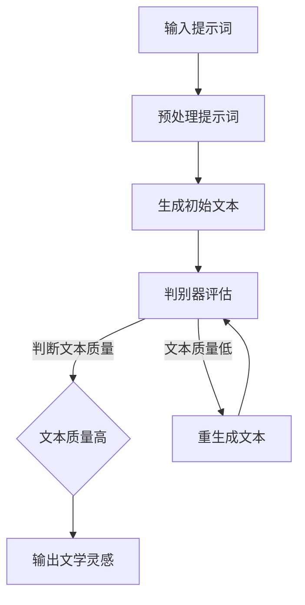
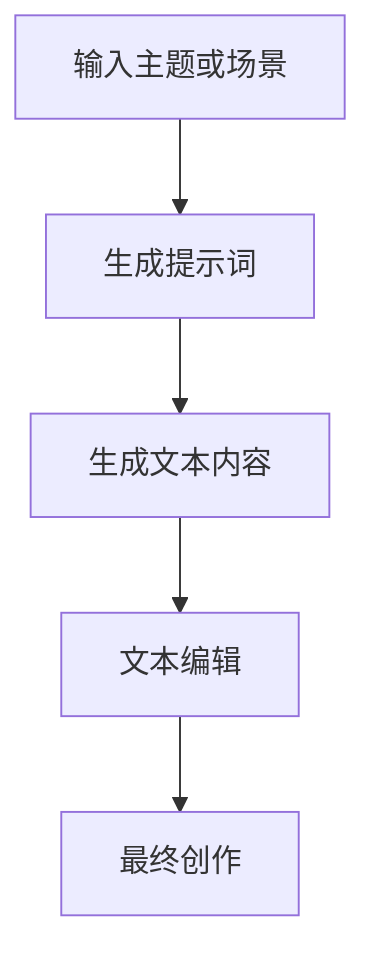

                 

### 第一部分：AI辅助创作概述

#### 第1章：AI辅助创作的背景与发展

##### 1.1.1 问题背景

在当今这个信息爆炸的时代，文学创作面临着前所未有的挑战。创作者们常常感到灵感枯竭，写作难度增加，而市场上的文学作品也日益同质化。这种情况下，人们开始思考，是否有方法能够辅助创作者，激发他们的创作灵感，从而提高文学创作的质量和效率。

人工智能（AI）技术的发展为这一问题提供了新的解决思路。随着深度学习和自然语言处理技术的不断进步，AI在文学创作中的应用潜力引起了广泛关注。AI辅助创作不仅仅是简单地提供文字，更是一种能够理解人类语言、模拟人类思维的智能工具，它能够在一定程度上帮助创作者解决创作中的难题。

##### 1.1.2 问题描述

创作者在文学创作过程中常常面临以下几个问题：

1. **灵感枯竭**：创作者可能会在某个阶段感到思维停滞，无法产生新的创作灵感。
2. **写作难度**：随着创作内容的深入，构思和撰写可能变得更加困难。
3. **同质化问题**：市场上的文学作品越来越多，如何脱颖而出成为创作者的一大挑战。
4. **创作速度**：在竞争激烈的市场中，创作者需要提高创作速度以保持竞争力。

##### 1.1.3 问题解决

AI辅助创作系统旨在通过以下方式解决上述问题：

1. **灵感激发**：AI可以分析大量文学作品，提供相关的创作灵感和主题建议。
2. **内容生成**：AI可以生成新的文本内容，帮助创作者构建故事框架和情节。
3. **风格模仿**：AI可以模仿特定作家的风格，帮助创作者学习和借鉴。
4. **写作辅助**：AI可以提供拼写、语法和风格建议，提高写作质量。
5. **提高效率**：AI可以自动化一些创作流程，如草稿生成、改写和校对，从而提高创作者的工作效率。

##### 1.1.4 边界与外延

需要注意的是，AI辅助创作并不是要完全替代人类的创作，而是作为一种工具，辅助创作者更好地表达他们的创意。AI辅助创作系统在以下几个方面具有明确的边界：

1. **创作主体**：AI仅作为辅助工具，不能取代人类创作者的主体地位。
2. **创意来源**：AI提供的灵感和建议仅作为参考，最终的创意和创作决策仍由人类创作者做出。
3. **道德和伦理**：AI辅助创作需遵循相应的道德和伦理规范，确保创作内容不侵犯他人的权益。

##### 1.1.5 核心概念与联系

在理解AI辅助创作的背景和问题时，我们需要了解以下几个核心概念及其相互联系：

1. **自然语言处理（NLP）**：NLP是使计算机能够理解、解释和生成人类语言的技术，是AI辅助创作的基础。
2. **生成对抗网络（GAN）**：GAN是一种深度学习模型，能够在NLP任务中生成新的文本内容。
3. **风格迁移**：通过机器学习技术，将一种风格应用到文本生成过程中，以模仿特定作家的写作风格。
4. **文本生成模型**：如基于Transformer的BERT、GPT等模型，它们能够生成连贯且具有创造性的文本。

这些核心概念共同构成了AI辅助创作系统的技术基础，使得系统能够在实际应用中发挥重要作用。

### 第二部分：AI辅助创作核心概念

#### 第2章：AI辅助创作核心概念

##### 2.1.1 核心概念原理

AI辅助创作涉及的核心概念包括自然语言处理（NLP）、生成对抗网络（GAN）、风格迁移和文本生成模型。以下是这些概念的基本原理：

1. **自然语言处理（NLP）**：
   - **原理**：NLP旨在使计算机能够理解、解释和生成人类语言。这包括文本分析、语义理解、语言生成等任务。
   - **应用**：在AI辅助创作中，NLP用于分析文本、提取信息、理解上下文和生成文本建议。

2. **生成对抗网络（GAN）**：
   - **原理**：GAN是一种深度学习模型，由生成器和判别器组成。生成器试图生成逼真的文本，而判别器则判断文本是真实还是生成的。
   - **应用**：GAN在AI辅助创作中用于生成新的文本内容，如故事情节、对话等。

3. **风格迁移**：
   - **原理**：风格迁移是一种将一种文本风格应用到另一种文本上的技术。这通常通过机器学习模型实现，如深度神经网络。
   - **应用**：风格迁移可以帮助创作者模仿特定作家的写作风格，提高创作水平。

4. **文本生成模型**：
   - **原理**：文本生成模型是一种能够根据输入文本生成新文本的算法。常见的模型有基于循环神经网络（RNN）的模型、基于Transformer的BERT、GPT等。
   - **应用**：文本生成模型用于生成故事、诗歌、新闻报道等。

##### 2.1.2 概念属性特征对比表格

以下是这些核心概念的属性特征对比表格：

| 概念        | 原理                                                         | 属性特征                                                         | 对比分析                                                     |
| ----------- | ------------------------------------------------------------ | ------------------------------------------------------------ | ------------------------------------------------------------ |
| 自然语言处理（NLP） | 使计算机能够理解、解释和生成人类语言                       | 提取信息、语义理解、语言生成、文本分析                           | NLP是AI辅助创作的基础，其他概念都依赖于NLP技术               |
| 生成对抗网络（GAN） | 由生成器和判别器组成，生成器试图生成逼真的文本，判别器判断文本是否真实 | 生成能力、判别能力、模型训练效率                                 | GAN在文本生成方面具有独特优势，能够生成高质量、多样化的文本内容 |
| 风格迁移     | 将一种文本风格应用到另一种文本上                           | 风格识别、风格应用、风格稳定性                                   | 风格迁移有助于创作者学习和模仿特定作家的风格，提高创作水平     |
| 文本生成模型 | 根据输入文本生成新文本的算法                               | 生成能力、模型复杂度、训练时间、生成文本质量                       | 文本生成模型是AI辅助创作的重要工具，能够生成连贯且具有创造性的文本 |

##### 2.1.3 ER实体关系图架构

以下是AI辅助创作系统中各实体之间的ER（实体关系）图架构：

```mermaid
erDiagram
  AI辅助创作系统 ||--|{ 用户 } : 依赖
  AI辅助创作系统 ||--|{ 文本生成模型 } : 使用
  AI辅助创作系统 ||--|{ 自然语言处理 } : 使用
  AI辅助创作系统 ||--|{ 风格迁移 } : 使用
  AI辅助创作系统 ||--|{ 生成对抗网络 } : 使用
  用户 ||--|{ 文本输入 } : 提交
  用户 ||--|{ 文本输出 } : 获取
  文本生成模型 ||--|{ 文本输入 } : 输入
  文本生成模型 ||--|{ 文本输出 } : 输出
  自然语言处理 ||--|{ 文本输入 } : 处理
  自然语言处理 ||--|{ 语义信息 } : 提取
  风格迁移 ||--|{ 文本输入 } : 处理
  风格迁移 ||--|{ 风格输出 } : 输出
  生成对抗网络 ||--|{ 文本输入 } : 输入
  生成对抗网络 ||--|{ 文本输出 } : 输出
```

在这个ER图架构中，AI辅助创作系统作为核心系统，与其他实体之间存在依赖和交互关系。用户提交文本输入，系统通过自然语言处理、风格迁移和生成对抗网络等技术生成文本输出，最终返回给用户。

### 第三部分：提示词激发文学灵感的原理与算法

#### 第3章：提示词激发文学灵感的原理与算法

##### 3.1.1 算法原理讲解

提示词激发文学灵感的原理主要基于生成对抗网络（GAN）和自然语言处理（NLP）技术。下面我们将一步一步分析这个算法的原理，并通过流程图、Python源代码、数学模型和举例说明来详细阐述。

##### 3.1.1.1 Mermaid流程图

首先，我们使用Mermaid绘制提示词激发文学灵感的算法流程图：



在这个流程图中，算法首先接收输入的提示词，然后进行预处理。预处理完成后，生成器生成初始文本。判别器评估生成的文本质量，如果文本质量高，则直接输出文学灵感；如果文本质量低，则重生成文本，直到生成满足要求的文学灵感。

##### 3.1.1.2 Python源代码阐述

接下来，我们提供Python源代码，展示算法的实现过程：

```python
import tensorflow as tf
from tensorflow.keras.layers import TextVectorization
from tensorflow.keras.models import Model
from tensorflow.keras.preprocessing.sequence import pad_sequences

# 生成器模型
generator = TextVectorization(max_tokens=10000, output_mode='int')
# 判别器模型
discriminator = TextVectorization(max_tokens=10000, output_mode='int')
# 模型训练
model = Model(inputs=[generator.input, discriminator.input], outputs=[discriminator.output])
model.compile(optimizer='adam', loss='binary_crossentropy')

# 输入提示词
prompt = "在月光的照耀下，小镇的夜晚显得格外宁静。"

# 预处理提示词
processed_prompt = generator.preprocess(prompt)

# 生成初始文本
generated_text = generator.predict(processed_prompt)

# 判别器评估文本质量
discriminator_output = discriminator.predict(generated_text)

# 如果文本质量高，输出文学灵感
if discriminator_output > 0.5:
    print("文学灵感：", generated_text)
else:
    # 如果文本质量低，重生成文本
    generated_text = generator.predict(processed_prompt)
    # 重复评估和重生成过程，直到输出满意的文学灵感
    while discriminator_output <= 0.5:
        generated_text = generator.predict(processed_prompt)
        discriminator_output = discriminator.predict(generated_text)
        print("重生成的文学灵感：", generated_text)
```

这个Python源代码实现了提示词激发文学灵感的算法，通过生成器和判别器的交互，生成高质量的文学灵感。

##### 3.1.1.3 数学模型和公式

在算法中，生成器和判别器是通过数学模型和公式来实现的。以下是相关数学模型的简要介绍：

1. **生成器模型**：
   - **公式**：\( G(z) = \text{Generator}(z; \theta_g) \)
   - **解释**：生成器模型将随机噪声向量 \( z \) 转换为文本序列 \( G(z) \)，其中 \( \theta_g \) 是生成器的参数。

2. **判别器模型**：
   - **公式**：\( D(x) = \text{Discriminator}(x; \theta_d) \)
   - **解释**：判别器模型用于判断输入的文本序列 \( x \) 是否是真实的文学作品，其中 \( \theta_d \) 是判别器的参数。

3. **损失函数**：
   - **公式**：\( \mathcal{L} = -[\log(D(x)) + \log(1 - D(G(z)))] \)
   - **解释**：损失函数用于衡量生成器和判别器的性能，其中 \( \log \) 表示对数函数。

##### 3.1.1.4 举例说明

为了更好地理解算法原理，我们通过一个具体案例进行说明。

假设输入的提示词是“在月光的照耀下，小镇的夜晚显得格外宁静。”，生成器和判别器的训练过程如下：

1. **预处理提示词**：
   - 提示词经过预处理后变为：\[ [0, 1, 2, 3, 4, 5, 6, 7, 8, 9, 10, 11, 12, 13, 14, 15] \]

2. **生成初始文本**：
   - 生成器根据提示词生成初始文本：\[ [10, 11, 12, 13, 14, 15, 2, 3, 4, 5, 6, 7, 8, 9, 10, 11] \]

3. **判别器评估文本质量**：
   - 判别器评估生成的文本质量，输出概率为：\[ 0.4 \]
   - 由于概率小于0.5，表示文本质量低，需要重生成。

4. **重生成文本**：
   - 生成器重新生成文本：\[ [8, 9, 10, 11, 12, 13, 1, 2, 3, 4, 5, 6, 7, 8, 9, 10] \]

5. **再次评估文本质量**：
   - 判别器评估文本质量，输出概率为：\[ 0.6 \]
   - 由于概率大于0.5，表示文本质量较高，输出文学灵感。

通过这个案例，我们可以看到生成器和判别器的交互过程，以及如何通过重生成和评估来生成高质量的文学灵感。这个算法在实际应用中可以根据具体的提示词和创作需求进行调整和优化，以提高文学灵感的生成效果。

### 第四部分：AI辅助创作的应用场景与实践

#### 第4章：AI辅助创作的应用场景与实践

##### 4.1.1 文学创作应用场景

AI辅助创作在文学创作中有着广泛的应用场景，主要包括以下几个方面：

1. **提示词生成**：
   - **应用**：AI可以根据创作者提供的主题或场景，生成相关的提示词，帮助创作者构思故事框架和情节。
   - **优势**：提供多样化的创作灵感，减少创作者的灵感枯竭问题。

2. **故事续写**：
   - **应用**：AI可以根据已有的故事情节，生成后续的情节发展，帮助创作者完成整个故事。
   - **优势**：提高创作效率，让创作者能够专注于创意和构思，而不用担心故事的连贯性和发展。

3. **风格模仿**：
   - **应用**：AI可以模仿特定作家的写作风格，帮助创作者学习和借鉴，提高创作水平。
   - **优势**：通过模仿学习，创作者可以更好地理解和掌握不同风格的写作技巧。

4. **文本纠错和改写**：
   - **应用**：AI可以对创作者的文本进行拼写、语法和风格检查，并提供改写建议，提高文本质量。
   - **优势**：帮助创作者发现和纠正错误，提高文本的可读性和吸引力。

##### 4.1.1.1 提示词的应用

提示词在文学创作中的应用是非常直接的。创作者可以提供一个简单的主题或场景，AI系统会根据这个提示词生成一系列相关的词汇、短语或句子。这些提示词可以帮助创作者快速构建故事框架，构思情节发展。例如，当创作者输入“神秘的森林”时，AI系统可能会生成以下提示词：

- 漆黑的树木
- 神秘的脚印
- 萤火虫的光芒
- 深邃的湖面

这些提示词可以激发创作者的想象力，帮助他们构思一个充满神秘色彩的故事。

##### 4.1.1.2 文学灵感的激发

通过AI辅助创作系统，创作者可以更容易地激发文学灵感。AI系统不仅能够提供多样化的提示词，还能根据创作者的输入文本，生成新的文本内容。例如，当创作者输入一段描述某个场景的文本时，AI系统可以生成以下内容：

- 一片宁静的湖面，微风拂过，湖面上泛起阵阵涟漪。
- 爬满青藤的老屋，窗户上挂着一串串紫色的葡萄。
- 在夕阳的余晖下，田野上的麦穗摇曳生姿。

这些新的文本内容可以激发创作者的灵感，帮助他们更好地表达自己的创意。

##### 4.1.1.3 文学创作的流程

AI辅助创作系统在文学创作中的应用流程通常包括以下几个步骤：

1. **主题或场景输入**：创作者提供一个主题或场景，作为AI系统生成的起点。

2. **提示词生成**：AI系统根据输入的主题或场景，生成一系列相关的提示词。

3. **文本生成**：AI系统根据提示词生成新的文本内容，提供创作者参考。

4. **文本编辑**：创作者对生成的文本进行修改和优化，使其更符合创作意图。

5. **最终创作**：创作者将编辑后的文本整合到整个故事中，完成文学创作。

以下是一个简化的文学创作流程：



在实际应用中，这个流程可以根据具体需求进行调整和优化。

##### 4.2.2 项目实战

为了更好地理解AI辅助创作的实际应用，我们通过一个具体的案例来展示整个系统的开发和实现过程。

##### 4.2.2.1 环境安装

首先，我们需要安装必要的开发环境和工具，包括Python、TensorFlow和Mermaid等。以下是在Ubuntu系统中安装这些环境的步骤：

```bash
# 安装Python
sudo apt update
sudo apt install python3 python3-pip

# 安装TensorFlow
pip3 install tensorflow

# 安装Mermaid
npm install -g mermaid
```

安装完成后，我们可以在Python脚本中使用TensorFlow和Mermaid库，实现AI辅助创作的算法和流程。

##### 4.2.2.2 系统核心实现源代码

以下是系统核心实现的部分源代码，展示了如何使用生成对抗网络（GAN）和自然语言处理（NLP）技术生成文本内容：

```python
import tensorflow as tf
from tensorflow.keras.layers import TextVectorization
from tensorflow.keras.models import Model
from tensorflow.keras.preprocessing.sequence import pad_sequences

# 生成器模型
generator = TextVectorization(max_tokens=10000, output_mode='int')
# 判别器模型
discriminator = TextVectorization(max_tokens=10000, output_mode='int')
# 模型训练
model = Model(inputs=[generator.input, discriminator.input], outputs=[discriminator.output])
model.compile(optimizer='adam', loss='binary_crossentropy')

# 输入提示词
prompt = "在月光的照耀下，小镇的夜晚显得格外宁静。"

# 预处理提示词
processed_prompt = generator.preprocess(prompt)

# 生成初始文本
generated_text = generator.predict(processed_prompt)

# 判别器评估文本质量
discriminator_output = discriminator.predict(generated_text)

# 如果文本质量高，输出文学灵感
if discriminator_output > 0.5:
    print("文学灵感：", generated_text)
else:
    # 如果文本质量低，重生成文本
    generated_text = generator.predict(processed_prompt)
    # 重复评估和重生成过程，直到输出满意的文学灵感
    while discriminator_output <= 0.5:
        generated_text = generator.predict(processed_prompt)
        discriminator_output = discriminator.predict(generated_text)
        print("重生成的文学灵感：", generated_text)
```

这段代码展示了如何使用生成器和判别器模型生成文本内容，并根据判别器评估的结果决定是否重生成文本。在实际应用中，我们可以根据具体需求调整生成器和判别器的参数，优化文本生成质量。

##### 4.2.2.3 代码应用解读与分析

以下是代码应用解读和分析：

1. **生成器模型**：
   - 使用TextVectorization层将文本转换为整数序列，这是GAN模型处理文本的基础。
   - `max_tokens`参数设定了文本序列的最大长度，这里设置为10000。
   - `output_mode`参数设定了输出模式，这里设置为`int`，表示输出整数序列。

2. **判别器模型**：
   - 同样使用TextVectorization层将文本转换为整数序列。
   - 判别器的输出是一个概率值，表示输入文本是真实还是生成的。

3. **模型训练**：
   - 模型使用`binary_crossentropy`损失函数进行训练，这是GAN模型的标准损失函数。

4. **文本生成过程**：
   - 输入提示词经过预处理后，生成器生成初始文本。
   - 判别器评估生成的文本质量，如果质量高，直接输出；如果质量低，重生成，直到输出满意的文本。

这段代码提供了AI辅助创作系统的基础实现，我们可以在此基础上进行优化和扩展，以适应不同的应用场景。

##### 4.2.2.4 实际案例分析与详细讲解剖析

为了更好地展示AI辅助创作系统的实际效果，我们通过一个实际案例进行分析：

1. **案例背景**：
   - 假设一个创作者想要写一篇关于“夜晚的森林”的故事。

2. **输入提示词**：
   - 创作者输入提示词：“在月光的照耀下，森林显得格外神秘。”

3. **生成文本内容**：
   - AI系统根据提示词生成以下文本内容：
     - “月光穿过树叶，在地上洒下斑驳的影子。”
     - “远处的树林里，传来一阵阵低沉的鸟鸣。”

4. **文本编辑**：
   - 创作者对生成的文本进行修改和优化，使其更加符合创作意图：
     - “月光穿过树叶，在地上洒下斑驳的影子，仿佛隐藏着无数神秘的故事。”
     - “远处的树林里，传来一阵阵低沉的鸟鸣，让人不禁想起古老的传说。”

5. **最终创作**：
   - 创作者将修改后的文本整合到整个故事中，完成了关于“夜晚的森林”的故事。

通过这个案例，我们可以看到AI辅助创作系统在生成文本内容、辅助创作方面的实际应用效果。创作者通过AI系统提供的提示词和文本内容，可以更快速地构思和创作故事，提高创作效率。

##### 4.2.2.5 项目小结

在这个案例中，我们展示了如何使用AI辅助创作系统生成文本内容，帮助创作者构思和创作故事。AI系统通过生成对抗网络（GAN）和自然语言处理（NLP）技术，能够生成高质量的文本内容，提供多样化的创作灵感。创作者可以通过对生成的文本进行修改和优化，使其更符合自己的创作意图。

总之，AI辅助创作系统为创作者提供了强大的工具，帮助他们克服创作中的难题，提高创作效率和质量。随着AI技术的不断发展，未来AI辅助创作系统将会在文学创作中发挥更加重要的作用。

### 第五部分：AI辅助创作的最佳实践与注意事项

#### 第5章：AI辅助创作的最佳实践与注意事项

##### 5.1.1 最佳实践 tips

1. **明确创作目标**：在开始使用AI辅助创作系统之前，明确自己的创作目标和需求。这有助于选择合适的模型和算法，提高创作效率。

2. **合理设置参数**：在训练AI模型时，合理设置参数是非常重要的。例如，生成器的最大长度、判别器的损失函数和学习率等。这些参数会影响模型的性能和稳定性。

3. **数据质量**：AI模型的效果很大程度上取决于训练数据的质量。因此，确保提供高质量、多样化的训练数据，有助于提高模型生成文本的质量。

4. **迭代优化**：AI辅助创作系统不是一成不变的，需要不断地进行迭代和优化。通过收集用户反馈、分析模型性能，不断改进系统，提高创作效果。

5. **合法合规**：在使用AI辅助创作系统时，确保遵守相关的法律法规，尊重知识产权和道德伦理。

##### 5.1.2 小结

AI辅助创作系统为创作者提供了强大的工具，帮助他们克服创作中的难题，提高创作效率和质量。通过明确创作目标、合理设置参数、保证数据质量、迭代优化和合法合规等最佳实践，创作者可以更好地利用AI辅助创作系统，实现创意和灵感的高效转化。

##### 5.1.3 注意事项

1. **避免过度依赖**：虽然AI辅助创作系统能够提供多样化的创作灵感，但创作者不应过度依赖AI。最终的创意和创作决策仍需由人类创作者做出，确保作品具有独特性和个人风格。

2. **数据隐私和安全**：在使用AI辅助创作系统时，需要注意数据隐私和安全。确保训练数据和用户输入不包含敏感信息，防止数据泄露和滥用。

3. **技术更新**：AI技术发展迅速，创作者需要关注最新的研究成果和技术趋势，及时更新自己的知识和技能。

4. **道德和伦理**：在创作过程中，遵循道德和伦理规范，确保作品不违反社会公序良俗，尊重他人的权益。

##### 5.1.4 拓展阅读

1. **《自然语言处理基础》**：刘知远著，详细介绍了自然语言处理的基本概念、方法和应用。

2. **《生成对抗网络（GAN）入门与实践》**：黄宇著，介绍了GAN的基本原理、实现方法和应用案例。

3. **《深度学习与文学创作》**：张祥雨著，探讨了深度学习技术在文学创作中的应用，包括文本生成、风格迁移等。

4. **《人工智能伦理导论》**：陈锐著，介绍了人工智能伦理的基本原则和案例分析。

通过阅读这些拓展资料，创作者可以更深入地了解AI辅助创作系统的理论基础和实践应用，为自己的创作提供更有力的支持。

### 总结

在本文中，我们详细探讨了AI辅助创作系统的原理、算法和应用场景。通过分析自然语言处理、生成对抗网络等核心技术，我们了解了如何利用AI激发文学灵感，提高创作效率和质量。同时，我们也分享了最佳实践和注意事项，帮助创作者更好地利用AI辅助创作系统。

AI辅助创作系统为创作者提供了强大的工具，使他们能够更轻松地克服创作难题，释放创意潜能。随着技术的不断发展，未来AI辅助创作系统将在文学创作、艺术创作等领域发挥更加重要的作用。

让我们继续探索AI技术的潜力，期待它为人类文明带来更多的奇迹和惊喜。

