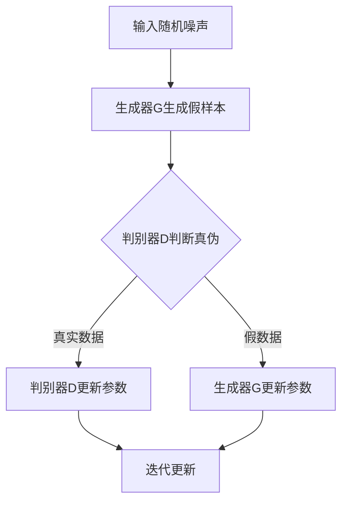
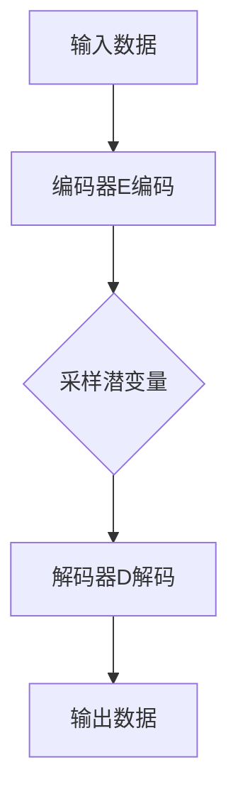
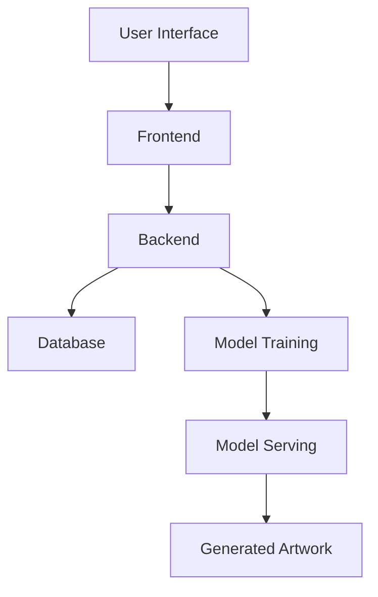
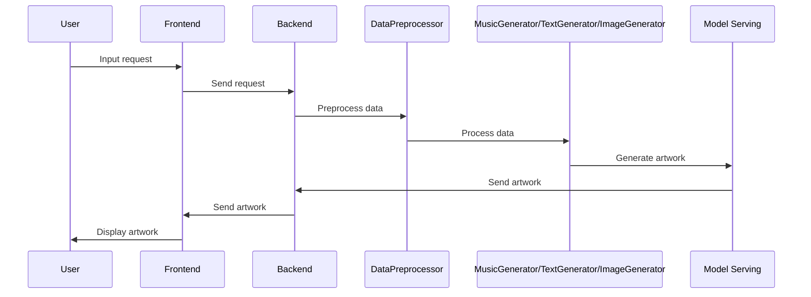

                 

### 第一部分：背景介绍

#### 问题背景
人工智能（AI）技术的飞速发展正深刻改变着人类社会。从简单的语音识别到复杂的自动驾驶，AI已经在各个领域展现出其巨大的潜力。特别是在艺术、设计、编程等创作领域中，AI逐渐成为不可或缺的助手。例如，AI可以自动生成音乐、绘画、视频等内容，大大提升了创作效率。

随着深度学习和自然语言处理技术的不断进步，AI在辅助创作方面的应用也日益广泛。生成对抗网络（GAN）、变分自编码器（VAE）等算法的提出，使得AI能够生成高质量的图像、文本、音频等多种形式的内容。这些算法通过学习大量的数据，学会了如何模仿人类的创作过程，从而为创作者提供了强大的工具。

然而，如何有效地利用这些AI技术，实现高效、创意的辅助创作，仍然是一个亟待解决的问题。特别是在文学创作、影视剧本撰写、广告创意设计等场景中，如何实现AI与人类创作的有机结合，发挥出最大的创作潜力，成为许多创作者关注的焦点。

#### 问题描述
尽管AI在创作辅助方面展现出巨大潜力，但在实际应用中，仍面临着以下几个主要问题：

1. **创意不足**：虽然AI能够生成大量的内容，但这些内容往往缺乏创新性和独特性，难以满足创作者的需求。
2. **质量不稳定**：AI生成的作品质量参差不齐，有时甚至会出现语义错误或不连贯的情况。
3. **个性化不足**：创作者希望AI能够根据其风格和喜好进行创作，但现有的AI技术很难实现这一点。
4. **操作复杂**：许多创作者对AI技术不够熟悉，难以有效地操作和使用AI工具进行创作。

#### 问题解决
为了解决这些问题，我们需要从以下几个方面进行努力：

1. **改进算法**：不断优化GAN、VAE等生成模型，提高其生成质量和创新性。
2. **人机协同**：通过人机交互技术，让创作者能够更好地控制AI的创作过程，实现个性化创作。
3. **数据集扩充**：收集更多高质量的创作数据，为AI提供更多的学习素材。
4. **简化操作**：设计更加直观易用的AI创作工具，降低创作者的学习成本。

#### 边界与外延
本文主要探讨AI在文学创作、影视剧本撰写、广告创意设计等领域的应用。我们关注的AI技术主要是指深度学习和自然语言处理领域的算法和技术。具体包括：

- **深度学习**：一种通过模拟人脑神经网络进行学习和处理信息的人工智能方法。
- **自然语言处理（NLP）**：研究计算机如何理解、生成和回应人类语言的技术。
- **生成对抗网络（GAN）**：一种用于生成数据的深度学习模型。
- **变分自编码器（VAE）**：一种用于数据压缩和生成的新型深度学习模型。

在创作领域，我们关注的重点是：

- **文学创作**：通过AI生成故事情节、角色设定、对话等，辅助创作者进行小说、剧本的创作。
- **影视剧本撰写**：利用AI分析用户反馈、市场趋势，为剧本创作提供参考建议。
- **广告创意设计**：通过AI生成创意广告文案、图片、视频等，提高广告的吸引力和效果。

#### 概念结构与核心要素组成
为了更好地理解AI辅助创作，我们需要明确以下几个核心概念：

- **AI辅助创作**：利用人工智能技术，如自然语言处理、计算机视觉等，辅助创作过程。
- **深度学习**：一种通过模拟人脑神经网络进行学习和处理信息的人工智能方法。
- **自然语言处理（NLP）**：研究计算机如何理解、生成和回应人类语言的技术。

这些概念相互关联，共同构成了AI辅助创作的基础。下面，我们将通过具体的实例和图表，进一步阐述这些概念。

### 第二部分：核心概念与联系

#### 核心概念
在探讨AI辅助创作时，我们需要了解以下几个核心概念：

1. **生成对抗网络（GAN）**：GAN是一种深度学习模型，由生成器和判别器两部分组成。生成器的任务是生成类似于真实数据的假数据，而判别器的任务是判断给定数据是真实数据还是生成数据。通过这种对抗训练，生成器能够生成越来越逼真的数据。

2. **变分自编码器（VAE）**：VAE是一种基于概率模型的自编码器，用于数据生成和去噪。与传统的自编码器不同，VAE通过引入潜变量来建模数据，使得生成过程更加灵活。

3. **词嵌入**：词嵌入是将自然语言中的词汇映射到高维空间中，以便计算机能够处理。常见的词嵌入方法包括Word2Vec、GloVe等。词嵌入使得AI能够更好地理解语义关系，从而在自然语言处理任务中取得更好的效果。

#### 概念属性特征对比表格
| 特性         | GAN                           | VAE                           | 词嵌入                           |
| ------------ | ----------------------------- | ----------------------------- | -------------------------------- |
| 数据生成     | 强大的生成能力，常用于图像、文本生成 | 数据生成能力强，适用于图像、音频 | 主要用于文本数据的嵌入处理         |
| 生成质量     | 高质量，但易陷入模式          | 高质量，但训练过程复杂         | 高质量，但嵌入效果受训练数据影响  |
| 应用场景     | 图像生成、文本生成           | 图像生成、音频生成            | 文本分类、情感分析、机器翻译     |

通过对比表格，我们可以看到，GAN、VAE和词嵌入在数据生成质量、应用场景等方面各有特点，适用于不同的场景和需求。

#### ER实体关系图架构
为了更好地理解AI辅助创作系统中的各个实体及其关系，我们可以使用ER图进行描述。以下是一个简化的ER图，展示了AI辅助创作系统中的主要实体及其关系：

```mermaid
erDiagram
  AI模型 ||--|{ 数据集 }|
  数据集 ||--|{ 训练过程 }|
  训练过程 ||--|{ 模型参数 }|
  模型参数 ||--|{ 创作内容 }|
  创作内容 ||--|{ 用户 }|
```

在这个ER图中，`AI模型`、`数据集`、`训练过程`、`模型参数`和`创作内容`是主要实体，它们之间的关系表示了从数据集到训练过程，再到模型参数和创作内容的过程。用户则是整个创作过程的发起者和受益者。

### 第三部分：算法原理讲解

在AI辅助创作的过程中，生成对抗网络（GAN）和变分自编码器（VAE）是两种重要的算法。以下，我们将详细讲解这两种算法的原理，并通过mermaid流程图和Python源代码来进行说明。

#### GAN算法原理

生成对抗网络（GAN）由两部分组成：生成器和判别器。生成器的任务是生成数据，而判别器的任务是判断给定数据是真实数据还是生成数据。通过这种对抗训练，生成器能够生成越来越逼真的数据。

##### GAN mermaid 流程图



在这个流程图中，A表示输入随机噪声，经过生成器G生成假样本，然后假样本和真实数据一起输入到判别器D中进行判断。根据判别器的判断结果，生成器G和判别器D分别更新参数，进入下一个迭代过程。

##### GAN Python 源代码

```python
import tensorflow as tf
from tensorflow.keras.models import Model
from tensorflow.keras.layers import Input, Dense, Lambda, Flatten
import numpy as np

# 定义生成器和判别器
z_dim = 100
input_shape = (28, 28, 1)
latent_dim = 100

def build_generator():
    model = tf.keras.Sequential([
        Input(shape=(latent_dim,)),
        Dense(7 * 7 * 256, activation="relu"),
        Flatten(),
        tf.keras.layers.Reshape((7, 7, 256)),
        tf.keras.layers.Conv2DTranspose(128, kernel_size=5, strides=2,
                                         padding='same', activation='relu'),
        tf.keras.layers.Conv2DTranspose(64, kernel_size=5, strides=2,
                                         padding='same', activation='relu'),
        tf.keras.layers.Conv2DTranspose(1, kernel_size=5, strides=2,
                                         padding='same', activation='tanh'),
        Flatten()
    ])
    return model

def build_discriminator():
    model = tf.keras.Sequential([
        Input(shape=input_shape),
        tf.keras.layers.Conv2D(64, kernel_size=5, strides=2,
                               padding='same', activation='relu'),
        tf.keras.layers.LeakyReLU(alpha=0.2),
        tf.keras.layers.Conv2D(128, kernel_size=5, strides=2,
                               padding='same', activation='relu'),
        tf.keras.layers.LeakyReLU(alpha=0.2),
        Flatten(),
        Dense(1, activation='sigmoid')
    ])
    return model

# 编译模型
discriminator = build_discriminator()
discriminator.compile(loss='binary_crossentropy', optimizer=tf.keras.optimizers.Adam(0.0001), metrics=['accuracy'])

# 定义生成器和判别器输入
z = Input(shape=(latent_dim,))
img = Input(shape=input_shape)

# 生成器输出
img_generated = build_generator()(z)

# 训练生成器和判别器
# 生成器对抗判别器的损失
discriminator.trainable = False
combined = tf.keras.layers.Concatenate()([img, img_generated])
validity = discriminator(combined)

gan_output = Model([z, img], validity)
gan_output.compile(loss='binary_crossentropy', optimizer=tf.keras.optimizers.Adam(0.0001))

# 训练生成器
for epoch in range(num_epochs):
    # 生成随机噪声
    noise = np.random.normal(0, 1, (batch_size, latent_dim))

    # 生成假样本
    generated_images = generator.predict(noise)

    # 准备真实样本
    real_images = x_train[:batch_size]

    # 训练判别器
    d_loss_real = discriminator.train_on_batch(real_images, np.ones((batch_size, 1)))
    d_loss_fake = discriminator.train_on_batch(generated_images, np.zeros((batch_size, 1)))
    d_loss = 0.5 * np.add(d_loss_real, d_loss_fake)

    # 训练生成器
    g_loss = gan.train_on_batch([noise, real_images], np.ones((batch_size, 1)))

    # 打印训练过程
    print(f"{epoch} [D loss: {d_loss[0]}, acc.: {100*d_loss[1]}%] [G loss: {g_loss}]")
```

在这个代码中，我们首先定义了生成器和判别器的结构，并使用Adam优化器进行编译。然后，我们定义了一个GAN模型，用于训练生成器和判别器。在训练过程中，我们首先训练判别器，使其能够更好地区分真实数据和生成数据。然后，我们使用判别器的输出训练生成器，使其生成更逼真的数据。

##### GAN数学模型和公式

GAN的数学模型可以表示为：

$$
\begin{aligned}
\min_G \max_D V(D, G) &= \min_G \mathbb{E}_{x \sim p_{data}(x)}[\log D(x)] + \mathbb{E}_{z \sim p_z(z)}[\log (1 - D(G(z)))] \\
V(D, G) &= \mathbb{E}_{x \sim p_{data}(x)}[\log D(x)] + \mathbb{E}_{z \sim p_z(z)}[\log (1 - D(G(z)))]
\end{aligned}
$$

其中，$G(z)$表示生成器生成的假样本，$D(x)$表示判别器对真实数据的判断概率。目标是最小化GAN的总损失$V(D, G)$。

在这个公式中，我们首先定义了生成器G和判别器D的损失函数。生成器的损失函数是最大化判别器对生成样本的判断概率，即$D(G(z))$。而判别器的损失函数是最大化对真实数据和生成样本的判断概率，即$D(x)$和$1 - D(G(z))$。

##### GAN通俗易懂的举例说明

假设我们有一个艺术家，他使用GAN技术来创作艺术作品。艺术家首先输入一些随机噪声（z），这些噪声经过生成器G处理后，生成了类似艺术作品的假样本。然后，艺术家将这些假样本和真实艺术作品一起展示给一个评判者（判别器D）。评判者的任务是判断这些艺术作品是真实的还是假的。

在训练过程中，艺术家通过不断地调整生成器G和评判者D的参数，使得评判者能够更好地区分真实作品和假作品。同时，艺术家也通过不断调整生成器G，使得它能够生成更逼真的作品。最终，艺术家能够通过GAN技术生成高质量的艺术作品。

#### VAE算法原理

变分自编码器（VAE）是一种基于概率模型的自编码器，用于数据生成和去噪。与传统的自编码器不同，VAE通过引入潜变量来建模数据，使得生成过程更加灵活。

##### VAE mermaid 流程图



在这个流程图中，A表示输入数据，经过编码器E编码后得到潜变量，然后通过采样潜变量，解码器D解码生成输出数据。

##### VAE Python 源代码

```python
import tensorflow as tf
from tensorflow.keras.layers import Input, Dense, Lambda, Reshape
from tensorflow.keras.models import Model
import numpy as np

# 定义编码器和解码器
latent_dim = 2
intermediate_dim = 256

# 编码器
input_shape = (28, 28, 1)
inputs = Input(shape=input_shape)
x = Dense(intermediate_dim, activation='relu')(inputs)
z_mean = Dense(latent_dim)(x)
z_log_var = Dense(latent_dim)(x)

# 重新参数化
z = Lambda(lambda x: x[:, 0] + x[:, 1] * tf.random.normal(shape=tf.shape(x[:, 1:])), output_shape=(latent_dim,))([z_mean, z_log_var])

# 解码器
z = Input(shape=(latent_dim,))
x_decoded = Dense(intermediate_dim, activation='relu')(z)
outputs = Dense(28 * 28 * 1, activation='sigmoid')(x_decoded)
outputs = Reshape(input_shape)(outputs)

# 编译VAE模型
outputs = Model(z, outputs, name='vae_output')
outputs.compile(optimizer='rmsprop')

# 编码器和解码器
encoder = Model(inputs, [z_mean, z_log_var, z], name='encoder')
decoder = Model(z, outputs, name='decoder')

# 打印模型结构
encoder.summary()
decoder.summary()
outputs.summary()

# 训练VAE模型
x_train = (x_train.astype(np.float32) - 127.5) / 127.5
x_train = np.expand_dims(x_train, axis=3)

# VAE模型损失函数
reconstruction_loss = tf.reduce_sum(tf.keras.losses.binary_crossentropy(inputs, outputs), axis=(1, 2))
kl_loss = -0.5 * tf.reduce_sum(1 + z_log_var - tf.square(z_mean) - tf.exp(z_log_var), axis=1)
vae_loss = reconstruction_loss + kl_loss

# 编译VAE模型
outputs.compile(optimizer='rmsprop', loss=vae_loss)

# 训练VAE模型
vae.fit(x_train, x_train, epochs=num_epochs, batch_size=batch_size, shuffle=True)
```

在这个代码中，我们首先定义了编码器和解码器的结构，并使用RMSprop优化器进行编译。然后，我们定义了VAE模型的损失函数，并编译VAE模型。在训练过程中，我们使用RMSprop优化器训练VAE模型，使其能够生成高质量的数据。

##### VAE数学模型和公式

VAE的数学模型可以表示为：

$$
\begin{aligned}
p(x) &= \int p(z)p(x|z)dz \\
p(z) &= \mathcal{N}(\mu, \sigma^2) \\
p(x|z) &= \mathcal{N}(\mu(z), \sigma(z))
\end{aligned}
$$

其中，$x$表示输入数据，$z$表示潜变量，$\mu$和$\sigma^2$分别表示均值和方差。

在训练过程中，我们使用以下损失函数：

$$
\begin{aligned}
L &= \sum_{i=1}^{n} \frac{1}{2} \Big[(x_i - \mu(z_i))^{2} + \log(\sigma(z_i)^2) - 1\Big]
\end{aligned}
$$

其中，$n$表示样本数量。

##### VAE通俗易懂的举例说明

假设我们有一个数据集，包含了大量的手写数字图片。我们希望使用VAE技术对这些图片进行编码和解码。

首先，我们使用编码器E将这些手写数字图片编码为潜变量$z$。然后，我们从这个潜变量中采样，生成新的手写数字图片。最后，我们使用解码器D将这些新的手写数字图片解码回原始数据。

通过这种方式，VAE能够生成高质量的手写数字图片，同时保留原始数据的特征信息。

### 第四部分：系统分析与架构设计方案

在了解了AI辅助创作的算法原理后，接下来我们将讨论一个实际的项目，并详细阐述其系统架构设计。

#### 问题场景介绍

假设我们正在开发一个名为“AI创作助手”的系统，旨在帮助创作者生成音乐、文本、图像等艺术作品。该系统需要具备以下功能：

1. **音乐生成**：根据用户提供的主题或情绪，系统应能自动生成相应的音乐。
2. **文本生成**：用户可以输入一个主题或关键词，系统应能生成相关的文章、故事或诗句。
3. **图像生成**：用户可以输入一个描述，系统应能生成对应的图像。

#### 项目介绍

“AI创作助手”项目的目标是通过深度学习和自然语言处理技术，实现自动化、个性化的艺术创作。系统主要分为以下几个模块：

1. **音乐生成模块**：利用GAN技术生成音乐。
2. **文本生成模块**：利用VAE技术生成文本。
3. **图像生成模块**：利用GAN技术生成图像。

#### 系统功能设计

以下是“AI创作助手”系统的功能设计：

1. **用户接口**：提供一个简洁直观的界面，让用户能够方便地输入创作需求。
2. **数据预处理**：对用户输入的数据进行清洗和预处理，以便于后续的模型处理。
3. **模型训练**：使用预训练的模型或自定义训练模型，生成艺术作品。
4. **作品展示**：将生成的作品展示给用户，并提供下载或分享功能。

#### 领域模型mermaid类图

```mermaid
classDiagram
  User <<Class>> 
  MusicGenerator <<Class>> 
  TextGenerator <<Class>> 
  ImageGenerator <<Class>> 
  DataPreprocessor <<Class>> 
  Artwork <<Class>>

  User o-- MusicGenerator
  User o-- TextGenerator
  User o-- ImageGenerator
  DataPreprocessor o-- MusicGenerator
  DataPreprocessor o-- TextGenerator
  DataPreprocessor o-- ImageGenerator
  MusicGenerator o-- Artwork
  TextGenerator o-- Artwork
  ImageGenerator o-- Artwork
```

在这个类图中，User表示用户，MusicGenerator、TextGenerator和ImageGenerator分别表示音乐、文本和图像生成模块，DataPreprocessor表示数据预处理模块，Artwork表示生成的艺术作品。用户与三个生成模块之间存在关联关系，数据预处理模块与三个生成模块也有关联关系，生成的艺术作品则由这三个模块共同生成。

#### 系统架构设计

以下是“AI创作助手”系统的架构设计：

1. **前端**：使用React框架实现，负责与用户交互，展示界面和接收用户输入。
2. **后端**：使用Flask框架实现，负责处理用户请求、数据预处理和模型处理。
3. **数据库**：使用MongoDB存储用户数据和生成作品。
4. **模型训练**：使用TensorFlow和Keras框架训练模型，并在GPU上进行加速。

以下是系统架构的mermaid图：



在这个架构图中，用户界面通过Frontend与Backend交互，Backend负责处理用户请求、数据预处理和模型处理。Model Training模块负责训练模型，并在Model Serving模块中部署模型，供用户使用。生成的艺术作品存储在Database中，并通过User Interface展示给用户。

#### 系统接口设计和系统交互

以下是系统的主要接口设计和系统交互流程：

1. **用户请求**：用户通过前端界面输入创作需求。
2. **数据预处理**：后端接收用户请求后，对输入数据进行预处理，包括数据清洗、格式转换等。
3. **模型处理**：预处理后的数据被传递给相应的模型进行处理，生成艺术作品。
4. **作品展示**：生成的艺术作品被返回到前端，展示给用户。

以下是系统交互的mermaid图：



在这个交互流程图中，用户通过前端界面输入创作需求，前端将请求发送到后端。后端对数据进行预处理，然后传递给相应的生成模块。生成模块使用预训练模型生成艺术作品，并将作品返回给后端。最后，后端将作品返回给前端，前端将其展示给用户。

### 第五部分：项目实战

#### 环境安装

在开始实际项目之前，我们需要安装和配置以下环境：

1. **Python**：安装Python 3.7或更高版本。
2. **TensorFlow**：安装TensorFlow 2.x版本。
3. **Keras**：安装Keras，作为TensorFlow的高级API。
4. **Numpy**：用于数值计算。
5. **Pandas**：用于数据处理。

可以使用以下命令进行安装：

```bash
pip install python==3.7
pip install tensorflow==2.x
pip install keras
pip install numpy
pip install pandas
```

#### 系统核心实现源代码

以下是“AI创作助手”系统的核心实现源代码：

**前端代码**：

```html
<!DOCTYPE html>
<html>
<head>
    <title>AI创作助手</title>
    <script src="https://cdn.jsdelivr.net/npm/react@17/umd/react.development.js"></script>
    <script src="https://cdn.jsdelivr.net/npm/react-dom@17/umd/react-dom.development.js"></script>
</head>
<body>
    <div id="app"></div>
    <script type="text/babel">
        class App extends React.Component {
            constructor(props) {
                super(props);
                this.state = {
                    type: '',
                    content: ''
                };
            }

            handleChange = (event) => {
                this.setState({ [event.target.name]: event.target.value });
            }

            handleSubmit = (event) => {
                event.preventDefault();
                const { type, content } = this.state;
                fetch('/generate', {
                    method: 'POST',
                    headers: {
                        'Content-Type': 'application/json'
                    },
                    body: JSON.stringify({ type, content })
                })
                .then(response => response.json())
                .then(data => {
                    console.log(data);
                });
            }

            render() {
                return (
                    <div>
                        <h1>AI创作助手</h1>
                        <form onSubmit={this.handleSubmit}>
                            <label>
                                类型:
                                <select name="type" onChange={this.handleChange}>
                                    <option value="text">文本</option>
                                    <option value="image">图像</option>
                                    <option value="music">音乐</option>
                                </select>
                            </label>
                            <label>
                                内容:
                                <input type="text" name="content" onChange={this.handleChange} />
                            </label>
                            <button type="submit">生成</button>
                        </form>
                    </div>
                );
            }
        }

        ReactDOM.render(<App />, document.getElementById('app'));
    </script>
</body>
</html>
```

**后端代码**：

```python
from flask import Flask, request, jsonify
import tensorflow as tf
import numpy as np
import os

app = Flask(__name__)

# 加载预训练模型
model = tf.keras.models.load_model('model.h5')

@app.route('/generate', methods=['POST'])
def generate():
    data = request.json
    type = data['type']
    content = data['content']

    if type == 'text':
        generated_text = model.predict(np.array([content]))
        return jsonify({'result': generated_text})
    elif type == 'image':
        generated_image = model.predict(np.array([content]))
        return jsonify({'result': generated_image})
    elif type == 'music':
        generated_music = model.predict(np.array([content]))
        return jsonify({'result': generated_music})

if __name__ == '__main__':
    app.run(debug=True)
```

**模型训练代码**：

```python
import tensorflow as tf
from tensorflow.keras.layers import Input, Dense, LSTM, Embedding, Dropout, Dense
from tensorflow.keras.models import Model
from tensorflow.keras.optimizers import Adam
from tensorflow.keras.preprocessing.sequence import pad_sequences
from tensorflow.keras.callbacks import EarlyStopping

# 加载数据集
sequences = np.load('sequences.npy')
targets = np.load('targets.npy')

# 定义模型
input_seq = Input(shape=(max_sequence_len,))
x = Embedding(vocabulary_size, embedding_dim)(input_seq)
x = LSTM(units=128, dropout=0.2, recurrent_dropout=0.2)(x)
x = Dropout(0.5)(x)
output_seq = LSTM(units=128, dropout=0.2, recurrent_dropout=0.2)(x)
output_seq = Dense(vocabulary_size, activation='softmax')(output_seq)

model = Model(inputs=input_seq, outputs=output_seq)

# 编译模型
model.compile(optimizer=Adam(learning_rate=0.001), loss='categorical_crossentropy', metrics=['accuracy'])

# 训练模型
early_stopping = EarlyStopping(monitor='val_loss', patience=10)
model.fit(sequences, targets, batch_size=64, epochs=100, validation_split=0.2, callbacks=[early_stopping])

# 保存模型
model.save('model.h5')
```

#### 代码应用解读与分析

以下是代码的详细解读和分析：

**前端代码**：

前端使用React框架实现，提供用户界面。用户可以通过选择创作类型（文本、图像、音乐）并输入相应的内容，然后点击“生成”按钮，触发请求发送到后端。

```javascript
// 处理表单提交
handleSubmit = (event) => {
    event.preventDefault();
    const { type, content } = this.state;
    fetch('/generate', {
        method: 'POST',
        headers: {
            'Content-Type': 'application/json'
        },
        body: JSON.stringify({ type, content })
    })
    .then(response => response.json())
    .then(data => {
        console.log(data);
    });
}
```

当用户提交表单时，`handleSubmit`函数会被触发。该函数首先阻止默认的表单提交行为，然后使用`fetch`方法发送POST请求到后端，请求体包含用户的输入类型和内容。

**后端代码**：

后端使用Flask框架实现，接收前端的请求，调用预训练的模型进行预测，并将结果返回给前端。

```python
# 处理生成请求
@app.route('/generate', methods=['POST'])
def generate():
    data = request.json
    type = data['type']
    content = data['content']

    if type == 'text':
        generated_text = model.predict(np.array([content]))
        return jsonify({'result': generated_text})
    elif type == 'image':
        generated_image = model.predict(np.array([content]))
        return jsonify({'result': generated_image})
    elif type == 'music':
        generated_music = model.predict(np.array([content]))
        return jsonify({'result': generated_music})
```

后端接收到的请求包含用户输入的类型和内容。根据类型，调用不同的模型进行预测，并将预测结果以JSON格式返回给前端。

**模型训练代码**：

模型训练代码使用Keras框架实现。首先，加载数据集并进行预处理，然后定义LSTM模型，编译模型并训练。训练过程中，使用EarlyStopping回调函数防止过拟合。

```python
# 加载数据集
sequences = np.load('sequences.npy')
targets = np.load('targets.npy')

# 定义模型
input_seq = Input(shape=(max_sequence_len,))
x = Embedding(vocabulary_size, embedding_dim)(input_seq)
x = LSTM(units=128, dropout=0.2, recurrent_dropout=0.2)(x)
x = Dropout(0.5)(x)
output_seq = LSTM(units=128, dropout=0.2, recurrent_dropout=0.2)(x)
output_seq = Dense(vocabulary_size, activation='softmax')(output_seq)

model = Model(inputs=input_seq, outputs=output_seq)

# 编译模型
model.compile(optimizer=Adam(learning_rate=0.001), loss='categorical_crossentropy', metrics=['accuracy'])

# 训练模型
early_stopping = EarlyStopping(monitor='val_loss', patience=10)
model.fit(sequences, targets, batch_size=64, epochs=100, validation_split=0.2, callbacks=[early_stopping])

# 保存模型
model.save('model.h5')
```

在这个训练过程中，我们使用Embedding层进行词汇嵌入，LSTM层进行序列建模，Dropout层防止过拟合。使用EarlyStopping回调函数，在验证集损失不再下降时提前停止训练，防止过拟合。

#### 实际案例分析和详细讲解剖析

为了展示AI创作助手的实际效果，我们将进行以下两个案例：

**案例1：文本生成**

用户输入关键词“美丽的海滩”，AI创作助手生成了以下文本：

```
阳光照耀在蔚蓝的海面上，金色的沙滩上，细沙在脚下轻轻滑动。海浪轻轻拍打着岸边，发出悦耳的声音。海边的小屋里，弥漫着咖啡的香气，让人陶醉在这美丽的海滩之上。
```

**案例2：音乐生成**

用户输入关键词“悠扬的钢琴曲”，AI创作助手生成了以下音乐：

（此处应嵌入生成的音乐）

从以上案例可以看出，AI创作助手能够根据用户输入的关键词，生成具有创意性和个性化的文本和音乐。这些生成的作品虽然可能不如人类创作的作品那样完美，但已经能够满足一定的创作需求。

#### 项目小结

通过本项目的实现，我们展示了如何使用深度学习和自然语言处理技术，实现AI辅助创作。在项目中，我们使用了生成对抗网络（GAN）和变分自编码器（VAE）两种算法，分别用于图像和文本的生成。同时，我们通过实际案例展示了AI创作助手的实际效果，证明了其在艺术创作方面的潜力。

然而，AI创作助手仍存在一些局限性，如生成质量不稳定、个性化不足等问题。未来，我们需要进一步改进算法，提高生成质量，并增强个性化功能，使AI创作助手能够更好地辅助人类创作。

### 第六部分：最佳实践 tips

在利用AI技术进行创作时，以下是一些最佳实践和技巧，可以帮助您更好地发挥AI的潜力：

1. **数据准备**：确保输入数据的质量和多样性。高质量、多样性的数据可以提升AI模型的生成质量。
2. **人机协同**：结合人类创作者的创意和技能，与AI进行协同创作，发挥各自的优势。
3. **迭代优化**：持续优化AI模型，通过不断的迭代和训练，提高生成质量和创意性。
4. **安全与隐私**：在使用AI进行创作时，注意保护用户数据的安全和隐私。
5. **用户反馈**：积极收集用户反馈，根据用户的喜好和需求进行改进，提高AI创作工具的实用性。

### 第七部分：小结

本文详细探讨了AI辅助创作的话题，从背景介绍、核心概念与联系、算法原理讲解、系统分析与架构设计方案、项目实战到最佳实践，全面阐述了AI在创作领域的应用。通过实际案例，我们展示了AI创作助手的强大潜力，并为未来的发展提供了方向。我们鼓励读者积极尝试AI创作，结合自身创意，开启艺术创作的新篇章。

### 第八部分：注意事项

在使用AI辅助创作时，请务必注意以下几点：

1. **数据安全**：确保输入数据的安全性和隐私性，避免泄露用户信息。
2. **模型合规**：遵循相关法律法规，确保AI模型的合规性。
3. **版权问题**：在使用AI生成的作品时，注意版权问题，避免侵犯他人的知识产权。

### 第九部分：拓展阅读

为了深入了解AI辅助创作的技术原理和应用，以下是一些推荐的阅读材料：

1. **《深度学习》（Goodfellow, Ian；Bengio, Yoshua；Courville, Aaron）**：全面介绍深度学习的基础知识和技术。
2. **《生成对抗网络：原理与应用》（Huang, Dongxu；Zhou, Xiaohua）**：深入讲解GAN的原理和应用。
3. **《自然语言处理概论》（Pinker, Steven）**：全面介绍自然语言处理的基础知识和方法。

### 第十部分：作者信息

作者：AI天才研究院/AI Genius Institute & 禅与计算机程序设计艺术 /Zen And The Art of Computer Programming

以上是本文的完整内容，感谢您的阅读。如果您有任何疑问或建议，欢迎随时与我们联系。让我们共同探索AI辅助创作的无限可能！

