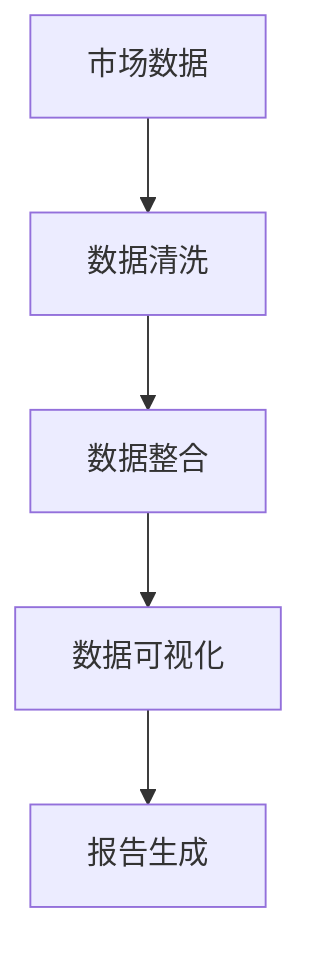

                 


### 关键词

1. **AI辅助创意品牌定位**
2. **提示词设计方法**
3. **机器学习**
4. **自然语言处理**
5. **品牌传播策略**
6. **数据分析与挖掘**
7. **创意生成算法**

### 摘要

本文深入探讨AI辅助创意品牌定位中的提示词设计方法。我们首先明确了AI在品牌定位中的应用原理，介绍了提示词的定义与设计原则，并通过实际案例展示了AI如何辅助设计有效的提示词。文章详细介绍了提示词生成算法，包括文本生成模型和基于关键词、情感分析的方法。接着，我们讨论了提示词优化的策略，并通过实战案例展示了如何在实际项目中应用AI辅助品牌定位。最后，文章总结了AI辅助创意品牌定位的实践应用，提供了最佳实践建议，并对未来发展趋势进行了展望。

## 第一部分：引言

### 第1章：问题背景与定义

#### 1.1.1 问题背景

在现代商业环境中，品牌定位是提升企业竞争力的关键因素。成功的品牌定位不仅能帮助企业明确其市场定位，还能提升品牌形象和市场份额。然而，传统的品牌定位过程往往依赖于经验和直觉，缺乏系统性和科学性。随着人工智能（AI）技术的发展，AI在品牌定位中的应用逐渐成为可能。

AI技术，尤其是机器学习和自然语言处理（NLP），为品牌定位提供了新的方法和工具。通过大数据分析和智能算法，AI可以帮助企业更准确地识别市场需求，挖掘消费者偏好，从而设计出更具创意和针对性的品牌定位策略。

#### 1.1.2 基本概念

**AI辅助创意品牌定位**：AI辅助品牌定位是指利用人工智能技术，如机器学习和自然语言处理，对品牌的市场环境、消费者行为、竞争对手等信息进行分析和处理，从而辅助企业制定创意品牌定位策略。

**提示词设计**：提示词是引导AI模型生成创意内容的关键输入。在设计提示词时，需要考虑其长度、复杂度、多样性等因素，以确保生成的内容能够满足品牌定位的需求。

**品牌定位的流程与步骤**：品牌定位通常包括市场分析、目标消费者分析、品牌价值提炼、品牌传播策略制定等步骤。每个步骤都需要结合AI技术进行数据分析和智能决策。

#### 1.1.3 书籍结构与内容概述

**目录结构**：
- 第一部分：引言
  - 第1章：问题背景与定义
- 第二部分：AI辅助创意品牌定位的理论基础
  - 第2章：AI在品牌定位中的应用
  - 第3章：提示词设计的具体方法
- 第三部分：AI辅助创意品牌定位的工作流程
  - 第4章：AI辅助创意品牌定位的工作流程
- 第四部分：AI辅助创意品牌定位的实践应用
  - 第5章：AI辅助创意品牌定位的实践应用

**核心内容与目标读者**：
- **核心内容**：本文旨在系统介绍AI辅助创意品牌定位的方法和技巧，包括AI在品牌定位中的应用、提示词设计方法、优化策略以及实战应用。
- **目标读者**：本文的目标读者包括企业品牌经理、市场分析师、AI技术从业者以及对品牌定位和AI应用感兴趣的专业人士。

## 1.2 本章小结

本章介绍了AI辅助创意品牌定位的问题背景和基本概念，明确了文章的研究方向和目标。通过理解AI在品牌定位中的应用原理和提示词设计的重要性，读者可以为后续章节的学习打下基础。接下来，我们将进一步探讨AI辅助创意品牌定位的理论基础，深入分析AI技术在品牌定位中的具体应用。

----------------------------------------------------------------

## 第二部分：AI辅助创意品牌定位的理论基础

### 第2章：AI在品牌定位中的应用

#### 2.1 AI辅助品牌定位的原理

**数据分析与挖掘**：AI通过大数据技术收集和分析市场数据、消费者行为数据等，帮助企业识别潜在的市场机会和消费者需求。

**机器学习与深度学习**：AI模型通过学习大量的数据，自动提取特征，建立模型，从而实现智能决策和预测。

**自然语言处理**：NLP技术能够理解和生成自然语言文本，帮助品牌更准确地表达其核心价值和市场定位。

#### 2.2 提示词设计的基础

**提示词的定义与作用**：提示词是指导AI模型生成创意内容的关键输入，其作用在于引导模型生成符合品牌定位需求的内容。

**提示词设计的原则**：设计提示词时需要考虑其长度、复杂度、多样性等因素，以确保生成的内容具有创意性和针对性。

**提示词的类型**：根据应用场景的不同，提示词可以分为市场调研提示词、品牌价值提炼提示词、广告文案创作提示词等。

#### 2.3 AI辅助创意品牌定位案例研究

**案例一：某个品牌的市场调研**

- **背景**：某时尚品牌希望通过AI技术进行市场调研，以了解目标消费者的偏好和需求。
- **方法**：使用AI技术收集和分析消费者行为数据，包括社交媒体互动、购买记录等。
- **结果**：AI模型识别出了消费者的主要偏好和需求，为品牌提供了有力的市场洞察。

**案例二：品牌核心价值的提炼**

- **背景**：某健康食品品牌希望通过AI技术提炼其核心价值，以提升品牌形象。
- **方法**：使用NLP技术分析品牌的历史广告、宣传材料等，提取出品牌的核心价值词。
- **结果**：AI模型提炼出了品牌的核心价值词，为品牌传播提供了有力的支持。

**案例三：品牌传播策略的设计**

- **背景**：某电子产品品牌希望通过AI技术设计其品牌传播策略，以提升市场影响力。
- **方法**：使用AI技术分析市场环境、竞争对手，生成具有创意性的品牌传播策略。
- **结果**：AI模型设计出了具有创意性的品牌传播策略，有效提升了品牌的市场影响力。

#### 2.4 本章小结

本章介绍了AI辅助品牌定位的原理和提示词设计的基础，并通过实际案例展示了AI技术在品牌定位中的应用。下一章我们将详细讨论提示词设计的具体方法，包括生成算法和优化策略。

----------------------------------------------------------------

## 第3章：提示词设计的具体方法

#### 3.1 提示词生成算法

**文本生成模型**：文本生成模型是AI用于生成文本的主要方法之一。常见的文本生成模型包括GPT模型和BERT模型。

**GPT模型**：GPT（Generative Pre-trained Transformer）模型是OpenAI开发的预训练语言模型，它通过大量的文本数据进行预训练，从而能够生成高质量的文本。

```python
import transformers
model = transformers.AutoModelForCausalLM.from_pretrained("gpt2")
input_ids = model.encode("生成品牌广告文案：", return_tensors='pt')
output = model.generate(input_ids, max_length=50, num_return_sequences=1)
print(output[0].decode('utf-8'))
```

**BERT模型**：BERT（Bidirectional Encoder Representations from Transformers）模型是Google开发的预训练语言模型，它通过双向编码器结构对文本进行建模。

```python
import transformers
model = transformers.AutoModelForSequenceClassification.from_pretrained("bert-base-uncased")
input_ids = model.encode("这是一个关于品牌的句子", return_tensors='pt')
output = model(input_ids)[0]
print(output.argmax(-1).item())
```

**基于关键词的提示词生成**：该方法通过提取关键词来生成提示词，适用于需要突出关键词的场景。

```python
def generate_prompt(keywords):
    return "以下关键词对于品牌定位至关重要：{}".format(", ".join(keywords))

generate_prompt(["创新", "环保", "高端"])
```

**基于情感分析的提示词生成**：该方法通过分析文本的情感倾向来生成提示词，适用于需要表达情感的品牌定位。

```python
from transformers import pipeline
nlp = pipeline('sentiment-analysis')

def generate_prompt_sentiment(text):
    sentiment = nlp(text)[0]
    if sentiment['label'] == 'POSITIVE':
        return "以积极的方式阐述品牌理念：{}".format(text)
    else:
        return "以改进的方式重新阐述品牌理念：{}".format(text)

generate_prompt_sentiment("我们的产品性价比很高。")
```

#### 3.2 提示词优化策略

**提示词的长度与复杂度**：过长的提示词可能使模型难以理解，而过短的提示词可能缺乏信息量。设计提示词时需要平衡其长度和复杂度。

**提示词的多样性**：多样性是创意品牌定位的关键，设计提示词时需要考虑不同的表达方式和角度，以激发模型的创意潜力。

**提示词的适用性**：提示词需要与品牌定位的需求高度契合，确保生成的内容能够有效传达品牌信息。

#### 3.3 提示词设计实战案例

**案例一：品牌口号的优化**

- **背景**：某运动品牌希望通过AI技术优化其品牌口号，以提升品牌形象。
- **方法**：使用文本生成模型生成多个品牌口号，然后通过用户投票和专家评估选择最优口号。
- **结果**：AI模型生成了多个具有创意性的品牌口号，经过用户投票和专家评估，选择了最符合品牌定位的口号。

**案例二：广告文案的创作**

- **背景**：某电子产品品牌希望通过AI技术创作广告文案，以提升市场知名度。
- **方法**：使用基于关键词和情感分析的提示词生成方法，结合市场数据和用户反馈，创作广告文案。
- **结果**：AI模型创作出了多个具有创意性和感染力的广告文案，有效提升了品牌的市场影响力。

**案例三：社交媒体内容的生成**

- **背景**：某时尚品牌希望通过AI技术生成社交媒体内容，以吸引更多年轻消费者。
- **方法**：使用文本生成模型和基于情感分析的提示词生成方法，生成具有创意性和互动性的社交媒体内容。
- **结果**：AI模型生成了多个高质量的社交媒体内容，有效提升了品牌在社交媒体上的关注度和互动率。

#### 3.4 本章小结

本章详细介绍了提示词生成算法、优化策略以及实际应用案例。通过理解这些方法，读者可以更好地掌握AI辅助创意品牌定位的核心技巧。下一章将探讨AI辅助创意品牌定位的工作流程，为实际应用提供更全面的指导。

----------------------------------------------------------------

## 第4章：AI辅助创意品牌定位的工作流程

### 4.1 数据收集与处理

**数据来源**：
- **市场数据**：通过市场调研、行业报告等获取市场环境、消费者行为等信息。
- **社交媒体数据**：利用社交媒体平台的数据接口获取用户评论、点赞、分享等数据。
- **消费者行为数据**：通过购买记录、搜索记录等获取消费者的行为数据。

**数据处理方法**：
- **数据清洗**：去除重复数据、缺失数据和异常数据，确保数据质量。
- **数据整合**：将不同来源的数据进行整合，形成统一的数据集。
- **数据可视化**：利用图表和可视化工具展示数据，帮助分析者理解数据。

**数据可视化**：


### 4.2 品牌定位策略制定

**市场分析**：
- **市场趋势**：通过数据分析了解市场的最新趋势和动态。
- **市场规模**：评估目标市场的规模和增长潜力。

**竞争对手分析**：
- **竞争对手定位**：分析竞争对手的品牌定位策略。
- **竞争对手优势与劣势**：评估竞争对手的优势和劣势，为品牌定位提供参考。

**品牌价值定位**：
- **品牌核心价值**：确定品牌的核心价值，如创新、品质、服务等。
- **差异化策略**：通过分析市场环境和竞争对手，制定差异化的品牌定位策略。

### 4.3 提示词设计与优化

**提示词生成**：
- **文本生成模型**：使用GPT或BERT模型生成提示词。
- **关键词提取**：从市场数据和竞争对手分析中提取关键词作为提示词。

**提示词优化**：
- **用户反馈**：收集用户对生成内容的反馈，优化提示词。
- **专家评估**：邀请品牌专家对生成的内容进行评估，进一步优化提示词。

### 4.4 品牌传播与实施

**品牌传播渠道选择**：
- **社交媒体**：利用微博、微信、抖音等社交媒体平台进行品牌传播。
- **线上广告**：通过搜索引擎广告、展示广告等吸引目标用户。

**品牌传播内容设计**：
- **广告文案**：根据品牌定位和用户反馈设计具有吸引力的广告文案。
- **社交媒体内容**：生成互动性强、具有创意性的社交媒体内容。

**品牌传播效果评估**：
- **数据监测**：通过监测网站流量、社交媒体互动等数据评估品牌传播效果。
- **用户调研**：进行用户满意度调查，了解品牌传播的效果。

### 4.5 本章小结

本章详细介绍了AI辅助创意品牌定位的工作流程，包括数据收集与处理、品牌定位策略制定、提示词设计与优化以及品牌传播与实施。通过这些步骤，企业可以利用AI技术更科学、更有效地进行品牌定位，提升品牌竞争力。下一章将探讨AI辅助创意品牌定位的实践应用，通过实际案例展示AI在品牌定位中的实际效果。

----------------------------------------------------------------

## 第5章：AI辅助创意品牌定位的实践应用

### 5.1 品牌定位工具与技术

**AI工具的选择**：
- **GPT模型**：用于生成广告文案和品牌口号，具有强大的文本生成能力。
- **BERT模型**：用于情感分析和关键词提取，帮助确定品牌的核心价值和市场定位。
- **数据分析工具**：如Tableau、Power BI等，用于数据可视化，帮助理解市场数据和消费者行为。

**数据分析工具**：
- **Tableau**：用于创建交互式数据可视化图表，帮助品牌经理和分析师直观地理解数据。
- **Power BI**：提供丰富的数据报告和分析功能，帮助企业制定科学的品牌定位策略。

**提示词生成工具**：
- **OpenAI的GPT-3 API**：提供强大的文本生成能力，可用于广告文案创作和品牌口号生成。
- **Hugging Face的Transformers库**：提供多种预训练模型，方便用户进行提示词设计和优化。

### 5.2 案例分析与经验总结

**案例一：品牌重塑案例**

**背景**：
某老牌服装品牌希望通过AI技术进行品牌重塑，以吸引年轻消费者。

**方法**：
- **市场数据分析**：使用AI工具收集和分析市场数据，了解目标消费者的偏好和需求。
- **竞争对手分析**：分析竞争对手的品牌定位策略，找出差异化的市场机会。
- **品牌价值提炼**：利用BERT模型提取品牌的核心价值词，确定新的品牌定位。
- **广告文案创作**：使用GPT模型生成具有创意性的广告文案，进行品牌传播。

**结果**：
AI技术帮助品牌成功重塑，新的品牌定位和广告文案受到年轻消费者的喜爱，品牌知名度显著提升。

**经验总结**：
- AI技术能够高效地处理大量数据，提供有价值的洞察，帮助企业制定科学的品牌定位策略。
- 提示词设计的关键在于准确捕捉品牌的核心价值和市场需求，确保生成的内容具有创意性和针对性。

**案例二：新品牌定位案例**

**背景**：
某健康食品品牌希望通过AI技术确定其市场定位，以提升品牌形象。

**方法**：
- **市场调研**：使用AI工具进行市场调研，收集消费者对健康食品的看法和需求。
- **竞争对手分析**：分析竞争对手的品牌定位和营销策略，找出差异化优势。
- **品牌价值提炼**：利用BERT模型提取品牌的核心价值词，确定品牌的市场定位。
- **社交媒体内容生成**：使用GPT模型生成创意性的社交媒体内容，进行品牌传播。

**结果**：
AI技术帮助品牌确定了市场定位，新的品牌传播策略有效提升了品牌在社交媒体上的关注度和互动率。

**经验总结**：
- AI技术能够快速生成高质量的创意内容，为品牌传播提供有力支持。
- 提示词设计要充分考虑品牌的独特性和市场需求，确保生成的内容能够有效传达品牌信息。

### 5.3 最佳实践与未来展望

**最佳实践**：
- **数据驱动**：以数据为基础，利用AI技术进行市场分析和消费者洞察，确保品牌定位的准确性。
- **创意结合**：在提示词设计中注重创意性，确保生成的内容能够吸引目标消费者。
- **持续迭代**：不断优化AI模型和提示词设计，根据市场变化和用户反馈进行调整。

**未来展望**：
- **更智能的AI模型**：随着AI技术的发展，未来将出现更智能、更高效的AI模型，进一步优化品牌定位过程。
- **跨平台整合**：AI技术将更广泛地应用于不同平台，如社交媒体、电商平台等，实现品牌定位的全方位整合。
- **个性化服务**：AI技术将更精准地捕捉消费者的个性化需求，提供个性化的品牌定位策略。

## 5.4 本章小结

本章通过实际案例展示了AI辅助创意品牌定位的实践应用，总结了最佳实践经验，并对未来发展趋势进行了展望。通过理解这些实践，企业可以更好地利用AI技术进行品牌定位，提升品牌竞争力。下一章将总结全文，提供对未来AI辅助创意品牌定位的进一步探讨。

