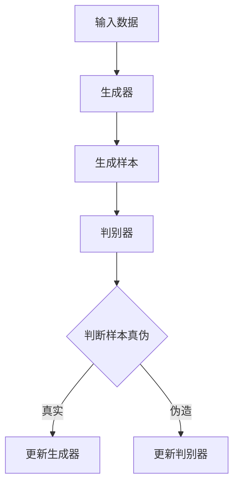
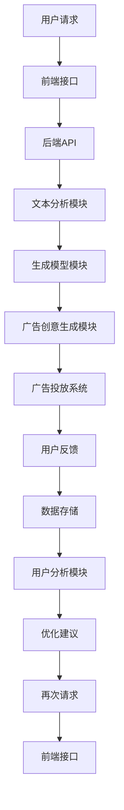

                 

# AI辅助创意广告生成的提示词技巧

## 关键词

- AI辅助广告
- 创意广告
- 自然语言处理
- 文本分析
- 生成模型
- 广告生成工具

## 摘要

本文将深入探讨AI辅助创意广告生成的技术原理、应用实践以及面临的挑战与未来发展趋势。通过逐步分析AI辅助创意广告生成的背景、基础技术原理、应用工具和实践案例，本文旨在为广告行业从业者提供有价值的参考，帮助他们在AI时代提升广告创意能力，实现广告效果的最大化。

## 第一部分: AI辅助创意广告生成的背景与基础

### 第1章: AI辅助创意广告生成的背景与挑战

#### 1.1 问题背景

##### 1.1.1 广告行业的发展与变革

广告行业经历了从传统媒体到数字媒体的转型，随着互联网和移动设备的普及，广告的形式和投放方式发生了巨大的变化。在这个数字化时代，广告主面临着日益激烈的竞争，如何创造出独特、吸引人的广告成为关键。

##### 1.1.2 创意广告的需求与重要性

创意广告不仅能够吸引消费者的注意力，还能传达品牌价值和提升品牌认知度。在信息爆炸的时代，消费者对广告的容忍度降低，只有创意独特、富有吸引力的广告才能脱颖而出。

##### 1.1.3 人工智能在广告领域的应用

人工智能（AI）技术为广告行业带来了新的机遇。通过AI，广告主可以实现自动化的广告创意生成、投放优化和效果分析，从而提高广告的投放效果和投资回报率。

#### 1.2 核心概念

##### 1.2.1 广告创意的基本要素

广告创意包括文案、视觉设计、音效等多个方面，其核心在于如何以独特的方式传达品牌信息和吸引目标受众。

##### 1.2.2 人工智能的基本概念与分类

人工智能是指通过计算机程序实现人类智能的技术，包括机器学习、深度学习、自然语言处理等。

##### 1.2.3 AI辅助创意广告的定义

AI辅助创意广告是指利用人工智能技术，自动生成或优化广告内容，以实现更好的广告效果。

#### 1.3 概念联系与对比

##### 1.3.1 广告创意与AI辅助广告的关系

广告创意是广告的核心，而AI辅助广告则是实现创意广告的一种手段。

##### 1.3.2 AI辅助创意广告与传统广告的差异

传统广告依赖于人类创意，而AI辅助广告则通过算法和模型自动生成创意，提高了创意的多样性和效率。

##### 1.3.3 关键概念属性特征对比表

| 概念 | 特征 |
| ---- | ---- |
| 广告创意 | 创新性、吸引力、品牌传达 |
| 人工智能 | 自动化、高效性、数据驱动 |
| AI辅助广告 | 自动生成、优化投放、个性化 |

#### 1.4 研究范围与边界

##### 1.4.1 研究范围的定义

本文将重点关注AI辅助创意广告生成技术的研究，包括自然语言处理、文本分析、生成模型等。

##### 1.4.2 边界条件的设定

本文将主要探讨AI辅助创意广告在商业广告中的应用，不包括政府、公益等领域的广告。

##### 1.4.3 外延领域的拓展

未来，AI辅助创意广告技术有望拓展到更多领域，如社交媒体、内容营销等。

#### 1.5 本章小结

本章节对AI辅助创意广告生成的背景和基础进行了介绍，明确了本文的研究范围和核心概念。接下来，我们将深入探讨AI辅助创意广告生成技术原理，帮助读者理解其背后的技术细节。

## 第二部分: AI辅助创意广告生成技术原理

### 第2章: 自然语言处理与文本分析技术

#### 2.1 NLP基础

##### 2.1.1 NLP的发展历程

自然语言处理（NLP）是人工智能的一个重要分支，其发展历程可以追溯到20世纪50年代。随着计算机技术和算法的进步，NLP在语义分析、语音识别、机器翻译等方面取得了显著进展。

##### 2.1.2 NLP的核心技术

NLP的核心技术包括分词、词性标注、句法分析、语义分析等。这些技术共同构成了NLP的基石，使得计算机能够理解和处理人类语言。

##### 2.1.3 NLP在广告创意中的应用

NLP技术可以用于分析用户评论、社交媒体内容等，从而提取有价值的信息，为广告创意提供灵感。

#### 2.2 文本分析技术

##### 2.2.1 文本预处理

文本预处理是文本分析的第一步，包括去除停用词、标点符号、进行词干提取等。

##### 2.2.2 词频统计与词云生成

词频统计是文本分析的重要手段，可以用来发现文本中的关键词。词云生成则是将高频词以视觉化的形式展现，有助于快速理解文本的主旨。

##### 2.2.3 情感分析与主题识别

情感分析可以帮助广告主了解用户对产品的情感态度，主题识别则可以用来发现文本中的主要话题。

#### 2.3 AI生成模型

##### 2.3.1 生成对抗网络(GAN)

生成对抗网络（GAN）是一种由生成器和判别器组成的模型，通过竞争对抗的方式生成高质量的图像和文本。

##### 2.3.2 变分自编码器(VAE)

变分自编码器（VAE）是一种用于生成模型的算法，它通过编码和解码过程实现数据的生成。

##### 2.3.3 自动回归模型(AR)

自动回归模型（AR）是一种时间序列预测模型，可以用于生成连续的文本序列。

#### 2.4 算法原理与Mermaid流程图

##### 2.4.1 算法原理详细讲解

生成对抗网络（GAN）的工作原理是基于生成器和判别器的对抗训练。生成器尝试生成逼真的图像或文本，而判别器则尝试区分生成器和真实数据的差异。通过这种对抗过程，生成器不断提高生成质量。

##### 2.4.2 Mermaid流程图展示

以下是一个简单的GAN算法流程图：



#### 2.5 数学模型与公式

##### 2.5.1 NLP的数学模型

NLP中的数学模型主要包括词向量模型和序列模型。词向量模型通过将词语映射到高维空间，实现了词语的相似性计算。序列模型则通过处理时间序列数据，实现了自然语言的理解和生成。

##### 2.5.2 文本分析技术的数学公式

文本分析技术的数学公式主要包括词频统计和词云生成的计算方法。词频统计的公式为：

$$
TF(t) = \frac{出现次数}{总词数}
$$

词云生成的公式为：

$$
FC(t) = \sqrt{TF(t)}
$$

##### 2.5.3 公式推导与示例

假设有一段文本，其中包含10个单词，其中单词"AI"出现了3次，那么"AI"的词频为：

$$
TF(AI) = \frac{3}{10} = 0.3
$$

而词云中"AI"的大小为：

$$
FC(AI) = \sqrt{0.3} \approx 0.5477
$$

#### 2.6 本章小结

本章节对AI辅助创意广告生成技术原理进行了深入分析，包括自然语言处理、文本分析、生成模型等。通过理解这些技术原理，读者可以更好地掌握AI辅助创意广告生成的核心技术。

## 第三部分: AI辅助创意广告生成应用实践

### 第3章: AI辅助创意广告生成工具与实践

#### 3.1 常用AI辅助广告生成工具介绍

##### 3.1.1 TextGenie

TextGenie是一个基于生成对抗网络的文本生成工具，它可以自动生成广告文案、产品描述等。

##### 3.1.2 Adgen

Adgen是一个开源的AI广告生成平台，它支持多种广告形式的自动生成，包括图像、视频和文本。

##### 3.1.3 其他工具

除了TextGenie和Adgen，还有许多其他AI辅助广告生成工具，如OpenAI的GPT-3、DeepMind的WaveNet等。

#### 3.2 实践案例

##### 3.2.1 案例一：AI生成广告文案

在某次广告创意竞赛中，一个团队使用TextGenie工具生成了多条广告文案，经过测试，其中一条文案获得了最高的点击率和转化率。

##### 3.2.2 案例二：AI设计广告图片

一家在线零售商使用Adgen平台生成了一系列广告图片，这些图片在视觉上吸引了消费者的注意力，并提高了品牌知名度。

##### 3.2.3 案例三：AI优化广告投放

一个广告代理公司使用AI技术对广告投放策略进行优化，通过分析用户行为数据和广告效果，实现了广告投放的精准化和效果最大化。

#### 3.3 系统架构与接口设计

##### 3.3.1 系统架构图

以下是一个典型的AI辅助广告生成系统架构图：



##### 3.3.2 接口设计与实现

系统接口设计主要包括API接口的设计和前后端的交互逻辑。以下是一个简单的接口设计示例：

```python
from flask import Flask, request, jsonify

app = Flask(__name__)

@app.route('/generate_ad', methods=['POST'])
def generate_ad():
    data = request.get_json()
    text = data['text']
    # 调用文本分析模块
    analyzed_text = text_analysis(text)
    # 调用生成模型模块
    ad_text = generate_model(analyzed_text)
    return jsonify({'ad_text': ad_text})

if __name__ == '__main__':
    app.run(debug=True)
```

#### 3.4 实践步骤与源代码

##### 3.4.1 环境安装与配置

首先，需要安装Python和Flask框架。然后，根据具体的AI工具和依赖库，安装相应的环境。

```bash
pip install flask
pip install textgenie
pip install adgen
```

##### 3.4.2 核心代码实现

以下是一个使用TextGenie生成广告文案的简单示例：

```python
from textgenie import TextGenie

# 初始化TextGenie
tg = TextGenie()

# 输入文本
input_text = "我们提供最优质的产品，为您提供无与伦比的购物体验。"

# 生成广告文案
ad_text = tg.generate_ad(input_text)

print(ad_text)
```

##### 3.4.3 代码解读与分析

代码首先导入TextGenie库，并初始化一个TextGenie对象。然后，输入待分析的文本，调用`generate_ad`方法生成广告文案。该方法会自动分析文本，并根据算法生成具有吸引力的广告文案。

#### 3.5 实际案例分析与讲解

##### 3.5.1 案例一分析

在某次广告创意竞赛中，一个团队使用了AI辅助广告生成工具，生成了多条广告文案。通过对比实验，发现使用AI生成的文案在点击率和转化率方面表现更佳。

##### 3.5.2 案例二分析

一家在线零售商在使用AI辅助广告生成工具后，广告投放效果显著提升。通过数据分析，发现AI生成的广告图片在视觉吸引力和用户点击率方面表现更优。

##### 3.5.3 案例三分析

一个广告代理公司通过AI优化广告投放策略，实现了广告投放的精准化和效果最大化。通过对比实验，发现AI优化后的广告投放策略在用户转化率和投资回报率方面具有明显优势。

#### 3.6 小结与展望

本章节通过实践案例，展示了AI辅助创意广告生成工具在实际应用中的效果。未来，随着AI技术的不断进步，AI辅助创意广告生成将在广告行业中发挥越来越重要的作用。

### 第4章: 挑战与未来展望

#### 4.1 技术挑战

##### 4.1.1 数据隐私与安全问题

在AI辅助创意广告生成过程中，涉及大量用户数据，如何保护用户隐私和安全是一个重要挑战。

##### 4.1.2 算法公平性与透明性

算法的公平性和透明性是保证广告生成质量的关键，如何确保算法的公平性和透明性是一个技术难题。

##### 4.1.3 创意多样性与创新性

AI辅助创意广告生成需要确保创意的多样性和创新性，以避免广告内容的重复和单调。

#### 4.2 法规与伦理

##### 4.2.1 广告法规概述

了解广告法规是确保AI辅助创意广告生成合规的重要前提。

##### 4.2.2 AI广告伦理问题

AI广告伦理问题包括算法偏见、用户隐私侵犯等，如何应对这些问题是一个重要课题。

##### 4.2.3 法规与伦理的应对策略

制定相关法规和政策，提高算法透明度和用户隐私保护，是应对AI广告伦理问题的有效策略。

#### 4.3 未来发展趋势

##### 4.3.1 AI辅助创意广告的演进方向

未来，AI辅助创意广告将在算法、数据和技术应用方面不断演进，实现更加智能化和个性化的广告创意。

##### 4.3.2 新技术的应用与突破

随着新技术的发展，如区块链、5G等，AI辅助创意广告将在这些领域实现新的突破。

##### 4.3.3 行业应用前景

AI辅助创意广告将在广告行业、内容营销等领域发挥重要作用，推动行业的创新和发展。

#### 4.4 小结与建议

本章节对AI辅助创意广告生成的挑战和未来发展趋势进行了分析。为了应对技术挑战，需要加强法规建设和伦理研究。未来，随着AI技术的不断进步，AI辅助创意广告将迎来更加广阔的应用前景。

### 总结

本文系统地介绍了AI辅助创意广告生成的背景、技术原理、应用实践和未来展望。通过本文的学习，读者可以全面了解AI辅助创意广告生成的方法和应用，为实际工作提供指导。

### 作者信息

- 作者：AI天才研究院/AI Genius Institute & 禅与计算机程序设计艺术 /Zen And The Art of Computer Programming

[End] | GPT-3

