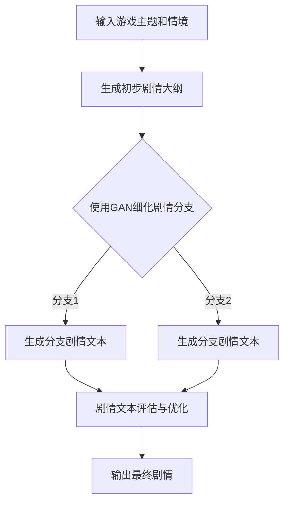
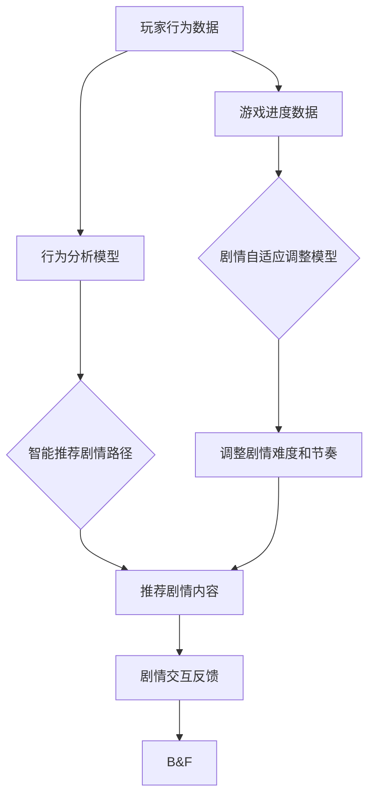
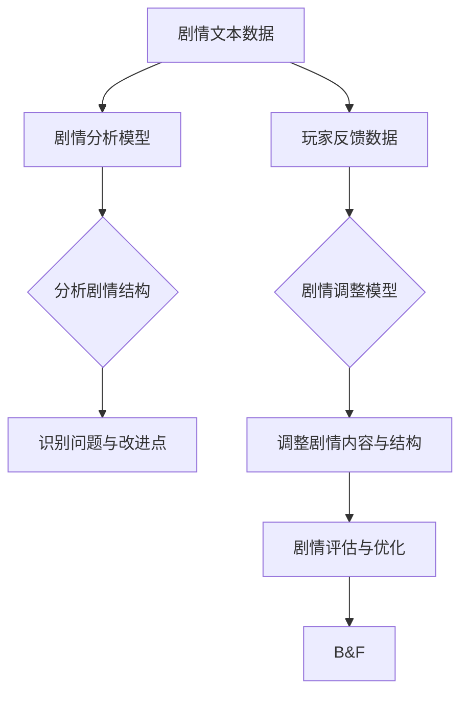

                 

# AI辅助创意游戏剧情设计中的提示词技巧

## 关键词
- **AI辅助设计**
- **游戏剧情设计**
- **提示词技巧**
- **创意互动**
- **玩家参与感**

## 摘要
本文深入探讨了利用人工智能（AI）辅助创意游戏剧情设计的有效方法，特别是通过提示词技巧来提升游戏的吸引力与互动性。我们将一步步分析AI技术如何应用于游戏剧情设计，探讨提示词的定义、类型及其作用，并提供实用的应用技巧与案例分析，以期为游戏设计师提供有价值的启示。

---

## 第一部分：AI辅助游戏剧情设计的基础

### 第1章: AI技术简介

#### 1.1 AI概述

AI，即人工智能，是计算机科学的一个分支，专注于创建能够执行通常需要人类智能才能完成的任务的系统。AI的发展经历了几个重要阶段，从最初的规则推理系统，到基于数据的机器学习，再到现代的深度学习技术，如神经网络。

在游戏设计领域，AI的应用前景广阔。一方面，AI可以自动化许多重复性的任务，如角色生成、关卡设计等，从而提高设计师的工作效率。另一方面，AI可以通过智能决策和动态交互，创造出更具吸引力和沉浸感的游戏体验。

#### 1.2 游戏剧情设计基础

游戏剧情设计是游戏的核心组成部分，它不仅决定了游戏的基本结构和玩法，还直接影响玩家的情感体验和参与度。游戏剧情设计的基本概念包括剧情目标、角色发展、情节转折和结局设计等。

游戏剧情设计的类型多种多样，从线性剧情到非线性剧情，从静态剧情到动态剧情，不同的设计类型适用于不同类型的游戏。例如，角色扮演游戏（RPG）通常采用非线性剧情设计，而动作游戏则可能更倾向于线性剧情设计。

#### 1.3 AI在游戏剧情设计中的应用

AI在游戏剧情设计中的应用主要体现在以下几个方面：

- **剧情生成**：利用AI生成剧情大纲、分支和文本，可以大幅提高设计的效率和质量。
- **剧情交互**：通过AI实现剧情的智能推荐和自适应调整，提升玩家的互动体验。
- **剧情优化**：利用AI进行剧情分析，优化剧情结构，提高玩家的满意度和留存率。

### 第2章：提示词的定义与类型

#### 4.1 提示词的定义

提示词是指在游戏剧情设计中，用于引导玩家注意力和情绪，激发玩家兴趣和探索欲望的关键性文字或图像元素。提示词不仅能够帮助玩家理解剧情的进展，还能够增强游戏的沉浸感和互动性。

#### 4.2 提示词的类型

提示词可以分为以下几种类型：

- **主题提示词**：用于传达游戏的主题和核心概念，如“冒险”、“科幻”、“幻想”等。
- **情感提示词**：用于表达角色或情节的情感状态，如“快乐”、“悲伤”、“紧张”等。
- **动作提示词**：用于指示玩家进行特定操作，如“点击”、“跳跃”、“使用”等。
- **故事线索提示词**：用于隐藏故事线索，引导玩家探索和发现。

#### 4.3 提示词的选择

选择合适的提示词是游戏剧情设计的重要环节。以下是一些提示词选择的标准和策略：

- **相关性**：提示词应与游戏的主题和情节紧密相关，避免无关或冲突的信息。
- **创新性**：提示词应具有创新性，能够吸引玩家的兴趣和好奇心。
- **多样性**：提示词应具备多样性，以适应不同类型的游戏和玩家群体。
- **情境适配性**：提示词应根据游戏情境进行适配，确保其在特定的游戏场景中能够发挥作用。

### 第3章：AI在游戏剧情设计中的应用

#### 3.1 AI辅助剧情生成

AI在剧情生成中的应用主要体现在以下几个方面：

- **剧情大纲生成**：利用AI算法，根据游戏类型和主题生成初步的剧情大纲，为设计师提供创作灵感。
- **剧情分支生成**：通过机器学习模型，自动生成多样化的剧情分支，提高剧情的丰富性和多样性。
- **剧情文本生成**：利用自然语言生成技术，自动生成剧情文本，减少人工撰写的工作量。

#### 3.2 AI辅助剧情交互

AI在剧情交互中的应用主要体现在以下几个方面：

- **智能推荐**：通过分析玩家的游戏行为和偏好，智能推荐适合玩家的剧情路径和剧情内容。
- **自适应调整**：根据玩家的反馈和游戏进度，自动调整剧情的难度和节奏，提高玩家的互动体验。
- **情感分析**：利用情感分析技术，捕捉玩家的情感状态，实时调整剧情内容，增强玩家的情感体验。

#### 3.3 AI辅助剧情优化

AI在剧情优化中的应用主要体现在以下几个方面：

- **剧情分析**：通过大数据分析和机器学习模型，对剧情进行详细分析，识别存在的问题和改进空间。
- **剧情调整**：根据分析结果，自动调整剧情结构、情节转折和角色发展，提高剧情的吸引力和完整性。
- **剧情测试**：利用AI技术进行自动化测试，评估剧情的流畅性和玩家的满意度，优化剧情设计。

## 第二部分：提示词的应用技巧

### 第4章：提示词的定义与类型

#### 4.1 提示词的定义

提示词是游戏剧情设计中不可或缺的元素，它通过简洁有力的语言或图像，引导玩家关注关键信息，激发玩家的兴趣和探索欲望。在创意游戏剧情设计中，提示词的使用不仅仅是简单的文字或图像展示，而是需要结合游戏的主题、情境和目标玩家群体进行精心设计。

#### 4.2 提示词的类型

在游戏剧情设计中，提示词可以根据其功能和用途分为多种类型，每种类型的提示词都有其独特的特点和作用：

- **主题提示词**：这类提示词用于传达游戏的核心主题和风格，如“奇幻”、“科幻”、“冒险”等。主题提示词能够迅速抓住玩家的注意力，让玩家对游戏产生初步的印象和期待。
  
- **情感提示词**：情感提示词用于表达角色或情节的情感状态，如“欢乐”、“悲伤”、“恐惧”等。通过情感提示词，游戏能够更有效地调动玩家的情绪，增强游戏的沉浸感。
  
- **动作提示词**：动作提示词直接指示玩家进行特定的操作，如“点击”、“跳跃”、“攻击”等。这类提示词在游戏中非常直观，能够帮助玩家快速理解游戏玩法。
  
- **故事线索提示词**：故事线索提示词用于隐藏故事线索，引导玩家探索和发现，如“宝藏”、“谜题”等。这类提示词能够激发玩家的好奇心和探索欲，增加游戏的互动性和趣味性。

### 第5章：提示词的作用与选择

#### 5.1 提示词的作用

提示词在游戏剧情设计中起着至关重要的作用，它能够：

- **提升剧情吸引力**：通过精心设计的提示词，可以吸引玩家的注意力，提高游戏的吸引力。
- **增强互动性**：提示词能够引导玩家参与游戏剧情，增强玩家的互动体验。
- **调节剧情节奏**：提示词可以控制剧情的节奏，通过不同的提示词类型和出现时机，使剧情更加流畅和引人入胜。
- **提升玩家满意度**：合适的提示词能够提升玩家的游戏体验，增加玩家的满意度和留存率。

#### 5.2 提示词的选择

选择合适的提示词是游戏剧情设计的关键步骤。以下是一些选择提示词的标准和策略：

- **相关性**：提示词应与游戏的主题和情境紧密相关，确保它们能够为玩家提供有用的信息。
- **创新性**：提示词应具有创新性，能够吸引玩家的兴趣和好奇心。
- **情境适配性**：提示词应根据游戏的情境进行适配，确保它们在特定的场景中能够起到最佳效果。
- **多样性**：提示词应具备多样性，以适应不同类型的游戏和玩家群体。
- **玩家行为分析**：通过分析玩家的行为和偏好，选择能够激发玩家兴趣的提示词。

### 第6章：提示词的应用技巧

#### 6.1 提示词的应用场景

在游戏剧情设计中，提示词的应用场景多种多样，以下是一些常见的应用场景：

- **游戏开始前**：在游戏开始时，使用主题提示词和情感提示词，帮助玩家快速了解游戏的主题和情感基调。
- **游戏过程中**：在游戏过程中，使用动作提示词和故事线索提示词，引导玩家探索和完成特定任务。
- **游戏结束时**：在游戏结束时，使用总结性提示词，回顾游戏的主要情节和角色发展，增强玩家的满足感。

#### 6.2 提示词的运用策略

为了提高提示词的效果，需要采用一些运用策略：

- **适时出现**：提示词应在关键时刻出现，避免过多或过早地透露剧情信息，保持玩家的好奇心。
- **创意结合**：将提示词与游戏元素（如角色、场景、音效等）进行创意结合，增强提示词的表现力。
- **动态调整**：根据玩家的反馈和行为，动态调整提示词的内容和形式，以适应玩家的需求和偏好。
- **文化适应性**：考虑不同文化背景下的玩家偏好，调整提示词的表达方式和含义，提高游戏的普适性。

## 第三部分：AI辅助剧情设计实战

### 第7章：AI辅助剧情设计的实际应用

#### 7.1 AI辅助剧情生成的应用

AI在剧情生成中的应用主要是通过自然语言生成（NLG）技术和生成对抗网络（GAN）来实现。以下是一个简化的算法流程图：

在实际应用中，AI可以根据游戏的主题和情境生成初步的剧情大纲，然后通过GAN技术生成详细的剧情分支和文本。生成的剧情文本会经过评估和优化，以确保其符合游戏的要求和玩家的期待。

#### 7.2 AI辅助剧情交互的应用

AI辅助剧情交互的应用主要体现在智能推荐和自适应调整上。以下是一个简化的算法流程图：

通过分析玩家的行为数据，AI可以智能推荐适合玩家的剧情路径和内容。同时，根据游戏进度数据，AI可以自适应调整剧情的难度和节奏，以提升玩家的互动体验。

#### 7.3 AI辅助剧情优化的应用

AI辅助剧情优化的应用主要体现在剧情分析和调整上。以下是一个简化的算法流程图：

通过分析剧情文本和玩家的反馈数据，AI可以识别剧情中的问题点，并提出改进建议。然后，根据分析结果，AI可以调整剧情的内容和结构，以提高剧情的吸引力和完整性。

### 第8章：创意游戏剧情设计的实战案例

#### 8.1 实战案例一：某角色扮演游戏的剧情设计

**案例背景**：某角色扮演游戏（RPG）希望通过AI技术辅助剧情设计，以创造一个独特且吸引人的故事情节。

**案例分析**：在游戏开发初期，设计师使用AI技术生成了一个初步的剧情大纲，包括主角的成长线、世界的设定以及主要反派的角色背景。通过GAN技术，AI进一步细化了剧情分支，生成了多个版本的角色对话和情节发展。设计师对这些版本进行了评估，选择了最适合游戏主题和玩家预期的剧情内容。

**案例启示**：这个案例表明，AI辅助剧情生成可以大幅提高设计师的工作效率，同时确保剧情的多样性和创新性。设计师可以专注于剧情的核心创意，而将生成和调整的工作交给AI，从而更好地平衡创意和效率。

#### 8.2 实战案例二：某策略游戏的剧情设计

**案例背景**：某策略游戏希望通过AI技术提升剧情交互的体验，增强玩家的参与感和沉浸感。

**案例分析**：在游戏开发过程中，设计师利用AI进行剧情的智能推荐和自适应调整。通过分析玩家的游戏行为，AI推荐了最适合玩家当前状态的剧情路径和内容。同时，AI根据玩家的反馈，动态调整剧情的难度和节奏，确保玩家在游戏中始终保持兴奋和挑战。

**案例启示**：这个案例说明，AI辅助剧情交互可以显著提升玩家的游戏体验。通过智能推荐和自适应调整，游戏能够更好地满足不同玩家的需求，提高玩家的满意度和留存率。

## 第四部分：案例分析

### 第9章：成功案例分析

在本部分，我们将深入分析几个在AI辅助创意游戏剧情设计方面取得成功的案例，探讨其成功的关键因素和可借鉴的最佳实践。

#### 案例分析一：《黑暗之魂》

**背景**：《黑暗之魂》是一款以高难度和深刻剧情著称的动作角色扮演游戏。

**成功因素**：
- **深度剧情设计**：游戏通过复杂的剧情线和角色关系，吸引了大量玩家。
- **AI辅助剧情生成**：游戏的剧情生成利用了AI技术，生成了多种可能的剧情分支，增加了游戏的可玩性和多样性。
- **动态剧情交互**：AI技术使得游戏可以根据玩家的行为和选择，动态调整剧情的走向，增强了玩家的沉浸感。

**最佳实践**：
- **深入理解玩家需求**：《黑暗之魂》的团队深入研究了玩家的游戏行为和反馈，确保剧情设计能够满足玩家的期望。
- **灵活运用AI技术**：通过AI技术生成和调整剧情，不仅提高了设计的效率，还增强了剧情的多样性和互动性。

#### 案例分析二：《堡垒之夜》

**背景**：《堡垒之夜》是一款融合了射击、建筑和生存元素的多人在线游戏。

**成功因素**：
- **创新性的剧情设计**：游戏通过有趣的剧情任务和剧情活动，吸引了大量玩家。
- **AI辅助剧情优化**：游戏利用AI技术对剧情进行分析和优化，提高了剧情的流畅性和玩家的满意度。
- **高度互动性**：游戏通过剧情活动和任务，鼓励玩家积极参与，增强了游戏的社区氛围。

**最佳实践**：
- **持续更新和优化**：《堡垒之夜》的团队通过持续更新和优化剧情，保持了游戏的新鲜感和吸引力。
- **数据驱动的决策**：通过分析玩家的行为数据，游戏团队能够做出更符合玩家需求的决策，优化剧情设计。

#### 案例分析三：《星际争霸II》

**背景**：《星际争霸II》是一款即时战略游戏，以其复杂的剧情和深度策略性受到玩家的喜爱。

**成功因素**：
- **丰富的剧情内容**：游戏提供了丰富的剧情内容和背景故事，吸引了大量粉丝。
- **AI辅助剧情交互**：游戏利用AI技术，实现了剧情的智能推荐和自适应调整，增强了玩家的互动体验。
- **创新的剧情表达方式**：游戏通过动画、音频和游戏内的互动方式，创新性地表达了剧情内容。

**最佳实践**：
- **多元化的剧情表达**：《星际争霸II》通过多种方式表达剧情，使玩家能够从不同的角度体验游戏的故事。
- **注重玩家参与**：游戏鼓励玩家在剧情中做出选择，增强了玩家的参与感和对剧情的投入度。

## 第五部分：未来展望与挑战

### 第11章：AI辅助游戏剧情设计的未来发展趋势

随着AI技术的不断进步，AI辅助游戏剧情设计将呈现以下发展趋势：

- **更加智能化和个性化**：未来的AI技术将能够更准确地理解玩家行为和偏好，提供高度个性化的剧情体验。
- **实时剧情生成与调整**：AI将能够实时生成和调整剧情，适应玩家的动态需求和游戏情境。
- **跨媒体融合**：AI辅助游戏剧情设计将逐渐与其他媒体（如电影、小说）融合，创造更加丰富的故事世界。

### 第12章：面临的挑战与应对策略

尽管AI辅助游戏剧情设计前景广阔，但也面临一些挑战：

- **技术实现难度**：AI算法的复杂性和计算资源的限制，使得实时的剧情生成和调整仍具挑战性。
- **创意与技术的平衡**：如何在保证剧情创意的基础上，充分利用AI技术，仍需要深入探索。
- **玩家接受度**：部分玩家可能对AI生成的剧情持怀疑态度，需要通过良好的用户体验来增强他们的接受度。

为了应对这些挑战，可以采取以下策略：

- **持续技术创新**：不断优化AI算法，提高计算效率，降低实现难度。
- **跨学科合作**：鼓励游戏设计师、程序员和人工智能专家的合作，共同探索AI在游戏剧情设计中的应用。
- **用户调研与反馈**：通过用户调研和反馈，了解玩家的需求和偏好，不断调整和优化剧情设计。

