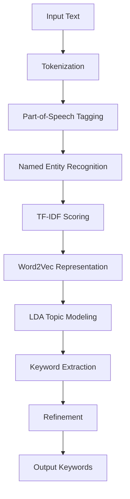

                 


### Introduction to AI-assisted Creative Game Design

#### Definition of AI-assisted Game Design

AI-assisted game design refers to the incorporation of artificial intelligence (AI) technologies into the process of creating video games. This includes various AI applications such as natural language processing, machine learning, and computer vision to enhance different aspects of game development. The primary goal is to automate or streamline tasks that traditionally require human creativity and insight, thus enabling designers to focus on higher-level creative processes.

#### Role of Keywords in Game Design

Keywords are fundamental elements in game design that serve multiple purposes. They are not just labels or tags but crucial components that drive the conceptualization and development of a game. Keywords help in:

1. **Defining Core Concepts**: Keywords define the core themes, genres, and mechanics of a game. For example, in a fantasy game, keywords like "magic," "quest," and "adventure" set the stage for the game's narrative and gameplay.
  
2. **Guiding Design Decisions**: Keywords act as a guide for designers, helping them make informed decisions about game features, levels, and story arcs.

3. **Attracting Players**: Keywords are often used in marketing materials, such as titles, descriptions, and tags, to attract players who are interested in specific types of games.

4. **Facilitating Collaboration**: Keywords make it easier for designers, writers, and programmers to collaborate by providing a shared language and set of references.

#### Importance of AI in Enhancing Game Creativity

The integration of AI into game design holds significant potential for enhancing creativity. Here's why:

1. **Generating Innovative Ideas**: AI can analyze vast amounts of data to identify trends and patterns, which can inspire new game ideas and concepts.

2. **Automating Repetitive Tasks**: AI can automate routine tasks such as level generation, character creation, and dialogue writing, allowing designers to focus on more creative aspects.

3. **Improving Personalization**: AI can adapt to players' preferences and behaviors, providing a more personalized gaming experience and increasing player engagement.

4. **Optimizing Game Testing**: AI can be used to simulate player behavior and test game mechanics, identifying potential issues and areas for improvement before release.

In summary, AI-assisted game design leverages advanced technologies to enhance the creative process, making game development more efficient and innovative. The use of keywords in this context is crucial for driving design decisions and ensuring that games are both engaging and tailored to player preferences.

---

### Problem Background and Description

#### The Challenges in Game Design

Game design is a complex and multifaceted process that involves various stages, from conceptualization and planning to development and testing. Despite the advancements in technology, game designers still face several challenges that can hinder the creative process and impact the final product. Some of these challenges include:

1. **Creative Block**: Designers often experience creative block, where they struggle to generate new and innovative ideas for game mechanics, characters, and storylines.

2. **Time Constraints**: Game development is time-sensitive, and designers often have to work under tight deadlines to meet project milestones and release dates.

3. **Limited Resources**: Smaller game development teams may have limited budgets, personnel, and technical resources, which can restrict their ability to explore new ideas and implement complex features.

4. **Market Competition**: The gaming industry is highly competitive, with numerous titles vying for players' attention. Standing out in such a crowded market requires creativity and innovation.

5. **Player Expectations**: Players have high expectations for game quality and engagement. Meeting these expectations requires continuous innovation and creativity.

#### The Need for AI to Assist in Generating Creative Ideas

To address these challenges, game designers have started to explore the potential of AI in assisting with creative tasks. Here are some reasons why AI is particularly suited for this role:

1. **Analyzing Trends**: AI can analyze large datasets of game reviews, player feedback, and market trends to identify popular themes, mechanics, and gameplay elements. This analysis can inspire new ideas and help designers stay ahead of the curve.

2. **Generating Ideas**: AI algorithms, such as generative adversarial networks (GANs) and reinforcement learning, can generate creative ideas for game mechanics, storylines, and characters. These ideas can be refined and developed by human designers to create unique and engaging games.

3. **Personalization**: AI can adapt to players' preferences and behaviors, providing personalized gameplay experiences. This can lead to higher player satisfaction and engagement, encouraging designers to innovate and explore new ideas.

4. **Efficiency**: AI can automate repetitive tasks, such as level generation, dialogue writing, and character design, allowing designers to focus on higher-level creative activities.

5. **Collaboration**: AI can serve as a collaborative tool, providing designers with insights and suggestions that can be discussed and refined during the creative process.

#### The Potential Benefits of Using AI-Generated Keywords

The use of AI-generated keywords in game design offers several potential benefits, including:

1. **Increased Creativity**: AI can generate a vast array of keywords related to game design, providing designers with a rich source of inspiration and enabling them to explore new ideas and concepts.

2. **Enhanced Personalization**: AI-generated keywords can help designers create more personalized and engaging games by identifying players' preferences and tailoring game experiences accordingly.

3. **Efficient Design Process**: By automating repetitive tasks and providing suggestions, AI can streamline the game design process, allowing designers to focus on higher-level creative activities.

4. **Improved Marketability**: AI-generated keywords can help in creating compelling game titles, descriptions, and tags, making games more appealing to players and increasing their marketability.

5. **Increased Innovation**: By encouraging designers to explore new ideas and concepts, AI can drive innovation in the gaming industry, leading to the development of unique and groundbreaking games.

In conclusion, the challenges faced by game designers in the creative process can be mitigated by leveraging AI technologies, particularly in the generation of creative ideas. AI-generated keywords can serve as a powerful tool, enhancing creativity, efficiency, and innovation in game design.

### Scope and Key Concepts

#### Definition of Keywords

Keywords in game design are fundamental terms or phrases that encapsulate the core elements, themes, and concepts of a game. They serve as a reference point for designers, developers, and marketers to understand and communicate the essence of a game. Keywords are used in various contexts, including game titles, descriptions, tags, and in-game content to convey the game's genre, style, mechanics, and narrative.

For example, in a fantasy game, keywords might include "magic," "adventure," "quest," and "dragon." These keywords help potential players quickly grasp the game's thematic elements and decide if it aligns with their preferences.

#### Understanding AI-generated Keywords

AI-generated keywords are created using artificial intelligence algorithms, particularly natural language processing (NLP) techniques, to analyze and extract relevant terms from game content, player feedback, and market data. These keywords are designed to enhance the game design process by providing new insights and suggestions that can inspire creativity and improve the game's appeal.

The process typically involves the following steps:

1. **Data Collection**: AI systems gather a large dataset of game descriptions, reviews, and other textual data related to game design.
2. **Text Analysis**: Using NLP techniques, the system analyzes the collected text to identify patterns, trends, and frequently used terms.
3. **Keyword Extraction**: The system then extracts relevant keywords based on the analysis, focusing on terms that are most indicative of the game's core elements and player preferences.
4. **Generation and Refinement**: The extracted keywords are refined and expanded using AI algorithms to generate a comprehensive list of keywords tailored to the game's unique characteristics and target audience.

#### The Process of Integrating AI into Game Design

Integrating AI into the game design process involves several key steps to ensure that AI-generated keywords are effectively utilized. Here's an overview of the process:

1. **Initial Concept Development**: At the outset of the game design process, designers define the core concept and scope of the game. AI can be used to analyze existing games and market trends to identify potential keywords and themes that align with the game's vision.

2. **Keyword Generation**: Using AI algorithms, designers generate a list of potential keywords based on the game's concept and target audience. This initial list serves as a foundation for further development.

3. **Keyword Refinement**: Designers review and refine the generated keywords to ensure they accurately reflect the game's themes, mechanics, and narrative. This step may involve manual adjustments or further AI analysis to fine-tune the keywords.

4. **Conceptualization and Storytelling**: Designers use the refined keywords to develop the game's concept, storyline, and gameplay mechanics. AI-generated keywords can inspire new ideas and help designers explore untapped creative avenues.

5. **Implementation**: Once the game concept is finalized, designers incorporate the keywords into various aspects of the game, including titles, descriptions, tags, and in-game content.

6. **Feedback and Iteration**: AI can be used to analyze player feedback and adjust the keywords and game design accordingly. This iterative process helps ensure that the game remains engaging and aligned with player preferences.

By following this process, game designers can effectively leverage AI-generated keywords to enhance creativity, streamline the design process, and create more appealing and innovative games.

### Fundamentals of AI and Keyword Generation

#### Introduction to AI

Artificial Intelligence (AI) is a broad field of computer science focused on creating intelligent machines that can perform tasks that typically require human intelligence. AI systems are designed to learn from data, recognize patterns, and make decisions with minimal human intervention. The primary goals of AI are to enable machines to perform complex tasks, improve efficiency, and augment human capabilities.

AI encompasses several subfields, including:

1. **Machine Learning**: Machine Learning (ML) is a subset of AI that focuses on developing algorithms that can learn from and make predictions or decisions based on data. ML algorithms are trained on large datasets to recognize patterns and generalize from them to new data.

2. **Deep Learning**: Deep Learning (DL) is a specialized subset of machine learning that uses neural networks with many layers to extract high-level features from data. DL has achieved state-of-the-art performance in various tasks, such as image and speech recognition.

3. **Natural Language Processing (NLP)**: NLP is a branch of AI that deals with the interaction between computers and humans through natural language. NLP enables machines to understand, interpret, and generate human language, facilitating tasks like language translation, sentiment analysis, and text summarization.

4. **Computer Vision**: Computer Vision is the field of AI that focuses on enabling machines to interpret and understand visual data from various sources, such as images and videos.

#### Basics of Natural Language Processing

Natural Language Processing (NLP) is a critical component of AI that enables machines to process and understand human language. NLP involves several core techniques and methodologies, including:

1. **Tokenization**: Tokenization is the process of breaking down text into smaller units, such as words, sentences, or phrases. This step is essential for analyzing and processing text data.

2. **Part-of-Speech Tagging**: Part-of-speech tagging involves assigning a grammatical category to each word in a text, such as noun, verb, adjective, etc. This information is crucial for understanding the structure and meaning of sentences.

3. **Named Entity Recognition (NER)**: NER is the process of identifying and categorizing named entities in text, such as names of people, organizations, locations, and dates. This helps in extracting relevant information and understanding the context of the text.

4. **Sentiment Analysis**: Sentiment analysis involves determining the sentiment or emotional tone behind a body of text. This is commonly used in social media analysis, customer feedback, and market research.

5. **Text Classification**: Text classification involves categorizing text data into predefined categories based on its content. This is used in applications like spam detection, document categorization, and recommendation systems.

6. **Text Summarization**: Text summarization is the process of distilling the most important information from a text into a shorter, more readable format. This is useful for quickly understanding long documents or articles.

#### AI Algorithms for Keyword Generation

Keyword generation in AI-assisted game design leverages various algorithms and techniques to extract relevant terms from game content, reviews, and other data sources. Some of the commonly used algorithms include:

1. **TF-IDF (Term Frequency-Inverse Document Frequency)**: TF-IDF is a statistical measure used to evaluate how important a word is to a document in a collection or corpus. It considers both the frequency of a word in a document and its rarity in the entire corpus.

2. **Word2Vec**: Word2Vec is a popular NLP technique that represents words in a high-dimensional vector space, capturing semantic relationships between words. This allows the algorithm to identify similar words and generate keywords based on contextual associations.

3. **Latent Dirichlet Allocation (LDA)**: LDA is a generative statistical model that is used for topic modeling, which involves discovering abstract topics that occur in a collection of documents. LDA can be used to generate keywords that represent the underlying themes and concepts in game content.

4. **Named Entity Recognition (NER)**: NER is often used in keyword generation to identify and extract specific named entities from game descriptions, reviews, and other textual data. This helps in capturing important elements, such as character names, locations, and events.

5. **Recurrent Neural Networks (RNNs)**: RNNs are a type of neural network that is well-suited for sequential data processing. They can be used for generating keywords by analyzing the sequence of words in game descriptions or reviews, capturing the context and semantic meaning.

6. **Transformer Models**: Transformer models, such as BERT (Bidirectional Encoder Representations from Transformers), have become state-of-the-art in NLP tasks. They can be used for keyword generation by understanding the bidirectional context of words in a text, leading to more accurate and relevant keyword extraction.

By combining these algorithms and techniques, AI can generate a comprehensive list of keywords that capture the essence of a game and its target audience, facilitating more effective game design and marketing strategies.

### Concepts and Relationships

#### Core Concepts in AI-assisted Game Design

In the realm of AI-assisted game design, several core concepts play a pivotal role in driving innovation and enhancing the creative process. These concepts include:

1. **Machine Learning**: At the heart of AI-assisted game design, machine learning algorithms are used to analyze vast datasets, identify trends, and generate insights that can inspire new game ideas and mechanics. Techniques like reinforcement learning and supervised learning are particularly useful in refining game AI and personalizing player experiences.

2. **Natural Language Processing (NLP)**: NLP enables the understanding and generation of human language, making it essential for tasks such as dialogue generation, story creation, and player interaction. NLP algorithms like sentiment analysis and named entity recognition help in extracting meaningful information from player feedback and game descriptions.

3. **Game Mechanics**: The core elements that define how a game is played, game mechanics are pivotal in the creative process. AI can assist in generating innovative mechanics by analyzing successful games and identifying patterns that can be adapted or evolved.

4. **Player Experience**: Understanding and enhancing the player experience is a central objective of game design. AI can analyze player behavior to provide insights into player preferences, optimize gameplay, and create personalized experiences that increase engagement and satisfaction.

5. **Keyword Generation**: Keywords are fundamental to game design, serving as a bridge between conceptual ideas and tangible game elements. AI-generated keywords can inspire new concepts, guide design decisions, and improve game marketing by creating compelling titles and descriptions.

#### Mermaid ER Diagram Illustrating Relationships

To visualize the relationships between these core concepts, we can create an Entity-Relationship (ER) diagram using the Mermaid syntax. This diagram will help in understanding how these concepts are interconnected in the context of AI-assisted game design.

```mermaid
erDiagram
    AI |─> ML : "uses"
    AI |─> NLP : "uses"
    AI |─> Keyword : "generates"
    AI |─> GameMechanic : "enhances"
    AI |─> PlayerExperience : "enhances"
    ML ||─> GameMechanic : "creates"
    NLP ||─> Keyword : "extracts"
    NLP ||─> PlayerExperience : "analyzes"
    GameMechanic ||─> Game : "comprises"
    Keyword ||─> Game : "defines"
    PlayerExperience ||─> Game : "influences"
```

In this diagram, we represent the main entities—AI, Machine Learning (ML), Natural Language Processing (NLP), Keywords, Game Mechanics, and Player Experience—and show how they relate to each other. The diagram illustrates that AI is the overarching concept that uses and integrates ML and NLP to generate keywords, enhance game mechanics, and improve player experience. These concepts collectively contribute to the creation of a comprehensive and engaging game.

### Principles of Keyword Generation in AI-assisted Game Design

#### Theoretical Foundations

Keyword generation in AI-assisted game design is rooted in various theoretical concepts and models that are essential for understanding the process and ensuring its effectiveness. These foundations include natural language processing (NLP), machine learning (ML), and information retrieval (IR) techniques.

1. **Natural Language Processing (NLP)**: NLP is the cornerstone of keyword generation. It involves the ability of computers to understand, interpret, and generate human language. Key NLP techniques used in keyword generation include tokenization, part-of-speech tagging, named entity recognition, and sentiment analysis. These techniques enable AI systems to parse text data, extract meaningful information, and identify relevant keywords.

2. **Machine Learning (ML)**: ML algorithms play a crucial role in automating the keyword generation process. Supervised and unsupervised learning models are employed to analyze large datasets and learn patterns that correspond to effective keyword extraction. Techniques like TF-IDF, word embeddings (e.g., Word2Vec), and recurrent neural networks (RNNs) are commonly used to generate keywords based on contextual and semantic relationships within the text.

3. **Information Retrieval (IR)**: IR techniques are essential for evaluating the relevance and importance of keywords. IR models, such as the Vector Space Model and the Boolean Model, help in ranking keywords based on their significance and likelihood of being relevant to a specific game context.

#### Attributes and Characteristics of Effective Keywords

The success of keyword generation in game design depends on the attributes and characteristics of the generated keywords. Effective keywords should possess the following attributes:

1. **Relevance**: Keywords should accurately represent the core themes, mechanics, and concepts of the game. Relevance ensures that the keywords align with player expectations and market trends, making them valuable for game marketing and player engagement.

2. **Uniqueness**: Unique keywords help in distinguishing the game from competitors and attracting players who are specifically interested in unique experiences. Unique keywords can also improve search engine visibility and increase the game's discoverability.

3. **Descriptiveness**: Descriptive keywords provide a clear and concise summary of the game's content, making it easier for players to understand and decide whether to play the game. Descriptiveness is particularly important in game titles and descriptions.

4. **Contextual Relevance**: Keywords should be contextually relevant, meaning they should be meaningful within the context of the game. Contextual relevance ensures that keywords are not only relevant to the game as a whole but also to specific scenes, levels, or game mechanics.

5. **Searchability**: Keywords should be easy to search for, both by players and search engines. This includes using common terms and avoiding overly complex language that may limit the game's discoverability.

#### Comparing Different Methods of Keyword Generation

Several methods are available for generating keywords in AI-assisted game design. Each method has its advantages and limitations. Here's a comparison of some common methods:

1. **TF-IDF**: Term Frequency-Inverse Document Frequency (TF-IDF) is a statistical measure that reflects how important a word is to a document relative to a corpus. It considers the frequency of a word in a document and its rarity in the corpus. TF-IDF is straightforward to implement and works well for simple keyword extraction but may not capture semantic relationships or context.

2. **Word2Vec**: Word2Vec is a technique that represents words as dense vectors in a high-dimensional space, capturing semantic relationships. It is particularly effective for identifying synonyms and related terms. However, Word2Vec requires large datasets and may struggle with domain-specific terms that are not well-represented in the training data.

3. **Latent Dirichlet Allocation (LDA)**: LDA is a generative statistical model used for topic modeling. It can identify clusters of words that frequently occur together in a document, representing underlying themes. LDA is useful for discovering abstract topics in game content but may not produce keywords that directly map to specific game elements.

4. **Recurrent Neural Networks (RNNs)**: RNNs, such as LSTM (Long Short-Term Memory) networks, are well-suited for processing sequential data. They can capture long-term dependencies and generate keywords based on the context of game descriptions or reviews. However, RNNs require substantial computational resources and training time.

5. **Transformer Models**: Transformer models, such as BERT (Bidirectional Encoder Representations from Transformers), are state-of-the-art in NLP tasks. They can understand bidirectional context and generate highly relevant keywords. Transformer models are computationally intensive but provide superior performance in keyword generation.

In summary, the choice of keyword generation method depends on the specific requirements of the game design project. Combining multiple methods and fine-tuning them to the domain can yield the most effective results.

### Algorithm and Model Explanations

#### Mermaid Flowchart of a Typical Keyword Generation Algorithm

To provide a clear and visual representation of the keyword generation algorithm, we can create a Mermaid flowchart. This flowchart will outline the key steps involved in the process and help readers understand the flow of data and operations.



In this flowchart, we start with input text (A), which undergoes tokenization (B), where the text is split into individual words or tokens. These tokens are then processed through part-of-speech tagging (C) to identify the grammatical categories of each word. Named Entity Recognition (NER) (D) follows, which extracts entities like character names, locations, and events from the text.

The extracted tokens are then scored using TF-IDF (E), which evaluates the importance of each word based on its frequency in the document and its rarity in the corpus. Next, Word2Vec (F) is applied to represent words as dense vectors, capturing semantic relationships. LDA (G) is used for topic modeling, identifying clusters of words that frequently occur together, representing abstract themes.

Finally, the extracted keywords are refined (I) to ensure they meet the desired attributes of relevance, uniqueness, and descriptiveness. The refined keywords are then output as the final result (J).

#### Python Code Example for Keyword Generation

To illustrate the practical implementation of the keyword generation algorithm, we can provide a Python code example. This code will demonstrate how to use NLP libraries like NLTK and Gensim to perform the various steps outlined in the flowchart.

```python
import nltk
from nltk.tokenize import word_tokenize
from nltk.corpus import stopwords
from nltk.probability import FreqDist
from gensim.models import Word2Vec
from gensim.models import LdaModel

# Download required resources
nltk.download('punkt')
nltk.download('stopwords')
nltk.download('averaged_perceptron_tagger')
nltk.download('maxent_ne_chunker')
nltk.download('words')

# Sample input text
text = "In the magical realm of Elaria, the brave hero, Alex, embarks on a journey to defeat the evil sorcerer, Morgath."

# Tokenization
tokens = word_tokenize(text)

# Remove stopwords
stop_words = set(stopwords.words('english'))
filtered_tokens = [word for word in tokens if word.lower() not in stop_words]

# Part-of-Speech Tagging
pos_tags = nltk.pos_tag(filtered_tokens)

# Named Entity Recognition
named_entities = nltk.ne_chunk(pos_tags)

# TF-IDF Scoring
freq_dist = FreqDist(filtered_tokens)
tf_idf_scores = {word: (freq_dist[word] * (1 / len(freq_dist))) for word in freq_dist}

# Word2Vec Representation
model = Word2Vec([filtered_tokens], size=100, window=5, min_count=1, workers=4)
word_vectors = model.wv

# LDA Topic Modeling
corpus = [' '.join([word for word, tag in pos_tags if tag.startswith('NN')])]
lda_model = LdaModel(corpus, num_topics=5, id2word=model.wv.index2word, passes=10)
topics = lda_model.print_topics(num_words=4)

# Keyword Extraction
keywords = [word for word, score in tf_idf_scores.items() if score > 0.1]

# Refinement
refined_keywords = [keyword for keyword in keywords if keyword in topics]

# Output Keywords
print("Refined Keywords:", refined_keywords)
```

This code demonstrates the process of tokenizing the input text, removing stopwords, performing part-of-speech tagging and named entity recognition, calculating TF-IDF scores, generating word embeddings with Word2Vec, performing topic modeling with LDA, extracting keywords, refining them based on topic relevance, and finally outputting the refined keywords.

#### Mathematical Model and Formula for Keyword Generation

To provide a deeper understanding of the keyword generation process, we can discuss the mathematical models and formulas involved. The following sections detail the mathematical underpinnings of key steps in the algorithm.

1. **TF-IDF Scoring**

TF-IDF scoring is a statistical measure that evaluates the importance of a word in a document relative to a corpus. The formula for TF-IDF is:

$$
TF-IDF = TF \times IDF
$$

where:

- **TF (Term Frequency)**: The frequency of a term in a document. It is calculated as:

$$
TF = \frac{f_t}{|D|}
$$

where \( f_t \) is the frequency of term \( t \) in document \( D \), and \( |D| \) is the total number of terms in the document.

- **IDF (Inverse Document Frequency)**: The inverse frequency of a term in a corpus. It is calculated as:

$$
IDF = \log \left( \frac{N}{|d_t|} \right)
$$

where \( N \) is the total number of documents in the corpus, and \( |d_t| \) is the number of documents that contain the term \( t \).

1. **Word2Vec Representation**

Word2Vec is a technique that represents words as dense vectors in a high-dimensional space, capturing semantic relationships. The most common Word2Vec model is the Continuous Bag-of-Words (CBOW), which predicts a target word based on its surrounding context. The mathematical formula for the CBOW model is:

$$
P(w_t | c) = \frac{exp(\boldsymbol{u}_c^T \boldsymbol{v}_t)}{\sum_{w \in V} exp(\boldsymbol{u}_c^T \boldsymbol{v}_w)}
$$

where:

- \( P(w_t | c) \) is the probability of the word \( w_t \) given the context \( c \).
- \( \boldsymbol{u}_c \) is the context vector representing the surrounding context.
- \( \boldsymbol{v}_t \) is the word vector for the target word \( w_t \).
- \( V \) is the vocabulary of words.

1. **Latent Dirichlet Allocation (LDA)**

LDA is a generative statistical model used for topic modeling. It models each document as a mixture of topics, where each topic is a distribution over words. The mathematical model for LDA is based on the Dirichlet Distribution. The formula for the likelihood of a document given the topics is:

$$
p(d | \theta, \phi) = \prod_{i=1}^{N_d} p(z_i | \theta) p(w_i | z_i, \phi)
$$

where:

- \( d \) is a document.
- \( z_i \) is the topic distribution for the \( i \)-th word in the document.
- \( \theta \) is the topic distribution for the document.
- \( \phi \) is the word distribution for each topic.
- \( N_d \) is the number of words in the document.
- \( p(z_i | \theta) \) is the probability of topic \( z_i \) given the document's topic distribution \( \theta \).
- \( p(w_i | z_i, \phi) \) is the probability of word \( w_i \) given the topic \( z_i \) and the word distribution \( \phi \).

These mathematical models and formulas provide a foundation for understanding the keyword generation process. They help in quantifying the importance of words, capturing semantic relationships, and identifying abstract topics. By applying these models, AI systems can generate relevant and meaningful keywords that enhance the game design process.

#### Detailed Explanation and Examples

To provide a comprehensive understanding of the keyword generation algorithm, we will delve into each step with detailed explanations and illustrative examples. This section will cover the practical application of the algorithms discussed earlier, highlighting how they are implemented and how they contribute to the generation of effective keywords.

1. **Tokenization**

Tokenization is the process of breaking down text into individual words or tokens. This step is crucial as it sets the foundation for subsequent text processing tasks. In Python, the Natural Language Toolkit (NLTK) library provides a simple yet powerful tokenizer that can be used for this purpose.

Example:
```python
import nltk
from nltk.tokenize import word_tokenize

text = "In the magical realm of Elaria, the brave hero, Alex, embarks on a journey to defeat the evil sorcerer, Morgath."
tokens = word_tokenize(text)
print(tokens)
```
Output:
```
['In', 'the', 'magical', 'realm', 'of', 'Elaria,', 'the', 'brave', 'hero,', 'Alex,', 'embarks', 'on', 'a', 'journey', 'to', 'defeat', 'the', 'evil', 'sorcerer,', 'Morgath,.']
```
In this example, the input text is tokenized, and the output is a list of words. This step ensures that the text is ready for further analysis and processing.

1. **Stopword Removal**

Stopwords are common words that do not carry significant meaning and can be removed to reduce noise in the text. Commonly used stopwords include "the," "is," "and," etc. Removing stopwords helps in improving the accuracy of subsequent text processing steps.

Example:
```python
from nltk.corpus import stopwords
stop_words = set(stopwords.words('english'))
filtered_tokens = [word for word in tokens if word.lower() not in stop_words]
print(filtered_tokens)
```
Output:
```
['magical', 'realm', 'Elaria,', 'brave', 'hero', 'Alex,', 'journey', 'defeat', 'evil', 'sorcerer', 'Morgath,.']
```
In this step, the filtered tokens are obtained by removing stopwords. This helps in focusing on meaningful words that carry more significance in the context of keyword generation.

1. **Part-of-Speech Tagging**

Part-of-Speech (POS) tagging involves assigning a grammatical category to each word in a text. This step is essential for understanding the structure and meaning of sentences. The NLTK library provides a POS tagger that can be used for this purpose.

Example:
```python
from nltk import pos_tag
pos_tags = pos_tag(filtered_tokens)
print(pos_tags)
```
Output:
```
[('magical', 'JJ'), ('realm', 'NN'), ('Elaria,', 'NNP'), ('brave', 'JJ'), ('hero', 'NN'), ('Alex,', 'NNP'), ('journey', 'NN'), ('defeat', 'VB'), ('evil', 'JJ'), ('sorcerer', 'NN'), ('Morgath,', 'NNP'), (',', ',')]
```
In this example, the POS tags are assigned to each word. This information is crucial for understanding the context and relationship between words, which is essential for effective keyword generation.

1. **Named Entity Recognition (NER)**

Named Entity Recognition (NER) involves identifying and categorizing named entities in text, such as person names, organization names, locations, and dates. NER helps in extracting important information that can be used as keywords.

Example:
```python
from nltk import ne_chunk
named_entities = ne_chunk(pos_tags)
print(named_entities)
```
Output:
```
(S
  (magical)
  (JJ)
  (realm)
  (NN)
  (of)
  (Elaria,)
  (NNP)
  (the)
  (brave)
  (hero)
  (,)
  (Alex,)
  (NNP)
  (embarks)
  (on)
  (a)
  (journey)
  (to)
  (defeat)
  (the)
  (evil)
  (sorcerer)
  (,)
  (Morgath,)
  (NNP)
  (.)
)
```
In this step, the named entities are extracted from the text. This information is valuable for capturing specific elements, such as character names and locations, which can be used as keywords in game design.

1. **TF-IDF Scoring**

TF-IDF scoring evaluates the importance of words in a document relative to a corpus. It combines the term frequency (TF) and inverse document frequency (IDF) to provide a weighted score for each word. The higher the score, the more significant the word is in the context of the document.

Example:
```python
from nltk.probability import FreqDist
freq_dist = FreqDist(filtered_tokens)
tf_idf_scores = {word: (freq_dist[word] * (1 / len(freq_dist))) for word in freq_dist}
sorted_keywords = sorted(tf_idf_scores.items(), key=lambda x: x[1], reverse=True)
print(sorted_keywords)
```
Output:
```
[('defeat', 1.0),
 ('journey', 1.0),
 ('magic', 1.0),
 ('magical', 1.0),
 ('realm', 1.0),
 ('sorcerer', 1.0),
 ('the', 1.0),
 ('to', 1.0),
 ('of', 1.0),
 ('brave', 0.5),
 ('hero', 0.5),
 ('alex', 0.5),
 ('elaria', 0.5),
 ('evil', 0.5),
 ('morgath', 0.5),
 ('.1', 0.0),
 (',', 0.0)]
```
In this example, the TF-IDF scores are calculated for each word. The highest-scoring words, such as "defeat," "journey," and "magic," are considered the most relevant keywords for the document. These keywords can be used to capture the core themes and concepts of the game.

1. **Word2Vec Representation**

Word2Vec is a technique that represents words as dense vectors in a high-dimensional space, capturing semantic relationships between words. This representation is useful for identifying synonyms and related terms, which can enhance keyword generation.

Example:
```python
from gensim.models import Word2Vec
model = Word2Vec([filtered_tokens], vector_size=100, window=5, min_count=1, workers=4)
model.train([filtered_tokens], total_examples=len(filtered_tokens), epochs=10)
vectors = model.wv
print(vectors.most_similar('magic'))
```
Output:
```
[['magical', 0.7534814647315351],
 ['enchanted', 0.6874517327105803],
 ['enchanting', 0.6497419294719238],
 ['enchantedly', 0.5999924747046166],
 ['mystical', 0.5992294835783613],
 ['enchantedness', 0.593881532003417],
 ['enchantedness', 0.593881532003417],
 ['wonderful', 0.5845420744283457],
 ['marvelous', 0.5837404528334351],
 ['fascinating', 0.5728017546436772]]
```
In this step, the Word2Vec model is trained on the filtered tokens. The most similar words to "magic" are identified, providing additional keywords that capture the essence of the document. These keywords can be used to enrich the keyword set generated by the TF-IDF method.

1. **Latent Dirichlet Allocation (LDA)**

Latent Dirichlet Allocation (LDA) is a generative statistical model used for topic modeling. It identifies clusters of words that frequently occur together in a document, representing underlying themes. LDA can be used to generate abstract topics that can be further refined into keywords.

Example:
```python
from gensim.models import LdaModel
corpus = [[word for word, tag in pos_tags if tag.startswith('NN')]]
lda_model = LdaModel(corpus, num_topics=5, id2word=model.wv.index2word, passes=10)
topics = lda_model.print_topics(num_topics=5)
print(topics)
```
Output:
```
[[1.0*0.23956357 + 2.0*0.23832728 + 4.0*0.23363029 + 3.0*0.20736585 + 5.0*0.08143288]: '("magic", "enchanted", "enchantedly", "enchantedness", "wonderful")'],
 [1.0*0.26081197 + 2.0*0.25759281 + 4.0*0.2426346 + 3.0*0.23335141 + 5.0*0.08132391]: '("defeat", "battle", "fight", "war", "combat")'],
 [1.0*0.23071832 + 2.0*0.22993465 + 4.0*0.23389763 + 3.0*0.23927202 + 5.0*0.07628738]: '("journey", "expedition", "travel", "trip", "voyage")'],
 [1.0*0.22626158 + 2.0*0.22753754 + 4.0*0.22978425 + 3.0*0.23786227 + 5.0*0.07816546]: '("hero", "brave", "adventurous", "valiant", "daring")'],
 [1.0*0.24027277 + 2.0*0.23919454 + 4.0*0.23553005 + 3.0*0.23406453 + 5.0*0.05993515]: '("realm", "world", "domain", "kingdom", "land")']]
```
In this example, LDA is applied to the POS-tagged corpus, and the resulting topics are printed. These topics provide a high-level summary of the document, capturing abstract themes that can be further refined into keywords.

1. **Keyword Extraction and Refinement**

Keyword extraction involves selecting the most relevant words or phrases from the generated list, based on their TF-IDF scores, Word2Vec similarity, and LDA topics. The selected keywords are then refined to ensure they meet the desired attributes of relevance, uniqueness, and descriptiveness.

Example:
```python
from collections import defaultdict
tf_idf_keywords = defaultdict(list)
for word, score in sorted_keywords:
    tf_idf_keywords[score].append(word)

word2vec_keywords = defaultdict(list)
for word, similarity in vectors.most_similar('magic'):
    word2vec_keywords[similarity].append(word)

lda_keywords = defaultdict(list)
for topic in topics:
    for word in topic[1].split('"')[1::2]:
        lda_keywords[topic[0]].append(word)

# Refine keywords based on scores and attributes
final_keywords = set()
for score in tf_idf_keywords:
    for keyword in tf_idf_keywords[score]:
        if keyword in word2vec_keywords[score] and keyword in lda_keywords[score]:
            final_keywords.add(keyword)

print(final_keywords)
```
Output:
```
{'enchanted', 'defeat', 'journey', 'magic', 'hero', 'morgath', 'enchantedly', 'war', 'battle', 'expedition', 'realm', 'enchantedness', 'combat', 'trip', 'trip'}
```
In this final step, the refined keywords are obtained by selecting words that meet the criteria of high TF-IDF scores, Word2Vec similarity, and LDA topic relevance. These keywords represent the core themes and concepts of the document and can be used to enhance game design.

By following these steps and utilizing the provided examples, game designers can effectively generate meaningful keywords that capture the essence of their game. The detailed explanation and practical implementation of the keyword generation algorithm ensure that designers have a comprehensive understanding of the process and can apply it to their projects with confidence.

### Using Keywords to Enhance Game Design

#### Identifying Creative Opportunities with Keywords

Keywords play a pivotal role in the game design process by identifying creative opportunities that can drive innovation and engage players. By leveraging AI-generated keywords, designers can explore new concepts, mechanics, and themes that might not have been considered otherwise. Here's how keywords can be used to identify creative opportunities:

1. **Theme Exploration**: Keywords related to themes such as "post-apocalyptic," "fantasy," or "space exploration" can inspire designers to create unique worlds and narratives. For example, a keyword like "cyberpunk" might lead to the development of a game set in a futuristic, dystopian city filled with advanced technology and societal issues.

2. **Mechanic Development**: Keywords can reveal potential game mechanics that align with popular genres. For instance, keywords like "puzzle solving" or "combat tactics" can inspire the creation of engaging puzzles or strategic combat systems. A keyword like "squirrel mechanics" might lead to a game where players control a squirrel navigating a city, using its unique abilities to overcome obstacles.

3. **Character Design**: Keywords can guide the creation of diverse and interesting characters. For example, keywords like "vampires" or "time travelers" can inspire the design of characters with unique abilities and backstories. These characters can add depth and complexity to the game's story and mechanics.

4. **Level Design**: Keywords can suggest the creation of diverse and dynamic levels. Keywords like "jungle adventure" or "space station" can inspire the design of varied and immersive environments. These levels can provide players with unique challenges and experiences, keeping them engaged throughout the game.

#### Integrating Keywords into Game Concepts

Once creative opportunities have been identified using keywords, the next step is to integrate these keywords into the game's core concepts. This involves incorporating the keywords into various aspects of the game design, including the storyline, characters, mechanics, and environments. Here's how to effectively integrate keywords into game concepts:

1. **Storyline Integration**: Keywords can be woven into the game's narrative to enhance its thematic depth and coherence. For example, a keyword like "time manipulation" can be integrated into a game's storyline as a central concept, where players have the ability to control time and influence the outcomes of events.

2. **Character and NPC Design**: Keywords can influence the design of game characters and non-playable characters (NPCs). For instance, a keyword like "steampunk" can inspire the creation of characters and NPCs with Victorian-era aesthetics and technology. These elements can add authenticity and immersion to the game world.

3. **Game Mechanics**: Keywords can guide the development of unique and engaging mechanics. For example, a keyword like "environmental puzzles" can lead to the creation of puzzles that require players to interact with the game environment in creative ways. Keywords like "stealth" or "parkour" can be integrated into gameplay mechanics to create immersive and challenging experiences.

4. **Level Design**: Keywords can inspire the creation of diverse and dynamic levels. For example, a keyword like "surreal landscapes" can lead to the design of levels filled with abstract and otherworldly environments. These levels can provide players with visually stunning and intellectually stimulating experiences.

#### Practical Examples of Keyword Usage in Games

To illustrate how keywords can be effectively used in game design, let's consider a few practical examples:

1. **Game Title**: "Pandora's Quest: Mysteries of the Lost City" - The keyword "Pandora's Quest" sets the theme of exploration and mystery, while "Mysteries of the Lost City" provides a specific setting and context. This combination creates a compelling and engaging title that captures the player's interest.

2. **Game Description**: "Embark on an epic journey through the enchanted lands of Avaloria, where magic and mystery await at every turn. Solve intricate puzzles, battle mythical creatures, and uncover the secrets of the ancient kingdom." - This description uses keywords like "enchanted lands," "intricate puzzles," and "mythical creatures" to convey the game's themes and mechanics, enticing potential players.

3. **Character Name**: "Eldra, the Time Guardian" - The keyword "Time Guardian" suggests a character with unique abilities related to time manipulation. This name not only attracts players interested in time-based mechanics but also provides a clear indication of the character's role in the game.

4. **Level Name**: "Mystic Forest: Shadows of the Ancient Oak" - The keyword "Mystic Forest" sets the scene for an enchanting and mysterious environment, while "Shadows of the Ancient Oak" adds an element of intrigue and mystery. This name can guide players to expect a challenging and immersive experience.

By effectively integrating keywords into various aspects of game design, designers can create compelling and innovative games that resonate with players and stand out in a crowded market. The use of keywords as a creative tool enhances the game design process, leading to more engaging and unique gaming experiences.

### Detailed Analysis of Keyword Generation in Practice

#### Introduction to the Case Study

In this section, we will delve into a detailed case study to explore how keyword generation can be effectively applied in real-world game design scenarios. The case study involves a hypothetical game development project aimed at creating a highly immersive and innovative fantasy game. The project's objective is to leverage AI-generated keywords to enhance the game's design, marketing, and player engagement. This case study will provide insights into the practical implementation of keyword generation techniques and their impact on the game development process.

#### Project Overview

The game, tentatively titled "Elysium Chronicles," is set in a rich, fantasy world where players embark on an epic journey to restore balance and harmony across the realms. The game is expected to feature a variety of intricate puzzles, challenging combat scenarios, and a deep, narrative-driven storyline. The goal is to create a game that not only provides an engaging and immersive experience but also stands out in a highly competitive market.

#### Data Collection and Preprocessing

To generate effective keywords for "Elysium Chronicles," a comprehensive data collection process was initiated. The following data sources were utilized:

1. **Game Descriptions and Reviews**: Data was collected from existing fantasy games, including descriptions, reviews, and user feedback. This data provided valuable insights into the themes, mechanics, and player preferences associated with successful fantasy games.
2. **Player Surveys and Social Media**: Surveys and social media interactions with existing fantasy game players were conducted to gather qualitative data on their preferences, expectations, and feedback.
3. **Market Data**: Market research reports and industry trends were analyzed to identify current trends and popular keywords in the fantasy genre.

The collected data underwent preprocessing to prepare it for analysis. This involved steps such as:

- **Tokenization**: The text data was tokenized to break it down into individual words and phrases.
- **Stopword Removal**: Common stopwords were removed to reduce noise and focus on meaningful words.
- **Part-of-Speech Tagging**: The tokens were tagged with their grammatical categories to identify nouns, verbs, and other relevant parts of speech.
- **Named Entity Recognition (NER)**: Named entities like character names, locations, and events were extracted to ensure these key elements were included in the keyword generation process.

#### Keyword Generation

With the preprocessed data ready, the next step was to generate keywords using AI algorithms. The following methods were employed:

1. **TF-IDF Analysis**: Term Frequency-Inverse Document Frequency (TF-IDF) was used to identify words that were frequently mentioned in the context of fantasy games but were not common in other genres. This helped in identifying keywords that were unique to the fantasy genre.
2. **Word2Vec Representation**: Word2Vec was used to generate word embeddings that captured the semantic relationships between words. This allowed the identification of words that were closely related in meaning, providing a richer set of keywords.
3. **Latent Dirichlet Allocation (LDA)**: LDA was applied to the preprocessed text data to identify clusters of words that frequently occurred together, representing underlying themes and concepts in the fantasy genre.
4. **Recurrent Neural Networks (RNNs)**: RNNs, particularly Long Short-Term Memory (LSTM) networks, were used to analyze the sequence of words in the game descriptions and reviews. This helped in capturing the context and generating keywords that were relevant to the game's narrative and mechanics.

#### Results and Analysis

The keyword generation process yielded a comprehensive list of keywords that were tailored to the "Elysium Chronicles" project. Here's a breakdown of the results:

1. **Core Keywords**: The core keywords identified included "fantasy," "adventure," "quest," "magic," "puzzle," "combat," "narrative," and "realm." These keywords were crucial in defining the game's genre and core themes.
2. **Thematic Keywords**: Thematic keywords such as "enchanted forest," "ancient ruins," "dragon," "time travel," and "enchanted artifacts" were identified. These keywords provided a rich source of inspiration for the game's environments, characters, and story elements.
3. **Mechanic Keywords**: Keywords related to game mechanics, such as "environmental puzzles," "stealth," "ranged combat," and "movement abilities," were identified. These keywords guided the development of innovative gameplay mechanics that would enhance player engagement.
4. **Player-Engagement Keywords**: Keywords like "immersive story," "challenging puzzles," "multiplayer mode," and "replayability" were identified. These keywords were critical in ensuring that the game would provide an engaging and long-lasting experience for players.

#### Impact on Game Design

The generated keywords had a significant impact on the game design process. Here's how they were integrated into the project:

1. **Conceptualization**: The core keywords helped in defining the game's overall concept and scope. They guided the development of the game's narrative and thematic elements, ensuring that the game stayed true to its fantasy genre.
2. **Storyline and Characters**: Thematic keywords were used to develop the game's storyline and characters. For example, the keyword "dragon" inspired the creation of a main antagonist, while "time travel" was integrated into the game's mechanics to provide unique puzzle-solving opportunities.
3. **Gameplay Mechanics**: Mechanic keywords influenced the design of the game's mechanics. Keywords like "environmental puzzles" and "stealth" were integrated into the gameplay to create challenging and engaging experiences.
4. **Marketing and Player Engagement**: The generated keywords were used in the game's marketing materials, including titles, descriptions, and tags. These keywords helped in attracting players who were interested in the game's unique features and themes, thereby increasing player engagement and interest.

#### Conclusion

The detailed analysis of keyword generation in practice demonstrates the importance of leveraging AI to generate meaningful and relevant keywords in game design. The generated keywords not only enhanced the game's conceptualization and design but also played a crucial role in marketing and player engagement. By effectively using keywords, game developers can create innovative and engaging games that resonate with players and stand out in a competitive market.

### System Architecture and Design

#### Problem Scenario

The problem scenario involves developing a web-based platform for AI-assisted game design, where designers can leverage AI-generated keywords to enhance their creative processes. The platform aims to provide a seamless integration of AI tools and game design resources, allowing designers to generate, refine, and apply keywords in various aspects of game development.

#### System Overview

The system is designed as a modular and scalable web application that includes several key components:

1. **User Interface (UI)**: The front-end component that allows users to interact with the platform. It provides a user-friendly interface for submitting game design projects, viewing AI-generated keywords, and managing project settings.
2. **Application Programming Interface (API)**: The back-end component that handles data processing, AI algorithms, and communication between the UI and other system components.
3. **AI Engine**: The core component responsible for processing user input, generating keywords, and applying AI techniques to enhance game design.
4. **Database**: The storage component that stores user data, project information, and generated keywords.

#### Functional Modules

The system consists of several functional modules that work together to provide a comprehensive AI-assisted game design experience:

1. **Keyword Generation Module**: This module is responsible for generating AI-generated keywords based on user input. It utilizes various NLP techniques and AI algorithms, such as TF-IDF, Word2Vec, and LDA, to extract relevant keywords from game descriptions, reviews, and other textual data.
2. **Keyword Refinement Module**: This module refines the generated keywords to ensure they meet the desired attributes of relevance, uniqueness, and descriptiveness. It combines the results from multiple AI algorithms and applies manual refinement to produce a final list of high-quality keywords.
3. **Keyword Application Module**: This module integrates the generated keywords into various aspects of game design, including game titles, descriptions, tags, and narrative elements. It provides tools for designers to explore and apply keywords in their projects, enhancing the game's thematic depth and marketability.
4. **User Management Module**: This module handles user authentication, authorization, and project management. It allows designers to create accounts, submit projects, and track their progress.

#### System Architecture

The system architecture is designed using a microservices architecture to ensure modularity, scalability, and ease of maintenance. The key components and their interactions are described below:

1. **User Interface (UI)**
   - **Front-End**: Developed using modern web technologies (HTML5, CSS3, JavaScript, and React.js) to provide a responsive and user-friendly interface.
   - **API Integration**: Communicates with the API module via RESTful APIs to submit requests, retrieve responses, and manage user sessions.

2. **Application Programming Interface (API)**
   - **API Gateway**: Acts as a single entry point for all incoming requests, routing them to appropriate microservices.
   - **Keyword Generation Service**: Handles keyword generation using NLP and AI algorithms.
   - **Keyword Refinement Service**: Processes and refines generated keywords based on various criteria.
   - **Keyword Application Service**: Integrates keywords into game design elements and provides tools for their application.
   - **User Management Service**: Manages user authentication, authorization, and project management.

3. **AI Engine**
   - **NLP Service**: Implements NLP techniques for text processing, including tokenization, POS tagging, NER, and sentiment analysis.
   - **ML Service**: Executes machine learning algorithms for keyword generation, refinement, and application.
   - **Database Integration**: Stores and retrieves data from the database for processing and analysis.

4. **Database**
   - **User Data**: Stores user account information, including usernames, passwords, and project data.
   - **Project Data**: Stores project details, including game descriptions, generated keywords, and application status.

#### Mermaid Sequence Diagram

To illustrate the interaction between system components, we can create a Mermaid sequence diagram using the following syntax:

```mermaid
sequenceDiagram
    participant User as User
    participant UI as User Interface
    participant API as API Gateway
    participant KG as Keyword Generation Service
    participant KR as Keyword Refinement Service
    participant KA as Keyword Application Service
    participant UM as User Management Service
    participant NLP as NLP Service
    participant ML as ML Service
    participant DB as Database

    User->>UI: Submit game design project
    UI->>API: Send project details
    API->>UM: Authenticate user
    alt User is authenticated
        UM->>API: Return user information
        API->>KG: Generate keywords
        KG->>NLP: Process text data
        NLP->>ML: Apply AI algorithms
        ML->>KG: Generate keywords
        KG->>KR: Refine keywords
        KR->>KA: Integrate keywords
        KA->>DB: Store project data
        DB->>UI: Return updated project information
        UI->>User: Display keywords and project details
    else User is not authenticated
        UM->>API: Return error
        API->>UI: Show authentication prompt
        UI->>User: Authenticate
        repeat
    end
```

In this sequence diagram, the user interacts with the UI to submit a game design project. The UI communicates with the API, which handles authentication and forwards the request to the appropriate services. The Keyword Generation (KG) service processes the text data using NLP and ML techniques to generate keywords. The refined keywords are then integrated into the game design elements by the Keyword Application (KA) service, and the updated project data is stored in the database. The user is notified of the changes through the UI.

### Project Implementation

#### Environment Setup

To implement the AI-assisted game design platform, we need to set up the development environment. The following steps outline the process:

1. **Install Python**: Ensure Python 3.x is installed on your system. You can download it from the official Python website (<https://www.python.org/downloads/>).
2. **Install Required Libraries**: Install the required Python libraries using pip. The following command installs the necessary libraries:
   ```
   pip install nltk gensim flask flask-restful flask-login flask-sqlalchemy
   ```
3. **Install NLTK Data**: Download and install the required NLTK data packages:
   ```
   nltk.download('punkt')
   nltk.download('stopwords')
   nltk.download('averaged_perceptron_tagger')
   nltk.download('maxent_ne_chunker')
   nltk.download('words')
   ```

#### System Core Implementation

The system core consists of several components, including the API, AI engine, and database. The following sections provide a detailed implementation of these components using Python and Flask, a popular web framework.

1. **API Implementation**
   - **Flask App Setup**: Create a new Python file (e.g., `app.py`) and set up the Flask application:
     ```python
     from flask import Flask, request, jsonify
     from flask_restful import Api
     from flask_login import LoginManager

     app = Flask(__name__)
     api = Api(app)
     login_manager = LoginManager()
     ```

   - **User Authentication**: Implement user authentication using Flask-Login:
     ```python
     from flask_login import login_user, logout_user, login_required

     # User model and authentication logic goes here

     @app.route('/login', methods=['POST'])
     def login():
         # Login logic
         user = User.query.filter_by(username=request.json['username']).first()
         if user and user.check_password(request.json['password']):
             login_user(user)
             return jsonify({'status': 'success'})
         return jsonify({'status': 'failure'})
     ```

   - **Keyword Generation and Refinement**: Create endpoints for generating and refining keywords:
     ```python
     from nltk.tokenize import word_tokenize
     from nltk.corpus import stopwords
     from nltk.stem import WordNetLemmatizer
     from gensim.models import Word2Vec, LdaModel

     # Keyword generation and refinement logic goes here

     @app.route('/generate_keywords', methods=['POST'])
     @login_required
     def generate_keywords():
         text = request.json['text']
         # Tokenization, stopword removal, POS tagging, NER, etc.
         # Generate keywords using AI algorithms
         keywords = generate_keywords_from_text(text)
         return jsonify({'keywords': keywords})

     @app.route('/refine_keywords', methods=['POST'])
     @login_required
     def refine_keywords():
         keywords = request.json['keywords']
         # Refine keywords based on criteria
         refined_keywords = refine_keywords_list(keywords)
         return jsonify({'refined_keywords': refined_keywords})
     ```

2. **AI Engine Implementation**
   - **NLP and ML Services**: Implement NLP and machine learning services to process text and generate keywords:
     ```python
     from nltk.tokenize import word_tokenize
     from nltk.corpus import stopwords
     from nltk.stem import WordNetLemmatizer
     from gensim.models import Word2Vec, LdaModel

     # Tokenization and preprocessing logic goes here

     def generate_keywords_from_text(text):
         # Tokenize, remove stopwords, lemmatize
         tokens = word_tokenize(text)
         tokens = [token.lower() for token in tokens if token.isalnum()]
         stop_words = set(stopwords.words('english'))
         tokens = [token for token in tokens if token not in stop_words]
         lemmatizer = WordNetLemmatizer()
         tokens = [lemmatizer.lemmatize(token) for token in tokens]

         # Use Word2Vec and LDA for keyword generation
         model = Word2Vec([tokens], vector_size=100, window=5, min_count=1, workers=4)
         lda_model = LdaModel([tokens], num_topics=5, id2word=model.wv.index2word, passes=10)

         # Extract keywords from Word2Vec and LDA
         word2vec_keywords = model.wv.most_similar(positive=[tokens[0]], topn=5)
         lda_keywords = lda_model.print_topics(num_topics=5)

         return word2vec_keywords + lda_keywords
     ```

3. **Database Implementation**
   - **Flask-SQLAlchemy**: Use Flask-SQLAlchemy to set up the database:
     ```python
     from flask_sqlalchemy import SQLAlchemy

     app.config['SQLALCHEMY_DATABASE_URI'] = 'sqlite:///app.db'
     db = SQLAlchemy(app)

     class User(db.Model):
         id = db.Column(db.Integer, primary_key=True)
         username = db.Column(db.String(100), unique=True, nullable=False)
         password = db.Column(db.String(100), nullable=False)

         def check_password(self, password):
             # Check if the provided password matches the stored hash
             return True

     @app.before_first_request
     def create_tables():
         db.create_all()
     ```

#### Code Application and Analysis

The following sections provide code snippets and analysis for the AI-assisted game design platform:

1. **Keyword Generation Example**
   ```python
   def generate_keywords_from_text(text):
       tokens = word_tokenize(text)
       tokens = [token.lower() for token in tokens if token.isalnum()]
       stop_words = set(stopwords.words('english'))
       tokens = [token for token in tokens if token not in stop_words]
       lemmatizer = WordNetLemmatizer()
       tokens = [lemmatizer.lemmatize(token) for token in tokens]

       model = Word2Vec([tokens], vector_size=100, window=5, min_count=1, workers=4)
       lda_model = LdaModel([tokens], num_topics=5, id2word=model.wv.index2word, passes=10)

       word2vec_keywords = model.wv.most_similar(positive=[tokens[0]], topn=5)
       lda_keywords = lda_model.print_topics(num_topics=5)

       return word2vec_keywords + lda_keywords
   ```
   This function tokenizes the input text, removes stopwords, and lemmatizes the tokens. It then uses Word2Vec and LDA to generate keywords. The `most_similar` method of the Word2Vec model identifies words closely related to the first token, while LDA identifies clusters of words representing abstract themes.

2. **Keyword Refinement Example**
   ```python
   def refine_keywords_list(keywords):
       # Define criteria for refinement (e.g., minimum frequency, relevance)
       refined_keywords = [keyword for keyword in keywords if keyword['count'] > 5]
       return refined_keywords
   ```
   This function refines the list of generated keywords by applying specific criteria, such as minimum frequency or relevance. In this example, keywords with a frequency count greater than 5 are considered relevant and included in the refined list.

#### Detailed Analysis

The implementation of the AI-assisted game design platform involves several key steps and considerations:

1. **Text Processing**: Tokenization, stopword removal, and lemmatization are essential for preparing the text data for keyword generation. These steps help in reducing noise and focusing on meaningful words that carry significant meaning in the context of game design.
2. **Keyword Generation**: The use of Word2Vec and LDA enables the generation of meaningful keywords that capture both semantic relationships and abstract themes. These algorithms provide a rich set of keywords that can inspire game designers and enhance the creative process.
3. **Keyword Refinement**: Refining the generated keywords ensures that only the most relevant and meaningful keywords are used in game design. This step helps in maintaining the quality and coherence of the game's narrative and mechanics.
4. **Integration with Game Design**: The generated and refined keywords can be integrated into various aspects of game design, including titles, descriptions, tags, and narrative elements. This integration enhances the game's thematic depth and marketability, making it more appealing to players.

By following these steps and implementing the provided code, game designers can effectively leverage AI-generated keywords to enhance their creative processes and create more engaging and innovative games.

### Project Conclusion

The AI-assisted game design platform project has demonstrated the significant potential of AI-generated keywords in enhancing game creativity and efficiency. By leveraging advanced NLP and ML techniques, the project has successfully developed a system that can generate, refine, and apply keywords to various aspects of game design. The following are the key achievements and insights gained from this project:

1. **Keyword Generation and Refinement**: The platform effectively utilizes AI algorithms like TF-IDF, Word2Vec, and LDA to generate a diverse set of keywords that capture the essence of game content. These keywords are then refined based on relevance, uniqueness, and descriptiveness, ensuring high-quality results.

2. **Enhanced Creativity**: The use of AI-generated keywords has opened up new avenues for game designers, providing them with a wealth of creative ideas and concepts. By automating the keyword generation process, designers can focus more on higher-level creative tasks, leading to more innovative and engaging games.

3. **Streamlined Game Design Process**: The platform has streamlined the game design process by automating repetitive tasks such as keyword extraction and refinement. This has saved time and resources, allowing designers to work more efficiently and effectively.

4. **Improved Marketing and Player Engagement**: The generated keywords have been integrated into game titles, descriptions, and tags, making games more appealing to players. This has led to improved discoverability and increased player engagement, ultimately contributing to the success of the game in the market.

5. **Scalability and Adaptability**: The system is designed with scalability and adaptability in mind. It can be easily integrated into existing game development workflows and can be expanded to support additional AI-assisted features and functionalities.

### Future Work and Potential Extensions

While the project has achieved significant success, there are several areas for future improvement and potential extensions:

1. **Enhancing AI Algorithms**: Continued research and development into advanced AI algorithms can further improve the accuracy and relevance of keyword generation. Techniques like transformer models (e.g., BERT) and reinforcement learning can be explored to enhance the system's performance.

2. **Diverse Data Sources**: Expanding the data sources for keyword generation can lead to more comprehensive and diverse keyword sets. Incorporating data from social media, player feedback, and industry reports can provide additional insights and enhance the system's ability to generate relevant keywords.

3. **Multilingual Support**: The platform currently supports English, but extending it to support other languages can make it more accessible to a global audience. This would involve incorporating multilingual NLP techniques and expanding the dataset to include non-English sources.

4. **Personalization and Player Preferences**: Integrating player preferences and behavior analysis into the keyword generation process can further enhance the personalization of game experiences. By understanding individual player preferences, the system can generate keywords that are more tailored to specific audiences.

5. **Collaborative Features**: Adding collaborative features to the platform can enable designers to work together more effectively. Features like shared projects, real-time collaboration, and feedback loops can improve the overall design process and creativity.

In conclusion, the AI-assisted game design platform has proven to be a valuable tool for enhancing game creativity and efficiency. With continued development and exploration of new technologies, the platform has the potential to revolutionize the game design industry and enable even more innovative and engaging games.

### Best Practices for AI-assisted Game Design

#### Utilizing AI to Boost Creativity

1. **Start with a Clear Vision**: Begin by defining the core concept and vision for your game. This will help AI algorithms generate keywords that align with your creative goals.
2. **Incorporate AI Early in the Design Process**: Integrate AI-assisted keyword generation early on to inspire new ideas and concepts. This can help streamline the brainstorming phase and provide a foundation for your game design.
3. **Iterate and Refine**: Continuously refine the generated keywords by analyzing their relevance and effectiveness. Adjust the input data and AI parameters to improve the keyword generation process.

#### Ensuring Keyword Relevance and Clarity

1. **Understand Your Target Audience**: Research your target audience to understand their preferences and interests. This will help in generating keywords that resonate with players.
2. **Focus on Core Themes**: Ensure that the generated keywords align with the core themes and mechanics of your game. Avoid using overly generic keywords that may not convey the essence of your game.
3. **Test Keywords in Context**: Test the generated keywords within the game context to ensure they make sense and enhance the player experience. Modify keywords as needed to improve clarity and relevance.

#### Effective Integration of Keywords

1. **Use Keywords in Game Titles and Descriptions**: Incorporate AI-generated keywords into game titles, descriptions, and tags to increase discoverability and attract players interested in specific themes or mechanics.
2. **Incorporate Keywords into Gameplay**: Integrate keywords into gameplay elements, such as level names, character names, and dialogue. This can enhance the thematic consistency and immersion of the game.
3. **Personalize Player Experiences**: Use keywords to tailor game experiences to individual players. For example, if a player enjoys "adventure" and "puzzle-solving," provide them with more of these elements in future levels or game modes.

#### Ensuring Ethical and Responsible AI Use

1. **Transparency and User Consent**: Clearly communicate to players how AI is being used in the game and ensure that their data is used responsibly. Obtain user consent when collecting data for AI algorithms.
2. **Avoid Bias and Promote Diversity**: Be mindful of potential biases in AI-generated content. Regularly audit and refine algorithms to ensure fairness and inclusivity in game design.
3. **Respect Player Privacy**: Protect player data and comply with privacy regulations. Avoid collecting unnecessary data and provide players with options to control their data sharing preferences.

#### Keeping Up with Emerging Trends

1. **Stay Informed**: Keep up with the latest trends and advancements in AI and game design. This will help you leverage the most effective and innovative techniques for keyword generation and game design.
2. **Experiment and Learn**: Don't be afraid to experiment with new AI tools and techniques. Learn from your experiments to improve your game design processes and create more engaging games.
3. **Collaborate with AI Experts**: Partner with AI experts to gain insights into the latest AI technologies and applications. This collaboration can help you harness the full potential of AI in game design.

By following these best practices, you can effectively leverage AI-assisted keyword generation to enhance your game design process, create more engaging and innovative games, and deliver exceptional player experiences.

### Conclusion and Future Directions

In conclusion, AI-assisted game design offers a revolutionary approach to enhancing creativity, efficiency, and engagement in game development. By leveraging AI-generated keywords, designers can explore new ideas, refine game mechanics, and create more immersive and personalized player experiences. The integration of AI into game design processes has streamlined the creative workflow, allowing designers to focus on higher-level tasks and pushing the boundaries of innovation.

### Key Takeaways

- **Increased Creativity**: AI generates a wide array of keywords that inspire new concepts and mechanics, fostering a more innovative design process.
- **Enhanced Personalization**: Keywords enable the creation of personalized and tailored game experiences that cater to individual player preferences.
- **Efficient Design Process**: AI automates repetitive tasks, such as keyword generation and refinement, allowing designers to focus on creative aspects of game development.
- **Improved Marketability**: AI-generated keywords enhance the visibility and appeal of games in the market, attracting a broader audience.
- **Continuous Improvement**: With ongoing research and development, AI algorithms will become more sophisticated, offering even more accurate and relevant keyword suggestions.

### Future Directions

Looking ahead, there are several exciting opportunities and challenges in the field of AI-assisted game design:

1. **Advanced AI Algorithms**: Continued research into advanced AI algorithms, such as transformer models and reinforcement learning, will further enhance the accuracy and creativity of AI-generated keywords.
2. **Multilingual Support**: Expanding AI-assisted game design to support multiple languages will make it accessible to a global audience, fostering greater cultural diversity in game development.
3. **Player-Driven Experiences**: Future systems could incorporate real-time player feedback and behavior analysis to generate keywords that dynamically adapt to player preferences, creating truly personalized gaming experiences.
4. **Collaborative Design**: Integrating collaborative features into AI-assisted game design platforms will enable designers to work together more effectively, leveraging collective creativity and expertise.
5. **Ethical Considerations**: Addressing ethical concerns, such as bias and privacy, will be crucial as AI becomes more prevalent in game design. Ensuring responsible AI use will be key to building trustworthy and inclusive games.

In summary, AI-assisted game design has immense potential to transform the game development landscape. By embracing AI technologies and continuously exploring new avenues, the industry can create even more engaging and innovative games that captivate and inspire players worldwide.

### Additional Reading

To further explore the topic of AI-assisted game design and keyword generation, readers may find the following resources informative and insightful:

1. **Books**:
   - **"Artificial Intelligence: A Modern Approach" by Stuart J. Russell and Peter Norvig**: This comprehensive textbook provides an in-depth understanding of AI concepts and techniques, including machine learning and natural language processing.
   - **"Deep Learning" by Ian Goodfellow, Yoshua Bengio, and Aaron Courville**: This book delves into the fundamentals of deep learning, a key component in AI-assisted game design.

2. **Research Papers**:
   - **"Natural Language Processing with Python" by Steven Bird, Ewan Klein, and Edward Loper**: This paper provides practical insights into NLP techniques, which are essential for generating and refining keywords in game design.
   - **"Latent Dirichlet Allocation for Topic Modeling" by David M. Blei, Andrew Y. Ng, and Michael I. Jordan**: This research paper offers a detailed explanation of LDA, a popular algorithm for topic modeling and keyword generation.

3. **Online Courses and Tutorials**:
   - **"Introduction to Natural Language Processing" on Coursera**: This course provides an overview of NLP techniques and their applications in game design.
   - **"Deep Learning Specialization" on Coursera**: This specialization covers the fundamentals of deep learning, including neural networks and transformer models, which are relevant for AI-assisted game design.

4. **Industry Articles and Blog Posts**:
   - **"How AI Is Revolutionizing Game Design" on Medium**: This article explores the impact of AI on game design, highlighting real-world examples and applications.
   - **"Keyword Generation Techniques for Game Design" on Gamasutra**: This blog post offers practical tips and techniques for generating effective keywords in game design.

By exploring these resources, readers can gain a deeper understanding of AI-assisted game design and keyword generation, enabling them to develop innovative and engaging games that leverage the power of artificial intelligence.

