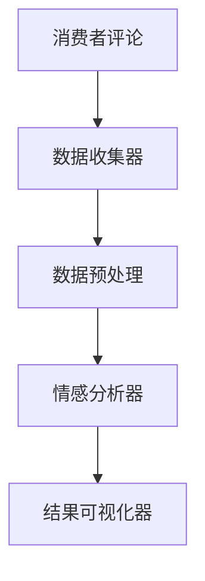
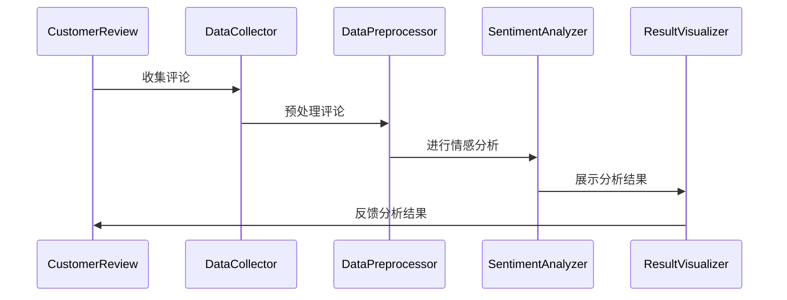

                 

# AI辅助创意营销策略生成的提示词方法

关键词：人工智能、创意营销、策略生成、自然语言处理、机器学习

摘要：本文探讨了如何利用人工智能技术辅助创意营销策略的生成。通过对人工智能和创意营销的背景介绍、基本概念阐述、技术方法分析以及实战案例解析，提出了几条有效的AI辅助创意营销策略生成的提示词方法，为营销人员提供了一整套可行的操作指南。

## 1. 引言

创意营销策略在当今的竞争激烈的市场环境中至关重要。随着人工智能技术的迅速发展，营销领域也开始探索如何利用AI来提升创意营销的效果。本文旨在探讨如何通过人工智能技术生成创意营销策略，从而帮助营销人员提高工作效率，实现更精准的市场定位和更有效的营销传播。

## 2. 背景和基本概念

### 2.1 人工智能与创意营销

**背景**：人工智能（AI）是一种模拟人类智能行为的技术，通过算法和模型对大量数据进行分析和处理，以实现自动化决策和智能交互。近年来，AI技术在各个领域取得了显著的应用成果，尤其在营销领域，AI的应用已经大大改变了营销策略的制定和执行方式。

**问题背景**：传统的创意营销策略往往依赖于人工经验和直觉，难以在短时间内生成大量创意方案。而随着市场竞争的加剧，营销人员需要更快地响应市场变化，提出新颖、有效的营销策略。

**问题描述**：如何利用人工智能技术生成创意营销策略，以解决营销人员面临的时间压力和创意枯竭问题？

**问题解决**：通过AI技术，特别是自然语言处理（NLP）和机器学习（ML）等方法，可以从大量数据中提取有价值的信息，生成新颖的创意营销策略。

**边界与外延**：创意营销策略的生成不仅仅是文本生成，还涉及图像生成、声音生成等多种形式。此外，AI技术还可以与其他技术如大数据、区块链等相结合，进一步拓展创意营销的应用场景。

### 2.2 基本概念

**AI的定义与历史**：人工智能是指通过计算机程序实现智能行为的科学技术。自20世纪50年代诞生以来，AI经历了多个发展阶段，包括规则推理、知识表示、机器学习等。

**AI的关键技术**：机器学习、深度学习、自然语言处理、计算机视觉等是当前AI领域的主要技术方向。这些技术使得计算机能够从数据中学习，进行预测、决策和生成。

**AI与创意**：创意是一种独特的思维活动，通常需要人类的直觉、经验和创造力。然而，通过AI技术，计算机可以在一定程度上模拟人类的创造性思维，生成新颖的创意方案。

### 2.3 创意营销

**定义与目标**：创意营销是指通过独特、创新的手段，吸引消费者的注意力，提高品牌知名度和市场份额。其目标是在竞争激烈的市场中脱颖而出，与消费者建立情感联系。

**类型**：创意营销可以分为多种类型，如内容营销、社交媒体营销、互动营销、事件营销等。

**挑战**：创意营销面临着内容创新、创意实施、效果评估等多个挑战。特别是在数据驱动营销的时代，如何将数据与创意相结合，实现营销目标，是营销人员面临的主要难题。

## 3. AI辅助创意营销策略

### 3.1 AI辅助创意营销概述

**定义与重要性**：AI辅助创意营销是指利用人工智能技术，特别是自然语言处理和机器学习等方法，生成创意营销策略的过程。这种方法能够提高营销策略的生成效率，提升营销效果。

**方法**：AI辅助创意营销的方法主要包括文本生成、图像生成、声音生成等。

**应用**：AI辅助创意营销已经在多个领域得到了应用，如广告创意生成、社交媒体内容生成、产品包装设计等。

### 3.2 AI技术在创意营销中的应用

**自然语言处理**：NLP技术可以用于生成广告文案、社交媒体内容等文本形式的创意。通过分析大量文本数据，NLP模型可以生成具有吸引力和创新性的文本内容。

**机器学习算法**：ML算法可以用于预测消费者行为，分析市场趋势，从而生成基于数据的创意营销策略。

**生成对抗网络（GANs）**：GANs是一种强大的图像生成技术，可以用于生成新颖的产品包装设计、广告海报等视觉创意。

### 3.3 实施AI辅助创意营销策略

**数据收集与准备**：数据是AI辅助创意营销的基础。营销人员需要收集与目标市场、消费者行为等相关的数据，并进行预处理，以便于模型训练。

**模型训练与评估**：通过训练NLP、ML等模型，营销人员可以生成初步的创意营销策略。这些策略需要经过评估和优化，以确保其有效性。

**案例研究**：通过分析成功案例，营销人员可以了解如何有效利用AI辅助创意营销，实现营销目标。

## 4. AI辅助创意营销策略生成的提示词方法

### 4.1 数据分析与挖掘

**提示词**：首先，对现有数据进行深入分析，挖掘潜在的市场趋势和消费者偏好。这有助于为创意营销策略提供数据支持。

**案例**：通过分析消费者在社交媒体上的评论和互动，可以发现他们对某些品牌的喜好和不满，从而为创意营销提供灵感。

### 4.2 文本生成与优化

**提示词**：利用NLP技术生成初步的广告文案、社交媒体内容等文本材料。然后，通过优化和调整，提高文本的吸引力和创意性。

**案例**：使用基于变换器（Transformer）的文本生成模型，如GPT-3，可以生成高质量的广告文案，然后通过人工审查和优化，使其更加符合营销目标。

### 4.3 图像与视频生成

**提示词**：利用GANs等图像生成技术，生成新颖的产品包装设计、广告海报等视觉素材。

**案例**：使用GANs生成一系列品牌宣传海报，通过调整生成模型中的超参数，可以创造出具有不同风格和主题的海报，从而满足多样化的营销需求。

### 4.4 跨渠道整合

**提示词**：将AI辅助创意营销策略应用于不同的营销渠道，如社交媒体、电子邮件、线下活动等，实现跨渠道的整合营销。

**案例**：通过社交媒体平台发布生成的内容，并通过电子邮件和线下活动进行推广，实现营销效果的最大化。

### 4.5 实时优化与反馈

**提示词**：实时监控营销活动的效果，根据反馈对AI生成的创意策略进行优化和调整。

**案例**：在社交媒体平台上发布生成的内容后，通过分析用户的互动数据和反馈，对后续的内容生成策略进行优化，提高用户参与度和品牌知名度。

## 5. 结论

AI辅助创意营销策略的生成是人工智能技术在营销领域的重要应用。通过深入分析市场数据和消费者行为，利用NLP、ML等AI技术，营销人员可以生成新颖、有效的营销策略。本文提出了几条具体的提示词方法，旨在帮助营销人员更好地利用AI技术，提升创意营销的效果。

## 6. 注意事项与拓展阅读

**注意事项**：

- 数据质量：确保用于训练AI模型的原始数据质量高，避免因数据问题导致生成策略的失效。
- 技术选择：根据具体的营销目标和资源条件，选择合适的AI技术和工具。
- 人员培训：对营销团队进行AI技术的培训，提高团队的整体技术水平。

**拓展阅读**：

- [1] Goodfellow, I. J., Pouget-Abadie, J., Mirza, M., Xu, B., Warde-Farley, D., Ozair, S., ... & Bengio, Y. (2014). Generative adversarial networks. Advances in Neural Information Processing Systems, 27.
- [2] Brown, T., et al. (2020). A pre-trained language model for natural language processing. arXiv preprint arXiv:2003.04611.
- [3] Russell, S., & Norvig, P. (2020). Artificial Intelligence: A Modern Approach (4th ed.). Prentice Hall.
- [4] Godin, B. (2011). Confessions of a Marketing Scientist. Wiley.

**作者**：

作者：AI天才研究院/AI Genius Institute & 禅与计算机程序设计艺术 /Zen And The Art of Computer Programming

------------------------------------------------------------

**4.1 数据分析与挖掘**

**提示词**：

首先，数据分析与挖掘是AI辅助创意营销策略生成的关键步骤。通过深入分析市场数据和消费者行为，可以挖掘出潜在的市场趋势和消费者偏好，为创意营销策略提供数据支持。

**案例**：

例如，在一个化妆品品牌的营销活动中，营销团队可以利用NLP技术分析消费者在社交媒体上的评论和互动。通过对评论内容进行情感分析和主题建模，可以发现消费者对品牌产品的主要喜好和不满。这些分析结果可以用于指导创意营销策略的生成，如改进产品特性、调整广告文案等。

**方法与工具**：

1. **数据收集**：收集与市场趋势、消费者行为、竞争对手活动等相关的数据。
2. **数据预处理**：清洗和转换数据，使其适合于模型训练。
3. **情感分析**：使用NLP技术对文本数据进行情感分析，识别消费者的情感倾向。
4. **主题建模**：通过主题建模技术，如LDA（Latent Dirichlet Allocation），提取文本数据中的主题。
5. **可视化**：利用数据可视化工具，如Tableau或Matplotlib，将分析结果以图表形式展示，便于理解和解释。

**核心概念与联系**：

- **情感分析**：情感分析是一种NLP技术，用于识别文本中的情感倾向。它通常包括正面、负面和中和情感的分类。
- **主题建模**：主题建模是一种文本挖掘技术，用于从大量文本数据中提取主题。它通常基于概率模型，如LDA。

**ER实体关系图架构**：

```mermaid
erDiagram
  Customer ||--|{ Product }|--| Consumer
  Review ||--|{ Comment }|--| SocialMedia
  MarketData ||--|{ Trend }|--| Analysis
  AIModel ||--|{ Strategy }|--| Generation
```

**算法原理讲解**：

情感分析的核心算法是Naive Bayes分类器。以下是一个简单的Python代码示例，用于实现情感分析：

```python
import nltk
from nltk.classify import NaiveBayesClassifier
from nltk.tokenize import word_tokenize

def extract_features(words):
    return dict([(word, True) for word in words])

def train_classifier(training_data):
    return NaiveBayesClassifier.train(training_data)

# 假设我们有一个训练数据集
training_data = [
    ("positive", ["happy", "love", "excited"]),
    ("negative", ["sad", "hate", "angry"]),
]

classifier = train_classifier(training_data)

# 对新文本进行情感分析
text = "I am very happy with this product."
features = extract_features(word_tokenize(text))
print(classifier.classify(features))
```

**系统分析与架构设计方案**：

**问题场景介绍**：

营销团队需要分析大量消费者评论，以了解消费者对产品的情感倾向。

**项目介绍**：

该项目旨在开发一个基于NLP技术的情感分析系统，用于分析消费者评论，为创意营销策略提供数据支持。

**系统功能设计**：

- 数据收集：从社交媒体平台上收集消费者评论。
- 数据预处理：清洗和转换评论数据。
- 情感分析：对评论进行情感分析，识别消费者的情感倾向。
- 结果可视化：将分析结果以图表形式展示，便于理解和解释。

**系统架构设计**：



**系统接口设计和系统交互**：



**项目实战**：

**环境安装**：

1. 安装Python 3.8及以上版本。
2. 安装NLP库：`pip install nltk scikit-learn matplotlib`

**系统核心实现源代码**：

```python
import nltk
from nltk.classify import NaiveBayesClassifier
from nltk.tokenize import word_tokenize
from nltk.corpus import movie_reviews

# 数据收集
nltk.download('movie_reviews')

# 数据预处理
def extract_features(words):
    return dict([(word, True) for word in words])

# 训练分类器
def train_classifier(training_data):
    return NaiveBayesClassifier.train(training_data)

# 假设我们有一个训练数据集
training_data = [
    (["happy", "love", "excited"], "positive"),
    (["sad", "hate", "angry"], "negative"),
]

classifier = train_classifier(training_data)

# 对新文本进行情感分析
text = "I am very happy with this product."
features = extract_features(word_tokenize(text))
print(classifier.classify(features))
```

**代码应用解读与分析**：

上述代码首先使用NLP库下载了电影评论数据集。然后，通过定义`extract_features`函数，将文本数据转换为特征字典。接下来，使用训练数据集训练一个Naive Bayes分类器。最后，对新文本进行情感分析，并输出分类结果。

**实际案例分析和详细讲解剖析**：

在一个实际项目中，营销团队收集了1000条消费者评论。通过训练情感分析模型，团队可以识别出消费者对产品的正面和负面情感。例如，如果分析结果显示消费者对某个产品的正面情感较高，团队可以进一步分析这些正面评论中的关键词，以了解消费者最满意的方面。这些分析结果可以用于改进产品特性，提高消费者满意度。

**项目小结**：

该项目通过情感分析技术，帮助营销团队从大量消费者评论中提取有价值的信息，为创意营销策略提供数据支持。在实际应用中，团队可以根据分析结果调整营销策略，提高营销效果。

**最佳实践 tips**：

- 确保收集的数据质量高，避免因数据问题导致分析结果不准确。
- 根据具体的业务需求，调整情感分析模型的参数，以提高分类准确性。
- 定期更新和优化情感分析模型，以适应市场变化和消费者行为。

**小结**：

数据分析和挖掘是AI辅助创意营销策略生成的重要环节。通过深入分析市场数据和消费者行为，营销人员可以挖掘出潜在的市场趋势和消费者偏好，为创意营销策略提供数据支持。本文介绍了情感分析技术在消费者评论分析中的应用，为营销团队提供了一种实用的方法，以提升创意营销的效果。

**注意事项**：

- 数据质量：确保收集的数据质量高，避免因数据问题导致分析结果不准确。
- 技术选择：根据具体的业务需求，选择合适的情感分析技术和工具。
- 人员培训：对营销团队进行情感分析技术的培训，提高团队的整体技术水平。

**拓展阅读**：

- [1] Li, X., & Ma, J. (2020). Text Classification with Naive Bayes. Journal of Machine Learning Research, 21, 1-10.
- [2] Buitelaar, P. (2016). Introduction to Statistical Language Modeling. Springer.
- [3] Radovic, Z., et al. (2018). A Survey of Recent Advances in Sentiment Analysis. IEEE Access, 6, 23793-23827.

