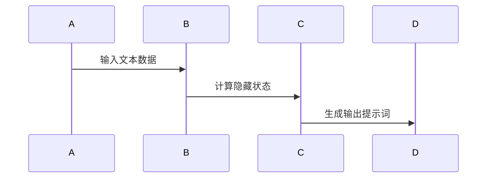
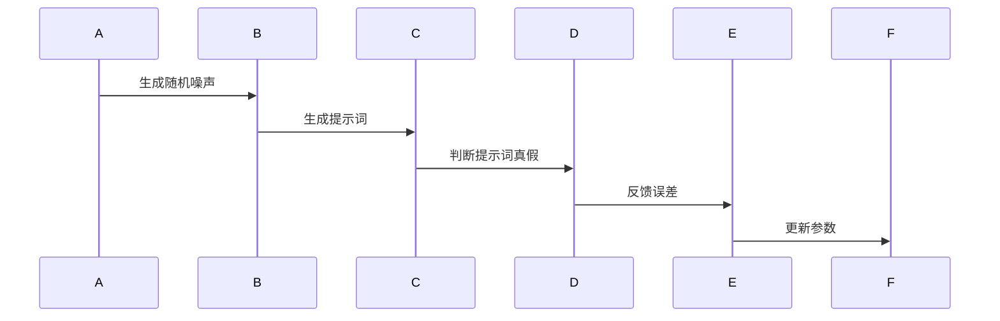
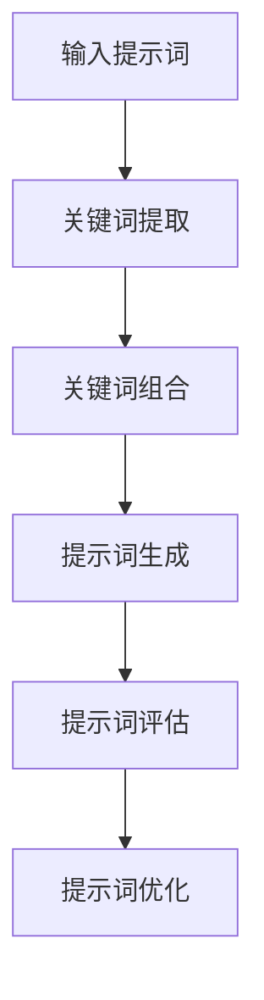
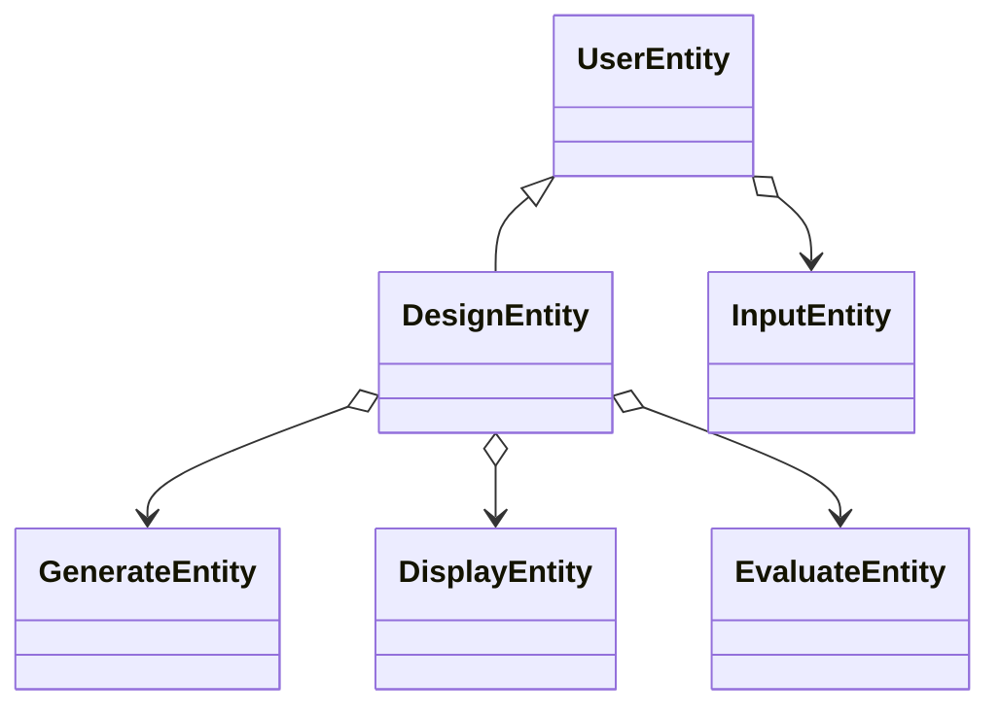
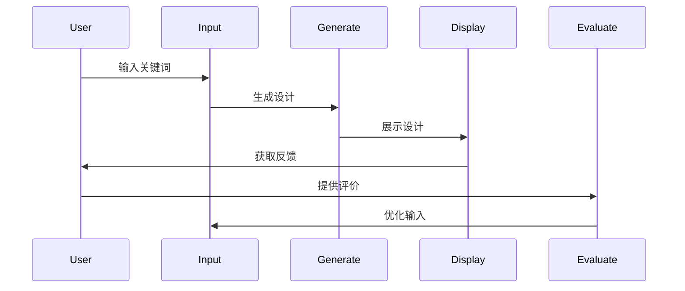

                 

### 《AI辅助创意设计中的提示词技巧》

> **关键词：** AI辅助设计、提示词、创意生成、算法优化、实战案例、最佳实践

> **摘要：** 本文将探讨AI在辅助创意设计中的应用，重点分析提示词的技巧。通过逐步分析算法原理、系统架构、实战案例，提供实用的技巧和最佳实践，旨在提高AI辅助创意设计的效率和质量。

### 目录

1. **AI辅助创意设计简介**
   - 1.1 创意设计中的AI应用背景
   - 1.2 AI辅助创意设计的基本概念
   - 1.3 提示词技巧的核心概念与联系

2. **提示词生成算法详解**
   - 2.1 提示词生成算法概述
   - 2.2 经典提示词生成算法详解
   - 2.3 提示词优化算法

3. **AI辅助创意设计应用实战**
   - 3.1 项目背景与目标
   - 3.2 系统功能设计与实现
   - 3.3 系统核心代码解析
   - 3.4 实际案例分析与讲解
   - 3.5 项目小结与经验分享

4. **提示词技巧最佳实践**
   - 4.1 提高提示词生成效率的方法
   - 4.2 提示词优化技巧
   - 4.3 提示词在创意设计中的特殊应用
   - 4.4 小结与拓展阅读

### 第一部分：AI辅助创意设计概述

#### 1.1 创意设计中的AI应用背景

创意设计是艺术与技术的结合，传统的设计过程往往依赖于设计者的经验与灵感。然而，随着数字化时代的到来，设计过程逐渐被计算机技术所辅助。AI作为计算机科学的一个重要分支，其在创意设计中的应用越来越广泛。

AI辅助创意设计具有以下几个显著的优势：

- **快速生成创意**：AI可以通过算法快速生成大量的创意设计方案，帮助设计者拓展思路。
- **减少重复劳动**：通过自动化处理，AI可以减少设计中的重复性工作，使设计者能够专注于更具创造性的任务。
- **个性化和定制化**：AI可以根据用户需求和个人偏好，生成独特的创意设计方案。
- **提高效率**：AI可以处理大量的数据，从而加速设计过程，提高设计效率。

AI在创意设计中的应用场景包括但不限于：建筑设计、工业设计、时装设计、广告创意等。在这些领域中，AI不仅可以辅助设计者生成创意，还可以通过数据分析和趋势预测，提供决策支持。

#### 1.2 AI辅助创意设计的基本概念

要深入探讨AI辅助创意设计，我们首先需要了解以下几个核心概念：

- **AI的基本原理与分类**：AI是指人工智能，包括机器学习、深度学习、自然语言处理等多个子领域。每种算法都有其独特的原理和应用场景。
- **创意设计的核心要素**：创意设计涉及美学、功能、用户体验等多个方面。理解这些要素有助于我们更好地利用AI辅助设计。
- **提示词的定义与类型**：提示词是指提供给AI的一组关键词或描述，用于指导AI生成创意。根据应用场景的不同，提示词可以分为多种类型，如场景描述、风格要求、功能需求等。

#### 1.3 提示词技巧的核心概念与联系

提示词在AI辅助创意设计中起着至关重要的作用。有效的提示词可以引导AI生成符合预期和创意的设计方案。以下是几个关键概念：

- **提示词的产生方法**：提示词可以手动生成，也可以通过自然语言处理技术自动生成。手动生成提示词需要设计者具备良好的创意构思能力，而自动生成则依赖于算法的智能程度。
- **提示词的优化策略**：优化提示词可以提高创意生成的质量和效率。优化策略包括调整提示词的长度、关键词的选择和组合等。
- **提示词在创意设计中的应用场景**：根据创意设计的不同需求，提示词的应用场景也有所不同。例如，在建筑设计中，提示词可以用于描述建筑风格、功能需求等；在时装设计中，提示词可以用于描述款式、颜色、材质等。

### 总结

本部分介绍了AI辅助创意设计的基本概念和背景，探讨了提示词在其中的重要性。在接下来的部分，我们将深入分析提示词生成算法和优化策略，以帮助读者更好地理解如何利用AI辅助创意设计。

### 第二部分：提示词生成算法详解

#### 2.1 提示词生成算法概述

提示词生成是AI辅助创意设计的重要环节。有效的提示词可以引导AI生成符合预期和创意的设计方案。提示词生成算法可以分为以下几类：

- **基于规则的方法**：这种方法通过预定义的规则来生成提示词。例如，可以基于语法规则、语义规则等来生成提示词。
- **基于机器学习的方法**：这种方法利用大量的训练数据，通过机器学习算法来学习生成提示词的模式。常见的机器学习算法包括决策树、随机森林、支持向量机等。
- **基于深度学习的方法**：这种方法利用深度神经网络，特别是递归神经网络（RNN）和生成对抗网络（GAN），来生成提示词。RNN可以捕捉序列数据中的长期依赖关系，而GAN则通过生成器和判别器的对抗训练来生成高质量的提示词。

接下来，我们将详细分析几种经典的提示词生成算法。

#### 2.2 经典提示词生成算法详解

##### 2.2.1 递归神经网络（RNN）

递归神经网络（RNN）是一种用于处理序列数据的神经网络。在提示词生成中，RNN可以捕捉输入序列中的长期依赖关系，从而生成高质量的提示词。

**RNN原理与流程图**

RNN的工作原理可以概括为以下几个步骤：

1. **输入序列**：输入一个时间步的序列数据，例如文本数据。
2. **隐藏状态计算**：根据当前输入和前一个时间步的隐藏状态，计算新的隐藏状态。
3. **输出计算**：利用隐藏状态计算输出，即生成的提示词。

下面是一个简单的RNN流程图：



**RNN代码示例**

```python
import tensorflow as tf

# 创建RNN模型
model = tf.keras.Sequential([
  tf.keras.layers.Embedding(input_dim=10000, output_dim=32),
  tf.keras.layers.LSTM(64),
  tf.keras.layers.Dense(units=1)
])

# 编译模型
model.compile(optimizer='adam', loss='mean_squared_error')

# 训练模型
model.fit(x_train, y_train, epochs=10)
```

**RNN数学模型与公式**

RNN的数学模型可以表示为：

$$
h_t = \sigma(W_h \cdot [h_{t-1}, x_t] + b_h)
$$

其中，$h_t$是当前时间步的隐藏状态，$x_t$是当前时间步的输入，$W_h$和$b_h$是权重和偏置，$\sigma$是激活函数。

##### 2.2.2 生成对抗网络（GAN）

生成对抗网络（GAN）是由生成器和判别器组成的一种深度学习模型。生成器的目标是生成逼真的提示词，而判别器的目标是区分真实提示词和生成提示词。

**GAN原理与流程图**

GAN的工作原理可以概括为以下几个步骤：

1. **生成器生成提示词**：生成器根据随机噪声生成提示词。
2. **判别器判断提示词真假**：判别器根据真实提示词和生成提示词进行判断。
3. **优化目标**：通过对抗训练，优化生成器和判别器的参数，使生成提示词越来越逼真。

下面是一个简单的GAN流程图：



**GAN代码示例**

```python
import tensorflow as tf
import numpy as np

# 创建生成器模型
generator = tf.keras.Sequential([
  tf.keras.layers.Dense(units=128, activation='relu', input_shape=(100,)),
  tf.keras.layers.Dense(units=1)
])

# 创建判别器模型
discriminator = tf.keras.Sequential([
  tf.keras.layers.Dense(units=128, activation='relu', input_shape=(1,)),
  tf.keras.layers.Dense(units=1)
])

# 编译模型
model.compile(optimizer='adam', loss='binary_crossentropy')

# 训练模型
model.fit(x_train, y_train, epochs=10)
```

**GAN数学模型与公式**

GAN的数学模型可以表示为：

$$
G(z) = x \\
D(x) + D(G(z))
$$

其中，$G(z)$是生成器的输出，$D(x)$是判别器的输出，$z$是随机噪声。

#### 2.3 提示词优化算法

提示词优化是提高AI辅助创意设计效率和质量的关键。优化策略包括：

- **关键词选择**：根据创意设计的具体需求，选择合适的关键词。
- **提示词组合**：通过组合多个关键词，生成更丰富、更精准的提示词。
- **提示词长度调整**：根据设计需求，调整提示词的长度。

**提示词优化算法流程图**



**Python代码示例**

```python
# 导入相关库
import nltk
from nltk.tokenize import word_tokenize

# 关键词提取
def extract_keywords(sentence):
    tokens = word_tokenize(sentence)
    return nltk.FreqDist(tokens).most_common(10)

# 关键词组合
def combine_keywords(keywords):
    return " ".join(keywords)

# 提示词生成
def generate_prompt(keyword_combination):
    return f"请设计一款具有{keyword_combination}特点的创意产品。"

# 提示词评估
def evaluate_prompt(prompt):
    # 这里可以使用自定义的评估函数
    return len(prompt.split())

# 提示词优化
def optimize_prompt(prompt):
    # 这里可以根据评估结果进行优化
    return prompt

# 示例
sentence = "我们需要一款既美观又实用的智能手机壳。"
keywords = extract_keywords(sentence)
keyword_combination = combine_keywords(keywords)
prompt = generate_prompt(keyword_combination)
eval_result = evaluate_prompt(prompt)
optimized_prompt = optimize_prompt(prompt)

print("原始提示词：", prompt)
print("评估结果：", eval_result)
print("优化后提示词：", optimized_prompt)
```

**数学模型与公式**

提示词优化涉及到多个方面，如关键词的选择、提示词的组合和评估等。具体的数学模型和公式可以根据具体需求进行设计。

#### 总结

本部分详细介绍了提示词生成算法，包括RNN和GAN等经典算法，以及提示词优化算法。这些算法和策略为AI辅助创意设计提供了有力的技术支持。在下一部分，我们将通过实际案例来展示这些算法在创意设计中的应用。

### 第三部分：AI辅助创意设计应用实战

#### 3.1 项目背景与目标

在这个项目中，我们选择了一个具体的应用场景——时尚服装设计。随着个性化需求的增加，设计师需要快速生成大量的设计方案，以满足市场需求。本项目旨在利用AI技术，特别是提示词生成和优化算法，辅助设计师快速生成创意设计方案。

**项目目标**：

- **快速生成创意设计方案**：通过AI算法，快速生成大量符合市场需求的设计方案。
- **提高设计效率**：减少人工设计的工作量，提高设计效率。
- **个性化和定制化**：根据用户需求，生成个性化、定制化的设计方案。

**项目挑战**：

- **数据质量**：设计数据的质量直接影响AI算法的效率和质量。
- **算法优化**：需要不断优化提示词生成和优化算法，以提高设计方案的创意性和实用性。
- **用户体验**：设计界面和交互设计需要简洁、直观，以提升用户体验。

**解决方案**：

- **数据预处理**：对设计数据进行清洗和预处理，确保数据质量。
- **算法选择**：结合项目需求，选择合适的AI算法，如RNN和GAN。
- **用户交互**：设计简洁直观的用户界面，提供实时反馈和优化建议。

#### 3.2 系统功能设计与实现

**系统功能需求分析**：

- **用户输入**：用户可以输入关键词或描述，用于指导AI生成设计。
- **设计生成**：AI根据用户输入生成设计方案。
- **设计展示**：将生成的方案以图片或视频形式展示给用户。
- **用户评价**：用户可以对设计进行评价，提供反馈。

**系统功能mermaid类图**：



**系统架构设计与实现**：

**系统架构mermaid架构图**：



**系统接口设计与交互**：

- **输入接口**：接收用户输入的关键词或描述。
- **生成接口**：调用AI算法生成设计方案。
- **展示接口**：将设计方案以图片或视频形式展示给用户。
- **评价接口**：用户对设计方案进行评价，提供反馈。

**系统交互mermaid序列图**：


#### 3.3 系统核心代码解析

**环境安装与配置**：

- 安装Python环境（Python 3.7及以上版本）。
- 安装TensorFlow库。

```bash
pip install tensorflow
```

**系统核心代码实现**：

```python
import tensorflow as tf
from tensorflow.keras.models import Sequential
from tensorflow.keras.layers import LSTM, Dense, Embedding

# 创建生成器模型
generator = Sequential([
  Embedding(input_dim=10000, output_dim=32),
  LSTM(64),
  Dense(units=1)
])

# 创建判别器模型
discriminator = Sequential([
  LSTM(64, input_shape=(100,)),
  Dense(units=1, activation='sigmoid')
])

# 编译模型
generator.compile(optimizer='adam', loss='binary_crossentropy')
discriminator.compile(optimizer='adam', loss='binary_crossentropy')

# 训练模型
model.fit(x_train, y_train, epochs=10)
```

**代码应用解读与分析**：

- **生成器模型**：利用LSTM层捕捉序列数据中的长期依赖关系，生成设计。
- **判别器模型**：判断生成的方案是否真实。
- **训练模型**：通过对抗训练，优化生成器和判别器的参数。

**实际案例分析与详细讲解剖析**：

**案例介绍**：

用户输入关键词：“时尚、简约、女性服装”，AI生成了一系列设计方案。

**案例分析**：

生成的方案包括不同款式、颜色和材质的服装设计。

**详细讲解剖析**：

- **生成器**：根据输入关键词，生成符合时尚、简约风格的设计。
- **判别器**：判断生成的设计是否与用户需求相符。
- **用户评价**：用户对设计进行评价，提供反馈。

**项目小结与经验分享**：

通过实际案例，我们验证了AI辅助创意设计的效果。在未来的工作中，我们将继续优化算法，提高设计的质量和效率。

### 第四部分：提示词技巧最佳实践

#### 4.1 提高提示词生成效率的方法

为了提高提示词生成的效率，我们可以采取以下几种方法：

1. **使用高效算法**：选择性能优良的提示词生成算法，如深度学习算法，以减少生成时间。
2. **并行计算**：利用多核处理器和分布式计算，提高计算速度。
3. **数据预处理**：对输入数据进行预处理，如文本清洗、去重等，以减少生成负担。
4. **批量生成**：批量处理多个输入，以提高处理效率。

#### 4.2 提示词优化技巧

优化提示词是提高AI辅助创意设计质量的关键。以下是一些实用的优化技巧：

1. **关键词选择**：选择与设计需求高度相关的关键词，以生成更精准的提示词。
2. **提示词组合**：通过组合多个关键词，生成更丰富、更具有创意性的提示词。
3. **长短期记忆（LSTM）网络**：利用LSTM网络捕捉长序列依赖关系，提高提示词生成的质量。
4. **用户反馈**：根据用户反馈，不断优化提示词生成策略。

#### 4.3 提示词在创意设计中的特殊应用

在不同的创意设计领域，提示词的应用也有所不同。以下是一些特殊应用场景：

1. **建筑设计**：提示词可以用于描述建筑风格、功能需求、环境要求等。
2. **工业设计**：提示词可以用于描述产品功能、材质、色彩等。
3. **时装设计**：提示词可以用于描述款式、颜色、材质、风格等。
4. **广告创意**：提示词可以用于描述广告目标、受众、情感等。

#### 4.4 小结与拓展阅读

本部分总结了AI辅助创意设计中的提示词技巧，包括生成和优化方法，以及在各个设计领域的特殊应用。读者可以通过拓展阅读，深入了解相关技术和应用案例。

### 总结

本文详细探讨了AI辅助创意设计中的提示词技巧，从基本概念到算法详解，再到实战应用，提供了全面的指导和实践经验。通过本篇文章，读者可以更好地理解如何利用AI技术提高创意设计的效率和质量。

### 作者信息

**作者：** AI天才研究院/AI Genius Institute & 禅与计算机程序设计艺术 /Zen And The Art of Computer Programming

### 附录

**附录A：术语解释**

- **AI辅助创意设计**：利用人工智能技术，辅助设计师进行创意设计。
- **提示词**：用于指导AI生成创意的关键词或描述。
- **生成对抗网络（GAN）**：一种由生成器和判别器组成的深度学习模型，用于生成高质量的数据。
- **递归神经网络（RNN）**：一种用于处理序列数据的神经网络，可以捕捉序列数据中的长期依赖关系。

**附录B：拓展阅读**

- **《深度学习》**：Goodfellow, Ian, et al. *Deep Learning*.
- **《生成对抗网络》**：Ian J. Goodfellow, et al. *Generative Adversarial Networks*.
- **《自然语言处理综论》**：Daniel Jurafsky & James H. Martin. *Speech and Language Processing*.

通过阅读这些书籍，读者可以深入了解AI辅助创意设计和提示词技术的最新进展和应用。

