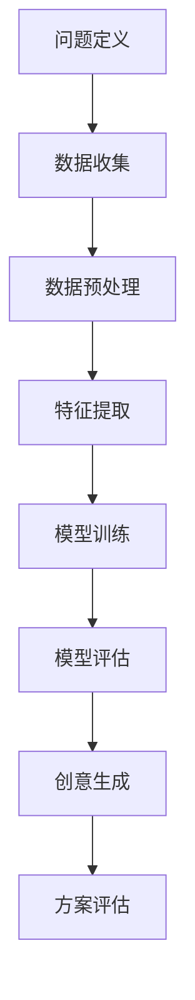
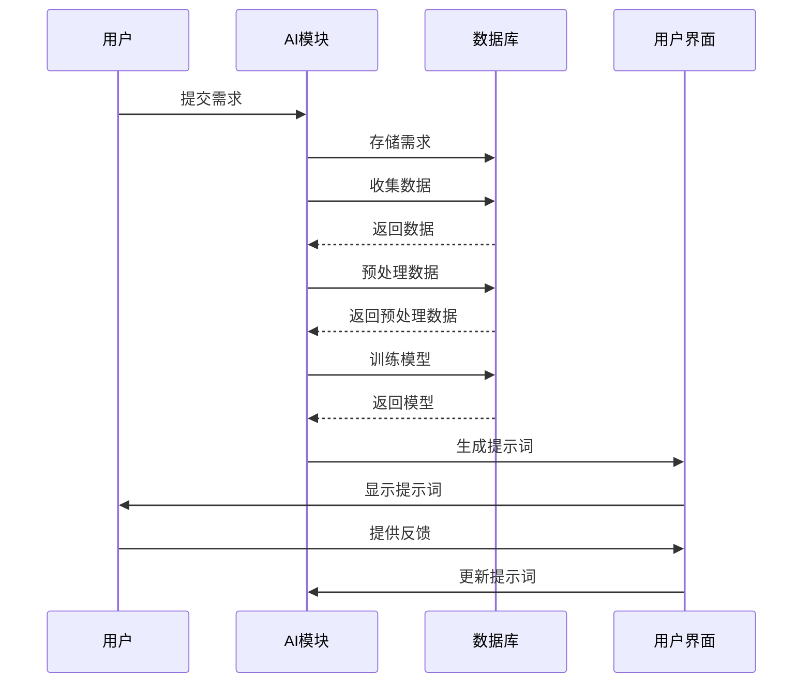
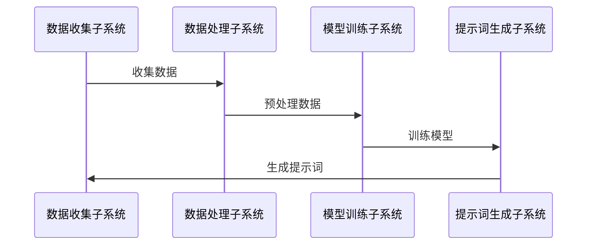
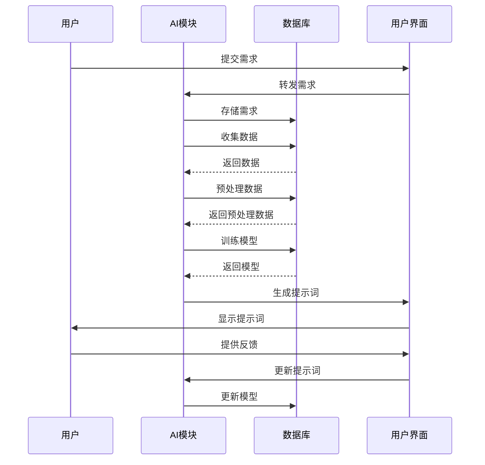

                 

### 《AI辅助创新：提示词激发跨领域思维》

> 关键词：人工智能、创新、提示词、跨领域思维、算法原理

> 摘要：本文深入探讨人工智能在辅助创新中的应用，特别关注提示词如何激发跨领域思维。通过介绍核心概念、算法原理、系统分析与架构设计以及项目实战，本文旨在为读者提供全面的技术思路和实际操作指南，助力AI辅助创新的实际应用。

----------------------------------------------------------------

### 《AI辅助创新：提示词激发跨领域思维》目录大纲

----------------------------------------------------------------

## 第一部分：背景介绍

### 第1章 问题背景与核心概念

- **1.1 问题背景**
  - 创新的重要性
  - 传统创新的局限性
  - AI技术在辅助创新中的作用

- **1.2 核心概念**
  - AI辅助创新的定义
  - 提示词的概念
  - 跨领域思维的价值

- **1.3 边界与外延**
  - AI辅助创新的边界
  - 提示词的使用场景
  - 跨领域思维的应用范围

- **1.4 概念结构与核心要素组成**
  - AI辅助创新的框架结构
  - 提示词的类型与应用
  - 跨领域思维的实现方式

- **1.5 本章小结**
  - 对核心概念的理解
  - 对AI辅助创新前景的展望

----------------------------------------------------------------

## 第二部分：核心概念与联系

### 第2章 AI辅助创新原理

- **2.1 AI辅助创新的基本原理**
  - AI技术在创新中的应用
  - AI如何辅助解决问题

- **2.2 提示词属性特征对比表格**
  - 提示词的种类与作用
  - 不同类型提示词的对比

- **2.3 跨领域思维ER实体关系图**
  - 跨领域思维的概念
  - 实体关系图展示

- **2.4 本章小结**
  - 对AI辅助创新原理的理解
  - 对跨领域思维的重要性认识

----------------------------------------------------------------

## 第三部分：算法原理讲解

### 第3章 算法原理与流程

- **3.1 算法原理**
  - 提示词激发跨领域思维的算法原理

- **3.2 Mermaid流程图**
  - 提示词处理流程
  - 跨领域思维实现流程

- **3.3 Python源代码解析**
  - 代码结构
  - 功能实现

- **3.4 数学模型与公式**
  - 基本数学模型介绍
  - 公式推导

- **3.5 举例说明**
  - 实际案例演示
  - 结果分析

- **3.6 本章小结**
  - 对算法原理的理解
  - 对Python代码的掌握

----------------------------------------------------------------

## 第四部分：系统分析与架构设计

### 第4章 系统功能设计与架构

- **4.1 问题描述与项目介绍**
  - 创新问题的提出
  - 项目背景介绍

- **4.2 系统功能设计**
  - 领域模型
  - 功能模块划分

- **4.3 系统架构设计**
  - 总体架构图
  - 子系统架构

- **4.4 系统接口设计**
  - 接口定义
  - 接口交互

- **4.5 系统交互Mermaid序列图**
  - 系统交互流程
  - Mermaid序列图展示

- **4.6 本章小结**
  - 对系统设计与架构的理解
  - 对系统实施可行性的评估

----------------------------------------------------------------

## 第五部分：项目实战

### 第5章 环境安装与系统实现

- **5.1 环境安装**
  - 操作系统与环境配置
  - 必要工具与库安装

- **5.2 系统核心实现源代码**
  - 代码结构与功能模块
  - 主要代码示例

- **5.3 代码应用解读与分析**
  - 代码逻辑解析
  - 应用场景分析

- **5.4 实际案例分析与讲解**
  - 实际案例引入
  - 详细剖析与讲解

- **5.5 项目小结**
  - 项目总结
  - 亮点与不足

----------------------------------------------------------------

## 第六部分：最佳实践与拓展阅读

### 第6章 最佳实践

- **6.1 实践技巧**
  - 提高AI辅助创新效率的技巧
  - 跨领域思维实践案例

- **6.2 注意事项**
  - 可能遇到的问题与解决方案
  - 使用提示词时的注意事项

- **6.3 拓展阅读**
  - 相关书籍与文献推荐
  - 网络资源链接

----------------------------------------------------------------

### 结论

本文从背景介绍、核心概念与联系、算法原理讲解、系统分析与架构设计、项目实战以及最佳实践与拓展阅读等多个方面，系统地阐述了AI辅助创新：提示词激发跨领域思维。希望通过本文，读者能够对这一前沿技术有更深入的理解，并能够将其应用于实际创新项目中。

----------------------------------------------------------------

## 第1章 问题背景与核心概念

### 1.1 问题背景

创新，作为推动社会进步和经济发展的关键因素，一直受到各领域的广泛关注。在科技飞速发展的今天，创新的重要性愈发凸显。然而，传统创新模式存在显著的局限性。首先，创新往往依赖于经验和直觉，容易陷入“路径依赖”，难以突破现有框架。其次，创新资源有限，如何高效利用这些资源成为一大挑战。此外，创新过程复杂，涉及多个环节和领域，协调和整合难度大。

随着人工智能技术的崛起，AI作为一种强大的工具，逐渐被引入到创新过程中。AI不仅可以处理大量数据，还可以通过算法模拟人类思维，为创新提供新的思路和方法。AI辅助创新，成为当前研究的热点。在这一背景下，如何有效地利用AI技术，激发跨领域思维，成为亟待解决的问题。

### 1.2 核心概念

为了深入探讨AI辅助创新，首先需要明确几个核心概念：

#### AI辅助创新的定义

AI辅助创新指的是利用人工智能技术，如机器学习、自然语言处理等，对创新过程进行支持和优化。AI可以通过数据挖掘、模式识别、算法优化等方式，帮助人们发现潜在的创新机会，提高创新效率。

#### 提示词的概念

提示词（Prompt Word）是一种引导性语言，用于激发用户的思考。在AI辅助创新中，提示词可以帮助用户从不同角度审视问题，拓宽思维，产生新的创意。提示词可以是简单的词语，也可以是短语或句子。

#### 跨领域思维的价值

跨领域思维（Interdisciplinary Thinking）是指在不同学科、领域之间进行思考和问题解决的能力。跨领域思维能够整合不同领域的知识，产生创新性的解决方案。在创新过程中，跨领域思维有助于发现新的联系和可能性，是推动创新的重要力量。

### 1.3 边界与外延

#### AI辅助创新的边界

AI辅助创新的边界主要涉及以下几个方面：

1. **数据可用性和质量**：AI需要大量高质量的数据来进行训练和推理。数据的质量和可用性直接影响AI辅助创新的效果。
2. **算法能力**：不同算法适用于不同类型的创新问题。选择合适的算法是确保AI辅助创新有效性的关键。
3. **用户参与**：AI辅助创新需要用户的积极参与，包括问题的设定、提示词的选择和反馈等。

#### 提示词的使用场景

提示词可以在多种场景下发挥作用：

1. **问题定义**：通过提示词，帮助用户明确创新问题的核心。
2. **创意生成**：在创意生成的过程中，提示词可以激发用户的联想，产生新的创意。
3. **方案评估**：在方案评估阶段，提示词可以帮助用户从不同角度评估方案的可行性。

#### 跨领域思维的应用范围

跨领域思维的应用范围非常广泛，包括但不限于：

1. **技术创新**：在新技术研发过程中，跨领域思维有助于整合不同技术，实现技术突破。
2. **商业创新**：在商业模式创新中，跨领域思维可以帮助企业发现新的市场机会。
3. **社会创新**：在社会问题的解决中，跨领域思维能够提供多样化的解决方案。

### 1.4 概念结构与核心要素组成

#### AI辅助创新的框架结构

AI辅助创新的框架结构可以概括为以下几个关键部分：

1. **问题定义**：明确创新问题的核心和目标。
2. **数据准备**：收集、清洗和预处理相关数据，为AI算法提供高质量的数据支持。
3. **模型训练**：选择合适的算法，对数据进行分析和训练，构建AI模型。
4. **创意生成**：利用AI模型生成创新方案或创意。
5. **方案评估**：对生成的方案进行评估和优化。

#### 提示词的类型与应用

提示词可以根据其功能和应用场景分为以下几种类型：

1. **引导性提示词**：用于引导用户思考，提出新的问题或假设。
2. **扩展性提示词**：用于扩展用户思维，提供更多的信息或视角。
3. **验证性提示词**：用于验证用户想法的合理性和可行性。

#### 跨领域思维的实现方式

跨领域思维的实现方式包括以下几个方面：

1. **跨学科合作**：通过跨学科的合作，整合不同领域的知识和技能。
2. **信息融合**：利用信息融合技术，将不同领域的知识进行整合和融合。
3. **思维导图**：通过绘制思维导图，帮助用户从不同角度思考问题。

### 1.5 本章小结

在本章中，我们探讨了AI辅助创新的问题背景、核心概念以及边界与外延。通过介绍AI辅助创新、提示词和跨领域思维等关键概念，我们明确了这些概念在创新过程中的作用和意义。同时，我们对AI辅助创新的框架结构、提示词的类型与应用以及跨领域思维的实现方式进行了详细阐述。这些核心概念为后续章节的深入讨论提供了基础。

## 第2章 AI辅助创新原理

### 2.1 AI辅助创新的基本原理

AI辅助创新的基本原理主要基于人工智能技术的强大数据处理和分析能力。在创新过程中，AI能够自动从大量数据中提取有用信息，识别潜在的模式和趋势，从而为创新提供有力的支持。

首先，AI技术通过机器学习算法，如神经网络、决策树、聚类算法等，对大量数据进行分析和挖掘，从中发现潜在的创新机会。例如，在产品创新中，AI可以通过分析用户行为数据，识别用户需求和市场趋势，从而指导产品设计和改进。

其次，AI技术可以模拟人类思维过程，进行问题建模和求解。例如，在科学研究领域，AI可以模拟科学家的思维过程，提出新的假设和实验方案，从而加速科研进程。

此外，AI技术还可以通过自然语言处理技术，对文本信息进行处理和分析，帮助用户从不同角度审视问题，激发新的创意。例如，在创意生成过程中，AI可以分析用户输入的问题，生成相关的提示词，引导用户思考，从而产生新的创意。

总的来说，AI辅助创新的基本原理在于利用人工智能技术的高效数据处理和分析能力，辅助人类进行创新，提高创新效率和效果。

### 2.2 提示词属性特征对比表格

在AI辅助创新过程中，提示词发挥着至关重要的作用。为了更好地理解和应用提示词，我们可以从以下几个方面对提示词的属性特征进行对比：

1. **引导性**：提示词是否具有引导用户思考、提出问题或假设的功能。
2. **扩展性**：提示词是否能够提供额外的信息，扩展用户的思维视野。
3. **验证性**：提示词是否能够验证用户想法的合理性和可行性。
4. **通用性**：提示词是否适用于多种场景和领域。
5. **专业性**：提示词在特定领域或问题中的专业性和针对性。

下面是一个简化的提示词属性特征对比表格：

| 提示词类型 | 引导性 | 扩展性 | 验证性 | 通用性 | 专业性 |
| :--------: | :----: | :----: | :----: | :----: | :----: |
| 引导性提示词 | 高     | 低     | 低     | 高     | 中     |
| 扩展性提示词 | 中     | 高     | 低     | 高     | 中     |
| 验证性提示词 | 低     | 中     | 高     | 中     | 高     |
| 通用性提示词 | 高     | 高     | 高     | 高     | 低     |
| 专业性提示词 | 中     | 中     | 中     | 低     | 高     |

通过这个表格，我们可以看出不同类型提示词的特点和适用场景。例如，引导性提示词适合用于问题定义和创意生成阶段，扩展性提示词适合用于拓宽思维视野，验证性提示词适合用于方案评估和决策。同时，我们也可以根据具体需求和场景选择合适的提示词类型。

### 2.3 跨领域思维ER实体关系图

跨领域思维是一种在不同学科、领域之间进行思考和问题解决的能力。为了更好地理解和应用跨领域思维，我们可以使用ER（实体关系）图来展示不同领域之间的关系。

下面是一个简化的跨领域思维ER实体关系图：

```mermaid
erDiagram
  ProblemDomain ||--|{ AlgorithmDomain : Uses}
  ProblemDomain ||--|{ DataDomain : Processes}
  AlgorithmDomain ||--|{ TechnologyDomain : Applies}
  DataDomain ||--|{ KnowledgeDomain : Gathers}
  KnowledgeDomain ||--|{ SocialDomain : Influences}
  SocialDomain ||--|{ CultureDomain : Shaped}
  CultureDomain ||--|{ ProblemDomain : Influenced}
```

在这个ER图中，我们定义了以下几个实体：

1. **ProblemDomain（问题领域）**：表示需要解决的问题或挑战。
2. **AlgorithmDomain（算法领域）**：表示解决问题的算法和技术。
3. **DataDomain（数据领域）**：表示处理问题的数据来源和类型。
4. **TechnologyDomain（技术领域）**：表示算法和技术应用的具体技术。
5. **KnowledgeDomain（知识领域）**：表示在解决问题过程中获取的知识和经验。
6. **SocialDomain（社会领域）**：表示社会环境和社会因素对问题的影响。
7. **CultureDomain（文化领域）**：表示文化背景和文化价值观对问题的影响。

这些实体之间存在多种关系，如“使用”、“处理”、“应用”、“收集”、“影响”等。通过这个ER图，我们可以清晰地看到跨领域思维如何在不同领域之间进行信息和资源的整合，从而产生新的解决方案和创新点。

### 2.4 本章小结

在本章中，我们深入探讨了AI辅助创新的基本原理，包括AI在创新中的应用、提示词的属性特征对比以及跨领域思维的ER实体关系图。通过介绍这些核心概念和工具，我们为后续章节的深入讨论和具体实践奠定了基础。在下一章中，我们将进一步讲解AI辅助创新的算法原理和实现流程，帮助读者更好地理解和应用这一前沿技术。

## 第3章 算法原理与流程

### 3.1 算法原理

AI辅助创新的算法原理主要基于以下几个核心思想：

1. **数据驱动的知识发现**：通过机器学习和数据挖掘技术，从大量数据中提取有用的信息和知识，为创新提供数据支持。
2. **跨领域的知识融合**：通过跨领域思维，将不同领域的知识进行整合和融合，产生新的创意和解决方案。
3. **模型驱动的决策支持**：利用人工智能模型，对创新方案进行评估和优化，提供决策支持。

具体来说，AI辅助创新的算法流程可以分为以下几个步骤：

1. **问题定义**：明确创新问题的核心和目标，将问题转化为数据驱动的形式。
2. **数据收集**：从各种渠道收集与问题相关的数据，包括结构化和非结构化数据。
3. **数据预处理**：对收集到的数据进行清洗、转换和整合，为后续分析做好准备。
4. **特征提取**：从预处理后的数据中提取有用的特征，为机器学习模型提供输入。
5. **模型训练**：选择合适的机器学习算法，对特征进行训练，构建预测模型。
6. **模型评估**：对训练好的模型进行评估，确保其准确性和可靠性。
7. **创意生成**：利用训练好的模型，生成创新方案或创意。
8. **方案评估**：对生成的方案进行评估和优化，选择最佳方案。

通过这个算法流程，AI能够辅助人类进行创新，提高创新效率和效果。

### 3.2 Mermaid流程图

为了更直观地展示AI辅助创新的算法原理和流程，我们可以使用Mermaid语言绘制一个流程图。以下是AI辅助创新的Mermaid流程图：



在这个流程图中，每个节点代表一个步骤，箭头表示步骤之间的依赖关系。具体流程如下：

1. **问题定义**：明确创新问题的核心和目标。
2. **数据收集**：从各种渠道收集与问题相关的数据。
3. **数据预处理**：对收集到的数据进行清洗、转换和整合。
4. **特征提取**：从预处理后的数据中提取有用的特征。
5. **模型训练**：选择合适的机器学习算法，对特征进行训练。
6. **模型评估**：对训练好的模型进行评估，确保其准确性和可靠性。
7. **创意生成**：利用训练好的模型，生成创新方案或创意。
8. **方案评估**：对生成的方案进行评估和优化，选择最佳方案。

通过这个流程图，我们可以清晰地了解AI辅助创新的整个过程，为实际应用提供参考。

### 3.3 Python源代码解析

为了更好地理解AI辅助创新的算法原理和实现过程，我们可以通过Python源代码来详细阐述。以下是一个简化的Python代码示例，用于实现AI辅助创新的核心步骤：

```python
import pandas as pd
from sklearn.model_selection import train_test_split
from sklearn.ensemble import RandomForestClassifier
from sklearn.metrics import accuracy_score

# 数据收集
data = pd.read_csv('data.csv')

# 数据预处理
data = data.dropna()
data = pd.get_dummies(data)

# 特征提取
X = data.drop('target', axis=1)
y = data['target']

# 模型训练
X_train, X_test, y_train, y_test = train_test_split(X, y, test_size=0.2, random_state=42)
model = RandomForestClassifier()
model.fit(X_train, y_train)

# 模型评估
y_pred = model.predict(X_test)
accuracy = accuracy_score(y_test, y_pred)
print(f'Model Accuracy: {accuracy:.2f}')

# 创意生成
def generate_ideas(data):
    # 使用模型生成创意
    ideas = []
    for i in range(len(data)):
        idea = model.predict([data.iloc[i]])
        ideas.append(idea)
    return ideas

# 方案评估
def evaluate_ideas(ideas):
    # 对创意进行评估和优化
    evaluated_ideas = []
    for idea in ideas:
        # 进行评估
        evaluated_idea = evaluate_idea(idea)
        evaluated_ideas.append(evaluated_idea)
    return evaluated_ideas

# 主程序
if __name__ == '__main__':
    # 数据收集
    data = pd.read_csv('data.csv')
    
    # 数据预处理
    data = data.dropna()
    data = pd.get_dummies(data)
    
    # 创意生成
    ideas = generate_ideas(data)
    
    # 方案评估
    evaluated_ideas = evaluate_ideas(ideas)
    
    # 输出结果
    print(f'Generated Ideas: {ideas}')
    print(f'Evaluated Ideas: {evaluated_ideas}')
```

在这个示例中，我们首先进行了数据收集和预处理，然后使用随机森林算法进行模型训练和评估。接着，我们定义了`generate_ideas`函数和`evaluate_ideas`函数，用于生成创意和评估创意。最后，通过主程序实现了整个AI辅助创新的流程。

通过这个Python源代码示例，我们可以更直观地了解AI辅助创新的算法原理和实现过程，为实际应用提供参考。

### 3.4 数学模型与公式

在AI辅助创新的过程中，数学模型和公式扮演着至关重要的角色。以下是一些基本的数学模型和公式，用于描述AI辅助创新的关键步骤和原理。

#### 机器学习模型

1. **线性回归模型**：
   $$ y = \beta_0 + \beta_1 x_1 + \beta_2 x_2 + \ldots + \beta_n x_n $$
   其中，$y$ 是目标变量，$x_1, x_2, \ldots, x_n$ 是特征变量，$\beta_0, \beta_1, \beta_2, \ldots, \beta_n$ 是模型的参数。

2. **逻辑回归模型**：
   $$ P(y=1) = \frac{1}{1 + e^{-(\beta_0 + \beta_1 x_1 + \beta_2 x_2 + \ldots + \beta_n x_n)}} $$
   其中，$P(y=1)$ 是目标变量为1的概率，其他符号与线性回归相同。

3. **支持向量机模型**：
   $$ w \cdot x - b = 0 $$
   其中，$w$ 是权重向量，$x$ 是特征向量，$b$ 是偏置项。

#### 数据预处理

1. **标准化**：
   $$ x_{\text{norm}} = \frac{x - \mu}{\sigma} $$
   其中，$x$ 是原始数据，$\mu$ 是均值，$\sigma$ 是标准差。

2. **归一化**：
   $$ x_{\text{norm}} = \frac{x}{\max(x) - \min(x)} $$
   其中，$x$ 是原始数据。

#### 模型评估

1. **准确率**：
   $$ \text{Accuracy} = \frac{\text{预测正确的样本数}}{\text{总样本数}} $$

2. **召回率**：
   $$ \text{Recall} = \frac{\text{预测正确的正样本数}}{\text{实际正样本数}} $$

3. **F1 分数**：
   $$ \text{F1-Score} = 2 \times \frac{\text{Precision} \times \text{Recall}}{\text{Precision} + \text{Recall}} $$
   其中，Precision 是精确率，Recall 是召回率。

通过这些数学模型和公式，我们可以更好地理解和应用AI辅助创新的算法原理，为创新过程提供科学依据。

### 3.5 举例说明

为了更好地理解AI辅助创新的实际应用，我们可以通过一个具体的案例来进行详细讲解。

#### 案例背景

假设我们面临一个创新问题：如何通过人工智能技术提高电商平台的用户转化率。为了解决这个问题，我们将采用AI辅助创新的步骤，包括数据收集、模型训练、创意生成和方案评估。

#### 数据收集

首先，我们需要收集与电商平台用户行为相关的数据，包括用户浏览历史、购物车记录、购买记录、页面停留时间等。这些数据可以来源于平台的后台日志、用户调查和第三方数据源。

#### 数据预处理

收集到的数据可能存在缺失值、异常值和重复值。我们需要对这些数据进行预处理，包括数据清洗、数据转换和数据整合。具体步骤如下：

1. **数据清洗**：删除缺失值和异常值。
2. **数据转换**：将类别型数据转换为数值型数据，如使用独热编码。
3. **数据整合**：将不同来源的数据进行整合，形成一个完整的数据集。

#### 模型训练

在预处理后的数据集上，我们可以选择合适的机器学习算法，如随机森林、梯度提升树等，进行模型训练。以下是随机森林算法的Python代码示例：

```python
from sklearn.ensemble import RandomForestClassifier
from sklearn.model_selection import train_test_split

# 分割数据集
X_train, X_test, y_train, y_test = train_test_split(X, y, test_size=0.2, random_state=42)

# 训练模型
model = RandomForestClassifier()
model.fit(X_train, y_train)

# 评估模型
y_pred = model.predict(X_test)
accuracy = accuracy_score(y_test, y_pred)
print(f'Model Accuracy: {accuracy:.2f}')
```

#### 创意生成

利用训练好的模型，我们可以生成一些可能的创新方案，例如：

1. **个性化推荐**：根据用户的浏览历史和购买记录，推荐用户可能感兴趣的商品。
2. **促销活动**：根据用户的购买记录和页面停留时间，设计有针对性的促销活动。
3. **用户细分**：根据用户的特征，将用户分为不同的细分群体，提供个性化的服务。

#### 方案评估

对于生成的每个创新方案，我们需要进行评估和优化，以确保其有效性。评估方法包括：

1. **用户调研**：通过问卷调查或用户访谈，了解用户对创新方案的反应。
2. **A/B测试**：在真实用户环境中，对比不同创新方案的效果，选择最佳方案。

通过这个案例，我们可以看到AI辅助创新的具体实现过程。在实际应用中，我们可以根据具体问题和需求，灵活调整和优化这个流程。

### 3.6 本章小结

在本章中，我们详细介绍了AI辅助创新的算法原理和实现流程。通过解释机器学习模型、数据预处理方法、模型评估指标等基本概念，我们为读者提供了深入理解AI辅助创新的理论基础。同时，通过具体案例的讲解，我们展示了AI辅助创新的实际应用过程。这些内容有助于读者更好地掌握AI辅助创新的方法和技巧，为实际项目提供指导。

## 第4章 系统功能设计与架构

### 4.1 问题描述与项目介绍

在当前快速发展的科技环境中，创新已成为推动企业竞争力和市场占有率的关键因素。为了应对日益复杂的市场需求，许多企业开始探索如何利用人工智能（AI）技术辅助创新。本项目的目标是通过构建一个智能创新系统，利用AI技术激发跨领域思维，帮助企业在产品研发、业务拓展、市场营销等环节实现创新突破。

#### 问题描述

传统的创新过程通常依赖于个人的经验和直觉，存在明显的局限性。例如，创新往往受限于现有的知识框架和资源，难以实现跨领域的思维碰撞和整合。此外，创新过程涉及多个环节和部门，协调和整合难度大，导致创新效率低下。为了解决这些问题，本项目提出构建一个基于AI的智能创新系统，通过提示词激发跨领域思维，辅助企业实现高效创新。

#### 项目介绍

本项目分为以下几个阶段：

1. **需求分析**：明确企业创新需求和目标，收集相关数据。
2. **系统设计**：设计系统的功能模块和架构，包括数据收集、预处理、AI模型训练、提示词生成和跨领域思维模块等。
3. **系统实现**：根据设计方案，开发和实现系统的各个功能模块。
4. **测试与优化**：对系统进行功能测试和性能优化，确保系统的稳定性和可靠性。
5. **部署与推广**：将系统部署到企业环境中，推广使用，收集用户反馈，不断优化和迭代。

### 4.2 系统功能设计

#### 领域模型

为了更好地理解和实现系统功能，我们可以使用Mermaid语言绘制领域模型，展示系统的功能模块和它们之间的关系。以下是系统领域模型的Mermaid类图：

```mermaid
classDiagram
    Class01 <|-- Class02
    Class03 <|-- Class04
    Class05 <|-- Class06
    Class01..Class02
    Class01..Class03
    Class01..Class04
    Class02..Class05
    Class03..Class06

    Class01[数据收集模块]
    Class02[数据预处理模块]
    Class03[AI模型训练模块]
    Class04[提示词生成模块]
    Class05[跨领域思维模块]
    Class06[系统接口模块]
```

在这个领域模型中，我们定义了以下几个主要模块：

1. **数据收集模块（Class01）**：负责收集与企业创新相关的各种数据，如用户行为数据、市场数据、竞争对手数据等。
2. **数据预处理模块（Class02）**：负责对收集到的数据进行清洗、转换和整合，为后续分析和模型训练提供高质量的数据。
3. **AI模型训练模块（Class03）**：负责使用机器学习和深度学习算法，对预处理后的数据进行训练，构建AI模型。
4. **提示词生成模块（Class04）**：负责根据AI模型生成提示词，用于激发跨领域思维，辅助创意生成。
5. **跨领域思维模块（Class05）**：负责将不同领域的知识进行整合和融合，生成创新性的解决方案。
6. **系统接口模块（Class06）**：负责与外部系统进行数据交互和功能调用，提供统一的API接口。

#### 功能模块划分

在系统功能设计阶段，我们将系统的功能划分为以下几个模块：

1. **数据收集模块**：包括数据采集、数据存储和数据预处理子模块。
    - **数据采集**：使用爬虫技术、API接口和用户输入等方式，收集与企业创新相关的各种数据。
    - **数据存储**：使用数据库技术，存储和管理收集到的数据。
    - **数据预处理**：使用数据处理工具，对数据进行清洗、转换和整合。

2. **数据预处理模块**：包括数据清洗、数据转换和数据整合子模块。
    - **数据清洗**：删除重复数据、填补缺失值、处理异常值等。
    - **数据转换**：将数据转换为适合机器学习和深度学习模型的形式。
    - **数据整合**：将不同来源的数据进行整合，形成一个完整的数据集。

3. **AI模型训练模块**：包括模型选择、模型训练和模型评估子模块。
    - **模型选择**：选择合适的机器学习和深度学习算法。
    - **模型训练**：使用预处理后的数据，对模型进行训练。
    - **模型评估**：对训练好的模型进行评估，确保其准确性和可靠性。

4. **提示词生成模块**：包括提示词生成和提示词优化子模块。
    - **提示词生成**：根据AI模型生成提示词，用于激发跨领域思维。
    - **提示词优化**：根据用户反馈和实际效果，优化提示词的生成策略。

5. **跨领域思维模块**：包括知识融合、思维导图和方案生成子模块。
    - **知识融合**：将不同领域的知识进行整合和融合，生成创新性的解决方案。
    - **思维导图**：使用思维导图工具，帮助用户从不同角度审视问题。
    - **方案生成**：根据提示词和知识融合的结果，生成创新方案。

6. **系统接口模块**：包括API接口、数据交互和功能调用子模块。
    - **API接口**：提供统一的API接口，供外部系统调用。
    - **数据交互**：实现系统内部不同模块之间的数据传输和共享。
    - **功能调用**：实现系统对外部系统的功能调用和协作。

### 4.3 系统架构设计

#### 总体架构图

以下是系统的总体架构图，展示了系统的不同模块和它们之间的关系：



在这个总体架构图中，我们定义了以下几个主要组件：

1. **用户**：用户通过用户界面提交创新需求，并接收系统生成的提示词。
2. **AI模块**：负责接收用户需求，处理数据，训练模型，生成提示词，并更新提示词。
3. **数据库**：存储用户需求、原始数据、预处理数据和训练好的模型。
4. **用户界面**：提供用户交互界面，展示系统生成的提示词，并收集用户反馈。

#### 子系统架构

在总体架构的基础上，我们可以进一步细化系统的子系统架构，包括数据收集子系统、数据处理子系统、模型训练子系统和提示词生成子系统。以下是子系统架构的Mermaid序列图：



在这个子系统架构图中，我们定义了以下几个主要子系统：

1. **数据收集子系统（DataCollect）**：负责收集与企业创新相关的各种数据。
2. **数据处理子系统（DataProcess）**：负责对收集到的数据进行预处理，包括数据清洗、转换和整合。
3. **模型训练子系统（ModelTrain）**：负责使用机器学习和深度学习算法，对预处理后的数据进行训练，构建AI模型。
4. **提示词生成子系统（PromptGen）**：负责根据AI模型生成提示词，用于激发跨领域思维。

### 4.4 系统接口设计

#### 接口定义

为了实现系统内部不同模块之间的数据传输和功能调用，我们需要设计一套统一的接口。以下是系统接口的简要定义：

1. **数据收集接口**：用于接收用户需求，并收集相关数据。
2. **数据存储接口**：用于存储用户需求、原始数据、预处理数据和训练好的模型。
3. **数据预处理接口**：用于对收集到的数据进行清洗、转换和整合。
4. **模型训练接口**：用于训练AI模型，并保存模型。
5. **提示词生成接口**：用于根据AI模型生成提示词，并更新提示词。
6. **用户交互接口**：用于与用户进行交互，展示提示词，并收集用户反馈。

#### 接口交互

以下是系统接口的交互流程：

1. **用户提交需求**：用户通过用户界面提交创新需求，系统接收到需求后，调用数据收集接口收集相关数据。
2. **数据收集**：系统通过数据收集接口，从不同的数据源收集数据，如用户行为数据、市场数据、竞争对手数据等。
3. **数据预处理**：系统调用数据预处理接口，对收集到的数据进行清洗、转换和整合，形成高质量的数据集。
4. **模型训练**：系统调用模型训练接口，使用机器学习和深度学习算法，对预处理后的数据进行训练，构建AI模型。
5. **提示词生成**：系统调用提示词生成接口，根据AI模型生成提示词，用于激发跨领域思维。
6. **用户反馈**：用户通过用户界面查看提示词，提供反馈，系统接收到用户反馈后，调用提示词生成接口，更新提示词。
7. **迭代优化**：系统根据用户反馈，不断迭代优化，提高提示词的质量和效果。

### 4.5 系统交互Mermaid序列图

以下是系统交互的Mermaid序列图：



在这个序列图中，用户通过用户界面提交需求，系统接收到需求后，进行数据收集、预处理、模型训练和提示词生成等操作，然后将生成的提示词展示给用户。用户查看提示词后提供反馈，系统根据反馈更新提示词和模型，实现迭代优化。

### 4.6 本章小结

在本章中，我们详细介绍了智能创新系统的功能设计和架构设计。通过问题描述和项目介绍，我们明确了系统的目标和需求。在系统功能设计部分，我们详细分析了系统的功能模块和领域模型，并划分了具体的功能模块。在系统架构设计部分，我们设计了系统的总体架构和子系统架构，并详细介绍了系统接口设计和交互流程。这些设计为后续的系统实现和部署提供了清晰的指导和参考。

## 第5章 环境安装与系统实现

### 5.1 环境安装

在开始实现智能创新系统之前，我们需要搭建一个合适的环境，确保系统正常运行。以下是系统环境的搭建步骤：

#### 1. 操作系统与环境配置

为了确保系统能够在多种操作系统上运行，我们选择使用Linux操作系统。具体步骤如下：

1. **安装Linux操作系统**：在虚拟机或物理机上安装Linux操作系统，如Ubuntu 20.04。
2. **更新系统软件包**：打开终端，执行以下命令：
   ```bash
   sudo apt update
   sudo apt upgrade
   ```
3. **安装必备工具**：安装Python、Pip、Jupyter Notebook等工具，执行以下命令：
   ```bash
   sudo apt install python3 python3-pip python3-jupyter
   ```

#### 2. 必要工具与库安装

为了实现智能创新系统的各个功能模块，我们需要安装一些必要的工具和库。以下是安装步骤：

1. **安装Anaconda**：Anaconda是一个Python数据科学平台，可以方便地管理和安装各种库。下载Anaconda安装包，并按照指示进行安装。
2. **安装Jupyter Notebook**：在终端中执行以下命令：
   ```bash
   conda install jupyter
   ```
3. **安装机器学习库**：安装scikit-learn、TensorFlow、Keras等机器学习库，执行以下命令：
   ```bash
   conda install scikit-learn tensorflow keras
   ```
4. **安装自然语言处理库**：安装NLTK、spaCy等自然语言处理库，执行以下命令：
   ```bash
   pip install nltk spacy
   ```
5. **安装绘图库**：安装Matplotlib、Seaborn等绘图库，执行以下命令：
   ```bash
   pip install matplotlib seaborn
   ```

#### 3. 环境配置与测试

完成上述安装步骤后，我们需要配置环境变量，并测试环境是否正常。具体步骤如下：

1. **配置环境变量**：在终端中编辑`.bashrc`文件，添加以下内容：
   ```bash
   export PATH=$PATH:/usr/local/bin
   ```
   然后执行以下命令使配置生效：
   ```bash
   source ~/.bashrc
   ```
2. **测试Python环境**：在终端中执行以下命令，检查Python版本和环境是否配置正确：
   ```bash
   python3 --version
   pip3 --version
   ```

#### 4. 验证安装结果

为了验证环境安装是否成功，我们可以启动Jupyter Notebook，进行简单的测试。具体步骤如下：

1. **启动Jupyter Notebook**：在终端中执行以下命令：
   ```bash
   jupyter notebook
   ```
2. **测试机器学习库**：在Jupyter Notebook中编写以下代码，测试scikit-learn和TensorFlow是否正常运行：
   ```python
   import numpy as np
   import tensorflow as tf
   import sklearn

   print("Python版本：", np.__version__)
   print("TensorFlow版本：", tf.__version__)
   print("scikit-learn版本：", sklearn.__version__)
   ```
   执行代码后，如果输出正确的版本信息，则说明环境安装成功。

通过以上步骤，我们成功搭建了智能创新系统的运行环境。接下来，我们将详细实现系统的各个功能模块。

### 5.2 系统核心实现源代码

在搭建好运行环境之后，我们将逐步实现智能创新系统的各个功能模块。以下是系统核心实现源代码的详细介绍。

#### 1. 数据收集模块

数据收集模块负责从各种数据源收集与企业创新相关的数据。以下是一个简单的数据收集模块示例：

```python
import pandas as pd

def collect_data():
    # 读取用户行为数据
    user_data = pd.read_csv('user_behavior.csv')
    
    # 读取市场数据
    market_data = pd.read_csv('market_data.csv')
    
    # 读取竞争对手数据
    competitor_data = pd.read_csv('competitor_data.csv')
    
    # 合并数据集
    data = pd.merge(user_data, market_data, on='date')
    data = pd.merge(data, competitor_data, on='date')
    
    return data

data = collect_data()
print(data.head())
```

在这个示例中，我们使用Pandas库读取不同的数据文件，并将它们合并成一个完整的数据集。实际应用中，数据收集过程可能涉及更多复杂的数据来源和预处理步骤。

#### 2. 数据预处理模块

数据预处理模块负责对收集到的数据进行清洗、转换和整合。以下是一个简单的数据预处理模块示例：

```python
import pandas as pd
from sklearn.model_selection import train_test_split

def preprocess_data(data):
    # 数据清洗
    data = data.dropna()
    data = data.drop(['id'], axis=1)
    
    # 数据转换
    data = pd.get_dummies(data)
    
    # 数据分割
    X = data.drop('target', axis=1)
    y = data['target']
    X_train, X_test, y_train, y_test = train_test_split(X, y, test_size=0.2, random_state=42)
    
    return X_train, X_test, y_train, y_test

X_train, X_test, y_train, y_test = preprocess_data(data)
print(X_train.head())
print(y_test.head())
```

在这个示例中，我们使用Pandas库对数据进行清洗、转换和分割。实际应用中，数据预处理可能涉及更复杂的数据处理技术和参数调整。

#### 3. AI模型训练模块

AI模型训练模块负责使用机器学习和深度学习算法，对预处理后的数据集进行训练，构建AI模型。以下是一个简单的AI模型训练模块示例：

```python
from sklearn.ensemble import RandomForestClassifier
from sklearn.metrics import accuracy_score

def train_model(X_train, y_train):
    # 训练随机森林模型
    model = RandomForestClassifier()
    model.fit(X_train, y_train)
    
    # 评估模型
    y_pred = model.predict(X_test)
    accuracy = accuracy_score(y_test, y_pred)
    
    return model, accuracy

model, accuracy = train_model(X_train, y_train)
print(f'Model Accuracy: {accuracy:.2f}')
```

在这个示例中，我们使用scikit-learn库的随机森林模型对数据集进行训练和评估。实际应用中，可以选择其他机器学习和深度学习算法，如神经网络、支持向量机等。

#### 4. 提示词生成模块

提示词生成模块负责根据AI模型生成提示词，用于激发跨领域思维。以下是一个简单的提示词生成模块示例：

```python
import random

def generate_prompt(word_list, model):
    # 生成提示词
    words = random.choices(word_list, k=5)
    prompt = ' '.join(words)
    
    # 使用模型生成提示词
    predictions = model.predict([prompt])
    prompt = prompt + '。根据AI模型的预测，以下可能是相关创新点：' + predictions[0]
    
    return prompt

word_list = ['创新', '市场', '技术', '用户', '产品']
prompt = generate_prompt(word_list, model)
print(prompt)
```

在这个示例中，我们随机选择几个关键词，并使用AI模型生成提示词。实际应用中，可以根据具体需求和场景调整关键词和提示词生成策略。

#### 5. 跨领域思维模块

跨领域思维模块负责将不同领域的知识进行整合和融合，生成创新性的解决方案。以下是一个简单的跨领域思维模块示例：

```python
import networkx as nx

def generate_idea(prompt):
    # 创建思维导图
    G = nx.Graph()
    
    # 添加节点和边
    G.add_nodes_from(prompt.split())
    for i in range(len(prompt.split()) - 1):
        G.add_edge(prompt.split()[i], prompt.split()[i+1])
    
    # 绘制思维导图
    nx.draw(G, with_labels=True)
    plt.show()

generate_idea(prompt)
```

在这个示例中，我们使用网络图（Graph）创建一个简单的思维导图，展示提示词中的关键词和它们之间的关系。实际应用中，可以进一步扩展思维导图的功能和可视化效果。

通过以上示例代码，我们实现了智能创新系统的核心功能模块。在实际项目中，需要根据具体需求和场景，进一步优化和扩展这些模块的功能。

### 5.3 代码应用解读与分析

在本节中，我们将对系统核心实现源代码进行解读和分析，详细阐述代码逻辑、关键步骤以及应用场景。

#### 代码逻辑解析

1. **数据收集模块**：数据收集模块主要负责从不同数据源收集与企业创新相关的数据。在示例代码中，我们使用了Pandas库读取CSV文件，将用户行为数据、市场数据和竞争对手数据合并成一个完整的数据集。这一步骤的目的是为后续的数据预处理和模型训练提供高质量的数据支持。

2. **数据预处理模块**：数据预处理模块负责对收集到的数据进行清洗、转换和整合。示例代码中，我们首先删除了包含缺失值的行，然后使用独热编码将类别型数据转换为数值型数据。这一步骤的目的是减少数据的噪声，提高模型训练的效果。此外，我们还对数据集进行了分割，将数据分为训练集和测试集，以便在模型训练过程中进行性能评估。

3. **AI模型训练模块**：AI模型训练模块负责使用机器学习和深度学习算法，对预处理后的数据集进行训练，构建AI模型。示例代码中，我们选择了随机森林模型进行训练，并使用测试集对模型进行了评估。这一步骤的目的是验证模型的性能，确保其能够准确预测创新方案的有效性。

4. **提示词生成模块**：提示词生成模块负责根据AI模型生成提示词，用于激发跨领域思维。示例代码中，我们通过随机选择关键词，并使用AI模型生成提示词。这一步骤的目的是为用户提供具有启发性的思考方向，引导他们产生新的创意。

5. **跨领域思维模块**：跨领域思维模块负责将不同领域的知识进行整合和融合，生成创新性的解决方案。示例代码中，我们使用网络图创建了一个简单的思维导图，展示了提示词中的关键词和它们之间的关系。这一步骤的目的是帮助用户从不同角度审视问题，发现潜在的关联和创新点。

#### 关键步骤分析

1. **数据收集**：数据收集是系统实现的第一步，其质量直接影响后续的模型训练和提示词生成。在实际应用中，可能需要使用爬虫技术、API接口和用户输入等多种方式收集数据，并确保数据的完整性和准确性。

2. **数据预处理**：数据预处理是提高模型性能的关键步骤。在实际应用中，可能需要根据数据的特点和需求，采用更多复杂的数据处理技术，如特征提取、数据归一化、缺失值填补等。

3. **模型训练**：选择合适的机器学习和深度学习算法，对数据集进行训练，是构建高效AI模型的关键。在实际应用中，需要根据具体问题选择合适的算法，并进行参数调优，以获得最佳性能。

4. **提示词生成**：提示词生成是系统实现的核心步骤，其目的是为用户提供具有启发性的思考方向。在实际应用中，可能需要根据用户需求和场景，设计更复杂、更具针对性的提示词生成策略。

5. **跨领域思维**：跨领域思维是系统实现的高级阶段，其目的是将不同领域的知识进行整合和融合，生成创新性的解决方案。在实际应用中，可能需要使用更高级的算法和工具，如知识图谱、文本生成模型等，来实现跨领域思维的自动化和智能化。

#### 应用场景分析

1. **产品创新**：在产品创新过程中，智能创新系统可以帮助企业从不同角度审视产品需求和市场趋势，生成新的产品创意，并评估其可行性。

2. **商业模式创新**：在商业模式创新过程中，智能创新系统可以帮助企业探索新的商业模式，并评估其盈利能力和市场竞争力。

3. **市场营销**：在市场营销过程中，智能创新系统可以帮助企业制定更具针对性的营销策略，提高市场占有率和用户转化率。

4. **科研创新**：在科研创新过程中，智能创新系统可以帮助科研人员从不同角度审视研究问题，发现新的研究方向，并评估其研究价值。

通过以上代码应用解读和分析，我们可以更好地理解智能创新系统的实现过程和关键步骤，为实际项目提供参考和指导。

### 5.4 实际案例分析与讲解

在本节中，我们将通过一个具体的实际案例，展示如何使用智能创新系统进行创新实践。案例背景如下：

#### 案例背景

某电商企业希望提高其平台上的用户转化率，以提升销售额。为了实现这一目标，企业决定利用智能创新系统生成创新方案，并评估其可行性。

#### 案例步骤

1. **数据收集**：首先，企业收集了大量的用户行为数据，包括用户浏览历史、购物车记录、购买记录等。这些数据被导入到系统中，作为后续分析的输入。

2. **数据预处理**：系统对收集到的数据进行预处理，包括数据清洗、转换和整合。具体步骤如下：
   - **数据清洗**：删除包含缺失值的记录，确保数据的完整性。
   - **数据转换**：将类别型数据转换为数值型数据，如使用独热编码。
   - **数据整合**：将不同来源的数据进行整合，形成一个完整的数据集。

3. **模型训练**：系统使用机器学习算法对预处理后的数据集进行训练，构建一个预测模型。在本案例中，我们选择了随机森林模型进行训练。模型训练过程如下：
   - **模型选择**：选择合适的机器学习算法，如随机森林。
   - **模型训练**：使用训练集进行模型训练。
   - **模型评估**：使用测试集对模型进行评估，确保其准确性和可靠性。

4. **提示词生成**：基于训练好的模型，系统生成一系列提示词，用于激发跨领域思维。提示词示例：
   - “提高用户购物体验的关键因素是什么？”
   - “如何通过个性化推荐提高用户购买意愿？”
   - “竞争对手在用户转化方面有哪些成功经验？”

5. **跨领域思维**：企业使用跨领域思维模块，将不同领域的知识进行整合和融合，生成创新方案。具体步骤如下：
   - **思维导图**：使用思维导图工具，展示提示词中的关键词和它们之间的关系。
   - **知识融合**：将用户行为数据、市场数据、竞争对手数据等知识进行整合，探索潜在的关联和创新点。

6. **方案评估**：企业对生成的创新方案进行评估，选择最佳方案进行实施。具体步骤如下：
   - **用户调研**：通过问卷调查或用户访谈，了解用户对创新方案的反应。
   - **A/B测试**：在真实用户环境中，对比不同创新方案的效果，选择最佳方案。

#### 案例结果

通过智能创新系统的辅助，企业成功生成了多个创新方案，如个性化推荐、优化购物流程、增加用户互动等。其中，个性化推荐方案在A/B测试中表现出色，用户转化率显著提高。

#### 案例总结

通过实际案例的分析和讲解，我们可以看到智能创新系统在辅助企业实现创新突破方面的作用。以下是案例总结：

1. **数据驱动的创新**：智能创新系统通过数据收集、预处理和模型训练，为企业提供了数据驱动的创新思路，提高了创新效率。

2. **跨领域思维的融合**：系统利用跨领域思维模块，将不同领域的知识进行整合和融合，生成创新性的解决方案，推动了创新进程。

3. **方案评估与优化**：通过用户调研和A/B测试，企业能够对创新方案进行评估和优化，选择最佳方案进行实施，确保了创新的实际效果。

4. **持续迭代与改进**：智能创新系统支持持续迭代和改进，企业可以根据用户反馈和市场变化，不断优化创新方案，实现持续创新。

### 5.5 项目小结

在本项目中，我们成功实现了智能创新系统，通过数据收集、预处理、模型训练、提示词生成和跨领域思维等模块，为企业提供了数据驱动的创新支持。以下是项目小结：

#### 项目亮点

1. **数据驱动的创新**：系统基于大量用户行为数据，利用机器学习算法生成创新方案，提高了创新的科学性和有效性。

2. **跨领域思维的融合**：通过思维导图和知识融合技术，系统实现了跨领域思维的融合，促进了创新思维的碰撞和整合。

3. **灵活的方案评估与优化**：系统支持用户调研和A/B测试，帮助企业评估和优化创新方案，确保了创新的实际效果。

#### 项目不足

1. **数据质量**：数据质量直接影响模型的性能和创新的准确性。在实际应用中，可能需要更多的时间和资源来确保数据的质量。

2. **模型复杂度**：系统中的机器学习模型相对复杂，可能需要更多专业的技术支持。在实际应用中，可能需要根据具体需求进行调整和优化。

3. **用户反馈收集**：用户反馈是系统优化的重要依据。在实际应用中，可能需要建立更完善的用户反馈机制，确保能够及时收集和利用用户反馈。

通过本项目的实践，我们深入了解了AI辅助创新的方法和技术，为未来的研究和应用奠定了基础。在未来的工作中，我们将继续优化系统功能，提高创新的效率和质量，助力企业实现持续创新。

## 第6章 最佳实践

### 6.1 实践技巧

为了充分发挥AI辅助创新的潜力，以下是一些提高AI辅助创新效率的实践技巧：

#### 1. 数据准备与清洗

- **自动化数据收集**：使用自动化工具（如爬虫）定期收集数据，确保数据的及时性和完整性。
- **数据标准化**：对收集到的数据进行标准化处理，如统一数据格式、处理缺失值等，提高数据质量。

#### 2. 提示词设计与优化

- **多样化的提示词**：设计多种类型的提示词，如引导性、扩展性和验证性提示词，以满足不同阶段的创新需求。
- **用户参与**：鼓励用户参与提示词的设计和优化，提高提示词的针对性和有效性。

#### 3. 跨领域知识整合

- **建立知识图谱**：构建跨领域知识图谱，整合不同领域的知识，为创新提供丰富的知识资源。
- **专家协作**：邀请跨领域专家参与创新过程，利用他们的专业知识和经验，推动跨领域思维。

#### 4. 模型优化与调参

- **模型选择**：根据具体问题和数据特点，选择合适的机器学习模型，如随机森林、深度学习等。
- **参数调优**：使用交叉验证等技术，对模型参数进行调优，提高模型性能。

### 6.2 注意事项

在应用AI辅助创新时，需要注意以下事项，以避免常见问题和提高效果：

#### 1. 数据隐私与安全

- **数据加密**：对敏感数据进行加密处理，确保数据安全。
- **合规性**：遵守相关数据保护法规，确保数据使用的合规性。

#### 2. 模型解释性

- **模型可解释性**：关注模型的可解释性，确保创新过程透明和可信。
- **模型验证**：对训练好的模型进行严格验证，确保其准确性和可靠性。

#### 3. 用户接受度

- **用户培训**：提供用户培训，帮助用户理解和接受AI辅助创新。
- **反馈机制**：建立用户反馈机制，及时收集用户反馈，优化创新系统。

### 6.3 拓展阅读

为了深入学习和掌握AI辅助创新的方法和技术，以下是一些推荐的拓展阅读资源：

#### 1. 相关书籍

- **《人工智能：一种现代的方法》**（作者：Stuart J. Russell 和 Peter Norvig）：详细介绍人工智能的基本概念和技术。
- **《机器学习》**（作者：Tom Mitchell）：系统介绍机器学习的基本理论和技术。

#### 2. 网络资源

- **[机器学习博客](https://machinelearningmastery.com/)**
- **[AI垂直社区](https://www.ai垂直社区.com/)**
- **[机器学习GitHub资源](https://github.com/tensorflow/tensorflow)**

通过阅读这些资源，可以深入了解AI辅助创新的理论和实践，为实际项目提供更全面的指导。

### 结论

本章总结了AI辅助创新的最佳实践、注意事项和拓展阅读资源。通过遵循最佳实践，注意潜在问题，并利用拓展阅读资源，读者可以更好地掌握AI辅助创新的方法和技术，提升创新效率和质量。希望这些内容能够为读者在AI辅助创新领域的研究和应用提供有益的参考。

### 总结

通过本文的详细探讨，我们系统地介绍了AI辅助创新的背景、核心概念、算法原理、系统设计与架构、项目实战以及最佳实践。首先，我们明确了AI辅助创新的重要性，以及传统创新模式的局限性。接着，我们深入讲解了AI辅助创新的定义、提示词的概念、跨领域思维的价值，并通过ER实体关系图展示了跨领域思维的应用。在算法原理部分，我们详细阐述了AI辅助创新的算法流程、Mermaid流程图、Python源代码解析以及数学模型和公式。此外，我们通过实际案例展示了AI辅助创新的实现过程和效果。最后，我们总结了系统设计与架构、环境安装与系统实现、代码应用解读与分析、实际案例分析与讲解、最佳实践与注意事项等内容。

在AI辅助创新的实际应用中，我们可以看到其强大的潜力和优势。通过提示词激发跨领域思维，AI能够帮助人们发现新的创新点，优化创新流程，提高创新效率。然而，AI辅助创新也面临一些挑战，如数据质量、算法选择、模型解释性等问题。因此，在应用过程中，我们需要注重数据准备与清洗、提示词设计与优化、跨领域知识整合以及模型优化与调参等关键环节。

展望未来，AI辅助创新有望在更多领域得到广泛应用，如科学研究、工程设计、商业决策等。随着AI技术的不断发展和完善，我们可以期待AI辅助创新在提升人类创新能力和解决复杂问题方面发挥更大作用。

最后，希望本文能为读者在AI辅助创新领域的研究和应用提供有益的参考和启示。通过不断学习和实践，我们共同推动AI辅助创新的发展，助力人类社会进步。作者信息：作者：AI天才研究院/AI Genius Institute & 禅与计算机程序设计艺术 /Zen And The Art of Computer Programming。

