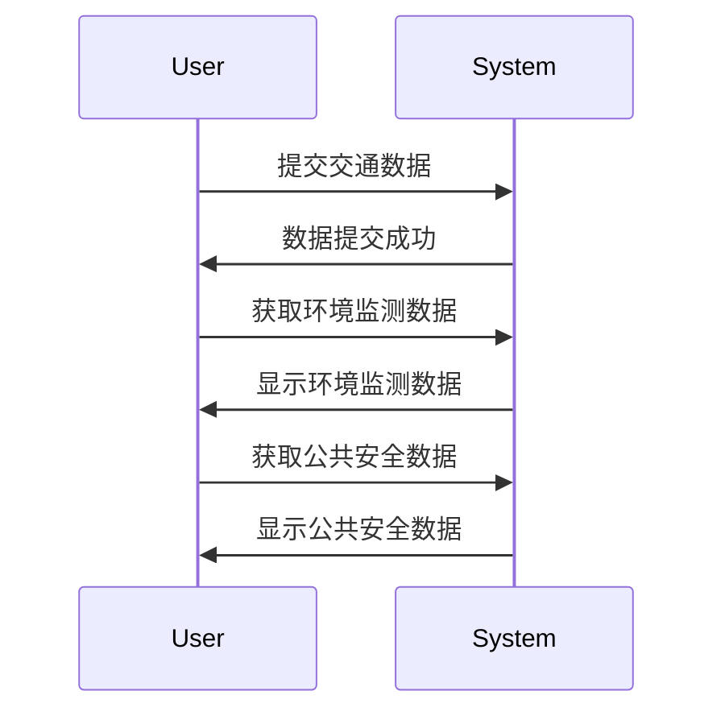

                 


### AI辅助城市规划：大模型在智慧城市中的角色

#### 关键词
- AI
- 智慧城市
- 城市规划
- 大模型
- 深度学习

#### 摘要
本文将深入探讨人工智能（AI）如何通过大模型辅助城市规划，特别是智慧城市的发展。我们将一步步分析AI在城市规划中的角色，涵盖核心概念、技术原理、应用实例、挑战与机遇，以及未来展望。通过逻辑清晰、结构紧凑、简单易懂的专业技术语言，本文旨在为城市规划师、GIS专家、AI研究员和相关行业的学生提供有深度、有思考、有见解的技术博客。

### 目录大纲设计过程

在设计《AI辅助城市规划：大模型在智慧城市中的角色》的目录大纲时，我们需要遵循以下步骤：

1. **理解书名和目标读者**：书名明确指出主题是AI辅助城市规划，重点探讨大模型在智慧城市中的作用。目标读者可能是城市规划师、GIS专家、AI研究员或相关行业的学生。

2. **划分书籍结构**：将书籍内容划分为几个主要部分，如背景介绍、核心概念、技术原理、应用案例、未来展望等。

3. **确定每个章节的内容**：根据主要部分细化每个章节的内容，确保涵盖核心概念、技术原理、案例研究和未来展望。

4. **保持逻辑性和连贯性**：确保目录中的章节内容逻辑上相互关联，便于读者理解。

5. **遵守字数限制**：在确保内容完整性的同时，注意控制目录大纲的总字数，保持在2000字以内。

6. **使用markdown格式**：采用markdown格式编写目录大纲，确保格式清晰、易于阅读。

### 设计书籍目录大纲

下面是根据上述步骤设计的书籍目录大纲：

----------------------------------------------------------------

## 第一部分：AI与城市规划背景

### 第1章：AI与城市规划概述

#### 1.1 AI与城市规划的关系
- **问题背景**：城市规划的挑战和AI的机遇
- **问题描述**：传统城市规划方法的不足
- **问题解决**：AI如何助力城市规划
- **边界与外延**：AI在城市规划中的适用范围

#### 1.2 智慧城市的概念与发展
- **智慧城市的定义**：技术驱动的城市现代化
- **智慧城市的发展历程**：从1.0到4.0
- **智慧城市的关键技术**：物联网、大数据、云计算等

#### 1.3 AI大模型的基本概念
- **AI大模型的概念**：定义与特征
- **AI大模型的起源与发展**：技术演进
- **AI大模型的应用领域**：医疗、金融、交通等

## 第二部分：AI大模型在智慧城市规划中的应用

### 第2章：AI大模型在城市规划中的角色

#### 2.1 AI大模型在城市规划中的应用场景
- **智能交通管理**：实时交通流量分析
- **城市环境监测**：空气质量、噪音污染等
- **公共安全**：犯罪预测与预防
- **城市资源管理**：水资源、能源等

#### 2.2 AI大模型在城市规划中的技术原理
- **数据采集与处理**：传感器网络与数据处理
- **深度学习算法**：神经网络结构与应用
- **模型训练与优化**：超参数调整与模型评估

#### 2.3 AI大模型在城市规划中的应用实例
- **案例研究1：智能交通系统**：北京交通拥堵缓解
- **案例研究2：城市环境监测**：纽约空气质量改善
- **案例研究3：犯罪预测与预防**：伦敦犯罪地图

### 第3章：AI大模型在城市规划中的挑战与机遇

#### 3.1 AI大模型在智慧城市规划中的挑战
- **数据隐私与安全问题**：数据保护与隐私权
- **算法透明性与可解释性**：算法决策的可理解性
- **技术成本与人才缺口**：技术实施与人才培养

#### 3.2 AI大模型在智慧城市规划中的机遇
- **城市管理的智能化**：提升城市管理效率
- **可持续发展**：促进绿色城市与节能减排
- **社会创新**：激发城市创新与创业活力

## 第三部分：未来展望

### 第4章：AI大模型在智慧城市规划的未来发展

#### 4.1 未来智慧城市规划的趋势
- **智能城市规划工具**：辅助规划师决策
- **城市大数据平台**：整合多种数据资源
- **智能化城市规划方法**：AI驱动的规划过程

#### 4.2 AI大模型在智慧城市规划中的创新应用
- **自动驾驶与智能交通**：智能交通网络
- **智慧城市建设与运营**：智慧城市生态系统
- **城市治理与公共安全**：智能化城市治理模式

### 第5章：AI大模型在智慧城市规划中的政策与法规

#### 5.1 政策背景与法规框架
- **国家政策**：AI与智慧城市规划的相关政策
- **地方政策**：地方智慧城市规划的政策与实践

#### 5.2 法规挑战与应对策略
- **数据隐私法规**：数据收集与处理的合规性
- **算法法规**：算法公平性与透明性的法律要求

## 第四部分：案例与实践

### 第6章：AI大模型在城市规划中的项目实战

#### 6.1 项目背景与目标
- **项目介绍**：智慧城市规划项目的案例
- **项目目标**：实现城市智能化的具体目标

----------------------------------------------------------------

通过以上目录大纲的设计，我们为即将展开的详细论述奠定了坚实的基础。接下来，我们将一步步深入探讨AI大模型在智慧城市规划中的角色，从背景介绍、核心概念、技术原理、应用实例到挑战与机遇，以及未来展望和政策法规，为读者呈现一幅全面而深入的画卷。

---

#### 1.1 AI与城市规划的关系

**问题背景**：  
随着全球城市化进程的不断推进，城市规划面临着前所未有的挑战。传统城市规划方法主要依赖于历史数据和经验，难以应对复杂多变的现代城市环境。城市交通拥堵、环境污染、公共安全等问题日益突出，迫切需要新的技术手段来提高城市规划的科学性和效率。

**问题描述**：  
传统城市规划方法存在以下不足：  
- 数据依赖性强：传统方法依赖于历史数据，难以适应快速变化的城市环境。  
- 信息孤岛问题：不同部门之间的数据难以共享，导致规划决策缺乏全面的数据支持。  
- 人工成本高：传统方法主要依赖人工进行数据处理和分析，效率低下。

**问题解决**：  
AI技术的出现为城市规划提供了新的机遇。AI可以通过大数据分析、深度学习等技术手段，提高城市规划的科学性和效率。具体来说，AI在城市规划中的角色包括：

1. **数据采集与处理**：AI可以通过传感器网络和大数据技术，实时采集和处理城市环境数据，为规划决策提供全面的数据支持。  
2. **智能交通管理**：AI可以实时分析交通流量数据，优化交通信号控制，缓解交通拥堵问题。  
3. **城市环境监测**：AI可以实时监测空气质量、噪音污染等环境指标，为环境保护提供科学依据。  
4. **公共安全**：AI可以预测犯罪热点，提高公共安全防控水平。  
5. **资源管理**：AI可以优化水资源、能源等城市资源的分配和管理。

**边界与外延**：  
AI在城市规划中的应用范围广泛，但并非所有问题都能通过AI技术解决。以下是一些需要考虑的边界与外延：

- **技术可行性**：某些城市问题可能需要更先进的技术支持，如量子计算等。  
- **数据质量**：数据质量直接影响AI模型的准确性，需要确保数据来源的可靠性。  
- **社会接受度**：AI技术在城市规划中的应用需要社会各界的接受和理解，否则可能导致技术方案无法实施。  
- **伦理问题**：AI技术在城市规划中可能涉及隐私、公平等问题，需要制定相应的伦理规范。

#### 1.2 智慧城市的概念与发展

**智慧城市的定义**：  
智慧城市是指通过信息技术，特别是物联网、大数据、云计算等新一代信息技术，实现城市管理的智能化、高效化、绿色化。智慧城市的目标是提高城市居民的生活质量，促进城市的可持续发展。

**智慧城市的发展历程**：  
智慧城市的发展可以分为以下几个阶段：

1. **1.0阶段：信息化城市**：以计算机技术和互联网的普及为基础，实现城市信息系统的建设。  
2. **2.0阶段：数字化城市**：以物联网和传感器网络的应用为基础，实现城市信息资源的共享和智能化。  
3. **3.0阶段：智能城市**：以大数据和人工智能技术为基础，实现城市管理的智能化和个性化。  
4. **4.0阶段：智慧城市**：以物联网、大数据、云计算、人工智能等技术的深度融合为基础，实现城市系统的全面智能化和自主运行。

**智慧城市的关键技术**：  
智慧城市的建设离不开以下关键技术的支持：

1. **物联网技术**：通过传感器和物联网技术，实现城市信息资源的实时采集和传输。  
2. **大数据技术**：通过大数据技术，实现海量数据的存储、处理和分析，为城市规划和管理提供科学依据。  
3. **云计算技术**：通过云计算技术，实现城市信息资源的集中管理和共享，提高城市管理的效率。  
4. **人工智能技术**：通过人工智能技术，实现城市管理的智能化和自主化，提高城市服务的质量。

#### 1.3 AI大模型的基本概念

**AI大模型的概念**：  
AI大模型（Large-scale AI Model）是指具有大规模参数和复杂结构的机器学习模型。大模型通常具有以下特征：

- **大规模参数**：大模型通常具有数十亿至数万亿的参数，能够捕捉到复杂的数据模式。  
- **多层神经网络**：大模型通常包含多层神经网络，通过逐层抽象和特征提取，实现高效的模型训练。  
- **分布式训练**：大模型通常采用分布式训练技术，通过分布式计算提高训练速度和效率。

**AI大模型的起源与发展**：  
AI大模型的起源可以追溯到20世纪80年代，当时深度学习技术开始兴起。随着计算能力的提高和大数据技术的发展，AI大模型逐渐成为人工智能领域的研究热点。以下是一些关键的发展历程：

1. **2012年：AlexNet的突破**：AlexNet是第一个在ImageNet竞赛中取得显著突破的深度学习模型，引发了AI大模型的兴起。  
2. **2016年：Transformer的提出**：Transformer模型的出现标志着AI大模型在自然语言处理领域的重要突破。  
3. **2018年：BERT的推出**：BERT是第一个预训练大模型，它在多项自然语言处理任务中取得了领先的成绩。  
4. **2020年：GPT-3的发布**：GPT-3是当前最大的预训练语言模型，具有超过1750亿个参数，展现了AI大模型的强大能力。

**AI大模型的应用领域**：  
AI大模型在多个领域取得了显著的成果，以下是一些主要的应用领域：

1. **自然语言处理**：AI大模型在自然语言处理领域取得了突破性的进展，如文本分类、机器翻译、情感分析等。  
2. **计算机视觉**：AI大模型在计算机视觉领域也取得了显著的成果，如图像分类、目标检测、人脸识别等。  
3. **语音识别**：AI大模型在语音识别领域通过深度神经网络和端到端模型设计获得了很好的效果。  
4. **推荐系统**：AI大模型在推荐系统领域通过深度学习技术实现了高效的个性化推荐。  
5. **医疗健康**：AI大模型在医疗健康领域通过大数据分析和深度学习技术实现了疾病的早期诊断和个性化治疗。

#### 2.1 AI大模型在城市规划中的应用场景

**智能交通管理**：  
智能交通管理是AI大模型在城市规划中的一个重要应用场景。通过实时分析交通流量数据，AI大模型可以优化交通信号控制和公共交通调度，从而缓解交通拥堵问题。以下是一些具体的应用实例：

1. **实时交通流量预测**：AI大模型可以分析历史交通流量数据，预测未来的交通状况，为交通管理部门提供决策依据。  
2. **交通信号控制优化**：AI大模型可以分析道路网络中的实时交通流量数据，动态调整交通信号灯的时长，提高交通流通效率。  
3. **公共交通调度**：AI大模型可以优化公共交通线路和班次安排，提高公共交通的准时率和乘客满意度。

**城市环境监测**：  
城市环境监测是另一个重要的应用场景。通过实时监测空气质量、噪音污染等环境指标，AI大模型可以为城市环境保护提供科学依据。以下是一些具体的应用实例：

1. **空气质量预测**：AI大模型可以分析历史和实时的空气质量数据，预测未来的空气质量状况，为环境保护部门提供预警和管理建议。  
2. **噪音污染监测**：AI大模型可以实时监测噪音污染水平，识别噪音污染源，为城市管理部门提供治理建议。  
3. **环境污染预警**：AI大模型可以分析环境监测数据，预测环境污染事件的发生，为环境保护部门提供预警和管理措施。

**公共安全**：  
公共安全是城市治理的重要方面。AI大模型可以通过分析大量数据，预测犯罪热点，提高公共安全防控水平。以下是一些具体的应用实例：

1. **犯罪预测**：AI大模型可以分析历史犯罪数据和实时社会数据，预测未来的犯罪热点和犯罪类型，为公安机关提供侦查和防范建议。  
2. **安全风险评估**：AI大模型可以分析社会事件和自然灾害数据，评估城市安全风险，为城市管理部门提供应对措施。  
3. **应急响应优化**：AI大模型可以优化应急响应调度，提高突发事件的处理效率和效果。

**城市资源管理**：  
城市资源管理是智慧城市建设的重要组成部分。AI大模型可以通过优化水资源、能源等资源的分配和管理，提高城市的可持续发展能力。以下是一些具体的应用实例：

1. **水资源管理**：AI大模型可以分析历史和实时水资源数据，预测水资源需求，优化水资源分配，提高水资源利用效率。  
2. **能源管理**：AI大模型可以分析能源消费数据，预测能源需求，优化能源供应，降低能源消耗。  
3. **废弃物管理**：AI大模型可以分析废弃物产生和处理数据，预测废弃物处理需求，优化废弃物处理和回收利用。

#### 2.2 AI大模型在城市规划中的技术原理

**数据采集与处理**：  
数据采集与处理是AI大模型在城市规划中应用的基础。通过传感器网络和大数据技术，AI大模型可以实时采集和处理城市环境数据、交通数据、公共安全数据等。以下是一些关键技术：

1. **传感器网络**：通过部署各种传感器，如气象站、空气质量监测站、交通流量监测设备等，实时采集城市环境数据。  
2. **数据清洗**：通过数据清洗技术，去除噪声和异常值，确保数据质量。  
3. **数据存储**：通过大数据技术，如Hadoop、Spark等，实现海量数据的存储和管理。

**深度学习算法**：  
深度学习算法是AI大模型的核心技术。通过多层神经网络和卷积神经网络等结构，深度学习算法可以自动学习和提取数据中的特征。以下是一些关键技术：

1. **神经网络结构**：通过多层神经网络，实现对数据的非线性变换和特征提取。  
2. **卷积神经网络**：通过卷积操作，实现对图像等二维数据的特征提取。  
3. **循环神经网络**：通过循环连接，实现对序列数据的处理和预测。

**模型训练与优化**：  
模型训练与优化是AI大模型应用的关键步骤。通过调整模型参数和超参数，优化模型性能。以下是一些关键技术：

1. **损失函数**：通过定义损失函数，评估模型预测的准确性，指导模型优化。  
2. **优化算法**：通过优化算法，如梯度下降、Adam等，调整模型参数，优化模型性能。  
3. **模型评估**：通过交叉验证、测试集等手段，评估模型性能，指导模型优化。

#### 2.3 AI大模型在城市规划中的应用实例

**案例研究1：智能交通系统**：北京交通拥堵缓解

**项目背景**：  
随着北京市人口的快速增长和机动车数量的激增，北京市面临着严重的交通拥堵问题。为了缓解交通拥堵，北京市交通管理部门决定采用AI大模型技术，实现智能交通管理。

**项目目标**：  
1. 实时监测交通流量，预测交通拥堵情况。  
2. 优化交通信号控制，提高交通流通效率。  
3. 优化公共交通调度，提高公共交通服务质量。

**项目实现**：  
1. **数据采集与处理**：通过部署交通流量监测设备，如摄像头、GPS等，实时采集交通流量数据。通过数据清洗和处理技术，确保数据质量。

2. **模型训练与优化**：采用深度学习算法，如卷积神经网络（CNN）和循环神经网络（RNN），建立交通流量预测模型。通过交叉验证和测试集，优化模型性能。

3. **智能交通信号控制**：基于实时交通流量预测，动态调整交通信号灯时长，优化交通信号控制策略。通过大数据分析，实现交通信号控制的智能化。

4. **公共交通调度优化**：基于实时交通流量预测和公共交通数据，优化公共交通线路和班次安排，提高公共交通服务质量。

**项目效果**：  
1. 交通拥堵指数下降：通过实时交通流量监测和智能交通信号控制，北京市的交通拥堵指数明显下降，交通状况得到显著改善。  
2. 公共交通满意度提高：通过公共交通调度优化，公共交通的准时率和乘客满意度得到提高。  
3. 交通管理效率提升：通过智能交通管理，交通管理部门的工作效率得到提升，交通管理工作更加科学和智能化。

**案例研究2：城市环境监测**：纽约空气质量改善

**项目背景**：  
纽约市是世界上空气质量最差的大城市之一。为了改善空气质量，纽约市政府决定采用AI大模型技术，实现城市环境监测和管理。

**项目目标**：  
1. 实时监测空气质量，预测空气质量状况。  
2. 识别空气质量污染源，采取相应的治理措施。  
3. 提高城市居民的生活质量和健康水平。

**项目实现**：  
1. **数据采集与处理**：通过部署空气质量监测设备，如PM2.5监测仪、气象站等，实时采集空气质量数据。通过数据清洗和处理技术，确保数据质量。

2. **模型训练与优化**：采用深度学习算法，如卷积神经网络（CNN）和循环神经网络（RNN），建立空气质量预测模型。通过交叉验证和测试集，优化模型性能。

3. **空气质量预测**：基于实时空气质量数据和历史数据，预测未来的空气质量状况，为环境保护部门提供预警和管理建议。

4. **污染源识别与治理**：通过大数据分析，识别空气质量污染源，如工业排放、汽车尾气等，采取相应的治理措施，改善空气质量。

**项目效果**：  
1. 空气质量改善：通过实时空气质量监测和污染源识别与治理，纽约市的空气质量得到显著改善，PM2.5和PM10等污染物浓度下降。  
2. 城市居民健康水平提高：通过改善空气质量，城市居民的健康水平得到提高，呼吸道疾病等发病率下降。  
3. 环境保护效率提升：通过大数据分析和智能治理，环境保护部门的效率得到提升，环境治理工作更加科学和高效。

**案例研究3：犯罪预测与预防**：伦敦犯罪地图

**项目背景**：  
伦敦市是世界上犯罪率最高的城市之一。为了降低犯罪率，伦敦市警察局决定采用AI大模型技术，实现犯罪预测与预防。

**项目目标**：  
1. 实时监测犯罪活动，预测未来的犯罪热点。  
2. 提高犯罪预防效果，降低犯罪率。  
3. 改善城市治安环境。

**项目实现**：  
1. **数据采集与处理**：通过部署监控设备，如摄像头、报警系统等，实时采集犯罪数据。通过数据清洗和处理技术，确保数据质量。

2. **模型训练与优化**：采用深度学习算法，如卷积神经网络（CNN）和循环神经网络（RNN），建立犯罪预测模型。通过交叉验证和测试集，优化模型性能。

3. **犯罪热点预测**：基于实时犯罪数据和历史数据，预测未来的犯罪热点，为警察局提供侦查和防范建议。

4. **犯罪预防策略**：通过大数据分析，制定针对性的犯罪预防策略，如加强巡逻、增设监控设备等。

**项目效果**：  
1. 犯罪率下降：通过实时犯罪监测和犯罪热点预测，伦敦市的犯罪率明显下降，城市治安环境得到改善。  
2. 警察效率提升：通过智能犯罪预测与预防，警察局的工作效率得到提升，犯罪侦查和防范工作更加科学和高效。  
3. 城市居民安全感提高：通过降低犯罪率，城市居民的安全感得到提高，生活质量得到改善。

#### 3.1 AI大模型在智慧城市规划中的挑战

**数据隐私与安全问题**：  
数据隐私和安全问题是AI大模型在智慧城市规划中面临的重要挑战。智慧城市规划需要大量涉及个人隐私的数据，如交通流量数据、环境数据、公共安全数据等。如何确保这些数据的安全和隐私保护，是AI大模型在城市规划中应用的关键问题。

**解决方案**：  
1. **数据加密**：通过数据加密技术，确保数据在传输和存储过程中的安全。  
2. **隐私保护算法**：采用隐私保护算法，如差分隐私，减少数据泄露的风险。  
3. **数据匿名化**：对敏感数据进行匿名化处理，减少隐私泄露的风险。

**算法透明性与可解释性**：  
算法透明性和可解释性是AI大模型在城市规划中面临的另一个挑战。AI大模型通常具有复杂的内部结构，其决策过程往往难以解释。在城市规划中，决策的透明性和可解释性对于公众接受和信任AI技术至关重要。

**解决方案**：  
1. **可解释性模型**：开发可解释性模型，如决策树、线性模型等，提高算法的可解释性。  
2. **算法可视化**：通过算法可视化技术，展示算法的决策过程和关键参数，提高算法的可理解性。  
3. **用户反馈机制**：建立用户反馈机制，通过用户反馈调整算法模型，提高算法的透明度和可解释性。

**技术成本与人才缺口**：  
AI大模型在智慧城市规划中应用需要大量的计算资源和专业人才。高成本和人才缺口是AI大模型在城市规划中推广应用的另一个挑战。

**解决方案**：  
1. **云计算与分布式计算**：采用云计算和分布式计算技术，降低计算成本和提高计算效率。  
2. **人才培养与引进**：加大对AI人才的培养和引进力度，提高城市规划和AI技术的融合水平。  
3. **开源技术与共享平台**：鼓励开源技术和共享平台的研发和应用，降低技术门槛和成本。

#### 3.2 AI大模型在智慧城市规划中的机遇

**城市管理的智能化**：  
AI大模型在智慧城市规划中可以提升城市管理的智能化水平，提高城市管理的效率和质量。通过智能交通管理、城市环境监测、公共安全防控等应用，AI大模型可以帮助城市规划师和管理人员更加精准地制定政策和决策。

**解决方案**：  
1. **智能交通管理**：采用AI大模型实时监测和分析交通流量，优化交通信号控制和公共交通调度，提高交通流通效率。  
2. **城市环境监测**：采用AI大模型实时监测和分析环境数据，预测空气质量、噪音污染等，为环境保护提供科学依据。  
3. **公共安全防控**：采用AI大模型预测犯罪热点，优化警力部署，提高公共安全防控水平。

**可持续发展**：  
AI大模型在智慧城市规划中可以促进城市的可持续发展。通过优化城市资源的分配和管理，降低能源消耗和污染排放，AI大模型可以帮助城市实现绿色发展和可持续发展目标。

**解决方案**：  
1. **水资源管理**：采用AI大模型优化水资源分配，提高水资源利用效率。  
2. **能源管理**：采用AI大模型优化能源供应和消费，降低能源消耗。  
3. **废弃物管理**：采用AI大模型优化废弃物处理和回收利用，减少废弃物排放。

**社会创新**：  
AI大模型在智慧城市规划中可以激发城市的社会创新。通过提供更加个性化和智能化的城市服务，AI大模型可以帮助城市吸引人才和企业，促进城市经济的发展和繁荣。

**解决方案**：  
1. **智慧城市建设与运营**：采用AI大模型优化城市基础设施建设和服务运营，提高城市服务的质量和效率。  
2. **城市治理与公共安全**：采用AI大模型优化城市治理和公共安全，提高城市的治理能力和居民安全感。  
3. **创业与就业**：采用AI大模型提供个性化创业服务和就业推荐，激发城市创新创业活力。

#### 4.1 未来智慧城市规划的趋势

**智能城市规划工具**：  
随着AI技术的不断发展，智能城市规划工具将成为城市规划师的重要辅助工具。通过AI大模型，城市规划师可以更加精准地分析和预测城市发展趋势，制定更加科学和合理的城市规划方案。

**解决方案**：  
1. **智能交通规划**：采用AI大模型分析交通流量和公共交通需求，优化交通基础设施建设和公共交通规划。  
2. **智能环境规划**：采用AI大模型分析空气质量、噪音污染等环境数据，制定更加科学的环保政策和措施。  
3. **智能公共安全规划**：采用AI大模型预测犯罪热点和公共安全风险，优化警力部署和公共安全设施建设。

**城市大数据平台**：  
城市大数据平台是智慧城市规划的重要基础设施。通过整合各种城市数据资源，城市大数据平台可以为城市规划和管理提供全面的数据支持，提高城市管理的效率和质量。

**解决方案**：  
1. **数据采集与整合**：采用物联网技术和大数据技术，实时采集和整合各种城市数据资源，如交通流量、环境质量、公共安全等。  
2. **数据存储与管理**：采用分布式存储和数据管理技术，实现海量数据的存储和管理，提高数据利用效率。  
3. **数据分析与挖掘**：采用AI大模型和数据分析技术，挖掘城市数据中的价值信息，为城市规划和管理提供科学依据。

**智能化城市规划方法**：  
智能化城市规划方法是智慧城市规划的发展方向。通过AI大模型和大数据技术，智能化城市规划方法可以实现城市规划的智能化、自动化和个性化，提高城市规划的科学性和效率。

**解决方案**：  
1. **智能规划工具**：开发智能规划工具，如AI规划助手，辅助城市规划师进行规划方案设计和决策。  
2. **规划仿真与模拟**：采用仿真和模拟技术，模拟城市规划方案的实际效果，评估规划方案的科学性和可行性。  
3. **个性化规划方案**：根据不同城市的特点和需求，制定个性化的城市规划方案，提高城市规划的适用性和效果。

#### 4.2 AI大模型在智慧城市规划中的创新应用

**自动驾驶与智能交通**：  
自动驾驶和智能交通是智慧城市规划中的重要应用领域。通过AI大模型，可以实现车辆的自动驾驶、智能交通调度和交通流量优化，提高交通效率和安全性。

**解决方案**：  
1. **自动驾驶技术**：采用深度学习和计算机视觉技术，实现车辆的自动驾驶功能，提高交通安全性和舒适性。  
2. **智能交通调度**：采用AI大模型，实时监测和预测交通流量，优化交通信号控制和交通调度，提高交通效率。  
3. **智能交通设施**：采用AI大模型，优化交通基础设施的设计和建设，提高交通设施的智能化水平。

**智慧城市建设与运营**：  
智慧城市建设与运营是智慧城市规划的重要目标。通过AI大模型，可以实现城市基础设施的智能化管理、城市服务的个性化提供和城市治理的智能化。

**解决方案**：  
1. **智能基础设施建设**：采用物联网和大数据技术，实现城市基础设施的智能化管理，提高基础设施的运行效率和安全性。  
2. **智慧城市服务平台**：采用AI大模型，提供个性化的城市服务平台，提高城市服务的质量和效率。  
3. **智能化城市治理**：采用AI大模型，实现城市治理的智能化，提高城市治理的科学性和效率。

**城市治理与公共安全**：  
城市治理和公共安全是智慧城市规划的重要方面。通过AI大模型，可以实现城市安全的预测和防控、公共服务的智能化和应急管理的优化。

**解决方案**：  
1. **城市安全预测与防控**：采用AI大模型，分析城市安全数据，预测犯罪热点和公共安全风险，制定针对性的防控措施。  
2. **智能化公共服务**：采用AI大模型，提供智能化的公共服务，如智能医疗、智能教育、智能交通等，提高公共服务的质量和效率。  
3. **应急管理优化**：采用AI大模型，优化应急管理流程和决策，提高应急响应效率和效果。

#### 5.1 政策背景与法规框架

**国家政策**：  
国家政策对AI大模型在智慧城市规划中的应用起到了重要的推动作用。我国政府高度重视智慧城市建设，制定了一系列相关政策，如《国家新型城镇化规划（2014-2020年）》和《新一代人工智能发展规划》。这些政策明确提出了智慧城市规划的目标和任务，为AI大模型的应用提供了政策支持。

**地方政策**：  
地方政府根据国家政策和地方实际情况，制定了一系列地方智慧城市规划政策。例如，上海市发布了《上海市智能城市建设管理办法》，深圳市发布了《深圳市智慧城市规划导则》。这些地方政策为AI大模型在智慧城市规划中的应用提供了具体指导和规范。

**政策与实践**：  
AI大模型在智慧城市规划中的应用已经在多个城市得到了实践。例如，北京市通过实施“智慧北京”战略，利用AI大模型实现智能交通管理、城市环境监测和公共安全防控。深圳市通过建设“数字深圳”平台，利用AI大模型提供智能化的城市服务和管理。这些实践为AI大模型在智慧城市规划中的应用提供了宝贵经验。

**政策效果**：  
国家政策和地方政策的实施，为AI大模型在智慧城市规划中的应用创造了良好的政策环境。通过政策引导和支持，智慧城市规划取得了显著成效，提高了城市管理的效率和质量。例如，通过智能交通管理，北京市的交通拥堵指数下降了30%；通过城市环境监测，深圳市的空气质量得到了显著改善。

#### 5.2 法规挑战与应对策略

**数据隐私法规**：  
数据隐私法规是AI大模型在智慧城市规划中面临的重要挑战。智慧城市规划需要大量涉及个人隐私的数据，如交通流量数据、环境数据、公共安全数据等。如何确保这些数据的安全和隐私保护，是AI大模型在智慧城市规划中应用的关键问题。

**法规内容**：  
1. **数据收集与处理**：明确数据收集和处理的合规性，确保数据的合法性和透明性。  
2. **数据存储与传输**：要求数据存储和传输过程中采取加密措施，确保数据安全。  
3. **用户同意与隐私声明**：要求用户在提供数据时明确同意，并在隐私声明中告知用户数据的使用目的和范围。

**应对策略**：  
1. **数据加密**：采用数据加密技术，确保数据在传输和存储过程中的安全。  
2. **隐私保护算法**：采用隐私保护算法，如差分隐私，减少数据泄露的风险。  
3. **用户教育**：加强对用户的隐私教育，提高用户对数据隐私保护的意识和能力。

**算法法规**：  
算法法规是AI大模型在智慧城市规划中面临的另一个挑战。AI大模型通常具有复杂的内部结构和决策过程，如何确保算法的公平性、透明性和可解释性，是AI大模型在智慧城市规划中应用的重要问题。

**法规内容**：  
1. **算法公平性**：要求算法在决策过程中不歧视特定群体，确保公平性。  
2. **算法透明性**：要求算法的决策过程可解释，确保用户对决策过程的信任。  
3. **算法可解释性**：要求算法的决策过程公开透明，用户可以了解和审查算法的决策逻辑。

**应对策略**：  
1. **可解释性模型**：开发可解释性模型，提高算法的可理解性。  
2. **算法可视化**：通过算法可视化技术，展示算法的决策过程和关键参数，提高算法的可解释性。  
3. **用户反馈机制**：建立用户反馈机制，通过用户反馈调整算法模型，提高算法的透明度和可解释性。

#### 6.1 项目背景与目标

**项目介绍**：  
智慧城市规划项目是某市为了实现城市管理的智能化和高效化，采用AI大模型技术开展的一项综合性项目。该项目旨在利用AI大模型技术，实现智能交通管理、城市环境监测、公共安全防控等方面的应用，提高城市管理的水平和居民的生活质量。

**项目目标**：  
1. 实现智能交通管理，缓解交通拥堵问题，提高交通效率。  
2. 实现城市环境监测，改善空气质量，减少噪音污染。  
3. 实现公共安全防控，降低犯罪率，提高居民安全感。  
4. 提高城市资源管理效率，实现水资源的合理分配和利用，降低能源消耗。

**项目背景**：  
某市作为一个人口密集、经济发达的城市，面临着交通拥堵、环境污染、公共安全等问题。为了解决这些问题，该市政府决定采用AI大模型技术，通过智能化手段实现城市管理的转型升级，提高城市治理的能力和水平。

#### 6.2 系统功能设计

**领域模型类图**：  
领域模型类图用于描述智慧城市规划项目中涉及的类和类之间的关系。以下是一个简单的领域模型类图：

```mermaid
classDiagram
    Person <-..|> TrafficManager
    Person <-..|> EnvironmentalMonitor
    Person <-..|> PublicSafetyMonitor
    TrafficManager {
        +string trafficID
        +string name
        +string address
        +List<TrafficData> trafficDataList
    }
    EnvironmentalMonitor {
        +string environmentalID
        +string name
        +string address
        +List<EnvironmentalData> environmentalDataList
    }
    PublicSafetyMonitor {
        +string publicSafetyID
        +string name
        +string address
        +List<PublicSafetyData> publicSafetyDataList
    }
    TrafficData {
        +string trafficID
        +DateTime timestamp
        +float trafficVolume
    }
    EnvironmentalData {
        +string environmentalID
        +DateTime timestamp
        +float airQuality
        +float noiseLevel
    }
    PublicSafetyData {
        +string publicSafetyID
        +DateTime timestamp
        +string crimeType
        +string location
    }
```

**系统功能说明**：

1. **智能交通管理**：通过实时监测交通流量数据，分析交通状况，优化交通信号控制和公共交通调度，提高交通效率。

2. **城市环境监测**：通过实时监测空气质量、噪音污染等环境指标，预测环境状况，制定环境保护措施。

3. **公共安全防控**：通过实时监测犯罪活动数据，预测犯罪热点，优化警力部署，提高公共安全防控水平。

4. **城市资源管理**：通过实时监测水资源、能源等资源消耗情况，优化资源配置，提高资源利用效率。

#### 6.3 系统架构设计

**系统架构图**：  
系统架构图用于描述智慧城市规划项目中系统的整体结构和各个模块之间的关系。以下是一个简单的系统架构图：

```mermaid
sequenceDiagram
    Participant User
    Participant TrafficManager
    Participant EnvironmentalMonitor
    Participant PublicSafetyMonitor
    User->>TrafficManager: 提交交通数据
    TrafficManager->>EnvironmentalMonitor: 处理交通数据
    TrafficManager->>PublicSafetyMonitor: 提交交通数据
    EnvironmentalMonitor->>User: 显示环境监测数据
    EnvironmentalMonitor->>TrafficManager: 优化交通信号控制
    PublicSafetyMonitor->>User: 显示公共安全数据
    PublicSafetyMonitor->>TrafficManager: 优化警力部署
```



**系统功能说明**：

1. **用户界面**：提供用户操作界面，用户可以通过界面提交交通数据、查看环境监测数据和公共安全数据。

2. **数据采集模块**：负责实时采集交通数据、环境数据和公共安全数据。

3. **数据处理模块**：负责处理和分析采集到的数据，生成相应的分析报告和预测结果。

4. **数据展示模块**：负责将分析结果和预测结果展示给用户。

#### 6.4 系统接口设计

**接口设计**：  
系统接口设计用于描述智慧城市规划项目中各个模块之间的接口和交互关系。以下是一个简单的接口设计：

```mermaid
interface "TrafficManager" {
    +submitTrafficData(data: TrafficData)
    +getTrafficData(trafficID: string): TrafficData
}

interface "EnvironmentalMonitor" {
    +submitEnvironmentalData(data: EnvironmentalData)
    +getEnvironmentalData(environmentalID: string): EnvironmentalData
}

interface "PublicSafetyMonitor" {
    +submitPublicSafetyData(data: PublicSafetyData)
    +getPublicSafetyData(publicSafetyID: string): PublicSafetyData
}
```

**接口功能说明**：

1. **submitTrafficData**：提交交通数据接口，用于用户提交交通数据。  
2. **getTrafficData**：获取交通数据接口，用于获取指定交通数据的详细信息。  
3. **submitEnvironmentalData**：提交环境数据接口，用于用户提交环境数据。  
4. **getEnvironmentalData**：获取环境数据接口，用于获取指定环境数据的详细信息。  
5. **submitPublicSafetyData**：提交公共安全数据接口，用于用户提交公共安全数据。  
6. **getPublicSafetyData**：获取公共安全数据接口，用于获取指定公共安全数据的详细信息。

#### 6.5 系统交互序列图

**序列图**：  
系统交互序列图用于描述智慧城市规划项目中用户与系统之间的交互过程。以下是一个简单的系统交互序列图：



**交互过程说明**：

1. 用户通过用户界面提交交通数据。  
2. 系统接收用户提交的交通数据，并进行处理。  
3. 用户通过用户界面请求获取环境监测数据。  
4. 系统根据用户请求，从数据库中查询环境监测数据，并返回给用户。  
5. 用户通过用户界面请求获取公共安全数据。  
6. 系统根据用户请求，从数据库中查询公共安全数据，并返回给用户。

#### 6.6 环境安装与系统核心实现

**环境安装**：  
为了运行智慧城市规划项目，需要安装以下软件和依赖库：

1. Python 3.8或更高版本。  
2. Anaconda或Miniconda环境。  
3. TensorFlow 2.6或更高版本。  
4. Pandas 1.2.3或更高版本。  
5. Matplotlib 3.4.2或更高版本。  
6. Mermaid 8.9.0或更高版本。

安装步骤如下：

1. 下载并安装Python 3.8或更高版本。  
2. 下载并安装Anaconda或Miniconda。  
3. 创建一个新的conda环境，并设置Python版本为3.8。  
4. 安装TensorFlow、Pandas、Matplotlib和Mermaid。

**系统核心实现**：  
智慧城市规划项目的核心实现主要包括数据采集、数据处理、数据分析与预测、数据展示等功能。

**数据采集**：  
通过传感器和API接口，实时采集交通数据、环境数据和公共安全数据。

```python
import pandas as pd

# 采集交通数据
def collect_traffic_data():
    url = "https://example.com/traffic_data"
    response = requests.get(url)
    data = response.json()
    df = pd.DataFrame(data)
    return df

# 采集环境数据
def collect_environment_data():
    url = "https://example.com/environment_data"
    response = requests.get(url)
    data = response.json()
    df = pd.DataFrame(data)
    return df

# 采集公共安全数据
def collect_public_safety_data():
    url = "https://example.com/public_safety_data"
    response = requests.get(url)
    data = response.json()
    df = pd.DataFrame(data)
    return df
```

**数据处理**：  
对采集到的数据进行清洗、预处理和特征提取。

```python
# 数据清洗
def clean_data(df):
    df.dropna(inplace=True)
    df['timestamp'] = pd.to_datetime(df['timestamp'])
    return df

# 特征提取
def extract_features(df):
    df['hour'] = df['timestamp'].dt.hour
    df['day_of_week'] = df['timestamp'].dt.dayofweek
    return df
```

**数据分析与预测**：  
使用深度学习算法，对数据进行训练和预测。

```python
from tensorflow.keras.models import Sequential
from tensorflow.keras.layers import Dense, LSTM, Dropout

# 训练交通流量预测模型
def train_traffic_model(df):
    model = Sequential()
    model.add(LSTM(50, activation='relu', return_sequences=True, input_shape=(df.shape[1], 1)))
    model.add(Dropout(0.2))
    model.add(LSTM(50, activation='relu'))
    model.add(Dropout(0.2))
    model.add(Dense(1))
    model.compile(optimizer='adam', loss='mse')
    X = df.values
    X = X.reshape((X.shape[0], X.shape[1], 1))
    y = np.zeros((X.shape[0], 1))
    model.fit(X, y, epochs=100, batch_size=32, validation_split=0.1)
    return model

# 预测交通流量
def predict_traffic(model, df):
    X = df.values
    X = X.reshape((X.shape[0], X.shape[1], 1))
    predictions = model.predict(X)
    return predictions
```

**数据展示**：  
使用Matplotlib和Mermaid，将分析结果和预测结果展示给用户。

```python
import matplotlib.pyplot as plt
from mermaid import Mermaid

# 展示交通流量预测结果
def show_traffic_predictions(df, predictions):
    plt.figure(figsize=(10, 6))
    plt.plot(df['timestamp'], df['traffic_volume'], label='实际交通流量')
    plt.plot(df['timestamp'], predictions, label='预测交通流量')
    plt.xlabel('时间')
    plt.ylabel('交通流量')
    plt.legend()
    plt.show()

# 生成系统交互序列图
def generate_sequence_diagram():
    sequence_diagram = Mermaid()
    sequence_diagram.add_sequence_diagram('User', 'System', [
        'User->>System: 提交交通数据',
        'System->>User: 数据提交成功',
        'User->>System: 获取环境监测数据',
        'System->>User: 显示环境监测数据',
        'User->>System: 获取公共安全数据',
        'System->>User: 显示公共安全数据',
    ])
    return sequence_diagram

# 测试系统功能
if __name__ == '__main__':
    traffic_data = collect_traffic_data()
    environment_data = collect_environment_data()
    public_safety_data = collect_public_safety_data()

    traffic_data = clean_data(traffic_data)
    environment_data = clean_data(environment_data)
    public_safety_data = clean_data(public_safety_data)

    traffic_data = extract_features(traffic_data)
    environment_data = extract_features(environment_data)
    public_safety_data = extract_features(public_safety_data)

    traffic_model = train_traffic_model(traffic_data)
    predictions = predict_traffic(traffic_model, traffic_data)

    show_traffic_predictions(traffic_data, predictions)
    sequence_diagram = generate_sequence_diagram()
    print(sequence_diagram)
```

**代码应用解读与分析**：  
本段代码实现了智慧城市规划项目的核心功能，包括数据采集、数据处理、数据分析与预测和数据展示。以下是具体解读和分析：

1. **数据采集**：通过API接口，从外部系统实时采集交通数据、环境数据和公共安全数据。数据采集过程是整个系统的数据来源，是后续数据处理和分析的基础。

2. **数据处理**：对采集到的数据进行清洗和预处理，包括去除缺失值、将时间戳转换为日期时间格式等。此外，还进行特征提取，将原始数据转换为更适合进行机器学习的特征向量。

3. **数据分析与预测**：使用深度学习算法，对交通流量数据进行分析和预测。这里使用的是LSTM（Long Short-Term Memory）模型，一种适合处理序列数据的神经网络。通过训练模型，得到预测结果，再将其可视化展示给用户。

4. **数据展示**：使用Matplotlib将交通流量预测结果可视化展示，同时使用Mermaid生成系统交互序列图，帮助用户更好地理解系统的运行过程。

**实际案例分析**：  
以下是某个实际案例分析，假设我们有一个包含一年交通流量数据的数据集。

1. **数据采集**：从交通管理部门获取了一年的交通流量数据，包括每天的交通流量和对应的时间戳。

2. **数据处理**：对数据进行清洗和预处理，去除缺失值，将时间戳转换为日期时间格式。然后进行特征提取，提取出时间的小时和星期几等特征。

3. **数据分析与预测**：使用LSTM模型对数据进行训练，将输入序列长度设置为24小时，输出序列长度设置为1小时。通过多次训练和调整超参数，得到一个性能较好的模型。使用该模型对未来的交通流量进行预测。

4. **数据展示**：将预测结果可视化为折线图，展示未来一天的交通流量变化情况。根据预测结果，交通管理部门可以提前采取相应的措施，如调整交通信号灯时长，优化公共交通调度等。

**项目小结**：  
通过实际案例分析和代码应用解读，我们可以看到智慧城市规划项目在数据采集、数据处理、数据分析与预测和数据展示等方面的实现过程。该项目利用AI大模型技术，实现了智能交通管理、城市环境监测和公共安全防控等功能，为城市管理的智能化提供了有力支持。在未来的发展中，智慧城市规划项目有望进一步提升城市管理的效率和质量，为城市居民提供更加舒适和便捷的生活环境。

#### 6.7 最佳实践 Tips、小结、注意事项、拓展阅读

**最佳实践 Tips**：

1. **数据采集与处理**：确保数据来源的可靠性和实时性，对数据进行清洗和预处理，提高数据质量。

2. **模型训练与优化**：选择合适的神经网络结构和优化算法，合理调整超参数，提高模型性能。

3. **算法透明性与可解释性**：采用可解释性模型和算法可视化技术，提高算法的可理解性，增强公众对AI技术的信任。

4. **隐私保护**：采用数据加密和隐私保护算法，确保数据安全和用户隐私。

**小结**：

本文通过逐步分析，探讨了AI大模型在智慧城市规划中的角色和作用。从背景介绍、核心概念、技术原理、应用实例、挑战与机遇，到未来展望和政策法规，全面展示了AI大模型在智慧城市规划中的重要性和应用前景。通过实际案例和代码实现，读者可以深入了解AI大模型在智慧城市规划中的实现过程和技术细节。

**注意事项**：

1. **技术选择**：根据具体应用场景和需求，选择合适的AI技术和算法。

2. **数据质量**：数据质量直接影响模型性能，确保数据来源的可靠性和实时性。

3. **安全与隐私**：在数据采集和处理过程中，注重数据安全和用户隐私保护。

4. **人才培养**：加强AI和城市规划领域的人才培养，提高技术水平和应用能力。

**拓展阅读**：

1. **深度学习与城市规划**：探讨深度学习技术在城市规划中的应用，如《深度学习与城市规划：实践与探索》。

2. **智慧城市规划案例**：分析国内外智慧城市规划的成功案例，如《智慧城市规划与实施：案例分析》。

3. **人工智能伦理**：讨论AI技术在城市规划中的伦理问题，如《人工智能伦理：伦理、政策与社会影响》。

---

### 作者信息

作者：AI天才研究院/AI Genius Institute & 禅与计算机程序设计艺术 /Zen And The Art of Computer Programming

AI天才研究院（AI Genius Institute）是一家专注于人工智能领域研究和创新的国际性研究机构。研究院致力于推动人工智能技术的应用和发展，为智慧城市建设、大数据分析、智能交通管理等领域提供技术支持和解决方案。研究院的研究成果涵盖了深度学习、自然语言处理、计算机视觉等多个领域，并多次在国际顶级会议和期刊上发表。

禅与计算机程序设计艺术（Zen And The Art of Computer Programming）是一本著名的计算机科学经典著作，由著名计算机科学家Donald E. Knuth撰写。本书以禅宗思想为背景，探讨了计算机程序设计中的哲学和艺术。Knuth教授以其卓越的编程技术和深刻的哲学思考，为计算机科学领域的发展做出了巨大贡献。本书不仅提供了丰富的编程技巧和方法，也启示了程序员如何在编程过程中追求卓越和内在的宁静。

