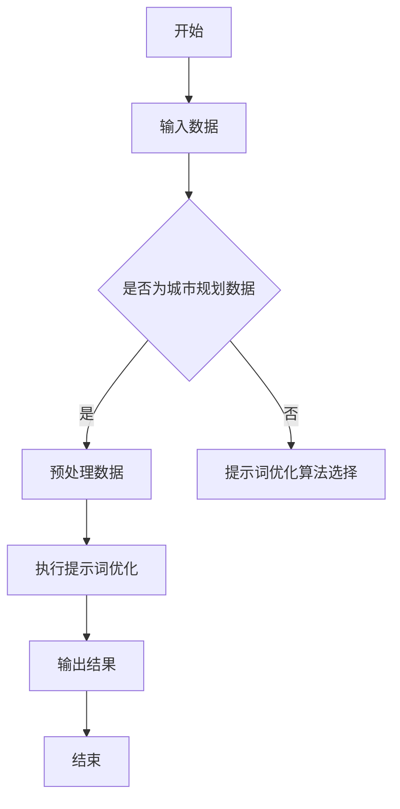

                 

# AI辅助城市规划：提示词优化土地利用

## 关键词
- 城市规划
- 人工智能
- 提示词优化
- 土地利用
- 算法原理
- 系统架构

## 摘要
本文深入探讨了如何利用人工智能技术，特别是提示词优化方法，辅助城市规划，实现土地利用的优化。文章首先介绍了城市规划面临的挑战和人工智能在其中的应用现状，随后详细阐述了提示词优化的概念和原理。通过实际案例和代码实现，本文展示了如何通过人工智能技术辅助城市规划，优化土地利用。最后，文章提出了未来城市规划与人工智能结合的发展趋势和展望。

## 目录大纲设计流程

为了设计出符合用户需求的目录大纲，我们可以将整个设计过程分为以下步骤：

### 1. 确定整体结构
首先，我们需要确定整本书的整体结构，包括主要章节和各章节的核心内容。这将为后续的目录大纲设计提供框架。

### 2. 确定章节标题
在每个主要章节下，我们需要明确各章节的标题。这些标题应简洁明了，能够准确反映章节内容。

### 3. 确定各章节的子标题
在确定了章节标题后，我们需要为每个章节添加子标题，以便更细致地划分内容。这些子标题也应简洁明了，有助于读者快速了解每个部分的内容。

### 4. 设计层级结构
使用 markdown 格式的 #，##，### 等符号，将各章节和子标题按照层级结构进行排列。

### 5. 补充说明
在每个章节或子标题后，适当地补充一些说明，以帮助读者更好地理解章节内容。

### 6. 调整和完善
根据用户反馈，对目录大纲进行调整和完善，确保其逻辑清晰、内容完整。

### 具体实施

以下是根据以上步骤设计出的《AI辅助城市规划：提示词优化土地利用》的目录大纲：

---

## 第一部分：背景介绍

### 1.1 问题背景
#### 1.1.1 城市规划面临的挑战
#### 1.1.2 人工智能在规划领域的应用现状
#### 1.1.3 提示词优化在城市规划中的作用

### 1.2 问题描述
#### 1.2.1 当前城市规划中存在的痛点
#### 1.2.2 提示词优化土地利用的必要性
#### 1.2.3 研究的目标和意义

### 1.3 问题解决
#### 1.3.1 人工智能辅助城市规划的基本原理
#### 1.3.2 提示词优化的基本方法
#### 1.3.3 城市规划中的AI应用案例

### 1.4 边界与外延
#### 1.4.1 城市规划的范围和限制
#### 1.4.2 提示词优化技术的适用性
#### 1.4.3 未来城市规划与AI结合的发展趋势

## 第二部分：核心概念与联系

### 2.1 核心概念
#### 2.1.1 城市规划的基本概念
#### 2.1.2 人工智能的基本概念
#### 2.1.3 提示词优化的概念

### 2.2 概念属性特征对比表格
#### 2.2.1 城市规划与人工智能的对比
#### 2.2.2 提示词优化与城市规划的对比

### 2.3 ER实体关系图架构
#### 2.3.1 城市规划中的实体关系
#### 2.3.2 人工智能在规划中的应用关系
#### 2.3.3 提示词优化的实体关系

## 第三部分：算法原理讲解

### 3.1 提示词优化的算法原理
#### 3.1.1 提示词优化的基本算法
#### 3.1.2 提示词优化的算法流程
#### 3.1.3 提示词优化的算法原理分析

### 3.2 算法mermaid流程图


### 3.3 Python源代码实现
```python
# 提示词优化算法的Python实现
def optimize_tip_words(data):
    # 数据预处理
    processed_data = preprocess_data(data)
    
    # 执行提示词优化
    optimized_words = execute_tip_words(processed_data)
    
    # 输出结果
    return optimized_words
```

### 3.4 算法原理详细讲解与举例说明
#### 3.4.1 数学模型和公式
$$
L = \sum_{i=1}^{n} w_i \cdot p_i \cdot q_i
$$
其中，$L$ 表示损失函数，$w_i$ 表示权重，$p_i$ 表示概率，$q_i$ 表示质量。

#### 3.4.2 举例说明
假设我们有一个数据集，包含三个提示词“公园”，“交通”，“绿地”。我们希望优化这些提示词，使其更加符合城市规划的需求。根据上述数学模型，我们可以计算出每个提示词的损失函数值，从而确定优化方向。

## 第四部分：系统分析与架构设计方案

### 4.1 问题场景介绍
#### 4.1.1 城市规划中的问题场景
#### 4.1.2 AI辅助城市规划的需求分析

### 4.2 项目介绍
#### 4.2.1 项目概述
#### 4.2.2 项目目标
#### 4.2.3 项目背景

### 4.3 系统功能设计
#### 4.3.1 领域模型
#### 4.3.2 领域模型类图

### 4.4 系统架构设计
#### 4.4.1 系统架构概述
#### 4.4.2 系统架构图

### 4.5 系统接口设计
#### 4.5.1 接口规范
#### 4.5.2 接口设计

### 4.6 系统交互
#### 4.6.1 系统交互概述
#### 4.6.2 系统交互序列图

## 第五部分：项目实战

### 5.1 环境安装
#### 5.1.1 硬件环境
#### 5.1.2 软件环境

### 5.2 系统核心实现
#### 5.2.1 数据预处理
#### 5.2.2 提示词优化算法实现
#### 5.2.3 结果分析

### 5.3 代码应用解读与分析
#### 5.3.1 代码解读
#### 5.3.2 分析与优化

### 5.4 实际案例分析
#### 5.4.1 案例概述
#### 5.4.2 案例分析

### 5.5 项目小结
#### 5.5.1 项目成果
#### 5.5.2 项目反思

## 第六部分：最佳实践 tips、小结、注意事项、拓展阅读

### 6.1 最佳实践 tips
#### 6.1.1 提高城市规划效率的建议
#### 6.1.2 提高提示词优化效果的建议

### 6.2 小结
#### 6.2.1 文章总结
#### 6.2.2 关键技术点回顾

### 6.3 注意事项
#### 6.3.1 使用提示词优化技术的注意事项
#### 6.3.2 城市规划中的常见问题与解决方案

### 6.4 拓展阅读
#### 6.4.1 相关文献推荐
#### 6.4.2 相关书籍推荐

## 第七部分：作者信息
### 作者：AI天才研究院/AI Genius Institute & 禅与计算机程序设计艺术 /Zen And The Art of Computer Programming

---

接下来，我们将按照这个目录大纲逐步展开详细内容。

