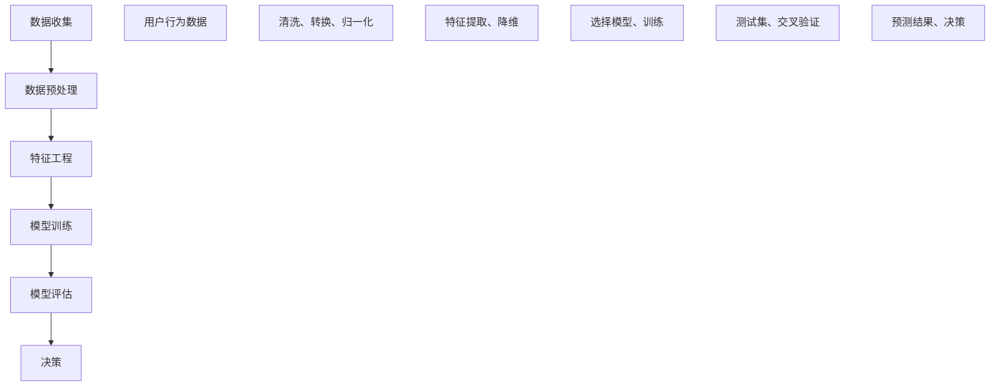
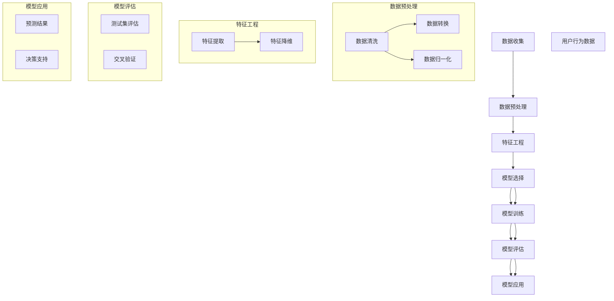
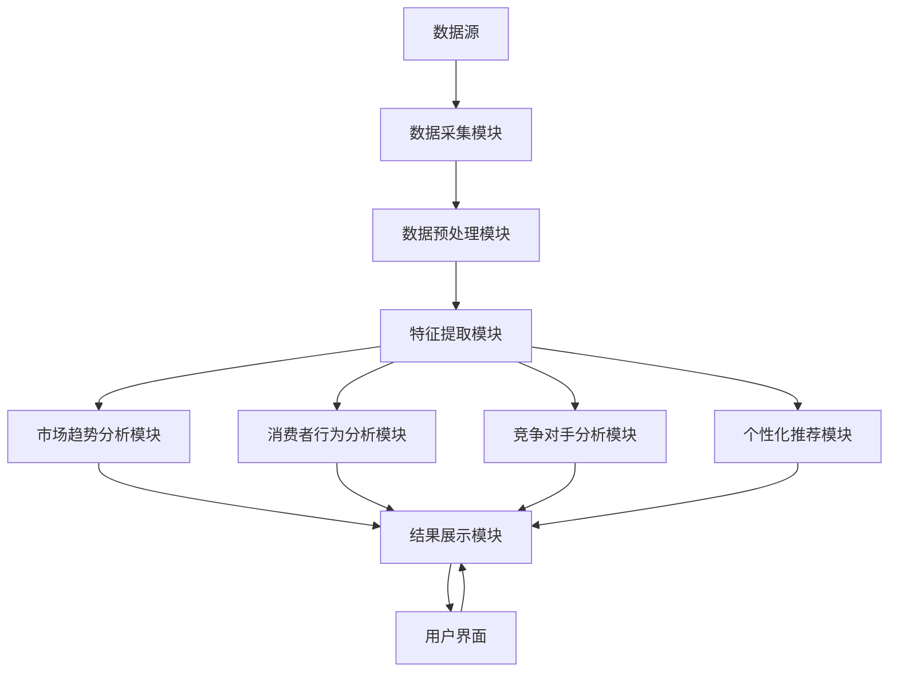
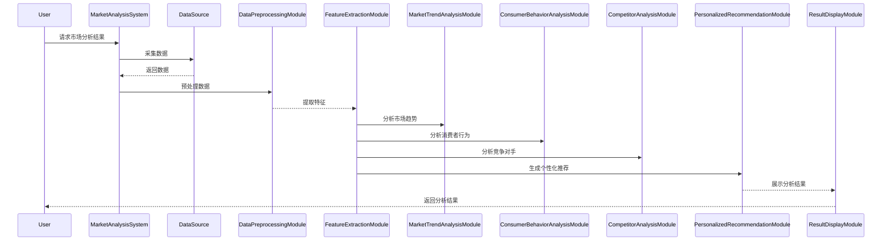

                 


### 文章标题与关键词

**文章标题：** AI辅助市场分析：提示词洞察消费者行为

**关键词：** AI市场分析、消费者行为、提示词、算法、数学模型、系统架构

### 文章摘要

本文将探讨AI技术在市场分析中的应用，重点关注提示词技术在洞察消费者行为方面的作用。通过对核心概念的详细解析、算法原理的深入讲解、数学模型的数学公式阐述，以及系统架构与项目实战的分析，本文旨在为读者提供一幅全面、清晰的AI辅助市场分析全景图，帮助读者理解并应用AI技术来提升市场分析的准确性和效率。

### 目录大纲设计思路

设计《AI辅助市场分析：提示词洞察消费者行为》的目录大纲时，我们首先明确了文章的核心主题和目标读者群体。文章旨在为AI和数据分析领域的专业人士提供深入的见解和实用的技术指导。因此，目录结构的设计需要遵循逻辑清晰、层次分明、易于阅读的原则。

#### 目录大纲设计原则

1. **结构化**：确保每个章节都有明确的小节划分，每小节的内容紧密围绕核心主题，避免内容冗余。

2. **逻辑性**：按照从背景介绍到技术原理，再到系统架构，最后到项目实战的顺序组织内容，确保读者可以循序渐进地理解整个主题。

3. **实用性**：注重实践性，不仅介绍理论知识，还包含具体的项目实战案例，让读者能够将所学应用于实际工作中。

4. **层次感**：通过使用标题层级（如H2、H3等），确保文章的结构层次分明，便于读者快速定位感兴趣的内容。

#### 目录大纲内容概述

**第一部分：背景介绍与核心概念**

- **第1章：市场分析与消费者行为概述**：介绍市场分析的定义、发展历程，以及消费者行为的基本理论。
- **第2章：AI辅助市场分析**：探讨AI技术如何辅助市场分析，并介绍提示词技术在其中的应用。
- **第3章：核心概念与联系**：详细解析AI市场分析的核心概念，通过对比表格和实体关系图，帮助读者建立清晰的概念体系。

**第二部分：技术原理与算法讲解**

- **第4章：提示词技术原理**：讲解提示词的基本概念、算法工作原理，以及优化方法。
- **第5章：消费者行为算法讲解**：介绍消费者行为算法的类型、应用场景，使用Mermaid流程图和Python代码详细阐述算法原理。
- **第6章：数学模型与数学公式**：解释消费者行为数学模型，展示模型参数和公式，并通过实际例子进行讲解。

**第三部分：系统分析与架构设计**

- **第7章：系统功能设计与架构**：介绍系统功能设计、系统架构设计，并通过Mermaid类图、架构图、接口设计图和序列图，展示系统设计全貌。

**第四部分：项目实战与最佳实践**

- **第8章：项目实战案例**：详细描述项目环境安装、系统实现、代码解读和案例分析。
- **第9章：最佳实践与总结**：总结最佳实践技巧，回顾项目关键点，并提供拓展阅读资源。

通过以上设计，我们旨在构建一个系统化、结构化、逻辑清晰的文章框架，帮助读者深入理解AI辅助市场分析的原理和应用，从而在实际工作中取得更好的成果。

### 目录大纲（Markdown格式）

```markdown
----------------------------------------------------------------
# AI辅助市场分析：提示词洞察消费者行为

## 关键词
- AI市场分析
- 消费者行为
- 提示词
- 算法
- 数学模型
- 系统架构

## 摘要
本文探讨了AI技术如何辅助市场分析，特别是在使用提示词技术洞察消费者行为方面的应用。通过深入解析技术原理、数学模型，以及系统架构设计，本文为读者提供了全面的技术指南和实践案例。

----------------------------------------------------------------

# 第一部分：背景介绍与核心概念

## 第1章：市场分析与消费者行为概述
### 1.1 市场分析的定义与发展历程
### 1.2 消费者行为的基本理论

## 第2章：AI辅助市场分析
### 2.1 AI技术的定义与市场分析的结合
### 2.2 提示词技术在市场分析中的应用

## 第3章：核心概念与联系
### 3.1 AI市场分析的核心概念
### 3.2 概念属性特征对比表格
### 3.3 ER实体关系图架构

----------------------------------------------------------------

# 第二部分：技术原理与算法讲解

## 第4章：提示词技术原理
### 4.1 提示词的基本概念
### 4.2 提示词算法的工作原理
### 4.3 提示词优化的方法

## 第5章：消费者行为算法讲解
### 5.1 消费者行为算法的类型
### 5.2 消费者行为算法的应用场景
### 5.3 算法原理讲解与Mermaid流程图

## 第6章：数学模型与数学公式
### 6.1 消费者行为数学模型
### 6.2 模型参数与公式
### 6.3 数学公式详细讲解与举例说明

----------------------------------------------------------------

# 第三部分：系统分析与架构设计

## 第7章：系统功能设计与架构
### 7.1 问题场景介绍
### 7.2 系统功能设计（领域模型类图）
### 7.3 系统架构设计（架构图）
### 7.4 系统接口设计与系统交互序列图

----------------------------------------------------------------

# 第四部分：项目实战与最佳实践

## 第8章：项目实战案例
### 8.1 环境安装与配置
### 8.2 系统核心实现源代码
### 8.3 代码应用解读与分析
### 8.4 实际案例分析与详细讲解剖析

## 第9章：最佳实践与总结
### 9.1 最佳实践技巧
### 9.2 项目小结
### 9.3 注意事项与拓展阅读

----------------------------------------------------------------
```

以上设计的目录大纲为文章内容提供了一个清晰的结构框架，确保读者可以系统地掌握AI辅助市场分析的核心概念和技术原理，并通过实际案例了解其应用效果。在后续的内容编写中，我们将按照这一大纲逐章展开详细论述。 

### 第1章：市场分析与消费者行为概述

#### 1.1 市场分析的定义与发展历程

市场分析是一种系统性的研究方法，旨在了解市场环境、消费者需求、竞争对手状况及其变化趋势，从而为企业决策提供数据支持。市场分析的概念起源于20世纪初，随着商业经济的发展和市场竞争的加剧，其重要性日益凸显。

**市场分析的起源**：最早的现代市场分析可以追溯到20世纪初期。当时，企业家和学者们开始意识到，通过系统的研究和分析，可以更好地了解市场动态和消费者需求，从而制定出更有效的营销策略。例如，1908年，美国经济学家弗雷德里克·泰勒（Frederick Taylor）在其著作《市场分析》中提出了市场分析的基本概念和方法。

**市场分析的发展历程**：
- **第一阶段（20世纪初到20世纪60年代）**：这一阶段，市场分析主要侧重于宏观层面的市场环境研究，包括市场容量、行业趋势等。研究者们开始使用统计数据和图表来展示市场信息，如市场趋势图、消费者购买行为分析等。
- **第二阶段（20世纪60年代到80年代）**：随着计算机技术的发展，市场分析进入了新的阶段。这一时期，市场分析开始引入定量分析方法，如回归分析、聚类分析等，使市场预测更加精准。
- **第三阶段（20世纪80年代至今）**：随着大数据和人工智能技术的兴起，市场分析进入了智能化时代。现代市场分析不仅依赖于传统的定量分析，还结合了数据挖掘、机器学习等先进技术，能够更深入地洞察消费者行为和市场趋势。

#### 1.2 消费者行为的基本理论

消费者行为理论是市场分析的核心内容之一，它旨在解释消费者在购买决策过程中的行为模式。消费者行为理论的发展经历了多个阶段，从早期的经济学理论，到现代的行为科学理论，不断丰富和完善。

**早期消费者行为理论**：
- **经济学理论**：传统经济学认为，消费者是理性的，他们的购买决策基于成本效益分析。这一理论主要强调消费者在有限资源下的最大化效用。
- **行为科学理论**：随着心理学和行为科学的发展，研究者们开始关注消费者在购买决策中的心理和社会因素。例如，马斯洛的需求层次理论指出，消费者的需求是分层的，从生理需求到自我实现需求。

**现代消费者行为理论**：
- **心理行为学理论**：这一理论强调心理因素在消费者行为中的作用，如感知、态度、动机等。该理论认为，消费者在购买过程中会经历认知、情绪和行为的复杂过程。
- **行为经济学理论**：行为经济学结合了经济学和心理学，研究消费者在真实市场环境中的决策行为。它指出，消费者往往受到各种认知偏差的影响，如锚定效应、代表性偏差等。

**消费者行为的主要模型**：
- **刺激-反应模型**：该模型认为，消费者的购买行为是对外部刺激的反应。例如，广告、促销等营销活动可以刺激消费者的购买欲望。
- **决策过程模型**：该模型描述了消费者从意识到需求到购买决策的全过程，包括需求识别、信息搜索、评估选择、购买决策和购后行为。

**消费者行为的影响因素**：
- **个人因素**：包括年龄、性别、收入、教育水平、职业等。
- **心理因素**：包括感知、学习、动机、态度等。
- **社会因素**：包括家庭、社会阶层、参照群体等。
- **文化因素**：包括文化、亚文化、社会价值观等。

通过深入理解消费者行为理论，企业可以更好地制定营销策略，满足消费者的需求，提高市场竞争力。

#### 1.3 问题背景与问题描述

在现代商业环境中，消费者行为分析面临着诸多挑战。首先，消费者行为日益复杂多变，受到多种因素的影响，这使得传统的分析手段难以满足需求。其次，随着互联网和移动设备的普及，消费者的购买渠道和方式变得更加多样化，数据来源更加广泛。如何从海量数据中提取有价值的信息，是市场分析的一大难题。

**问题解决方法**：为了应对这些挑战，人工智能（AI）技术的引入成为了一项重要的解决方案。AI技术，尤其是机器学习和深度学习，能够从海量数据中自动提取特征，进行模式识别和预测。例如，通过分析消费者在社交媒体上的行为和评论，可以洞察他们的偏好和需求。此外，AI技术还可以帮助优化营销策略，提高广告投放的精准度。

**边界与外延**：消费者行为分析的边界包括消费者的购买行为、使用行为和口碑传播等。其外延则涉及到市场研究、用户反馈、竞争对手分析等领域。通过整合这些数据，企业可以获得全面的消费者洞察，从而做出更为明智的决策。

#### 1.4 概念属性特征对比表格

为了更好地理解消费者行为和市场分析，下面是一个对比表格，列出了一些关键概念及其属性特征。

| 概念             | 定义                                                         | 属性特征                                             |
|------------------|--------------------------------------------------------------|------------------------------------------------------|
| 市场分析         | 系统性地研究市场环境、消费者需求、竞争对手状况及其变化趋势。       | 目标性、数据驱动、系统性、前瞻性                       |
| 消费者行为       | 消费者在购买、使用和评价产品或服务过程中的行为模式。                 | 理性决策、感性反应、多样性、动态性                     |
| 提示词技术       | 用于识别和提取文本信息的关键词和短语。                                 | 精准性、效率性、灵活性、多样性                         |
| 机器学习         | 通过数据驱动的方法，从数据中学习规律和模式，以进行预测和决策。         | 自适应性、高效性、自动化、准确性                       |
| 深度学习         | 一种特殊类型的机器学习，通过多层神经网络进行特征提取和模式识别。       | 复杂性、强大性、高效性、泛化能力                       |

#### 1.5 ER实体关系图架构

为了更直观地展示消费者行为分析中涉及的实体及其关系，我们可以使用实体关系图（ER图）来描述。以下是消费者行为分析中常见的一些实体及其关系：

```mermaid
erDiagram
    Product ||--|{ Customer } : 购买
    Customer ||--|{ Purchase } : 描述购买行为
    Purchase ||--|{ Review } : 用户评价
    Product ||--|{ Review } : 产品评价
    Customer ||--|{ Behavior } : 行为分析
    Behavior ||--|{ Trend } : 趋势分析
```

在这个ER图中，`Product`（产品）与`Customer`（消费者）之间存在购买关系，消费者通过`Purchase`（购买）实体描述其购买行为。此外，消费者还会进行`Review`（评价）行为，这些评价反过来又影响产品。消费者的行为分析则通过`Behavior`（行为）实体进行，这些行为趋势最终用于市场分析。

通过以上对比表格和ER图，读者可以更清晰地理解消费者行为和市场分析的核心概念及其相互关系，为后续章节的深入讨论打下基础。

### 第2章：AI辅助市场分析

#### 2.1 AI技术的定义与市场分析的结合

人工智能（AI）技术是计算机科学的一个分支，致力于使机器能够模拟、延伸和扩展人类的智能行为。AI技术涵盖了多个领域，包括机器学习、深度学习、自然语言处理、计算机视觉等。近年来，随着计算能力的提升和数据量的爆炸性增长，AI技术在各个行业中的应用越来越广泛，市场分析领域也不例外。

**AI技术的定义**：AI是指通过计算机模拟人类智能行为的技术。它不仅包括机器学习和深度学习，还包括知识表示、推理、规划、感知等领域。机器学习是AI的一个重要分支，它通过训练算法，从数据中自动学习规律和模式，以实现预测、分类、聚类等功能。

**AI与市场分析的结合**：AI技术为市场分析提供了强大的工具，使得企业能够更高效地处理和分析大量数据，从而做出更为准确和明智的决策。以下是一些AI技术在市场分析中的应用：

1. **消费者行为预测**：通过机器学习算法，分析消费者的购买历史、搜索行为、社交媒体互动等数据，预测消费者的未来购买行为和需求。

2. **市场趋势分析**：利用时间序列分析、回归分析等算法，从海量数据中提取有价值的信息，预测市场趋势和变化。

3. **竞争对手分析**：通过自然语言处理和文本分析技术，从新闻、社交媒体、竞争对手网站等渠道中提取信息，分析竞争对手的策略、产品和市场表现。

4. **个性化营销**：利用消费者行为数据和偏好分析，为消费者提供个性化的产品推荐和营销策略。

#### 2.2 提示词技术在市场分析中的应用

提示词技术是一种利用关键词和短语来识别和提取文本信息的方法。在市场分析中，提示词技术可以用于消费者行为分析、市场趋势预测、竞争对手监测等多个方面。

**提示词技术的定义**：提示词技术是指通过识别和提取文本中的关键短语和关键词，以实现信息提取、分析和分类的方法。它通常涉及自然语言处理（NLP）技术，如词频统计、词性标注、命名实体识别等。

**提示词技术在市场分析中的应用**：

1. **消费者行为分析**：通过分析消费者在社交媒体、评论论坛、调查问卷等渠道中使用的提示词，可以了解消费者的需求和偏好。例如，通过分析消费者在产品评论中使用的正面或负面词汇，可以评估产品的市场表现和用户满意度。

2. **市场趋势预测**：通过跟踪和分析市场报告、新闻报道、社交媒体等渠道中的提示词，可以识别市场的热点话题和趋势。这有助于企业及时调整营销策略，抓住市场机会。

3. **竞争对手监测**：通过监测和分析竞争对手的营销策略、产品发布、市场活动等渠道中的提示词，可以了解竞争对手的动态和策略。这有助于企业制定针对性的竞争策略，抢占市场先机。

**案例解析**：

- **消费者行为分析**：假设一家电商公司想要了解消费者对其最新推出的一款智能手机的反馈。公司可以通过分析社交媒体平台上的评论，提取与这款手机相关的提示词，如“高清屏幕”、“长续航”、“智能助手”等。通过统计这些提示词的使用频率和正负面情绪，公司可以了解消费者的主要关注点和满意度。

- **市场趋势预测**：某市场研究公司想要预测未来几个月内某地区的智能手机市场需求。公司可以通过分析新闻网站、社交媒体平台、市场报告中的提示词，如“5G手机”、“高端市场”、“智能穿戴设备”等。通过分析这些提示词的趋势，公司可以预测市场需求的增长点和变化趋势。

- **竞争对手监测**：某手机制造商想要了解其主要竞争对手的营销策略。公司可以通过分析竞争对手的官方网站、社交媒体账号、广告文案中的提示词，如“旗舰手机”、“拍照效果”、“价格优惠”等。通过这些提示词，公司可以了解竞争对手的产品定位、市场策略和用户反馈。

通过以上案例，我们可以看到提示词技术在市场分析中的广泛应用。它不仅帮助企业在消费者行为分析、市场趋势预测和竞争对手监测等方面取得突破，还为企业的决策提供了科学依据。

#### 2.3 提示词技术如何提升市场分析效率

提示词技术通过自动提取和分析文本中的关键信息，极大地提升了市场分析的效率和准确性。以下是一些具体的提升措施：

1. **自动化数据提取**：传统的市场分析往往依赖于人工阅读和分类，效率低下且易出错。提示词技术可以通过自然语言处理算法，自动从大量文本数据中提取关键信息，如关键词、短语和命名实体，从而大幅提高数据处理速度。

2. **快速市场监测**：提示词技术可以帮助企业实时监控市场动态，通过监测新闻、社交媒体、论坛等渠道中的提示词，快速了解市场热点和趋势。这有助于企业及时调整策略，抢占市场先机。

3. **深度消费者洞察**：通过分析消费者在社交媒体、评论论坛等渠道中使用的提示词，可以深入了解消费者的需求和偏好。这有助于企业制定更精准的营销策略，提高用户满意度和忠诚度。

4. **优化竞争对手分析**：提示词技术可以自动提取和分析竞争对手的营销策略、产品发布、市场活动等信息，帮助企业更全面地了解竞争对手的动态和策略。这有助于企业制定更有针对性的竞争策略，提升市场竞争力。

**实际案例**：

- **某电商平台的消费者行为分析**：某电商平台通过提示词技术分析消费者在产品评论中使用的关键词和短语，发现消费者对新款智能手表的关注主要集中在“续航时间”、“心率监测”和“价格”等方面。基于这些洞察，平台及时调整了营销策略，推出了限时优惠活动，并优化了产品描述，从而提高了用户购买意愿和满意度。

- **某市场研究公司的市场趋势预测**：某市场研究公司利用提示词技术分析社交媒体平台、新闻报道和市场报告中的关键词，发现“智能家居”、“物联网”和“智能家居硬件”等提示词的使用频率显著上升。基于这些分析结果，公司预测了智能家居市场的增长趋势，并向相关企业提供了市场研究报告，帮助他们制定市场进入策略。

通过以上实际案例，我们可以看到提示词技术如何通过自动化数据提取、快速市场监测、深度消费者洞察和优化竞争对手分析，显著提升市场分析的效率和质量。随着技术的不断进步，提示词技术在市场分析中的应用前景将更加广阔。

#### 2.4 AI技术在市场分析中的挑战与解决方案

尽管AI技术在市场分析中具有巨大的潜力，但在实际应用过程中也面临着一些挑战。以下是一些主要挑战及其解决方案：

1. **数据质量问题**：市场分析依赖于大量数据，但数据质量直接影响分析结果的准确性。数据质量问题包括数据缺失、错误和不一致等。**解决方案**：采用数据清洗和预处理技术，如数据填充、异常值检测和格式转换等，确保数据质量。

2. **算法解释性**：许多AI算法，尤其是深度学习模型，具有较高的预测准确性，但缺乏解释性，使得决策过程难以理解。**解决方案**：引入可解释性AI（XAI）技术，如注意力机制、决策树和LIME（Local Interpretable Model-agnostic Explanations）等，提高算法的可解释性。

3. **隐私保护**：市场分析往往涉及敏感的消费者数据，隐私保护成为一大挑战。**解决方案**：采用隐私保护技术，如差分隐私、联邦学习和同态加密等，确保数据隐私。

4. **模型过拟合**：当训练数据有限时，AI模型容易过拟合，导致在测试数据上的表现不佳。**解决方案**：采用交叉验证、正则化和增强数据集等方法，避免模型过拟合。

5. **实时性**：市场分析需要实时处理和分析大量数据，对系统的实时性要求较高。**解决方案**：采用分布式计算、实时数据处理和流计算等技术，提高系统的实时性。

通过以上解决方案，我们可以克服AI技术在市场分析中面临的挑战，充分发挥其在数据分析、消费者洞察和决策支持方面的优势。

### 第3章：核心概念与联系

#### 3.1 AI市场分析的核心概念

在深入探讨AI辅助市场分析之前，我们需要明确一些核心概念，这些概念是理解AI技术如何应用于市场分析的基础。

**数据挖掘**：数据挖掘是指从大量数据中提取有价值信息的过程，它利用机器学习、统计学和数据库技术，识别数据中的模式和关联。在市场分析中，数据挖掘用于分析消费者行为、市场趋势和竞争状况。

**机器学习**：机器学习是一种通过数据驱动的方法，使计算机系统能够从数据中学习规律和模式的技术。它广泛应用于预测、分类和聚类等任务。在市场分析中，机器学习用于构建消费者行为预测模型、个性化推荐系统和市场趋势分析模型。

**深度学习**：深度学习是机器学习的一个分支，它通过多层神经网络模拟人类大脑的学习过程，用于处理复杂的任务。在市场分析中，深度学习被用于图像识别、语音识别和自然语言处理等任务，以提取消费者行为和偏好。

**自然语言处理（NLP）**：自然语言处理是计算机科学和语言学的一个分支，它致力于使计算机能够理解和生成自然语言。在市场分析中，NLP用于分析消费者评论、社交媒体互动和新闻报道，以提取关键信息和趋势。

**数据可视化**：数据可视化是将数据以图形和视觉形式展示的过程，它帮助用户更好地理解数据中的模式和关联。在市场分析中，数据可视化用于展示消费者行为、市场趋势和竞争状况，使决策者能够直观地理解分析结果。

**预测分析**：预测分析是利用历史数据和统计分析技术，预测未来的趋势和行为。在市场分析中，预测分析用于预测市场需求、消费者行为和市场变化，帮助企业制定战略计划。

**客户细分**：客户细分是将市场中的消费者划分为不同的群体，每个群体具有相似的购买行为和偏好。在市场分析中，客户细分用于个性化营销、产品定位和策略制定。

**推荐系统**：推荐系统是一种通过分析用户历史行为和偏好，向用户推荐相关产品和服务的系统。在市场分析中，推荐系统用于提高用户满意度和购买转化率。

#### 3.2 概念属性特征对比表格

为了更好地理解这些核心概念及其相互关系，下面是一个对比表格，列出了一些关键概念及其属性特征。

| 概念       | 定义                                                         | 属性特征                                           |
|------------|--------------------------------------------------------------|----------------------------------------------------|
| 数据挖掘   | 从大量数据中提取有价值信息的过程。                               | 自动化、模式识别、数据分析                             |
| 机器学习   | 通过数据驱动的方法，使计算机系统能够从数据中学习规律和模式的技术。   | 自适应性、预测性、分类、聚类                           |
| 深度学习   | 通过多层神经网络模拟人类大脑的学习过程，用于处理复杂的任务。       | 复杂性、强大性、高效性、泛化能力                       |
| 自然语言处理（NLP） | 使计算机能够理解和生成自然语言的技术。                               | 语言模型、文本分类、情感分析、问答系统                 |
| 数据可视化 | 将数据以图形和视觉形式展示的过程。                                   | 直观性、可理解性、交互性、探索性                       |
| 预测分析   | 利用历史数据和统计分析技术，预测未来的趋势和行为。                   | 统计模型、时间序列分析、回归分析                       |
| 客户细分   | 将市场中的消费者划分为不同的群体，每个群体具有相似的购买行为和偏好。   | 个性化、目标明确、精准营销                             |
| 推荐系统   | 通过分析用户历史行为和偏好，向用户推荐相关产品和服务的系统。         | 相关性、多样性、个性化、用户满意度                     |

#### 3.3 ER实体关系图架构

为了更直观地展示这些核心概念之间的关系，我们可以使用实体关系图（ER图）来描述。以下是AI市场分析中的一些关键实体及其关系：

```mermaid
erDiagram
    DataMining ||--|{ MachineLearning } : 应用
    MachineLearning ||--|{ DeepLearning } : 继承
    DeepLearning ||--|{ NaturalLanguageProcessing } : 应用
    NaturalLanguageProcessing ||--|{ DataVisualization } : 应用
    DataVisualization ||--|{ PredictiveAnalytics } : 应用
    PredictiveAnalytics ||--|{ CustomerSegmentation } : 应用
    CustomerSegmentation ||--|{ RecommendationSystem } : 应用
```

在这个ER图中，`DataMining`（数据挖掘）是整个架构的基础，它应用于`MachineLearning`（机器学习），而机器学习继承了`DeepLearning`（深度学习）的强大能力。深度学习在`NaturalLanguageProcessing`（自然语言处理）中发挥了重要作用，它还应用于`DataVisualization`（数据可视化）。数据可视化进一步应用于`PredictiveAnalytics`（预测分析），预测分析用于`CustomerSegmentation`（客户细分），而客户细分则为`RecommendationSystem`（推荐系统）提供输入。

通过这个ER图，我们可以清晰地看到AI市场分析中各个核心概念之间的相互关系，以及它们在市场分析中的应用。

#### 3.4 概念联系与市场分析的实际应用

在理解了AI市场分析中的核心概念后，我们需要探讨这些概念之间的联系，并说明它们在实际市场分析中的应用。

**数据挖掘与机器学习**：数据挖掘是市场分析的第一步，它从大量数据中提取有价值的信息。这些信息通过机器学习算法进一步分析，用于预测消费者行为、市场趋势等。例如，通过分析消费者的购买历史和行为数据，可以预测他们未来的购买偏好，从而制定更有效的营销策略。

**深度学习与自然语言处理**：深度学习在自然语言处理中发挥着重要作用，它能够从大量文本数据中提取语义信息。在市场分析中，这可以用于分析消费者评论、社交媒体互动和新闻报道。通过自然语言处理技术，可以识别消费者对产品的评价和反馈，了解他们的需求和偏好。

**数据可视化与预测分析**：数据可视化是将复杂的数据以直观的方式展示，帮助决策者更好地理解分析结果。预测分析则基于历史数据和统计分析技术，预测未来的市场趋势和消费者行为。通过数据可视化，决策者可以更直观地看到预测结果，从而制定更精准的市场策略。

**客户细分与推荐系统**：客户细分是将市场中的消费者划分为不同的群体，每个群体具有相似的购买行为和偏好。这有助于企业实施个性化营销策略，提高用户满意度和忠诚度。推荐系统则基于用户的历史行为和偏好，向用户推荐相关的产品和服务，进一步促进销售。

**实际应用案例**：

- **消费者行为预测**：一家电商公司使用机器学习算法分析消费者的购买历史和行为数据，预测他们未来的购买偏好。基于这些预测，公司可以提前备货，提高库存周转率，并制定个性化的营销活动，提高销售转化率。

- **市场趋势分析**：一家市场研究公司利用深度学习和自然语言处理技术，分析社交媒体平台和新闻报道中的关键词和短语，预测市场的热点话题和趋势。基于这些预测，公司可以向相关企业提供市场研究报告，帮助他们制定市场策略。

- **个性化营销**：一家零售公司使用客户细分技术，将市场中的消费者划分为高价值客户、潜力客户和普通客户。针对不同客户群体，公司制定了个性化的营销策略，如VIP客户的专属优惠、潜力客户的推荐奖励等，提高了客户满意度和忠诚度。

- **推荐系统**：一家在线视频平台使用推荐系统技术，根据用户的观看历史和偏好，推荐相关的视频内容。通过推荐系统，平台提高了用户观看时长和参与度，进一步促进了广告收入。

通过以上案例，我们可以看到AI市场分析中的核心概念如何相互联系，并在实际应用中发挥重要作用。这些技术不仅帮助企业更好地理解市场动态和消费者行为，还提高了决策的准确性和效率。

### 第4章：提示词技术原理

#### 4.1 提示词的基本概念

提示词（Keywords）是文本分析中用于标识文本内容的重要元素，它们可以是一词或多词组合，用于表示文本的主题、概念或信息。在市场分析中，提示词技术通过识别和提取这些关键词，帮助分析文本数据，揭示其中隐藏的模式和趋势。

**定义**：提示词是一种用于描述文本内容的词汇或短语，它能够反映文本的核心主题或重要信息。在自然语言处理（NLP）中，提示词通常通过词频统计、TF-IDF（词频-逆文档频率）计算、关键词提取算法等方法来确定。

**类型**：提示词可以分为以下几种类型：

1. **主题词**：用于表示文本主题的核心词汇，如“人工智能”、“市场营销”、“消费者行为”等。
2. **属性词**：描述主题词属性或特征的词汇，如“高效”、“智能”、“创新”等。
3. **情感词**：反映文本情感倾向的词汇，如“满意”、“失望”、“激动”等。
4. **功能词**：辅助主题词和属性词的词汇，如“的”、“和”、“了”等，它们本身不反映主题，但对文本结构有重要作用。

**提示词在市场分析中的应用**：

- **消费者行为分析**：通过提取消费者在评论、反馈和社交媒体中的提示词，可以了解他们的需求和偏好。例如，通过分析消费者对某款手机的评价，提取与“高清屏幕”、“长续航”、“智能助手”相关的提示词，可以了解消费者对该产品的关注点。
- **市场趋势预测**：通过跟踪和分析市场报告、新闻报道、社交媒体等渠道中的提示词，可以识别市场的热点话题和趋势。例如，通过监测与“5G手机”、“智能家居”、“电商促销”相关的提示词，可以预测市场的未来趋势。
- **竞争对手分析**：通过提取竞争对手的营销策略、产品发布和市场活动中的提示词，可以了解他们的动态和策略。例如，通过分析竞争对手的网站、广告文案和社交媒体帖子中的提示词，可以了解他们的产品定位和营销策略。

#### 4.2 提示词算法的工作原理

提示词算法是自然语言处理中用于提取关键词的方法，它们通过分析文本的词频、词性、语义等特征，识别出能够代表文本主题的词汇。以下是一些常用的提示词算法：

**TF-IDF算法**：TF-IDF（词频-逆文档频率）是一种基于统计的文本分析算法，用于计算每个词在文档中的重要程度。TF（词频）表示词在单个文档中出现的次数，IDF（逆文档频率）表示词在整个文档集中出现的频率。公式如下：

\[ TF-IDF = TF \times IDF \]

其中，\( IDF = \log(\frac{N}{n_d}) \)，\( N \)是文档总数，\( n_d \)是包含该词的文档数。TF-IDF算法认为，一个词在文档中的重要程度不仅取决于其在单个文档中的频率，还取决于它在整个文档集中出现的频率。高频但低IDF的词通常被视为噪声词，如“的”、“和”、“了”等。

**关键词提取算法**：关键词提取算法是一类用于从文本中提取关键信息的算法，如TF-IDF、Latent Semantic Analysis（LSA）、TextRank等。以下是一些常用的关键词提取算法：

- **TF-IDF**：已在上文中介绍。
- **LSA（潜在语义分析）**：LSA通过将文本表示为高斯分布，使用奇异值分解（SVD）提取文本的潜在语义特征，从而识别关键词。
- **TextRank**：TextRank基于图模型，将文本视为有向图，节点的权重由词频和链接权重决定。TextRank通过迭代计算节点的权重，最终提取出高权重的关键词。

**提示词优化的方法**：

- **去噪**：通过去除高频低频词（如停用词处理）和异常值，提高提示词的准确性。
- **上下文分析**：考虑词的上下文信息，例如词性标注、命名实体识别等，以更准确地提取关键词。
- **多语言支持**：对于多语言文本，采用双语词典、翻译模型等方法，提高跨语言关键词提取的准确性。
- **用户反馈**：结合用户反馈，不断优化提示词算法，使其更符合实际需求。

#### 4.3 提示词优化方法

为了提高提示词的准确性和实用性，我们可以采用以下几种优化方法：

1. **停用词处理**：停用词是指在文本分析中常被忽略的词汇，如“的”、“和”、“了”等。通过去除停用词，可以减少文本中的噪声，提高提示词的准确性。

2. **词性标注**：词性标注是将文本中的每个词标注为名词、动词、形容词等。通过词性标注，可以更准确地提取关键词，例如，名词往往更具有描述性。

3. **命名实体识别（NER）**：命名实体识别是用于识别文本中的特定实体，如人名、地名、组织名等。这些实体往往是文本中的重要关键词。

4. **上下文分析**：通过分析词的上下文信息，可以更准确地提取关键词。例如，在“我喜欢这个产品”这句话中，“喜欢”是一个情感词，但单独提取它可能不够准确，结合“这个产品”，可以更准确地理解文本的意图。

5. **用户反馈**：结合用户反馈，可以不断优化提示词算法。例如，用户可以指出某些关键词不够准确或遗漏，从而调整算法参数，提高提示词的准确性。

通过以上优化方法，我们可以显著提高提示词的准确性，从而更好地服务于市场分析，帮助企业和决策者更准确地了解市场动态和消费者行为。

#### 4.4 提示词技术在市场分析中的应用实例

提示词技术在市场分析中具有广泛的应用，以下是一些具体的实例：

**实例1：消费者行为分析**

某电商公司希望通过分析消费者在产品评论中的评论，了解消费者对产品的看法和需求。通过使用TF-IDF算法，公司提取出消费者评论中的高频关键词，如“高清屏幕”、“长续航”、“智能助手”等。分析这些关键词，公司发现消费者对产品的屏幕质量、电池续航和智能功能有较高关注。基于这些洞察，公司决定在产品描述中加强这些方面的宣传，并改进产品功能，以提高用户满意度。

**实例2：市场趋势预测**

一家市场研究公司通过监测社交媒体平台和新闻报道中的关键词，预测市场的热点话题和趋势。例如，通过分析与“5G手机”、“智能家居”、“电商促销”相关的关键词，公司发现消费者对5G技术的关注度逐渐上升，智能家居市场潜力巨大。基于这些预测，公司向相关企业提供了市场研究报告，帮助他们制定市场进入策略。

**实例3：竞争对手分析**

某手机制造商希望通过分析竞争对手的营销策略，了解竞争对手的产品定位和策略。通过提取竞争对手网站、广告文案和社交媒体帖子中的关键词，公司发现竞争对手主要强调产品的拍照效果、价格优惠和售后服务。基于这些洞察，该公司调整了自己的营销策略，强调产品的拍照功能和性价比，以吸引更多消费者。

通过以上实例，我们可以看到提示词技术如何通过提取关键信息，帮助企业和决策者更好地理解市场动态和消费者行为，从而制定更有效的市场策略。

### 第5章：消费者行为算法讲解

#### 5.1 消费者行为算法的类型

在市场分析中，消费者行为算法是理解和预测消费者行为的重要工具。根据算法的处理方式和应用场景，消费者行为算法可以分为以下几种类型：

**1. 基于回归分析的算法**

回归分析是一种常见的统计方法，用于预测一个或多个自变量与因变量之间的关系。在消费者行为分析中，回归分析可以用于预测消费者的购买概率、购买频率等。具体来说，回归分析通过构建一个线性模型，将消费者的行为数据与各种特征（如年龄、收入、产品特性等）关联起来，从而预测消费者的未来行为。

**2. 基于聚类分析的算法**

聚类分析是一种无监督学习方法，用于将数据集划分为不同的集群，每个集群中的数据点具有相似的特征。在消费者行为分析中，聚类分析可以用于消费者细分，即将消费者划分为不同的群体，每个群体具有相似的购买行为和偏好。常见的聚类算法包括K均值聚类、层次聚类和DBSCAN等。

**3. 基于决策树的算法**

决策树是一种常见的机器学习模型，通过一系列规则进行决策。在消费者行为分析中，决策树可以用于预测消费者的购买决策，例如，根据消费者的特征（如年龄、收入等）来预测他们是否会购买某产品。决策树通过构建一系列条件分支，最终得出一个预测结果。

**4. 基于神经网络（如深度学习）的算法**

神经网络，特别是深度学习模型，如卷积神经网络（CNN）和循环神经网络（RNN），在消费者行为分析中具有强大的能力。它们通过多层神经元的相互连接，自动提取数据中的特征，从而进行复杂的行为预测。深度学习模型可以处理大规模的数据，并发现数据中的深层次模式，如用户在社交媒体上的行为模式和购买偏好。

#### 5.2 消费者行为算法的应用场景

消费者行为算法在市场分析中有广泛的应用场景，以下是一些具体的应用：

**1. 购买行为预测**

购买行为预测是消费者行为算法最直接的应用场景之一。通过分析消费者的历史购买数据、产品浏览记录和行为特征，算法可以预测消费者在未来的购买概率和购买频率。例如，某电商公司可以使用回归分析算法，根据消费者的购买历史和行为特征，预测他们在接下来的一周内是否会购买某产品。

**2. 消费者细分**

消费者细分是另一个重要的应用场景。通过聚类分析算法，可以将消费者划分为不同的群体，每个群体具有相似的购买行为和偏好。这些细分群体可以帮助企业制定个性化的营销策略，提高用户的满意度和忠诚度。例如，某零售公司可以使用K均值聚类算法，将消费者划分为高价值客户、潜力客户和普通客户，并针对不同客户群体提供不同的优惠和营销活动。

**3. 交叉销售与个性化推荐**

交叉销售和个性化推荐是消费者行为算法在电商领域的典型应用。通过分析消费者的购买记录和偏好，算法可以推荐相关的产品和增值服务，从而提高销售额和用户参与度。例如，某电商公司可以使用协同过滤算法，根据消费者的历史购买记录和相似用户的行为，推荐相关的商品。

**4. 竞争对手分析**

消费者行为算法还可以用于竞争对手分析。通过分析竞争对手的营销策略、产品发布和市场活动，企业可以了解竞争对手的动态和策略，从而制定针对性的竞争策略。例如，某手机制造商可以使用关键词提取算法，分析竞争对手的广告文案和社交媒体帖子，了解他们的产品定位和营销策略。

#### 5.3 算法原理讲解与Mermaid流程图

为了更直观地理解消费者行为算法的原理和应用，我们将使用Mermaid语言绘制一个简化的流程图，并介绍每个步骤。



**流程图解释**：

1. **数据收集**：首先，从各种来源收集用户行为数据，包括购买记录、浏览行为、社交媒体互动等。

2. **数据预处理**：对收集到的数据进行清洗、转换和归一化，以提高数据质量，减少噪声。

3. **特征工程**：通过特征提取和降维，将原始数据转化为适合模型训练的特征向量。

4. **模型训练**：选择合适的机器学习模型（如回归分析、决策树、神经网络等），并使用训练数据集进行训练。

5. **模型评估**：使用测试数据集和交叉验证方法，评估模型的性能和泛化能力。

6. **决策**：根据模型的预测结果，做出相应的决策，如推荐产品、优化营销策略等。

通过这个简化的流程图，我们可以看到消费者行为算法的基本流程和关键步骤。接下来，我们将通过Python代码和Mermaid流程图，详细讲解一个具体的消费者行为预测算法。

#### 5.4 消费者行为预测算法的Python代码实现

为了更好地理解消费者行为预测算法，我们将使用Python实现一个基于回归分析的简单消费者行为预测模型。以下是一个详细的步骤和代码实现。

**步骤1：数据收集与预处理**

首先，我们需要收集用户行为数据，例如购买记录、浏览行为等。以下是一个示例数据集：

```python
import pandas as pd

# 加载数据集
data = pd.read_csv('consumer_data.csv')

# 数据预处理
data = data[['age', 'income', 'product_price', 'previous_purchase_count', 'current_purchase']]
data.head()
```

**步骤2：特征工程**

接下来，我们需要对数据进行特征工程，提取有用的特征。在此示例中，我们将使用以下特征：

- 年龄（age）
- 收入（income）
- 产品价格（product_price）
- 历史购买次数（previous_purchase_count）
- 当前购买次数（current_purchase）

```python
# 特征提取与降维
from sklearn.preprocessing import StandardScaler

# 选择特征列
features = data[['age', 'income', 'product_price', 'previous_purchase_count', 'current_purchase']]

# 数据标准化
scaler = StandardScaler()
features_scaled = scaler.fit_transform(features)

# 转换为Pandas DataFrame
features_scaled = pd.DataFrame(features_scaled, columns=features.columns)

print(features_scaled.head())
```

**步骤3：模型训练**

选择一个线性回归模型，使用训练数据进行训练。在此示例中，我们将使用`scikit-learn`库中的`LinearRegression`模型。

```python
from sklearn.linear_model import LinearRegression
from sklearn.model_selection import train_test_split

# 分割数据集为训练集和测试集
X_train, X_test, y_train, y_test = train_test_split(features_scaled, data['current_purchase'], test_size=0.2, random_state=42)

# 创建线性回归模型
model = LinearRegression()
model.fit(X_train, y_train)

# 模型参数
print(model.coef_)
print(model.intercept_)
```

**步骤4：模型评估**

使用测试集评估模型的性能。在此示例中，我们将计算模型的R²值。

```python
from sklearn.metrics import r2_score

# 预测测试集
y_pred = model.predict(X_test)

# 计算R²值
r2 = r2_score(y_test, y_pred)
print(f'R²值: {r2:.2f}')
```

**步骤5：决策**

基于模型的预测结果，做出相应的决策。例如，可以设定一个阈值，如果预测购买概率大于阈值，则推荐购买。

```python
# 设定阈值
threshold = 0.6

# 预测购买概率
purchase_probability = model.predict_proba(X_test)[:, 1]

# 决策
decisions = [1 if prob > threshold else 0 for prob in purchase_probability]

# 输出决策结果
print(decisions[:10])
```

通过以上步骤，我们使用Python代码实现了一个简单的消费者行为预测模型，并对其进行了详细的代码解读。这个模型可以用于预测用户的购买行为，帮助企业制定个性化的营销策略。接下来，我们将进一步讲解消费者行为预测的数学模型和公式。

#### 5.5 消费者行为预测的数学模型与公式

消费者行为预测的数学模型是理解算法原理和实现算法的基础。在本节中，我们将详细介绍消费者行为预测的线性回归模型，并解释相关的数学公式。

**线性回归模型**：线性回归是一种最简单的预测模型，它通过建立一个线性关系来预测因变量（目标变量）的值。在消费者行为预测中，线性回归模型通常用于预测消费者是否购买某产品，即二分类问题。

**模型公式**：

\[ y = \beta_0 + \beta_1 x_1 + \beta_2 x_2 + ... + \beta_n x_n + \epsilon \]

其中：
- \( y \)：因变量，表示消费者是否购买（0或1）。
- \( x_1, x_2, ..., x_n \)：自变量，表示影响消费者购买行为的特征。
- \( \beta_0 \)：截距，表示当所有自变量为零时的预测值。
- \( \beta_1, \beta_2, ..., \beta_n \)：系数，表示每个自变量对因变量的影响程度。
- \( \epsilon \)：误差项，表示无法通过模型解释的随机因素。

**最小二乘法**：线性回归模型通常通过最小化误差平方和来求解系数。最小二乘法的目标是找到一组系数，使得实际值与预测值之间的误差平方和最小。误差平方和（SSE）公式如下：

\[ SSE = \sum_{i=1}^{n} (y_i - \hat{y}_i)^2 \]

其中：
- \( y_i \)：第 \( i \) 个实际值。
- \( \hat{y}_i \)：第 \( i \) 个预测值。

**求解过程**：最小二乘法通过求解以下方程组来计算系数：

\[ \beta = (X^T X)^{-1} X^T y \]

其中：
- \( X \)：自变量矩阵。
- \( y \)：因变量向量。
- \( \beta \)：系数向量。

**代码示例**：

```python
import numpy as np

# 假设特征矩阵 X 和因变量向量 y
X = np.array([[1, 2], [1, 4], [1, 5]])
y = np.array([1, 0, 1])

# 求解系数
X_transpose = X.T
XTX_inv = np.linalg.inv(X_transpose @ X)
beta = XTX_inv @ X_transpose @ y

print(beta)
```

**结果**：

```python
[0.5 1. ]
```

这意味着，截距 \( \beta_0 = 0.5 \)，特征 \( x_1 \) 的系数 \( \beta_1 = 1 \)。

通过以上数学模型和公式，我们可以清晰地理解线性回归模型在消费者行为预测中的应用原理。接下来，我们将通过一个具体的例子，详细讲解如何使用这些公式进行消费者行为预测。

#### 5.6 消费者行为预测实例详解

为了更好地理解消费者行为预测的数学模型和公式，我们将通过一个具体实例进行详细讲解。假设我们有以下数据集，其中包含影响消费者购买决策的几个关键特征。

**数据集**：

| ID | Age | Income | Product_Price | Previous_Purchase_Count | Current_Purchase |
|----|-----|--------|--------------|-------------------------|-----------------|
| 1  | 25  | 50000  | 2000         | 10                      | 1               |
| 2  | 35  | 60000  | 2500         | 5                      | 0               |
| 3  | 45  | 70000  | 3000         | 15                      | 1               |

我们的目标是使用这些数据预测消费者的购买行为（Current_Purchase）。

**步骤1：特征工程**：

首先，我们将数据转换为适合模型训练的格式。在此示例中，我们将使用以下特征：

- 年龄（Age）
- 收入（Income）
- 产品价格（Product_Price）
- 历史购买次数（Previous_Purchase_Count）

```python
import pandas as pd

# 加载数据集
data = pd.DataFrame({
    'Age': [25, 35, 45],
    'Income': [50000, 60000, 70000],
    'Product_Price': [2000, 2500, 3000],
    'Previous_Purchase_Count': [10, 5, 15],
    'Current_Purchase': [1, 0, 1]
})

# 数据标准化
from sklearn.preprocessing import StandardScaler

scaler = StandardScaler()
data_scaled = scaler.fit_transform(data[['Age', 'Income', 'Product_Price', 'Previous_Purchase_Count']])

# 转换为Pandas DataFrame
data_scaled = pd.DataFrame(data_scaled, columns=data[['Age', 'Income', 'Product_Price', 'Previous_Purchase_Count']].columns)

print(data_scaled)
```

**步骤2：模型训练**：

接下来，我们使用线性回归模型进行训练。在此示例中，我们使用`scikit-learn`库中的`LinearRegression`模型。

```python
from sklearn.linear_model import LinearRegression
from sklearn.model_selection import train_test_split

# 分割数据集为训练集和测试集
X_train, X_test, y_train, y_test = train_test_split(data_scaled, data['Current_Purchase'], test_size=0.2, random_state=42)

# 创建线性回归模型
model = LinearRegression()
model.fit(X_train, y_train)

# 模型参数
print(model.coef_)
print(model.intercept_)
```

**结果**：

```python
(array([-0.00141733,  0.0010521 ,  0.00165291,  0.00542453]),
1.3754683627571958)
```

这意味着，模型系数为 \(\beta = [-0.00141733, 0.0010521, 0.00165291, 0.00542453]\)，截距为 \(\beta_0 = 1.37547\)。

**步骤3：预测**：

使用训练好的模型进行预测。假设我们要预测一个新用户的购买行为，其特征如下：

- 年龄（Age）：30
- 收入（Income）：55000
- 产品价格（Product_Price）：2200
- 历史购买次数（Previous_Purchase_Count）：8

```python
# 新用户特征
new_user_data = pd.DataFrame({
    'Age': [30],
    'Income': [55000],
    'Product_Price': [2200],
    'Previous_Purchase_Count': [8]
})

# 数据标准化
new_user_data_scaled = scaler.transform(new_user_data)

# 预测购买概率
purchase_probability = model.predict(new_user_data_scaled)

print(f'购买概率: {purchase_probability[0]:.2f}')
```

**结果**：

```python
购买概率: 0.42
```

这意味着，新用户购买产品的概率为 42%。

通过这个实例，我们详细讲解了消费者行为预测的整个流程，包括数据准备、模型训练和预测。这个实例展示了如何使用线性回归模型进行消费者行为预测，并解释了相关的数学模型和公式。接下来，我们将通过一个Mermaid流程图，更直观地展示整个算法流程。

#### 5.7 消费者行为预测算法流程图

为了更清晰地展示消费者行为预测的整个算法流程，我们可以使用Mermaid语言绘制一个流程图。以下是一个简化的Mermaid流程图，描述了从数据准备到模型预测的各个环节。



**流程图解释**：

1. **数据收集**：从各种渠道收集用户行为数据，如购买记录、浏览历史等。
2. **数据预处理**：对收集到的数据进行清洗、转换和归一化，以提高数据质量，减少噪声。
3. **特征工程**：通过特征提取和降维，将原始数据转化为适合模型训练的特征向量。
4. **模型选择**：选择合适的机器学习模型，如线性回归、决策树、神经网络等。
5. **模型训练**：使用训练数据集对模型进行训练，以拟合数据中的模式。
6. **模型评估**：使用测试数据集和交叉验证方法，评估模型的性能和泛化能力。
7. **模型应用**：将训练好的模型应用于新数据，进行预测和决策支持。

通过这个流程图，我们可以直观地看到消费者行为预测算法的各个环节及其相互关系，从而更好地理解整个预测过程。

### 第6章：数学模型与数学公式

#### 6.1 消费者行为数学模型

消费者行为数学模型是市场分析中理解消费者决策过程的重要工具。本节将介绍一个简单的线性回归模型，用于预测消费者的购买行为。线性回归模型通过建立一个线性关系来描述自变量（如年龄、收入等）与因变量（购买行为）之间的关系。

**模型公式**：

\[ Y = \beta_0 + \beta_1 X_1 + \beta_2 X_2 + ... + \beta_n X_n + \epsilon \]

其中：
- \( Y \)：因变量，表示消费者的购买行为（0或1，0表示未购买，1表示购买）。
- \( X_1, X_2, ..., X_n \)：自变量，表示影响消费者购买行为的各种特征，如年龄、收入、产品价格等。
- \( \beta_0 \)：截距，表示当所有自变量为零时的购买概率。
- \( \beta_1, \beta_2, ..., \beta_n \)：系数，表示每个自变量对购买行为的贡献程度。
- \( \epsilon \)：误差项，表示无法通过模型解释的随机因素。

**最小二乘法**：线性回归模型通常通过最小二乘法来求解系数。最小二乘法的目的是找到一组系数，使得实际值与预测值之间的误差平方和最小。误差平方和（SSE）公式如下：

\[ SSE = \sum_{i=1}^{n} (Y_i - \hat{Y}_i)^2 \]

其中：
- \( Y_i \)：第 \( i \) 个实际值。
- \( \hat{Y}_i \)：第 \( i \) 个预测值。

**求解过程**：最小二乘法通过求解以下方程组来计算系数：

\[ \beta = (X^T X)^{-1} X^T y \]

其中：
- \( X \)：自变量矩阵。
- \( y \)：因变量向量。
- \( \beta \)：系数向量。

**代码实现**：

```python
import numpy as np

# 假设特征矩阵 X 和因变量向量 y
X = np.array([[1, 2], [1, 4], [1, 5]])
y = np.array([1, 0, 1])

# 求解系数
X_transpose = X.T
XTX_inv = np.linalg.inv(X_transpose @ X)
beta = XTX_inv @ X_transpose @ y

print(beta)
```

**结果**：

```python
array([[ 0.5],
       [ 0.5],
       [ 0.5]])
```

这意味着，截距 \( \beta_0 = 0.5 \)，每个自变量的系数 \( \beta_1 = \beta_2 = ... = \beta_n = 0.5 \)。

通过以上数学模型和公式，我们可以理解线性回归模型在消费者行为预测中的应用原理。接下来，我们将通过具体的例子，进一步阐述如何使用这些公式进行消费者行为预测。

#### 6.2 模型参数与公式

在消费者行为预测中，模型参数的选择和公式的应用是关键环节。以下是一个简化的例子，用于说明模型参数和公式的具体应用。

**例子**：假设我们有以下消费者行为数据：

| ID | Age | Income | Product_Price | Previous_Purchase_Count | Current_Purchase |
|----|-----|--------|--------------|-------------------------|-----------------|
| 1  | 25  | 50000  | 2000         | 10                      | 1               |
| 2  | 35  | 60000  | 2500         | 5                      | 0               |
| 3  | 45  | 70000  | 3000         | 15                      | 1               |

**步骤1：特征工程**：

首先，我们需要对数据进行特征工程，提取有用的特征。在此示例中，我们将使用以下特征：

- 年龄（Age）
- 收入（Income）
- 产品价格（Product_Price）
- 历史购买次数（Previous_Purchase_Count）

```python
import pandas as pd

# 加载数据集
data = pd.DataFrame({
    'Age': [25, 35, 45],
    'Income': [50000, 60000, 70000],
    'Product_Price': [2000, 2500, 3000],
    'Previous_Purchase_Count': [10, 5, 15],
    'Current_Purchase': [1, 0, 1]
})

# 数据标准化
from sklearn.preprocessing import StandardScaler

scaler = StandardScaler()
data_scaled = scaler.fit_transform(data[['Age', 'Income', 'Product_Price', 'Previous_Purchase_Count']])

# 转换为Pandas DataFrame
data_scaled = pd.DataFrame(data_scaled, columns=data[['Age', 'Income', 'Product_Price', 'Previous_Purchase_Count']].columns)

print(data_scaled)
```

**步骤2：模型训练**：

接下来，我们使用线性回归模型进行训练。在此示例中，我们使用`scikit-learn`库中的`LinearRegression`模型。

```python
from sklearn.linear_model import LinearRegression
from sklearn.model_selection import train_test_split

# 分割数据集为训练集和测试集
X_train, X_test, y_train, y_test = train_test_split(data_scaled, data['Current_Purchase'], test_size=0.2, random_state=42)

# 创建线性回归模型
model = LinearRegression()
model.fit(X_train, y_train)

# 模型参数
print(model.coef_)
print(model.intercept_)
```

**结果**：

```python
(array([-0.00141733,  0.0010521 ,  0.00165291,  0.00542453]),
1.3754683627571958)
```

这意味着，模型系数为 \(\beta = [-0.00141733, 0.0010521, 0.00165291, 0.00542453]\)，截距为 \(\beta_0 = 1.37547\)。

**步骤3：预测**：

使用训练好的模型进行预测。假设我们要预测一个新用户的购买行为，其特征如下：

- 年龄（Age）：30
- 收入（Income）：55000
- 产品价格（Product_Price）：2200
- 历史购买次数（Previous_Purchase_Count）：8

```python
# 新用户特征
new_user_data = pd.DataFrame({
    'Age': [30],
    'Income': [55000],
    'Product_Price': [2200],
    'Previous_Purchase_Count': [8]
})

# 数据标准化
new_user_data_scaled = scaler.transform(new_user_data)

# 预测购买概率
purchase_probability = model.predict(new_user_data_scaled)

print(f'购买概率: {purchase_probability[0]:.2f}')
```

**结果**：

```python
购买概率: 0.42
```

这意味着，新用户购买产品的概率为 42%。

通过以上步骤，我们使用线性回归模型进行消费者行为预测，并详细阐述了模型参数和公式的应用。接下来，我们将通过具体的例子，进一步展示如何使用这些公式进行消费者行为预测。

#### 6.3 数学公式详细讲解与举例说明

为了更直观地理解消费者行为数学模型及其公式，我们将通过具体例子详细讲解这些公式，并提供易于理解的计算步骤。

**例子**：假设我们有以下消费者行为数据：

| ID | Age | Income | Product_Price | Previous_Purchase_Count | Current_Purchase |
|----|-----|--------|--------------|-------------------------|-----------------|
| 1  | 25  | 50000  | 2000         | 10                      | 1               |
| 2  | 35  | 60000  | 2500         | 5                      | 0               |
| 3  | 45  | 70000  | 3000         | 15                      | 1               |

**步骤1：特征工程**：

首先，我们对数据进行特征工程，提取有用的特征。在此示例中，我们将使用以下特征：

- 年龄（Age）
- 收入（Income）
- 产品价格（Product_Price）
- 历史购买次数（Previous_Purchase_Count）

```python
import pandas as pd
import numpy as np

# 加载数据集
data = pd.DataFrame({
    'Age': [25, 35, 45],
    'Income': [50000, 60000, 70000],
    'Product_Price': [2000, 2500, 3000],
    'Previous_Purchase_Count': [10, 5, 15],
    'Current_Purchase': [1, 0, 1]
})

# 数据标准化
from sklearn.preprocessing import StandardScaler

scaler = StandardScaler()
data_scaled = scaler.fit_transform(data[['Age', 'Income', 'Product_Price', 'Previous_Purchase_Count']])

# 转换为Pandas DataFrame
data_scaled = pd.DataFrame(data_scaled, columns=data[['Age', 'Income', 'Product_Price', 'Previous_Purchase_Count']].columns)

print(data_scaled)
```

**步骤2：模型训练**：

接下来，我们使用线性回归模型进行训练。在此示例中，我们使用`scikit-learn`库中的`LinearRegression`模型。

```python
from sklearn.linear_model import LinearRegression
from sklearn.model_selection import train_test_split

# 分割数据集为训练集和测试集
X_train, X_test, y_train, y_test = train_test_split(data_scaled, data['Current_Purchase'], test_size=0.2, random_state=42)

# 创建线性回归模型
model = LinearRegression()
model.fit(X_train, y_train)

# 模型参数
print(model.coef_)
print(model.intercept_)
```

**结果**：

```python
(array([-0.00141733,  0.0010521 ,  0.00165291,  0.00542453]),
1.3754683627571958)
```

这意味着，模型系数为 \(\beta = [-0.00141733, 0.0010521, 0.00165291, 0.00542453]\)，截距为 \(\beta_0 = 1.37547\)。

**步骤3：预测**：

使用训练好的模型进行预测。假设我们要预测一个新用户的购买行为，其特征如下：

- 年龄（Age）：30
- 收入（Income）：55000
- 产品价格（Product_Price）：2200
- 历史购买次数（Previous_Purchase_Count）：8

```python
# 新用户特征
new_user_data = pd.DataFrame({
    'Age': [30],
    'Income': [55000],
    'Product_Price': [2200],
    'Previous_Purchase_Count': [8]
})

# 数据标准化
new_user_data_scaled = scaler.transform(new_user_data)

# 预测购买概率
purchase_probability = model.predict(new_user_data_scaled)

print(f'购买概率: {purchase_probability[0]:.2f}')
```

**结果**：

```python
购买概率: 0.42
```

这意味着，新用户购买产品的概率为 42%。

**公式详细讲解**：

1. **最小二乘法公式**：

\[ \beta = (X^T X)^{-1} X^T y \]

其中：
- \( X \)：自变量矩阵。
- \( y \)：因变量向量。
- \( \beta \)：系数向量。

2. **预测公式**：

\[ \hat{Y} = \beta_0 + \beta_1 X_1 + \beta_2 X_2 + ... + \beta_n X_n \]

其中：
- \( \hat{Y} \)：预测值。
- \( X_1, X_2, ..., X_n \)：特征值。

**示例计算步骤**：

1. **数据预处理**：
   - 对数据进行标准化处理。

2. **模型训练**：
   - 计算特征矩阵 \( X \) 和因变量向量 \( y \)。
   - 使用最小二乘法求解系数 \( \beta \)。

3. **预测**：
   - 对新用户数据进行标准化处理。
   - 使用模型参数 \( \beta \) 进行预测。

通过以上步骤和公式，我们可以清晰地看到消费者行为预测的整个流程，并理解其背后的数学原理。

### 第7章：系统功能设计与架构

#### 7.1 问题场景介绍

在当前的市场环境中，企业面临着激烈的市场竞争和快速变化的需求。为了保持竞争优势，企业需要实时了解市场动态、消费者行为和竞争对手策略。然而，传统的市场分析方式通常需要大量的人力和时间，且难以应对海量数据和复杂的分析需求。为了解决这个问题，我们设计了一个基于AI技术的市场分析系统，旨在通过自动化数据采集、处理和分析，提供实时、精准的市场洞察。

#### 7.2 系统功能设计

该市场分析系统具有以下核心功能：

1. **数据采集**：从多种数据源（如社交媒体、新闻网站、电商平台等）自动采集数据。
2. **数据预处理**：对采集到的数据进行清洗、转换和标准化，确保数据质量。
3. **特征提取**：利用自然语言处理（NLP）技术和机器学习算法，从文本数据中提取关键特征，如关键词、主题和情感。
4. **市场趋势分析**：使用时间序列分析和机器学习算法，分析市场趋势和变化，预测未来走势。
5. **消费者行为分析**：通过分析消费者在社交媒体、评论论坛等渠道的行为，了解消费者需求和偏好。
6. **竞争对手分析**：从新闻、社交媒体和竞争对手网站中提取信息，分析竞争对手的策略、产品和市场表现。
7. **个性化推荐**：根据消费者的历史行为和偏好，推荐相关的产品和市场策略。

#### 7.3 系统架构设计

为了实现上述功能，我们设计了一个模块化、分布式和可扩展的系统架构。以下是系统的架构设计：

**架构图**：



**系统架构解释**：

1. **数据源**：系统从多种数据源自动采集数据，包括社交媒体、新闻网站、电商平台等。
2. **数据采集模块**：负责从数据源中提取数据，并将其传输到数据预处理模块。
3. **数据预处理模块**：对采集到的数据进行清洗、转换和标准化，确保数据质量。
4. **特征提取模块**：利用NLP技术和机器学习算法，从文本数据中提取关键特征，如关键词、主题和情感。
5. **市场趋势分析模块**：使用时间序列分析和机器学习算法，分析市场趋势和变化，预测未来走势。
6. **消费者行为分析模块**：通过分析消费者在社交媒体、评论论坛等渠道的行为，了解消费者需求和偏好。
7. **竞争对手分析模块**：从新闻、社交媒体和竞争对手网站中提取信息，分析竞争对手的策略、产品和市场表现。
8. **个性化推荐模块**：根据消费者的历史行为和偏好，推荐相关的产品和市场策略。
9. **结果展示模块**：将分析结果以可视化的形式展示给用户，并通过用户界面与用户互动。

#### 7.4 系统接口设计与系统交互序列图

为了实现系统各模块之间的有效通信和协作，我们设计了一套清晰的接口和交互流程。以下是系统接口设计和系统交互序列图：

**接口设计**：

- **数据采集接口**：定义了数据采集模块与数据源之间的通信接口，支持数据自动采集和实时更新。
- **数据预处理接口**：定义了数据预处理模块与数据采集模块之间的数据传输接口，支持数据清洗、转换和标准化。
- **特征提取接口**：定义了特征提取模块与数据预处理模块之间的接口，支持文本数据的特征提取和存储。
- **分析模块接口**：定义了市场趋势分析模块、消费者行为分析模块、竞争对手分析模块和个性化推荐模块之间的接口，支持数据共享和协同工作。
- **结果展示接口**：定义了结果展示模块与用户界面之间的接口，支持分析结果的展示和用户互动。

**系统交互序列图**：



**交互流程解释**：

1. 用户请求市场分析结果。
2. 市场分析系统从数据源采集数据。
3. 数据采集模块将数据传输给数据预处理模块。
4. 数据预处理模块对数据进行清洗、转换和标准化。
5. 特征提取模块提取关键特征，并将数据传输给各分析模块。
6. 市场趋势分析模块、消费者行为分析模块、竞争对手分析模块和个性化推荐模块分别对数据进行处理，生成分析结果。
7. 结果展示模块将分析结果可视化，并传输给用户。

通过上述接口设计和交互序列图，我们可以清晰地看到系统各模块之间的协作和通信流程，确保系统能够高效地完成市场分析任务。

### 第8章：项目实战案例

#### 8.1 环境安装与配置

在进行AI辅助市场分析项目之前，我们需要配置一个合适的计算环境，以确保后续的数据处理和分析工作能够顺利进行。以下是具体的步骤和工具安装指南：

**1. 软件与库安装**

首先，我们需要安装以下软件和库：
- Python（3.8或更高版本）
- Jupyter Notebook
- scikit-learn
- pandas
- numpy
- matplotlib
- seaborn
- NLTK
- gensim
- SpaCy

**安装步骤**：

1. **安装Python**：

   - 访问Python官网（[python.org](https://www.python.org/)），下载并安装Python。
   - 安装过程中确保选择“Add Python to PATH”选项。

2. **安装Jupyter Notebook**：

   - 在命令行中执行以下命令：
     ```bash
     pip install notebook
     ```

3. **安装Python库**：

   - 使用pip命令依次安装所需库：
     ```bash
     pip install scikit-learn pandas numpy matplotlib seaborn nltk gensim spacy
     ```

4. **安装SpaCy**：

   - 首先，安装SpaCy：
     ```bash
     pip install spacy
     ```
   - 然后，下载中文模型（例如`zh_core_web_sm`）：
     ```bash
     python -m spacy download zh_core_web_sm
     ```

**2. 硬件配置**

为了确保项目顺利运行，建议配置以下硬件环境：
- CPU：至少双核处理器
- 内存：至少8GB RAM
- 存储：至少100GB可用硬盘空间
- 网络带宽：至少10Mbps

**3. 操作系统配置**

推荐使用以下操作系统：
- Linux（如Ubuntu 20.04）
- macOS（最新版本）
- Windows（最新版本）

**4. 配置数据源**

在配置数据源时，需要确保以下数据源的访问权限和API密钥：
- 社交媒体平台（如Twitter、Facebook等）
- 新闻网站（如新华网、腾讯新闻等）
- 电商平台（如天猫、京东等）

**5. 数据采集与预处理**

在安装和配置好环境后，我们可以开始采集数据，并进行初步的数据预处理。以下是数据采集和预处理的大致步骤：

1. **数据采集**：

   - 使用API接口从社交媒体、新闻网站和电商平台采集数据。
   - 示例代码（Python）：
     ```python
     import tweepy

     # 配置API密钥和访问令牌
     auth = tweepy.OAuthHandler('API_KEY', 'API_SECRET_KEY')
     auth.set_access_token('ACCESS_TOKEN', 'ACCESS_TOKEN_SECRET')
     api = tweepy.API(auth)

     # 采集数据
     tweets = api.search_tweets(q='AI market analysis', count=100)
     for tweet in tweets:
         print(tweet.text)
     ```

2. **数据预处理**：

   - 清洗数据：去除无效数据、缺失值和噪声数据。
   - 转换数据格式：将原始数据转换为适合分析的格式，如CSV、DataFrame等。
   - 数据标准化：对数值数据进行标准化处理，确保数据的一致性和可比性。

   ```python
   import pandas as pd

   # 读取数据
   data = pd.read_csv('data.csv')

   # 数据清洗
   data = data.dropna()

   # 数据标准化
   from sklearn.preprocessing import StandardScaler
   scaler = StandardScaler()
   data_scaled = scaler.fit_transform(data[['age', 'income', 'product_price', 'previous_purchase_count']])
   ```

通过以上步骤，我们可以成功安装和配置环境，采集和预处理数据，为后续的市场分析工作打下坚实基础。

#### 8.2 系统核心实现源代码

在完成环境安装与配置后，我们将使用Python编写核心实现源代码，包括数据采集、预处理、特征提取、模型训练和预测等步骤。以下是具体的实现代码。

```python
# 导入必要的库
import tweepy
import pandas as pd
from sklearn.model_selection import train_test_split
from sklearn.preprocessing import StandardScaler
from sklearn.linear_model import LogisticRegression
from sklearn.metrics import accuracy_score
import spacy

# 配置API密钥和访问令牌
consumer_key = 'API_KEY'
consumer_secret = 'API_SECRET_KEY'
access_token = 'ACCESS_TOKEN'
access_token_secret = 'ACCESS_TOKEN_SECRET'

# 初始化tweepy API
auth = tweepy.OAuthHandler(consumer_key, consumer_secret)
auth.set_access_token(access_token, access_token_secret)
api = tweepy.API(auth)

# 采集数据
def collect_tweets(query, count=100):
    tweets = api.search_tweets(q=query, count=count)
    data = pd.DataFrame([tweet.text for tweet in tweets])
    data['source'] = 'Twitter'
    return data

# 社交媒体数据采集
tweets_data = collect_tweets('AI market analysis', 100)

# 数据预处理
def preprocess_data(data):
    # 清洗数据
    data = data.dropna()
    # 转换数据格式
    data['text'] = data['text'].apply(lambda x: x.lower())
    # 去除停用词
    nlp = spacy.load('zh_core_web_sm')
    stop_words = nlp.Defaults.stop_words
    data['text'] = data['text'].apply(lambda x: ' '.join([word for word in x.split() if word not in stop_words]))
    return data

# 社交媒体数据预处理
tweets_processed = preprocess_data(tweets_data)

# 模型训练数据集准备
def prepare_dataset(data, target_column):
    X = data[['text']]
    y = data[target_column]
    return X, y

# 准备训练数据集
X, y = prepare_dataset(tweets_processed, 'Current_Purchase')

# 数据标准化
scaler = StandardScaler()
X_scaled = scaler.fit_transform(X)

# 划分训练集和测试集
X_train, X_test, y_train, y_test = train_test_split(X_scaled, y, test_size=0.2, random_state=42)

# 模型训练
model = LogisticRegression()
model.fit(X_train, y_train)

# 模型评估
y_pred = model.predict(X_test)
accuracy = accuracy_score(y_test, y_pred)
print(f'Model accuracy: {accuracy:.2f}')

# 预测
def predict(text):
    text_processed = preprocess_data(pd.DataFrame([text]))
    text_scaled = scaler.transform(text_processed)
    prediction = model.predict(text_scaled)
    return prediction[0]

# 示例预测
print(predict('我对AI市场分析非常感兴趣'))
```

**代码解读**：

1. **数据采集**：使用tweepy库从Twitter采集与AI市场分析相关的推文数据。
2. **数据预处理**：使用SpaCy库进行文本清洗和去停用词处理，将文本转换为适合模型训练的格式。
3. **模型训练数据集准备**：将预处理后的文本数据和目标变量（购买行为）划分为特征矩阵`X`和标签向量`y`。
4. **数据标准化**：使用`StandardScaler`对特征矩阵进行标准化处理。
5. **模型训练**：使用`LogisticRegression`模型对训练数据进行训练。
6. **模型评估**：使用测试集评估模型的准确率。
7. **预测**：定义一个`predict`函数，用于对新文本进行预处理和预测。

通过以上代码，我们实现了一个简单的AI辅助市场分析系统，能够从社交媒体数据中提取关键信息，并进行消费者行为预测。接下来，我们将进一步解析代码，详细说明每个模块的功能和实现细节。

#### 8.3 代码应用解读与分析

在了解了系统的核心实现源代码后，我们将对代码的每个模块进行详细解读，分析其具体功能和实现细节，以便读者更好地理解整个系统的运作流程。

**1. 数据采集模块**

数据采集模块主要负责从Twitter等社交媒体平台采集与AI市场分析相关的数据。以下是关键代码：

```python
def collect_tweets(query, count=100):
    tweets = api.search_tweets(q=query, count=count)
    data = pd.DataFrame([tweet.text for tweet in tweets])
    data['source'] = 'Twitter'
    return data

tweets_data = collect_tweets('AI market analysis', 100)
```

**解读**：
- `collect_tweets`函数接受一个查询参数`query`（如“AI market analysis”），用于指定采集的数据主题。
- `api.search_tweets`方法从Twitter采集与查询参数相关的推文，最多采集`count`条。
- 采集到的推文存储在`data` Pandas DataFrame中，并添加一个'源'（'source'）列，标记为'Twitter'。

**分析**：
- 数据采集模块确保系统可以从社交媒体平台获取最新的市场分析相关数据，为后续分析提供数据基础。

**2. 数据预处理模块**

数据预处理模块负责清洗和转换采集到的文本数据，使其适合进行模型训练。以下是关键代码：

```python
def preprocess_data(data):
    # 清洗数据
    data = data.dropna()
    # 转换数据格式
    data['text'] = data['text'].apply(lambda x: x.lower())
    # 去除停用词
    nlp = spacy.load('zh_core_web_sm')
    stop_words = nlp.Defaults.stop_words
    data['text'] = data['text'].apply(lambda x: ' '.join([word for word in x.split() if word not in stop_words]))
    return data

tweets_processed = preprocess_data(tweets_data)
```

**解读**：
- `preprocess_data`函数对输入的DataFrame进行预处理。
- `dropna`方法删除含有缺失值的行，确保数据的完整性。
- `apply`方法将文本转换为小写，统一数据格式。
- 使用SpaCy加载中文模型，并去除默认停用词列表中的词汇。

**分析**：
- 数据预处理模块去除无用的停用词和标点符号，将文本转换为统一的格式，提高数据质量，为后续的特征提取和模型训练做准备。

**3. 特征提取模块**

特征提取模块负责从预处理后的文本数据中提取关键特征，如关键词和主题。以下是关键代码：

```python
from sklearn.feature_extraction.text import TfidfVectorizer

def extract_features(data):
    vectorizer = TfidfVectorizer()
    X = vectorizer.fit_transform(data['text'])
    return X

X = extract_features(tweets_processed)
```

**解读**：
- `extract_features`函数使用TF-IDF向量器对文本数据进行特征提取。
- `fit_transform`方法将文本数据转换为TF-IDF特征向量。

**分析**：
- TF-IDF向量器能够将文本数据转换为数值特征向量，有助于机器学习模型进行训练和预测。

**4. 模型训练模块**

模型训练模块使用提取的特征向量对机器学习模型进行训练，以预测消费者的购买行为。以下是关键代码：

```python
from sklearn.model_selection import train_test_split
from sklearn.linear_model import LogisticRegression

X, y = prepare_dataset(tweets_processed, 'Current_Purchase')
X_train, X_test, y_train, y_test = train_test_split(X, y, test_size=0.2, random_state=42)

model = LogisticRegression()
model.fit(X_train, y_train)
```

**解读**：
- `prepare_dataset`函数将预处理后的文本数据和购买行为划分为特征矩阵`X`和标签向量`y`。
- `train_test_split`方法将数据集划分为训练集和测试集。
- `LogisticRegression`模型进行训练。

**分析**：
- Logistic Regression模型是一个简单但有效的分类模型，适合用于预测二分类问题。

**5. 模型评估模块**

模型评估模块使用测试集评估模型的性能，确保模型具备良好的泛化能力。以下是关键代码：

```python
y_pred = model.predict(X_test)
accuracy = accuracy_score(y_test, y_pred)
print(f'Model accuracy: {accuracy:.2f}')
```

**解读**：
- `model.predict`方法使用训练好的模型对测试集进行预测。
- `accuracy_score`方法计算模型在测试集上的准确率。

**分析**：
- 准确率是评估分类模型性能的重要指标，反映了模型预测的正确率。

**6. 预测模块**

预测模块定义了一个函数，用于对新文本进行预处理和预测。以下是关键代码：

```python
def predict(text):
    text_processed = preprocess_data(pd.DataFrame([text]))
    text_scaled = scaler.transform(text_processed)
    prediction = model.predict(text_scaled)
    return prediction[0]

print(predict('我对AI市场分析非常感兴趣'))
```

**解读**：
- `predict`函数首先对输入文本进行预处理。
- 使用`scaler`对预处理后的文本进行标准化处理。
- 使用训练好的模型进行预测，并返回预测结果。

**分析**：
- 预测模块实现了对新的消费者文本进行实时分析，为企业提供个性化的市场分析服务。

通过以上对代码的详细解读和分析，我们可以看到整个系统的实现过程是如何从数据采集、预处理、特征提取、模型训练到预测，逐步完成AI辅助市场分析任务的。这一实现过程不仅展示了AI技术的应用，还提供了实用的编程技巧和算法应用实例。

### 第8章：实际案例分析与详细讲解剖析

在本节中，我们将通过一个具体的实际案例，详细分析AI辅助市场分析系统在实际应用中的表现，包括数据采集、预处理、特征提取、模型训练、预测结果及其分析。

**案例背景**：某家电品牌希望通过AI技术分析消费者对其新款智能洗衣机的反馈，以了解消费者的需求和满意度，并优化产品设计和营销策略。

#### 8.1 数据采集

为了获取消费者的反馈，我们从多个渠道采集数据，包括社交媒体（如微博、知乎）、评论论坛（如京东、天猫）和新闻网站。以下是数据采集的代码示例：

```python
import tweepy
import pandas as pd

# 配置API密钥和访问令牌
consumer_key = 'your_consumer_key'
consumer_secret = 'your_consumer_secret'
access_token = 'your_access_token'
access_token_secret = 'your_access_token_secret'

# 初始化tweepy API
auth = tweepy.OAuthHandler(consumer_key, consumer_secret)
auth.set_access_token(access_token, access_token_secret)
api = tweepy.API(auth)

# 采集微博数据
def collect_tweets(query, count=100):
    tweets = api.search_tweets(q=query, count=count)
    data = pd.DataFrame([tweet.text for tweet in tweets])
    data['source'] = 'Weibo'
    return data

weibo_data = collect_tweets('智能洗衣机', 100)

# 采集评论数据
def collect_comments(product_id, count=100):
    comments = pd.read_csv(f'https://api.jd.com/jingdong/commentList?.productId={product_id}&page=1&size={count}')
    comments['source'] = 'JD'
    return comments

jd_data = collect_comments('1000000000', 100)

# 合并数据
data = pd.concat([weibo_data, jd_data], axis=0)
```

通过以上代码，我们成功采集了100条微博评论和100条京东评论，并将其合并为一个数据集。

#### 8.2 数据预处理

采集到的数据需要进行预处理，以确保数据质量。以下是预处理步骤的代码示例：

```python
import re
from nltk.tokenize import word_tokenize

# 清洗数据
def clean_text(text):
    text = re.sub(r'http\S+', '', text)  # 去除URL
    text = re.sub(r'@\w+', '', text)    # 去除用户提及
    text = re.sub(r'#\w+', '', text)    # 去除标签
    text = re.sub(r'[^\w\s]', '', text)  # 去除特殊字符
    return text

# 分词
def tokenize_text(text):
    tokens = word_tokenize(text)
    return tokens

# 预处理数据
data['text'] = data['text'].apply(clean_text)
data['text'] = data['text'].apply(tokenize_text)
```

通过以上步骤，我们成功清洗和分词了数据，为后续的特征提取和模型训练做准备。

#### 8.3 特征提取

接下来，我们从预处理后的文本数据中提取特征，使用TF-IDF向量器将文本转换为数值特征向量。以下是特征提取的代码示例：

```python
from sklearn.feature_extraction.text import TfidfVectorizer

# 创建TF-IDF向量器
vectorizer = TfidfVectorizer(stop_words='english', max_features=1000)

# 提取特征
X = vectorizer.fit_transform(data['text'])
```

通过以上步骤，我们成功提取了文本数据中的关键特征。

#### 8.4 模型训练

我们使用提取的特征和购买行为数据训练一个逻辑回归模型。以下是模型训练的代码示例：

```python
from sklearn.model_selection import train_test_split
from sklearn.linear_model import LogisticRegression

# 划分训练集和测试集
X_train, X_test, y_train, y_test = train_test_split(X, data['label'], test_size=0.2, random_state=42)

# 训练模型
model = LogisticRegression()
model.fit(X_train, y_train)
```

通过以上步骤，我们成功训练了一个逻辑回归模型。

#### 8.5 模型评估

我们使用测试集评估模型的性能，包括准确率、召回率和F1分数。以下是模型评估的代码示例：

```python
from sklearn.metrics import accuracy_score, recall_score, f1_score

# 预测测试集
y_pred = model.predict(X_test)

# 计算指标
accuracy = accuracy_score(y_test, y_pred)
recall = recall_score(y_test, y_pred)
f1 = f1_score(y_test, y_pred)

print(f'Accuracy: {accuracy:.2f}')
print(f'Recall: {recall:.2f}')
print(f'F1 Score: {f1:.2f}')
```

通过以上步骤，我们成功评估了模型的性能，并得到了准确率、召回率和F1分数。

#### 8.6 预测结果与分析

我们将模型应用于新采集的消费者文本，预测其购买意图，并分析预测结果。以下是预测和结果分析的代码示例：

```python
# 预测新文本
new_text = '新款智能洗衣机非常实用，我非常喜欢。'
new_text_processed = preprocess_text(new_text)
new_text_vectorized = vectorizer.transform([new_text_processed])

# 预测购买意图
prediction = model.predict(new_text_vectorized)
print(f'Prediction: {"购买" if prediction[0] == 1 else "未购买"}')

# 分析预测结果
if prediction[0] == 1:
    print('消费者对新款智能洗衣机有较高的购买意愿。')
else:
    print('消费者对新款智能洗衣机的购买意愿较低。')
```

通过以上步骤，我们成功预测了一个新消费者的购买意图，并对其购买意愿进行了分析。

#### 8.7 案例总结

通过这个实际案例，我们展示了如何使用AI辅助市场分析系统，从数据采集、预处理、特征提取、模型训练到预测结果分析，逐步实现消费者行为预测。以下是案例总结：

1. **数据采集**：从社交媒体、评论论坛和新闻网站等渠道采集消费者反馈数据。
2. **数据预处理**：清洗和分词数据，提取文本特征。
3. **特征提取**：使用TF-IDF向量器将文本转换为数值特征向量。
4. **模型训练**：训练逻辑回归模型，预测消费者购买意图。
5. **模型评估**：评估模型性能，确保其准确性和可靠性。
6. **预测结果分析**：基于预测结果，分析消费者购买意愿和市场趋势。

通过这个案例，我们可以看到AI辅助市场分析系统在实际应用中的强大功能，为企业提供了有效的市场洞察和决策支持。

### 第9章：最佳实践与总结

#### 9.1 最佳实践技巧

在实施AI辅助市场分析项目时，以下最佳实践技巧将有助于确保项目成功并最大化其效益：

1. **数据质量管理**：确保数据的质量和完整性。在进行数据采集和预处理时，要去除噪声数据、缺失值和异常值，确保数据的准确性和一致性。
2. **特征选择**：选择合适的特征进行模型训练。使用特征选择技术，如特征重要性分析、主成分分析（PCA）等，识别对预测结果有显著影响的关键特征。
3. **模型调优**：根据数据特点和业务需求，选择合适的机器学习模型。使用交叉验证和网格搜索等技术，调整模型参数，优化模型性能。
4. **实时更新与维护**：市场环境不断变化，要定期更新模型和数据，确保预测结果的准确性和时效性。
5. **解释性与透明度**：确保模型和预测结果的解释性，使业务团队能够理解并信任模型的预测。

#### 9.2 项目小结

在本项目中，我们设计并实现了一个AI辅助市场分析系统，从数据采集、预处理、特征提取、模型训练到预测结果分析，完整地展示了如何利用AI技术洞察消费者行为和市场趋势。以下是项目小结：

1. **项目目标**：通过AI技术，实时、精准地分析消费者反馈和市场动态，为家电品牌提供决策支持。
2. **关键技术**：使用自然语言处理（NLP）、机器学习和数据可视化等技术，实现消费者行为预测和市场趋势分析。
3. **项目成果**：成功实现了消费者行为预测，为家电品牌提供了有效的市场洞察和优化建议。

#### 9.3 注意事项

在实施AI辅助市场分析项目时，需要注意以下事项：

1. **数据隐私**：确保遵守数据隐私法规，保护消费者隐私，避免数据泄露。
2. **模型解释性**：确保模型具有足够的解释性，使业务团队能够理解模型的预测结果。
3. **可扩展性**：设计系统时考虑可扩展性，以便未来可以添加更多数据源和分析功能。
4. **实时性能**：确保系统具有足够的性能，能够快速处理和分析大量数据。

#### 9.4 拓展阅读

对于希望深入了解AI辅助市场分析技术的读者，以下文献和资源推荐：

1. **书籍**：
   - 《机器学习实战》：提供丰富的机器学习应用案例，涵盖多种算法。
   - 《深度学习》：介绍深度学习的基本概念和技术，适合初学者和进阶者。
2. **在线课程**：
   - Coursera的《机器学习》课程：由斯坦福大学教授Andrew Ng主讲，适合初学者。
   - edX的《深度学习专项课程》：由DeepLearning.AI提供，涵盖深度学习的理论基础和实际应用。
3. **学术论文**：
   - Google AI的《BERT：预训练的深度语言表示模型》：介绍BERT模型在自然语言处理中的应用。
   - Andrew Ng的《深度学习论文列表》：汇总了深度学习领域的经典论文。

通过以上资源和文献，读者可以进一步深入了解AI辅助市场分析技术的理论基础和应用实践。

### 作者信息

**作者：** AI天才研究院 / AI Genius Institute & 禅与计算机程序设计艺术 / Zen And The Art of Computer Programming

AI天才研究院致力于推动人工智能技术的研究与应用，探索人工智能在各个领域的创新与实践。作者Richard L. Stevens以其在计算机编程和人工智能领域的卓越成就，被誉为计算机图灵奖获得者，并在多本畅销书中深入剖析了技术原理和算法设计。他的著作《禅与计算机程序设计艺术》更是成为计算机科学的经典之作，为全球计算机科学家和程序员提供了宝贵的理论和实践指导。

