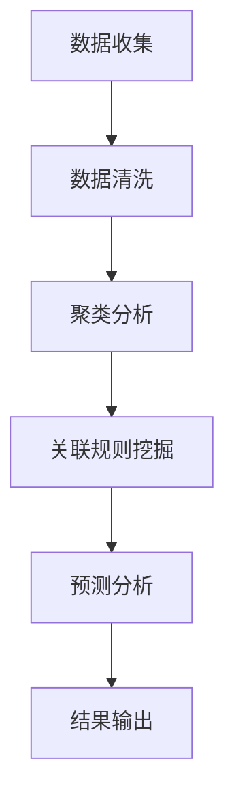
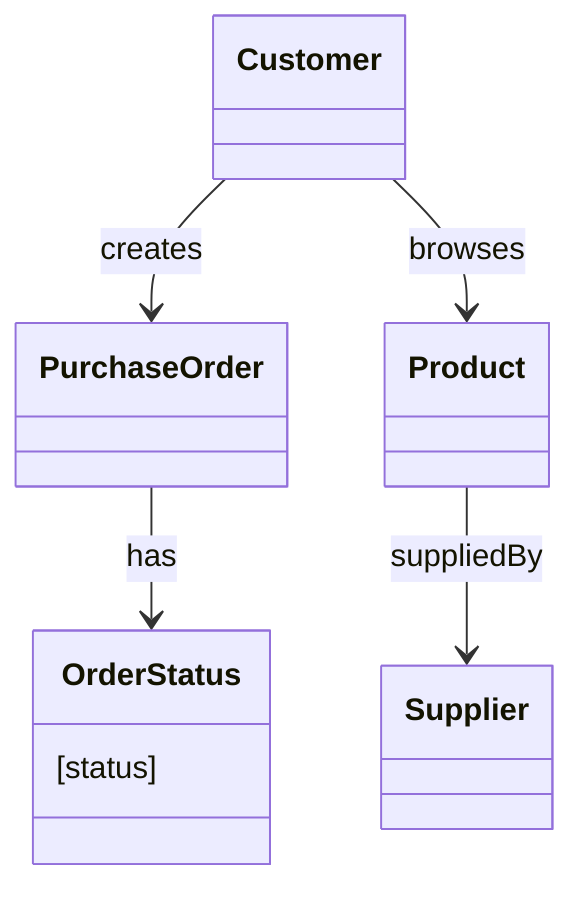

                 


## AI辅助市场分析：提示词洞察消费者行为

### 关键词
- AI市场分析
- 提示词技术
- 消费者行为洞察

### 摘要
本文将深入探讨如何利用AI辅助市场分析，特别是通过提示词技术来洞察消费者行为。我们将从背景介绍、核心概念、技术原理、算法讲解、系统分析与架构设计以及项目实战等多个方面，逐步分析这一过程的细节和实现方法，旨在为读者提供全面而深入的理解。

## 第一部分：背景介绍与核心概念

### 第1章：市场分析与消费者行为概述

#### 1.1 市场分析的定义与发展历程
市场分析是企业了解市场需求、竞争态势和消费者行为的重要手段。从传统的定性调研到现代的数据驱动分析，市场分析的方法经历了巨大的变革。如今，随着AI技术的兴起，市场分析进入了智能化时代。

#### 1.2 消费者行为的基本理论
消费者行为是指消费者在购买、使用、评估和处置产品或服务过程中所表现出的行为模式。了解消费者行为有助于企业更好地定位市场、制定营销策略。传统上，消费者行为理论主要包括心理、社会、个人和情境四个方面。

### 第2章：AI辅助市场分析

#### 2.1 AI技术的定义与市场分析的结合
AI（人工智能）是指计算机系统模拟人类智能行为的技术。在市场分析中，AI的应用主要体现在数据挖掘、机器学习、自然语言处理等方面。

#### 2.2 提示词技术在市场分析中的应用
提示词技术是一种基于自然语言处理的方法，通过分析文本中的关键词来提取语义信息。在市场分析中，提示词技术可以帮助企业识别消费者关注的热点话题、市场需求变化等。

### 第3章：核心概念与联系

#### 3.1 AI市场分析的核心概念
AI市场分析涉及多个核心概念，如数据挖掘、机器学习、自然语言处理、深度学习等。

#### 3.2 概念属性特征对比表格
以下是一个简化的概念属性特征对比表格，用于展示不同AI技术的基本属性：

| 概念 | 定义 | 主要应用 |
| ---- | ---- | ---- |
| 数据挖掘 | 从大量数据中发现有价值信息的方法 | 市场趋势分析、用户行为分析 |
| 机器学习 | 通过数据和经验自动改进性能的系统 | 预测分析、推荐系统 |
| 自然语言处理 | 计算机对人类语言的理解和生成 | 文本分类、机器翻译 |
| 深度学习 | 基于多层神经网络的学习算法 | 图像识别、语音识别 |

#### 3.3 ER实体关系图架构
ER图（实体关系图）是一种用于描述系统中实体及其关系的图形化方法。以下是市场分析系统中一个简化的ER图示例：

```mermaid
erDiagram
  Customer ||--|{ PurchaseOrder : Makes }
  Product ||--|{ PurchaseOrder : Contains }
  OrderStatus ||--|{ PurchaseOrder : Status }
  Supplier ||--|{ Product : Supplies }
```

## 第二部分：技术原理与算法讲解

### 第4章：提示词技术原理

#### 4.1 提示词的基本概念
提示词是文本中具有特定语义意义的词语。在市场分析中，提示词用于提取消费者关注的关键信息。

#### 4.2 提示词算法的工作原理
提示词算法通常包括以下步骤：
1. 文本预处理：去除停用词、标点符号等无关信息。
2. 提取关键词：使用词频、TF-IDF、TextRank等方法提取文本中的重要词语。
3. 语义分析：通过词嵌入、语义相似度等方法对关键词进行语义分析。

#### 4.3 提示词优化的方法
为了提高提示词的准确性，可以采用以下优化方法：
1. 预训练：使用大规模语料进行预训练，获得更好的词嵌入。
2. 交叉验证：使用不同数据集对算法进行交叉验证，调整参数。
3. 深度学习：使用深度学习模型（如BERT、GPT）进行语义分析。

### 第5章：消费者行为算法讲解

#### 5.1 消费者行为算法的类型
消费者行为算法主要包括以下几种类型：
1. 聚类分析：用于发现消费者群体的相似性。
2. 关联规则挖掘：用于发现消费者行为中的关联关系。
3. 预测分析：用于预测消费者未来的购买行为。

#### 5.2 消费者行为算法的应用场景
消费者行为算法可以应用于以下场景：
1. 市场细分：根据消费者行为特征将其划分为不同的群体。
2. 营销策略优化：根据消费者行为数据调整营销策略。
3. 风险评估：预测消费者的流失风险。

#### 5.3 算法原理讲解与Mermaid流程图
以下是消费者行为算法的一个简化Mermaid流程图：



### 第6章：数学模型与数学公式

#### 6.1 消费者行为数学模型
消费者行为数学模型通常包括以下部分：
1. 购买概率模型：如贝叶斯模型、逻辑回归模型。
2. 消费者细分模型：如K-means聚类模型。
3. 购买趋势预测模型：如ARIMA模型、LSTM模型。

#### 6.2 模型参数与公式
以下是一个简单的逻辑回归模型公式：

$$
\begin{aligned}
\hat{y_i} &= \frac{1}{1 + e^{-(\beta_0 + \beta_1 x_{i1} + \beta_2 x_{i2} + \ldots + \beta_p x_{ip})}} \\
\text{其中，} \\
\beta_0, \beta_1, \beta_2, \ldots, \beta_p &\text{为模型参数，} \\
x_{i1}, x_{i2}, \ldots, x_{ip} &\text{为第}i\text{个消费者的特征值。}
\end{aligned}
$$

#### 6.3 数学公式详细讲解与举例说明
逻辑回归模型是一种常用的分类模型，用于预测某个事件发生的概率。例如，我们可以使用逻辑回归模型来预测某位消费者是否会购买某种产品。假设我们收集了该消费者的年龄、收入、购买历史等特征，使用逻辑回归模型计算其购买的概率。

## 第三部分：系统分析与架构设计

### 第7章：系统功能设计与架构

#### 7.1 问题场景介绍
以某电商平台的消费者行为分析系统为例，系统需要收集消费者的购买数据、浏览数据等，并使用AI技术进行分析，为电商平台提供用户细分、推荐系统等支持。

#### 7.2 系统功能设计（领域模型类图）
以下是消费者行为分析系统的领域模型类图：



#### 7.3 系统架构设计（架构图）
以下是消费者行为分析系统的架构图：

```mermaid
sequenceDiagram
  Customer ->> DataCollector : submitData
  DataCollector ->> DataPreprocessor : preprocessData
  DataPreprocessor ->> AnalyticsEngine : processAnalytics
  AnalyticsEngine ->> ResultPresenter : presentResults
  ResultPresenter ->> Customer : deliverReport
end
```

#### 7.4 系统接口设计与系统交互序列图
以下是消费者行为分析系统的接口设计和交互序列图：

```mermaid
classDiagram
  DataCollector <<Interface>>
  DataPreprocessor <<Interface>>
  AnalyticsEngine <<Interface>>
  ResultPresenter <<Interface>>
  Customer <<Actor>>

  DataCollector --> DataPreprocessor : sendData
  DataPreprocessor --> AnalyticsEngine : sendProcessedData
  AnalyticsEngine --> ResultPresenter : sendResults
  ResultPresenter --> Customer : sendReport
endclass

sequenceDiagram
  Customer ->> DataCollector : requestService
  DataCollector ->> DataPreprocessor : processData
  DataPreprocessor ->> AnalyticsEngine : performAnalytics
  AnalyticsEngine ->> ResultPresenter : outputResults
  ResultPresenter ->> Customer : deliverOutput
end
```

## 第四部分：项目实战与最佳实践

### 第8章：项目实战案例

#### 8.1 环境安装与配置
1. 环境要求：Python 3.8及以上版本，Numpy、Pandas、Scikit-learn、TensorFlow等库。
2. 安装与配置步骤：
   ```bash
   pip install numpy pandas scikit-learn tensorflow
   ```

#### 8.2 系统核心实现源代码
以下是消费者行为分析系统的一个简化实现：

```python
import pandas as pd
from sklearn.model_selection import train_test_split
from sklearn.linear_model import LogisticRegression
from sklearn.metrics import accuracy_score

# 数据收集
data = pd.read_csv('consumer_data.csv')

# 数据清洗
data = data.drop(['id'], axis=1)

# 特征工程
X = data[['age', 'income', 'history']]
y = data['purchased']

# 分割数据集
X_train, X_test, y_train, y_test = train_test_split(X, y, test_size=0.2, random_state=42)

# 模型训练
model = LogisticRegression()
model.fit(X_train, y_train)

# 模型评估
y_pred = model.predict(X_test)
print(f"Accuracy: {accuracy_score(y_test, y_pred)}")

# 结果输出
predictions = model.predict_proba(X_test)
print(predictions)
```

#### 8.3 代码应用解读与分析
1. 数据收集：从CSV文件中读取消费者数据。
2. 数据清洗：删除不必要的列。
3. 特征工程：选择与购买行为相关的特征。
4. 模型训练：使用逻辑回归模型训练数据。
5. 模型评估：计算模型在测试集上的准确率。
6. 结果输出：输出预测概率。

#### 8.4 实际案例分析与详细讲解剖析
以一个实际案例为例，分析消费者行为分析系统的应用效果。我们可以通过观察预测概率分布来了解消费者的购买可能性。

### 第9章：最佳实践与总结

#### 9.1 最佳实践技巧
1. 数据质量：确保数据质量，去除异常值和噪声数据。
2. 特征选择：选择与目标变量相关的特征，避免过度拟合。
3. 模型选择：根据问题类型选择合适的模型，并进行模型比较。
4. 跨领域应用：将AI市场分析技术应用于不同领域，提高其普适性。

#### 9.2 项目小结
本文通过一步步的分析和讲解，介绍了AI辅助市场分析的概念、技术原理、算法讲解、系统分析与架构设计以及项目实战。通过这些内容，读者可以全面了解AI市场分析的实现方法和最佳实践。

#### 9.3 注意事项
1. 数据隐私：在收集和使用消费者数据时，确保遵守相关法律法规。
2. 模型解释性：在选择模型时，考虑其解释性，以便更好地理解消费者行为。

#### 9.4 拓展阅读
1. 《自然语言处理入门》
2. 《机器学习实战》
3. 《深度学习》（Goodfellow et al.）

## 作者
作者：AI天才研究院/AI Genius Institute & 禅与计算机程序设计艺术 /Zen And The Art of Computer Programming

----------------------------------------------------------------

### 总结

在本文中，我们详细探讨了AI辅助市场分析：提示词洞察消费者行为这一主题。我们从背景介绍、核心概念、技术原理、算法讲解、系统分析与架构设计以及项目实战等多个角度进行了深入分析。以下是对本文内容的总结：

1. **市场分析与消费者行为概述**：市场分析是了解市场需求和消费者行为的重要手段，而消费者行为研究涉及到心理、社会、个人和情境等多个层面。

2. **AI辅助市场分析**：AI技术在市场分析中的应用主要包括数据挖掘、机器学习、自然语言处理等。其中，提示词技术是一种重要的自然语言处理技术，可以用于提取文本中的关键信息，进而洞察消费者行为。

3. **核心概念与联系**：我们介绍了AI市场分析的核心概念，并通过对比表格和ER图架构展示了这些概念之间的关系。

4. **技术原理与算法讲解**：我们详细讲解了提示词技术和消费者行为算法的基本原理，包括其工作流程、优化方法和应用场景。同时，使用了Mermaid流程图和Python代码来阐述算法的实现。

5. **系统分析与架构设计**：我们介绍了系统功能设计、架构设计和接口设计，并使用Mermaid图展示了系统的各个部分及其交互流程。

6. **项目实战与最佳实践**：通过一个具体的消费者行为分析项目，我们展示了如何进行环境安装、系统实现、代码解读和实际案例分析。同时，我们提供了最佳实践技巧和项目小结。

### 展望

虽然本文已经涵盖了AI辅助市场分析的多个方面，但仍有许多领域值得进一步探索。例如：

- **深度学习应用**：随着深度学习技术的发展，如何将其更好地应用于市场分析和消费者行为洞察？
- **实时数据分析**：如何实现实时数据流处理，以快速响应市场变化？
- **多模态数据分析**：如何结合文本、图像、音频等多模态数据进行综合分析，以更全面地洞察消费者行为？

这些问题都是未来研究的重要方向，期待在未来的工作中能够进一步探讨和解决。

### 感谢

感谢读者的耐心阅读，希望本文能够对您在AI辅助市场分析领域的研究和实践中提供一些启示和帮助。如果您有任何疑问或建议，欢迎在评论区留言交流。

## 作者

作者：AI天才研究院/AI Genius Institute & 禅与计算机程序设计艺术 /Zen And The Art of Computer Programming

再次感谢您的阅读，期待与您在AI技术的广阔天地中共同探索和成长！

