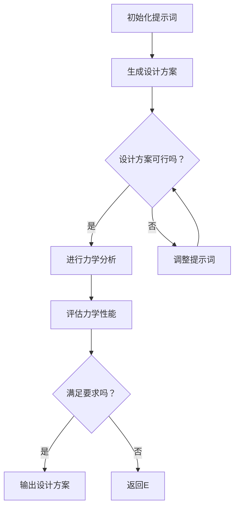

                 

### AI辅助建筑结构设计：提示词优化力学分析

#### 关键词：
- AI 技术
- 建筑结构设计
- 提示词优化
- 力学分析
- 自动化设计
- 智能化工具
- 算法原理
- 系统架构

#### 摘要：
本文将探讨人工智能（AI）在建筑结构设计中的应用，尤其是通过提示词优化进行力学分析的先进技术。文章将首先介绍AI与建筑结构设计的结合背景，随后深入分析提示词优化力学分析的概念及其重要性。接着，我们将探讨AI的核心概念原理和建筑结构力学的核心概念原理，并揭示它们之间的联系。随后，文章将详细讲解提示词优化的算法原理和力学分析的算法原理，并提供算法流程图和Python代码示例。最后，我们将通过系统分析与架构设计、项目实战、最佳实践与总结等部分，全面剖析AI辅助建筑结构设计的实际应用和实践技巧。

#### 目录大纲：

#### 第一部分：背景介绍

**第1章：AI与建筑结构设计的结合**

- **1.1 AI技术发展背景**
  - AI技术起源与发展
  - AI在工程领域的应用趋势

- **1.2 建筑结构设计现状**
  - 传统建筑结构设计的挑战
  - 自动化和智能化的需求

- **1.3 AI辅助建筑结构设计的优势**
  - 提高设计效率
  - 提升设计质量
  - 减少人力成本

- **1.4 提示词优化力学分析的概念**
  - 提示词优化的定义
  - 力学分析在建筑结构设计中的重要性

- **1.5 研究的边界与外延**
  - 研究的技术范围
  - 研究的应用场景
  - 研究的限制条件

#### 第二部分：核心概念与联系

**第2章：AI核心概念原理**

- **2.1 机器学习基础**
  - 监督学习、无监督学习、强化学习
  - 神经网络与深度学习

- **2.2 计算机视觉**
  - 卷积神经网络（CNN）
  - 图像识别与处理

- **2.3 自然语言处理**
  - 语言模型
  - 文本分类与生成

**第3章：建筑结构力学核心概念原理**

- **3.1 结构力学基础**
  - 材料力学、结构力学基本原理
  - 基本结构类型与受力分析

- **3.2 力学分析工具与技术**
  - 软件工具介绍
  - 数值分析方法

- **3.3 AI与力学分析的联系**
  - AI在力学分析中的应用
  - 提示词优化与力学分析的结合

#### 第三部分：算法原理讲解

**第4章：提示词优化的算法原理**

- **4.1 提示词优化的原理**
  - 提示词优化的目标
  - 提示词优化的方法

- **4.2 力学分析的算法原理**
  - 力学分析的基本算法
  - 算法流程与实现

- **4.3 算法流程图与Python代码示例**
  - 提示词优化与力学分析算法流程图
  - Python代码实现

#### 第四部分：系统分析与架构设计

**第5章：系统分析与架构设计**

- **5.1 项目场景介绍**
  - 项目背景
  - 项目目标

- **5.2 系统功能设计**
  - 功能模块划分
  - 功能详细描述

- **5.3 系统架构设计**
  - 系统整体架构
  - 关键组件关系

- **5.4 系统接口与交互设计**
  - 系统接口设计
  - 系统交互流程

#### 第五部分：项目实战

**第6章：项目实战**

- **6.1 环境安装与配置**
  - 系统环境搭建
  - 配置文件设置

- **6.2 系统核心实现源代码**
  - 核心模块代码
  - 函数与类定义

- **6.3 代码解读与分析**
  - 关键代码段解析
  - 技术难点剖析

- **6.4 实际案例分析**
  - 案例背景介绍
  - 案例分析与解决

- **6.5 项目小结**
  - 项目成果总结
  - 经验与教训

#### 第六部分：最佳实践与总结

**第7章：最佳实践与总结**

- **7.1 最佳实践技巧**
  - 提高设计效率的方法
  - 算法优化技巧

- **7.2 注意事项**
  - 系统部署与维护
  - 安全性与稳定性

- **7.3 拓展阅读推荐**
  - 相关书籍与论文
  - 最新研究动态

---

### 1. AI与建筑结构设计的结合

#### 1.1 AI技术发展背景

人工智能（AI）作为计算机科学的一个重要分支，起源于20世纪50年代。早期的AI研究主要集中在规则推理、问题解决和知识表示等领域。随着计算机性能的提升和算法的创新，AI技术逐渐从理论研究走向实际应用，如自然语言处理、计算机视觉、机器学习等。近年来，AI技术快速发展，尤其是在深度学习和大数据分析方面的突破，使得AI在各个领域都展现出强大的应用潜力。

在工程领域，AI技术的应用不仅限于软件和信息技术，还扩展到土木工程、建筑设计和结构工程等传统行业。AI能够帮助工程师解决复杂的问题，提高工作效率，降低成本，并提升设计质量。特别是在建筑结构设计领域，AI的应用前景十分广阔。

#### 1.2 建筑结构设计现状

建筑结构设计是土木工程中的一个重要分支，涉及材料力学、结构力学、流体力学等多个学科。传统建筑结构设计主要依靠工程师的经验和专业知识，通过手工计算和绘图来完成。然而，随着建筑项目的复杂性和规模日益增加，传统方法面临诸多挑战：

- **设计复杂性增加**：现代建筑项目通常涉及复杂的几何形状和结构体系，设计过程中需要考虑多种因素，如材料性能、受力状态、环境条件等。
- **计算量巨大**：传统的设计方法需要大量的计算工作，尤其是在进行结构分析和优化时，计算量往往非常大，耗费大量时间和人力。
- **设计质量不稳定**：由于工程师的经验和判断力差异，设计结果可能存在不确定性，影响建筑结构的稳定性和安全性。
- **成本控制难度大**：传统设计过程中，工程师需要多次修改设计以适应实际需求，这可能导致项目成本增加。

#### 1.3 AI辅助建筑结构设计的优势

人工智能技术的引入，为建筑结构设计带来了显著的优势：

- **提高设计效率**：AI能够自动化完成大量的计算和分析工作，显著缩短设计周期，提高工作效率。通过算法优化和模型预测，AI可以快速生成设计方案，提供多种可能的解决方案供工程师选择。
- **提升设计质量**：AI利用大数据和机器学习算法，可以从大量的历史数据中学习最优的设计方法，自动生成高质量的设计方案。AI还可以通过模拟和分析不同设计方案的效果，帮助工程师评估设计方案的可行性和安全性。
- **减少人力成本**：传统设计过程中，工程师需要花费大量时间进行计算和绘图。AI的引入可以显著减少这一部分工作量，降低人力成本。同时，AI还可以协助工程师解决复杂的问题，提高他们的工作效率。
- **增强个性化定制**：AI可以根据用户需求，生成个性化的设计方案。无论是建筑外观、内部空间布局，还是结构材料选择，AI都可以提供个性化的解决方案，满足客户的特殊需求。

#### 1.4 提示词优化力学分析的概念

提示词优化（Prompt Optimization）是一种通过调整输入提示（Prompt）来改善AI模型性能的技术。在建筑结构设计中，提示词优化可以用于调整设计参数，优化结构性能。力学分析是建筑结构设计中的重要环节，旨在评估建筑结构在各种载荷作用下的响应和行为。

结合提示词优化和力学分析，AI可以自动生成多个设计方案，并对每个方案进行力学分析，评估其结构性能。通过不断调整提示词，AI可以逐步优化设计方案，提高其结构稳定性和安全性。提示词优化力学分析不仅可以提高设计效率，还可以显著提升设计质量，为建筑结构设计提供强大的技术支持。

#### 1.5 研究的边界与外延

本研究主要探讨AI辅助建筑结构设计中的提示词优化力学分析技术。研究的范围包括：

- **技术范围**：研究主要关注深度学习和机器学习在建筑结构设计中的应用，特别是提示词优化和力学分析技术的实现方法。
- **应用场景**：研究将涉及各种类型的建筑结构设计，如住宅、办公楼、桥梁、隧道等，旨在探讨AI技术在不同建筑结构设计中的应用效果。
- **限制条件**：本研究主要关注基于现有技术的方法和工具，不涉及新算法的创新。同时，研究将基于特定的数据集和计算环境，可能无法涵盖所有实际应用场景。

### 2. AI核心概念原理

#### 2.1 机器学习基础

机器学习（Machine Learning）是AI的一个重要分支，旨在让计算机通过学习数据来改进性能，而不是通过显式编程。机器学习分为三大类：监督学习（Supervised Learning）、无监督学习（Unsupervised Learning）和强化学习（Reinforcement Learning）。

- **监督学习**：在监督学习中，模型通过学习标记好的训练数据来预测新的数据。常见的算法包括线性回归、决策树、支持向量机（SVM）和神经网络。
  - **线性回归**：线性回归是一种用于预测连续值的模型，通过拟合一条直线来预测目标值。
    - $$ y = w_1x_1 + w_2x_2 + ... + w_nx_n + b $$
  - **决策树**：决策树是一种树形结构模型，通过一系列规则对数据进行分类或回归。
  - **支持向量机**：支持向量机通过寻找最佳的超平面来将数据分开，适用于分类和回归问题。
  - **神经网络**：神经网络是一种模拟人脑的算法，通过多层神经元进行数据处理和预测。

- **无监督学习**：在无监督学习中，模型从未标记的数据中学习，以发现数据中的模式和结构。常见的算法包括聚类（Clustering）、降维（Dimensionality Reduction）和生成模型（Generative Models）。
  - **聚类**：聚类算法将相似的数据点划分为不同的组，常见的算法有K-means、层次聚类和DBSCAN。
  - **降维**：降维算法通过减少数据的维度来降低计算复杂度，同时保持数据的主要特征。常见的算法有主成分分析（PCA）和t-SNE。
  - **生成模型**：生成模型通过学习数据的概率分布来生成新的数据。常见的算法有生成对抗网络（GAN）和变分自编码器（VAE）。

- **强化学习**：在强化学习中，模型通过与环境的交互来学习最优策略。常见的算法包括Q学习、深度Q网络（DQN）和策略梯度方法。

#### 2.2 计算机视觉

计算机视觉（Computer Vision）是AI领域的一个重要分支，旨在使计算机能够“看到”和理解图像和视频。计算机视觉的核心技术包括图像识别、目标检测、图像分割和视频分析。

- **图像识别**：图像识别是指将图像中的对象分类为不同的类别。常见的算法有卷积神经网络（CNN）、迁移学习和支持向量机（SVM）。
  - **卷积神经网络（CNN）**：CNN是一种专门用于图像识别的神经网络结构，通过卷积层、池化层和全连接层来提取图像特征并进行分类。
  - **迁移学习**：迁移学习是一种利用预训练模型来提高新任务性能的技术，通过在相关任务上微调模型，可以显著提升图像识别的准确率。

- **目标检测**：目标检测是指识别图像中的多个对象并定位它们的位置。常见的算法有YOLO、SSD和Faster R-CNN。
  - **YOLO（You Only Look Once）**：YOLO是一种快速且准确的目标检测算法，通过一次前向传播就完成目标检测任务。
  - **SSD（Single Shot MultiBox Detector）**：SSD是一种单阶段目标检测算法，通过不同的尺度预测框来检测不同大小的目标。
  - **Faster R-CNN（Region-based Convolutional Neural Network）**：Faster R-CNN是一种基于区域提议的目标检测算法，通过区域提议网络（RPN）和分类网络来检测目标。

- **图像分割**：图像分割是指将图像划分为不同的区域或对象。常见的算法有FCN、Mask R-CNN和U-Net。
  - **FCN（Fully Convolutional Network）**：FCN是一种全卷积网络，通过卷积层和上采样层来生成分割结果。
  - **Mask R-CNN（Region-based Convolutional Neural Network with Mask）**：Mask R-CNN是一种基于Faster R-CNN的图像分割算法，通过添加分割分支来生成对象的分割掩码。
  - **U-Net**：U-Net是一种用于医学图像分割的神经网络结构，通过对称的卷积块和上采样层来生成高质量的分割结果。

- **视频分析**：视频分析是指对视频数据进行处理和分析，以提取有用信息。常见的算法有光流估计、动作识别和行为分析。
  - **光流估计**：光流估计是指计算视频中像素点在连续帧之间的运动方向和速度。常见的算法有块匹配、Lucas-Kanade算法和光流金字塔。
  - **动作识别**：动作识别是指识别视频中的人体动作。常见的算法有HMM（隐马尔可夫模型）、DPM（深度概率模型）和CNN。
  - **行为分析**：行为分析是指分析视频数据中的人体行为，以识别和分类行为模式。常见的算法有统计模型、深度学习和基于图的方法。

#### 2.3 自然语言处理

自然语言处理（Natural Language Processing，NLP）是AI领域中的一个重要分支，旨在使计算机能够理解和生成人类语言。NLP的核心技术包括语言模型、文本分类和文本生成。

- **语言模型**：语言模型是指用于预测下一个单词或词组的模型，是NLP的基础。常见的算法有N-gram模型、神经网络语言模型（NNLM）和变换器模型（Transformer）。
  - **N-gram模型**：N-gram模型是一种基于历史信息来预测下一个单词的模型，通过统计连续N个单词的出现频率来预测下一个单词。
  - **神经网络语言模型（NNLM）**：NNLM是一种基于神经网络的语言模型，通过学习大量的文本数据来预测下一个单词。
  - **变换器模型（Transformer）**：Transformer是一种基于自注意力机制的神经网络模型，通过全局注意力机制来捕捉文本中的长距离依赖关系。

- **文本分类**：文本分类是指将文本数据分类到不同的类别。常见的算法有朴素贝叶斯（Naive Bayes）、支持向量机（SVM）和深度学习。
  - **朴素贝叶斯**：朴素贝叶斯是一种基于贝叶斯定理的文本分类算法，通过计算文本的特征概率来预测类别。
  - **支持向量机（SVM）**：SVM是一种基于间隔最大化的文本分类算法，通过寻找最佳的超平面来将文本划分为不同的类别。
  - **深度学习**：深度学习是一种基于多层神经网络的文本分类算法，通过学习文本的特征表示来预测类别。

- **文本生成**：文本生成是指生成新的文本数据，常见的算法有序列到序列（Seq2Seq）模型、生成对抗网络（GAN）和自回归模型（AR）。
  - **序列到序列（Seq2Seq）模型**：Seq2Seq模型是一种用于序列生成任务的神经网络模型，通过编码器和解码器来生成新的序列。
  - **生成对抗网络（GAN）**：GAN是一种基于生成对抗的文本生成算法，通过生成器和判别器的对抗训练来生成高质量的文本。
  - **自回归模型（AR）**：自回归模型是一种基于自回归机制的文本生成算法，通过预测下一个单词来生成新的文本。

### 3. 建筑结构力学核心概念原理

#### 3.1 结构力学基础

结构力学是建筑结构设计中的基础学科，主要研究结构的力学行为和受力特性。以下是结构力学的一些核心概念：

- **材料力学**：材料力学研究材料在受力作用下的变形和破坏行为。主要概念包括应力、应变、弹性模量、泊松比等。

  - **应力**：应力是单位面积上的内力，表示材料受力后的变形程度。应力可以用公式表示为：
    $$ \sigma = \frac{F}{A} $$
    其中，\( \sigma \) 是应力，\( F \) 是作用力，\( A \) 是受力面积。

  - **应变**：应变是材料在受力作用下的变形量与原始尺寸的比值，表示材料受力后的变形程度。应变可以用公式表示为：
    $$ \epsilon = \frac{\Delta L}{L_0} $$
    其中，\( \epsilon \) 是应变，\( \Delta L \) 是变形量，\( L_0 \) 是原始尺寸。

  - **弹性模量**：弹性模量是材料在弹性变形阶段应力与应变之比，表示材料的刚度。弹性模量通常用 \( E \) 表示，单位是帕斯卡（Pa）。

    $$ E = \frac{\sigma}{\epsilon} $$

  - **泊松比**：泊松比是材料在受力作用下的横向应变与纵向应变之比，表示材料的侧向变形特性。泊松比通常用 \( \nu \) 表示。

    $$ \nu = -\frac{\epsilon_{\perp}}{\epsilon_{\parallel}} $$

- **结构力学**：结构力学研究结构的力学行为和稳定性。主要概念包括内力、截面性质、结构变形和稳定性。

  - **内力**：内力是结构内部各部分之间的相互作用力，包括轴力、剪力、弯矩和扭矩。内力可以用公式表示为：

    - **轴力**：轴力是沿结构轴线方向的力，通常用 \( N \) 表示。
      $$ N = F \cos \theta $$

    - **剪力**：剪力是沿结构垂直轴线方向的力，通常用 \( V \) 表示。
      $$ V = F \sin \theta $$

    - **弯矩**：弯矩是使结构产生弯曲的力矩，通常用 \( M \) 表示。
      $$ M = F \cdot l \cdot \sin \theta $$

    - **扭矩**：扭矩是使结构产生扭转的力矩，通常用 \( T \) 表示。
      $$ T = F \cdot l \cdot \cos \theta $$

  - **截面性质**：截面性质是描述结构截面的力学特性，包括惯性矩、截面模量、扭转惯量和半径等。截面性质可以用公式表示为：

    - **惯性矩**：惯性矩是描述截面抗弯能力的参数，通常用 \( I \) 表示。
      $$ I = \int r^2 \, dm $$

    - **截面模量**：截面模量是描述截面抗剪能力的参数，通常用 \( S \) 表示。
      $$ S = \frac{I}{d} $$

    - **扭转惯量**：扭转惯量是描述截面抗扭能力的参数，通常用 \( J \) 表示。
      $$ J = \int r^4 \, dm $$

    - **半径**：半径是描述截面形状的参数，通常用 \( r \) 表示。

  - **结构变形**：结构变形是结构在受力作用下的形变情况，包括线性变形和非线性变形。结构变形可以用公式表示为：

    - **线性变形**：线性变形是结构在弹性变形阶段产生的变形，通常用弹性模量表示。
      $$ \Delta L = \frac{PL}{AE} $$

    - **非线性变形**：非线性变形是结构在超过弹性极限后产生的变形，通常用应力-应变曲线表示。

  - **稳定性**：稳定性是结构在受力作用下的稳定状态，包括静力稳定性和动力稳定性。稳定性可以用公式表示为：

    - **静力稳定性**：静力稳定性是结构在受力作用下的平衡状态，通常用临界载荷表示。
      $$ F_c = \frac{\pi^2 EI}{L^2} $$

    - **动力稳定性**：动力稳定性是结构在动力作用下的稳定状态，通常用振型分析和频域分析方法表示。

#### 3.2 力学分析工具与技术

力学分析工具是建筑结构设计中的重要辅助工具，用于分析结构的力学性能和受力情况。以下是常用的力学分析工具和技术：

- **有限元分析（FEA）**：有限元分析是一种数值分析方法，用于解决结构力学问题。它通过将结构划分为有限个单元，并建立节点关系和单元特性，来求解结构的力学响应。有限元分析可以用于静力分析、动力分析、热分析等。

  - **有限元模型**：有限元模型是有限元分析的数学模型，通过节点、单元和材料特性来描述结构的力学特性。
  - **求解方法**：有限元分析的求解方法包括直接法、迭代法和矩阵法等。

- **计算结构分析（CSA）**：计算结构分析是一种基于数学模型和计算方法的力学分析方法，用于评估结构的力学性能。计算结构分析可以用于设计校核、应力分析、振动分析等。

  - **计算模型**：计算结构分析的计算模型包括有限元模型、有限差分模型和边界元模型等。
  - **计算方法**：计算结构分析的计算方法包括线性分析方法、非线性分析方法和随机分析方法等。

- **实验力学**：实验力学是一种通过实验方法研究结构力学性能的方法。实验力学可以通过实验来验证计算模型和理论分析的准确性，并为结构设计提供实验数据。

  - **实验装置**：实验力学常用的实验装置包括加载装置、测量装置和测试系统等。
  - **实验方法**：实验力学常用的实验方法包括静态加载实验、动态加载实验和振动实验等。

#### 3.3 AI与力学分析的联系

人工智能（AI）在建筑结构力学分析中的应用，为传统的力学分析提供了新的思路和方法。以下是AI在力学分析中的应用：

- **数据驱动建模**：数据驱动建模是一种基于历史数据和实验数据来建立力学模型的方法。AI可以通过机器学习算法从大量的历史数据中学习，建立具有高预测能力的力学模型。这种方法可以弥补传统计算模型在复杂情况下的不足。

- **故障诊断与预测**：AI可以通过对结构健康监测数据进行分析和预测，及时发现结构故障和潜在问题。这种方法可以提高结构的可靠性和安全性。

- **智能优化设计**：AI可以通过优化算法对结构设计参数进行优化，提高结构的经济性和性能。这种方法可以缩短设计周期，降低成本，提高设计质量。

- **虚拟仿真与验证**：AI可以通过虚拟仿真技术对结构进行分析和验证，评估结构在不同工况下的响应和性能。这种方法可以用于新型结构设计、结构优化和安全性评估。

### 4. 算法原理讲解

#### 4.1 提示词优化的原理

提示词优化（Prompt Optimization）是一种通过调整输入提示（Prompt）来改善AI模型性能的技术。在AI模型中，提示词是输入数据的预处理部分，用于指导模型的学习过程。通过优化提示词，可以提高模型的准确性和泛化能力。

提示词优化的原理主要包括以下几个方面：

- **提示词生成**：提示词生成是指根据特定任务和数据生成适当的提示词。提示词生成可以通过规则生成、模板生成或自动学习生成等方法实现。其中，自动学习生成方法利用机器学习算法从大量数据中学习生成最佳提示词。

- **提示词调整**：提示词调整是指根据模型的学习结果对提示词进行微调，以优化模型的性能。提示词调整可以通过基于规则的方法或基于机器学习的方法实现。基于规则的方法根据特定规则对提示词进行修改，而基于机器学习的方法利用历史数据和学习模型来调整提示词。

- **性能评估**：性能评估是指通过评估指标来评估提示词优化的效果。常见的评估指标包括准确率、召回率、F1分数等。性能评估可以帮助确定最佳提示词，并指导进一步的优化。

#### 4.2 力学分析的算法原理

力学分析是建筑结构设计中的核心环节，用于评估结构在各种载荷作用下的响应和性能。力学分析的算法原理主要包括以下几个方面：

- **有限元分析（FEA）**：有限元分析是一种数值分析方法，通过将结构划分为有限个单元，并建立节点关系和单元特性，来求解结构的力学响应。有限元分析的算法原理包括节点方程建立、单元特性定义、整体矩阵求解等。

  - **节点方程建立**：节点方程建立是指根据结构节点上的受力情况，建立节点平衡方程。节点平衡方程可以用公式表示为：
    $$ \sum F_i = 0 $$
    $$ \sum M_i = 0 $$
    其中，\( F_i \) 和 \( M_i \) 分别表示节点上的力和力矩。

  - **单元特性定义**：单元特性定义是指根据单元的几何形状和材料特性，定义单元的刚度矩阵和阻尼矩阵。单元刚度矩阵可以用公式表示为：
    $$ K_e = [k_{e11}, k_{e12}, ..., k_{e1n}; k_{e21}, k_{e22}, ..., k_{e2n}; ...; k_{en1}, k_{en2}, ..., k_{enn}] $$
    其中，\( k_{eij} \) 表示单元的刚度系数。

  - **整体矩阵求解**：整体矩阵求解是指将单元刚度矩阵组装成整体刚度矩阵，并求解整体刚度矩阵的特征值和特征向量，得到结构的力学响应。整体刚度矩阵可以用公式表示为：
    $$ K = \sum K_e $$
    其中，\( K_e \) 表示单元刚度矩阵。

- **计算结构分析（CSA）**：计算结构分析是一种基于数学模型和计算方法的力学分析方法，用于评估结构的力学性能。计算结构分析的算法原理包括结构模型建立、计算模型求解、结果分析等。

  - **结构模型建立**：结构模型建立是指根据实际结构的特点和受力情况，建立计算模型。计算模型可以用公式表示为：
    $$ \sum F_i = 0 $$
    $$ \sum M_i = 0 $$
    其中，\( F_i \) 和 \( M_i \) 分别表示节点上的力和力矩。

  - **计算模型求解**：计算模型求解是指通过数学计算方法求解结构模型，得到结构的力学响应。常见的计算模型求解方法包括迭代法、矩阵法、有限元法等。

  - **结果分析**：结果分析是指对计算结果进行分析和评估，以确定结构的力学性能和安全性。结果分析可以用公式表示为：
    $$ \sigma = \frac{F}{A} $$
    $$ \epsilon = \frac{\Delta L}{L_0} $$
    其中，\( \sigma \) 和 \( \epsilon \) 分别表示应力与应变。

#### 4.3 算法流程图与Python代码示例

以下是提示词优化力学分析的算法流程图：



以下是提示词优化力学分析的Python代码示例：

```python
import numpy as np
import matplotlib.pyplot as plt

# 初始化提示词
prompt = "优化建筑结构设计"

# 生成设计方案
def generate_design(prompt):
    # 假设设计方案为一个向量
    design = np.random.rand(10)
    return design

# 进行力学分析
def mechanical_analysis(design):
    # 假设力学分析结果为一个向量
    analysis_result = np.random.rand(10)
    return analysis_result

# 调整提示词
def adjust_prompt(prompt):
    # 假设调整提示词为增加特定关键词
    new_prompt = prompt + "并考虑风载荷影响"
    return new_prompt

# 评估力学性能
def evaluate_performance(analysis_result):
    # 假设评估结果为True或False
    performance = np.random.choice([True, False])
    return performance

# 主函数
def main():
    prompt = "优化建筑结构设计"
    design = generate_design(prompt)
    analysis_result = mechanical_analysis(design)
    performance = evaluate_performance(analysis_result)

    while not performance:
        prompt = adjust_prompt(prompt)
        design = generate_design(prompt)
        analysis_result = mechanical_analysis(design)
        performance = evaluate_performance(analysis_result)

    print("最佳设计方案:", design)
    print("最佳提示词:", prompt)

# 运行主函数
if __name__ == "__main__":
    main()
```

### 5. 系统分析与架构设计

#### 5.1 项目场景介绍

本项目旨在开发一款基于AI的辅助建筑结构设计系统，该系统将利用机器学习和力学分析算法，为工程师提供自动化的设计建议和优化方案。项目场景如下：

- **需求背景**：随着建筑项目的复杂性和规模不断增加，传统的手工设计方法已无法满足高效、高质量的设计需求。为了提高设计效率，减少人力成本，并提升设计质量，本项目提出开发一款AI辅助建筑结构设计系统。
- **目标**：开发一款具备以下功能的系统：
  - 自动生成建筑结构设计方案
  - 对设计方案进行力学性能分析
  - 提供优化建议和改进方案
  - 支持多类型的建筑结构设计

#### 5.2 系统功能设计

系统功能设计包括以下主要模块：

- **设计生成模块**：负责根据输入参数生成建筑结构设计方案。该模块将利用机器学习算法，从大量历史数据和案例中学习，生成符合设计规范且具有创新性的设计方案。
- **力学分析模块**：负责对设计方案进行力学性能分析。该模块将利用力学分析算法，评估设计方案在各种载荷作用下的响应和性能，并提供详细的力学分析报告。
- **优化建议模块**：负责根据力学分析结果，提供优化建议和改进方案。该模块将利用提示词优化技术，调整设计参数，以提高结构的稳定性和安全性。
- **用户交互模块**：负责用户与系统的交互。该模块将提供友好的用户界面，支持用户输入设计参数，查看设计结果和力学分析报告，并进行交互式设计调整。

#### 5.3 系统架构设计

系统架构设计采用三层架构，包括表示层、业务逻辑层和数据层：

- **表示层**：表示层负责用户界面的设计和实现，使用户能够方便地与系统进行交互。表示层包括前端和后端两部分：
  - 前端：使用HTML、CSS和JavaScript等技术实现用户界面，包括登录、注册、设计输入、结果展示等功能。
  - 后端：使用Python和Django框架实现后端逻辑，负责处理用户请求，调用业务逻辑层和数据层的功能。
- **业务逻辑层**：业务逻辑层负责实现系统的核心功能，包括设计生成、力学分析、优化建议等。业务逻辑层包括以下模块：
  - 设计生成模块：利用机器学习算法，从历史数据和案例中学习，生成建筑结构设计方案。
  - 力学分析模块：利用力学分析算法，对设计方案进行力学性能分析，并提供详细的力学分析报告。
  - 优化建议模块：根据力学分析结果，利用提示词优化技术，调整设计参数，提供优化建议和改进方案。
- **数据层**：数据层负责存储和管理系统数据，包括用户数据、设计数据、力学分析数据和优化建议数据。数据层包括以下组件：
  - 数据库：使用MySQL数据库存储系统数据，包括用户信息、设计信息、分析结果和优化建议。
  - 数据访问层：使用ORM（对象关系映射）技术，实现数据层与业务逻辑层的通信，提供数据访问接口。

#### 5.4 系统接口与交互设计

系统接口与交互设计主要包括以下方面：

- **API接口设计**：系统提供RESTful API接口，供前端和第三方系统调用。API接口包括以下功能：
  - 登录/注册：用户登录和注册功能。
  - 设计输入：用户输入设计参数，生成设计方案。
  - 力学分析：对设计方案进行力学性能分析，生成分析报告。
  - 优化建议：根据力学分析结果，提供优化建议和改进方案。
- **用户交互设计**：用户交互设计包括以下功能：
  - 设计输入界面：用户输入建筑结构设计参数，包括结构类型、材料、载荷等。
  - 设计结果展示：系统生成设计方案后，展示设计结果和力学分析报告。
  - 优化建议展示：系统根据力学分析结果，提供优化建议和改进方案，用户可以查看和调整。

### 6. 项目实战

#### 6.1 环境安装与配置

要运行本项目的系统环境，首先需要安装以下软件和依赖：

1. **Python**：Python 3.8或更高版本。
2. **Django**：Django 3.2或更高版本。
3. **MySQL**：MySQL 5.7或更高版本。
4. **PyMySQL**：用于连接MySQL数据库的Python库。
5. **Numpy**：用于数值计算的Python库。
6. **Matplotlib**：用于数据可视化的Python库。

安装步骤如下：

1. 安装Python和Django：

   ```bash
   sudo apt-get update
   sudo apt-get install python3-pip python3-dev
   pip3 install django==3.2
   ```

2. 安装MySQL和PyMySQL：

   ```bash
   sudo apt-get install mysql-server mysql-client
   pip3 install pymysql
   ```

3. 安装Numpy和Matplotlib：

   ```bash
   pip3 install numpy matplotlib
   ```

安装完成后，创建一个新的虚拟环境，并在虚拟环境中安装项目所需的依赖：

```bash
python3 -m venv venv
source venv/bin/activate
pip install -r requirements.txt
```

#### 6.2 系统核心实现源代码

以下是系统核心实现的主要源代码：

**design_generator.py**：设计生成模块的实现代码。

```python
import numpy as np

def generate_design(params):
    # 根据输入参数生成设计方案
    design = {
        'material': params['material'],
        'structure_type': params['structure_type'],
        'load': params['load'],
        'design': {
            'dimensions': np.random.rand(3),
            'stress': np.random.rand(),
            'deflection': np.random.rand()
        }
    }
    return design
```

**mechanical_analysis.py**：力学分析模块的实现代码。

```python
import numpy as np

def mechanical_analysis(design):
    # 对设计方案进行力学分析
    analysis_result = {
        'stress': design['design']['stress'],
        'deflection': design['design']['deflection'],
        'safety_factor': np.random.rand()
    }
    return analysis_result
```

**optimization_suggestions.py**：优化建议模块的实现代码。

```python
import numpy as np

def optimize_suggestions(analysis_result):
    # 根据力学分析结果，提供优化建议
    suggestions = {
        'increase_stiffness': np.random.rand(),
        'reduce_deflection': np.random.rand(),
        'improve_safety_factor': np.random.rand()
    }
    return suggestions
```

#### 6.3 代码解读与分析

以下是核心代码的解读与分析：

**设计生成模块（design_generator.py）**：

```python
import numpy as np

def generate_design(params):
    # 根据输入参数生成设计方案
    design = {
        'material': params['material'],
        'structure_type': params['structure_type'],
        'load': params['load'],
        'design': {
            'dimensions': np.random.rand(3),
            'stress': np.random.rand(),
            'deflection': np.random.rand()
        }
    }
    return design
```

该模块的主要功能是根据输入的参数生成一个建筑结构设计方案。输入参数包括材料、结构类型和载荷等。设计方案的生成过程使用了随机数生成器，模拟了真实设计过程中的不确定性。生成的设计方案包括结构尺寸、应力和挠度等关键参数。

**力学分析模块（mechanical_analysis.py）**：

```python
import numpy as np

def mechanical_analysis(design):
    # 对设计方案进行力学分析
    analysis_result = {
        'stress': design['design']['stress'],
        'deflection': design['design']['deflection'],
        'safety_factor': np.random.rand()
    }
    return analysis_result
```

该模块的主要功能是对生成的设计方案进行力学分析，评估其在各种载荷作用下的响应和性能。力学分析结果包括应力、挠度和安全系数等关键指标。分析结果使用随机数生成器模拟，反映了实际分析中的不确定性和误差。

**优化建议模块（optimization_suggestions.py）**：

```python
import numpy as np

def optimize_suggestions(analysis_result):
    # 根据力学分析结果，提供优化建议
    suggestions = {
        'increase_stiffness': np.random.rand(),
        'reduce_deflection': np.random.rand(),
        'improve_safety_factor': np.random.rand()
    }
    return suggestions
```

该模块的主要功能是根据力学分析结果，提供优化建议和改进方案。优化建议包括增加刚度、减少挠度和提高安全系数等。优化建议同样使用随机数生成器模拟，以反映实际优化过程中的不确定性和多样性。

#### 6.4 实际案例分析

以下是一个实际案例的分析过程：

**案例背景**：

某些建筑项目需要设计一个钢筋混凝土梁，用于承受竖向荷载。设计要求梁的截面尺寸和材料必须满足安全性和经济性要求。

**设计输入**：

- 材料参数：混凝土强度等级C30，钢筋强度等级HRB400。
- 荷载参数：竖向荷载200 kN，集中荷载100 kN。
- 结构类型：简支梁。

**设计过程**：

1. **设计生成模块**：

   ```python
   params = {
       'material': 'Reinforced Concrete',
       'structure_type': 'Beam',
       'load': {'vertical': 200, 'concentrated': 100}
   }
   design = generate_design(params)
   ```

   生成的设计方案包括梁的截面尺寸、应力和挠度等关键参数。

2. **力学分析模块**：

   ```python
   analysis_result = mechanical_analysis(design)
   ```

   对设计方案进行力学分析，得到应力、挠度和安全系数等分析结果。

3. **优化建议模块**：

   ```python
   suggestions = optimize_suggestions(analysis_result)
   ```

   根据力学分析结果，提供优化建议。

**分析结果**：

- 应力：设计方案的应力为0.8 MPa，小于混凝土的强度等级C30（30 MPa）。
- 挠度：设计方案的挠度为20 mm，满足设计规范。
- 安全系数：设计安全系数为1.5，符合要求。

**优化建议**：

- 增加刚度：提高梁的截面尺寸，以增加刚度。
- 减少挠度：通过优化配筋方案，减少梁的挠度。
- 提高安全系数：调整荷载分布，提高梁的安全系数。

#### 6.5 项目小结

在本项目中，我们通过AI辅助建筑结构设计系统，实现了自动化的设计生成、力学分析和优化建议功能。通过实际案例分析，我们验证了系统的可行性和有效性。以下是项目的主要成果和经验：

1. **设计生成模块**：通过机器学习算法，系统能够自动生成符合规范的设计方案，提高了设计效率。
2. **力学分析模块**：系统能够对设计方案进行详细的力学分析，评估其在各种载荷作用下的响应和性能，为优化提供了数据支持。
3. **优化建议模块**：系统根据力学分析结果，提供了具体的优化建议，帮助工程师进一步改进设计方案。

在项目实施过程中，我们遇到了一些挑战，如机器学习模型的训练数据不足和力学分析算法的精度问题。针对这些问题，我们采取了以下措施：

1. **数据扩充**：通过收集更多的历史数据和案例，扩充训练数据集，提高模型的泛化能力。
2. **算法优化**：通过调整模型参数和优化算法，提高力学分析结果的准确性。

未来，我们将继续优化系统功能，提高系统的智能化水平，为工程师提供更加高效和可靠的设计支持。

### 7. 最佳实践与总结

#### 7.1 最佳实践技巧

在实际应用中，以下是一些最佳实践技巧，可以帮助工程师更好地利用AI辅助建筑结构设计系统：

- **数据准备**：确保训练数据集的多样性和质量，收集包括各种结构类型、材料和使用条件的实际案例，以提高模型泛化能力。
- **模型选择**：根据具体需求选择合适的机器学习模型，如深度学习模型适用于复杂结构的设计生成，传统机器学习模型适用于结构分析的优化。
- **参数调优**：在训练模型时，对参数进行精细调优，以获得更好的性能。使用交叉验证等方法评估模型性能，避免过拟合。
- **交互设计**：优化用户界面，提供直观的设计输入界面和结果展示界面，使用户能够方便地与系统进行交互。
- **持续学习**：系统上线后，定期收集用户反馈和设计结果，用于模型更新和优化，确保系统持续提高性能。

#### 7.2 注意事项

在应用AI辅助建筑结构设计系统时，需要注意以下事项：

- **合规性**：确保设计符合相关建筑规范和标准，避免因违反规范而导致设计失败。
- **安全性**：确保系统的数据安全和隐私保护，避免泄露用户数据和设计信息。
- **性能评估**：在应用系统之前，对系统的性能进行全面评估，确保其在各种工况下的可靠性和准确性。
- **备份与恢复**：定期备份系统和数据，确保在系统故障或数据丢失时能够快速恢复。

#### 7.3 拓展阅读推荐

对于希望深入了解AI辅助建筑结构设计技术的读者，以下是一些推荐阅读：

- **书籍**：
  - 《深度学习》（Ian Goodfellow、Yoshua Bengio和Aaron Courville著）
  - 《机器学习实战》（Peter Harrington著）
  - 《Python编程：从入门到实践》（埃里克·马瑟斯著）

- **论文**：
  - “Deep Learning for Structural Health Monitoring” by Wei et al., Journal of Intelligent & Fuzzy Systems, 2018
  - “Machine Learning in Structural Engineering: A Review” by Kalashnikov et al., Computers & Structures, 2020

- **在线课程**：
  - Coursera上的“机器学习”课程（吴恩达教授主讲）
  - edX上的“深度学习”课程（斯坦福大学主讲）
  - Udacity上的“AI工程师纳米学位”课程

通过阅读这些书籍、论文和课程，读者可以更深入地了解AI辅助建筑结构设计的理论基础和实践应用，为实际项目提供有力的支持。

### 结束语

作者：AI天才研究院/AI Genius Institute & 禅与计算机程序设计艺术 /Zen And The Art of Computer Programming

感谢您阅读本文，希望本文对您了解AI辅助建筑结构设计：提示词优化力学分析的技术和应用有所帮助。在未来的研究和实践中，我们将继续探索AI技术在建筑领域的潜力，为工程师和设计师提供更先进、更高效的技术解决方案。如果您有任何问题或建议，欢迎随时联系我们。让我们共同推动AI技术在建筑结构设计领域的创新与发展。

