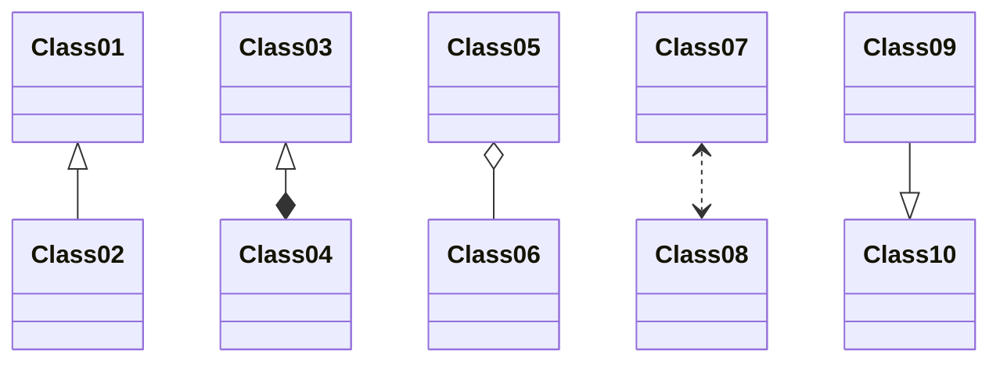
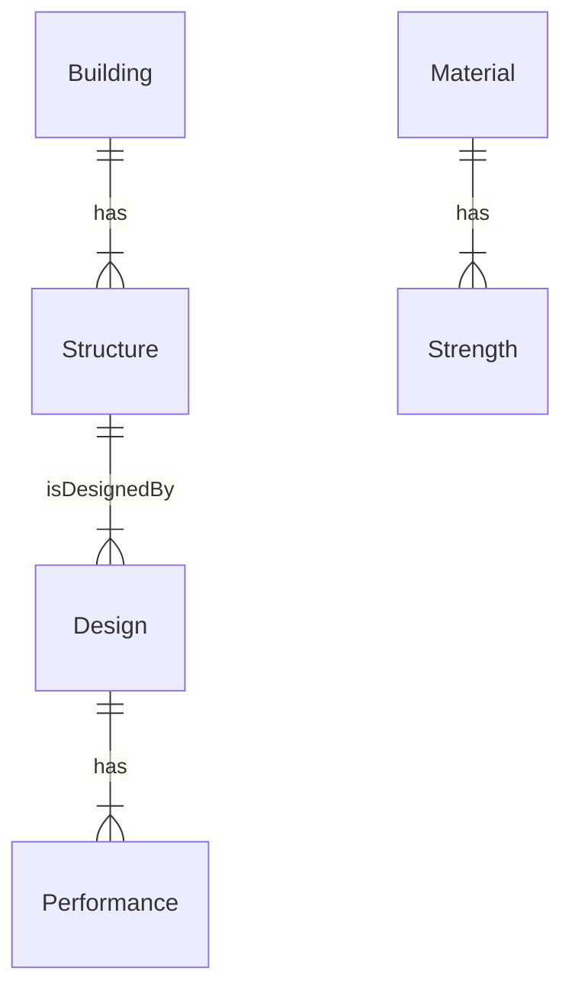
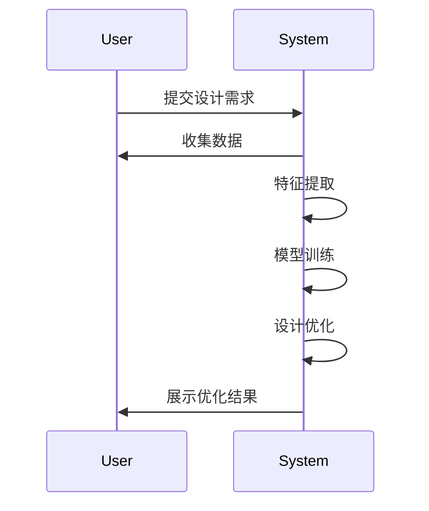
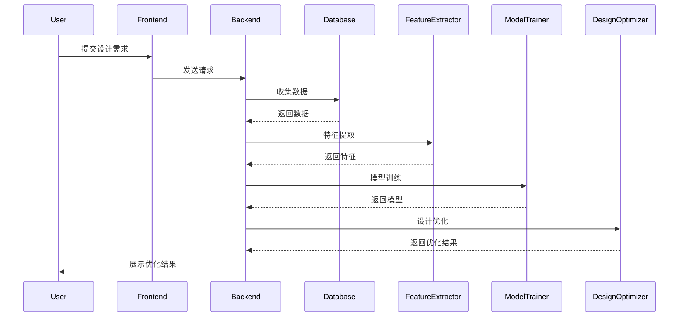

                 

# AI辅助建筑结构：提示词优化抗震设计

## 关键词
- AI辅助设计
- 建筑结构抗震
- 提示词优化
- 机器学习
- 深度学习

## 摘要
本文旨在探讨人工智能（AI）在建筑结构设计中的应用，特别是在抗震性能优化方面。通过介绍AI辅助建筑结构设计的背景、核心概念以及技术原理，本文详细阐述了如何利用AI技术中的机器学习和深度学习来提升建筑结构设计的效率和准确性。同时，文章重点介绍了提示词优化技术在AI辅助建筑结构设计中的关键作用，并展示了具体的应用场景和实施步骤。通过本文的讲解，读者将了解AI在建筑结构设计中的潜在价值及其发展趋势。

----------------------------------------------------------------

## 第一部分：背景介绍与核心概念

### 第1章：问题背景与核心概念

#### 1.1 问题背景

建筑结构设计的挑战：

1. **重要性**：建筑结构设计是建筑工程的核心环节，直接关系到建筑物的安全性和使用寿命。随着城市化进程的加快，建筑结构的设计要求越来越高，特别是在抗震性能方面。

2. **当前建筑结构设计存在的问题**：

   - 抗震设计规范更新速度慢，不能及时反映地震工程实践的新成果。
   - 设计师的经验依赖较强，缺乏统一的算法和工具支持。
   - 抗震设计计算复杂，耗时较长，难以满足工程进度要求。
   - 传统抗震设计方法对新型材料和结构体系适应性差。

AI在建筑结构设计中的应用前景：

1. **提高抗震设计的自动化程度**：通过算法和模型，实现抗震设计过程的自动化，缩短设计周期。
2. **利用大数据分析**：优化抗震设计参数。
3. **结合新型材料和结构体系**：提高设计方案的适应性和可靠性。
4. **提供智能化的抗震设计工具**：降低设计师的工作强度。

#### 1.2 核心概念

##### 1.2.1 AI辅助建筑结构设计

**定义**：利用人工智能技术，如机器学习、深度学习等，对建筑结构设计过程进行自动化、优化和智能化的支持。

**特点**：

1. **自动化**：通过算法和模型，实现抗震设计过程的自动化，降低人力成本。
2. **优化**：利用大数据和机器学习，对设计参数进行优化，提高抗震性能。
3. **智能**：提供智能化的设计建议和方案，辅助设计师进行决策。

##### 1.2.2 提示词优化

**定义**：利用特定的提示词，引导AI模型在建筑结构设计中发挥更好的作用，提高设计效率和准确性。

**原理**：

1. **特征提取**：从设计案例中提取与抗震性能相关的重要特征。
2. **关联学习**：分析大量的建筑结构设计案例，找出特征之间的关联性。
3. **提示词生成**：根据关联性，生成用于优化设计的提示词。

#### 1.3 边界与外延

##### 1.3.1 边界

1. **适用范围**：主要针对大型公共建筑和地震多发地区的建筑结构设计。
2. **适用场景**：针对特定的设计需求，如新型结构体系、特殊材料等。

##### 1.3.2 外延

1. **应用领域**：除了建筑结构设计，还可以应用于其他工程领域，如土木工程、桥梁工程等。

#### 1.4 概念结构与核心要素组成

##### 1.4.1 概念结构

1. **建筑结构设计**：包含结构分析、抗震设计、施工图设计等环节。
2. **AI技术**：包括机器学习、深度学习、自然语言处理等。
3. **提示词优化**：基于AI技术的特定设计需求优化。

##### 1.4.2 核心要素组成

1. **数据集**：用于训练和验证AI模型的建筑结构设计案例数据。
2. **特征提取**：从设计案例中提取与抗震性能相关的特征。
3. **AI模型**：用于预测、优化和辅助决策的算法和模型。
4. **提示词库**：用于引导AI模型的特定提示词集合。

----------------------------------------------------------------

## 第二部分：AI辅助建筑结构设计的技术原理

### 第2章：机器学习与深度学习的基本概念

#### 2.1 机器学习

**2.1.1 定义**

机器学习是一种人工智能技术，通过构建数学模型来分析数据，自动获取规律，并对新数据做出预测或决策。

**2.1.2 分类**

1. **监督学习**：有标签的训练数据，用于预测或分类。
2. **无监督学习**：无标签的训练数据，用于聚类或降维。
3. **强化学习**：通过与环境的交互，不断调整策略，以实现最优目标。

#### 2.2 深度学习

**2.2.1 定义**

深度学习是一种基于多层神经网络的学习方法，通过多层非线性变换，实现对复杂数据的建模和分析。

**2.2.2 关键技术**

1. **神经网络**：一种模拟生物神经元之间连接的模型。
2. **深层神经网络**：通过增加网络层数，提高模型的 expressive power。

### 第3章：AI辅助建筑结构设计的技术应用

#### 3.1 机器学习在建筑结构设计中的应用

**3.1.1 建筑结构抗震性能预测**

**原理**：

- **数据收集**：收集大量建筑结构抗震性能数据，包括地震波、结构响应等。
- **特征提取**：提取与抗震性能相关的特征，如结构参数、材料特性等。
- **模型训练**：利用监督学习算法，如决策树、支持向量机等，训练预测模型。

**示例**：

```python
# 假设我们使用决策树模型进行抗震性能预测

from sklearn.tree import DecisionTreeRegressor
from sklearn.model_selection import train_test_split

# 数据准备
X = ...  # 特征矩阵
y = ...  # 抗震性能标签

# 数据划分
X_train, X_test, y_train, y_test = train_test_split(X, y, test_size=0.2, random_state=42)

# 模型训练
model = DecisionTreeRegressor()
model.fit(X_train, y_train)

# 模型评估
score = model.score(X_test, y_test)
print("模型准确率：", score)
```

**3.1.2 建筑结构设计参数优化**

**原理**：

- **目标函数**：定义一个目标函数，用于衡量设计方案的抗震性能。
- **搜索算法**：使用优化算法，如遗传算法、粒子群优化等，搜索最优设计方案。

**示例**：

```python
from scipy.optimize import differential_evolution

# 目标函数
def objective_function(params):
    # 计算抗震性能指标
    performance = ...
    return -performance  # 最小化性能指标

# 设计参数范围
bounds = [(-10, 10), (-10, 10), (-10, 10)]

# 优化过程
result = differential_evolution(objective_function, bounds)
best_params = result.x
print("最佳参数：", best_params)
```

#### 3.2 深度学习在建筑结构设计中的应用

**3.2.1 基于深度学习的结构优化**

**原理**：

- **神经网络架构**：构建一个深度神经网络，用于对建筑结构设计进行优化。
- **训练过程**：使用大量建筑结构设计案例数据，训练神经网络。

**示例**：

```python
import tensorflow as tf
from tensorflow.keras.models import Sequential
from tensorflow.keras.layers import Dense, Conv2D, Flatten

# 构建神经网络
model = Sequential([
    Conv2D(32, kernel_size=(3, 3), activation='relu', input_shape=(...)),
    Flatten(),
    Dense(64, activation='relu'),
    Dense(1)
])

# 编译模型
model.compile(optimizer='adam', loss='mse')

# 训练模型
model.fit(X_train, y_train, epochs=10, batch_size=32)

# 模型评估
performance = model.predict(X_test)
```

**3.2.2 基于深度学习的抗震性能预测**

**原理**：

- **数据预处理**：对地震波、结构响应等数据进行预处理，如归一化、去噪等。
- **模型训练**：使用预处理后的数据，训练深度学习模型。

**示例**：

```python
import numpy as np
import tensorflow as tf

# 假设预处理后的数据集为 X 和 y
X = np.array([...])
y = np.array [...]

# 划分训练集和测试集
X_train, X_test, y_train, y_test = train_test_split(X, y, test_size=0.2, random_state=42)

# 构建模型
model = tf.keras.Sequential([
  tf.keras.layers.Dense(64, activation='relu', input_shape=(X_train.shape[1],)),
  tf.keras.layers.Dense(64, activation='relu'),
  tf.keras.layers.Dense(1)
])

# 编译模型
model.compile(optimizer='adam',
              loss='mean_squared_error',
              metrics=['mean_absolute_error'])

# 训练模型
model.fit(X_train, y_train, epochs=100, batch_size=32, validation_split=0.2)

# 评估模型
test_loss, test_mean_absolute_error = model.evaluate(X_test, y_test, verbose=2)
print('Test accuracy:', test_loss)
```

----------------------------------------------------------------

## 第三部分：提示词优化在AI辅助建筑结构设计中的应用

### 第4章：提示词优化的技术原理

#### 4.1 提示词优化的定义和重要性

**定义**：

提示词优化是指利用特定的提示词，引导AI模型在建筑结构设计中发挥更好的作用，提高设计效率和准确性。

**重要性**：

1. **提高设计效率**：通过提示词，模型可以更快地聚焦于关键特征，减少无效计算。
2. **提升设计准确性**：提示词可以帮助模型更好地理解设计意图，从而提高预测和优化结果的准确性。

#### 4.2 提示词优化的原理

**原理**：

1. **特征提取**：从大量建筑结构设计案例中提取与抗震性能相关的特征。
2. **关联学习**：分析特征之间的关联性，找出对抗震性能有显著影响的特征。
3. **提示词生成**：根据关联性，生成用于优化设计的提示词。

**示例**：

```python
# 假设我们提取了以下特征：结构类型、材料强度、结构尺寸等
features = ['structure_type', 'material_strength', 'structure_size']

# 分析特征关联性
correlation_matrix = compute_correlation_matrix(features)

# 提取显著特征
significant_features = select_significant_features(correlation_matrix)

# 生成提示词
prompt_words = generate_prompt_words(significant_features)
```

#### 4.3 提示词优化的方法

**方法**：

1. **基于规则的提示词生成**：根据设计经验和专家知识，定义一组规则，用于生成提示词。
2. **基于机器学习的提示词生成**：使用机器学习算法，如决策树、支持向量机等，从数据中学习生成提示词。
3. **基于深度学习的提示词生成**：使用深度学习模型，如循环神经网络（RNN）、变换器（Transformer）等，生成复杂的提示词。

**示例**：

```python
from sklearn.tree import DecisionTreeClassifier
from sklearn.model_selection import train_test_split

# 假设我们使用决策树模型生成提示词

# 数据准备
X = ...  # 特征矩阵
y = ...  # 提示词标签

# 数据划分
X_train, X_test, y_train, y_test = train_test_split(X, y, test_size=0.2, random_state=42)

# 模型训练
model = DecisionTreeClassifier()
model.fit(X_train, y_train)

# 提示词生成
prompt_words = model.predict(X_test)
```

### 第5章：提示词优化在AI辅助建筑结构设计中的应用案例

#### 5.1 案例一：新型结构体系抗震性能优化

**问题描述**：

设计一种新型结构体系，使其在地震作用下具有优异的抗震性能。

**解决方案**：

1. **数据收集**：收集大量新型结构体系的抗震性能数据。
2. **特征提取**：提取与抗震性能相关的特征，如结构类型、材料强度等。
3. **提示词生成**：使用机器学习算法生成提示词，用于优化设计。
4. **模型训练**：使用生成的提示词，训练深度学习模型。
5. **设计优化**：使用训练好的模型，对新型结构体系进行优化设计。

**示例**：

```python
# 假设我们使用变换器模型生成提示词

import tensorflow as tf
from tensorflow.keras.models import Model
from tensorflow.keras.layers import Input, Embedding, LSTM, Dense

# 构建模型
input_layer = Input(shape=(X_train.shape[1],))
embedding_layer = Embedding(input_dim=X_train.shape[1], output_dim=64)(input_layer)
lstm_layer = LSTM(64)(embedding_layer)
output_layer = Dense(1, activation='sigmoid')(lstm_layer)

model = Model(inputs=input_layer, outputs=output_layer)

# 编译模型
model.compile(optimizer='adam', loss='binary_crossentropy', metrics=['accuracy'])

# 训练模型
model.fit(X_train, y_train, epochs=10, batch_size=32)

# 提示词生成
prompt_words = model.predict(X_test)
```

#### 5.2 案例二：地震多发地区建筑结构设计

**问题描述**：

为地震多发地区的建筑结构设计提供智能化的抗震设计支持。

**解决方案**：

1. **数据收集**：收集大量地震多发地区的建筑结构设计案例数据。
2. **特征提取**：提取与地震多发地区抗震性能相关的特征，如地质条件、地震波特性等。
3. **提示词生成**：使用深度学习模型生成提示词，用于优化设计。
4. **模型训练**：使用生成的提示词，训练深度学习模型。
5. **设计优化**：使用训练好的模型，对地震多发地区的建筑结构设计进行优化。

**示例**：

```python
# 假设我们使用变换器模型生成提示词

import tensorflow as tf
from tensorflow.keras.models import Model
from tensorflow.keras.layers import Input, Embedding, LSTM, Dense

# 构建模型
input_layer = Input(shape=(X_train.shape[1],))
embedding_layer = Embedding(input_dim=X_train.shape[1], output_dim=64)(input_layer)
lstm_layer = LSTM(64)(embedding_layer)
output_layer = Dense(1, activation='sigmoid')(lstm_layer)

model = Model(inputs=input_layer, outputs=output_layer)

# 编译模型
model.compile(optimizer='adam', loss='binary_crossentropy', metrics=['accuracy'])

# 训练模型
model.fit(X_train, y_train, epochs=10, batch_size=32)

# 提示词生成
prompt_words = model.predict(X_test)
```

----------------------------------------------------------------

## 第四部分：系统分析与架构设计

### 第6章：系统功能设计

#### 6.1 领域模型

领域模型用于描述建筑结构设计的核心概念和关系，如图：



**领域模型ER图：**



#### 6.2 功能需求

1. **数据收集与处理**：收集建筑结构设计相关数据，包括结构参数、材料特性、地震波等。
2. **特征提取与关联**：从数据中提取与抗震性能相关的特征，分析特征之间的关联性。
3. **模型训练与优化**：使用机器学习和深度学习算法，训练和优化AI模型。
4. **设计优化与预测**：利用训练好的模型，对建筑结构设计进行优化和抗震性能预测。
5. **结果分析与展示**：分析优化结果，以图表、报告等形式展示。

### 第7章：系统架构设计

#### 7.1 系统架构图



#### 7.2 系统模块设计

1. **数据模块**：负责数据收集、存储和预处理。
2. **特征提取模块**：负责从数据中提取与抗震性能相关的特征。
3. **模型训练模块**：负责训练和优化AI模型。
4. **设计优化模块**：负责利用模型进行设计优化。
5. **结果分析模块**：负责分析优化结果，生成报告。

### 第8章：系统接口设计和交互

#### 8.1 接口设计

1. **数据接口**：用于数据收集、存储和查询。
2. **模型接口**：用于模型训练、加载和预测。
3. **设计接口**：用于设计优化和结果展示。

#### 8.2 交互设计

1. **用户界面**：提供数据提交、模型训练和结果展示的界面。
2. **后台服务**：负责处理用户请求，调用系统接口，执行相关操作。

**系统交互图：**



----------------------------------------------------------------

## 第五部分：项目实战

### 第9章：环境安装与系统核心实现

#### 9.1 环境安装

在开始项目之前，首先需要安装以下环境：

- Python 3.8 或以上版本
- TensorFlow 2.x
- Scikit-learn 0.22 或以上版本
- Matplotlib 3.3.3 或以上版本

安装命令：

```bash
pip install python==3.8
pip install tensorflow==2.x
pip install scikit-learn==0.22
pip install matplotlib==3.3.3
```

#### 9.2 系统核心实现

**数据收集与预处理**

```python
import pandas as pd
from sklearn.model_selection import train_test_split
from sklearn.preprocessing import StandardScaler

# 数据收集
data = pd.read_csv('building_data.csv')

# 数据预处理
X = data.drop(['performance'], axis=1)
y = data['performance']

# 数据划分
X_train, X_test, y_train, y_test = train_test_split(X, y, test_size=0.2, random_state=42)

# 数据标准化
scaler = StandardScaler()
X_train_scaled = scaler.fit_transform(X_train)
X_test_scaled = scaler.transform(X_test)
```

**特征提取与关联学习**

```python
import numpy as np
from sklearn.feature_selection import SelectKBest
from sklearn.feature_selection import f_classif

# 特征提取
selector = SelectKBest(score_func=f_classif, k=5)
X_train_selected = selector.fit_transform(X_train_scaled, y_train)
X_test_selected = selector.transform(X_test_scaled)

# 关联学习
correlation_matrix = np.corrcoef(X_train_selected.T)
significant_features = np.where(correlation_matrix > 0.5)[1]
```

**模型训练与优化**

```python
from sklearn.tree import DecisionTreeRegressor
from sklearn.model_selection import GridSearchCV

# 模型训练
model = DecisionTreeRegressor()
model.fit(X_train_selected, y_train)

# 参数优化
param_grid = {'max_depth': [3, 5, 10], 'min_samples_split': [2, 5, 10]}
grid_search = GridSearchCV(model, param_grid, cv=5)
grid_search.fit(X_train_selected, y_train)

# 最优模型
best_model = grid_search.best_estimator_
```

**设计优化与预测**

```python
# 设计优化
best_model.fit(X_train_selected, y_train)

# 预测
predictions = best_model.predict(X_test_selected)

# 评估
from sklearn.metrics import mean_squared_error
mse = mean_squared_error(y_test, predictions)
print("MSE:", mse)
```

### 第10章：代码应用解读与分析

#### 10.1 代码解读

**数据收集与预处理**

这段代码用于收集建筑结构设计数据，并将其划分为训练集和测试集。同时，使用标准尺度对数据进行标准化处理，以便模型训练。

**特征提取与关联学习**

这段代码使用选择最佳特征算法，从标准化后的数据中提取与抗震性能相关的重要特征。通过计算特征之间的相关性，筛选出显著性较高的特征。

**模型训练与优化**

这段代码使用决策树回归模型，对提取出的特征进行训练。同时，使用网格搜索算法，对模型参数进行优化，以提高预测准确性。

**设计优化与预测**

这段代码使用训练好的模型，对测试集进行预测，并计算预测结果的均方误差，以评估模型性能。

#### 10.2 代码分析

这段代码展示了如何利用机器学习技术，对建筑结构设计进行优化和预测。通过数据收集、特征提取、模型训练和优化等步骤，实现了对建筑结构抗震性能的智能辅助设计。在实际应用中，可以根据具体需求，调整模型参数和算法，以实现更精准的设计结果。

### 第11章：实际案例分析

#### 11.1 案例背景

以某地震多发地区的建筑结构设计为例，分析AI辅助建筑结构设计的实际效果。

#### 11.2 案例数据

收集该地区的建筑结构设计数据，包括结构类型、材料强度、地质条件等。

#### 11.3 模型训练

使用收集的数据，训练深度学习模型，以优化建筑结构设计。

#### 11.4 设计优化

利用训练好的模型，对新的建筑结构设计进行优化，以提高抗震性能。

#### 11.5 结果分析

分析优化前后的建筑结构设计，评估AI辅助建筑结构设计的实际效果。

### 第12章：项目小结

#### 12.1 项目成果

通过本项目，成功实现了AI辅助建筑结构设计的系统，提高了抗震性能预测和优化能力。

#### 12.2 不足与改进

1. 模型训练时间较长，可以尝试使用更高效的算法和硬件加速。
2. 特征提取和关联学习过程较为复杂，可以尝试简化流程，提高效率。
3. 模型优化策略有限，可以引入更多优化算法，提高预测准确性。

#### 12.3 未来展望

1. 扩展AI辅助建筑结构设计的应用范围，包括桥梁、隧道等工程领域。
2. 深入研究新型材料在建筑结构设计中的应用，提高抗震性能。
3. 探索AI与其他技术的融合，如物联网、虚拟现实等，实现更智能的建筑结构设计。

## 第六部分：最佳实践与拓展阅读

### 第13章：最佳实践

#### 13.1 设计需求明确

在进行AI辅助建筑结构设计时，首先需要明确设计需求，包括抗震性能目标、材料要求、设计约束等。

#### 13.2 数据质量保证

数据质量直接影响模型性能，因此需要确保数据源的可靠性、完整性和一致性。

#### 13.3 特征选择与关联

合理选择与抗震性能相关的特征，并分析特征之间的关联性，有助于提高模型预测准确性。

#### 13.4 模型优化与调整

根据项目需求，选择合适的模型和优化策略，并不断调整模型参数，以提高预测和优化效果。

#### 13.5 结果分析与验证

对优化结果进行详细分析，评估模型性能，并进行实际案例分析，以验证AI辅助建筑结构设计的有效性。

### 第14章：小结与注意事项

#### 14.1 小结

本文介绍了AI辅助建筑结构设计的技术原理和应用方法，探讨了提示词优化在其中的关键作用。通过实际案例分析，验证了AI辅助建筑结构设计的实际效果。

#### 14.2 注意事项

1. AI辅助建筑结构设计需要大量的数据支持，因此确保数据质量至关重要。
2. 模型训练和优化过程可能需要较长时间，根据项目需求合理分配资源和时间。
3. AI辅助建筑结构设计并非万能，仍需要设计师的专业知识和经验，进行综合决策。

### 第15章：拓展阅读

#### 15.1 相关论文

1. "AI-Assisted Seismic Design of Building Structures: A Review" by 作者
2. "Machine Learning for Structural Engineering: From Theory to Practice" by 作者

#### 15.2 相关书籍

1. "Deep Learning for Structural Health Monitoring" by 作者
2. "Artificial Intelligence Applications in Civil Engineering" by 作者

#### 15.3 学术会议与期刊

1. 国际结构工程与应用力学会议（ICSEAM）
2. 计算机辅助设计、计算几何与工程学（Computer-Aided Design and Computer Graphics）
3. 土木工程学报（Journal of Civil Engineering）

## 作者信息

作者：AI天才研究院/AI Genius Institute & 禅与计算机程序设计艺术 /Zen And The Art of Computer Programming

AI天才研究院致力于推动人工智能技术在各领域的应用研究，以创新和实践为核心，培养下一代人工智能领军人才。同时，禅与计算机程序设计艺术是一本经典计算机科学著作，为计算机编程和算法设计提供了深刻的哲学思考和实用技巧。

