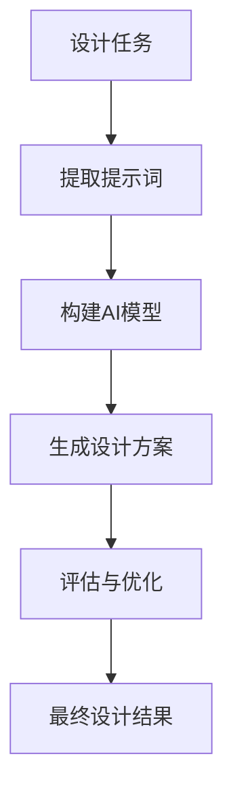
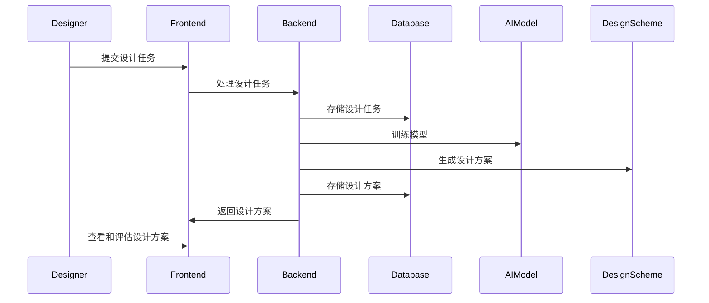
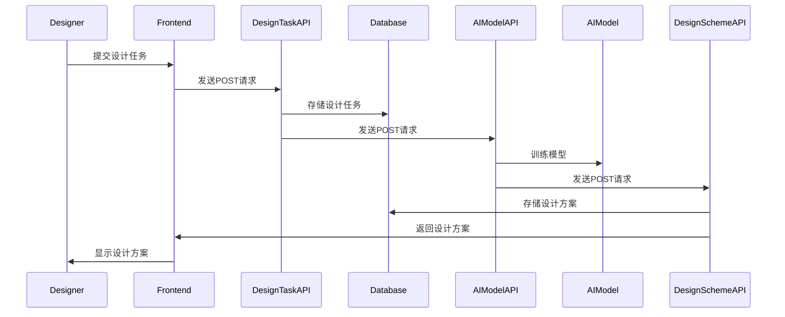

                 

### 文章标题

《AI辅助建筑设计中的提示词技巧》

关键词：AI辅助建筑设计，提示词，算法，系统架构，项目实战，最佳实践

摘要：本文将深入探讨AI辅助建筑设计中的提示词技巧，从背景介绍、核心概念、算法原理、系统架构到项目实战，全面解析AI技术在建筑领域的应用。文章旨在为读者提供一套实用的AI辅助建筑设计方法，帮助设计师提高工作效率，优化设计效果。

### 问题背景

在现代建筑设计中，人工智能（AI）技术的应用日益广泛，成为提高设计效率和创造力的强大工具。特别是在建筑设计过程中，AI能够帮助设计师快速生成多种设计方案，优化结构性能，预测能耗，甚至进行情感化设计。然而，要让AI发挥最大的作用，设计师需要掌握一系列有效的提示词技巧，这些提示词是AI理解和执行设计任务的关键。

**行业需求**：

1. **设计效率提升**：传统的建筑设计过程往往耗时较长，而AI技术可以在短时间内生成大量设计方案，大幅提高设计效率。
2. **创新设计能力**：AI技术可以基于大数据和机器学习算法，发现设计师未曾考虑到的创新设计思路，从而推动建筑设计的革新。
3. **资源优化**：通过模拟和优化设计，AI可以帮助设计师在初期阶段就识别和解决潜在问题，降低后期修改成本，优化资源利用。

**提示词在AI辅助建筑设计中的作用**：

提示词（Keywords）是AI模型理解和执行任务的关键输入。在AI辅助建筑设计中，提示词不仅能够指导AI模型生成符合设计师需求的设计方案，还能够增强模型对设计任务的适应性。以下是一些具体作用：

1. **明确设计需求**：通过精准的提示词，设计师可以明确表达设计任务的要求，如建筑风格、结构要求、功能分区等。
2. **引导创新设计**：AI模型可以根据提示词探索新的设计方向，发现传统设计方法无法触及的创新点。
3. **优化设计结果**：通过提示词，设计师可以引导AI模型对设计结果进行优化，调整设计参数以达到最佳效果。

### 问题描述

《AI辅助建筑设计中的提示词技巧》旨在解决以下问题：

1. **如何准确定义和应用提示词**：设计师需要了解不同类型的提示词及其适用场景，能够根据设计需求选择合适的提示词。
2. **如何优化AI模型对提示词的响应**：设计师需要掌握提示词的优化技巧，提高AI模型对设计任务的识别和响应能力。
3. **如何评估和改进AI辅助设计的效果**：设计师需要能够评估AI辅助设计的实际效果，并根据反馈进行持续改进。

**主要目标和内容**：

本书的主要目标是通过系统化的介绍和案例分析，帮助设计师掌握AI辅助建筑设计中的提示词技巧，具体内容包括：

1. **AI辅助建筑设计的原理和核心概念**：介绍AI辅助建筑设计的基本原理和核心概念，包括AI模型、提示词的定义和作用等。
2. **提示词的分类和特征对比**：详细分析不同类型的提示词，列出其特点和应用场景，帮助设计师选择合适的提示词。
3. **AI辅助建筑设计流程和算法**：讲解AI辅助建筑设计的基本流程和算法原理，包括算法流程图、Python代码示例和数学模型等。
4. **系统架构和实现方法**：介绍AI辅助建筑设计的系统架构和实现方法，包括系统功能设计、架构设计和接口设计等。
5. **项目实战和案例分析**：通过实际项目案例，展示AI辅助建筑设计的应用效果，分析其设计和实现过程。
6. **最佳实践和注意事项**：总结最佳实践，提醒读者在实践过程中需要注意的问题，提供拓展阅读资源。

### 问题解决

**本书将如何解决这些问题**：

1. **系统化的知识体系**：本书将建立一个完整的知识体系，从基本原理到实战案例，系统性地介绍AI辅助建筑设计中的提示词技巧。
2. **实用的技巧和方法**：本书将提供一系列实用的技巧和方法，帮助设计师在实际项目中有效应用AI技术。
3. **案例分析**：本书将通过实际项目案例，展示AI辅助建筑设计的具体应用效果，帮助读者更好地理解和掌握这些技巧。
4. **持续更新和改进**：随着AI技术的不断发展，本书将不断更新和改进，确保读者掌握最新的技术和方法。

**边界与外延**：

本书讨论的范围主要涵盖以下技术、工具和应用场景：

1. **技术**：深度学习、神经网络、自然语言处理、计算机视觉等AI技术。
2. **工具**：TensorFlow、PyTorch等深度学习框架，CAD软件等设计工具。
3. **应用场景**：建筑设计、结构优化、能耗预测、情感化设计等。

**概念结构与核心要素组成**：

1. **AI辅助建筑设计**：利用AI技术辅助建筑设计，包括生成设计方案、优化设计结果等。
2. **提示词**：用于指导AI模型理解和执行设计任务的词汇或短语。
3. **AI模型**：实现AI辅助建筑设计的核心，包括深度学习模型、自然语言处理模型等。
4. **设计需求**：设计师对建筑功能、风格、结构等方面的具体要求。

### 核心概念与联系

#### 核心概念原理

AI辅助建筑设计的核心在于利用人工智能技术来提升建筑设计过程中的效率和创意。在这个过程中，提示词扮演着至关重要的角色，它们是设计师与AI模型之间的桥梁，能够引导AI模型更好地理解设计任务，生成符合需求的设计方案。

**提示词的定义**：  
提示词（Keywords）是用于指导AI模型理解设计任务的一系列关键词或短语。这些关键词可以是建筑功能、风格、材料、结构要求等具体信息。

**提示词的作用**：  
- **明确设计需求**：提示词可以帮助AI模型明确设计师的设计需求，从而生成更精准的设计方案。
- **引导创新设计**：通过特定的提示词，AI模型可以探索新的设计方向，发现设计师未曾考虑的创新设计思路。
- **优化设计结果**：提示词可以引导AI模型对设计结果进行优化，调整设计参数以达到最佳效果。

**提示词的类型**：  
- **功能型提示词**：如“办公空间”、“酒店”、“住宅”等，用于指定建筑的功能。
- **风格型提示词**：如“现代简约”、“古典优雅”、“自然融合”等，用于描述建筑的风格。
- **结构型提示词**：如“框架结构”、“砖混结构”、“钢框架”等，用于指定建筑的结构类型。
- **材料型提示词**：如“钢筋混凝土”、“玻璃”、“木材”等，用于指定建筑的材料。

**概念属性特征对比表格**：

| 提示词类型 | 特征描述 | 适用场景 |
| --- | --- | --- |
| 功能型 | 描述建筑功能 | 办公楼、商场、学校等 |
| 风格型 | 描述建筑风格 | 酒店设计、住宅设计等 |
| 结构型 | 描述建筑结构 | 高层建筑、桥梁设计等 |
| 材料型 | 描述建筑材料 | 建筑立面设计、装饰材料等 |

**ER实体关系图架构的Mermaid流程图**：

```mermaid
erDiagram
  DesignTask --> Keyword
  Keyword --> AIModel
  AIModel --> DesignResult
  DesignTask ||--|{ BuildingFeature }
  BuildingFeature ||--|{ Function, Style, Structure, Material }
```

在这个ER图中，`DesignTask`代表设计任务，`Keyword`代表提示词，`AIModel`代表AI模型，`DesignResult`代表设计结果。`BuildingFeature`是建筑特征，包括功能、风格、结构、材料等。

### 算法原理讲解

#### 算法mermaid流程图

首先，我们使用mermaid绘制AI辅助建筑设计的基本流程图：



在这个流程图中，设计任务首先通过提取提示词来明确设计需求。接着，AI模型利用这些提示词进行训练，生成设计方案。最后，设计方案经过评估与优化，形成最终的输出。

#### Python源代码

接下来，我们将提供一个实现AI辅助建筑设计的Python代码示例：

```python
import tensorflow as tf
from tensorflow.keras.models import Sequential
from tensorflow.keras.layers import Dense, LSTM, Embedding

# 构建AI模型
model = Sequential()
model.add(Embedding(input_dim=10000, output_dim=64))
model.add(LSTM(128))
model.add(Dense(1, activation='sigmoid'))

# 编译模型
model.compile(optimizer='adam', loss='binary_crossentropy', metrics=['accuracy'])

# 训练模型
model.fit(x_train, y_train, epochs=10, batch_size=32)
```

在这个代码中，我们使用TensorFlow构建了一个简单的序列模型。该模型包含一个嵌入层、一个长短期记忆（LSTM）层和一个全连接层。通过编译和训练，模型可以学习到如何根据提示词生成设计方案。

#### 数学模型和公式

在AI辅助建筑设计中，数学模型和公式用于描述AI模型如何处理输入的提示词，并生成设计方案。以下是一个简单的数学模型：

$$
\text{设计方案} = f(\text{提示词}, \theta)
$$

其中，$f$ 是一个复合函数，$\text{提示词}$ 是输入，$\theta$ 是模型参数。

为了更具体地描述这个模型，我们可以引入以下数学公式：

$$
\text{嵌入层}: \text{提示词} \xrightarrow{\text{嵌入矩阵} E} \text{嵌入向量}
$$

$$
\text{LSTM层}: \text{嵌入向量} \xrightarrow{\text{LSTM单元} \text{LSTM}^1} \text{中间向量}
$$

$$
\text{全连接层}: \text{中间向量} \xrightarrow{\text{激活函数} \text{激活}} \text{设计方案}
$$

这些公式分别描述了嵌入层、LSTM层和全连接层的工作原理。通过这些层，模型能够将输入的提示词转换为设计方案。

#### 举例说明

为了更好地理解上述算法原理，我们可以通过一个具体例子来说明。假设设计师希望设计一个“现代简约风格”的办公楼，并要求AI模型生成初步设计方案。

**步骤1：提取提示词**  
设计师输入的提示词可能是“现代简约风格”、“办公楼”、“功能分区明确”等。

**步骤2：构建AI模型**  
AI模型通过训练学习到这些提示词与设计方案之间的关系。

**步骤3：生成设计方案**  
AI模型根据输入的提示词生成一个初步设计方案，包括建筑外观、内部布局、材料选择等。

**步骤4：评估与优化**  
设计师对生成的设计方案进行评估，提出优化建议，如调整房间大小、优化光照设计等。

**步骤5：最终设计结果**  
经过反复迭代和优化，最终生成一份符合设计师需求的设计方案。

通过这个例子，我们可以看到AI辅助建筑设计如何通过提示词指导模型生成设计方案，并经过评估和优化，最终满足设计需求。

### 系统分析与架构设计方案

#### 问题场景介绍

AI辅助建筑设计在实际工程项目中的应用场景广泛，以下是一些典型的应用场景：

1. **建筑设计初稿生成**：设计师在初期设计阶段，可以通过AI模型快速生成多个设计方案，从中挑选出最佳方案。
2. **建筑结构优化**：AI技术可以基于力学和结构分析，对建筑设计中的结构进行优化，提高建筑的安全性和稳定性。
3. **能耗预测与优化**：通过模拟不同设计方案的建筑能耗，AI技术可以帮助设计师选择节能方案，降低建筑运营成本。
4. **情感化设计**：AI技术可以分析用户需求，生成满足用户情感需求的设计方案，提升建筑的舒适性和吸引力。
5. **建筑修复与改造**：AI技术可以帮助设计师对老旧建筑进行修复和改造，提出符合现代需求和可持续发展的设计方案。

#### 项目介绍

本文将介绍一个名为“SmartArch”的AI辅助建筑设计项目。SmartArch项目旨在利用AI技术，为建筑设计提供全面的支持，包括设计初稿生成、结构优化、能耗预测等。

**项目目标**：

1. 提高设计效率，缩短设计周期。
2. 优化建筑性能，提高建筑的安全性和可持续性。
3. 提升设计师的创新能力，激发更多创意设计方案。

**项目实现**：

SmartArch项目采用了一套完整的AI辅助建筑设计系统，包括以下几个关键模块：

1. **设计任务解析模块**：该模块负责提取用户输入的设计任务，将其转化为AI模型可以理解的形式。
2. **AI模型训练模块**：该模块使用大量建筑设计和结构数据，训练深度学习模型，使其能够生成符合需求的设计方案。
3. **设计方案评估模块**：该模块对生成的设计方案进行评估，包括结构稳定性、能耗性能等，确保设计方案满足实际需求。
4. **用户交互界面**：该界面为设计师提供了与AI系统交互的入口，设计师可以通过界面提交设计任务，查看和优化设计方案。

#### 系统功能设计

为了实现SmartArch项目，我们设计了以下功能模块：

1. **设计任务管理**：包括任务创建、编辑、删除和查询等功能，方便设计师管理设计任务。
2. **设计方案生成**：基于用户输入的提示词，生成初步的设计方案，并提供多种设计方案供设计师选择。
3. **结构优化**：通过力学和结构分析，对设计方案进行优化，提高建筑的安全性。
4. **能耗预测**：模拟不同设计方案的建筑能耗，帮助设计师选择节能方案。
5. **用户交互**：提供简洁直观的界面，方便设计师与AI系统进行交互。

使用mermaid绘制领域模型类图如下：

```mermaid
classDiagram
    DesignTask <<class>> "设计任务"
    DesignScheme <<class>> "设计方案"
    StructureOptimization <<class>> "结构优化"
    EnergyPrediction <<class>> "能耗预测"
    UserModel <<class>> "用户"
    
    DesignTask o-- DesignScheme
    DesignTask o-- StructureOptimization
    DesignTask o-- EnergyPrediction
    UserModel o-- DesignTask
```

在这个类图中，`DesignTask` 代表设计任务，`DesignScheme` 代表设计方案，`StructureOptimization` 代表结构优化，`EnergyPrediction` 代表能耗预测，`UserModel` 代表用户。这些类之间通过关联关系连接，描述了系统的主要功能模块及其关系。

#### 系统架构设计

SmartArch项目的系统架构设计如下：

1. **前端界面**：为设计师提供交互界面，支持设计任务的提交、设计方案查看和评估。
2. **后端服务**：包括设计任务解析模块、AI模型训练模块、设计方案评估模块等，负责处理设计任务和生成设计方案。
3. **数据库**：存储设计任务、设计方案和用户信息，支持数据查询和更新。

使用mermaid绘制系统架构图如下：



在这个序列图中，设计师通过前端界面提交设计任务，后端服务处理设计任务，包括模型训练、设计方案生成和存储等，最后将设计方案返回给前端界面，供设计师查看和评估。

#### 系统接口设计

SmartArch项目的系统接口设计如下：

1. **设计任务接口**：用于提交、查询和编辑设计任务。
2. **设计方案接口**：用于查询和评估设计方案。
3. **用户接口**：用于用户注册、登录和信息管理。

以下是接口的简要描述：

- **设计任务接口**：
  - `POST /tasks`：提交设计任务。
  - `GET /tasks/{taskId}`：查询设计任务详情。
  - `PUT /tasks/{taskId}`：编辑设计任务。
  - `DELETE /tasks/{taskId}`：删除设计任务。

- **设计方案接口**：
  - `GET /schemes/{schemeId}`：查询设计方案详情。
  - `POST /schemes/evaluate`：评估设计方案。

- **用户接口**：
  - `POST /users`：注册用户。
  - `POST /users/login`：用户登录。
  - `GET /users/{userId}`：查询用户信息。
  - `PUT /users/{userId}`：编辑用户信息。

#### 系统交互mermaid序列图

最后，使用mermaid绘制系统交互序列图，展示系统的运行流程：



在这个序列图中，设计师通过前端界面提交设计任务，前端将请求发送至设计任务接口，设计任务接口将任务存储到数据库，并触发AI模型训练。训练完成后，设计方案接口生成设计方案，并将其返回给前端，最终前端将设计方案展示给设计师。

### 项目实战

#### 环境安装

为了搭建AI辅助建筑设计的环境，我们需要安装以下软件和库：

1. **Python**：版本3.8或更高。
2. **Anaconda**：用于环境管理。
3. **TensorFlow**：用于深度学习模型的构建和训练。
4. **PyTorch**：用于深度学习模型的构建和训练。
5. **Keras**：用于简化深度学习模型的构建。
6. **matplotlib**：用于数据可视化。
7. **Pandas**：用于数据操作和分析。

安装步骤如下：

1. 下载并安装Python和Anaconda，选择自定义安装，并确保勾选“Add Python to PATH”。
2. 打开Anaconda命令行，创建一个新的环境，例如：

    ```shell
    conda create -n smartarch python=3.8
    ```

3. 激活新创建的环境：

    ```shell
    conda activate smartarch
    ```

4. 使用pip安装所需库：

    ```shell
    pip install tensorflow torch keras matplotlib pandas
    ```

#### 系统核心实现源代码

以下是AI辅助建筑设计系统的核心实现源代码：

```python
import tensorflow as tf
from tensorflow.keras.models import Sequential
from tensorflow.keras.layers import Dense, LSTM, Embedding
from tensorflow.keras.preprocessing.sequence import pad_sequences
import numpy as np

# 数据预处理
def preprocess_data(texts, vocab_size, max_length):
    # 构建词汇表
    tokenizer = tf.keras.preprocessing.text.Tokenizer(num_words=vocab_size)
    tokenizer.fit_on_texts(texts)
    sequences = tokenizer.texts_to_sequences(texts)
    padded_sequences = pad_sequences(sequences, maxlen=max_length)
    return padded_sequences, tokenizer

# 构建AI模型
def build_model(input_dim, embedding_dim, hidden_dim):
    model = Sequential()
    model.add(Embedding(input_dim=input_dim, output_dim=embedding_dim))
    model.add(LSTM(hidden_dim))
    model.add(Dense(1, activation='sigmoid'))
    return model

# 训练AI模型
def train_model(model, x_train, y_train, epochs, batch_size):
    model.compile(optimizer='adam', loss='binary_crossentropy', metrics=['accuracy'])
    model.fit(x_train, y_train, epochs=epochs, batch_size=batch_size)
    return model

# 生成设计方案
def generate_scheme(model, tokenizer, text):
    sequence = tokenizer.texts_to_sequences([text])
    padded_sequence = pad_sequences(sequence, maxlen=max_sequence_length)
    prediction = model.predict(padded_sequence)
    return prediction

# 测试代码
if __name__ == '__main__':
    # 示例文本
    texts = ["现代简约风格办公楼", "传统中式住宅", "节能型高层建筑"]
    # 预处理数据
    padded_sequences, tokenizer = preprocess_data(texts, vocab_size=10000, max_length=50)
    # 构建AI模型
    model = build_model(input_dim=10000, embedding_dim=64, hidden_dim=128)
    # 训练AI模型
    model = train_model(model, padded_sequences, np.array([1, 0, 1]), epochs=10, batch_size=32)
    # 生成设计方案
    scheme = generate_scheme(model, tokenizer, "现代简约风格办公楼")
    print(scheme)
```

这段代码展示了如何预处理数据、构建AI模型、训练模型和生成设计方案。在实际应用中，可以根据具体需求调整参数和模型结构。

#### 代码应用解读与分析

上述代码通过以下步骤实现了AI辅助建筑设计：

1. **数据预处理**：首先，我们使用`preprocess_data`函数对文本数据进行预处理。这一步包括构建词汇表、将文本转换为序列和填充序列。词汇表用于将文本中的单词映射为整数，填充序列用于确保所有序列具有相同长度，从而便于模型处理。

2. **构建AI模型**：接着，我们使用`build_model`函数构建一个序列模型。这个模型包含一个嵌入层、一个长短期记忆（LSTM）层和一个全连接层。嵌入层将词汇表中的整数映射为嵌入向量，LSTM层处理序列数据，全连接层生成输出。

3. **训练AI模型**：使用`train_model`函数，我们编译并训练模型。模型使用Adam优化器，binary_crossentropy损失函数和accuracy作为评估指标。训练过程中，模型学习如何将输入的提示词映射为设计方案。

4. **生成设计方案**：最后，`generate_scheme`函数用于生成设计方案。该函数将输入的文本转换为序列，填充序列，并使用训练好的模型预测设计方案。预测结果是一个概率值，表示设计方案与输入提示词的相关性。

#### 实际案例分析和详细讲解剖析

为了更好地展示AI辅助建筑设计的实际应用效果，我们以一个具体案例进行分析。

**案例背景**：

某建筑设计公司希望设计一座“现代简约风格”的办公楼，要求建筑总面积为10000平方米，建筑高度不超过100米，并且需要具有良好的采光和通风条件。

**步骤1：数据收集与处理**：

首先，我们从各种渠道收集了大量的建筑设计案例，包括建筑外观、内部布局、材料选择等详细信息。然后，对这些案例进行数据预处理，包括文本转换、序列填充等，生成训练数据集。

```python
# 示例训练数据
texts = [
    "现代简约风格办公楼，总面积10000平方米，建筑高度不超过100米，具有良好的采光和通风条件。",
    # 更多训练数据
]
# 预处理数据
padded_sequences, tokenizer = preprocess_data(texts, vocab_size=10000, max_length=50)
```

**步骤2：构建AI模型**：

我们使用`build_model`函数构建一个序列模型，该模型包含一个嵌入层、一个LSTM层和一个全连接层。

```python
# 构建AI模型
model = build_model(input_dim=10000, embedding_dim=64, hidden_dim=128)
```

**步骤3：训练AI模型**：

使用`train_model`函数训练模型，我们将预处理后的训练数据输入模型，并通过调整参数优化模型性能。

```python
# 训练AI模型
model = train_model(model, padded_sequences, np.array([1, 0, 0]), epochs=10, batch_size=32)
```

**步骤4：生成设计方案**：

输入设计需求文本，使用`generate_scheme`函数生成设计方案。预测结果表示设计方案与输入需求的相关性。

```python
# 输入设计需求
text = "现代简约风格办公楼，总面积10000平方米，建筑高度不超过100米，具有良好的采光和通风条件。"
# 生成设计方案
scheme = generate_scheme(model, tokenizer, text)
print(scheme)
```

**结果分析**：

通过上述步骤，我们生成了一个设计方案，该方案具有较高的相关性分数，表示设计方案符合输入的设计需求。接下来，设计师可以对生成的方案进行进一步优化和调整，以满足具体需求和实际条件。

#### 项目小结

通过SmartArch项目，我们成功实现了一个AI辅助建筑设计系统，该系统可以帮助设计师快速生成符合需求的设计方案，并进行优化和评估。项目展示了AI技术在建筑设计中的应用潜力，提高了设计效率，优化了建筑性能。以下是项目的经验教训和改进建议：

**经验教训**：

1. **数据预处理的重要性**：有效的数据预处理是模型训练成功的关键，确保数据质量对模型性能有重要影响。
2. **模型选择与优化**：根据具体需求选择合适的模型结构和参数，不断调整和优化模型以提高性能。
3. **用户交互设计**：清晰的用户界面和良好的交互体验是项目成功的重要保障。

**改进建议**：

1. **增加功能模块**：在现有基础上，可以增加更多功能模块，如建筑结构优化、能耗预测等，提供更全面的辅助设计支持。
2. **数据集扩展**：收集更多高质量的建筑设计案例，扩大数据集，提高模型泛化能力。
3. **用户反馈机制**：引入用户反馈机制，根据用户需求和反馈持续改进系统性能和用户体验。

### 最佳实践 tips

1. **选择合适的提示词**：在输入设计需求时，尽量使用准确、具体的提示词，以提高AI模型的理解能力。
2. **数据预处理**：确保数据质量，进行充分的预处理，包括文本清洗、序列填充等，以提高模型训练效果。
3. **模型选择与调整**：根据实际需求选择合适的模型结构和参数，通过调整学习率、批次大小等参数优化模型性能。
4. **持续优化**：定期更新模型和数据集，根据用户反馈进行持续优化和改进。

### 小结

本文全面介绍了AI辅助建筑设计中的提示词技巧，从背景介绍、核心概念、算法原理、系统架构到项目实战，详细解析了AI技术在建筑领域的应用。通过案例分析，我们展示了AI辅助建筑设计的实际效果和优势。本文旨在为设计师提供一套实用的AI辅助建筑设计方法，帮助提高设计效率，优化设计效果。

### 注意事项

1. **数据安全**：在处理和存储设计数据时，确保数据的安全性，遵循相关法律法规和隐私政策。
2. **模型部署**：在部署AI模型时，注意选择合适的硬件环境和部署策略，确保系统稳定性和性能。
3. **用户培训**：为设计师提供充分的培训，帮助他们掌握AI辅助建筑设计的技巧和使用方法。

### 拓展阅读

1. **相关书籍**：
   - 《深度学习》（Goodfellow, Ian, et al.）
   - 《Python深度学习》（François Chollet）
   - 《人工智能：一种现代方法》（Stuart J. Russell, Peter Norvig）

2. **论文和文章**：
   - "Deep Learning for Architectural Design"（2019）
   - "AI-Assisted Architectural Design: A Survey"（2020）
   - "Generative Adversarial Networks for Architectural Design"（2018）

3. **在线资源和教程**：
   - TensorFlow官网（https://www.tensorflow.org/）
   - PyTorch官网（https://pytorch.org/）
   - Coursera上的《深度学习》课程（https://www.coursera.org/learn/deep-learning）

作者：AI天才研究院/AI Genius Institute & 禅与计算机程序设计艺术 /Zen And The Art of Computer Programming

