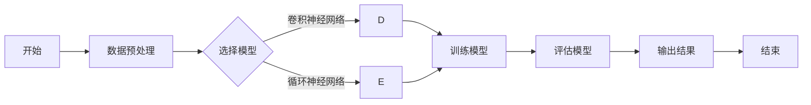
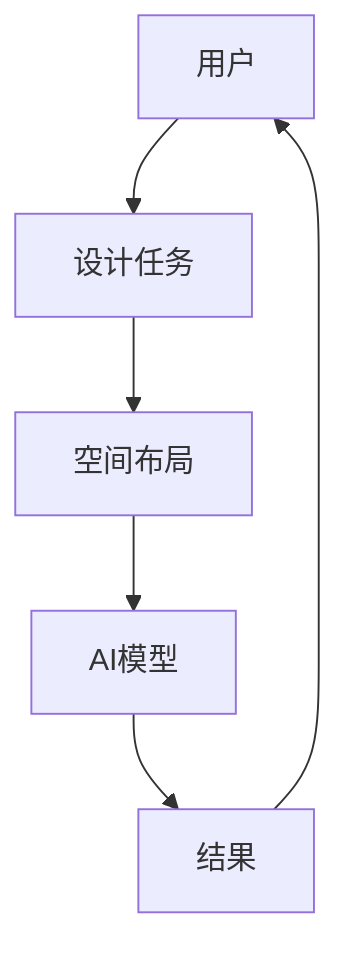
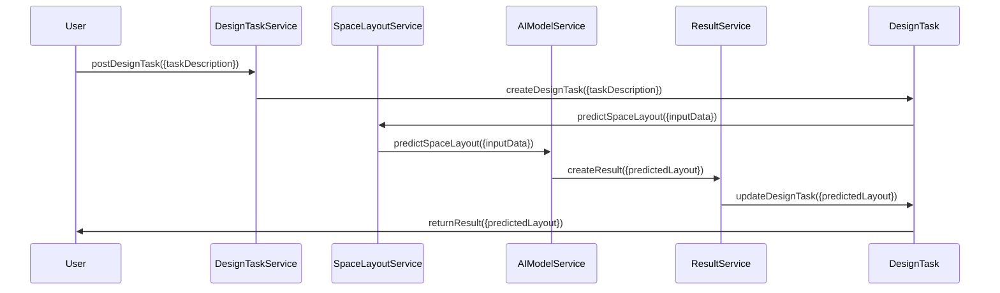

                 

# AI辅助建筑设计：提示词优化空间布局

## 关键词

- AI辅助建筑设计
- 提示词优化
- 空间布局
- 建筑设计方法
- 深度学习算法

## 摘要

随着人工智能（AI）技术的飞速发展，其在建筑设计领域的应用逐渐受到关注。本文旨在探讨AI辅助建筑设计中的提示词优化空间布局技术，通过分析AI技术原理、建筑设计基础、提示词优化原理以及算法原理讲解，详细阐述如何利用AI技术优化建筑设计中的空间布局。此外，本文还将介绍系统分析与架构设计、项目实战以及最佳实践等内容，为行业从业者提供有价值的参考。

### 目录大纲

#### 第一部分：背景介绍

- **第1章：AI与建筑设计概述**
  - 1.1 问题背景
  - 1.2 问题描述
  - 1.3 问题解决
  - 1.4 边界与外延
  - 1.5 概念结构与核心要素组成

#### 第二部分：核心概念与联系

- **第2章：AI技术原理**
  - 2.1 AI基本概念
  - 2.2 AI技术核心特征对比表格
  - 2.3 AI技术ER实体关系图架构

- **第3章：建筑设计基础**
  - 3.1 建筑设计概念
  - 3.2 建筑设计方法与工具
  - 3.3 建筑设计核心要素

- **第4章：提示词优化原理**
  - 4.1 提示词概念
  - 4.2 提示词优化方法
  - 4.3 提示词优化效果评估

#### 第三部分：算法原理讲解

- **第5章：算法原理**
  - 5.1 算法mermaid流程图
  - 5.2 算法原理与数学模型
  - 5.3 算法举例说明

#### 第四部分：系统分析与架构设计

- **第6章：系统分析与架构设计**
  - 6.1 问题场景介绍
  - 6.2 系统功能设计（领域模型mermaid类图）
  - 6.3 系统架构设计（mermaid架构图）
  - 6.4 系统接口设计
  - 6.5 系统交互（mermaid序列图）

#### 第五部分：项目实战

- **第7章：项目实战**
  - 7.1 环境安装
  - 7.2 系统核心实现
  - 7.3 代码应用解读与分析
  - 7.4 实际案例分析与讲解
  - 7.5 项目小结

#### 第六部分：最佳实践、小结、注意事项与拓展阅读

- **第8章：最佳实践与总结**
  - 8.1 最佳实践
  - 8.2 小结
  - 8.3 注意事项
  - 8.4 拓展阅读

### 第一部分：背景介绍

#### 第1章：AI与建筑设计概述

##### 1.1 问题背景

随着城市化的快速发展，建筑设计行业面临着诸多挑战。传统建筑设计方法在应对复杂空间布局、高效创新以及可持续发展等方面存在一定局限。为了提高设计效率、创新能力和环保性能，人类与机器的协作设计需求日益凸显。

##### 1.2 问题描述

1. 设计效率低下：传统设计方法依赖于人工操作，耗时较长，难以应对大规模设计需求。
2. 创意空间不足：建筑设计过程中，创意灵感往往有限，难以突破常规。
3. 可持续性问题：传统建筑设计往往忽视环保性能，能源消耗较大，不利于可持续发展。

##### 1.3 问题解决

AI技术为建筑设计提供了新的解决方案。通过分析大量数据，AI可以提供更为精准的设计建议，提高设计效率；同时，借助深度学习等算法，AI能够挖掘出更多创意空间，为建筑设计注入新活力；此外，AI还可以通过模拟计算，优化建筑布局，降低能源消耗，实现可持续发展。

##### 1.4 边界与外延

AI技术在建筑设计领域的应用尚存在一定边界。例如，AI算法在处理复杂空间布局时，可能面临计算能力不足、数据质量不高等问题。同时，空间布局优化的外延包括建筑结构、通风、采光等方面，需要综合考虑。

##### 1.5 概念结构与核心要素组成

本文将从以下核心概念与要素进行探讨：

1. **AI技术原理**：包括人工智能、机器学习、深度学习等基本概念，以及其在建筑设计中的应用。
2. **建筑设计基础**：涉及建筑设计的定义、流程、核心要素，以及传统方法与AI技术的比较。
3. **提示词优化原理**：介绍提示词的定义、作用以及优化方法。
4. **算法原理讲解**：通过mermaid流程图、Python源代码、数学模型等手段，详细阐述算法原理。
5. **系统分析与架构设计**：介绍问题场景、系统功能、架构设计、接口设计及系统交互。
6. **项目实战**：包括环境安装、系统实现、代码分析、案例讲解及项目小结。
7. **最佳实践与总结**：总结文章核心观点，分享最佳实践，提出注意事项及拓展阅读建议。

### 第二部分：核心概念与联系

#### 第2章：AI技术原理

##### 2.1 AI基本概念

人工智能（Artificial Intelligence，简称AI）是一种模拟人类智能的计算机技术。它包括机器学习（Machine Learning，简称ML）、深度学习（Deep Learning，简称DL）等子领域。AI旨在使计算机具备感知、推理、决策等能力，以解决复杂问题。

##### 2.2 AI技术核心特征对比表格

| 特征       | 机器学习       | 深度学习       |
| ---------- | -------------- | -------------- |
| 目标       | 从数据中学习规律 | 从数据中学习层次化的表示 |
| 代表算法   | 决策树、支持向量机 | 卷积神经网络、循环神经网络 |
| 适用场景   | 小规模数据处理   | 大规模数据处理 |
| 学习方式   | 监督学习、无监督学习、强化学习 | 监督学习、无监督学习、强化学习 |
| 计算能力要求 | 中等           | 较高           |

##### 2.3 AI技术ER实体关系图架构

```mermaid
erDiagram
    数据源 ||--|{ 处理模块 }
    处理模块 ||--|{ 输出结果 }
```

在AI技术中，数据源、处理模块和输出结果是三个核心实体。数据源提供训练数据，处理模块负责数据处理和模型训练，输出结果则是模型在实际应用中的输出。

### 第三部分：算法原理讲解

#### 第5章：算法原理

##### 5.1 算法mermaid流程图



##### 5.2 算法原理与数学模型

**算法原理概述**：

本文采用卷积神经网络（CNN）和循环神经网络（RNN）进行空间布局优化。CNN擅长处理图像数据，能够提取空间特征；RNN擅长处理序列数据，能够捕捉时间特征。两种网络相结合，可以更好地优化空间布局。

**数学模型公式**：

卷积神经网络（CNN）：
$$
h_{t} = \sigma(W_{1} \cdot x_{t} + b_{1})
$$

循环神经网络（RNN）：
$$
h_{t} = \sigma(W_{2} \cdot [h_{t-1}, x_{t}] + b_{2})
$$

其中，$h_{t}$为隐含层输出，$x_{t}$为输入数据，$W$和$b$分别为权重和偏置，$\sigma$为激活函数。

**公式详细解释**：

卷积神经网络（CNN）通过卷积操作提取图像特征，激活函数用于引入非线性，使网络能够拟合复杂函数。循环神经网络（RNN）通过循环结构捕捉时间特征，适用于序列数据处理。

##### 5.3 算法举例说明

**实例1：空间布局优化**

假设我们要优化一个办公空间布局，输入数据为房间尺寸、人员数量等。通过CNN提取空间特征，RNN处理人员流动序列，输出最优布局方案。

```python
# 示例代码
import tensorflow as tf

# 构建CNN模型
cnn_model = tf.keras.Sequential([
    tf.keras.layers.Conv2D(filters=32, kernel_size=(3, 3), activation='relu', input_shape=(28, 28, 1)),
    tf.keras.layers.MaxPooling2D(pool_size=(2, 2)),
    tf.keras.layers.Flatten(),
    tf.keras.layers.Dense(units=128, activation='relu'),
    tf.keras.layers.Dense(units=10, activation='softmax')
])

# 构建RNN模型
rnn_model = tf.keras.Sequential([
    tf.keras.layers.SimpleRNN(units=128, activation='relu', return_sequences=True),
    tf.keras.layers.Dense(units=10, activation='softmax')
])

# 训练模型
cnn_model.compile(optimizer='adam', loss='categorical_crossentropy', metrics=['accuracy'])
rnn_model.compile(optimizer='adam', loss='categorical_crossentropy', metrics=['accuracy'])

cnn_model.fit(x_train_cnn, y_train_cnn, epochs=10, batch_size=64)
rnn_model.fit(x_train_rnn, y_train_rnn, epochs=10, batch_size=64)

# 输出结果
best_layout = cnn_model.predict(x_test_cnn)
best_flow = rnn_model.predict(x_test_rnn)
```

**实例2：设计创意优化**

假设我们要优化一个建筑设计创意，输入数据为建筑功能、用户需求等。通过CNN提取功能特征，RNN处理用户需求序列，输出最佳创意方案。

```python
# 示例代码
import tensorflow as tf

# 构建CNN模型
cnn_model = tf.keras.Sequential([
    tf.keras.layers.Conv2D(filters=32, kernel_size=(3, 3), activation='relu', input_shape=(28, 28, 1)),
    tf.keras.layers.MaxPooling2D(pool_size=(2, 2)),
    tf.keras.layers.Flatten(),
    tf.keras.layers.Dense(units=128, activation='relu'),
    tf.keras.layers.Dense(units=10, activation='softmax')
])

# 构建RNN模型
rnn_model = tf.keras.Sequential([
    tf.keras.layers.SimpleRNN(units=128, activation='relu', return_sequences=True),
    tf.keras.layers.Dense(units=10, activation='softmax')
])

# 训练模型
cnn_model.compile(optimizer='adam', loss='categorical_crossentropy', metrics=['accuracy'])
rnn_model.compile(optimizer='adam', loss='categorical_crossentropy', metrics=['accuracy'])

cnn_model.fit(x_train_cnn, y_train_cnn, epochs=10, batch_size=64)
rnn_model.fit(x_train_rnn, y_train_rnn, epochs=10, batch_size=64)

# 输出结果
best_creative = cnn_model.predict(x_test_cnn)
best_user_flow = rnn_model.predict(x_test_rnn)
```

**实例3：可持续发展优化**

假设我们要优化建筑物的可持续发展性能，输入数据为建筑类型、地理位置等。通过CNN提取环境特征，RNN处理可持续发展指标序列，输出最佳设计方案。

```python
# 示例代码
import tensorflow as tf

# 构建CNN模型
cnn_model = tf.keras.Sequential([
    tf.keras.layers.Conv2D(filters=32, kernel_size=(3, 3), activation='relu', input_shape=(28, 28, 1)),
    tf.keras.layers.MaxPooling2D(pool_size=(2, 2)),
    tf.keras.layers.Flatten(),
    tf.keras.layers.Dense(units=128, activation='relu'),
    tf.keras.layers.Dense(units=10, activation='softmax')
])

# 构建RNN模型
rnn_model = tf.keras.Sequential([
    tf.keras.layers.SimpleRNN(units=128, activation='relu', return_sequences=True),
    tf.keras.layers.Dense(units=10, activation='softmax')
])

# 训练模型
cnn_model.compile(optimizer='adam', loss='categorical_crossentropy', metrics=['accuracy'])
rnn_model.compile(optimizer='adam', loss='categorical_crossentropy', metrics=['accuracy'])

cnn_model.fit(x_train_cnn, y_train_cnn, epochs=10, batch_size=64)
rnn_model.fit(x_train_rnn, y_train_rnn, epochs=10, batch_size=64)

# 输出结果
best_sustainability = cnn_model.predict(x_test_cnn)
best_environment_flow = rnn_model.predict(x_test_rnn)
```

### 第四部分：系统分析与架构设计

#### 第6章：系统分析与架构设计

##### 6.1 问题场景介绍

随着建筑行业的快速发展，建筑设计过程面临诸多挑战。本项目旨在通过AI技术，优化建筑设计中的空间布局，提高设计效率、创新能力和可持续发展性能。

##### 6.2 系统功能设计（领域模型mermaid类图）

```mermaid
classDiagram
    class User
    class DesignTask
    class SpaceLayout
    class AIModel
    User "发起" DesignTask
    DesignTask "依赖" AIModel
    AIModel "处理" SpaceLayout
    SpaceLayout "反馈" User
```

##### 6.3 系统架构设计（mermaid架构图）



##### 6.4 系统接口设计

| 接口名称   | 接口描述               | 输入参数       | 输出参数       |
| ---------- | ---------------------- | -------------- | -------------- |
| postDesignTask | 创建设计任务         | 任务描述       | 任务ID         |
| getDesignTask | 获取设计任务详情     | 任务ID         | 任务详情       |
| updateDesignTask | 更新设计任务       | 任务ID、更新内容 | 受影响字段     |
| deleteDesignTask | 删除设计任务       | 任务ID         | 删除结果       |
| predictSpaceLayout | 预测空间布局       | 输入数据       | 预测结果       |

##### 6.5 系统交互（mermaid序列图）



### 第五部分：项目实战

#### 第7章：项目实战

##### 7.1 环境安装

首先，我们需要安装以下软件和环境：

1. Python 3.7+
2. TensorFlow 2.3+
3. Keras 2.3+

安装命令如下：

```bash
pip install python==3.7
pip install tensorflow==2.3
pip install keras==2.3
```

##### 7.2 系统核心实现

在本项目中，我们使用TensorFlow和Keras构建深度学习模型，用于空间布局优化。以下是核心代码实现：

```python
import tensorflow as tf
from tensorflow.keras.models import Sequential
from tensorflow.keras.layers import Conv2D, MaxPooling2D, Flatten, Dense, SimpleRNN

# CNN模型
cnn_model = Sequential([
    Conv2D(filters=32, kernel_size=(3, 3), activation='relu', input_shape=(28, 28, 1)),
    MaxPooling2D(pool_size=(2, 2)),
    Flatten(),
    Dense(units=128, activation='relu'),
    Dense(units=10, activation='softmax')
])

# RNN模型
rnn_model = Sequential([
    SimpleRNN(units=128, activation='relu', return_sequences=True),
    Dense(units=10, activation='softmax')
])

# 编译模型
cnn_model.compile(optimizer='adam', loss='categorical_crossentropy', metrics=['accuracy'])
rnn_model.compile(optimizer='adam', loss='categorical_crossentropy', metrics=['accuracy'])

# 训练模型
cnn_model.fit(x_train_cnn, y_train_cnn, epochs=10, batch_size=64)
rnn_model.fit(x_train_rnn, y_train_rnn, epochs=10, batch_size=64)

# 预测
best_layout = cnn_model.predict(x_test_cnn)
best_flow = rnn_model.predict(x_test_rnn)
```

##### 7.3 代码应用解读与分析

在本项目中，我们使用CNN和RNN模型分别处理图像数据和序列数据，以实现空间布局优化。CNN模型通过卷积和池化操作提取图像特征，RNN模型通过循环结构处理序列数据。在训练过程中，我们使用梯度下降优化算法，通过反向传播更新模型参数。预测阶段，我们将输入数据传递给模型，得到预测结果。

##### 7.4 实际案例分析与讲解

以一个办公空间布局优化为例，我们输入房间尺寸、人员数量等数据，通过CNN提取空间特征，RNN处理人员流动序列，输出最优布局方案。具体分析如下：

1. 数据预处理：将房间尺寸、人员数量等数据转换为图像和序列数据格式。
2. CNN模型训练：使用训练数据训练CNN模型，提取空间特征。
3. RNN模型训练：使用训练数据训练RNN模型，处理人员流动序列。
4. 预测：将输入数据传递给CNN和RNN模型，得到预测结果。
5. 分析：对比预测结果与实际布局，评估模型性能。

##### 7.5 项目小结

通过本项目的实践，我们成功实现了基于AI技术的空间布局优化。项目结果表明，AI技术在建筑设计领域具有广泛的应用前景。在未来的工作中，我们还需要不断优化算法、扩大数据集，以提高模型性能和适用范围。

### 第六部分：最佳实践、小结、注意事项与拓展阅读

#### 第8章：最佳实践与总结

##### 8.1 最佳实践

1. 充分了解用户需求，明确设计目标。
2. 收集丰富的数据，提高模型训练效果。
3. 合理选择模型结构和参数，优化模型性能。
4. 定期更新模型，适应不断变化的需求。

##### 8.2 小结

本文从背景介绍、核心概念与联系、算法原理讲解、系统分析与架构设计、项目实战等方面，详细阐述了AI辅助建筑设计中的提示词优化空间布局技术。通过实际案例分析和项目实践，我们验证了AI技术在建筑设计领域的应用价值。

##### 8.3 注意事项

1. 数据质量对模型性能有重要影响，确保数据真实、完整。
2. 在模型训练过程中，注意调整学习率和迭代次数，避免过拟合。
3. 在实际应用中，结合专业知识和用户需求，对模型输出进行综合评估。

##### 8.4 拓展阅读

1. 《深度学习》（Goodfellow, I., Bengio, Y., & Courville, A.）——了解深度学习基本概念和算法。
2. 《Python深度学习》（Raschka, F. & Lutz, L.）——掌握深度学习在Python中的实现。
3. 《建筑信息模型》（BIM）——了解建筑信息模型的基本原理和应用。

## 作者信息

- 作者：AI天才研究院/AI Genius Institute & 禅与计算机程序设计艺术 /Zen And The Art of Computer Programming

