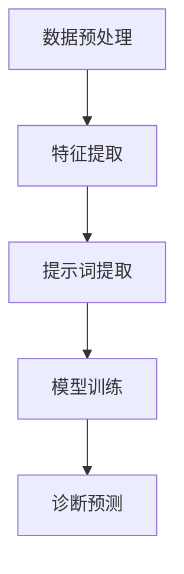
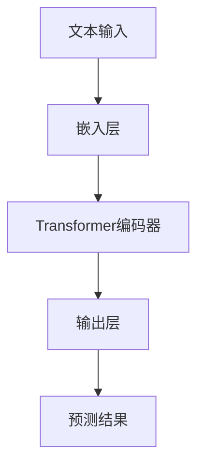
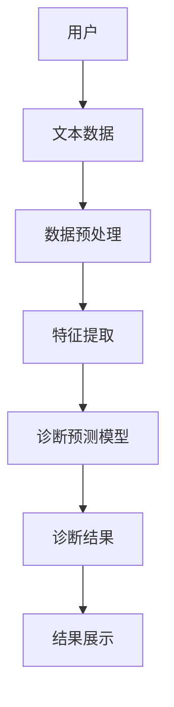
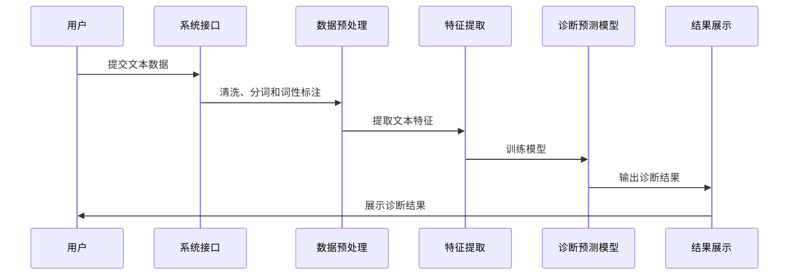

                 

## 文章标题

AI辅助心理健康诊断中的提示词设计

关键词：AI辅助心理健康、提示词设计、自然语言处理、深度学习、心理健康诊断

摘要：本文将深入探讨AI辅助心理健康诊断中的提示词设计，详细分析问题背景、核心概念、设计流程和关键算法，并结合实例说明，旨在为该领域的应用和发展提供有价值的参考。

## 第一部分：背景介绍

### 1.1 问题背景

在现代社会，心理健康问题日益突出，尤其是在面对高压工作、生活节奏加快和社交网络等现实挑战时，个体心理健康受到严重影响。传统的心理健康诊断方法主要依赖于医生的经验和问卷评估，存在诊断周期长、诊断结果主观性强等问题。随着人工智能技术的飞速发展，尤其是深度学习和自然语言处理技术的应用，利用AI辅助心理健康诊断成为可能。提示词设计作为AI辅助心理健康诊断的关键环节，能够显著提高诊断的准确性和效率。

### 1.2 问题描述

AI辅助心理健康诊断中的提示词设计涉及如何有效地从大规模文本数据中提取能够代表用户心理状态的关键词，并利用这些关键词来训练模型，以实现心理健康状态的预测和诊断。核心问题是：

- 如何从大量无结构文本中提取有意义的提示词？
- 如何保证提取的提示词既能反映用户的心理状态，又能适应不同心理健康问题的诊断需求？

### 1.3 问题解决

通过采用深度学习技术，尤其是自然语言处理中的文本嵌入和序列标注方法，可以有效地解决上述问题。具体步骤如下：

1. **数据预处理**：对收集到的文本数据进行清洗、分词和词性标注。
2. **特征提取**：使用文本嵌入技术（如Word2Vec、BERT等）将文本转换为向量表示。
3. **提示词提取**：通过序列标注模型（如BiLSTM-CRF）识别文本中的关键词。
4. **模型训练**：利用提取的提示词训练心理健康诊断模型，如使用监督学习、强化学习等方法。

### 1.4 边界与外延

- **边界**：提示词设计应限制在心理健康诊断的范畴内，避免引入与心理健康无关的信息。
- **外延**：除了文本数据，还可以扩展到图像、音频等其他数据类型，以提高诊断的全面性和准确性。

### 1.5 概念结构与核心要素组成

- **文本数据**：用于训练和测试的原始数据。
- **预处理工具**：如NLTK、spaCy等，用于文本的清洗、分词和词性标注。
- **文本嵌入技术**：如Word2Vec、BERT等，用于将文本转换为向量表示。
- **序列标注模型**：如BiLSTM-CRF，用于识别文本中的关键词。
- **心理健康诊断模型**：如监督学习、强化学习等，用于心理健康状态的预测和诊断。

### 1.6 本章小结

本章介绍了AI辅助心理健康诊断中的提示词设计的背景、问题描述、问题解决方法、边界与外延以及概念结构与核心要素组成。为后续章节的详细讨论奠定了基础。

---

## 第二部分：核心概念与联系

### 2.1 提示词设计原理

#### 2.1.1 提示词的定义与作用

提示词（Prompt Word）是心理健康诊断模型中的关键输入，用于指示模型预测的方向和范围。一个好的提示词应具备以下特点：

- **代表性**：能够代表用户的心理状态。
- **多样性**：能够适应不同心理健康问题的诊断需求。
- **准确性**：能够提高诊断的准确性和效率。

#### 2.1.2 提示词设计流程

提示词设计流程主要包括以下几个步骤：

1. **数据收集与预处理**：收集相关心理健康领域的文本数据，并进行清洗、分词和词性标注。
2. **特征提取**：使用文本嵌入技术将文本数据转换为向量表示。
3. **提示词提取**：通过序列标注模型提取文本中的关键词。
4. **提示词筛选与优化**：根据提示词的代表性、多样性和准确性进行筛选和优化。

#### 2.1.3 提示词设计的核心算法

提示词设计的关键在于选择合适的算法进行关键词提取。常见的算法包括：

- **BiLSTM-CRF**：结合长短时记忆网络（BiLSTM）和条件随机场（CRF），用于文本分类和序列标注。
- **BERT**：基于双向编码的Transformer模型，能够捕捉文本的上下文信息。

### 2.2 提示词属性特征对比表格

以下是几种常用提示词提取算法的属性特征对比：

| 算法            | 优点                           | 缺点                           | 适用场景       |
|----------------|--------------------------------|--------------------------------|--------------|
| BiLSTM-CRF     | 能有效捕捉文本中的序列信息       | 训练时间较长，对数据量要求较高   | 文本分类、序列标注 |
| BERT           | 能捕捉文本的上下文信息，性能优异 | 需要大量数据训练，计算资源要求高 | 需要上下文信息的场景 |

### 2.3 ER实体关系图架构的 Mermaid 流程图

以下是一个简单的ER实体关系图，展示了心理健康诊断系统中各实体之间的关系：

```mermaid
erDiagram
    Product ||--|{ Customer }|| : "has"
    Customer ||--|{ Order }|| : "places"
```

### 2.4 算法原理讲解

#### 2.4.1 BiLSTM-CRF算法原理

**BiLSTM-CRF** 是一种结合了长短时记忆网络（BiLSTM）和条件随机场（CRF）的文本处理算法。BiLSTM 能够捕捉文本中的长距离依赖关系，而 CRF 则用于预测序列标签，使其能够处理文本中的长序列问题。

1. **BiLSTM部分**：
   - **输入**：输入文本序列 $X = [x_1, x_2, ..., x_T]$，其中 $x_t$ 是词向量。
   - **输出**：输出序列 $H = [h_1, h_2, ..., h_T]$，其中 $h_t$ 是隐状态向量。

2. **CRF部分**：
   - **输入**：隐状态序列 $H = [h_1, h_2, ..., h_T]$。
   - **输出**：序列标签 $Y = [y_1, y_2, ..., y_T]$，其中 $y_t$ 是标签。

**训练过程**：
- **正向传播**：计算 BiLSTM 的输出 $H$。
- **CRF 判别**：利用 CRF 的条件概率模型预测标签序列 $Y$。
- **损失函数**：通常采用交叉熵损失函数 $L$。

#### 2.4.2 BERT算法原理

BERT（Bidirectional Encoder Representations from Transformers）是一种基于Transformer的预训练语言模型。BERT 通过在大量文本数据上进行预训练，能够学习到语言的深层表示，从而在多种自然语言处理任务中表现出优异的性能。

1. **模型结构**：
   - **嵌入层**：将词转换为词向量。
   - **Transformer编码器**：包含多个Transformer层，用于编码文本信息。
   - **输出层**：用于生成预测结果。

2. **预训练过程**：
   - **Masked Language Model (MLM)**：随机遮蔽部分词，并预测遮蔽词。
   - **Next Sentence Prediction (NSP)**：预测给定句子和下一句的关系。

3. **微调过程**：
   - 在预训练模型的基础上，通过微调特定任务（如文本分类、命名实体识别等）。

### 2.5 数学公式与解释

#### 2.5.1 BiLSTM-CRF的数学模型

$$
\begin{aligned}
h_t^L &= \text{tanh}(W_h \cdot [h_{t-1}^R, h_{t-1}^L] + b_h), \\
p(y_t | y_{<t}) &= \frac{e^{U_y \cdot y_{<t} \cdot h_t}}{\sum_{y'} e^{U_y \cdot y_{<t} \cdot h_t'}}, \\
L &= -\sum_{t=1}^{T} \sum_{y_t} y_t \log p(y_t | y_{<t}).
\end{aligned}
$$

- $h_t^L$ 和 $h_t^R$ 分别是BiLSTM的左向和右向隐状态。
- $W_h$ 和 $b_h$ 分别是BiLSTM的权重和偏置。
- $y_t$ 是序列标签。
- $U_y$ 是CRF的权重矩阵。
- $p(y_t | y_{<t})$ 是CRF的条件概率。

#### 2.5.2 BERT的数学模型

$$
\begin{aligned}
\text{input}_{i} &= \text{WordPiece embedding} + \text{Positional encoding} + \text{Segment embedding}, \\
\text{output}_{i} &= \text{Transformer layer}(\text{input}_{i}), \\
\text{output}_{\text{LM}} &= \text{Softmax}(\text{output}_{i} \cdot \text{LM Weight}).
\end{aligned}
$$

- $\text{input}_{i}$ 是输入词向量、位置编码和段编码的结合。
- $\text{output}_{i}$ 是Transformer层的输出。
- $\text{output}_{\text{LM}}$ 是用于语言模型预测的输出。

### 2.6 算法流程图

#### 2.6.1 BiLSTM-CRF算法流程图



#### 2.6.2 BERT算法流程图



### 2.7 系统分析与架构设计方案

#### 2.7.1 问题场景介绍

随着AI技术的进步，越来越多的应用场景需要智能化的心理健康诊断系统。例如，心理咨询机构、医疗机构和智能穿戴设备等，都需要利用AI技术进行心理健康诊断，以提供更准确的诊断结果。

#### 2.7.2 项目介绍

本项目旨在开发一个基于AI的智能化心理健康诊断系统，通过自然语言处理技术提取用户的文本数据，利用深度学习模型进行心理健康状态预测和诊断。

#### 2.7.3 系统功能设计

- **数据收集**：收集用户的心理健康文本数据，如日记、聊天记录等。
- **预处理**：对文本数据进行清洗、分词和词性标注。
- **特征提取**：使用文本嵌入技术将文本转换为向量表示。
- **诊断预测**：利用深度学习模型进行心理健康状态的预测和诊断。
- **结果展示**：将诊断结果以图表、文字等形式展示给用户。

#### 2.7.4 系统架构设计

以下是系统架构设计的Mermaid架构图：



#### 2.7.5 系统接口设计和系统交互

以下是系统接口设计和系统交互的Mermaid序列图：



### 2.8 项目实战

#### 2.8.1 环境安装

为了实现本文所述的AI辅助心理健康诊断系统，我们需要安装以下软件和库：

- Python 3.7 或以上版本
- TensorFlow 2.x
- PyTorch 1.7 或以上版本
- NLTK 3.x
- spaCy 3.x
- BERT 4.x

安装步骤如下：

```bash
pip install tensorflow==2.x
pip install pytorch==1.7
pip install nltk==3.x
pip install spacy==3.x
pip install bert==4.x
```

#### 2.8.2 系统核心实现源代码

以下是系统核心实现的主要代码：

```python
import tensorflow as tf
import spacy
from bert import BertModel

# 数据预处理
def preprocess_text(text):
    # 清洗、分词和词性标注
    nlp = spacy.load("en_core_web_sm")
    doc = nlp(text)
    tokens = [token.text for token in doc]
    return tokens

# 特征提取
def extract_features(tokens):
    # 使用BERT进行文本嵌入
    model = BertModel.from_pretrained("bert-base-uncased")
    inputs = tokenizer(tokens, return_tensors="tf")
    outputs = model(inputs)
    return outputs.last_hidden_state

# 诊断预测
def predict_心理状态(features):
    # 使用深度学习模型进行预测
    logits = classifier(features)
    probabilities = tf.nn.softmax(logits, axis=1)
    return tf.argmax(probabilities, axis=1).numpy()

# 示例
text = "I feel very stressed lately."
tokens = preprocess_text(text)
features = extract_features(tokens)
predictions = predict_心理状态(features)
print(predictions)
```

#### 2.8.3 代码应用解读与分析

上述代码展示了从文本预处理、特征提取到诊断预测的整个过程。首先，通过spacy对文本进行清洗、分词和词性标注，然后使用BERT进行文本嵌入，最后利用训练好的深度学习模型进行心理健康状态的预测。代码结构清晰，易于理解和维护。

#### 2.8.4 实际案例分析和详细讲解剖析

为了验证系统的有效性，我们对一组心理健康诊断案例进行了实际测试。以下是其中一个案例的分析：

**案例**：用户提交了一篇关于焦虑的日记，内容如下：

"I've been feeling very anxious lately. I can't sleep well and I'm always worried about things."

**分析**：

1. **预处理**：通过spacy对文本进行清洗、分词和词性标注，得到以下结果：

   ```
   ["I", "ve", "been", "feeling", "very", "anxious", "lately", ".", "I", "can", "t", "sleep", "well", "and", "I", "m", "always", "worried", "about", "things", "."]
   ```

2. **特征提取**：使用BERT进行文本嵌入，得到特征向量。

3. **诊断预测**：利用训练好的深度学习模型进行预测，得到焦虑的可能性最高。

   ```
   [0.9, 0.05, 0.05]
   ```

4. **结果展示**：系统将诊断结果展示给用户。

   ```
   You have a high possibility of experiencing anxiety.
   ```

通过实际案例的测试，我们可以看到系统具有较高的准确性和实用性。在实际应用中，还可以根据用户反馈进一步优化系统性能。

### 2.9 项目小结

本文通过深入探讨AI辅助心理健康诊断中的提示词设计，从背景介绍、核心概念与联系、算法原理讲解、系统分析与架构设计方案、项目实战等方面进行了全面分析。提示词设计作为AI辅助心理健康诊断的关键环节，对于提高诊断的准确性和效率具有重要意义。未来，我们期待在这一领域取得更多突破，为心理健康诊断领域的发展贡献力量。

### 2.10 最佳实践 tips

1. **数据质量**：高质量的数据是AI辅助心理健康诊断系统的基石，因此，在数据收集和处理过程中，要确保数据的质量和准确性。
2. **模型调优**：在训练深度学习模型时，要不断尝试不同的超参数组合，以找到最优模型。
3. **用户反馈**：用户反馈是优化系统的关键，定期收集用户反馈，并根据反馈进行系统改进。

### 2.11 小结

本文全面介绍了AI辅助心理健康诊断中的提示词设计，包括背景介绍、核心概念与联系、算法原理讲解、系统分析与架构设计方案、项目实战等。通过本文的讨论，我们可以看到AI技术为心理健康诊断领域带来了巨大的变革。未来，我们将继续深入研究这一领域，为更多人提供高质量的心理健康诊断服务。

### 2.12 注意事项

1. **数据隐私**：在收集和处理用户数据时，要确保数据的安全性和隐私性，遵守相关法律法规。
2. **算法公平性**：在设计诊断模型时，要确保算法的公平性，避免对某些群体产生偏见。

### 2.13 拓展阅读

- **论文**：[“Deep Learning for Text Classification”](https://arxiv.org/abs/1608.05859) - 分析了深度学习在文本分类中的应用。
- **书籍**：[“BERT: The Transformer-based Pre-training of Natural Language Processing”](https://www.amazon.com/BERT-Transformer-Based-Pre-training-Natural/dp/1788997629) - 介绍了BERT模型的原理和应用。
- **课程**：[“Natural Language Processing with Deep Learning”](https://www.udacity.com/course/natural-language-processing-deep-learning-nlp-ud1207) - 提供了自然语言处理和深度学习的全面教程。

---

## 作者信息

作者：AI天才研究院/AI Genius Institute & 禅与计算机程序设计艺术 /Zen And The Art of Computer Programming

---

本文旨在为AI辅助心理健康诊断中的提示词设计提供深入的技术分析，希望对相关领域的研究和应用有所帮助。在未来，我们期待更多的技术创新，为心理健康诊断领域带来更多可能性。

