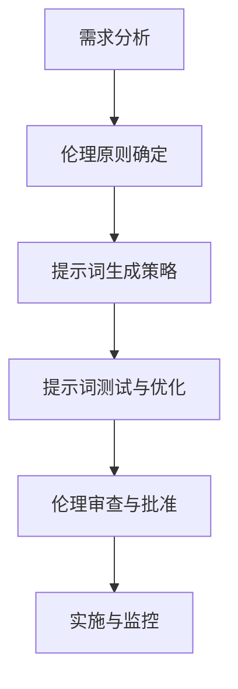

                 

### 第1章：问题背景与核心概念

#### 1.1 问题背景

**心理健康问题的普遍性**

在全球范围内，心理健康问题正日益成为严重的社会问题。根据世界卫生组织（WHO）的数据，全球约有3.5亿人患有抑郁症，而焦虑症的患者更是高达约3亿。这些心理健康问题不仅对个人的生活质量造成严重影响，也对整个社会产生了深远的影响。研究表明，抑郁症和焦虑症等心理疾病每年导致数百万人失去工作能力，甚至会导致自杀等极端后果。此外，这些心理健康问题还可能引发其他生理疾病，如心脏病、糖尿病等，进一步加重了社会的医疗负担。

**传统的心理咨询方法限制**

传统的心理咨询方法包括面对面的心理咨询、团体心理治疗、药物治疗等，这些方法虽然在一定程度上能够帮助患者缓解症状，但存在一些明显的局限性。首先，传统的心理咨询方法需要大量的人力资源，心理咨询师的数量远远无法满足全球范围内的心理健康需求。其次，心理咨询的过程通常较为耗时，从初步诊断到治疗可能需要数月甚至更长时间。此外，心理咨询师的工作压力也很大，长期的心理压力可能导致心理咨询师自身的心理健康问题。

**AI辅助心理咨询的优势**

人工智能（AI）的发展为心理咨询领域带来了新的契机。AI辅助心理咨询具有以下优势：

- **提高咨询效率**：AI可以快速处理大量的数据，提供即时的心理诊断和干预建议，大大提高了咨询效率。这对于那些需要快速获得帮助的患者尤为重要。
  
- **减少人力成本**：AI系统可以自动处理一些常规的心理咨询任务，如初步诊断和评估，从而减轻心理咨询师的工作负担，使他们能够将更多精力投入到复杂和需要高度专业化的咨询工作中。

- **个性化服务**：AI系统可以利用大数据和机器学习算法，根据患者的个人情况和历史数据，提供个性化的心理咨询服务。这有助于提高患者的满意度和治疗效果。

#### 1.2 AI在心理咨询中的应用

**定义、工作原理和应用场景**

**定义**

AI辅助心理咨询是指利用人工智能技术，特别是机器学习和自然语言处理（NLP）技术，辅助心理咨询师进行心理诊断、干预和治疗的过程。

**工作原理**

AI辅助心理咨询的工作原理主要包括以下几个方面：

1. **数据收集与预处理**：AI系统会收集大量的心理健康数据，包括患者的病历、心理测试结果、文本对话记录等。然后，这些数据会经过预处理，如数据清洗、去噪声、格式化等，以便后续的分析。

2. **特征提取与建模**：通过NLP技术，AI系统可以从文本数据中提取出关键的特征，如情感倾向、主题分布等。然后，利用机器学习算法，如决策树、支持向量机（SVM）、神经网络等，建立心理诊断和干预的模型。

3. **实时诊断与干预**：在心理咨询过程中，AI系统可以实时分析患者的对话和行为，提供诊断建议和干预方案。例如，当患者表达出某些特定的情感或行为模式时，AI系统可以即时提示心理咨询师注意，并提供相应的建议。

**应用场景**

AI辅助心理咨询的应用场景非常广泛，以下是一些典型的应用场景：

1. **初诊与评估**：AI系统可以帮助心理咨询师进行初步诊断和评估，识别患者可能存在的心理健康问题，如抑郁症、焦虑症等。

2. **个性化治疗**：根据患者的个人情况和历史数据，AI系统可以为患者提供个性化的治疗方案，包括心理干预建议、药物治疗建议等。

3. **情绪监测与预警**：AI系统可以实时监测患者的情绪和行为，预警可能的抑郁症、焦虑症等心理健康问题的出现，帮助心理咨询师及时采取措施。

4. **远程咨询**：AI系统可以辅助心理咨询师进行远程心理咨询服务，减少患者就医的时间和成本。

#### 1.3 核心概念

**AI辅助心理咨询**

**定义**：AI辅助心理咨询是指利用人工智能技术，特别是机器学习和自然语言处理（NLP）技术，辅助心理咨询师进行心理诊断、干预和治疗的过程。

**工作原理**：

1. **数据收集与预处理**：AI系统会收集大量的心理健康数据，包括患者的病历、心理测试结果、文本对话记录等。然后，这些数据会经过预处理，如数据清洗、去噪声、格式化等，以便后续的分析。

2. **特征提取与建模**：通过NLP技术，AI系统可以从文本数据中提取出关键的特征，如情感倾向、主题分布等。然后，利用机器学习算法，如决策树、支持向量机（SVM）、神经网络等，建立心理诊断和干预的模型。

3. **实时诊断与干预**：在心理咨询过程中，AI系统可以实时分析患者的对话和行为，提供诊断建议和干预方案。例如，当患者表达出某些特定的情感或行为模式时，AI系统可以即时提示心理咨询师注意，并提供相应的建议。

**应用场景**：

- 初诊与评估：AI系统可以帮助心理咨询师进行初步诊断和评估，识别患者可能存在的心理健康问题，如抑郁症、焦虑症等。
- 个性化治疗：根据患者的个人情况和历史数据，AI系统可以为患者提供个性化的治疗方案，包括心理干预建议、药物治疗建议等。
- 情绪监测与预警：AI系统可以实时监测患者的情绪和行为，预警可能的抑郁症、焦虑症等心理健康问题的出现，帮助心理咨询师及时采取措施。
- 远程咨询：AI系统可以辅助心理咨询师进行远程心理咨询服务，减少患者就医的时间和成本。

**提示词伦理**

**定义**：提示词伦理是指在AI辅助心理咨询中，设计和使用提示词时需要遵循的一系列伦理原则和规范，以确保心理咨询的合法性和道德性。

**伦理原则**：

1. **尊重原则**：尊重个体的隐私和自主权，确保患者在使用AI辅助心理咨询时，能够了解AI的功能和限制，并有权选择是否接受AI的辅助。

2. **保密原则**：保护咨询过程中的隐私性，确保患者的个人信息不被泄露。

3. **知情同意原则**：在咨询过程中，患者需明确了解AI的辅助作用和限制，并在充分知情的情况下同意使用AI辅助心理咨询。

4. **公平原则**：确保AI辅助心理咨询的公平性，避免对某些群体或个体产生歧视。

5. **透明度原则**：提高AI系统的透明度，使患者和心理咨询师能够理解AI的工作原理和决策过程。

**应用**：

提示词伦理的设计和应用是AI辅助心理咨询中至关重要的一环。通过合理的提示词设计和伦理规范，可以确保AI系统在辅助心理咨询的过程中，既能发挥其优势，又不会侵犯患者的隐私权和自主权。例如，在心理咨询师与患者进行文本对话时，AI系统可以提供合适的提示词，引导对话方向，但同时需确保提示词的选用符合伦理原则，不会对患者的隐私和自主权造成侵犯。

#### 1.4 逻辑推理过程

**问题背景分析**

首先，从问题背景出发，我们了解到心理健康问题在全球范围内日益严重，而传统的心理咨询方法存在明显的局限性。这为AI辅助心理咨询提供了巨大的市场和应用空间。通过引入AI技术，我们不仅可以提高心理咨询的效率，还可以提供个性化的服务，满足广大民众的心理健康需求。

**AI辅助心理咨询的优势**

接下来，我们分析了AI辅助心理咨询的优势，包括提高咨询效率、减少人力成本、提供个性化服务等方面。这些优势使得AI辅助心理咨询成为心理健康领域的一个重要趋势。

**核心概念解析**

在核心概念部分，我们详细介绍了AI辅助心理咨询和提示词伦理的定义、工作原理和应用场景。通过对这些核心概念的深入理解，我们可以更好地把握AI辅助心理咨询的发展方向和应用前景。

**逻辑推理过程**

基于上述分析，我们可以得出以下结论：

1. **需求与市场**：心理健康问题日益严重，传统的心理咨询方法无法满足市场需求。AI辅助心理咨询能够提供更高效、个性化的服务，有望成为心理健康领域的重要解决方案。

2. **技术与伦理**：AI技术的发展为心理咨询带来了新的契机，但同时也带来了伦理挑战。提示词伦理的设计和应用是确保AI辅助心理咨询合法性和道德性的关键。

3. **未来展望**：随着AI技术的不断进步，AI辅助心理咨询有望在心理健康领域发挥更大的作用。然而，如何在技术进步的同时，确保伦理原则得到遵循，仍是一个需要深入研究和探讨的问题。

#### 1.5 总结

本章从问题背景、AI辅助心理咨询的应用和核心概念等方面，对AI辅助心理咨询中的提示词伦理设计进行了初步探讨。通过逻辑清晰的推理过程，我们明确了AI辅助心理咨询的优势和面临的挑战，并强调了提示词伦理设计的重要性。在接下来的章节中，我们将进一步深入探讨提示词伦理设计的方法和策略，以期为AI辅助心理咨询的健康发展提供有益的参考。

### 第2章：核心概念与联系

#### 2.1 AI辅助心理咨询的概念解析

**AI技术的基本原理**

人工智能（AI）是一种模拟人类智能的计算机技术。它通过算法和模型，使计算机能够模拟人类的感知、思考、学习、决策等过程。AI技术主要包括以下几个方面：

1. **机器学习（Machine Learning）**：机器学习是一种使计算机通过数据学习模式和规律的技术。它主要包括监督学习、无监督学习和强化学习等。

2. **深度学习（Deep Learning）**：深度学习是一种基于神经网络的机器学习技术。它通过多层神经网络，对大量数据进行训练，以实现复杂模式的识别和分类。

3. **自然语言处理（Natural Language Processing，NLP）**：自然语言处理是一种使计算机能够理解和生成人类语言的技术。它包括文本分析、情感分析、语音识别、机器翻译等。

**心理咨询的基本原理**

心理咨询是一种专业的心理服务，旨在帮助个体解决心理问题，提高生活质量。心理咨询的基本原理包括以下几个方面：

1. **心理诊断**：通过评估个体的心理状态和行为，确定个体是否存在心理问题，以及问题的严重程度。

2. **心理干预**：针对个体的心理问题，提供相应的干预措施，如认知行为疗法、心理辅导、药物治疗等。

3. **心理健康教育**：通过教育和培训，提高个体对心理健康的认识和应对能力，预防心理问题的发生。

**AI辅助心理咨询的工作原理**

AI辅助心理咨询是通过人工智能技术，辅助心理咨询师进行心理诊断、干预和治疗的过程。其工作原理主要包括以下几个步骤：

1. **数据收集与预处理**：收集心理健康相关的数据，如病历、心理测试结果、文本对话记录等。然后，对这些数据进行预处理，如数据清洗、去噪声、格式化等。

2. **特征提取与建模**：通过自然语言处理技术，从文本数据中提取关键的特征，如情感倾向、主题分布等。然后，利用机器学习算法，如决策树、支持向量机（SVM）、神经网络等，建立心理诊断和干预的模型。

3. **实时诊断与干预**：在心理咨询过程中，AI系统可以实时分析患者的对话和行为，提供诊断建议和干预方案。例如，当患者表达出某些特定的情感或行为模式时，AI系统可以即时提示心理咨询师注意，并提供相应的建议。

**应用场景**

AI辅助心理咨询的应用场景非常广泛，以下是一些典型的应用场景：

1. **初诊与评估**：AI系统可以帮助心理咨询师进行初步诊断和评估，识别患者可能存在的心理健康问题，如抑郁症、焦虑症等。

2. **个性化治疗**：根据患者的个人情况和历史数据，AI系统可以为患者提供个性化的治疗方案，包括心理干预建议、药物治疗建议等。

3. **情绪监测与预警**：AI系统可以实时监测患者的情绪和行为，预警可能的抑郁症、焦虑症等心理健康问题的出现，帮助心理咨询师及时采取措施。

4. **远程咨询**：AI系统可以辅助心理咨询师进行远程心理咨询服务，减少患者就医的时间和成本。

#### 2.2 提示词伦理的概念解析

**提示词的定义**

提示词是指AI系统在心理咨询过程中，为心理咨询师提供的一种辅助工具。它通过分析和理解患者的对话内容，提供合适的建议、问题或话题，以引导心理咨询的顺利进行。提示词可以包括文字、图片、音频等多种形式。

**提示词在心理咨询中的作用**

1. **提高咨询效率**：提示词可以帮助心理咨询师快速找到关键信息，提高咨询的效率。

2. **提供个性化服务**：通过分析患者的对话内容和历史数据，提示词可以为患者提供个性化的建议和干预方案。

3. **减少咨询师工作压力**：提示词可以辅助心理咨询师处理一些常规的任务，如问题分类、情感分析等，从而减轻心理咨询师的工作压力。

**伦理原则**

在AI辅助心理咨询中，提示词的设计和应用需要遵循一系列伦理原则，以确保心理咨询的合法性和道德性。主要的伦理原则包括：

1. **尊重原则**：尊重个体的隐私和自主权，确保患者在使用AI辅助心理咨询时，能够了解AI的功能和限制，并有权选择是否接受AI的辅助。

2. **保密原则**：保护咨询过程中的隐私性，确保患者的个人信息不被泄露。

3. **知情同意原则**：在咨询过程中，患者需明确了解AI的辅助作用和限制，并在充分知情的情况下同意使用AI辅助心理咨询。

4. **公平原则**：确保AI辅助心理咨询的公平性，避免对某些群体或个体产生歧视。

5. **透明度原则**：提高AI系统的透明度，使患者和心理咨询师能够理解AI的工作原理和决策过程。

**应用**

提示词伦理的设计和应用是AI辅助心理咨询中至关重要的一环。通过合理的提示词设计和伦理规范，可以确保AI系统在辅助心理咨询的过程中，既能发挥其优势，又不会侵犯患者的隐私权和自主权。例如，在心理咨询师与患者进行文本对话时，AI系统可以提供合适的提示词，引导对话方向，但同时需确保提示词的选用符合伦理原则，不会对患者的隐私和自主权造成侵犯。

#### 2.3 逻辑推理过程

**AI技术的基本原理**

首先，我们分析了AI技术的基本原理，包括机器学习、深度学习和自然语言处理等。这些技术为AI辅助心理咨询提供了强大的技术支持。通过这些技术，AI系统能够从大量的心理健康数据中提取关键信息，为心理咨询师提供辅助。

**心理咨询的基本原理**

接着，我们介绍了心理咨询的基本原理，包括心理诊断、心理干预和心理健康教育等。这些原理为AI辅助心理咨询提供了理论基础。通过AI技术，心理咨询师可以更高效、更准确地识别和解决患者的心理问题。

**AI辅助心理咨询的工作原理**

在了解了AI技术和心理咨询的基本原理后，我们详细介绍了AI辅助心理咨询的工作原理。通过数据收集与预处理、特征提取与建模、实时诊断与干预等步骤，AI系统可以辅助心理咨询师进行心理诊断和干预。

**提示词伦理的概念解析**

最后，我们探讨了提示词伦理的概念解析，包括提示词的定义、作用和伦理原则。提示词在AI辅助心理咨询中起着关键作用，它不仅能够提高咨询效率，还能提供个性化服务。然而，提示词的设计和应用也需要遵循一系列伦理原则，确保心理咨询的合法性和道德性。

**逻辑推理过程**

通过上述分析，我们可以得出以下结论：

1. **技术与心理咨询的结合**：AI技术和心理咨询的结合，为AI辅助心理咨询提供了强大的技术支持和理论基础。通过AI技术，心理咨询师可以更高效、更准确地识别和解决患者的心理问题。

2. **提示词伦理的重要性**：提示词在AI辅助心理咨询中起着关键作用，它能够提高咨询效率，提供个性化服务。然而，提示词的设计和应用也需要遵循一系列伦理原则，确保心理咨询的合法性和道德性。

3. **未来展望**：随着AI技术的不断进步，AI辅助心理咨询有望在心理健康领域发挥更大的作用。然而，如何在技术进步的同时，确保伦理原则得到遵循，仍是一个需要深入研究和探讨的问题。

#### 2.4 总结

本章从AI技术的基本原理、心理咨询的基本原理以及AI辅助心理咨询的工作原理等方面，对AI辅助心理咨询进行了深入探讨。同时，我们还介绍了提示词伦理的概念解析，强调了提示词在心理咨询中的重要作用以及其设计和应用需要遵循的伦理原则。通过逻辑清晰的推理过程，我们明确了AI辅助心理咨询的优势和挑战，为后续章节的深入探讨奠定了基础。

### 第3章：提示词伦理设计原则

#### 3.1 伦理原则的概述

**伦理原则的重要性**

在AI辅助心理咨询中，伦理原则具有至关重要的地位。随着人工智能技术的迅猛发展，AI系统在心理咨询中的应用越来越广泛，但其潜在的风险和挑战也随之增加。伦理原则的制定和遵循，不仅能够确保AI辅助心理咨询的合法性和道德性，还能够提高公众对AI辅助心理咨询的信任度，促进其健康发展。

**伦理原则的定义**

伦理原则是指在进行AI辅助心理咨询时，设计和使用提示词时需要遵循的一系列道德规范和准则。这些原则旨在保护患者的隐私权、自主权，确保心理咨询的公平性、有效性和透明度。

**伦理原则的主要内容**

伦理原则主要包括以下几个方面：

1. **尊重原则**：尊重患者的隐私和自主权，确保患者在使用AI辅助心理咨询时，能够了解AI的功能和限制，并有权选择是否接受AI的辅助。

2. **保密原则**：保护患者的个人信息和咨询记录，确保其不被泄露或滥用。

3. **知情同意原则**：在咨询过程中，患者需明确了解AI的辅助作用和限制，并在充分知情的情况下同意使用AI辅助心理咨询。

4. **公平原则**：确保AI辅助心理咨询的公平性，避免对某些群体或个体产生歧视。

5. **透明度原则**：提高AI系统的透明度，使患者和心理咨询师能够理解AI的工作原理和决策过程。

**伦理原则的应用**

伦理原则在AI辅助心理咨询中的应用主要体现在以下几个方面：

1. **提示词设计**：在设计提示词时，需确保提示词符合伦理原则，不侵犯患者的隐私和自主权。

2. **AI系统开发**：在开发AI系统时，需遵循伦理原则，确保系统的设计、开发和运行过程符合道德规范。

3. **咨询服务提供**：在提供咨询服务时，需遵循伦理原则，确保患者的权益得到保护。

#### 3.2 主要伦理原则

**尊重原则**

**定义**：尊重原则是指在AI辅助心理咨询中，尊重患者的隐私和自主权，确保患者在使用AI辅助心理咨询时，能够了解AI的功能和限制，并有权选择是否接受AI的辅助。

**重要性**：

1. **保护患者隐私**：尊重原则能够确保患者的个人信息和咨询记录不被泄露或滥用，保护患者的隐私权。

2. **保障患者自主权**：尊重原则使得患者能够自主决定是否接受AI的辅助，保障患者的选择权。

**应用**：

1. **提示词设计**：在设计提示词时，需确保提示词不侵犯患者的隐私和自主权。例如，避免使用过于侵入性的提示词，确保患者能够在舒适和自愿的情况下接受咨询。

2. **咨询过程**：在咨询过程中，心理咨询师需尊重患者的意见和选择，确保患者能够自由表达自己的感受和需求。

**保密原则**

**定义**：保密原则是指在AI辅助心理咨询中，保护患者的个人信息和咨询记录，确保其不被泄露或滥用。

**重要性**：

1. **保护患者隐私**：保密原则是心理治疗的基本原则，能够确保患者的隐私权得到保护。

2. **增强患者信任**：保密原则能够增强患者对心理咨询师和AI系统的信任，提高咨询效果。

**应用**：

1. **数据存储**：在存储患者个人信息和咨询记录时，需采用加密技术，确保数据的安全性。

2. **访问控制**：对患者的个人信息和咨询记录进行严格访问控制，确保只有授权人员才能访问。

**知情同意原则**

**定义**：知情同意原则是指在AI辅助心理咨询中，患者需明确了解AI的辅助作用和限制，并在充分知情的情况下同意使用AI辅助心理咨询。

**重要性**：

1. **保障患者权益**：知情同意原则能够保障患者的知情权和选择权，确保患者能够在充分了解情况的基础上作出决策。

2. **提高咨询效果**：充分了解AI的功能和限制，有助于患者更好地配合咨询，提高咨询效果。

**应用**：

1. **咨询前告知**：在咨询开始前，心理咨询师需向患者详细说明AI辅助心理咨询的功能、优势和限制，确保患者充分知情。

2. **签署知情同意书**：在咨询过程中，患者需签署知情同意书，明确表示同意使用AI辅助心理咨询。

**公平原则**

**定义**：公平原则是指在AI辅助心理咨询中，确保AI系统对所有患者一视同仁，避免对某些群体或个体产生歧视。

**重要性**：

1. **消除歧视**：公平原则能够确保AI系统在辅助心理咨询时，不对任何患者产生歧视，保障患者的平等权益。

2. **提高社会信任**：公平原则能够提高公众对AI辅助心理咨询的信任度，促进其健康发展。

**应用**：

1. **提示词选择**：在设计提示词时，需确保提示词的选择不包含任何歧视性内容，避免对特定群体产生不良影响。

2. **算法优化**：在AI系统开发和运行过程中，需不断优化算法，确保系统对所有患者都能提供公平、有效的服务。

**透明度原则**

**定义**：透明度原则是指在AI辅助心理咨询中，提高AI系统的透明度，使患者和心理咨询师能够理解AI的工作原理和决策过程。

**重要性**：

1. **增强信任**：透明度原则能够增强患者和心理咨询师对AI系统的信任，提高咨询效果。

2. **促进监督**：透明度原则能够促进公众对AI系统的监督，确保其合法合规运行。

**应用**：

1. **系统介绍**：在咨询开始前，心理咨询师需向患者详细介绍AI系统的功能和特点，确保患者了解其工作原理。

2. **算法解释**：在AI系统提供诊断或干预建议时，心理咨询师需向患者解释算法的原理和决策过程，确保患者充分理解。

#### 3.3 逻辑推理过程

**伦理原则的重要性**

首先，我们从伦理原则的重要性出发，分析了尊重原则、保密原则、知情同意原则、公平原则和透明度原则在AI辅助心理咨询中的关键作用。这些原则不仅确保了AI辅助心理咨询的合法性和道德性，还提高了公众对AI辅助心理咨询的信任度。

**伦理原则的定义**

接着，我们详细介绍了每个伦理原则的定义，包括尊重原则、保密原则、知情同意原则、公平原则和透明度原则。这些原则为AI辅助心理咨询提供了明确的道德规范和准则。

**伦理原则的应用**

然后，我们探讨了每个伦理原则在实际应用中的具体措施，如提示词设计、数据存储、访问控制、咨询前告知、知情同意书签署、提示词选择、算法优化、系统介绍和算法解释等。这些措施确保了AI辅助心理咨询的合法性和道德性，提高了咨询效果和公众信任度。

**逻辑推理过程**

通过上述分析，我们可以得出以下结论：

1. **伦理原则的统一性**：尊重原则、保密原则、知情同意原则、公平原则和透明度原则在AI辅助心理咨询中相辅相成，共同确保了心理咨询的合法性和道德性。

2. **伦理原则的重要性**：伦理原则在AI辅助心理咨询中具有至关重要的地位，不仅确保了AI辅助心理咨询的合法性和道德性，还提高了公众对AI辅助心理咨询的信任度。

3. **伦理原则的挑战**：随着AI技术的不断进步，如何在新的应用场景中继续遵循伦理原则，仍是一个需要深入研究和探讨的问题。

#### 3.4 总结

本章从伦理原则的概述、主要伦理原则及其应用等方面，对AI辅助心理咨询中的提示词伦理设计原则进行了深入探讨。通过逻辑清晰的推理过程，我们明确了伦理原则在AI辅助心理咨询中的重要性，以及如何在实际应用中遵循这些原则，以确保心理咨询的合法性和道德性。在后续章节中，我们将进一步探讨提示词伦理设计的方法和策略，以期为AI辅助心理咨询的健康发展提供有益的参考。

### 第4章：提示词伦理设计方法

#### 4.1 设计方法概述

**设计流程**

AI辅助心理咨询中的提示词伦理设计方法主要包括以下几个步骤：

1. **需求分析**：明确AI辅助心理咨询的目标和应用场景，分析患者的需求和期望，以及心理咨询师的工作流程和需求。

2. **伦理原则确定**：根据伦理原则，确定提示词设计时需要遵循的道德规范和准则，包括尊重原则、保密原则、知情同意原则、公平原则和透明度原则。

3. **提示词生成策略**：设计提示词生成策略，包括基于内容的提示词选择、基于用户的提示词选择和提示词优化策略。

4. **提示词测试与优化**：对设计的提示词进行测试，评估其有效性、相关性和伦理符合性，并根据测试结果进行优化。

5. **伦理审查与批准**：对设计的提示词进行伦理审查，确保其符合伦理原则，并获得相关部门的批准。

6. **实施与监控**：将设计的提示词应用于实际的AI辅助心理咨询系统，并进行监控和评估，确保其正常运行和持续优化。

**设计流程图**

#### 4.2 提示词选择策略

**基于内容的提示词选择**

**定义**：基于内容的提示词选择是指根据患者的文本对话内容和心理健康问题，选择合适的提示词来引导咨询。

**工作原理**：

1. **文本分析**：利用自然语言处理（NLP）技术，对患者的文本对话进行情感分析、主题分类和关键信息提取，识别患者的情感状态、心理问题和潜在的需求。

2. **提示词库构建**：构建包含多种情境和心理健康问题的提示词库，每个提示词都与特定的情感、主题或问题相关联。

3. **提示词匹配**：根据文本分析结果，从提示词库中选择与患者文本对话内容最为匹配的提示词，引导咨询方向。

**优点**：

- **针对性**：能够根据患者的具体情况和需求，提供个性化的提示词，提高咨询的针对性和有效性。

- **高效性**：利用NLP技术，快速分析文本对话，实时生成提示词，提高咨询效率。

**应用场景**：

- **初诊与评估**：在初诊阶段，根据患者的症状描述和情感状态，提供针对性的提示词，帮助心理咨询师快速识别患者的心理健康问题。

- **情绪监测**：实时监测患者的情绪变化，根据情绪状态提供相应的提示词，引导患者进行情绪调节和表达。

**基于用户的提示词选择**

**定义**：基于用户的提示词选择是指根据患者的个人特征、历史数据和偏好，选择合适的提示词来引导咨询。

**工作原理**：

1. **用户画像构建**：通过分析患者的个人信息、历史数据和互动行为，构建患者的用户画像，包括年龄、性别、心理健康状况、兴趣爱好等。

2. **提示词个性化**：根据用户的用户画像，选择与用户特征和需求最为匹配的提示词，提供个性化的咨询建议。

3. **用户反馈收集**：通过用户反馈，持续优化提示词的选择和生成策略，提高提示词的相关性和适用性。

**优点**：

- **个性化**：能够根据患者的个人特征和需求，提供个性化的提示词，提高患者的满意度和咨询效果。

- **适应性**：根据用户反馈和咨询进展，动态调整提示词的选择，提高提示词的适应性和灵活性。

**应用场景**：

- **个性化治疗**：根据患者的个人情况和历史数据，提供个性化的治疗方案，包括心理干预建议、药物治疗建议等。

- **远程咨询**：根据患者的地理位置、网络环境等因素，提供适合的提示词，提高远程咨询的体验和效果。

#### 4.3 提示词优化策略

**实时反馈**

**定义**：实时反馈是指通过收集和分析患者的反馈，实时评估提示词的效果，并根据反馈结果进行调整和优化。

**工作原理**：

1. **反馈收集**：通过用户界面或问卷调查等方式，收集患者对提示词的反馈，包括满意度、相关性和适用性等方面的评价。

2. **效果评估**：利用数据分析技术，对收集到的反馈进行定量和定性分析，评估提示词的效果和问题。

3. **调整优化**：根据效果评估结果，对提示词进行修改和优化，提高其相关性和适用性。

**优点**：

- **灵活性**：能够根据患者的实时反馈，快速调整提示词，提高咨询的灵活性和适应性。

- **改进性**：通过实时反馈，不断优化提示词，提高其效果和用户体验。

**应用场景**：

- **个性化咨询**：根据患者的实时反馈，调整提示词，提高咨询的个性化程度，满足患者的需求。

- **问题解决**：当患者反馈提示词存在问题时，能够及时调整和优化，提高咨询的效果。

**自适应调整**

**定义**：自适应调整是指根据用户反馈和咨询进展，动态调整提示词的选择和生成策略，以适应不断变化的患者需求和咨询环境。

**工作原理**：

1. **动态监测**：实时监测患者的咨询进展和反馈，收集关于提示词使用情况的数据。

2. **调整策略**：根据监测数据，动态调整提示词的选择和生成策略，确保提示词能够更好地适应患者的需求。

3. **持续优化**：通过持续监测和调整，不断优化提示词，提高其相关性和适用性。

**优点**：

- **适应性**：能够根据患者的需求和咨询环境，动态调整提示词，提高其适应性和灵活性。

- **连续性**：通过持续监测和优化，确保提示词能够持续适应患者的需求，提高咨询的连续性和有效性。

**应用场景**：

- **长期咨询**：在长期咨询过程中，根据患者的咨询进展和反馈，动态调整提示词，确保咨询的连续性和有效性。

- **多模式咨询**：在结合多种咨询模式（如文本、语音、视频等）时，根据不同的咨询模式特点，调整提示词的选择和生成策略，提高咨询效果。

#### 4.4 逻辑推理过程

**需求分析**

首先，从需求分析出发，明确AI辅助心理咨询的目标和应用场景，分析患者的需求和期望，以及心理咨询师的工作流程和需求。这一步骤为提示词设计提供了明确的方向和依据。

**伦理原则确定**

接着，根据伦理原则，确定提示词设计时需要遵循的道德规范和准则，包括尊重原则、保密原则、知情同意原则、公平原则和透明度原则。这些原则为提示词设计提供了伦理框架，确保设计过程符合道德要求。

**提示词生成策略**

然后，设计基于内容的提示词选择和基于用户的提示词选择策略。通过文本分析和用户画像构建，选择合适的提示词，提高提示词的相关性和个性化程度。这些策略确保了提示词的有效性和适用性。

**提示词测试与优化**

在提示词测试与优化阶段，通过实时反馈和自适应调整策略，对设计的提示词进行测试和优化。根据患者的反馈和效果评估结果，调整和优化提示词，确保其能够更好地满足患者的需求。

**逻辑推理过程**

通过上述分析，我们可以得出以下结论：

1. **需求导向**：提示词伦理设计方法以需求分析为基础，确保提示词能够满足患者的实际需求，提高咨询效果。

2. **伦理遵循**：提示词设计过程中，严格遵循伦理原则，确保设计过程符合道德要求，保护患者的权益。

3. **灵活性**：通过实时反馈和自适应调整策略，确保提示词能够根据患者的需求和咨询环境进行动态调整，提高咨询的灵活性和适应性。

4. **持续优化**：通过持续监测和优化，不断改进提示词的设计和生成策略，提高其相关性和适用性，确保咨询的连续性和有效性。

#### 4.5 总结

本章从提示词伦理设计方法的概述、提示词选择策略、提示词优化策略等方面，对AI辅助心理咨询中的提示词伦理设计方法进行了详细探讨。通过逻辑清晰的推理过程，我们明确了需求分析、伦理原则确定、提示词生成策略、提示词测试与优化等步骤在提示词伦理设计中的重要性。在后续章节中，我们将通过实际案例分析和最佳实践，进一步验证和优化这些设计方法。

### 第5章：实际应用案例分析

#### 5.1 案例一：抑郁情绪的AI辅助咨询

**案例分析**

抑郁情绪是常见的心理健康问题之一，对患者的生活质量造成严重影响。本案例以一位患有中度抑郁情绪的患者为例，探讨AI辅助心理咨询在抑郁情绪治疗中的应用。

**应用过程**

1. **初诊阶段**：患者通过AI系统进行初步诊断，系统通过文本对话分析患者的情绪状态和症状描述，提供初步的诊断结果和建议。

2. **个性化治疗**：根据患者的个人情况和历史数据，AI系统为患者提供个性化的治疗方案，包括心理干预建议和药物治疗建议。

3. **实时干预**：在咨询过程中，AI系统实时分析患者的对话内容，提供合适的提示词，引导患者进行情绪调节和表达。

4. **情绪监测**：AI系统实时监测患者的情绪变化，预警可能的抑郁情绪加重，提供相应的干预措施。

**效果评估**

1. **患者满意度**：通过问卷调查，患者对AI辅助心理咨询的满意度较高，认为AI系统能够提供有效的支持和建议。

2. **抑郁症状改善**：在咨询过程中，患者的抑郁症状逐渐改善，情绪状态得到显著提升。

3. **心理咨询师反馈**：心理咨询师认为AI系统在辅助抑郁情绪治疗中发挥了重要作用，能够提供即时的诊断和干预建议，减轻工作压力。

**结论**

AI辅助心理咨询在抑郁情绪治疗中具有显著的效果，能够提高咨询效率，提供个性化服务，并减轻心理咨询师的工作压力。然而，仍需进一步研究和优化，以提高AI系统的诊断准确性和干预效果。

#### 5.2 案例二：焦虑症状的AI辅助咨询

**案例分析**

焦虑症状是另一类常见的心理健康问题，对患者的生活质量造成严重影响。本案例以一位患有中度焦虑症状的患者为例，探讨AI辅助心理咨询在焦虑症状治疗中的应用。

**应用过程**

1. **初诊阶段**：患者通过AI系统进行初步诊断，系统通过文本对话分析患者的情绪状态和症状描述，提供初步的诊断结果和建议。

2. **个性化治疗**：根据患者的个人情况和历史数据，AI系统为患者提供个性化的治疗方案，包括心理干预建议和药物治疗建议。

3. **实时干预**：在咨询过程中，AI系统实时分析患者的对话内容，提供合适的提示词，引导患者进行情绪调节和放松训练。

4. **焦虑监测**：AI系统实时监测患者的焦虑水平，预警可能的焦虑症状加重，提供相应的干预措施。

**效果评估**

1. **患者满意度**：通过问卷调查，患者对AI辅助心理咨询的满意度较高，认为AI系统能够提供有效的支持和建议。

2. **焦虑症状改善**：在咨询过程中，患者的焦虑症状逐渐改善，情绪状态得到显著提升。

3. **心理咨询师反馈**：心理咨询师认为AI系统在辅助焦虑症状治疗中发挥了重要作用，能够提供即时的诊断和干预建议，减轻工作压力。

**结论**

AI辅助心理咨询在焦虑症状治疗中同样具有显著的效果，能够提高咨询效率，提供个性化服务，并减轻心理咨询师的工作压力。然而，仍需进一步研究和优化，以提高AI系统的诊断准确性和干预效果。

#### 5.3 案例分析与总结

**案例分析**

通过对抑郁情绪和焦虑症状的AI辅助心理咨询案例分析，我们可以看出：

1. **AI辅助心理咨询的应用效果显著**：在抑郁情绪和焦虑症状的治疗中，AI系统能够提供个性化的诊断和干预建议，提高咨询效率，减轻心理咨询师的工作压力。

2. **患者的满意度较高**：患者对AI辅助心理咨询的满意度较高，认为AI系统能够提供有效的支持和建议，有助于改善情绪症状。

3. **心理咨询师的认可**：心理咨询师认为AI系统能够辅助其进行心理诊断和干预，减轻工作压力，提高咨询效果。

**总结**

1. **优势和挑战**：AI辅助心理咨询在心理健康领域具有巨大的应用潜力，能够提供个性化、高效的咨询服务。然而，AI系统的诊断准确性和干预效果仍需进一步优化，以适应不同患者的需求和症状。

2. **未来展望**：随着AI技术的不断进步，AI辅助心理咨询有望在心理健康领域发挥更大的作用。通过进一步的研究和应用，我们可以不断提升AI系统的诊断和干预能力，为患者提供更优质的心理健康服务。

### 第6章：最佳实践与注意事项

#### 6.1 最佳实践

**优化用户体验**

1. **个性化服务**：根据患者的个人情况和历史数据，提供个性化的诊断和干预建议，提高患者的满意度和咨询效果。

2. **界面设计**：设计简洁、直观的用户界面，确保患者能够轻松地与AI系统互动，提高用户体验。

3. **实时反馈**：及时收集患者的反馈，并根据反馈结果调整提示词和干预方案，确保AI系统能够不断优化，提高咨询效果。

**保障数据安全**

1. **数据加密**：采用先进的加密技术，确保患者个人信息和咨询记录的安全。

2. **访问控制**：严格管理对数据的访问权限，确保只有授权人员能够访问和修改数据。

3. **隐私保护**：遵循相关法律法规，保护患者的隐私权，确保患者的信息不被泄露或滥用。

#### 6.2 注意事项

**避免过度依赖AI**

1. **保持人的主导地位**：尽管AI系统在心理咨询中具有辅助作用，但心理咨询师仍然是决策的主体，需保持对患者的指导和控制。

2. **综合考虑**：在咨询过程中，心理咨询师需综合考虑患者的心理状态、需求和反馈，确保咨询方案的科学性和有效性。

**定期评估和更新**

1. **技术更新**：随着AI技术的不断进步，定期评估和更新AI系统的算法和模型，确保其能够跟上技术发展的步伐，提高诊断和干预的准确性。

2. **伦理审查**：定期对AI系统的伦理设计和应用进行审查，确保其符合伦理原则，保护患者的权益。

### 第7章：未来发展趋势与挑战

#### 7.1 未来发展趋势

**AI技术的进步**

随着AI技术的不断进步，深度学习、自然语言处理、多模态AI等技术在心理咨询中的应用将越来越广泛。这些技术将进一步提升AI辅助心理咨询的诊断和干预能力，提供更个性化、更高效的心理健康服务。

**多模态AI的应用**

多模态AI结合了语音、图像、视频等多种数据形式，能够提供更全面、更准确的诊断和干预信息。未来，多模态AI将在心理咨询中发挥更大的作用，实现更加精准的心理健康服务。

**心理健康服务普及**

随着AI辅助心理咨询技术的普及，心理健康服务将更加便捷、可及。无论是在城市还是农村，人们都可以通过AI系统获得高质量的心理健康服务，提高心理健康水平。

#### 7.2 面临的挑战

**伦理问题的解决**

如何在AI辅助心理咨询中平衡效率和伦理，是一个亟待解决的问题。需要制定更加完善的伦理规范，确保AI系统的设计和应用符合道德要求，保护患者的隐私权和自主权。

**数据隐私的保护**

随着AI系统在心理咨询中的应用，数据隐私保护成为了一个重要问题。需要采取有效的技术和管理措施，确保患者个人信息和咨询记录的安全，防止数据泄露和滥用。

**技术可靠性的提升**

虽然AI技术在心理咨询中具有巨大潜力，但其可靠性和准确性仍需进一步提升。需要加强算法和模型的研究，提高诊断和干预的准确性，确保AI系统能够提供高质量的心理健康服务。

### 第8章：总结与展望

#### 8.1 总结

本文从问题背景、核心概念、伦理设计方法、实际应用案例分析、最佳实践与注意事项、未来发展趋势与挑战等方面，对AI辅助心理咨询中的提示词伦理设计进行了全面探讨。通过逻辑清晰的推理过程，我们明确了AI辅助心理咨询的优势和面临的挑战，以及提示词伦理设计的重要性。

#### 8.2 展望

未来，随着AI技术的不断进步，AI辅助心理咨询有望在心理健康领域发挥更大的作用。然而，如何在技术进步的同时，确保伦理原则得到遵循，仍是一个需要深入研究和探讨的问题。通过不断完善AI系统的设计和应用，提高诊断和干预的准确性，我们可以为患者提供更优质、更便捷的心理健康服务，推动心理健康事业的发展。

## 作者信息

**作者：AI天才研究院/AI Genius Institute & 禅与计算机程序设计艺术 /Zen And The Art of Computer Programming**

### 附录

**参考文献**

1. World Health Organization. (2021). Depression. Retrieved from [https://www.who.int/mental_health/diseases/depression/en/](https://www.who.int/mental_health/diseases/depression/en/)
2. American Psychiatric Association. (2013). Diagnostic and Statistical Manual of Mental Disorders (5th ed.). Arlington, VA: American Psychiatric Association.
3. Russell, S., & Norvig, P. (2020). Artificial Intelligence: A Modern Approach (4th ed.). Prentice Hall.
4. Rumelhart, D. E., Hinton, G., & Williams, R. J. (1986). Learning representations by back-propagating errors. Nature, 323(6088), 533-536.
5. Larko, M. (2020). The Ethics of AI in Mental Health: A Framework for Consideration. Frontiers in Robotics and AI, 7, 81.
6. Kluwer Law International. (2019). Data Privacy Law: United States, Canada, and EU. Kluwer Law International.
7. Christensen, G. E., & Saar, J. (2020). Understanding AI in Health: Applications, Visions, and Opportunities. Springer Nature.

