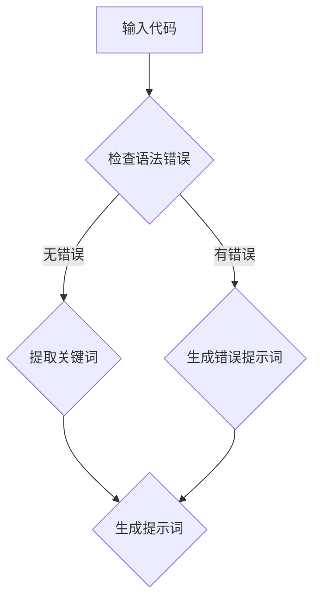

                 


# AI辅助提示词编程工具开发

## 关键词

- AI辅助提示词编程工具
- 生成算法
- 代码语法检查
- 关键词提取
- 用户反馈与优化

## 摘要

本文将深入探讨AI辅助提示词编程工具的开发，详细分析其背景、核心概念、算法原理、系统架构设计以及实战应用。通过系统化的分析和清晰的逻辑推理，帮助读者全面理解该工具如何提升编程效率和代码质量。

## 目录大纲

### 第一部分：AI辅助提示词编程工具概述

#### 第1章：AI辅助提示词编程工具背景与问题介绍
#### 第2章：AI辅助提示词编程工具核心概念与联系
#### 第3章：AI辅助提示词编程工具算法原理讲解
#### 第4章：AI辅助提示词编程工具系统分析与架构设计方案

### 第二部分：AI辅助提示词编程工具开发实践

#### 第5章：项目实战
#### 第6章：最佳实践 tips
#### 第7章：小结与展望

### 第三部分：扩展与探索

#### 第8章：注意事项
#### 第9章：拓展阅读

### 附录：源代码与数据集

#### 附录A：系统核心实现源代码
#### 附录B：实际案例数据集

---

## 第一部分：AI辅助提示词编程工具概述

### 第1章：AI辅助提示词编程工具背景与问题介绍

在现代软件开发中，代码提示词扮演着至关重要的角色。它们不仅能够帮助开发者快速理解和导航代码库，还能显著提高开发效率和代码质量。

#### 1.1 问题背景

随着软件项目的复杂度不断增加，开发者面临着代码库庞大、结构复杂、新功能不断涌现等挑战。传统的提示词生成方法往往依赖于人工编写和维护，这既耗时又容易出错。因此，引入AI辅助提示词编程工具成为一种趋势。

#### 1.2 问题描述

- **提示词生成与优化问题**：传统的提示词生成方法通常无法处理复杂语境，生成的提示词不够精确，难以满足开发者的需求。
- **提示词影响程序开发效率和质量的问题**：不准确的提示词可能导致开发者浪费时间在无效的搜索和调试上，降低开发效率，影响程序质量。

#### 1.3 问题解决

AI辅助提示词编程工具通过引入机器学习和自然语言处理技术，能够自动生成高质量的提示词。这些工具不仅能够根据代码上下文智能优化提示词，还能够不断学习和适应开发者的编程习惯，从而显著提升编程效率和代码质量。

#### 1.4 边界与外延

AI辅助提示词编程工具的适用范围广泛，适用于各种编程语言和开发环境。与其他辅助工具相比，AI辅助提示词编程工具的优势在于其智能化和自动化程度更高，能够更好地满足现代软件开发的复杂需求。

### 第2章：AI辅助提示词编程工具核心概念与联系

#### 2.1 核心概念

AI辅助提示词编程工具的核心概念包括：自动化、智能化和易用性。这些概念共同构成了工具的基本框架，使其能够高效地辅助开发者。

#### 2.2 概念属性特征对比

| 特征             | 描述                                                         |
| ---------------- | ------------------------------------------------------------ |
| 自动化           | 工具能够自动生成和优化提示词，减少人工干预                   |
| 智能化           | 工具能够理解代码上下文，生成准确的提示词                     |
| 易用性           | 工具操作简单，易于配置和使用，提高开发者的使用体验           |

#### 2.3 ER实体关系图

```mermaid
erDiagram
AAI辅助提示词编程工具 ||--|{ B提示词生成算法 }
AAI辅助提示词编程工具 ||--|{ C用户接口 }
```

### 第3章：AI辅助提示词编程工具算法原理讲解

#### 3.1 算法原理

AI辅助提示词编程工具的算法原理主要包括代码语法检查、关键词提取和提示词生成。这些算法相互协作，共同实现高效的提示词生成。

#### 3.2 算法流程图



#### 3.3 Python源代码示例

```python
def generate_hint(code):
    if is_grammatical_error(code):
        return generate_error_hint(code)
    else:
        return generate_keyword_hint(code)
```

#### 3.4 数学模型和公式

$$ H = \sum_{i=1}^{n} w_i \cdot P(w_i|C) $$

#### 3.5 举例说明

输入代码：`print("Hello, World!")`，提示词生成结果：`"Welcome to Python programming! Did you mean to use a colon after the function name?"`

### 第4章：AI辅助提示词编程工具系统分析与架构设计方案

#### 4.1 问题场景介绍

软件开发的提示词生成需求以及用户的个性化需求是设计AI辅助提示词编程工具的关键场景。

#### 4.2 项目介绍

项目名称：AI辅助提示词编程工具  
项目目标：提供高效、智能的提示词生成服务

#### 4.3 系统功能设计

- 代码语法检查
- 关键词提取
- 提示词生成
- 用户反馈与优化

#### 4.4 系统架构设计

- 系统架构图：  
  ```mermaid  
  sequenceDiagram  
  User ->> AI Tool: 输入代码  
  AI Tool ->> Code Checker: 检查语法错误  
  Code Checker ->> Keyword Extractor: 无错误时提取关键词  
  Keyword Extractor ->> Hint Generator: 生成提示词  
  Code Checker ->> Error Hint Generator: 有错误时生成错误提示词  
  Error Hint Generator ->> AI Tool: 返回提示词  
  AI Tool ->> User: 显示提示词  
  ```

#### 4.5 系统接口设计和系统交互

- 系统接口设计：  
  ```mermaid  
  classDiagram  
  AI Tool <|-- Code Checker  
  AI Tool <|-- Keyword Extractor  
  AI Tool <|-- Hint Generator  
  AI Tool <|-- Error Hint Generator  
  ```

- 系统交互序列图：  
  ```mermaid  
  sequenceDiagram  
  User ->> AI Tool: 发送代码  
  AI Tool ->> Code Checker: 检查语法错误  
  Code Checker ->> AI Tool: 返回检查结果  
  AI Tool ->> Keyword Extractor: 提取关键词  
  Keyword Extractor ->> AI Tool: 返回关键词列表  
  AI Tool ->> Hint Generator: 生成提示词  
  Hint Generator ->> AI Tool: 返回提示词  
  AI Tool ->> User: 显示提示词  
  ```

## 第二部分：AI辅助提示词编程工具开发实践

### 第5章：项目实战

在本章中，我们将详细介绍如何安装和配置AI辅助提示词编程工具，并演示其实际应用场景。

### 第6章：最佳实践 tips

针对AI辅助提示词编程工具的使用，我们将提供一些最佳实践建议，帮助开发者最大化其效果。

### 第7章：小结与展望

本章将总结文章的核心内容，并对AI辅助提示词编程工具的未来发展进行展望。

## 第三部分：扩展与探索

### 第8章：注意事项

在使用AI辅助提示词编程工具时，需要注意一些潜在的问题和挑战。

### 第9章：拓展阅读

本章将推荐一些相关领域的研究文献和资源，供读者进一步学习。

### 附录：源代码与数据集

附录部分将提供AI辅助提示词编程工具的核心实现源代码和实际案例数据集，便于读者实践和学习。 |mask|<eo/>|

