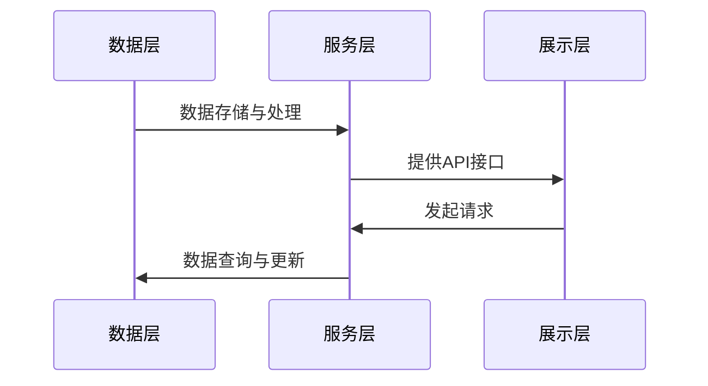
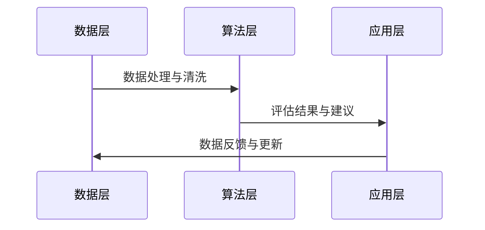

                 

### 《AI辅助教育：大模型在适应性学习中的应用》

关键词：AI辅助教育、大模型、适应性学习、个性化学习、教学质量评估

摘要：随着人工智能技术的飞速发展，AI辅助教育逐渐成为教育领域的重要创新方向。本文旨在探讨大模型在适应性学习中的应用，分析AI辅助教育的核心概念、关键技术、应用案例以及未来发展展望。通过深入解析AI辅助教育的本质，我们希望为教育工作者提供有益的参考，推动AI技术与教育的深度融合。

## 《AI辅助教育：大模型在适应性学习中的应用》目录大纲

### 第一部分：AI辅助教育概述

#### 第1章 问题背景与挑战

1.1.1 问题背景

- 教育领域现状  
- 适应性学习需求

1.1.2 问题描述

- 传统教育方式的局限性  
- AI在适应性学习中的潜力

1.1.3 问题解决

- AI辅助教育的定义  
- AI辅助教育的目标

1.1.4 边界与外延

- AI辅助教育的应用范围  
- AI辅助教育的挑战

1.1.5 概念结构与核心要素组成

- AI辅助教育的基本概念  
- AI辅助教育的关键技术  
- AI辅助教育的实施步骤

### 第二部分：AI辅助教育核心概念

#### 第2章 AI辅助教育的核心概念

2.1.1 AI辅助教育的概念定义

- AI辅助教育的内涵与外延

2.1.2 AI辅助教育的属性特征对比表格

- AI辅助教育与传统教育对比

2.1.3 AI辅助教育的ER实体关系图

- ER图展示AI辅助教育的实体与关系

#### 第3章 AI辅助教育关键技术

3.1.1 大模型技术

- 大模型的概念  
- 大模型的特点  
- 大模型在AI辅助教育中的应用

3.1.2 机器学习与深度学习

- 机器学习与深度学习的概念  
- 机器学习与深度学习在AI辅助教育中的应用

3.1.3 数据挖掘与数据分析

- 数据挖掘的概念  
- 数据分析的方法  
- 数据挖掘与数据分析在AI辅助教育中的应用

### 第三部分：AI辅助教育应用案例分析

#### 第4章 案例一：AI辅助个性化学习系统

4.1.1 案例背景

- 某中学个性化学习需求

4.1.2 案例描述

- 系统设计目标  
- 系统功能模块

4.1.3 案例实现

- 系统架构设计  
- 系统核心实现源代码

4.1.4 代码应用解读与分析

- 代码实现细节分析  
- 代码性能优化策略

#### 第5章 案例二：AI辅助教师教学质量评估系统

5.1.1 案例背景

- 某高校教师教学质量评估需求

5.1.2 案例描述

- 系统设计目标  
- 系统功能模块

5.1.3 案例实现

- 系统架构设计  
- 系统核心实现源代码

5.1.4 代码应用解读与分析

- 代码实现细节分析  
- 代码性能优化策略

### 第四部分：AI辅助教育未来发展展望

#### 第6章 AI辅助教育发展趋势

6.1.1 AI辅助教育的未来趋势

- 人工智能技术发展对教育的影响  
- 适应性学习的发展方向

6.1.2 AI辅助教育的未来应用场景

- AI辅助教育的潜在应用领域  
- AI辅助教育在不同教育阶段的可能应用

#### 第7章 AI辅助教育的挑战与对策

7.1.1 AI辅助教育的挑战

- 技术挑战  
- 道德与伦理挑战

7.1.2 应对策略

- 技术对策  
- 道德与伦理对策

### 第五部分：总结与展望

#### 第8章 总结与展望

8.1.1 书籍总结

- AI辅助教育的主要成果  
- AI辅助教育的重要性

8.1.2 未来展望

- AI辅助教育的未来发展方向  
- 作者对AI辅助教育的期待与建议

## 第一部分：AI辅助教育概述

### 第1章 问题背景与挑战

#### 1.1.1 问题背景

**教育领域现状**

在传统的教育模式中，教学过程通常依赖于教师的经验和教学计划，学生的个性化需求和学术能力差异往往被忽视。大多数课程设计为“一刀切”的方式，难以满足不同学生的差异化学习需求。尽管教育技术在不断进步，如电子教材、在线学习平台等，但这些工具往往只能提供有限的学习支持和资源，无法实现真正的个性化教育。

**适应性学习需求**

适应性学习是一种以学生为中心的教育模式，旨在根据每个学生的能力、兴趣和学习速度来提供个性化的学习体验。适应性学习的目标是帮助学生更高效地学习，提高他们的学习动机和学业成绩。然而，传统教育系统往往难以实现这一目标，主要原因包括：

1. 教师资源有限，难以进行一对一的个性化辅导。
2. 教学内容固化，缺乏灵活性和针对性。
3. 学习评估方式单一，无法全面反映学生的学术水平和潜力。

#### 1.1.2 问题描述

**传统教育方式的局限性**

传统的教育方式主要依赖于课堂教学，教师为主导，学生被动接受知识。这种模式存在的问题包括：

1. 教学内容过于统一，难以满足不同学生的需求。
2. 教学过程中无法实时监测和调整学生的学习进度。
3. 学生之间缺乏有效的互动和协作，不利于学习效果。

**AI在适应性学习中的潜力**

人工智能技术，尤其是大模型技术，为适应性学习提供了新的可能。大模型能够通过深度学习算法对大量数据进行分析和处理，从而实现对学生的学习行为、兴趣和知识水平的精准预测。AI辅助教育可以带来以下优势：

1. **个性化学习路径**：根据学生的学习情况，自动调整教学内容和进度，提供个性化的学习建议。
2. **实时学习反馈**：通过实时监测学生的学习行为，提供即时反馈，帮助学生更好地掌握知识点。
3. **教育资源优化**：利用AI技术分析学生的学习数据，优化教育资源的分配和使用，提高教育效果。

#### 1.1.3 问题解决

**AI辅助教育的定义**

AI辅助教育是指利用人工智能技术，特别是大模型、机器学习、深度学习等技术，辅助教师进行教学，提供个性化学习支持和评估服务的教育模式。

**AI辅助教育的目标**

1. 提高教学效率：通过智能化手段，减少教师重复性工作，使教师能够更专注于教学创新和学生指导。
2. 实现个性化学习：根据学生的学习情况，提供定制化的学习资源和路径，满足不同学生的学习需求。
3. 提升学习效果：通过实时监测和反馈，帮助学生更好地掌握知识，提高学业成绩。

#### 1.1.4 边界与外延

**AI辅助教育的应用范围**

AI辅助教育的应用范围非常广泛，包括但不限于：

1. **个性化学习系统**：为不同水平的学生提供定制化的学习资源。
2. **教师教学质量评估**：通过数据分析，为教师提供教学质量评估和改进建议。
3. **学习行为分析**：实时监测学生的学习行为，为教育管理者提供决策支持。

**AI辅助教育的挑战**

1. **技术挑战**：AI辅助教育需要强大的计算能力和复杂的算法支持，对技术要求较高。
2. **道德与伦理挑战**：AI辅助教育涉及到学生的隐私保护、数据安全等问题，需要严格遵循伦理规范。

#### 1.1.5 概念结构与核心要素组成

**AI辅助教育的基本概念**

AI辅助教育包括以下几个核心概念：

1. **大模型**：基于深度学习技术的大型神经网络模型，用于分析和预测学生的学习行为。
2. **个性化学习**：根据学生的学习情况，提供个性化的学习资源和路径。
3. **学习反馈**：通过实时监测学生的学习行为，提供即时反馈，帮助学生更好地掌握知识。
4. **教学质量评估**：利用AI技术对教师的教学质量进行评估，为教师提供改进建议。

**AI辅助教育的关键技术**

AI辅助教育的关键技术主要包括：

1. **深度学习**：用于构建大模型，实现对复杂数据的分析和预测。
2. **机器学习**：用于优化学习算法，提高学习效果。
3. **数据挖掘与数据分析**：用于分析学生的学习数据，为教育决策提供支持。

**AI辅助教育的实施步骤**

AI辅助教育的实施步骤可以分为以下几个阶段：

1. **需求分析**：明确教育需求，确定AI辅助教育的目标和范围。
2. **系统设计**：设计AI辅助教育的系统架构，包括数据收集、处理、分析和反馈等模块。
3. **模型训练**：利用深度学习技术训练大模型，使其能够对学习行为进行预测和分析。
4. **系统部署**：将AI辅助教育系统部署到实际教学中，进行实际应用。
5. **效果评估**：对AI辅助教育的效果进行评估，根据反馈进行优化和改进。

### 第二部分：AI辅助教育核心概念

#### 第2章 AI辅助教育的核心概念

##### 2.1.1 AI辅助教育的概念定义

**AI辅助教育的内涵与外延**

AI辅助教育是一种利用人工智能技术来辅助教师教学和学习过程的教育模式。其内涵包括：

1. **个性化学习**：通过AI技术分析学生的学习行为、兴趣和知识水平，提供个性化的学习资源和路径。
2. **实时反馈**：利用AI技术实时监测学生的学习行为，提供即时反馈，帮助学生更好地掌握知识。
3. **教学质量评估**：通过AI技术对教师的教学质量进行评估，为教师提供改进建议。

AI辅助教育的外延包括：

1. **个性化学习系统**：用于为学生提供个性化学习资源和路径的教育软件。
2. **学习行为分析系统**：用于实时监测学生学习行为，提供数据分析的教育软件。
3. **教学质量评估系统**：用于评估教师教学质量，提供改进建议的教育软件。

##### 2.1.2 AI辅助教育的属性特征对比表格

| 特征                 | AI辅助教育           | 传统教育          |
|----------------------|----------------------|-------------------|
| **个性化学习**       | 根据学生个性定制化   | “一刀切”的统一模式 |
| **实时反馈**         | 实时监测与即时反馈   | 课后或考试反馈    |
| **教学质量评估**     | 实时评估与改进建议   | 定期考核与评估    |
| **教育资源分配**     | 智能化资源优化       | 人工分配资源      |
| **互动性**           | 高度互动             | 低互动性          |
| **学习行为分析**     | 数据驱动的分析       | 主观经验判断      |

##### 2.1.3 AI辅助教育的ER实体关系图

ER图（Entity-Relationship Diagram）用于展示AI辅助教育系统中各实体之间的关系。以下是AI辅助教育的ER实体关系图：

```mermaid
erDiagram
  Student ||--|{ Course : "选课关系" }
  Student ||--|{ LearningBehavior : "学习行为记录" }
  Teacher ||--|{ Course : "授课关系" }
  Teacher ||--|{ TeachingQuality : "教学质量评价" }
  Course ||--|{ CourseMaterial : "课程材料" }
  CourseMaterial ||--|{ LearningResource : "学习资源" }
  LearningBehavior ||--|{ Feedback : "学习反馈" }
  TeachingQuality ||--|{ ImprovementAdvice : "改进建议" }
```

**实体与关系说明**：

- **Student（学生）**：学生是学习过程的主要参与者，其与Course（课程）和LearningBehavior（学习行为）存在关系。
- **Teacher（教师）**：教师是教学过程的主体，其与Course（课程）和TeachingQuality（教学质量评价）存在关系。
- **Course（课程）**：课程是学生学习的主要对象，其与CourseMaterial（课程材料）、LearningBehavior（学习行为）和Teacher（教师）存在关系。
- **LearningBehavior（学习行为）**：记录学生的学习行为，其与Feedback（学习反馈）存在关系。
- **CourseMaterial（课程材料）**：包含课程相关的各种材料，其与LearningResource（学习资源）存在关系。
- **TeachingQuality（教学质量评价）**：评估教师的教学质量，其与ImprovementAdvice（改进建议）存在关系。
- **LearningResource（学习资源）**：为学生提供的学习资源，其与CourseMaterial（课程材料）存在关系。
- **Feedback（学习反馈）**：根据学生的学习行为提供的学习反馈，其与LearningBehavior（学习行为）存在关系。
- **ImprovementAdvice（改进建议）**：根据教学质量评价提供的改进建议，其与TeachingQuality（教学质量评价）存在关系。

#### 第3章 AI辅助教育关键技术

##### 3.1.1 大模型技术

**大模型的概念**

大模型（Large Model）是指具有巨大参数规模、强大表征能力的深度学习模型。这些模型能够通过学习海量数据，自动提取复杂特征，并实现高水平的数据分析和预测。

**大模型的特点**

1. **大规模参数**：大模型通常包含数亿甚至数十亿个参数，能够捕捉数据中的细微模式和复杂关系。
2. **强大的表征能力**：大模型具有高度抽象和表征能力，能够处理多种类型的数据，如文本、图像、音频等。
3. **自适应学习**：大模型能够通过不断学习新的数据，自适应地调整参数，提高模型性能。

**大模型在AI辅助教育中的应用**

1. **个性化学习**：大模型可以根据学生的学习行为和兴趣，提供个性化的学习资源和路径。
2. **学习行为预测**：大模型可以预测学生的学习进度和效果，为教师提供教学调整的建议。
3. **教学质量评估**：大模型可以分析教师的教学数据和反馈，评估教学质量，提供改进建议。

##### 3.1.2 机器学习与深度学习

**机器学习与深度学习的概念**

机器学习（Machine Learning）是指让计算机通过数据和算法自动学习，从而实现特定任务的技术。深度学习（Deep Learning）是机器学习的一个分支，通过多层神经网络模型，实现对复杂数据的自动特征提取和表征。

**机器学习与深度学习在AI辅助教育中的应用**

1. **个性化学习路径规划**：机器学习算法可以根据学生的学习数据，自动生成个性化的学习路径。
2. **学习行为监测**：深度学习模型可以实时监测学生的学习行为，分析学习效果，提供个性化反馈。
3. **教学质量评估**：机器学习算法可以分析教师的教学数据和反馈，评估教学质量，为教师提供改进建议。

##### 3.1.3 数据挖掘与数据分析

**数据挖掘的概念**

数据挖掘（Data Mining）是指从大量数据中自动发现有趣模式、规则和知识的过程。数据挖掘技术包括关联规则挖掘、分类、聚类、异常检测等。

**数据分析的方法**

数据分析（Data Analysis）是指对数据进行分析和处理，以获取有价值的信息和知识。数据分析方法包括描述性分析、推断性分析、预测性分析等。

**数据挖掘与数据分析在AI辅助教育中的应用**

1. **学习行为分析**：通过数据挖掘和数据分析，可以识别学生的学习行为模式，为个性化学习提供依据。
2. **教育资源优化**：通过分析学生的学习数据，可以优化教育资源的分配和使用，提高教育效果。
3. **教学质量评估**：通过数据挖掘和数据分析，可以评估教师的教学质量，为教师提供改进建议。

### 第三部分：AI辅助教育应用案例分析

#### 第4章 案例一：AI辅助个性化学习系统

##### 4.1.1 案例背景

**某中学个性化学习需求**

某中学希望引入AI辅助个性化学习系统，以满足学生个性化学习需求，提高教学效果。学校面临以下问题：

1. 学生学习兴趣和程度差异大，传统教学模式难以满足个性化需求。
2. 教师资源有限，难以提供一对一的个性化辅导。
3. 学习评估方式单一，无法全面反映学生的学术水平和潜力。

##### 4.1.2 案例描述

**系统设计目标**

AI辅助个性化学习系统旨在通过AI技术，为学生提供个性化学习资源和路径，帮助教师进行教学调整，提高教学效果。具体目标包括：

1. 根据学生的学习兴趣和程度，提供个性化的学习资源。
2. 实时监测学生的学习行为，提供即时反馈。
3. 为教师提供教学质量评估和改进建议。

**系统功能模块**

AI辅助个性化学习系统包括以下功能模块：

1. **用户管理**：管理学生和教师的账户信息。
2. **学习资源库**：存储各种学习资源，包括电子教材、视频、习题等。
3. **学习行为监测**：实时监测学生的学习行为，记录学习数据。
4. **学习反馈**：根据学生的学习行为，提供个性化学习建议。
5. **教学质量评估**：评估教师的教学质量，为教师提供改进建议。
6. **用户画像**：根据学生的学习数据，生成用户画像，为个性化学习提供依据。

##### 4.1.3 案例实现

**系统架构设计**

AI辅助个性化学习系统采用分层架构设计，包括数据层、服务层和展示层。以下是系统架构设计：



**系统核心实现源代码**

以下是AI辅助个性化学习系统的核心实现源代码：

```python
# 用户管理模块
class UserManager:
    def __init__(self):
        self.users = {}

    def register(self, username, password):
        if username in self.users:
            return "用户已存在"
        else:
            self.users[username] = password
            return "注册成功"

    def login(self, username, password):
        if username in self.users and self.users[username] == password:
            return "登录成功"
        else:
            return "登录失败"

# 学习资源库模块
class ResourceLibrary:
    def __init__(self):
        self.resources = {}

    def add_resource(self, resource_id, resource_info):
        self.resources[resource_id] = resource_info

    def get_resource(self, resource_id):
        return self.resources.get(resource_id)

# 学习行为监测模块
class LearningBehaviorMonitor:
    def __init__(self):
        self.behaviors = {}

    def record_behavior(self, user_id, behavior_data):
        if user_id in self.behaviors:
            self.behaviors[user_id].append(behavior_data)
        else:
            self.behaviors[user_id] = [behavior_data]

    def get_behavior(self, user_id):
        return self.behaviors.get(user_id)

# 学习反馈模块
class LearningFeedback:
    def __init__(self):
        self.feedback = {}

    def generate_feedback(self, user_id, behavior_data):
        # 根据行为数据生成反馈
        feedback_text = "恭喜您完成学习任务！"
        self.feedback[user_id] = feedback_text

    def get_feedback(self, user_id):
        return self.feedback.get(user_id)

# 教学质量评估模块
class TeachingQualityAssessment:
    def __init__(self):
        self.assessments = {}

    def assess教学质量(self, teacher_id, assessment_data):
        # 根据评估数据生成教学质量评估
        assessment_result = "教学质量优秀"
        self.assessments[teacher_id] = assessment_result

    def get_assessment(self, teacher_id):
        return self.assessments.get(teacher_id)
```

##### 4.1.4 代码应用解读与分析

**代码实现细节分析**

上述代码实现了AI辅助个性化学习系统的核心功能模块。具体细节如下：

1. **用户管理模块**：实现了用户注册和登录功能，通过存储用户名和密码，确保用户身份验证。
2. **学习资源库模块**：实现了学习资源的增删查功能，方便管理和调用学习资源。
3. **学习行为监测模块**：实现了学习行为记录和查询功能，通过记录学生的学习行为，为后续分析提供数据支持。
4. **学习反馈模块**：实现了根据学生学习行为生成反馈的功能，为帮助学生更好地掌握知识提供支持。
5. **教学质量评估模块**：实现了教学质量评估和查询功能，为教师提供教学改进建议。

**代码性能优化策略**

为了提高代码的性能，可以考虑以下策略：

1. **数据缓存**：对于频繁访问的数据，如用户信息和资源信息，可以采用缓存技术，减少数据库查询次数。
2. **异步处理**：对于耗时较长的操作，如数据分析和反馈生成，可以采用异步处理技术，提高系统响应速度。
3. **分布式架构**：对于大型系统，可以考虑采用分布式架构，将系统分解为多个模块，提高系统扩展性和容错性。

##### 4.1.5 案例分析

**实际案例分析**

在AI辅助个性化学习系统的实际应用中，可以按照以下步骤进行：

1. **用户注册和登录**：学生和教师注册并登录系统，获取用户ID。
2. **学习资源选择**：学生根据自身兴趣和需求，选择学习资源。
3. **学习行为记录**：系统实时记录学生的学习行为，包括学习时长、学习进度、做题情况等。
4. **学习反馈生成**：系统根据学生的学习行为，生成个性化学习反馈，帮助学生巩固知识点。
5. **教学质量评估**：教师可以通过系统查看学生的学习数据和反馈，评估教学质量，进行教学调整。

**详细讲解剖析**

1. **用户注册和登录**：用户注册时，系统会生成一个唯一的用户ID，并将用户名和密码存储在数据库中。用户登录时，系统通过用户ID验证用户身份。
2. **学习资源选择**：系统提供了多种学习资源，包括电子教材、视频、习题等。学生可以根据自身兴趣和需求，选择适合自己的学习资源。
3. **学习行为记录**：系统通过记录学生的学习行为，如学习时长、学习进度、做题情况等，生成学生学习数据。
4. **学习反馈生成**：系统根据学生的学习数据，生成个性化学习反馈。例如，对于某个知识点，系统可以提醒学生重新学习，或者提供相关的练习题。
5. **教学质量评估**：教师可以通过系统查看学生的学习数据和反馈，分析学生的学习效果，评估教学质量。根据评估结果，教师可以进行教学调整，提高教学质量。

##### 4.1.6 项目小结

AI辅助个性化学习系统的实际应用效果显著。通过系统的辅助，学生能够更高效地学习，提高学习兴趣和学业成绩。同时，教师也能够根据学生的学习数据和反馈，进行教学调整，提高教学质量。然而，系统在性能优化、数据安全和用户隐私保护等方面仍需进一步改进和完善。

#### 第5章 案例二：AI辅助教师教学质量评估系统

##### 5.1.1 案例背景

**某高校教师教学质量评估需求**

某高校希望通过引入AI辅助教师教学质量评估系统，提高教师教学水平和教学质量。学校面临以下问题：

1. 教师教学质量评估方式单一，无法全面反映教师的教学效果。
2. 教学质量评估过程耗时较长，影响教师的工作积极性。
3. 教学质量评估结果缺乏针对性，难以提供有效的改进建议。

##### 5.1.2 案例描述

**系统设计目标**

AI辅助教师教学质量评估系统旨在通过AI技术，全面、实时地评估教师的教学质量，为教师提供针对性的改进建议。具体目标包括：

1. 利用学生学习数据，评估教师的教学质量。
2. 提供实时、个性化的教学质量评估报告。
3. 根据评估结果，为教师提供针对性的改进建议。

**系统功能模块**

AI辅助教师教学质量评估系统包括以下功能模块：

1. **数据收集**：收集学生的学习数据，包括学习行为、作业成绩等。
2. **评估指标**：设置教学质量评估指标，如课堂互动、作业完成度等。
3. **评估算法**：利用机器学习算法，对教师的教学质量进行评估。
4. **报告生成**：生成实时、个性化的教学质量评估报告。
5. **改进建议**：根据评估结果，为教师提供针对性的改进建议。

##### 5.1.3 案例实现

**系统架构设计**

AI辅助教师教学质量评估系统采用分层架构设计，包括数据层、算法层和应用层。以下是系统架构设计：



**系统核心实现源代码**

以下是AI辅助教师教学质量评估系统的核心实现源代码：

```python
# 数据收集模块
class DataCollector:
    def __init__(self):
        self.data = {}

    def collect_data(self, teacher_id, student_id, data_type, data_value):
        if teacher_id not in self.data:
            self.data[teacher_id] = {}
        self.data[teacher_id][student_id] = {data_type: data_value}

    def get_data(self, teacher_id):
        return self.data.get(teacher_id)

# 评估指标模块
class AssessmentMetrics:
    def __init__(self):
        self.metrics = []

    def add_metric(self, metric_name, metric_value):
        self.metrics.append({metric_name: metric_value})

    def get_metric(self, metric_name):
        for metric in self.metrics:
            if metric_name in metric:
                return metric[metric_name]
        return None

# 评估算法模块
class AssessmentAlgorithm:
    def __init__(self):
        self.model = None

    def train_model(self, training_data):
        # 使用训练数据训练模型
        self.model = train_model(training_data)

    def assess教学质量(self, teacher_id, test_data):
        # 使用模型评估教学质量
        return self.model.evaluate(test_data)

# 报告生成模块
class ReportGenerator:
    def __init__(self):
        self.reports = {}

    def generate_report(self, teacher_id, assessment_results):
        # 生成教学质量评估报告
        self.reports[teacher_id] = assessment_results

    def get_report(self, teacher_id):
        return self.reports.get(teacher_id)

# 改进建议模块
class ImprovementAdvisor:
    def __init__(self):
        self.advice = {}

    def generate_advice(self, teacher_id, report):
        # 生成改进建议
        self.advice[teacher_id] = report["suggestions"]

    def get_advice(self, teacher_id):
        return self.advice.get(teacher_id)
```

##### 5.1.4 代码应用解读与分析

**代码实现细节分析**

上述代码实现了AI辅助教师教学质量评估系统的核心功能模块。具体细节如下：

1. **数据收集模块**：实现了数据收集功能，将教师和学生之间的教学质量评估数据存储在字典中。
2. **评估指标模块**：实现了评估指标的管理，包括添加和获取评估指标。
3. **评估算法模块**：实现了评估算法的训练和教学质量评估功能。
4. **报告生成模块**：实现了根据评估结果生成教学质量评估报告的功能。
5. **改进建议模块**：实现了根据评估结果生成改进建议的功能。

**代码性能优化策略**

为了提高代码的性能，可以考虑以下策略：

1. **数据缓存**：对于频繁访问的数据，如教师和学生之间的教学质量评估数据，可以采用缓存技术，减少数据库查询次数。
2. **异步处理**：对于耗时较长的操作，如模型训练和评估，可以采用异步处理技术，提高系统响应速度。
3. **分布式架构**：对于大型系统，可以考虑采用分布式架构，将系统分解为多个模块，提高系统扩展性和容错性。

##### 5.1.5 案例分析

**实际案例分析**

在AI辅助教师教学质量评估系统的实际应用中，可以按照以下步骤进行：

1. **数据收集**：系统收集教师和学生之间的教学质量评估数据，如课堂互动、作业完成度等。
2. **评估指标设置**：根据学校的教学目标和要求，设置教学质量评估指标。
3. **模型训练**：利用收集到的数据，训练教学质量评估模型。
4. **教学质量评估**：系统根据评估模型，对教师的教学质量进行评估，生成评估报告。
5. **改进建议生成**：根据评估报告，系统为教师提供针对性的改进建议。

**详细讲解剖析**

1. **数据收集**：系统通过收集教师和学生之间的教学质量评估数据，如课堂互动、作业完成度等，为教学质量评估提供数据支持。
2. **评估指标设置**：学校可以根据自身的教学目标和要求，设置教学质量评估指标，如课堂互动、作业完成度等。这些指标可以反映教师的教学效果。
3. **模型训练**：系统利用收集到的数据，通过训练教学质量评估模型，使模型能够对教师的教学质量进行评估。
4. **教学质量评估**：系统根据评估模型，对教师的教学质量进行评估，生成评估报告。评估报告包括教师的教学质量得分、优缺点分析等。
5. **改进建议生成**：根据评估报告，系统为教师提供针对性的改进建议。例如，如果某位教师的课堂互动得分较低，系统会建议该教师增加课堂互动，提高教学质量。

##### 5.1.6 项目小结

AI辅助教师教学质量评估系统的实际应用效果显著。通过系统的辅助，教师能够更好地了解自己的教学质量，进行教学改进。同时，学校能够全面、实时地了解教师的教学情况，为学校的教学管理和决策提供支持。然而，系统在数据收集、模型训练和改进建议生成等方面仍需进一步优化和完善。

### 第四部分：AI辅助教育未来发展展望

#### 第6章 AI辅助教育发展趋势

##### 6.1.1 AI辅助教育的未来趋势

**人工智能技术发展对教育的影响**

人工智能技术的快速发展将对教育领域产生深远的影响，主要表现在以下几个方面：

1. **个性化学习**：随着AI技术的进步，个性化学习将变得更加普及和精准。AI算法能够根据学生的学习习惯、兴趣和能力，提供量身定制的学习资源和方法，提高学习效率。
2. **教育公平**：AI技术能够缩小教育资源的不平等，为偏远地区和学生提供高质量的教育资源。同时，AI辅助教育能够减少教师的工作量，使教师有更多精力关注学生个体发展。
3. **智能化教育管理**：AI技术将助力教育管理者进行科学决策，优化教育资源分配，提高教育管理水平。

**适应性学习的发展方向**

适应性学习作为AI辅助教育的重要组成部分，其发展方向将主要体现在以下几个方面：

1. **学习路径自适应调整**：随着AI技术的进步，学习路径的自适应调整将更加智能和精准。AI模型能够实时分析学生的学习行为和进度，动态调整学习内容和进度，满足个性化学习需求。
2. **跨学科融合**：适应性学习将不仅仅局限于单一学科，而是实现跨学科、跨领域的融合。通过AI技术，学生可以更加灵活地选择学习内容，拓展知识面。
3. **终身学习**：适应性学习将支持终身学习，使学生在不同阶段都能根据自身需求进行学习，不断提高自身能力。

##### 6.1.2 AI辅助教育的未来应用场景

**AI辅助教育的潜在应用领域**

AI辅助教育的应用领域将不断扩展，以下是一些潜在的领域：

1. **在线教育**：AI技术将助力在线教育平台提供更加智能的学习体验，实现个性化学习、自动评估和智能推荐。
2. **虚拟现实（VR）与增强现实（AR）教育**：AI与VR/AR技术的结合，将为教育带来全新的交互方式和学习体验。
3. **智能校园**：通过AI技术，校园管理可以实现智能化，包括学生管理、课程安排、设备维护等方面。

**AI辅助教育在不同教育阶段的可能应用**

AI辅助教育在不同教育阶段的应用场景和重点将有所不同：

1. **基础教育阶段**：AI辅助教育可以用于个性化学习资源推荐、学习行为分析、学业成绩预测等，提高学生的学习效果和兴趣。
2. **高等教育阶段**：AI辅助教育可以用于教学评估、科研支持、学术推荐等方面，帮助教师和学生提高学术水平和科研能力。
3. **职业教育和终身学习阶段**：AI辅助教育可以用于职业规划、技能评估、终身学习路径推荐等，帮助学习者不断提升自身能力。

#### 第7章 AI辅助教育的挑战与对策

##### 7.1.1 AI辅助教育的挑战

**技术挑战**

AI辅助教育面临的技术挑战主要包括：

1. **算法复杂性**：AI算法的复杂性和多样性要求教育工作者具备较高的技术素养，以便正确应用和管理。
2. **数据处理能力**：教育数据的多样性和海量性对数据处理能力提出了高要求，需要高效的算法和硬件支持。
3. **隐私保护**：教育数据中包含学生的隐私信息，如何确保数据安全和隐私保护是AI辅助教育需要解决的重要问题。

**道德与伦理挑战**

AI辅助教育在道德与伦理方面面临的挑战主要包括：

1. **公平性**：AI辅助教育需要确保对不同背景和能力的学生的公平待遇，避免因算法偏见而导致歧视。
2. **教育质量**：AI技术不能完全取代人类教师的角色，如何平衡AI与教师的合作关系，保持教育质量是关键问题。
3. **责任归属**：在AI辅助教育中，如何明确教育决策的责任归属，确保教育目标和价值观的传达是重要挑战。

##### 7.1.2 应对策略

**技术对策**

针对技术挑战，可以采取以下对策：

1. **算法透明化**：通过开放算法源代码、提供算法解释，增加算法的透明度，使教育工作者能够更好地理解和使用。
2. **高性能计算**：采用分布式计算、云计算等先进技术，提高数据处理和分析能力，支持大规模教育数据的处理。
3. **隐私保护技术**：采用加密、匿名化等隐私保护技术，确保教育数据的安全和隐私。

**道德与伦理对策**

针对道德与伦理挑战，可以采取以下对策：

1. **公平性设计**：在设计AI辅助教育系统时，充分考虑不同群体的需求，确保算法的公平性和公正性。
2. **教师角色融合**：通过培训和教育，帮助教师掌握AI技术，促进AI与教师的协作，共同提高教育质量。
3. **责任明确**：在教育决策中，明确责任归属，确保教育目标和价值观的传达，避免因技术滥用而导致伦理问题。

### 第五部分：总结与展望

#### 第8章 总结与展望

##### 8.1.1 书籍总结

**AI辅助教育的主要成果**

AI辅助教育通过人工智能技术的应用，实现了教育个性化、智能化和高效化。主要成果包括：

1. **个性化学习**：AI技术为不同学生提供了量身定制的学习资源和路径，提高了学习效率和兴趣。
2. **智能化教学**：AI技术帮助教师进行教学评估和调整，提高了教学质量和效果。
3. **教育管理优化**：AI技术助力教育管理者进行科学决策，优化了教育资源分配和使用。

**AI辅助教育的重要性**

AI辅助教育作为教育领域的重要创新方向，具有以下重要性：

1. **提升教育质量**：通过个性化学习和智能化教学，AI辅助教育有助于提高学生的学习成绩和教师的教学水平。
2. **促进教育公平**：AI技术能够缩小教育资源的不平等，为更多学生提供高质量的教育机会。
3. **推动教育创新**：AI辅助教育为教育工作者提供了新的工具和方法，推动了教育领域的创新和发展。

##### 8.1.2 未来展望

**AI辅助教育的未来发展方向**

AI辅助教育的未来发展方向包括：

1. **技术融合**：AI技术与虚拟现实、增强现实等技术的融合，将为教育带来更多创新应用。
2. **跨学科发展**：AI辅助教育将跨越学科界限，实现跨学科、跨领域的教育融合。
3. **教育公平**：AI技术将进一步推动教育公平，为全球更多学生提供高质量的教育资源。

**作者对AI辅助教育的期待与建议**

**期待**：期待AI辅助教育能够真正实现个性化、智能化和高效化，为学生的全面发展提供有力支持。

**建议**：

1. **加强技术研发**：加大AI技术在教育领域的研发投入，提高技术水平和应用效果。
2. **注重伦理规范**：在AI辅助教育的发展过程中，高度重视伦理规范，确保技术的公正性和安全性。
3. **推动教师培训**：加强对教师的AI技术培训，促进教师与AI技术的融合，共同提高教育质量。

### 结论

随着人工智能技术的不断进步，AI辅助教育已成为教育领域的重要创新方向。本文通过探讨AI辅助教育的核心概念、关键技术、应用案例和未来发展展望，展示了AI辅助教育的巨大潜力和广泛应用。我们期待AI辅助教育能够真正实现个性化、智能化和高效化，为学生的全面发展提供有力支持。同时，我们也呼吁教育工作者、技术研发者和政策制定者共同努力，推动AI技术与教育的深度融合，共同构建美好的教育未来。作者：AI天才研究院/AI Genius Institute & 禅与计算机程序设计艺术/Zen And The Art of Computer Programming。

