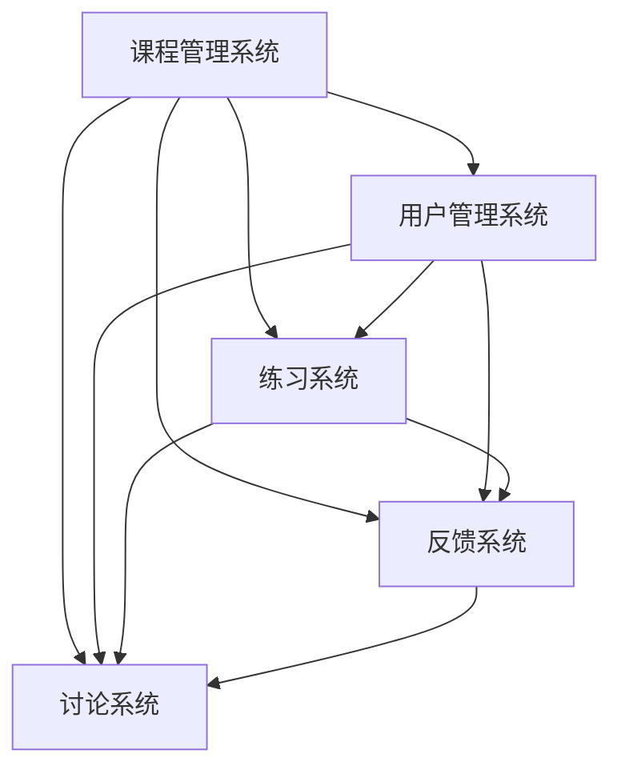
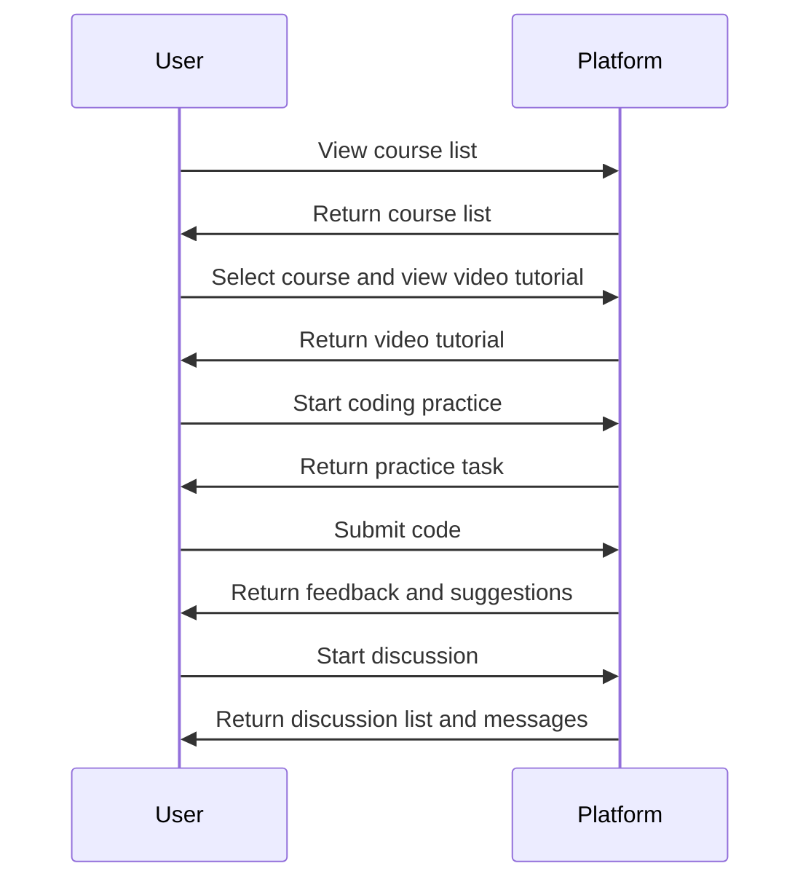

                 

# AI辅助教育：提示词设计个性化学习路径

## 关键词
- 人工智能
- 教育科技
- 个性化学习
- 提示词设计
- 教学支持系统

## 摘要
本文旨在探讨AI辅助教育中提示词设计的原理和方法，通过分析其定义、功能、设计原则及方法，阐述如何利用AI技术实现个性化学习路径的构建。文章从问题背景出发，详细介绍了AI辅助教育的核心概念与联系，探讨了提示词在引导用户、优化用户体验和促进知识获取方面的作用。通过实际案例和分析，本文提供了具体的提示词设计方法，为教育科技领域提供了新的思路和实践指导。

## 第一部分: AI辅助教育概述

### 第1章: 问题背景与核心概念

#### 1.1 问题背景

#### 1.1.1 教育需求的变革

在传统的教育模式中，教师通常采用统一的教学内容和评估标准，难以满足学生个体化的学习需求。这一局限性主要体现在以下几个方面：

1. **个体化需求难以满足**：每个学生的学习速度、兴趣和能力各异，传统的“一刀切”教学模式难以兼顾所有学生的差异，导致部分学生感到学习压力过大，而另一些学生则觉得课程过于简单，无法充分发挥其潜力。

2. **教育资源分配不均**：在教育资源分配上，城乡、地区之间的差距使得部分学生难以获得优质的教育资源，导致教育不公平现象加剧。

3. **学习效率和效果提升空间有限**：传统的教育模式往往依赖于教师的主导，学生的学习主动性和积极性难以得到充分调动，导致学习效率低下，学习效果不佳。

#### 1.1.2 技术驱动的教育创新

随着互联网、数据科学和人工智能等技术的迅猛发展，教育领域也迎来了深刻的变革。这些技术为解决传统教育中的问题提供了新的可能性：

1. **互联网技术的普及**：互联网技术的普及使得在线学习、远程教育等模式成为可能，学生可以随时随地进行学习，打破了时间和空间的限制。

2. **数据科学的发展**：数据科学技术的应用使得教育数据得以有效收集、分析和利用，为个性化教学提供了数据支持。

3. **人工智能技术的突破**：人工智能技术在教育中的应用，如智能辅导系统、自动评估系统和个性化学习路径推荐等，为提升教育质量和效率提供了强有力的支持。

#### 1.1.3 AI辅助教育的提出

基于上述背景，AI辅助教育的概念应运而生。AI辅助教育是指利用人工智能技术，为教育过程提供智能化支持，实现个性化教学、自动化评估和智能推荐等功能。其核心目标是：

1. **提升学习体验**：通过智能化的教学支持，提高学生的学习兴趣和参与度，创造更加生动、有趣的学习环境。

2. **提高教育质量**：通过个性化的教学方案和自动化的评估系统，提升学生的学习效果，实现精准的教育质量提升。

3. **增强教育公平**：通过智能化手段，优化教育资源的分配和使用，缩小城乡、地区之间的教育差距，推动教育公平。

#### 1.1.4 AI辅助教育的核心概念与联系

1. **人工智能基础**

   - **人工智能的定义**：人工智能（Artificial Intelligence，AI）是指使计算机模拟人类智能行为的技术和学科。它包括机器学习、深度学习、自然语言处理等多个分支。

   - **人工智能的主要类型**

     - **机器学习**：机器学习（Machine Learning，ML）是一种让计算机通过数据和算法自主学习和改进的技术。

     - **深度学习**：深度学习（Deep Learning，DL）是一种基于多层神经网络的学习方法，能够自动从数据中提取特征。

     - **自然语言处理**：自然语言处理（Natural Language Processing，NLP）是人工智能的一个分支，旨在使计算机能够理解、生成和处理人类语言。

2. **教育科技**

   - **教育科技的定义**：教育科技（Educational Technology，EdTech）是指将信息技术应用于教育过程中，以提高教育效率和质量。

   - **教育科技的主要领域**

     - **在线教育**：通过互联网提供的教育服务，包括课程学习、互动交流等。

     - **智能学习分析**：利用数据分析技术，对学生的学习行为和效果进行分析，提供个性化的学习建议。

     - **个性化学习平台**：基于人工智能技术，提供个性化教学资源和学习路径的平台。

#### 1.1.5 边界与外延

1. **AI辅助教育的应用领域**

   - **K-12教育**：个性化学习、智能评估和学习资源推荐。

   - **高等教育**：学术研究辅助、课程学习优化和毕业设计指导。

   - **职业培训**：在线课程辅导、能力评估与认证和职业发展规划。

2. **概念结构与核心要素组成**

   - **概念结构**

     - **技术架构**：数据采集与处理、模型训练与优化、应用实现与部署。

   - **核心要素组成**

     - **学生数据**：学习行为、能力评估和学习需求。

     - **教学资源**：教学内容、教学方法和教学评估。

     - **教学支持系统**：智能学习平台、自动化评估系统和教学资源管理系统。

#### 1.1.6 本章小结

本章对AI辅助教育进行了全面的概述，从问题背景、核心概念、应用领域等方面进行了详细阐述，为后续章节的深入探讨奠定了基础。

----------------------------------------------------------------

## 第二部分: 提示词设计原理

### 第2章: 提示词的定义与功能

#### 2.1 提示词的定义

提示词（Prompt）是一种引导用户输入的方式，通过提供关键词或问题，帮助用户更准确地表达需求或进行任务操作。在AI辅助教育中，提示词的设计至关重要，它能够直接影响学生的学习体验和学习效果。

#### 2.1.1 提示词的基本概念

提示词的基本概念可以从以下几个方面进行理解：

1. **定义**：提示词是一种引导用户进行输入或操作的方式，它通常是一个短语、句子或问题，用于激发用户的思维，引导用户完成特定的任务。

2. **类型**：提示词可以根据其用途和形式分为不同的类型，常见的有：

   - **问答式提示词**：通过提问引导用户回答问题，例如“你认为这个问题的解决方案是什么？”
   
   - **指令式提示词**：通过给出具体的操作指令引导用户完成任务，例如“请点击‘保存’按钮。”
   
   - **描述性提示词**：通过描述性语言引导用户理解特定概念或情境，例如“请描述一下这个算法的基本原理。”

#### 2.1.2 提示词的类型

1. **问答式提示词**

   - **作用**：通过提问引导用户思考，激发用户的思维活动，有助于加深对知识的理解和记忆。

   - **示例**：“请解释一下什么是机器学习？”

2. **指令式提示词**

   - **作用**：通过给出具体的操作指令，帮助用户完成特定的任务，提高任务执行的效率。

   - **示例**：“请打开‘计算器’应用。”

3. **描述性提示词**

   - **作用**：通过描述性语言引导用户理解复杂概念或情境，帮助用户建立知识框架。

   - **示例**：“深度学习是一种基于多层神经网络的学习方法，它能够自动从数据中提取特征。”

#### 2.2 提示词的功能

提示词在AI辅助教育中具有多种功能，主要包括以下几个方面：

1. **引导用户**

   - **作用**：明确任务目标，帮助用户更好地理解任务要求，避免任务的模糊性和不确定性。

   - **示例**：“请回答以下问题：什么是人工智能？”

2. **优化用户体验**

   - **作用**：通过设计简洁、明确的提示词，提高用户的操作效率，减少用户的困惑和疲劳感。

   - **示例**：“请输入您的用户名和密码。”

3. **促进知识获取**

   - **作用**：通过设计有针对性的提示词，引导用户进行深度思考，促进知识的内化和应用。

   - **示例**：“请分析以下案例，讨论如何利用机器学习技术解决实际问题。”

#### 2.3 提示词设计的原则

1. **明确性**

   - **原则**：提示词应明确表达任务目标，避免模糊不清，确保用户能够准确理解任务要求。

   - **示例**：避免使用含糊的表述，如“做一些作业”，而应具体明确，如“请完成第3章的练习题。”

2. **简洁性**

   - **原则**：提示词应简洁明了，避免冗长复杂的表述，减少用户的阅读和理解负担。

   - **示例**：避免使用复杂的句子结构，如“请利用你所学的机器学习知识，设计一个解决住房市场预测问题的算法”，而应简洁明了，如“设计一个住房市场预测算法。”

3. **针对性**

   - **原则**：提示词应根据用户特点、任务需求和情境进行定制，确保提示词的针对性和有效性。

   - **示例**：针对不同的学习阶段和用户背景，设计不同类型的提示词，如对于初学者，可以使用更基础、更简单的提示词。

4. **可扩展性**

   - **原则**：提示词设计应具备一定的灵活性，便于后续调整和扩展，以适应不断变化的需求。

   - **示例**：在设计提示词时，应考虑到可能的变更和扩展，如增加新的问题、任务或情境。

#### 2.4 提示词设计的方法

1. **问题导向法**

   - **方法**：从问题出发，设计针对性的提示词，确保提示词能够引导用户解决问题。

   - **示例**：针对某个具体问题，如“如何利用机器学习进行图像识别”，设计提示词“请设计一个图像识别算法，并解释其原理。”

2. **情境分析法**

   - **方法**：根据具体情境，设计符合情境的提示词，确保提示词能够贴合实际应用场景。

   - **示例**：在模拟真实场景的实验中，设计提示词“请根据实验数据，分析算法的性能表现。”

3. **用户画像法**

   - **方法**：基于用户画像，设计个性化的提示词，确保提示词能够满足不同用户的需求。

   - **示例**：针对不同背景的用户，如专业学生和非专业学生，设计不同的提示词，如“对于专业学生，请详细解释算法的数学原理；对于非专业学生，请用简单的语言介绍算法的基本原理。”

4. **数据分析法**

   - **方法**：利用数据分析，优化现有提示词，提高效果。

   - **示例**：通过分析用户反馈和学习数据，发现提示词的有效性，并根据分析结果进行优化。

---

### 第3章: 提示词在AI辅助教育中的应用

#### 3.1 提示词在个性化学习路径中的应用

在AI辅助教育中，提示词的设计对于构建个性化学习路径至关重要。个性化学习路径是指根据学生的学习需求、兴趣和能力，提供量身定制的学习资源和指导。提示词在这个过程中发挥着关键作用，主要体现在以下几个方面：

1. **学习需求分析**

   - **作用**：通过提示词引导用户进行自我评估，收集学生的学习需求，为个性化学习路径的构建提供依据。

   - **示例**：“请回答以下问题，以便我们更好地了解您的学习需求：您最感兴趣的领域是什么？您希望提高哪些技能？”

2. **学习资源推荐**

   - **作用**：基于学生的学习需求，利用提示词推荐合适的学习资源，帮助用户快速找到所需的学习材料。

   - **示例**：“根据您的学习需求，我们为您推荐以下课程和资料：机器学习基础课程、深度学习教程、Python编程实战。”

3. **学习任务分配**

   - **作用**：通过提示词分配个性化的学习任务，确保用户在学习过程中能够不断进步，逐步实现学习目标。

   - **示例**：“请根据您的学习进度，完成以下任务：阅读第3章的内容、完成练习题1和2、参与小组讨论。”

4. **学习效果评估**

   - **作用**：通过提示词评估学生的学习效果，为后续的学习路径调整提供依据。

   - **示例**：“请回答以下问题，以便我们评估您的学习效果：您是否理解了第3章的内容？您认为自己的编程能力有哪些提升？”

#### 3.2 提示词在智能辅导系统中的应用

智能辅导系统是一种利用人工智能技术为学生提供个性化辅导支持的教育工具。提示词在智能辅导系统中发挥着重要作用，主要体现在以下几个方面：

1. **问题解答**

   - **作用**：通过提示词帮助学生解决学习中遇到的问题，提高学习效果。

   - **示例**：“您在学习过程中遇到了哪些困难？请详细描述，我们将为您提供解决方案。”

2. **学习进度跟踪**

   - **作用**：通过提示词跟踪学生的学习进度，及时发现学习中的问题，并提供相应的辅导支持。

   - **示例**：“您目前的进度是第3章，我们建议您先完成本章的学习任务，然后参加小组讨论。”

3. **学习建议**

   - **作用**：通过提示词为学生提供个性化的学习建议，帮助其优化学习策略。

   - **示例**：“根据您的学习表现，我们建议您加强以下几个方面：算法理解、编程实践、文献阅读。”

#### 3.3 提示词在在线课程中的应用

在线课程是AI辅助教育的重要形式之一，提示词在在线课程中的应用主要体现在以下几个方面：

1. **课程引导**

   - **作用**：通过提示词引导用户了解课程内容，明确学习目标。

   - **示例**：“本课程将介绍机器学习的基本概念和应用，您将学习到以下内容：监督学习、无监督学习、强化学习等。”

2. **课程互动**

   - **作用**：通过提示词促进课程中的互动交流，增强学生的学习体验。

   - **示例**：“请回答以下问题，与其他同学进行讨论：你认为机器学习在现实中有哪些应用场景？”

3. **课程评估**

   - **作用**：通过提示词评估学生的学习效果，为课程学习提供反馈。

   - **示例**：“请回答以下问题，以便我们评估您的学习效果：你对本课程的内容理解程度如何？”

---

### 第4章: 提示词设计的最佳实践

#### 4.1 明确性原则

在设计提示词时，明确性原则至关重要。以下是一些具体建议：

1. **避免模糊表述**：使用明确、具体的语言，避免模糊的表述，如“做一些作业”应改为“请完成第3章的练习题”。

2. **具体问题具体分析**：针对不同的学习阶段和用户背景，设计不同类型的提示词，确保提示词的针对性和有效性。

3. **详细说明任务要求**：在分配学习任务时，详细说明任务的要求和目标，帮助用户明确任务的具体内容和标准。

#### 4.2 简洁性原则

在设计提示词时，简洁性原则也非常重要。以下是一些具体建议：

1. **避免冗长复杂的表述**：使用简洁、明了的语言，避免冗长的句子和复杂的表述，如“请利用你所学的机器学习知识，设计一个解决住房市场预测问题的算法”可以简化为“设计一个住房市场预测算法”。

2. **精简内容**：在保证信息完整性的前提下，尽量精简内容，减少用户的阅读和理解负担。

3. **优化句子结构**：使用简单的句子结构，避免复杂的句子和语法错误，提高提示词的可读性。

#### 4.3 针对性原则

在设计提示词时，针对性原则确保提示词能够满足不同用户的需求。以下是一些具体建议：

1. **了解用户特点**：在设计提示词前，了解用户的学习需求、兴趣和能力，确保提示词的针对性。

2. **定制化设计**：根据不同用户的特点和需求，设计个性化的提示词，如对于初学者，可以设计更基础、更简单的提示词。

3. **反馈与调整**：根据用户反馈和学习数据，不断优化和调整提示词，提高提示词的有效性。

#### 4.4 可扩展性原则

在设计提示词时，可扩展性原则确保提示词能够适应不断变化的需求。以下是一些具体建议：

1. **模块化设计**：将提示词设计成模块化结构，便于后续的调整和扩展。

2. **灵活的参数设置**：在设计提示词时，设置灵活的参数，以便根据不同需求进行调整。

3. **版本迭代**：随着技术的进步和用户需求的变化，不断迭代和更新提示词设计。

### 第5章: 小结与展望

#### 5.1 小结

本章从提示词的定义、功能、设计原则及方法等方面进行了详细阐述，探讨了提示词在AI辅助教育中的应用，以及最佳实践。通过明确性、简洁性、针对性和可扩展性原则，设计出高质量的提示词，有助于提升学习体验、提高教育质量和增强教育公平。

#### 5.2 展望

在未来，随着人工智能技术的不断进步，提示词设计将在教育科技领域发挥更加重要的作用。我们可以期待以下几个方面的发展：

1. **智能化提示词生成**：利用自然语言处理和机器学习技术，实现智能化提示词的生成，提高提示词的针对性和有效性。

2. **个性化学习路径优化**：通过大数据分析和人工智能算法，动态调整和优化个性化学习路径，提高学习效果。

3. **跨学科融合**：将提示词设计与多学科领域相结合，为不同领域的教育提供定制化的支持。

4. **教育公平推动**：通过智能化提示词设计，优化教育资源的分配和使用，推动教育公平。

---

作者：AI天才研究院/AI Genius Institute & 禅与计算机程序设计艺术 /Zen And The Art of Computer Programming

---

### 第三部分: 提示词设计实践案例分析

### 第6章: 案例研究：基于人工智能的在线编程辅导平台

#### 6.1 案例背景

随着人工智能技术的普及，在线编程辅导平台应运而生，为全球范围内的学习者提供了便捷的编程学习资源。在这个案例中，我们将探讨如何通过设计高质量的提示词，提升在线编程辅导平台的学习效果和用户体验。

#### 6.2 案例介绍

该在线编程辅导平台主要面向初学者和有经验的开发者，提供从基础到高级的编程课程。平台的核心功能包括课程学习、代码练习、实时反馈和在线讨论。为了提高学习效果，平台采用了基于人工智能的提示词设计，以引导用户完成编程任务和解决问题。

#### 6.3 系统功能设计

1. **课程学习**

   - **功能描述**：用户可以在线学习编程课程，包括视频教程、文档资料和代码示例。

   - **提示词设计**：提示词用于引导用户学习课程内容，例如：“请观看视频教程，了解Python的基础语法。”、“阅读文档资料，理解面向对象编程的概念。”

2. **代码练习**

   - **功能描述**：用户可以通过在线练习，巩固所学知识，提高编程技能。

   - **提示词设计**：提示词用于引导用户完成编程练习，例如：“请编写一个函数，计算两个数字的和。”、“尝试使用循环结构，打印出1到10的所有数字。”

3. **实时反馈**

   - **功能描述**：系统会实时检查用户的代码，并提供详细的错误信息和改进建议。

   - **提示词设计**：提示词用于引导用户理解和解决代码错误，例如：“您的代码有错误，请检查变量名是否拼写正确。”、“请尝试使用正确的数据类型，解决类型不匹配的问题。”

4. **在线讨论**

   - **功能描述**：用户可以与其他学习者进行交流和讨论，共同解决问题。

   - **提示词设计**：提示词用于引导用户参与讨论，例如：“请分享您在学习过程中的疑问。”、“针对这个编程问题，您有哪些解决思路？”

#### 6.4 系统架构设计

该在线编程辅导平台的系统架构设计采用模块化思想，主要模块包括课程管理系统、用户管理系统、练习系统、反馈系统和讨论系统。以下是一个简化的系统架构图（使用Mermaid绘制）：

#### 6.5 系统接口设计

系统接口设计主要包括前后端的通信接口，以下是一个简化的接口设计示例：

- **课程学习接口**：用于获取课程信息、视频教程、文档资料等。

- **代码练习接口**：用于提交代码、获取反馈、保存进度等。

- **实时反馈接口**：用于提交代码、获取错误信息和改进建议。

- **在线讨论接口**：用于发起讨论、回复讨论、查看讨论列表等。

#### 6.6 系统交互设计

系统交互设计展示了用户与系统之间的交互过程，以下是一个简化的系统交互序列图（使用Mermaid绘制）：

#### 6.7 提示词设计案例分析

以下是一个具体的提示词设计案例分析：

**案例**：用户完成了一个Python编程练习，系统提供了以下反馈：

- **反馈内容**：“您的代码有错误，请检查变量名是否拼写正确。”

- **提示词设计**：

  1. **明确性原则**：提示词应明确指出错误类型，例如“变量名拼写错误”。

  2. **简洁性原则**：提示词应简洁明了，例如“检查变量名拼写”。

  3. **针对性原则**：根据用户的错误类型，提供具体的解决方案，例如“请检查变量'sum'的拼写”。

  4. **可扩展性原则**：提示词设计应考虑可能出现的其他错误类型，例如“如果还有其他错误，请尝试以下步骤：检查代码中的语法错误、检查函数定义是否正确”。

通过上述提示词设计，用户能够迅速定位问题，并得到具体的解决方案，提高了问题解决效率和用户体验。

#### 6.8 项目小结

通过本案例研究，我们展示了如何设计高质量的提示词，以提升在线编程辅导平台的学习效果和用户体验。未来，随着人工智能技术的不断进步，提示词设计将变得更加智能化和个性化，为教育科技领域带来更多创新和变革。

---

### 第四部分: 提示词设计未来展望与挑战

### 第7章: 提示词设计的未来发展方向

#### 7.1 智能化提示词生成

随着自然语言处理和机器学习技术的不断进步，智能化提示词生成将成为未来的重要发展方向。通过利用深度学习和自然语言生成技术，系统可以自动生成高质量的提示词，从而提高提示词的针对性和有效性。

1. **深度学习模型的应用**：利用深度学习模型，如生成对抗网络（GAN）和变分自编码器（VAE），可以生成更自然、更符合用户需求的提示词。

2. **上下文感知的提示词生成**：结合上下文信息，如用户历史行为、学习进度和知识背景，生成更具针对性的提示词。

3. **个性化提示词生成**：根据用户的个性化需求和学习特点，生成定制化的提示词，提高学习效果。

#### 7.2 个性化学习路径优化

个性化学习路径优化是AI辅助教育的重要目标之一。未来，通过结合大数据分析和人工智能算法，可以动态调整和优化个性化学习路径，提高学习效果和用户体验。

1. **实时反馈和学习分析**：通过实时收集用户的学习行为数据，分析学习效果和进展，动态调整学习路径。

2. **自适应学习系统**：结合机器学习算法，根据用户的学习行为和效果，自动调整学习资源的分配和推荐。

3. **跨学科融合**：将提示词设计与多学科领域相结合，为不同领域的教育提供定制化的支持。

#### 7.3 跨平台融合

随着教育技术的不断发展，跨平台融合将成为未来的重要趋势。通过将提示词设计应用于多种学习平台，如移动端、桌面端和虚拟现实（VR）等，可以提供更加灵活和丰富的学习体验。

1. **多终端支持**：设计跨平台的提示词，确保用户在不同设备上都能获得一致的学习体验。

2. **混合现实教育**：结合虚拟现实（VR）和增强现实（AR）技术，提供沉浸式学习体验，提高学习效果。

3. **互动性增强**：通过跨平台融合，提供更多的互动机会，促进学习者之间的交流和合作。

#### 7.4 可持续发展

在教育领域，可持续发展是一个重要的主题。未来，提示词设计将更加注重环保和资源优化，以实现教育技术的可持续发展。

1. **节能环保**：通过优化系统设计和算法，减少能源消耗，降低对环境的影响。

2. **资源优化**：通过智能化提示词设计，优化教育资源的分配和使用，提高资源利用效率。

3. **终身学习**：通过提示词设计，鼓励和支持终身学习，提高学习者的综合素质和适应能力。

### 第8章: 提示词设计面临的挑战

尽管提示词设计在AI辅助教育中具有巨大的潜力，但同时也面临着一些挑战。

#### 8.1 数据隐私和安全

随着提示词设计的发展，数据隐私和安全问题日益突出。如何确保用户数据的隐私和安全，防止数据泄露和滥用，是未来需要解决的重要问题。

1. **数据加密**：采用高级加密技术，确保用户数据在传输和存储过程中的安全。

2. **隐私保护**：设计隐私保护机制，如数据匿名化和差分隐私，确保用户隐私不受侵犯。

3. **合规性**：遵循相关法律法规，确保系统的设计和运营符合数据保护要求。

#### 8.2 技术门槛

提示词设计需要掌握多种技术，如自然语言处理、机器学习和大数据分析等。对于非专业人士来说，技术门槛较高，如何降低技术门槛，使更多的人能够参与到提示词设计中，是未来的一个重要挑战。

1. **可视化工具**：开发可视化工具，降低编程和数据分析的复杂度，使非专业人士也能进行提示词设计。

2. **在线平台**：建立在线平台，提供丰富的教程和资源，帮助用户学习和掌握相关技术。

3. **社区支持**：建立开发者社区，促进技术交流和合作，提高整体技术水平。

#### 8.3 教育公平

提示词设计在提高教育质量的同时，也可能导致教育不公平现象。如何确保所有人都能公平地获得高质量的提示词设计支持，是一个需要深入思考的问题。

1. **资源分配**：优化教育资源的分配，确保弱势群体能够获得足够的支持。

2. **定制化服务**：提供定制化服务，根据用户的特点和需求，设计个性化的提示词。

3. **教育普及**：加强教育普及工作，提高公众对AI辅助教育的认知和接受度。

### 第9章: 小结

通过本章的讨论，我们探讨了提示词设计的未来发展方向和面临的挑战。在未来，随着人工智能技术的不断进步，提示词设计将在教育科技领域发挥更加重要的作用。同时，我们也要关注数据隐私和安全、技术门槛和教育公平等问题，确保提示词设计能够真正为教育领域带来积极的影响。

作者：AI天才研究院/AI Genius Institute & 禅与计算机程序设计艺术 /Zen And The Art of Computer Programming

