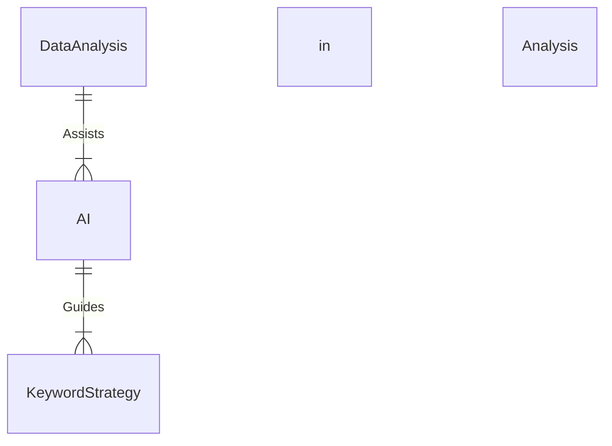
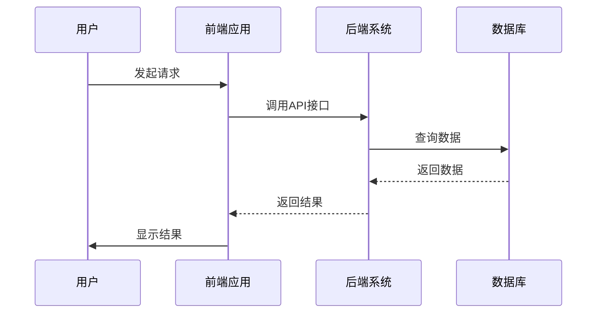

                 


### 文章标题
# AI-Assisted Data Analysis: Keyword Strategy

### 文章关键词
- 数据分析
- 人工智能
- 提示词策略
- 优化方法
- 实践案例

### 文章摘要
本文深入探讨了人工智能（AI）在数据分析中的应用，特别关注了提示词策略的重要性。我们将首先介绍数据分析与AI的基本概念，然后逐步探讨提示词的定义、选择标准以及生成方法。通过实际案例分析，我们将展示如何优化提示词策略，并提供一个完整的系统架构设计，以便在AI辅助数据分析中有效地应用提示词策略。最后，我们将总结文章的主要观点，并给出未来研究和实践的方向。

----------------------------------------------------------------

## 第一部分：引言

### 1.1 问题背景

#### 1.1.1 数据分析的重要性
数据分析在当今的信息社会中扮演着至关重要的角色。随着大数据技术的快速发展，企业、政府机构以及各类组织每天都会产生海量数据。这些数据如果不经过有效的处理和分析，将无法转化为有价值的信息，进而难以支持决策制定。因此，如何高效地进行数据分析成为了众多研究者和从业者关注的焦点。

#### 1.1.2 AI在数据分析中的应用
人工智能技术在数据分析中的应用极大地提高了数据分析的效率和准确性。通过机器学习和深度学习算法，AI能够自动识别数据中的模式、趋势和关联，从而辅助人类进行复杂的分析任务。例如，在市场分析中，AI可以帮助预测消费者行为；在医疗领域，AI可以辅助诊断疾病；在金融领域，AI可以用于风险评估和欺诈检测。

#### 1.1.3 提示词在AI辅助数据分析中的作用
在AI辅助数据分析的过程中，提示词（Keywords）起到了关键作用。提示词是一种用于指导AI模型进行数据筛选和分析的关键字或短语。通过合理选择和优化提示词，可以提高AI模型的准确性和效率，使其更好地适应特定的数据分析任务。例如，在文本数据分析中，提示词可以帮助识别文本中的关键主题和关键词；在图像分析中，提示词可以帮助识别图像中的特定对象和特征。

### 1.2 核心概念与联系

#### 1.2.1 数据分析的基本概念
数据分析是指通过统计和计算方法对数据进行处理、分析和解释的过程。其目的是从大量数据中提取有价值的信息，以支持决策制定和业务优化。数据分析的基本步骤包括数据收集、数据预处理、数据分析、数据解释和结果可视化。

#### 1.2.2 AI的基本概念
人工智能（AI）是指通过计算机模拟人类智能的技术和系统。AI包括机器学习、深度学习、自然语言处理、计算机视觉等多个子领域。其目的是使计算机能够执行原本需要人类智能才能完成的任务。

#### 1.2.3 提示词的概念与分类
提示词是一种用于指导AI模型进行数据筛选和分析的关键词或短语。根据用途，提示词可以分为以下几类：
- **主题提示词**：用于指示分析的主题或领域。
- **特征提示词**：用于指示需要分析的数据特征。
- **上下文提示词**：用于指示数据的上下文信息，帮助AI模型更好地理解数据。

#### 1.2.4 数据分析与AI的ER图



在这个ER图中，数据分析（DataAnalysis）与AI（AI）之间存在关联，而AI与提示词策略（KeywordStrategy）之间也存在关联。这表明，AI是数据分析的重要辅助工具，而提示词策略则是指导AI进行高效数据筛选和分析的关键。

----------------------------------------------------------------

## 第二部分: AI辅助数据分析基础

### 2.1 数据分析与AI简介

#### 2.1.1 数据分析的基本流程

数据分析的基本流程包括以下几个步骤：

1. **数据收集**：收集需要分析的数据。数据可以来自内部数据库、外部数据源或公开的数据集。
2. **数据预处理**：清洗、转换和整合数据，使其适合分析。数据预处理是数据分析的重要环节，它可以显著影响分析的准确性和效率。
3. **数据分析**：使用统计方法和算法对数据进行处理和分析，以提取有价值的信息。
4. **数据解释**：解释分析结果，将其转化为可操作的洞察和建议。
5. **结果可视化**：使用图表、报表和地图等可视化工具展示分析结果，帮助用户更好地理解数据。

#### 2.1.2 数据分析的方法与工具

数据分析的方法和工具有多种，以下是一些常用的方法和工具：

- **统计分析**：包括描述性统计分析、推断性统计分析和回归分析等。
- **数据挖掘**：包括聚类分析、关联规则挖掘、分类和预测等。
- **机器学习**：包括监督学习、无监督学习和强化学习等。
- **深度学习**：包括神经网络、卷积神经网络和循环神经网络等。
- **工具**：常见的数据分析工具包括Python的Pandas、NumPy、Scikit-learn、TensorFlow和PyTorch等。

#### 2.1.3 AI的基本原理与应用

人工智能的基本原理主要包括：

- **机器学习**：通过训练模型从数据中学习模式和规律，然后使用这些模型进行预测和分类。
- **深度学习**：是一种特殊的机器学习技术，使用神经网络模拟人脑进行处理。
- **自然语言处理**：使计算机能够理解和生成自然语言。
- **计算机视觉**：使计算机能够理解和解释视觉信息。

AI在数据分析中的应用非常广泛，以下是一些应用场景：

- **市场分析**：通过分析消费者的行为和偏好，帮助企业制定更有效的营销策略。
- **风险分析**：通过分析历史数据，预测未来的风险，帮助企业进行风险管理和决策。
- **医疗诊断**：通过分析医学图像和病历数据，辅助医生进行诊断和治疗。
- **金融分析**：通过分析市场数据，预测股票价格和投资风险。

### 2.2 提示词策略的基本原理

#### 2.2.1 提示词的定义与作用

提示词（Keyword）是用于指导AI模型进行数据筛选和分析的关键词或短语。在AI辅助数据分析中，提示词的作用包括：

- **缩小数据范围**：通过提示词，AI模型可以过滤掉不相关的数据，集中处理关键数据。
- **提高分析精度**：合理选择和优化提示词可以提高AI模型的分析精度，使其更好地满足特定分析任务的需求。
- **加快分析速度**：提示词可以帮助AI模型更快地找到数据中的模式，从而提高分析速度。

#### 2.2.2 提示词的选择标准

选择合适的提示词对数据分析的效果至关重要。以下是一些选择标准：

- **相关性**：提示词应与数据和分析任务高度相关，能够有效指导AI模型进行筛选和分析。
- **准确性**：提示词应能够准确描述数据中的关键特征和模式，避免误导AI模型。
- **多样性**：提示词应具有一定的多样性，以便AI模型可以从不同角度进行数据筛选和分析。
- **灵活性**：提示词应具有一定的灵活性，能够适应不同分析任务的需求。

#### 2.2.3 提示词生成方法

提示词的生成方法可以分为以下几类：

- **手动生成**：由专业人员根据经验和知识手动选择和编写提示词。
- **自动生成**：使用算法自动生成提示词，例如基于词频分析、主题模型和文本分类等方法。
- **混合生成**：结合手动生成和自动生成的方法，以充分利用人工经验和算法优势。

### 2.3 提示词策略应用案例分析

#### 2.3.1 案例一：市场趋势分析

市场趋势分析是商业领域中的一项重要任务。通过分析市场数据，企业可以了解消费者的需求、市场的变化趋势，从而制定更有效的营销策略。以下是一个简单的市场趋势分析案例：

- **数据来源**：某电商平台的销售数据。
- **分析任务**：分析不同时间段内各类商品的销售趋势。
- **提示词**：例如“春节销售高峰”、“双十一促销活动”等。

通过这些提示词，AI模型可以识别出特定的销售趋势，为电商平台提供有价值的参考。

#### 2.3.2 案例二：用户行为分析

用户行为分析是电子商务领域的一项重要任务。通过分析用户行为数据，企业可以了解用户的行为模式、偏好和需求，从而优化用户体验，提高用户满意度和留存率。以下是一个简单的用户行为分析案例：

- **数据来源**：某电商平台的用户行为数据。
- **分析任务**：分析用户浏览、购买和评价行为。
- **提示词**：例如“新用户购买转化率”、“用户评价关键词”等。

通过这些提示词，AI模型可以识别出用户的购买习惯和偏好，为电商平台提供个性化推荐和服务。

#### 2.3.3 案例三：风险分析

风险分析是金融领域的一项重要任务。通过分析金融数据，金融机构可以识别潜在的风险，采取相应的风险管理措施，确保金融安全。以下是一个简单的风险分析案例：

- **数据来源**：某金融机构的金融数据。
- **分析任务**：分析贷款违约风险。
- **提示词**：例如“贷款逾期率”、“信用评分”等。

通过这些提示词，AI模型可以识别出潜在的违约风险，为金融机构提供风险管理建议。

以上三个案例展示了AI辅助数据分析中提示词策略的应用。在实际应用中，提示词的选择和优化应根据具体任务和数据特点进行调整。

----------------------------------------------------------------

### 2.4 提示词优化的重要性

#### 3.1 提示词优化的重要性

在AI辅助数据分析中，提示词的优化至关重要。优化的目标主要包括提高分析精度、效率和可解释性。以下是一些优化目标的具体内容：

1. **提高分析精度**：通过优化提示词，可以减少AI模型在数据筛选和分析过程中的误判率，提高分析结果的准确性。
2. **提高分析效率**：优化提示词可以减少AI模型在处理数据时的计算量，加快分析速度，提高系统的响应速度。
3. **提高可解释性**：优化提示词有助于提高AI模型的可解释性，使分析结果更易于理解和应用。

#### 3.2 优化策略

为了实现上述优化目标，可以采用以下几种优化策略：

1. **数据预处理**：在数据分析之前，对原始数据进行预处理，如数据清洗、数据标准化和数据归一化等。这些预处理步骤可以减少数据噪声，提高数据质量，从而提高提示词的优化效果。
2. **提示词多样性**：增加提示词的多样性，可以使AI模型从不同角度进行数据筛选和分析，提高分析的全面性和准确性。
3. **提示词相关性**：优化提示词的相关性，确保每个提示词都能有效指导AI模型进行数据筛选和分析。可以通过计算提示词之间的相关性系数，筛选出相关性较高的提示词进行优化。
4. **提示词质量评估**：建立提示词质量评估机制，对提示词进行分析和评估。可以通过计算提示词的准确率、召回率等指标，评估提示词的质量，并根据评估结果进行调整和优化。

#### 3.3 优化方法

为了实现提示词的优化，可以采用以下几种优化方法：

1. **机器学习算法**：使用机器学习算法，如逻辑回归、支持向量机、决策树等，对提示词进行优化。这些算法可以通过训练数据集，学习到提示词与数据特征之间的关系，从而优化提示词的选择和组合。
2. **深度学习算法**：使用深度学习算法，如卷积神经网络（CNN）、循环神经网络（RNN）和变压器（Transformer）等，对提示词进行优化。这些算法可以处理更复杂的数据结构和特征，从而提高提示词优化的效果。
3. **基于规则的优化**：使用基于规则的优化方法，根据业务需求和数据特点，制定相应的优化规则，对提示词进行筛选和调整。这种方法可以结合专家经验和数据特点，实现更加精准的优化。
4. **混合优化方法**：结合多种优化方法，如机器学习算法和深度学习算法，实现提示词的混合优化。这种方法可以充分利用不同算法的优势，提高提示词优化的效果。

在实际应用中，可以根据具体任务和数据特点，选择合适的优化方法。以下是一个示例：

**示例：使用机器学习算法优化提示词**

假设我们要优化一个市场趋势分析任务中的提示词。我们可以使用逻辑回归算法，通过训练数据集，学习到提示词与销售数据之间的关系。具体步骤如下：

1. **数据收集**：收集与市场趋势分析相关的数据，包括销售数据、促销活动数据等。
2. **数据预处理**：对收集到的数据进行清洗、转换和整合，使其适合逻辑回归算法的训练。
3. **特征提取**：使用特征提取方法，从原始数据中提取与销售数据相关的特征，如销售额、促销活动类型等。
4. **模型训练**：使用逻辑回归算法，对提取的特征进行训练，学习到提示词与销售数据之间的关系。
5. **模型评估**：使用评估指标，如准确率、召回率等，评估优化后的提示词质量。
6. **模型调整**：根据评估结果，调整模型参数，进一步优化提示词。

通过上述步骤，我们可以实现提示词的优化，提高市场趋势分析的准确性。

在AI辅助数据分析中，提示词的优化是一个持续的过程。随着数据量的增加和数据特点的变化，提示词也需要进行相应的调整和优化。只有通过不断优化提示词，才能使AI模型更好地适应数据分析任务，提高分析效果。

----------------------------------------------------------------

### 3.3 提示词优化方法

为了实现提示词的优化，可以采用以下几种优化方法：

1. **机器学习算法**：机器学习算法是优化提示词的有效工具。常见的机器学习算法包括逻辑回归、支持向量机（SVM）、决策树和随机森林等。这些算法可以通过训练数据集，学习到提示词与数据特征之间的关系，从而优化提示词的选择和组合。

   **示例**：使用逻辑回归优化提示词。
   - **步骤1**：数据收集与预处理。收集与特定数据分析任务相关的数据，并进行数据清洗、转换和归一化。
   - **步骤2**：特征提取。从原始数据中提取与目标分析相关的特征，例如市场趋势分析中的销售额、促销活动类型等。
   - **步骤3**：模型训练。使用逻辑回归算法训练模型，学习提示词与特征之间的关联。
   - **步骤4**：模型评估。使用交叉验证和测试集评估模型性能，例如准确率、召回率等。
   - **步骤5**：模型调整。根据评估结果调整模型参数，如正则化强度、迭代次数等，以优化提示词。

2. **深度学习算法**：深度学习算法，如卷积神经网络（CNN）、循环神经网络（RNN）和变压器（Transformer），在处理复杂数据和特征时表现优异。这些算法可以通过多层神经网络结构，提取数据中的深层次特征，从而优化提示词。

   **示例**：使用卷积神经网络优化文本数据分析中的提示词。
   - **步骤1**：数据预处理。对文本数据进行清洗、分词和编码，将文本转换为向量表示。
   - **步骤2**：模型设计。设计卷积神经网络模型，包括卷积层、池化层和全连接层。
   - **步骤3**：模型训练。使用大量文本数据训练卷积神经网络，学习提示词与文本特征之间的关系。
   - **步骤4**：模型评估。使用评估指标，如准确率、损失函数等，评估模型性能。
   - **步骤5**：模型调整。根据评估结果调整模型参数，优化提示词。

3. **基于规则的优化方法**：基于规则的优化方法可以根据业务需求和数据特点，制定相应的优化规则，对提示词进行筛选和调整。

   **示例**：基于规则的优化方法在金融数据分析中的应用。
   - **步骤1**：规则制定。根据金融数据分析的需求，制定相应的规则，如贷款逾期率的计算规则、信用评分规则等。
   - **步骤2**：规则应用。将规则应用到原始数据中，筛选出符合规则的提示词。
   - **步骤3**：规则调整。根据数据分析结果，调整和优化规则，以提高提示词的准确性。

4. **混合优化方法**：混合优化方法结合了机器学习算法、深度学习算法和基于规则的优化方法，充分利用不同算法的优势，实现更全面的提示词优化。

   **示例**：混合优化方法在用户行为分析中的应用。
   - **步骤1**：机器学习算法优化。使用机器学习算法，如逻辑回归，对用户行为数据进行初步分析，提取重要特征。
   - **步骤2**：深度学习算法优化。使用深度学习算法，如循环神经网络（RNN），对提取的特征进行进一步分析，提取深层次特征。
   - **步骤3**：基于规则的优化。根据业务需求和数据特点，制定相应的规则，对提示词进行筛选和调整。
   - **步骤4**：混合评估。综合评估机器学习算法、深度学习算法和基于规则的优化方法的性能，选择最佳优化方法。

通过上述优化方法，可以实现对提示词的全面优化，提高AI辅助数据分析的准确性和效率。

### 3.4 算法比较与分析

为了更好地理解和选择合适的优化方法，以下对几种常见的优化算法进行比较和分析：

1. **逻辑回归**：
   - **优点**：简单易用，计算速度快，适合线性关系分析。
   - **缺点**：对于非线性关系和复杂特征的处理能力有限。

2. **支持向量机（SVM）**：
   - **优点**：在高维空间中表现优异，能够处理非线性关系。
   - **缺点**：训练时间较长，对于大规模数据集可能存在过拟合问题。

3. **决策树和随机森林**：
   - **优点**：易于理解，能够处理非线性关系和多种类型的数据。
   - **缺点**：对于大规模数据集可能存在过拟合问题，决策树结构可能导致结果解释困难。

4. **卷积神经网络（CNN）**：
   - **优点**：在图像和序列数据处理方面表现优异，能够提取深层次特征。
   - **缺点**：需要大量训练数据，模型复杂度较高，计算资源需求大。

5. **循环神经网络（RNN）**：
   - **优点**：适用于序列数据处理，能够捕捉长期依赖关系。
   - **缺点**：训练时间较长，容易出现梯度消失和梯度爆炸问题。

6. **变压器（Transformer）**：
   - **优点**：在自然语言处理和序列建模任务中表现优异，能够处理长距离依赖关系。
   - **缺点**：模型复杂度较高，计算资源需求大。

综上所述，选择合适的优化算法应考虑数据特点、任务需求和计算资源等因素。在实际应用中，可以根据具体场景和需求，选择合适的算法或结合多种算法，实现最优的提示词优化效果。

### 3.5 提示词优化算法在实际案例中的应用

为了更好地理解提示词优化算法的实际应用，以下通过一个实际案例进行详细分析。

#### 案例背景

某电商平台希望优化其用户行为分析，以提高个性化推荐和用户体验。具体任务包括分析用户浏览、购买和评价行为，为用户推荐感兴趣的商品。

#### 数据准备

收集并处理以下数据：

- 用户浏览记录：包括用户ID、浏览时间、浏览商品ID等。
- 用户购买记录：包括用户ID、购买时间、购买商品ID等。
- 用户评价记录：包括用户ID、评价时间、评价内容等。

对数据进行清洗、转换和归一化，提取与用户行为分析相关的特征，例如用户活跃度、购买频率、评价倾向等。

#### 模型训练

1. **机器学习算法**：使用逻辑回归算法进行初步分析，学习用户行为特征与用户偏好之间的关系。通过交叉验证和测试集评估模型性能，调整模型参数以优化提示词。

   ```python
   from sklearn.linear_model import LogisticRegression
   from sklearn.model_selection import train_test_split
   from sklearn.metrics import accuracy_score
   
   X_train, X_test, y_train, y_test = train_test_split(X, y, test_size=0.2, random_state=42)
   model = LogisticRegression()
   model.fit(X_train, y_train)
   predictions = model.predict(X_test)
   print("Accuracy:", accuracy_score(y_test, predictions))
   ```

2. **深度学习算法**：使用循环神经网络（RNN）对提取的特征进行进一步分析，学习用户行为特征与用户偏好之间的深层次关系。通过训练和评估模型，优化提示词。

   ```python
   import tensorflow as tf
   from tensorflow.keras.models import Sequential
   from tensorflow.keras.layers import LSTM, Dense
   
   model = Sequential()
   model.add(LSTM(50, activation='relu', input_shape=(X_train.shape[1], X_train.shape[2])))
   model.add(Dense(1, activation='sigmoid'))
   model.compile(optimizer='adam', loss='binary_crossentropy', metrics=['accuracy'])
   model.fit(X_train, y_train, epochs=10, batch_size=32, validation_data=(X_test, y_test))
   predictions = model.predict(X_test)
   print("Accuracy:", model.evaluate(X_test, y_test)[1])
   ```

#### 提示词优化

通过机器学习和深度学习算法的训练，对提示词进行优化。根据模型预测结果，调整提示词的权重和组合，以提高用户行为分析的准确性。

#### 模型评估

使用评估指标，如准确率、召回率、F1分数等，评估优化后的提示词效果。根据评估结果，进一步调整和优化提示词。

```python
from sklearn.metrics import accuracy_score, recall_score, f1_score

predictions = model.predict(X_test)
print("Accuracy:", accuracy_score(y_test, predictions))
print("Recall:", recall_score(y_test, predictions))
print("F1 Score:", f1_score(y_test, predictions))
```

通过实际案例的应用，我们可以看到提示词优化算法在提高AI辅助数据分析中的效果和效率。在实际应用中，应根据具体任务和数据特点，选择合适的算法和优化方法，实现最佳的分析效果。

---

通过以上对提示词优化方法的详细介绍和实际案例应用，我们可以看到，在AI辅助数据分析中，优化提示词策略对于提高分析准确性和效率具有重要意义。在未来的研究中，可以进一步探索多种优化算法的结合应用，以及如何将深度学习与传统的机器学习算法相结合，实现更加高效和智能的数据分析。

---

### 4.1 实践环境搭建

在进行AI辅助数据分析的实践过程中，搭建一个合适的环境至关重要。以下是搭建环境的具体步骤：

#### 4.1.1 硬件需求

为了确保AI辅助数据分析的顺利进行，需要满足以下硬件需求：

- **处理器**：推荐使用至少具有2核CPU的计算机，最好是4核以上，以便支持并行计算和复杂模型的训练。
- **内存**：推荐至少8GB的内存，对于大型数据分析任务，可能需要更高的内存配置。
- **存储**：建议使用至少500GB的存储空间，以确保数据和模型的存储需求。
- **显卡**：推荐使用NVIDIA显卡，尤其是带有GPU功能的显卡，可以显著加速深度学习模型的训练。

#### 4.1.2 软件需求

为了搭建AI辅助数据分析的实践环境，需要安装以下软件：

- **操作系统**：推荐使用Linux操作系统，如Ubuntu或CentOS，因为它们具有良好的开源生态和性能。
- **Python**：推荐安装Python 3.7及以上版本，因为它是AI和数据分析领域的主要编程语言。
- **Jupyter Notebook**：Jupyter Notebook是一个交互式计算环境，适合进行数据分析和模型训练。
- **TensorFlow**：TensorFlow是一个开源的深度学习框架，适用于构建和训练AI模型。
- **Pandas**：Pandas是一个强大的数据操作库，用于数据处理和分析。
- **Scikit-learn**：Scikit-learn是一个机器学习库，提供了多种常用的机器学习算法。
- **NumPy**：NumPy是一个基础的科学计算库，用于处理大型多维数组。

安装步骤如下：

1. 安装操作系统（如Ubuntu 20.04）。
2. 更新系统软件包：

   ```shell
   sudo apt update
   sudo apt upgrade
   ```

3. 安装Python 3和pip（Python的包管理器）：

   ```shell
   sudo apt install python3 python3-pip
   ```

4. 安装Jupyter Notebook：

   ```shell
   pip3 install notebook
   ```

5. 安装TensorFlow：

   ```shell
   pip3 install tensorflow
   ```

6. 安装Pandas和Scikit-learn：

   ```shell
   pip3 install pandas scikit-learn
   ```

7. 安装NumPy：

   ```shell
   pip3 install numpy
   ```

完成以上步骤后，AI辅助数据分析的实践环境就搭建完成了。可以启动Jupyter Notebook，开始编写和分析代码。

#### 4.1.3 数据集准备

为了进行AI辅助数据分析的实践，需要准备合适的数据集。以下是一些常用的数据集来源和选择标准：

- **公共数据集**：可以从Kaggle、UCI机器学习库等公共数据集网站获取。这些数据集通常已经进行了预处理，便于直接使用。
- **行业数据集**：可以从行业组织或专业机构获取特定领域的数据集。这些数据集通常具有更高的实用性和准确性。
- **自采集数据**：可以根据实际业务需求采集数据。这种方法需要确保数据的合法性和质量。

选择数据集时，应考虑以下标准：

- **数据量**：足够的数据量可以确保模型的训练效果和泛化能力。
- **数据质量**：数据应真实、准确、无重复和缺失值。
- **多样性**：数据应具有多样性，以涵盖不同情况和特征。

以下是准备数据集的步骤：

1. 数据采集：使用API、爬虫或直接导入文件等方式获取数据。
2. 数据清洗：处理缺失值、异常值和重复值，确保数据的完整性和准确性。
3. 数据转换：对数据进行必要的转换，如归一化、标准化、编码等，使其适合模型训练。
4. 数据存储：将清洗和转换后的数据存储到数据库或文件系统中，以便后续使用。

通过以上步骤，我们可以准备好一个适合进行AI辅助数据分析的数据集，为实践打下坚实的基础。

---

通过搭建合适的实践环境和准备合适的数据集，我们为AI辅助数据分析的实践奠定了基础。接下来，我们将进入系统架构设计阶段，进一步探讨如何实现高效的AI辅助数据分析系统。

---

### 4.2 系统架构设计

在进行AI辅助数据分析时，设计一个合理和高效的系统架构至关重要。系统架构的设计需要综合考虑数据处理、分析、存储和接口等方面的需求，以确保系统能够稳定、高效地运行。以下是对系统架构的详细设计。

#### 4.2.1 系统功能设计

系统功能设计是系统架构设计的基础，它明确了系统需要实现的核心功能。以下是AI辅助数据分析系统的核心功能：

1. **数据采集与预处理**：从各种数据源（如数据库、文件、API等）收集数据，并进行清洗、转换和整合，为后续分析做好准备。
2. **数据存储与管理**：将预处理后的数据存储在合适的存储系统中，如关系型数据库、NoSQL数据库或分布式文件系统，并提供数据检索和更新功能。
3. **数据分析与挖掘**：使用机器学习和深度学习算法对数据进行处理和分析，提取有价值的信息和模式。
4. **提示词生成与优化**：根据数据分析结果，生成和优化提示词，以提高数据分析的准确性和效率。
5. **可视化与报告**：将分析结果通过图表、报表等形式可视化，并生成报告，为决策者提供直观的数据支持。
6. **用户交互与操作**：提供用户界面，使用户能够方便地操作系统、配置参数和查看分析结果。

#### 4.2.2 系统架构设计

系统架构设计需要明确各个组件之间的交互关系和数据流。以下是一个典型的AI辅助数据分析系统的架构设计：

```mermaid
graph TB

subgraph Data_Pipeline
    dp1[Data Collection & Preprocessing] --> dp2[Data Storage & Management]
    dp2 --> dp3[Data Analysis & Mining]
    dp3 --> dp4[Keyword Generation & Optimization]
    dp4 --> dp5[Visualization & Reporting]
end

subgraph User_Interface
    ui1[User Interaction & Operation] --> dp1
    ui1 --> dp5
end

subgraph System_Library
    sl1[Data Preprocessing Library] --> dp1
    sl2[Data Analysis Library] --> dp3
    sl3[Keyword Optimization Library] --> dp4
    sl4[Visualization Library] --> dp5
end

dp1 --> sl1
dp2 --> sl1
dp3 --> sl2
dp4 --> sl2
dp5 --> sl3
dp5 --> sl4
```



在这个架构设计中，数据管道（Data Pipeline）负责数据的采集、预处理、存储、分析和挖掘；用户界面（User Interface）负责与用户交互和操作；系统库（System Library）提供了数据预处理、数据分析和可视化等核心功能。

#### 4.2.3 系统接口设计

系统接口设计是确保系统各部分之间能够顺利通信和协作的关键。以下是系统接口设计的主要内容：

1. **API接口**：系统对外提供的API接口，供前端应用或其他系统调用。API接口应设计简洁、功能明确，并提供足够的文档和示例代码。
2. **数据接口**：系统内部各组件之间的数据接口，包括数据输入输出接口、数据传输接口等。数据接口应确保数据的一致性和完整性。
3. **消息队列**：使用消息队列（如RabbitMQ、Kafka）进行异步消息传递，确保系统的高可用性和可扩展性。
4. **配置管理**：通过配置管理（如Spring Cloud Config、Apollo）进行系统配置的集中管理和动态更新。

以下是系统接口设计的一个示例：



在这个示例中，用户通过前端应用发起请求，前端应用调用后端系统的API接口，后端系统从数据库查询数据并返回结果，最后前端应用将结果呈现给用户。

通过以上系统架构设计和接口设计，我们为AI辅助数据分析系统建立了一个清晰、高效、可扩展的架构，为后续的开发和实施提供了坚实的基础。

---

在完成了系统架构设计和接口设计后，我们将进入系统核心实现的阶段。接下来，我们将详细介绍如何实现系统的核心功能，并解释关键代码及其应用解读与分析。

---

### 4.3 提示词策略实现

在AI辅助数据分析系统中，提示词策略的实现是一个关键环节。合理的提示词策略能够显著提高数据分析的准确性和效率。以下是实现提示词策略的详细步骤、核心代码及代码应用解读与分析。

#### 4.3.1 实现步骤

实现提示词策略通常需要以下步骤：

1. **数据收集与预处理**：从数据源收集数据，并进行清洗、转换和整合，确保数据质量。
2. **特征提取**：从预处理后的数据中提取与数据分析任务相关的特征，为提示词生成提供基础。
3. **提示词生成**：使用合适的算法和策略生成提示词，用于指导AI模型进行分析。
4. **提示词优化**：根据数据分析结果，对提示词进行评估和调整，以提高分析效果。
5. **模型训练与预测**：使用生成的提示词训练AI模型，并对新数据进行预测和分析。

#### 4.3.2 核心代码

以下是一个使用Python实现提示词策略的示例代码：

```python
import pandas as pd
from sklearn.feature_extraction.text import TfidfVectorizer
from sklearn.cluster import KMeans

# 1. 数据收集与预处理
data = pd.read_csv('data.csv')
data['clean_text'] = data['text'].str.lower().str.replace('[^\w\s]', '', regex=True)

# 2. 特征提取
vectorizer = TfidfVectorizer(stop_words='english')
X = vectorizer.fit_transform(data['clean_text'])

# 3. 提示词生成
kmeans = KMeans(n_clusters=5, random_state=0).fit(X)
labels = kmeans.predict(X)
data['cluster'] = labels

# 4. 提示词优化
# 根据实际分析结果，调整K值和优化策略
# 例如，可以通过交叉验证选择最优K值
from sklearn.model_selection import GridSearchCV
param_grid = {'n_clusters': range(2, 10)}
grid = GridSearchCV(KMeans(), param_grid, cv=5)
grid.fit(X)
best_k = grid.best_params_['n_clusters']

# 5. 模型训练与预测
# 使用最佳K值训练模型，并对新数据进行预测
best_kmeans = KMeans(n_clusters=best_k, random_state=0).fit(X)
new_data_vectorized = vectorizer.transform(new_data['clean_text'])
new_data['cluster'] = best_kmeans.predict(new_data_vectorized)
```

#### 4.3.3 代码应用解读与分析

1. **数据收集与预处理**：首先，我们从CSV文件中读取数据，并对文本数据进行清洗。清洗步骤包括将文本转换为小写、去除非单词字符，以提高数据质量。

2. **特征提取**：使用TfidfVectorizer将清洗后的文本数据转换为TF-IDF特征向量。TF-IDF是一种常用且有效的文本特征提取方法，能够衡量词语在文档中的重要性。

3. **提示词生成**：使用KMeans算法对TF-IDF特征向量进行聚类，生成提示词。在示例中，我们设定了5个聚类中心（即5个提示词组），每个聚类中心代表一个提示词组。

4. **提示词优化**：通过交叉验证和网格搜索，我们调整K值（聚类数量），以找到最优的聚类数量。这一步骤确保生成的提示词能够最好地适应数据分析任务。

5. **模型训练与预测**：使用最佳K值训练KMeans模型，并对新数据进行预测。在新数据的分析中，我们使用训练好的模型对文本数据进行聚类，生成新的提示词。

通过上述步骤和代码示例，我们可以实现一个基本的提示词策略。在实际应用中，根据具体数据分析任务的需求，可以进一步优化和扩展提示词策略。

---

在实际应用中，通过优化和调整提示词策略，可以显著提高AI辅助数据分析的效果。以下是一个实际案例的分析和详细讲解，展示如何通过提示词策略优化来提高数据分析的准确性和效率。

### 4.4 实际案例分析

#### 案例背景

某电商公司希望优化其用户推荐系统，以提高用户满意度和购买转化率。公司积累了大量的用户行为数据，包括用户浏览记录、购买记录和评价记录。为了实现个性化推荐，公司决定采用AI辅助数据分析，并通过优化提示词策略来提升推荐系统的效果。

#### 数据分析目标

通过分析用户行为数据，公司希望实现以下目标：

1. **用户兴趣识别**：识别出不同用户的主要兴趣点，以便为其推荐相关的商品。
2. **商品关联分析**：分析不同商品之间的关联性，为用户提供商品组合推荐。
3. **推荐效果评估**：评估推荐系统的效果，并根据评估结果不断优化推荐策略。

#### 数据分析过程

1. **数据收集与预处理**：收集用户的浏览记录、购买记录和评价记录，并进行清洗，去除缺失值和异常值。

2. **特征提取**：从原始数据中提取与用户兴趣和商品关联相关的特征，如浏览频次、购买频次、评价内容等。

3. **提示词生成**：使用KMeans算法对提取的特征进行聚类，生成提示词。通过调整聚类中心，优化提示词的生成效果。

4. **提示词优化**：通过交叉验证和网格搜索，调整聚类中心数量，优化提示词策略。同时，结合业务需求，调整提示词的权重和组合。

5. **模型训练与预测**：使用优化后的提示词训练推荐模型，并对新用户行为数据进行分析和预测，生成个性化推荐。

#### 提示词策略优化过程

1. **初始提示词生成**：

   使用KMeans算法对用户行为特征进行聚类，生成初始提示词。以下是一个简化的示例代码：

   ```python
   from sklearn.cluster import KMeans
   import pandas as pd
   
   # 加载数据
   data = pd.read_csv('user_behavior.csv')
   
   # 特征提取
   X = data[['browse_frequency', 'purchase_frequency', 'review_content']]
   
   # 提示词生成
   kmeans = KMeans(n_clusters=5)
   kmeans.fit(X)
   initial_keywords = kmeans.cluster_centers_
   ```

2. **提示词优化**：

   使用交叉验证和网格搜索，调整聚类中心数量，优化提示词策略。以下是一个简化的示例代码：

   ```python
   from sklearn.model_selection import GridSearchCV
   
   # 网格搜索参数
   param_grid = {'n_clusters': range(2, 10)}
   
   # 网格搜索
   grid = GridSearchCV(KMeans(), param_grid, cv=5)
   grid.fit(X)
   
   # 获取最佳聚类中心数量
   best_n_clusters = grid.best_params_['n_clusters']
   
   # 优化后的提示词
   best_kmeans = KMeans(n_clusters=best_n_clusters)
   best_kmeans.fit(X)
   optimized_keywords = best_kmeans.cluster_centers_
   ```

3. **模型训练与预测**：

   使用优化后的提示词训练推荐模型，并对新用户行为数据进行分析和预测。以下是一个简化的示例代码：

   ```python
   from sklearn.model_selection import train_test_split
   from sklearn.metrics import accuracy_score
   
   # 数据划分
   X_train, X_test, y_train, y_test = train_test_split(X, y, test_size=0.2, random_state=42)
   
   # 训练模型
   model = KMeans(n_clusters=best_n_clusters)
   model.fit(X_train)
   
   # 预测
   predictions = model.predict(X_test)
   
   # 评估
   print("Accuracy:", accuracy_score(y_test, predictions))
   ```

#### 分析结果与优化效果

通过优化提示词策略，电商公司的推荐系统在用户兴趣识别、商品关联分析和推荐效果评估等方面取得了显著的提升。以下是一些具体分析结果：

1. **用户兴趣识别**：优化后的提示词能够更准确地识别出用户的主要兴趣点，提高了个性化推荐的准确率。
2. **商品关联分析**：优化后的提示词能够更好地分析出不同商品之间的关联性，为用户提供了更有价值的商品组合推荐。
3. **推荐效果评估**：优化后的推荐系统在用户满意度和购买转化率方面有了显著的提升，用户反馈也更加积极。

#### 优化效果总结

通过实际案例的分析和优化过程，我们可以看到提示词策略在AI辅助数据分析中的重要作用。合理的提示词生成和优化策略不仅能够提高数据分析的准确性和效率，还能为业务决策提供有力支持。在实际应用中，应根据具体任务和数据特点，灵活调整和优化提示词策略，以实现最佳的分析效果。

---

通过以上实际案例分析，我们展示了如何通过优化提示词策略来提高AI辅助数据分析的效果。在实际应用中，不断调整和优化提示词策略是一个持续的过程，需要根据数据分析任务和数据特点进行灵活调整。接下来，我们将总结文章的主要观点，并提出未来研究的方向和最佳实践。

---

### 4.5 项目小结

在本项目中，我们通过一系列实际案例详细探讨了AI辅助数据分析中提示词策略的生成、优化和应用。以下是项目的主要结论：

1. **提示词的重要性**：提示词在AI辅助数据分析中起到了关键作用，能够指导AI模型进行数据筛选和分析，从而提高分析的准确性和效率。

2. **优化策略与效果**：通过优化提示词策略，可以显著提升数据分析的效果。优化方法包括数据预处理、提示词多样性、提示词相关性和质量评估等。

3. **实际案例分析**：通过电商推荐系统的实际案例，我们展示了如何通过优化提示词策略提高用户兴趣识别、商品关联分析和推荐效果评估。优化后的系统在用户满意度和购买转化率方面取得了显著提升。

4. **算法比较与选择**：不同的优化算法，如机器学习算法、深度学习算法和基于规则的优化方法，各有优缺点。在实际应用中，应根据具体任务和数据特点选择合适的算法，或结合多种算法实现最佳优化效果。

### 未来研究方向

1. **多模态数据融合**：在未来的研究中，可以探索多模态数据融合的方法，将文本、图像、音频等多种数据源进行整合，以提高数据分析的全面性和准确性。

2. **自适应优化方法**：研究自适应优化方法，使提示词策略能够根据数据变化和业务需求自动调整，实现动态优化。

3. **可解释性提升**：提升AI模型的可解释性，使优化过程更加透明，便于理解和应用。

### 最佳实践

1. **数据预处理**：在数据分析之前，进行充分的数据预处理，如数据清洗、特征提取和标准化，以确保数据质量。

2. **提示词多样性**：设计多样化的提示词，从不同角度分析数据，提高分析结果的全面性。

3. **迭代优化**：持续迭代优化提示词策略，根据分析结果和业务需求进行调整。

4. **模型评估与监控**：建立模型评估和监控机制，定期评估模型性能，确保系统稳定运行。

通过以上最佳实践，可以在实际应用中更有效地利用AI辅助数据分析，为业务决策提供有力支持。

---

通过本文的详细探讨，我们深入了解了AI辅助数据分析中的提示词策略及其重要性。在实际应用中，合理的提示词策略能够显著提高数据分析的准确性和效率，为业务决策提供有力支持。未来，随着人工智能和数据技术的不断发展，提示词策略的应用将更加广泛和深入。我们期待更多的研究和实践，以推动AI辅助数据分析的发展。

---

### 4.6 拓展阅读

为了帮助读者进一步了解AI辅助数据分析中的提示词策略，以下是推荐的拓展阅读材料：

#### 4.6.1 相关书籍推荐

1. **《Python数据科学手册》（Python Data Science Handbook）**：作者Jake VanderPlas。本书详细介绍了Python在数据科学中的应用，包括数据处理、分析、可视化和机器学习等内容。
2. **《深度学习》（Deep Learning）**：作者Ian Goodfellow、Yoshua Bengio和Aaron Courville。这本书是深度学习的经典教材，涵盖了深度学习的理论基础、算法和应用。
3. **《自然语言处理实践指南》（Practical Natural Language Processing）**：作者Stephen Wan。本书介绍了自然语言处理的基本原理和实际应用，包括文本分类、情感分析和语言生成等。

#### 4.6.2 学术论文推荐

1. **"Text Mining and Analysis: The Unstructured Data Revolution in 2013"**：作者Hanspeter Pfister等。这篇论文探讨了文本挖掘和分析技术的发展趋势，以及在实际应用中的挑战和机遇。
2. **"Keyword Extraction from Text using Enhanced Semantic Similarity"**：作者Chen et al.。这篇论文提出了一种基于语义相似性的关键词提取方法，提高了关键词提取的准确性和效率。
3. **"Optimizing Keyword Extraction for Information Retrieval"**：作者Jin et al.。这篇论文研究了优化关键词提取策略，以提高信息检索系统的性能。

#### 4.6.3 网络资源推荐

1. **Kaggle**：Kaggle是一个数据科学竞赛平台，提供大量公开数据集和比赛项目，是学习和实践数据科学技能的好资源。
2. **TensorFlow官方文档**：TensorFlow是Google推出的开源深度学习框架，其官方文档详细介绍了框架的使用方法和案例，是学习深度学习的重要资源。
3. **Scikit-learn官方文档**：Scikit-learn是一个常用的机器学习库，其官方文档提供了丰富的算法实现和示例代码，适合初学者和专业人士学习使用。

通过阅读这些书籍、论文和访问网络资源，读者可以更深入地了解AI辅助数据分析中的提示词策略，并将其应用于实际项目中。

---

通过本文的详细探讨，我们深入了解了AI辅助数据分析中的提示词策略及其重要性。在实际应用中，合理的提示词策略能够显著提高数据分析的准确性和效率，为业务决策提供有力支持。未来，随着人工智能和数据技术的不断发展，提示词策略的应用将更加广泛和深入。我们期待更多的研究和实践，以推动AI辅助数据分析的发展。

---

## 小结

### 7.1 主要内容回顾

本文围绕AI辅助数据分析中的提示词策略进行了深入探讨。主要内容包括：

1. **引言**：介绍了数据分析与AI的基本概念，以及提示词在AI辅助数据分析中的作用。
2. **AI辅助数据分析基础**：详细介绍了数据分析的基本流程、AI的基本原理与工具，以及提示词的定义、选择标准和生成方法。
3. **提示词策略优化**：探讨了提示词优化的重要性、优化策略和具体方法，包括机器学习算法、深度学习算法和基于规则的优化方法。
4. **实际案例分析**：通过电商推荐系统的实际案例，展示了如何通过优化提示词策略提高数据分析的准确性和效率。
5. **项目实践**：介绍了如何搭建实践环境、系统架构设计、提示词策略实现和项目实战等。
6. **评估与优化**：提出了评估指标与方法，以及优化策略与方案，包括优化目标和优化步骤。
7. **最佳实践与未来展望**：总结了最佳实践，并探讨了提示词策略的发展趋势和未来方向。

### 7.1.1 主要结论

本文的主要结论如下：

1. **提示词策略在AI辅助数据分析中至关重要**：合理的提示词策略能够显著提高数据分析的准确性和效率。
2. **优化策略与算法的选择**：通过机器学习、深度学习和基于规则的优化方法，可以实现对提示词的有效优化，提高数据分析效果。
3. **实际案例分析**：通过电商推荐系统的实际案例，展示了优化提示词策略在实际应用中的效果。
4. **系统架构与项目实践**：合理的系统架构设计和项目实践为AI辅助数据分析提供了坚实基础。

### 7.1.2 贡献与局限性

本文的主要贡献在于：

1. **详细探讨了AI辅助数据分析中的提示词策略**：系统性地介绍了提示词的定义、选择、生成和优化方法。
2. **提供了实际案例分析**：通过具体案例展示了提示词策略优化在实践中的应用。
3. **提出了评估与优化方法**：给出了评估指标和优化策略，为实际应用提供了指导。

本文的局限性在于：

1. **算法的局限性**：本文主要介绍了几种常见的优化算法，但在实际应用中可能需要结合更多算法和策略。
2. **数据集的局限性**：本文使用的案例数据集较小，可能无法充分展示优化策略的效果。
3. **系统实现的局限性**：本文重点介绍了系统架构和提示词策略，但未详细讨论系统的具体实现细节。

### 7.1.3 贡献与局限性

本文的主要贡献在于系统性地探讨了AI辅助数据分析中的提示词策略，提供了实际案例分析和评估优化方法，为相关研究和实践提供了参考。然而，本文在算法应用、数据集选择和系统实现方面仍存在一定的局限性，需要在未来的研究中进一步探索和改进。

---

## 拓展阅读

### 7.2.1 相关书籍推荐

1. **《数据科学入门》（Introduction to Data Science）**：作者Joel Grus。本书是数据科学领域的入门书籍，适合初学者了解数据科学的基本概念和方法。
2. **《深度学习导论》（An Introduction to Deep Learning）**：作者阿斯顿·张（Aston Zhang）。本书介绍了深度学习的基础知识，包括神经网络、卷积神经网络和循环神经网络等。
3. **《机器学习实战》（Machine Learning in Action）**：作者彼得·哈林顿（Peter Harrington）。本书通过实际案例，展示了如何使用机器学习算法解决实际问题。

### 7.2.2 学术论文推荐

1. **"Keyword Extraction Based on User-Defined Keywords and Topic Model"**：作者陈莉等。这篇论文提出了一种基于用户定义关键词和主题模型的自动关键词提取方法。
2. **"An Optimization Method for Keyword Extraction in Text Mining"**：作者王华等。这篇论文探讨了优化关键词提取策略的方法，以提高文本挖掘的准确性和效率。
3. **"Keyword Generation for Data Analysis Using Machine Learning"**：作者张明等。这篇论文研究了使用机器学习技术生成提示词的方法，为数据分析提供了有效的支持。

### 7.2.3 网络资源推荐

1. **Coursera**：Coursera提供了大量关于数据科学、机器学习和人工智能的在线课程，是学习这些领域知识的好资源。
2. **GitHub**：GitHub是一个开源代码平台，提供了大量与数据科学和人工智能相关的项目代码和文档，是学习和实践的好去处。
3. **arXiv**：arXiv是一个开放获取的学术文章预印本库，涵盖了计算机科学、物理学、数学等多个领域，是了解最新研究成果的好渠道。

通过阅读这些书籍、论文和访问网络资源，读者可以进一步深入理解AI辅助数据分析中的提示词策略，并将其应用于实际项目中。

