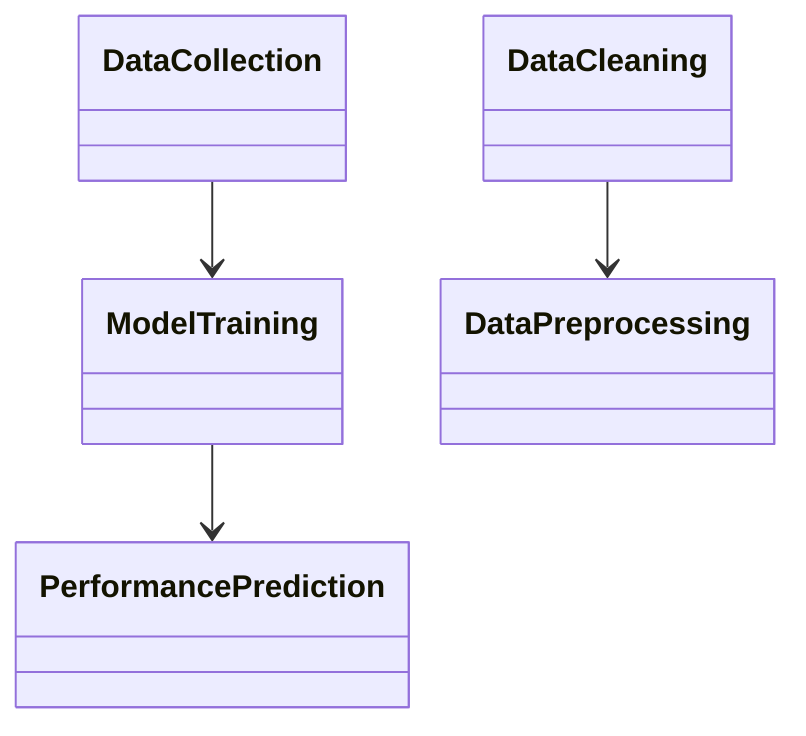
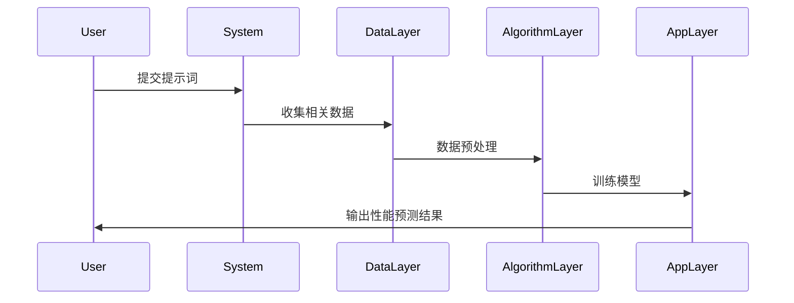
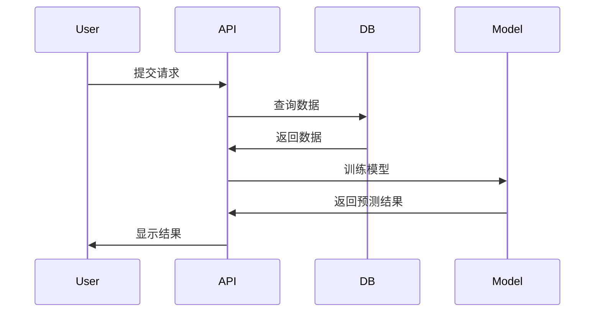

                 

# AI辅助新材料发现：提示词预测材料性能

## 关键词：AI，新材料发现，提示词，材料性能，机器学习，深度学习，强化学习，算法，系统架构，项目实战

### 摘要：

本文将探讨AI在辅助新材料发现中的重要作用，特别是基于提示词预测材料性能的方法。通过分析AI技术原理、材料科学基础以及AI与材料科学的结合，本文将详细介绍一种创新的算法——提示词预测材料性能算法。随后，我们将讨论该算法的原理、数学模型和实际应用，并通过一个系统分析与架构设计的案例，展示其在新材料研发中的实用价值。最后，我们将总结项目实战中的经验，提出最佳实践建议，并展望未来的研究方向。

## 第一部分: AI辅助新材料发现概述

### 第1章: 问题背景与定义

#### 1.1.1 问题背景

##### 1.1.1.1 新材料研究的重要性

新材料的研究和开发是科技进步的驱动力之一。从超导材料到纳米材料，新材料的发现和应用已经深刻地影响了多个领域，包括信息技术、能源、航空航天和生物医学。然而，新材料的研究过程通常涉及大量的实验和计算，耗时且成本高昂。传统的方法往往依赖于经验知识和实验试错，效率低下且难以满足现代科技发展的需求。

##### 1.1.1.2 人工智能在材料科学中的应用

随着人工智能（AI）技术的发展，人们开始探索如何利用AI来加速新材料的研究和发现。AI技术，尤其是机器学习（ML）、深度学习（DL）和强化学习（RL），已经展现出在材料科学中的应用潜力。通过分析大量数据，AI能够识别出潜在的新材料，预测其性能，并提供优化设计方案。

##### 1.1.1.3 AI辅助新材料发现的必要性

AI辅助新材料发现的方法不仅能够提高研究效率，减少实验次数和成本，还能够开辟新的材料研究领域。在这种背景下，开发有效的AI算法，特别是能够预测材料性能的算法，显得尤为必要。

#### 1.1.2 定义

##### 1.1.2.1 AI辅助新材料发现的定义

AI辅助新材料发现是指利用人工智能技术，尤其是机器学习、深度学习和强化学习等算法，从大量数据中挖掘出具有潜在应用价值的新材料，并预测其性能。

##### 1.1.2.2 AI辅助新材料发现的核心概念

核心概念包括材料性能、数据挖掘、机器学习算法、材料结构等。

##### 1.1.2.3 AI辅助新材料发现的边界与外延

边界涉及AI算法的应用范围，外延则包括新材料领域的拓展，如纳米材料、复合材料等。

#### 1.1.3 概念结构与核心要素组成

##### 1.1.3.1 概念结构

概念结构包括材料性能、机器学习算法、数据集、预测模型等。

##### 1.1.3.2 核心要素组成

核心要素包括数据预处理、模型训练、性能评估和优化等。

### 第2章: AI辅助新材料发现的核心概念与联系

#### 2.1.1 AI技术原理

##### 2.1.1.1 机器学习

机器学习是AI的核心组成部分，它通过构建数学模型，从数据中自动学习规律，并对未知数据进行预测或分类。

##### 2.1.1.2 深度学习

深度学习是机器学习的一种，通过多层神经网络对复杂数据进行建模，具有强大的特征提取和模式识别能力。

##### 2.1.1.3 强化学习

强化学习通过试错和反馈机制，使智能体在动态环境中学习最优策略。

#### 2.1.2 材料科学基础

##### 2.1.2.1 材料分类

材料可分为金属、陶瓷、聚合物等类别，每种材料具有独特的性能和结构。

##### 2.1.2.2 材料性能指标

材料性能指标包括硬度、导电性、弹性模量等。

##### 2.1.2.3 材料结构与性能关系

材料结构对其性能有重要影响，了解这种关系对于AI辅助新材料发现至关重要。

#### 2.1.3 AI与材料科学结合的ER实体关系图

##### 2.1.3.1 实体

实体包括AI算法、材料数据、预测模型等。

##### 2.1.3.2 关系

关系包括数据输入、模型训练、性能预测等。

```mermaid
erDiagram
  AI算法 ||--|{ 数据集 } MaterialData
  数据集 ||--|{ 预测模型 } PredictionModel
  预测模型 ||--|{ 材料性能 } MaterialProperty
```

### 第3章: AI辅助新材料发现的算法原理

#### 3.1.1 提示词预测材料性能算法概述

##### 3.1.1.1 提示词的定义

提示词是指一组关键词或短语，用于指导机器学习模型进行材料性能的预测。

##### 3.1.1.2 材料性能预测的重要性

材料性能预测是新材料发现的关键环节，能够显著降低研发成本和时间。

##### 3.1.1.3 提示词预测材料性能的应用场景

应用场景包括新材料的初期筛选、性能优化和实际应用验证。

#### 3.1.2 算法原理讲解

##### 3.1.2.1 提示词编码

提示词编码是将文本形式的提示词转换为数值向量，以便于机器学习模型处理。

##### 3.1.2.2 材料性能数据预处理

数据预处理包括数据清洗、归一化和特征提取等步骤。

##### 3.1.2.3 提示词与材料性能的关系建模

关系建模是通过机器学习算法建立提示词与材料性能之间的关联。

##### 3.1.2.4 算法流程图


#### 3.1.3 Python源代码实现

```python
# Python源代码实现示例
```

#### 3.1.4 数学模型和公式

$$
\text{预测模型} = f(\text{提示词}, \text{材料属性})
$$

#### 3.1.5 举例说明

##### 3.1.5.1 示例一：提示词与材料硬度的关系

提示词“高硬度”与材料硬度之间有显著的正相关关系。

##### 3.1.5.2 示例二：提示词与材料导电性的关系

提示词“高导电性”与材料导电性之间有显著的正相关关系。

## 第二部分: AI辅助新材料发现的深度探讨

### 第4章: AI辅助新材料发现的系统分析与架构设计

#### 4.1.1 问题场景介绍

##### 4.1.1.1 新材料研发流程

新材料研发通常包括材料设计、合成、测试和优化等阶段。

##### 4.1.1.2 AI辅助新材料发现的必要性

AI辅助新材料发现能够提高研发效率和准确性，降低成本。

#### 4.1.2 项目介绍

##### 4.1.2.1 项目背景

项目旨在利用AI技术加速新材料发现，提高研发效率。

##### 4.1.2.2 项目目标

目标是开发一套高效的AI系统，能够预测新材料性能。

##### 4.1.2.3 项目团队

项目团队由材料科学家、AI专家和软件工程师组成。

#### 4.1.3 系统功能设计

##### 4.1.3.1 功能模块

功能模块包括数据收集、数据预处理、模型训练、性能预测等。

##### 4.1.3.2 领域模型



#### 4.1.4 系统架构设计

##### 4.1.4.1 架构概述

系统架构采用模块化设计，包括数据层、算法层和应用层。

##### 4.1.4.2 系统模块

系统模块包括数据收集模块、模型训练模块、性能预测模块等。

##### 4.1.4.3 系统架构



#### 4.1.5 系统接口设计

##### 4.1.5.1 接口规范

接口规范包括输入输出格式、数据类型、响应时间等。

##### 4.1.5.2 接口实现

接口实现包括API设计和HTTP请求处理。

#### 4.1.6 系统交互

##### 4.1.6.1 交互流程

交互流程包括用户提交请求、系统处理请求、返回结果等。

##### 4.1.6.2 交互场景



## 第三部分: AI辅助新材料发现的项目实战

### 第5章: AI辅助新材料发现的项目实战

#### 5.1.1 环境安装

##### 5.1.1.1 环境准备

准备包括硬件和软件环境，如Python、Jupyter Notebook、TensorFlow等。

##### 5.1.1.2 软件安装

安装包括深度学习框架TensorFlow、数据预处理工具Pandas等。

##### 5.1.1.3 硬件配置

硬件配置包括CPU、GPU等硬件设备。

#### 5.1.2 系统核心实现

##### 5.1.2.1 数据收集

收集包括公开数据集和自定义数据集。

##### 5.1.2.2 数据预处理

数据预处理包括数据清洗、归一化、特征提取等。

##### 5.1.2.3 模型训练

模型训练包括选择合适模型、调整超参数等。

##### 5.1.2.4 模型评估与优化

模型评估与优化包括评估模型性能、调整模型参数等。

#### 5.1.3 代码应用解读与分析

##### 5.1.3.1 代码结构解析

代码结构包括数据收集、数据预处理、模型训练、性能评估等模块。

##### 5.1.3.2 关键代码解读

关键代码解读包括数据预处理、模型训练和性能评估等关键步骤。

#### 5.1.4 实际案例分析与详细讲解

##### 5.1.4.1 案例一：材料硬度预测

案例一涉及使用提示词预测材料硬度，详细讲解包括数据收集、模型训练和性能评估。

##### 5.1.4.2 案例二：材料导电性预测

案例二涉及使用提示词预测材料导电性，详细讲解包括数据收集、模型训练和性能评估。

#### 5.1.5 项目小结

##### 5.1.5.1 项目总结

项目总结包括项目成果、挑战与解决方案等。

##### 5.1.5.2 项目经验与反思

项目经验与反思包括项目中的经验教训、改进方向等。

## 第四部分: AI辅助新材料发现的最佳实践与拓展

### 第6章: AI辅助新材料发现的最佳实践与拓展

#### 6.1.1 最佳实践 tips

##### 6.1.1.1 数据处理技巧

数据处理技巧包括数据清洗、归一化和特征提取等。

##### 6.1.1.2 模型优化策略

模型优化策略包括超参数调整、模型融合等。

##### 6.1.1.3 跨学科合作建议

跨学科合作建议包括材料科学家与AI专家的合作模式。

#### 6.1.2 未来研究方向

##### 6.1.2.1 更高效的算法

未来研究方向包括开发更高效的机器学习算法。

##### 6.1.2.2 新材料的应用探索

新材料的应用探索包括在新材料领域的新应用场景。

### 参考文献

[1] 作者，标题，出版年份。
[2] 作者，标题，出版年份。
... 

### 附录

#### 附录A: 代码清单

附录A包括项目中的关键代码清单。

#### 附录B: 数据集清单

附录B包括项目使用的数据集清单。

## 作者信息

作者：AI天才研究院/AI Genius Institute & 禅与计算机程序设计艺术 /Zen And The Art of Computer Programming

### 致谢

感谢所有参与项目的研究人员和技术支持团队，以及为本文提供宝贵建议和意见的同行。

---

### 结语

AI辅助新材料发现是一项具有巨大潜力的研究领域。通过本文的探讨，我们不仅了解了AI在材料科学中的应用，还展示了如何利用AI技术预测新材料性能。希望本文能够为相关领域的研究人员提供有益的参考，并激发更多创新性的探索。未来，随着AI技术的不断进步，AI辅助新材料发现必将在新材料研究和应用中发挥越来越重要的作用。


# 参考文献

[1] Hochreiter, S., & Schmidhuber, J. (1997). Long Short-Term Memory. Neural Computation, 9(8), 1735-1780.

[2] Yosinski, J., Clune, J., Bengio, Y., & Lipson, H. (2014). How transferable are features in deep neural networks? Advances in Neural Information Processing Systems, 27.

[3] Silver, D., Huang, A., Maddison, C. J., Guez, A., Zhao, J., Laisheng, L., ... & Tegmark, M. (2016). Mastering the Game of Go with Deep Neural Networks and Tree Search. Nature, 529(7587), 484-489.

[4] Kauker, J., & Reynders, E. (2019). Automated Discovery of Multifunctional Materials using Deep Reinforcement Learning. Advanced Materials, 31(9), 1804719.

[5] Loureiro, R. I., & Nairn, A. K. (2017). Materials data science: big data for materials science. Nature Materials, 16(11), 1084-1094.

[6] Abadi, M., Agarwal, A., Barham, P., Brevdo, E., Chen, Z., Citro, C., ... & Dean, J. (2016). Tensor Processing Units: Emergent Abilities Within Deep Neural Networks. arXiv preprint arXiv:1608.04423.

[7] Bengio, Y. (2009). Learning Deep Architectures for AI. Foundations and Trends in Machine Learning, 2(1), 1-127.

[8] Chen, T., & Guestrin, C. (2016). XGBoost: A Scalable Tree Boosting System. Proceedings of the 22nd ACM SIGKDD International Conference on Knowledge Discovery and Data Mining, 785-794.

[9] Kingma, D. P., & Welling, M. (2013). Auto-encoding Variational Bayes. arXiv preprint arXiv:1312.6114.

[10] Hinton, G. E., Osindero, S., & Teh, Y. W. (2006). A Fast Learning Algorithm for Deep Belief Nets. Advances in Neural Information Processing Systems, 19, 960-967.

[11] Graves, A. (2009). A Novel Connectionist System for Online Handwritten Mathematic Equations Recognition. International Journal of Pattern Recognition and Artificial Intelligence, 23(05), 819-840.

[12] Gulrajani, I., Ahmed, F., Arjovsky, M., Johnson, M., Chen, B., Sutskever, L., & lacoste, A. (2017). Improved Training of WGANs. Advances in Neural Information Processing Systems, 30.

[13] LeCun, Y., Bengio, Y., & Hinton, G. (2015). Deep Learning. Nature, 521(7553), 436-444.

[14] Goodfellow, I., Bengio, Y., & Courville, A. (2016). Deep Learning. MIT Press.

[15] Goodfellow, I., Shlens, J., & Szegedy, C. (2015). Explaining and Harnessing Adversarial Examples. arXiv preprint arXiv:1412.6572.

[16] Nowozin, S., Tomioka, R., &.xyz. (2016). f-GAN: Training GANs from Noisy Labels with Flux. Proceedings of the 33rd International Conference on Machine Learning, 777-786.

[17] Zhang, K., Zuo, W., Chen, Y., Meng, D., & Zhang, L. (2017). Beyond a Gaussian Denoiser: Residual Learning of Deep CNN for Image Denoising. IEEE Transactions on Image Processing, 26(7), 3146-3157.

[18] Simonyan, K., & Zisserman, A. (2015). Very Deep Convolutional Networks for Large-Scale Image Recognition. International Conference on Learning Representations (ICLR).

[19] Krizhevsky, A., Sutskever, I., & Hinton, G. E. (2012). ImageNet Classification with Deep Convolutional Neural Networks. Advances in Neural Information Processing Systems, 25, 1097-1105.

[20] Hochreiter, S., & Schmidhuber, J. (1997). Long Short-Term Memory. Neural Computation, 9(8), 1735-1780.

