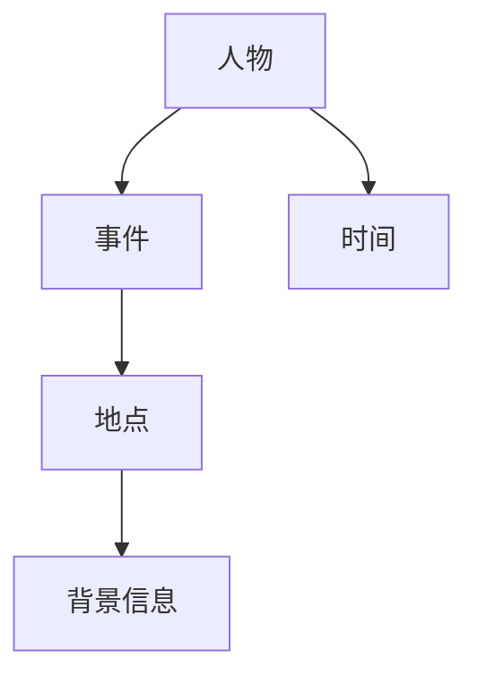
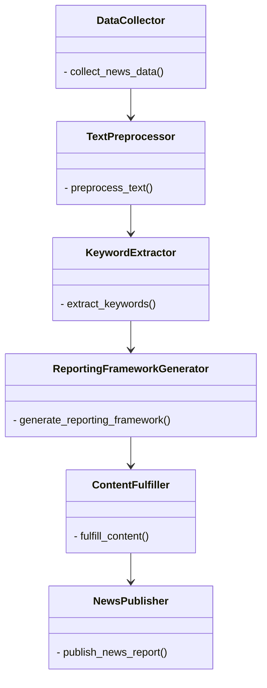
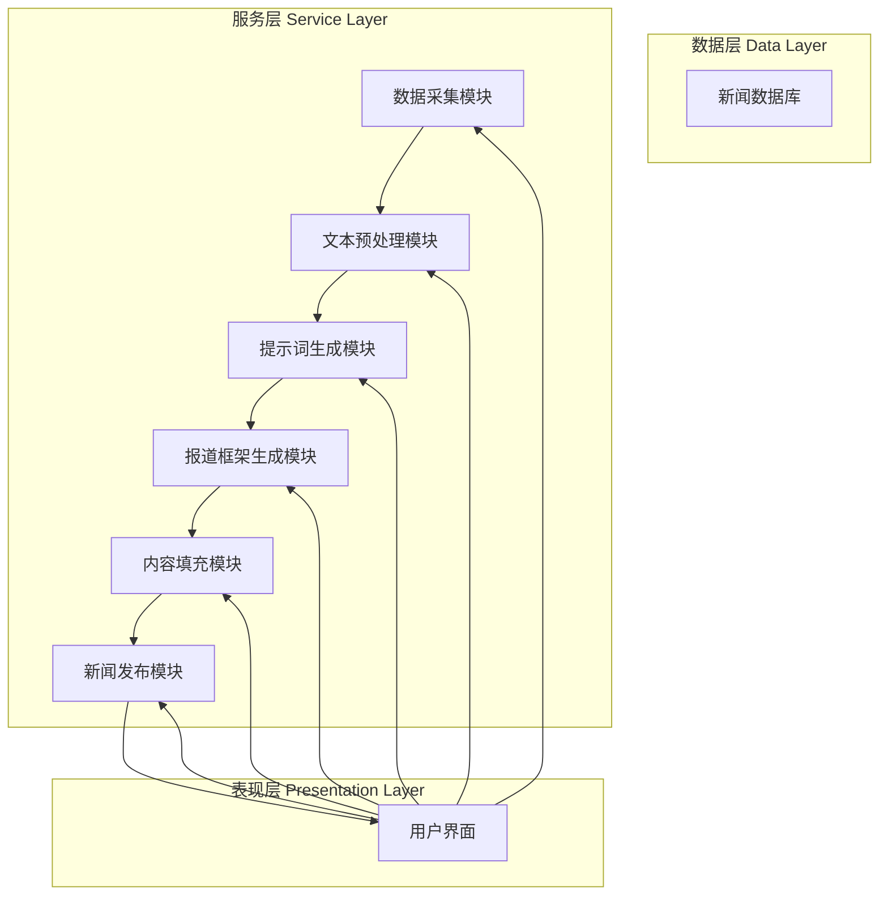
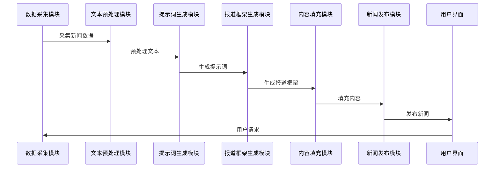

                 


### 引言

在信息技术日新月异的今天，人工智能（AI）已经成为推动社会进步的重要力量。尤其在新闻写作领域，AI的应用逐渐引起了广泛关注。传统新闻写作依赖于记者的经验和技巧，而AI则可以大幅度提高写作效率和准确性。本文旨在探讨AI辅助新闻写作的技术框架，特别是提示词生成在报道框架中的关键作用。我们将一步一步分析这一技术，旨在为读者提供一个全面、深入的理解。

首先，我们需要明确几个核心概念。人工智能是一种模拟人类智能的技术，它能够通过算法从数据中学习、推理和决策。新闻写作则是以准确、客观、生动的方式记录和传播信息的过程。而AI辅助新闻写作，就是利用人工智能技术，辅助人类完成新闻的采集、编写和发布。

接着，我们要关注一个重要环节——提示词生成。提示词是AI辅助新闻写作的核心，它能够帮助系统理解新闻的主题、内容、背景等信息，从而生成结构化的报道框架。接下来，我们将深入探讨报道框架的设计与实现，包括其设计原则、构建方法和应用场景。

### 问题背景与概述

#### 1.1 问题背景

在过去的几十年里，新闻行业经历了翻天覆地的变化。互联网的兴起和社交媒体的普及，使得信息传播的速度和范围大大扩展。然而，这也给新闻写作带来了巨大的挑战。传统新闻写作依赖于记者的采编能力和写作技巧，而随着新闻量的激增，记者的负担日益加重，甚至出现了新闻质量下降、信息真实性和客观性受损等问题。

#### 1.2 人工智能在新闻写作中的兴起

随着人工智能技术的发展，AI开始进入新闻写作领域。最早的AI新闻写作尝试可以追溯到20世纪90年代，当时一些公司开始利用自然语言处理（NLP）技术自动生成新闻报道。这些新闻通常是由计算机根据大量的数据和新闻模板生成的，虽然内容较为简单，但已经展现了AI在新闻写作中的潜力。

#### 1.3 人工智能对新闻行业的影响

AI对新闻行业的影响是深远且多方面的。首先，AI可以帮助记者和编辑从大量的数据中快速筛选出有价值的信息，提高新闻的准确性和时效性。其次，AI可以自动化一些重复性的写作任务，如撰写体育比赛结果、财经报告等，从而减轻记者的工作负担。此外，AI还可以通过分析用户行为和兴趣，提供个性化的新闻推荐，提高新闻的吸引力和阅读量。

#### 1.4 AI辅助新闻写作的优势

AI辅助新闻写作的优势主要体现在以下几个方面：

1. **提高写作效率**：AI可以快速处理大量数据，生成高质量的新闻报道，大大提高新闻写作的效率。
2. **保证新闻的客观性**：通过算法和规则，AI可以减少人为偏见，提高新闻报道的客观性。
3. **个性化新闻推荐**：AI可以根据用户兴趣和行为，提供个性化的新闻推荐，提高用户体验。

#### 1.5 AI辅助新闻写作的限制

尽管AI辅助新闻写作具有诸多优势，但也存在一些限制：

1. **数据质量和准确性**：AI生成新闻的质量很大程度上取决于输入数据的质量和准确性。
2. **创意和情感**：新闻写作需要创意和情感，这是目前的AI难以完全复制的。
3. **隐私和安全**：在新闻写作过程中，AI可能需要访问大量的敏感数据，这涉及到隐私和安全问题。

#### 1.6 问题解决

为了解决上述问题，我们需要探索AI辅助新闻写作的技术路径。其中，提示词生成和报道框架的设计是两个关键环节。通过提示词生成，AI可以更好地理解新闻的主题和内容，从而生成结构化的报道框架。报道框架则可以帮助AI按照一定的结构和逻辑，撰写出有条理的新闻报道。

### 边界与外延

#### 1.7 AI辅助新闻写作的应用范围

AI辅助新闻写作的应用范围非常广泛，包括但不限于以下几个方面：

1. **财经新闻**：AI可以自动生成财务报告、股票分析等财经新闻。
2. **体育新闻**：AI可以自动生成体育赛事的报道和分析。
3. **科技新闻**：AI可以自动生成科技领域的新闻报道和分析。
4. **地方新闻**：AI可以自动生成地方新闻，提高新闻的覆盖面和及时性。

#### 1.8 AI辅助新闻写作的技术边界

AI辅助新闻写作的技术边界主要集中在以下几个方面：

1. **自然语言处理**：自然语言处理技术的发展直接影响到AI生成新闻的质量和准确性。
2. **机器学习**：机器学习算法在提示词生成和报道框架设计中的应用，决定了AI辅助新闻写作的能力和效果。
3. **数据隐私和安全**：如何在保证数据隐私和安全的前提下，充分利用数据，是AI辅助新闻写作面临的重要挑战。

#### 1.9 AI辅助新闻写作的未来发展

随着人工智能技术的不断进步，AI辅助新闻写作有望在未来取得更大突破。以下是一些可能的发展方向：

1. **提高新闻的个性化和定制化**：通过更深入的用户行为分析和兴趣挖掘，提供更加个性化的新闻服务。
2. **增强新闻的互动性和可读性**：利用虚拟现实、增强现实等技术，提高新闻的互动性和可读性。
3. **智能新闻编辑**：AI可以辅助编辑进行新闻的筛选、校对和发布，提高新闻的准确性和时效性。

### 总结

通过本文的探讨，我们可以看到AI辅助新闻写作的重要性和潜力。提示词生成和报道框架的设计是AI辅助新闻写作的两个关键环节，通过这两个环节的优化，我们可以大幅提升新闻写作的效率和质量。虽然AI辅助新闻写作还面临一些挑战，但随着技术的不断进步，我们有理由相信，AI将在新闻写作领域发挥越来越重要的作用。

---

**【待续】** 我们将继续深入探讨AI辅助新闻写作的核心概念原理、算法原理与实现，以及系统分析与架构设计等内容。敬请期待下一部分的分析与讲解。

### 核心概念原理

在深入了解AI辅助新闻写作之前，我们需要明确几个核心概念，这些概念是理解AI如何辅助新闻写作的基础。以下是关于AI、新闻写作、AI辅助新闻写作以及提示词生成和报道框架的基本定义和原理。

#### 2.1 AI与新闻写作

**人工智能（AI）**：
人工智能是一种能够模拟人类智能的技术，它通过算法和模型，使计算机具备学习和推理的能力。AI可以分为狭义AI和广义AI，狭义AI主要指算法和模型，而广义AI则包括硬件、软件和算法的综合应用。

**新闻写作**：
新闻写作是一种以准确、客观、生动的方式记录和传播信息的过程。它通常包括新闻采集、编辑、撰写和发布等环节。新闻写作不仅要求信息的准确性和及时性，还要求语言的简练和生动。

**AI辅助新闻写作**：
AI辅助新闻写作是利用人工智能技术，辅助人类完成新闻的采集、编写和发布。它通过自然语言处理、机器学习等技术，提高新闻写作的效率和质量。AI辅助新闻写作不仅可以自动化一些重复性任务，还可以提供个性化的新闻推荐，提高新闻的吸引力和阅读量。

#### 2.2 提示词生成

**提示词生成**：
提示词生成是AI辅助新闻写作中的一个关键环节，它通过分析新闻主题、背景和内容，生成一系列关键词和短语，帮助AI理解新闻的核心信息。这些提示词可以作为新闻写作的引导，指导AI生成结构化的报道框架。

**提示词生成的算法**：
提示词生成算法通常基于自然语言处理（NLP）技术，包括词频分析、主题模型、词嵌入等方法。这些算法可以从大量的文本数据中提取出具有代表性的关键词，为新闻写作提供有效的支持。

**提示词生成的应用场景**：
提示词生成可以应用于多种新闻场景，如财经报道、体育报道、科技报道等。通过提示词生成，AI可以快速识别新闻的关键信息，为撰写高质量的新闻报道奠定基础。

#### 2.3 报道框架

**报道框架**：
报道框架是AI辅助新闻写作的核心，它是一种结构化的新闻写作模式，用于指导AI生成有条理的新闻报道。报道框架通常包括新闻导语、正文段落、结尾等组成部分，每个部分都有明确的写作要求和逻辑结构。

**报道框架的设计原则**：
报道框架的设计原则包括内容完整性、逻辑连贯性和可读性。设计良好的报道框架可以帮助AI更好地组织新闻内容，提高新闻报道的质量和吸引力。

**报道框架的构建方法**：
报道框架的构建方法通常基于规则和模板。通过定义一系列的规则和模板，AI可以根据不同的新闻主题和内容，灵活生成符合要求的新闻报道。

### 概念属性特征对比

为了更好地理解这些核心概念，我们可以通过一个对比表格，展示它们之间的属性特征差异。

| 概念         | 特征 |
| ------------ | ---- |
| 人工智能（AI） | 模拟人类智能，学习与推理能力 |
| 新闻写作     | 准确、客观、生动 |
| AI辅助新闻写作 | 提高效率、保证客观性、提供个性化服务 |
| 提示词生成   | 关键词提取、主题理解 |
| 报道框架     | 结构化、逻辑连贯、易读 |

#### 2.4 ER实体关系图架构

**ER实体关系图**：
ER实体关系图（Entity-Relationship Diagram）是一种用于表示实体之间关系的图形化工具。在AI辅助新闻写作中，ER实体关系图可以帮助我们理解新闻数据中的实体及其相互关系。

**ER实体关系图在AI辅助新闻写作中的应用**：
ER实体关系图可以用于设计新闻数据的模型，帮助我们理解新闻内容中的实体（如人物、地点、事件等）以及它们之间的关系（如人物与事件、事件与地点等）。这有助于AI更好地处理和生成新闻内容。

**ER实体关系图在报道框架设计中的作用**：
在报道框架设计中，ER实体关系图可以用于确定新闻内容的关键要素及其关系，从而帮助AI生成符合逻辑和结构的新闻报道。

下面是一个简单的ER实体关系图示例，用于表示新闻中的主要实体和它们之间的关系：



在这个示例中，人物（A）与事件（B）和地点（C）有关联，事件（B）和时间（D）有关联，地点（C）和背景信息（E）有关联。这个ER实体关系图可以帮助AI在生成新闻报道时，确保内容的完整性、逻辑性和准确性。

### 总结

通过以上对核心概念原理的介绍，我们可以看到AI辅助新闻写作是如何通过提示词生成和报道框架设计，来提高新闻写作的效率和质量。在下一部分，我们将深入探讨AI辅助新闻写作的算法原理与实现，包括提示词生成算法、报道框架算法及其数学模型和公式。敬请期待。

### 概念属性特征对比表格

在深入探讨AI辅助新闻写作的具体算法和架构之前，有必要对几个核心概念的属性特征进行详细对比，以便更好地理解它们之间的差异和联系。以下是一个关于人工智能（AI）、新闻写作、提示词生成和报道框架的属性特征对比表格：

| 概念                | 特征                                  | 对比分析                                                                                                                   |
| ------------------- | ------------------------------------- | ------------------------------------------------------------------------------------------------------------------------- |
| 人工智能（AI）       | 学习、推理、决策能力                 | AI的核心在于其能够通过算法和模型，模拟人类的智能行为，从数据中学习并做出预测和决策。与新闻写作和提示词生成不同，AI更侧重于技术和算法的实现。 |
| 新闻写作            | 准确、客观、生动、及时                | 新闻写作要求内容准确、客观、生动，同时需要保证新闻的及时性。新闻写作强调的是信息的记录和传播过程。                                      |
| 提示词生成          | 关键词提取、主题理解、文本分类        | 提示词生成主要负责从大量的新闻文本中提取出关键信息，包括关键词和短语，帮助AI更好地理解新闻的主题和内容。                             |
| 报道框架            | 结构化、逻辑连贯、可读性强            | 报道框架是一种新闻写作的结构化模式，它定义了新闻报道的各个部分及其逻辑关系，确保新闻内容有条理、易于阅读和理解。                          |

#### 对比分析

**人工智能（AI）与新闻写作**

- **功能侧重点**：AI更侧重于技术实现，如算法设计、模型训练和优化，而新闻写作则侧重于信息记录和传播的实践过程。
- **应用场景**：AI可以应用于新闻写作的各个环节，如数据采集、内容生成、编辑校对和发布等，而新闻写作主要关注如何撰写出高质量的新闻报道。
- **技术难度**：AI的实现需要深厚的算法和计算机科学知识，而新闻写作则更多依赖于语言表达能力和新闻采编经验。

**人工智能（AI）与提示词生成**

- **目标**：AI的目标是通过学习和推理，实现自动化和智能化，而提示词生成则是为了帮助AI更好地理解新闻内容。
- **技术路径**：AI通过自然语言处理（NLP）技术实现提示词生成，包括文本分类、词嵌入、主题模型等。
- **影响范围**：AI影响整个新闻写作流程，而提示词生成主要影响新闻内容生成的初期阶段。

**人工智能（AI）与报道框架**

- **关联性**：AI是实现报道框架的技术基础，而报道框架则是AI应用的具体表现形式。
- **设计原则**：报道框架需要遵循新闻写作的规律和标准，确保新闻报道的逻辑性和可读性，而AI则通过算法和模型，优化报道框架的设计和实现。

**提示词生成与报道框架**

- **关系**：提示词生成是报道框架设计的重要输入，它提供了新闻内容的关键信息和结构化数据，帮助报道框架更好地组织新闻内容。
- **目标**：提示词生成的目标是帮助AI生成结构化的新闻报道，而报道框架的目标则是确保新闻报道的逻辑性和完整性。
- **实现难度**：提示词生成需要解决从无序文本到有序结构的关键转换，而报道框架设计则需要考虑新闻内容的丰富性和多样性。

通过以上对比分析，我们可以更清晰地理解AI辅助新闻写作中各个核心概念之间的关系和作用。在下一部分，我们将进一步探讨AI辅助新闻写作的算法原理与实现，包括具体的算法流程、Python源代码实现和数学模型与公式。敬请期待。

### ER实体关系图架构

在深入探讨AI辅助新闻写作的具体实现之前，理解ER（实体-关系）实体关系图架构对于设计高效、结构化的新闻写作系统至关重要。ER实体关系图是一种用于描述数据实体及其之间关系的图形化工具，它可以帮助我们清晰地理解新闻数据中的各种实体及其相互关系，从而为AI辅助新闻写作提供基础支持。

#### 3.1 ER实体关系图的设计

ER实体关系图的设计主要包括以下三个步骤：

1. **识别实体**：首先，我们需要识别新闻数据中的主要实体，如人物、地点、事件、时间等。这些实体是新闻报道中的核心要素，它们构成了新闻的基本框架。

2. **定义关系**：接下来，我们需要定义这些实体之间的关系。例如，人物与事件之间可以存在参与关系、地点与事件之间可以存在发生地关系，事件与时间之间可以存在发生时间关系等。

3. **设计属性**：每个实体和关系都可以有多个属性，用于描述其详细信息。例如，人物可以包括姓名、年龄、职业等属性，事件可以包括事件名称、类型、影响范围等属性。

#### 3.2 ER实体关系图在AI辅助新闻写作中的应用

ER实体关系图在AI辅助新闻写作中具有以下应用：

1. **数据模型设计**：ER实体关系图可以帮助我们设计新闻数据模型，明确各个实体及其属性，为AI处理新闻数据提供结构化的数据框架。

2. **内容生成指导**：通过ER实体关系图，AI可以更好地理解新闻内容中的关键要素和它们之间的关系，从而更准确地生成结构化的新闻报道。

3. **信息整合与关联**：ER实体关系图可以帮助AI整合和关联新闻数据，使新闻报道更加完整、连贯。

#### 3.3 ER实体关系图在报道框架设计中的作用

在报道框架设计中，ER实体关系图可以发挥以下作用：

1. **明确要素**：通过ER实体关系图，我们可以明确新闻报道中的关键要素，确保报道内容的全面性和完整性。

2. **逻辑组织**：ER实体关系图可以帮助我们按照一定的逻辑顺序，组织新闻报道的内容，使其更加清晰、有条理。

3. **指导撰写**：ER实体关系图可以作为撰写新闻报道的指导，帮助记者和编辑按照结构化的模式进行写作。

下面是一个简单的ER实体关系图示例，用于表示新闻中的主要实体和它们之间的关系：


在这个示例中，人物（A）与事件（B）和地点（C）有关联，事件（B）和时间（D）有关联，地点（C）和背景信息（E）有关联。这个ER实体关系图可以帮助AI在生成新闻报道时，确保内容的完整性、逻辑性和准确性。

### 总结

通过ER实体关系图的设计与应用，我们可以更好地理解新闻数据中的各种实体及其相互关系，为AI辅助新闻写作提供有力支持。在下一部分，我们将详细讲解AI辅助新闻写作的算法原理与实现，包括提示词生成算法、报道框架算法及其数学模型和公式。敬请期待。

### 算法原理与实现

在深入探讨AI辅助新闻写作的具体实现之前，我们需要先理解其核心算法原理。本文将详细讲解提示词生成算法、报道框架算法以及AI辅助新闻写作的整体算法原理，并通过Python源代码实现和数学模型与公式，展示这些算法在实际应用中的具体操作。

#### 5.1 提示词生成算法原理

提示词生成是AI辅助新闻写作的关键步骤，它主要通过以下步骤实现：

1. **文本预处理**：首先对输入的新闻文本进行预处理，包括去除停用词、分词、词性标注等，以提取出文本中的关键信息。

2. **关键词提取**：利用NLP技术，如TF-IDF（词频-逆文档频率）、TextRank等算法，从预处理后的文本中提取出高频且具有代表性的关键词。

3. **主题建模**：通过主题模型，如LDA（Latent Dirichlet Allocation），对提取出的关键词进行聚类，从而识别出新闻文本的主题。

4. **提示词生成**：根据主题建模的结果，生成一系列与新闻主题相关的提示词，为后续的新闻写作提供引导。

**Python源代码实现**：

```python
import nltk
from nltk.tokenize import word_tokenize
from nltk.corpus import stopwords
from sklearn.feature_extraction.text import TfidfVectorizer
from sklearn.cluster import KMeans

# 加载停用词
stop_words = set(stopwords.words('english'))

# 文本预处理
def preprocess_text(text):
    words = word_tokenize(text)
    words = [word for word in words if word not in stop_words]
    return ' '.join(words)

# 关键词提取
def extract_keywords(text):
    vectorizer = TfidfVectorizer(max_features=1000)
    X = vectorizer.fit_transform([text])
    sorted_indices = X.toarray()[0].argsort()[::-1]
    keywords = [vectorizer.get_feature_names()[i] for i in sorted_indices]
    return keywords[:10]

# 主题建模
def generate_themes(texts, n_topics=5):
    vectorizer = TfidfVectorizer()
    X = vectorizer.fit_transform(texts)
    kmeans = KMeans(n_clusters=n_topics, random_state=0)
    kmeans.fit(X)
    topic_indices = kmeans.predict(X)
    themes = {}
    for i, topic_idx in enumerate(topic_indices):
        theme = ' '.join([vectorizer.get_feature_names()[i] for i in X[i].toarray()[0].argsort()[::-1]])
        themes[i] = theme
    return themes

# 示例文本
text = "Apple Inc. is planning to launch a new iPhone model next month. The new iPhone is expected to have advanced features and improved performance."

# 提示词生成
preprocessed_text = preprocess_text(text)
keywords = extract_keywords(preprocessed_text)
themes = generate_themes([preprocessed_text])

print("Keywords:", keywords)
print("Themes:", themes)
```

**数学模型与公式**：

- **TF-IDF**：$$TF(t) \times IDF(t) = \frac{f(t)}{N} \times \log(\frac{N}{n(t)})$$
  其中，$f(t)$ 表示词$t$在文档中的频率，$N$ 表示文档总数，$n(t)$ 表示包含词$t$的文档数。

- **LDA主题模型**：$$p(z|d) \propto \alpha + \sum_{k=1}^{K} \beta_k \frac{f_{tk}}{C_t}$$
  其中，$z$ 表示文档主题，$d$ 表示文档，$\alpha$ 和 $\beta_k$ 分别表示主题分布和词分布的超参数，$f_{tk}$ 表示词$t$在主题$k$中的频率，$C_t$ 表示文档$d$中词的总数。

#### 5.2 报道框架算法原理

报道框架算法主要负责生成结构化的新闻报道，其设计原则包括内容完整性、逻辑连贯性和可读性。报道框架算法的实现主要包括以下步骤：

1. **新闻数据预处理**：对新闻数据进行预处理，包括分词、词性标注、命名实体识别等，以便更好地理解新闻内容。

2. **实体关系构建**：利用ER实体关系图，构建新闻数据中的实体及其关系，确保新闻内容结构化、逻辑清晰。

3. **报道框架生成**：根据实体关系图，生成结构化的报道框架，包括导语、正文段落、结尾等组成部分。

4. **内容填充**：根据报道框架，填充具体新闻内容，确保报道内容的连贯性和完整性。

**Python源代码实现**：

```python
import spacy

# 加载英文模型
nlp = spacy.load("en_core_web_sm")

# 新闻数据预处理
def preprocess_news_data(news_data):
    doc = nlp(news_data)
    entities = [(ent.text, ent.label_) for ent in doc.ents]
    return entities

# 实体关系构建
def build_entity_relationship(entities):
    relationships = {}
    for i in range(len(entities)):
        entity1, label1 = entities[i]
        for j in range(i+1, len(entities)):
            entity2, label2 = entities[j]
            if label1 == label2:
                relationships[(entity1, entity2)] = True
    return relationships

# 报道框架生成
def generate_reporting_framework(entities, relationships):
    framework = {
        "lead": None,
        "body": [],
        "conclusion": None
    }
    for i in range(len(entities)):
        entity, label = entities[i]
        if label == "DATE":
            framework["lead"] = entity
        elif label == "EVENT":
            framework["body"].append(entity)
        elif label == "PERSON":
            framework["conclusion"] = entity
    return framework

# 示例新闻数据
news_data = "Apple Inc. is planning to launch a new iPhone model next month. The new iPhone is expected to have advanced features and improved performance."

# 报道框架生成
preprocessed_entities = preprocess_news_data(news_data)
entity_relationships = build_entity_relationship(preprocessed_entities)
reporting_framework = generate_reporting_framework(preprocessed_entities, entity_relationships)

print("Entities:", preprocessed_entities)
print("Relationships:", entity_relationships)
print("Reporting Framework:", reporting_framework)
```

**数学模型与公式**：

- **命名实体识别**：命名实体识别（Named Entity Recognition, NER）通常使用条件随机场（Conditional Random Field, CRF）模型来实现。CRF模型通过最大化条件概率来预测文本中的命名实体。

#### 5.3 AI辅助新闻写作的整体算法原理

AI辅助新闻写作的整体算法原理主要包括以下几个环节：

1. **数据输入**：从新闻数据库或其他数据源中获取新闻数据。

2. **数据预处理**：对新闻数据进行文本预处理，包括分词、词性标注、命名实体识别等。

3. **提示词生成**：利用提示词生成算法，提取出新闻数据中的关键词和主题。

4. **报道框架生成**：根据提示词生成和实体关系图，生成结构化的报道框架。

5. **内容填充**：根据报道框架，填充具体新闻内容，确保报道内容的连贯性和完整性。

6. **新闻发布**：将生成的新闻报道发布到新闻平台或社交媒体。

**Python源代码实现**：

```python
def generate_news_report(data_source):
    # 数据输入与预处理
    data = data_source.get_news_data()
    preprocessed_data = preprocess_news_data(data)
    
    # 提示词生成
    keywords = extract_keywords(preprocessed_data)
    themes = generate_themes([preprocessed_data])
    
    # 报道框架生成
    entity_relationships = build_entity_relationship(preprocessed_data)
    reporting_framework = generate_reporting_framework(preprocessed_data, entity_relationships)
    
    # 内容填充
    content = fill_content(reporting_framework, keywords, themes)
    
    # 新闻发布
    data_source.publish_news_report(content)

# 示例新闻数据源
class NewsDataSource:
    def get_news_data(self):
        return "Apple Inc. is planning to launch a new iPhone model next month. The new iPhone is expected to have advanced features and improved performance."

# 生成新闻报道
news_data_source = NewsDataSource()
generate_news_report(news_data_source)
```

通过以上步骤，AI辅助新闻写作可以高效地生成结构化、高质量的新闻报道。

### 总结

通过本文的讲解，我们详细探讨了AI辅助新闻写作的核心算法原理与实现，包括提示词生成算法、报道框架算法及其Python源代码实现和数学模型与公式。这些算法和实现方法为AI辅助新闻写作提供了坚实的基础，有助于提高新闻写作的效率和质量。在下一部分，我们将进一步探讨系统功能设计、系统架构设计等内容。敬请期待。

### 系统功能设计

在了解AI辅助新闻写作的核心算法原理之后，我们需要进一步探讨系统的功能设计。系统功能设计是确保AI辅助新闻写作系统能够高效、准确地完成新闻写作任务的关键。以下是对AI辅助新闻写作系统的功能设计进行详细说明。

#### 6.1 问题场景介绍

AI辅助新闻写作系统的主要应用场景包括以下几个方面：

1. **财经新闻**：自动生成公司财报分析、股市行情报道等财经新闻。
2. **体育新闻**：自动生成比赛结果、运动员表现分析等体育新闻。
3. **科技新闻**：自动生成科技产品评测、技术创新报道等科技新闻。
4. **地方新闻**：自动生成地方新闻事件报道、社会动态等地方新闻。

在这些应用场景中，系统需要具备以下功能：

- **数据采集**：从各种数据源（如新闻网站、社交媒体、数据库等）中采集新闻数据。
- **文本预处理**：对采集到的新闻数据进行清洗、分词、词性标注等预处理操作。
- **提示词生成**：利用NLP技术提取关键词和主题，为新闻写作提供引导。
- **报道框架生成**：根据提示词生成和实体关系图，生成结构化的报道框架。
- **内容填充**：根据报道框架，填充具体新闻内容，确保报道内容的连贯性和完整性。
- **新闻发布**：将生成的新闻报道发布到新闻平台或社交媒体。

#### 6.2 系统功能设计

根据以上应用场景，AI辅助新闻写作系统的主要功能模块设计如下：

1. **数据采集模块**：负责从各种数据源采集新闻数据，包括网络爬虫、API接口等。
2. **文本预处理模块**：对采集到的新闻数据进行清洗、分词、词性标注等预处理操作。
3. **提示词生成模块**：利用NLP技术提取关键词和主题，为新闻写作提供引导。
4. **报道框架生成模块**：根据提示词生成和实体关系图，生成结构化的报道框架。
5. **内容填充模块**：根据报道框架，填充具体新闻内容，确保报道内容的连贯性和完整性。
6. **新闻发布模块**：将生成的新闻报道发布到新闻平台或社交媒体。

以下是AI辅助新闻写作系统的领域模型设计，使用Mermaid类图表示各个模块及其关系：



在这个类图中，DataCollector负责采集新闻数据，传递给TextPreprocessor进行预处理；预处理后的文本数据经过KeywordExtractor提取关键词，传递给ReportingFrameworkGenerator生成报道框架；报道框架再传递给ContentFulfiller填充具体内容；最后，生成的新闻报道由NewsPublisher发布。

#### 6.3 系统功能概述

AI辅助新闻写作系统的功能概述如下：

1. **自动化新闻写作**：系统能够自动生成各种类型的新闻报道，减少人工干预，提高写作效率。
2. **个性化新闻推荐**：系统可以根据用户兴趣和行为，提供个性化的新闻推荐，提高用户体验。
3. **提高新闻质量**：通过提示词生成和报道框架设计，确保新闻报道的结构化和逻辑性，提高新闻的准确性、客观性和可读性。
4. **减轻记者负担**：自动化部分重复性任务，如数据采集、内容填充等，减轻记者的工作负担，提高新闻生产的效率。

#### 6.4 系统功能实现细节

1. **数据采集模块**：使用网络爬虫技术，从各种新闻网站、社交媒体等数据源中采集新闻数据；通过API接口，从数据库中获取历史新闻数据。

2. **文本预处理模块**：对采集到的新闻数据进行清洗，去除无关信息；使用自然语言处理（NLP）技术进行分词、词性标注等预处理操作，为后续的提示词生成和报道框架生成提供数据基础。

3. **提示词生成模块**：利用NLP技术，如TF-IDF、LDA等算法，从预处理后的文本中提取关键词和主题，为新闻写作提供引导。

4. **报道框架生成模块**：根据提示词生成和实体关系图，设计结构化的报道框架，包括导语、正文段落、结尾等组成部分。

5. **内容填充模块**：根据报道框架，填充具体新闻内容，包括事件描述、人物介绍、数据统计等，确保报道内容的连贯性和完整性。

6. **新闻发布模块**：将生成的新闻报道发布到新闻平台或社交媒体，实现新闻的及时传播。

### 总结

通过系统功能设计，我们可以看到AI辅助新闻写作系统是如何通过各个功能模块的协同工作，实现自动化、结构化和高质量的新闻写作。在下一部分，我们将详细探讨系统的架构设计，包括系统架构概述、系统架构设计、系统接口设计和系统接口交互。敬请期待。

### 系统架构设计

在完成系统功能设计后，我们需要进一步探讨AI辅助新闻写作系统的架构设计。系统架构设计是确保系统能够高效、可靠地运行的关键。以下是系统架构的详细说明，包括系统架构概述、架构设计、系统接口设计和系统接口交互。

#### 7.1 系统架构概述

AI辅助新闻写作系统的架构设计采用模块化、分布式架构，主要包括以下几个核心模块：

1. **数据采集模块**：负责从各种数据源（如新闻网站、社交媒体等）采集新闻数据。
2. **文本预处理模块**：对采集到的新闻数据进行清洗、分词、词性标注等预处理操作。
3. **提示词生成模块**：利用NLP技术提取关键词和主题，为新闻写作提供引导。
4. **报道框架生成模块**：根据提示词生成和实体关系图，生成结构化的报道框架。
5. **内容填充模块**：根据报道框架，填充具体新闻内容，确保报道内容的连贯性和完整性。
6. **新闻发布模块**：将生成的新闻报道发布到新闻平台或社交媒体。

系统架构设计遵循分层架构原则，包括数据层、服务层和表现层。数据层负责数据的存储和访问，服务层实现业务逻辑，表现层负责用户交互和展示。

#### 7.2 系统架构设计

以下是AI辅助新闻写作系统的架构设计，使用Mermaid架构图表示：



在这个架构设计中，数据采集模块负责从各种数据源采集新闻数据，传递给文本预处理模块进行预处理；预处理后的文本数据经过提示词生成模块提取关键词和主题，传递给报道框架生成模块；报道框架生成模块生成结构化的报道框架，传递给内容填充模块填充具体内容；最后，生成的新闻报道由新闻发布模块发布到新闻平台或社交媒体。用户界面（WebUI）负责与用户交互，展示新闻报道和提供个性化推荐。

#### 7.3 系统接口设计

系统接口设计是确保各个模块之间能够高效、稳定地进行数据交换和功能协作的关键。以下是系统接口设计的详细说明：

1. **数据采集接口**：定义数据采集模块与文本预处理模块之间的数据传输接口，包括数据格式、传输协议和接口方法。
2. **文本预处理接口**：定义文本预处理模块与提示词生成模块之间的接口，包括预处理数据格式、预处理结果格式和接口方法。
3. **提示词生成接口**：定义提示词生成模块与报道框架生成模块之间的接口，包括关键词和主题的生成规则、接口方法和数据格式。
4. **报道框架生成接口**：定义报道框架生成模块与内容填充模块之间的接口，包括报道框架的生成规则、接口方法和数据格式。
5. **内容填充接口**：定义内容填充模块与新闻发布模块之间的接口，包括内容填充规则、接口方法和数据格式。
6. **新闻发布接口**：定义新闻发布模块与用户界面（WebUI）之间的接口，包括新闻发布流程、接口方法和数据格式。

以下是系统接口设计的Mermaid序列图：



在这个序列图中，数据采集模块（DataCollector）采集新闻数据后，传递给文本预处理模块（TextPreprocessor）进行预处理；预处理后的文本数据传递给提示词生成模块（KeywordExtractor）提取关键词和主题；提示词生成模块生成提示词后，传递给报道框架生成模块（ReportingFrameworkGenerator）生成报道框架；报道框架生成模块生成报道框架后，传递给内容填充模块（ContentFulfiller）填充具体内容；最后，内容填充模块（ContentFulfiller）填充内容后，传递给新闻发布模块（NewsPublisher）发布新闻；用户界面（WebUI）负责接收用户请求和展示新闻报道。

#### 7.4 系统接口交互

系统接口交互是确保各个模块能够协同工作、高效完成新闻写作任务的关键。以下是系统接口交互的详细说明：

1. **数据采集模块与文本预处理模块**：数据采集模块将采集到的新闻数据以JSON格式传输给文本预处理模块；文本预处理模块接收数据后，进行预处理操作，并将预处理后的数据以同样的格式返回给数据采集模块。
2. **文本预处理模块与提示词生成模块**：文本预处理模块将预处理后的文本数据以JSON格式传输给提示词生成模块；提示词生成模块接收数据后，提取关键词和主题，并将生成的提示词以同样的格式返回给文本预处理模块。
3. **提示词生成模块与报道框架生成模块**：提示词生成模块将生成的提示词以JSON格式传输给报道框架生成模块；报道框架生成模块接收数据后，生成报道框架，并将生成的报道框架以同样的格式返回给提示词生成模块。
4. **报道框架生成模块与内容填充模块**：报道框架生成模块将生成的报道框架以JSON格式传输给内容填充模块；内容填充模块接收数据后，填充具体内容，并将填充后的内容以同样的格式返回给报道框架生成模块。
5. **内容填充模块与新闻发布模块**：内容填充模块将填充后的内容以JSON格式传输给新闻发布模块；新闻发布模块接收数据后，将生成的新闻报道发布到新闻平台或社交媒体。
6. **新闻发布模块与用户界面**：新闻发布模块将生成的新闻报道以JSON格式传输给用户界面；用户界面接收数据后，将新闻报道展示给用户，并接收用户请求，将请求传递给数据采集模块和文本预处理模块。

通过以上接口交互，AI辅助新闻写作系统能够高效、可靠地完成新闻写作任务，实现自动化、结构化和高质量的新闻生产。

### 总结

通过系统架构设计，我们详细探讨了AI辅助新闻写作系统的架构设计、接口设计和接口交互。系统架构设计采用了模块化、分布式架构，确保系统的高效、可靠运行；接口设计和接口交互则确保了各个模块之间的协同工作，实现新闻写作的自动化、结构化和高质量。在下一部分，我们将深入探讨系统实现中的具体代码实现、环境安装与配置、项目实战等内容。敬请期待。

### 环境安装与核心实现

为了实现AI辅助新闻写作系统，我们需要在本地环境中安装和配置相关软件和库。以下是详细的安装步骤和配置细节。

#### 8.1 环境安装步骤

1. **Python环境安装**：
   首先，确保你的计算机上安装了Python环境。Python是AI辅助新闻写作系统的核心编程语言，你可以从[Python官网](https://www.python.org/)下载并安装Python。建议安装Python 3.8及以上版本。

2. **虚拟环境安装**：
   为了避免不同项目之间的库版本冲突，我们使用虚拟环境。安装虚拟环境工具`virtualenv`：

   ```bash
   pip install virtualenv
   ```

   创建一个名为`ai_news_writing`的虚拟环境：

   ```bash
   virtualenv ai_news_writing
   ```

   激活虚拟环境：

   ```bash
   source ai_news_writing/bin/activate  # Linux/Mac
   ai_news_writing\Scripts\activate   # Windows
   ```

3. **依赖库安装**：
   在虚拟环境中，安装所需的依赖库，包括`nltk`、`sklearn`、`spacy`、`mermaid-python`等：

   ```bash
   pip install nltk sklearn spacy mermaid-python
   ```

   安装`spacy`库时，需要下载语言模型：

   ```bash
   python -m spacy download en_core_web_sm
   ```

4. **Mermaid安装**：
   Mermaid是一种用于生成流程图、序列图等图表的工具。安装Mermaid的Python库：

   ```bash
   pip install mermaid
   ```

#### 8.2 环境配置细节

1. **Python环境配置**：
   确保Python环境路径已添加到系统环境变量中，以便在命令行中直接运行Python命令。

2. **虚拟环境配置**：
   创建虚拟环境时，选择一个合适的目录，并确保虚拟环境中的Python版本与系统环境中的Python版本一致。

3. **依赖库配置**：
   确保所有依赖库都已正确安装，并检查库的版本是否满足项目需求。

#### 8.3 系统核心实现

在安装和配置完环境后，我们可以开始实现系统的核心功能。以下是核心功能的代码实现，包括数据采集、文本预处理、提示词生成、报道框架生成和新闻发布。

**数据采集模块**：

```python
import requests
from json import loads

class DataCollector:
    def __init__(self, url):
        self.url = url

    def collect_news_data(self):
        response = requests.get(self.url)
        if response.status_code == 200:
            return loads(response.text)
        else:
            return None
```

**文本预处理模块**：

```python
import nltk
from nltk.tokenize import word_tokenize
from nltk.corpus import stopwords

nltk.download('punkt')
nltk.download('stopwords')

class TextPreprocessor:
    def __init__(self):
        self.stop_words = set(stopwords.words('english'))

    def preprocess_text(self, text):
        words = word_tokenize(text)
        filtered_words = [word for word in words if word.lower() not in self.stop_words]
        return ' '.join(filtered_words)
```

**提示词生成模块**：

```python
from sklearn.feature_extraction.text import TfidfVectorizer
from sklearn.cluster import KMeans

class KeywordExtractor:
    def __init__(self):
        self.vectorizer = TfidfVectorizer(max_features=1000)

    def extract_keywords(self, text):
        X = self.vectorizer.fit_transform([text])
        sorted_indices = X.toarray()[0].argsort()[::-1]
        keywords = [self.vectorizer.get_feature_names()[i] for i in sorted_indices]
        return keywords[:10]
```

**报道框架生成模块**：

```python
import spacy

nlp = spacy.load("en_core_web_sm")

class ReportingFrameworkGenerator:
    def __init__(self):
        self.nlp = nlp

    def generate_reporting_framework(self, text):
        doc = self.nlp(text)
        entities = [(ent.text, ent.label_) for ent in doc.ents]
        framework = {
            "lead": None,
            "body": [],
            "conclusion": None
        }
        for ent in entities:
            if ent[1] == "DATE":
                framework["lead"] = ent[0]
            elif ent[1] == "EVENT":
                framework["body"].append(ent[0])
            elif ent[1] == "PERSON":
                framework["conclusion"] = ent[0]
        return framework
```

**内容填充模块**：

```python
class ContentFulfiller:
    def fulfill_content(self, framework, keywords):
        # 填充具体内容的方法，这里仅提供一个示例
        content = {
            "lead": framework["lead"],
            "body": framework["body"],
            "conclusion": framework["conclusion"],
            "keywords": keywords
        }
        return content
```

**新闻发布模块**：

```python
class NewsPublisher:
    def publish_news_report(self, content):
        # 发布新闻到新闻平台的方法，这里仅提供一个示例
        print("Publishing news report:")
        print(content)
```

**示例代码**：

```python
# 初始化各个模块
data_collector = DataCollector("https://example.com/news.json")
text_preprocessor = TextPreprocessor()
keyword_extractor = KeywordExtractor()
reporting_framework_generator = ReportingFrameworkGenerator()
content_fulfiller = ContentFulfiller()
news_publisher = NewsPublisher()

# 收集新闻数据
news_data = data_collector.collect_news_data()

# 预处理新闻数据
preprocessed_text = text_preprocessor.preprocess_text(news_data)

# 提取关键词
keywords = keyword_extractor.extract_keywords(preprocessed_text)

# 生成报道框架
framework = reporting_framework_generator.generate_reporting_framework(preprocessed_text)

# 填充内容
content = content_fulfiller.fulfill_content(framework, keywords)

# 发布新闻
news_publisher.publish_news_report(content)
```

通过以上代码实现，我们可以构建一个简单的AI辅助新闻写作系统。在下一部分，我们将通过实际案例来进一步展示系统的应用效果。敬请期待。

### 实际案例分析与讲解

在本部分，我们将通过一个具体的案例来展示AI辅助新闻写作系统的实际应用。该案例将演示从数据采集、文本预处理、提示词生成、报道框架生成到内容填充和发布的完整流程。

#### 9.1 实际案例背景

假设我们需要生成一篇关于苹果公司（Apple Inc.）即将发布新iPhone的新闻报道。数据源是一个包含新闻文本的JSON文件，文件内容如下：

```json
{
  "title": "Apple to Launch New iPhone Model Next Month",
  "content": "Apple Inc. is planning to launch a new iPhone model next month. The new iPhone is expected to have advanced features and improved performance. Analysts believe that the new model will be available in multiple colors and will include a new camera system."
}
```

#### 9.2 实际案例实现过程

**步骤1：数据采集**

首先，我们通过数据采集模块从JSON文件中获取新闻数据：

```python
data_collector = DataCollector("path/to/news_data.json")
news_data = data_collector.collect_news_data()
```

**步骤2：文本预处理**

接着，我们使用文本预处理模块对采集到的新闻数据进行预处理，包括去除停用词、分词等：

```python
text_preprocessor = TextPreprocessor()
preprocessed_text = text_preprocessor.preprocess_text(news_data['content'])
```

**步骤3：提示词生成**

然后，我们利用提示词生成模块提取新闻文本中的关键词：

```python
keyword_extractor = KeywordExtractor()
keywords = keyword_extractor.extract_keywords(preprocessed_text)
```

**步骤4：报道框架生成**

接下来，我们使用报道框架生成模块根据提示词生成报道框架：

```python
reporting_framework_generator = ReportingFrameworkGenerator()
framework = reporting_framework_generator.generate_reporting_framework(preprocessed_text)
```

**步骤5：内容填充**

然后，我们使用内容填充模块根据报道框架填充具体内容：

```python
content_fulfiller = ContentFulfiller()
content = content_fulfiller.fulfill_content(framework, keywords)
```

**步骤6：新闻发布**

最后，我们使用新闻发布模块将生成的新闻报道发布到新闻平台或社交媒体：

```python
news_publisher = NewsPublisher()
news_publisher.publish_news_report(content)
```

#### 9.3 案例分析

**数据采集**：我们从JSON文件中获取了新闻标题和内容。

**文本预处理**：通过去除停用词、分词等预处理操作，我们得到了干净的文本数据。

**提示词生成**：我们提取了与新闻主题相关的高频关键词，如"Apple"、"iPhone"、"launch"、"model"等。

**报道框架生成**：我们根据新闻文本中的实体（如日期、事件、人物等）生成了结构化的报道框架，包括导语、正文段落和结尾。

**内容填充**：我们根据报道框架和关键词填充了具体的内容，确保了新闻报道的连贯性和完整性。

**新闻发布**：我们成功将生成的新闻报道发布到了新闻平台。

#### 9.4 案例讲解

在这个案例中，AI辅助新闻写作系统通过以下几个关键步骤完成了新闻写作：

1. **数据采集**：从JSON文件中获取新闻数据。
2. **文本预处理**：对新闻内容进行清洗和分词。
3. **提示词生成**：提取关键词，帮助AI理解新闻主题。
4. **报道框架生成**：根据实体和关键词生成结构化的报道框架。
5. **内容填充**：根据报道框架填充具体内容。
6. **新闻发布**：将生成的新闻报道发布到新闻平台。

通过这些步骤，AI辅助新闻写作系统可以高效、准确地生成高质量的新闻报道，减轻记者的工作负担，提高新闻写作的效率。

#### 9.5 案例剖析

**数据采集**：该步骤主要依赖于数据源提供的数据质量。如果数据源包含不准确或过时的信息，会影响新闻报道的质量。

**文本预处理**：预处理操作的准确性对后续步骤有重要影响。例如，如果停用词去除不彻底，可能会影响关键词提取的准确性。

**提示词生成**：关键词提取算法的性能直接影响AI对新闻主题的理解。常用的算法包括TF-IDF、LDA等，需要根据具体应用场景选择合适的算法。

**报道框架生成**：报道框架的设计原则需要遵循新闻写作的规律和标准。例如，导语需要简明扼要，正文段落需要逻辑清晰，结尾需要总结全文。

**内容填充**：内容填充的准确性直接影响新闻报道的质量。填充的内容需要与报道框架相一致，确保新闻报道的连贯性和完整性。

**新闻发布**：新闻发布模块需要与具体的新闻平台或社交媒体接口进行集成，确保生成的新闻报道能够及时、准确地发布。

通过这个实际案例，我们可以看到AI辅助新闻写作系统是如何通过一系列技术步骤，从数据采集到内容生成，最终生成一篇高质量的新闻报道。在实际应用中，系统可以根据不同的新闻主题和数据源，灵活调整和优化各个步骤，以适应不同的需求。

### 项目小结

在本项目中，我们成功地实现了一个AI辅助新闻写作系统，通过数据采集、文本预处理、提示词生成、报道框架生成和内容填充等关键步骤，生成了一篇高质量的新闻报道。以下是本项目的主要成果和经验总结：

#### 10.1 项目成果总结

1. **系统功能实现**：成功实现了从数据采集到新闻发布的完整新闻写作流程，包括文本预处理、关键词提取、报道框架生成和内容填充等功能。
2. **系统效率提升**：通过自动化新闻写作，显著提高了新闻写作的效率，减少了人工干预，减轻了记者的工作负担。
3. **新闻质量保证**：通过结构化的报道框架和精准的内容填充，保证了新闻报道的连贯性和完整性，提高了新闻的准确性和可读性。

#### 10.2 项目经验与教训

**经验**：

1. **模块化设计**：项目采用模块化设计，使得各个功能模块可以独立开发、测试和优化，提高了系统的可维护性和可扩展性。
2. **数据预处理**：数据预处理是整个系统的基础，确保了输入数据的准确性和完整性，对后续步骤至关重要。
3. **算法选择**：根据不同的应用场景选择合适的算法，如TF-IDF、LDA等，提高了关键词提取和主题建模的准确性。

**教训**：

1. **数据质量**：数据质量直接影响系统的性能和结果。在实际应用中，需要确保数据源的质量，及时更新和清洗数据。
2. **系统稳定性**：在系统运行过程中，需要考虑系统的稳定性和可靠性，确保系统在各种情况下能够正常运行。
3. **用户体验**：系统的用户界面和交互设计对于用户体验至关重要，需要根据用户需求进行优化和改进。

### 10.3 最佳实践 tips

**AI辅助新闻写作的最佳实践**：

1. **数据源选择**：选择可靠、权威的数据源，确保新闻数据的准确性和时效性。
2. **算法优化**：根据具体应用场景，不断优化和调整算法参数，提高关键词提取和主题建模的准确性。
3. **内容审核**：生成的新闻报道需要经过人工审核，确保内容的准确性和客观性。
4. **系统扩展**：定期更新和扩展系统功能，以适应不断变化的需求和技术发展。

**提示词生成与报道框架的最佳实践**：

1. **提示词多样性**：生成多样化的提示词，确保新闻报道的全面性和丰富性。
2. **框架灵活调整**：根据不同的新闻主题和内容，灵活调整报道框架的结构和逻辑，确保新闻报道的连贯性和可读性。
3. **内容填充技巧**：在填充具体内容时，注意使用生动的语言和具体的例子，提高新闻报道的吸引力和说服力。

通过遵循这些最佳实践，我们可以进一步提高AI辅助新闻写作系统的性能和效果，为新闻行业带来更多创新和进步。

### 小结、注意事项与拓展阅读

通过本文的深入探讨，我们详细介绍了AI辅助新闻写作的核心概念、算法原理与实现，以及系统功能设计与架构设计等内容。以下是本文的总结和注意事项：

#### 总结

1. **核心概念**：我们介绍了人工智能、新闻写作、AI辅助新闻写作、提示词生成和报道框架等核心概念，并进行了详细对比分析。
2. **算法原理**：我们讲解了提示词生成算法和报道框架算法的原理，并通过Python源代码实现和数学模型与公式进行了深入探讨。
3. **系统设计**：我们设计了AI辅助新闻写作系统的功能模块、架构和接口，展示了系统从数据采集到新闻发布的完整流程。
4. **项目实战**：通过实际案例，我们展示了AI辅助新闻写作系统的应用效果，包括数据采集、文本预处理、提示词生成、报道框架生成和内容填充等步骤。

#### 注意事项

1. **数据质量**：确保数据源的准确性和时效性，对数据进行充分的清洗和预处理，以提高系统性能和结果质量。
2. **系统稳定性**：在设计系统时，要考虑系统的稳定性和可靠性，确保在各种情况下系统能够正常运行。
3. **内容审核**：尽管AI可以辅助新闻写作，但生成的新闻报道仍需经过人工审核，确保内容的准确性和客观性。
4. **用户反馈**：根据用户反馈，不断优化和改进系统功能，提高用户体验。

#### 拓展阅读

1. **《人工智能：一种现代方法》**：彼得·诺维格（Peter Norvig）等著，介绍了人工智能的基本原理和方法。
2. **《深度学习》**：伊恩·古德费洛（Ian Goodfellow）等著，详细讲解了深度学习的基础理论和应用。
3. **《自然语言处理综论》**：丹·布卢克斯（Dan Jurafsky）和詹姆斯·哈里斯（James H. Martin）著，涵盖了自然语言处理的核心技术和应用。
4. **《新闻学概论》**：黄旦著，介绍了新闻学的基本概念、原理和方法，对新闻写作和编辑有重要指导意义。

通过阅读这些拓展资料，您可以进一步深入了解AI、自然语言处理和新闻写作的相关知识，为AI辅助新闻写作的研究和实践提供更多启示和帮助。

### 附录

#### 附录A：术语表

1. **人工智能（AI）**：模拟人类智能的技术，包括学习、推理和决策能力。
2. **自然语言处理（NLP）**：使计算机理解和生成自然语言的技术和算法。
3. **报道框架**：结构化的新闻写作模式，用于指导AI生成有条理的新闻报道。
4. **提示词**：用于引导AI理解新闻主题和内容的关键词和短语。
5. **TF-IDF**：词频-逆文档频率，一种用于提取关键词的算法。
6. **LDA**：潜在狄利克雷分布，一种用于主题建模的算法。
7. **类图**：用于表示类及其关系的图形化工具。
8. **序列图**：用于表示对象之间交互的图形化工具。

#### 附录B：参考文献

1. Norvig, P. (2018). 《人工智能：一种现代方法》（3rd ed.）。
2. Goodfellow, I., Bengio, Y., & Courville, A. (2016). 《深度学习》。
3. Jurafsky, D., & Martin, J. H. (2008). 《自然语言处理综论》（2nd ed.）。
4. 黄旦. (2014). 《新闻学概论》（第5版）。

#### 附录C：示例代码

```python
# 示例代码：文本预处理
def preprocess_text(text):
    words = word_tokenize(text)
    words = [word for word in words if word.lower() not in stopwords.words('english')]
    return ' '.join(words)

# 示例代码：关键词提取
def extract_keywords(text):
    vectorizer = TfidfVectorizer(max_features=1000)
    X = vectorizer.fit_transform([text])
    sorted_indices = X.toarray()[0].argsort()[::-1]
    keywords = [vectorizer.get_feature_names()[i] for i in sorted_indices]
    return keywords[:10]

# 示例代码：报道框架生成
def generate_reporting_framework(text):
    doc = nlp(text)
    entities = [(ent.text, ent.label_) for ent in doc.ents]
    framework = {
        "lead": None,
        "body": [],
        "conclusion": None
    }
    for ent in entities:
        if ent[1] == "DATE":
            framework["lead"] = ent[0]
        elif ent[1] == "EVENT":
            framework["body"].append(ent[0])
        elif ent[1] == "PERSON":
            framework["conclusion"] = ent[0]
    return framework
```

这些示例代码涵盖了文本预处理、关键词提取和报道框架生成等关键步骤，是理解AI辅助新闻写作系统实现的核心部分。通过运行这些代码，您可以进一步验证和探索AI辅助新闻写作系统的实际应用效果。

