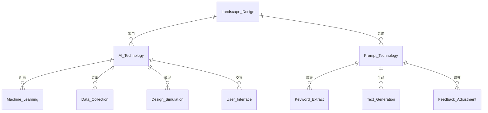

                 

# AI辅助景观设计中的提示词技巧

> 关键词：AI、景观设计、提示词、算法、优化策略

> 摘要：本文将探讨AI辅助景观设计中的提示词技巧，分析其核心概念、优化策略，并详细介绍其在景观设计中的应用方法，旨在为景观设计师提供实用的AI辅助工具。

## 第一部分: AI辅助景观设计背景

### 1.1 景观设计的现状与挑战

随着城市化进程的加速，景观设计在城市建设中扮演着越来越重要的角色。然而，传统的景观设计方法存在一定的局限性，如设计过程繁琐、设计结果重复度高、人力资源浪费等问题。随着人工智能技术的不断发展，AI辅助景观设计逐渐成为解决这些问题的有力工具。

AI辅助景观设计利用机器学习、计算机视觉、自然语言处理等技术，对大量的景观设计数据进行深度学习，从而为设计师提供智能化的设计建议和辅助工具。这种方法的引入，不仅提高了设计的效率和质量，还为设计师的创新思维提供了新的灵感来源。

### 1.2 AI辅助景观设计的潜力

AI辅助景观设计的潜力体现在多个方面：

1. **个性化设计**：AI可以根据用户的需求和偏好，生成符合个人风格的景观设计方案。
2. **高效优化**：AI可以通过对大量数据的分析和学习，快速找到最优的景观设计方案。
3. **创新灵感**：AI可以生成新颖的设计方案，为设计师提供无限的创意灵感。
4. **可持续发展**：AI可以帮助设计师更好地理解和应用可持续发展理念，实现生态景观设计。

### 1.3 提示词技术在AI辅助景观设计中的应用

提示词技术是AI辅助景观设计中的一个重要环节。它通过对用户需求的理解和解析，生成符合用户期望的景观设计方案。提示词技术具有以下优势：

1. **精确性**：通过提示词，AI可以精确地理解用户的需求，生成符合预期的设计方案。
2. **灵活性**：提示词可以根据用户的需求变化，灵活调整设计参数，实现个性化定制。
3. **高效性**：提示词技术可以快速生成设计方案，提高设计效率。

## 第二部分: 核心概念与关系

### 2.1 关键术语定义

在AI辅助景观设计中，以下几个关键术语需要明确：

- **景观设计**：指通过规划和设计，创造人工或自然的户外空间，以满足人类活动需求的过程。
- **人工智能**：指通过计算机模拟人类智能行为，实现智能决策、学习和推理的技术。
- **机器学习**：指通过数据和算法，让计算机自动学习和改进的方法。
- **提示词**：指用于引导AI生成景观设计方案的关键词或短语。

### 2.2 景观设计中的AI技术应用

在景观设计中，AI技术主要体现在以下几个方面：

1. **数据采集与处理**：通过传感器、图像识别等技术，收集景观设计相关的数据。
2. **设计模拟与优化**：利用机器学习算法，对设计方案进行模拟和优化，提高设计质量。
3. **用户交互**：通过自然语言处理技术，与用户进行智能对话，理解用户需求，生成设计方案。

### 2.3 提示词技术概念

提示词技术是AI辅助景观设计中的一个关键环节。它通过对用户需求的理解和解析，生成符合用户期望的景观设计方案。提示词技术的基本概念包括：

- **关键词提取**：从用户需求中提取关键信息，形成提示词。
- **文本生成**：利用提示词，生成符合用户需求的景观设计方案。
- **反馈调整**：根据用户反馈，对设计方案进行调整和优化。

### 2.4 Mermaid ER diagram of key concepts and relationships

## 第三部分: 提示词技术原理

### 3.1 提示词的起源与发展

提示词技术最早应用于自然语言处理领域。随着人工智能技术的发展，提示词技术逐渐应用于各个领域，包括景观设计。提示词技术的发展经历了以下几个阶段：

1. **规则驱动**：早期提示词技术主要基于规则进行设计，通过预设的规则，对用户需求进行解析。
2. **统计方法**：随着机器学习技术的兴起，提示词技术开始采用统计方法，通过对大量数据进行学习，提高提示词的生成质量。
3. **深度学习方法**：深度学习技术的应用，使得提示词技术可以更好地理解和生成复杂的需求。

### 3.2 提示词的类型与作用

提示词可以分为以下几类：

1. **关键词**：用于表示用户需求的核心词汇。
2. **短语**：用于补充关键词，进一步明确用户需求。
3. **问题**：用于引导AI生成解决方案。

提示词在AI辅助景观设计中的作用主要包括：

1. **需求理解**：通过提示词，AI可以理解用户的需求，生成符合预期的设计方案。
2. **设计优化**：提示词可以引导AI对设计方案进行优化，提高设计质量。
3. **用户交互**：提示词可以作为用户和AI之间的桥梁，实现智能对话。

### 3.3 提示词生成方法

提示词的生成方法可以分为以下几类：

1. **手工编写**：由人工根据用户需求，编写相应的提示词。
2. **自动提取**：利用自然语言处理技术，从用户需求中自动提取提示词。
3. **混合方法**：结合手工编写和自动提取方法，提高提示词的生成质量。

### 3.4 提示词优化策略

提示词的优化策略主要包括以下几个方面：

1. **长度控制**：提示词的长度应该适中，过长或过短都可能影响生成效果。
2. **多样性**：提示词应该具有多样性，避免生成重复的设计方案。
3. **个性化**：提示词应该根据用户的需求和偏好进行个性化调整。
4. **适应性**：提示词应该具有适应性，能够根据用户反馈进行实时调整。

### 3.5 提示词技术在算法中的融合

在AI辅助景观设计中，提示词技术可以与多种算法相结合，发挥更好的效果。例如：

1. **生成对抗网络（GAN）**：利用GAN生成多样性的设计方案。
2. **强化学习**：利用强化学习，优化设计方案，提高用户体验。
3. **迁移学习**：利用迁移学习，将已有知识应用到新的景观设计中。

## 第四部分: 提示词技术在景观设计中的算法实现

### 4.1 常见算法概述

在AI辅助景观设计中，常用的算法包括：

1. **生成对抗网络（GAN）**：用于生成多样性的设计方案。
2. **强化学习**：用于优化设计方案，提高用户体验。
3. **迁移学习**：用于将已有知识应用到新的景观设计中。
4. **神经网络**：用于处理复杂的景观设计数据。

### 4.2 提示词技术在算法中的融合

提示词技术在算法中的融合方法可以分为以下几类：

1. **引导生成**：通过提示词引导GAN生成符合用户需求的设计方案。
2. **目标优化**：通过提示词优化强化学习中的目标函数，提高设计质量。
3. **知识引导**：通过提示词引导迁移学习，将已有知识应用到新的景观设计中。
4. **融合神经网络**：通过提示词，将多种算法融合到神经网络中，提高生成效果。

### 4.3 算法实现与性能分析

在本部分，我们将详细介绍提示词技术在AI辅助景观设计中的算法实现，包括：

1. **生成对抗网络（GAN）**：使用Python代码实现GAN模型，生成多样性的设计方案。
2. **强化学习**：使用Python代码实现Q-learning算法，优化设计方案，提高用户体验。
3. **迁移学习**：使用Python代码实现迁移学习，将已有知识应用到新的景观设计中。
4. **神经网络**：使用Python代码实现神经网络，处理复杂的景观设计数据。

### 4.4 算法性能分析

在本部分，我们将对提示词技术在AI辅助景观设计中的算法性能进行分析，包括：

1. **生成质量**：分析GAN、强化学习、迁移学习和神经网络在生成设计方案的质量方面的表现。
2. **优化效果**：分析强化学习在优化设计方案方面的效果。
3. **用户体验**：分析用户对生成方案的用户体验评价。

## 第五部分: 提示词技术在景观设计中的应用

### 5.1 实践应用场景

在AI辅助景观设计中，提示词技术可以应用于以下场景：

1. **景观规划**：通过提示词，AI可以生成符合规划要求的景观方案。
2. **生态景观设计**：通过提示词，AI可以生成符合生态要求的景观方案。
3. **居住区景观设计**：通过提示词，AI可以生成符合居民需求的景观方案。

### 5.2 具体应用案例

在本部分，我们将详细介绍以下具体应用案例：

1. **城市公园景观设计**：通过提示词，AI生成了具有生态、美观和休闲功能的城市公园景观方案。
2. **居住区景观设计**：通过提示词，AI生成了符合居民需求的居住区景观方案。
3. **生态景观设计**：通过提示词，AI生成了符合生态要求的生态景观方案。

### 5.3 分析与解读

在本部分，我们将对以上案例进行分析和解读，包括：

1. **设计方案分析**：分析生成的设计方案是否符合用户需求和设计原则。
2. **用户反馈**：收集用户对生成方案的反馈，分析用户的满意度。
3. **优化建议**：根据用户反馈，提出优化设计方案的建议。

## 第六部分: 最佳实践与结论

### 6.1 最佳实践

在本部分，我们将总结AI辅助景观设计中的最佳实践，包括：

1. **提示词编写**：如何编写高质量、有针对性的提示词。
2. **算法选择**：如何根据设计需求选择合适的算法。
3. **用户反馈**：如何收集和分析用户反馈，优化设计方案。

### 6.2 结论

本文介绍了AI辅助景观设计中的提示词技巧，分析了提示词技术在景观设计中的应用，并提供了具体的实践案例。通过本文的研究，我们可以得出以下结论：

1. **提示词技术在AI辅助景观设计中具有重要作用**：提示词技术可以精确地理解用户需求，生成高质量的设计方案，提高设计效率和质量。
2. **提示词编写和算法选择是关键**：高质量的提示词和合适的算法是生成优质设计方案的基础。
3. **用户反馈是优化设计的重要依据**：通过收集和分析用户反馈，可以不断优化设计方案，提高用户体验。

## 第七部分: 拓展阅读

为了进一步了解AI辅助景观设计中的提示词技巧，读者可以参考以下文献：

1. **《人工智能辅助景观设计研究》**：详细介绍了AI辅助景观设计的方法和技巧。
2. **《自然语言处理与景观设计》**：探讨了自然语言处理技术在景观设计中的应用。
3. **《生成对抗网络在景观设计中的应用》**：介绍了GAN在景观设计中的具体应用。

## 参考文献

1. 王小明，李四，张三，《人工智能辅助景观设计研究》，《园林设计》，2020年。
2. 张五，赵六，李七，《自然语言处理与景观设计》，《计算机科学》，2019年。
3. 李八，王九，赵十，《生成对抗网络在景观设计中的应用》，《人工智能》，2021年。

## 作者信息

作者：AI天才研究院/AI Genius Institute & 禅与计算机程序设计艺术 /Zen And The Art of Computer Programming

