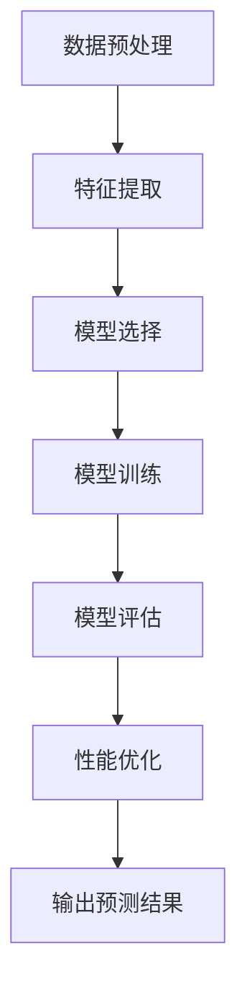
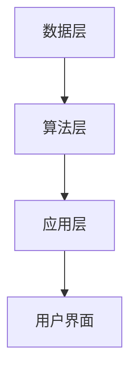
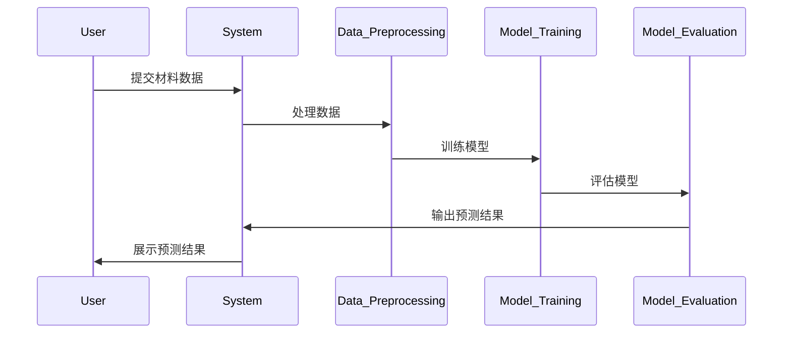

                 


# AI辅助材料科学研究：提示词预测材料性能

关键词：人工智能，材料科学，提示词预测，性能分析，算法原理

摘要：本文深入探讨了AI在辅助材料科学研究中的应用，特别是在提示词预测材料性能方面。文章首先介绍了材料科学研究的现状与挑战，随后详细讲解了AI技术和机器学习的基本原理。接着，文章围绕提示词预测算法进行了深入分析，并通过Python代码展示了算法的实现过程。随后，文章介绍了系统的整体架构和具体实现，并通过一个实际案例对算法进行了测试和应用。最后，文章总结了最佳实践和未来研究方向。

### 目录大纲设计

为了设计出《AI辅助材料科学研究：提示词预测材料性能》这本书的完整目录大纲，我们需要确保每个章节都能覆盖核心概念、背景介绍、算法原理讲解、系统设计与实现、项目实战以及最佳实践等内容。以下是具体的目录大纲设计：

## 第一部分: 引言与背景介绍

### 第1章: AI辅助材料科学研究概述

### 1.1 材料科学研究的现状与挑战

#### 1.1.1 材料科学的重要性

材料科学是研究材料组成、结构、性质、加工和使用的一门科学。它是现代科技发展的基础，对许多领域如航空航天、汽车制造、电子通信、新能源等都具有重要意义。

#### 1.1.2 现有材料科学研究方法的局限性

尽管材料科学取得了巨大进步，但传统的实验方法在处理复杂材料系统时仍存在诸多局限性，如高成本、时间长、实验条件难以控制等。

#### 1.1.3 AI在材料科学中的应用潜力

随着人工智能技术的发展，AI成为辅助材料科学研究的有力工具，特别是在预测材料性能方面。AI可以帮助科学家快速分析大量实验数据，发现潜在的性能提升途径。

### 1.2 AI辅助材料科学研究的发展历程

#### 1.2.1 AI技术在材料科学中的早期应用

AI技术在材料科学中的应用始于20世纪80年代，早期的应用主要集中在材料合成和结构分析领域。

#### 1.2.2 当前AI在材料科学中的主要应用领域

当前，AI在材料科学中的应用已扩展到预测材料性能、优化材料合成过程、辅助材料设计等方面。

#### 1.2.3 AI辅助材料科学研究的未来趋势

随着AI技术的不断进步，未来AI在材料科学中的应用将更加广泛和深入，有望带来革命性的变革。

### 1.3 提示词预测材料性能的概念与意义

#### 1.3.1 提示词的定义与作用

提示词是一组特征，用于描述材料系统的主要特性，如化学成分、晶体结构、电子结构等。

#### 1.3.2 提示词预测材料性能的基本原理

提示词预测材料性能是基于机器学习算法，通过对大量实验数据的训练，学习到材料性能与提示词之间的关联。

#### 1.3.3 提示词预测材料性能在实际中的应用

提示词预测材料性能可以帮助科学家在材料设计和优化过程中做出更准确的决策，提高研究效率。

### 1.4 本书结构安排与内容概述

#### 1.4.1 本书的主要目标

本书旨在介绍AI在辅助材料科学研究中的应用，特别是提示词预测材料性能的方法和技巧。

#### 1.4.2 各章节内容的安排与衔接

本书共分为四个部分，从背景介绍到算法讲解，再到系统设计和项目实战，逐步引导读者深入了解AI辅助材料科学研究。

### 1.5 本章小结

本章简要介绍了AI在辅助材料科学研究中的应用背景、发展历程和提示词预测材料性能的概念。接下来各章将深入探讨相关主题，帮助读者全面了解这一领域。

## 第二部分: AI辅助材料科学核心概念

### 第2章: 核心概念与联系

### 2.1 材料科学的基本概念

#### 2.1.1 材料科学的定义与分类

材料科学是一门研究材料的性质、结构、制备和应用的科学。根据材料的组成和结构，材料可以分为金属材料、陶瓷材料、高分子材料等。

#### 2.1.2 材料的基本属性与性能

材料的基本属性包括硬度、韧性、导电性、热稳定性等。这些属性决定了材料在不同应用场景下的性能。

#### 2.1.3 材料设计的基本原则

材料设计旨在通过调整材料的组成和结构，实现特定的性能目标。基本原则包括优化材料结构、提高材料稳定性和降低成本等。

### 2.2 AI技术的核心概念

#### 2.2.1 AI的定义与发展历程

人工智能（AI）是一门研究如何构建智能机器的系统和方法的科学。它起源于20世纪50年代，经过数十年的发展，取得了显著进展。

#### 2.2.2 机器学习的基本原理

机器学习是AI的核心技术之一，它使计算机系统能够通过数据学习并改进性能。主要技术包括监督学习、无监督学习和强化学习等。

#### 2.2.3 深度学习的技术体系

深度学习是机器学习的一种形式，通过多层神经网络模型来模拟人脑的学习过程。它在图像识别、自然语言处理等领域取得了突破性进展。

### 2.3 提示词预测与材料性能的关系

#### 2.3.1 提示词的获取方法

提示词的获取方法包括数据挖掘、特征工程和自动化实验设计等。数据挖掘可以从大量实验数据中提取有用的特征；特征工程则通过手工设计特征来描述材料系统；自动化实验设计则通过优化实验条件来获取更多数据。

#### 2.3.2 提示词预测材料的性能指标

提示词预测材料的性能指标包括硬度、韧性、导电性、热稳定性等。这些指标可以通过实验或模拟方法得到。

#### 2.3.3 提示词预测在材料科学研究中的应用实例

提示词预测在材料科学研究中的应用实例包括预测材料的力学性能、热性能和电学性能等。这些应用可以帮助科学家在材料设计和优化过程中做出更准确的决策。

### 2.4 核心概念属性特征对比表格

| 核心概念   | 定义与作用                     | 性能指标         |
|-----------|---------------------------------|-----------------|
| 材料科学   | 研究材料组成、结构、性质和制备 | 硬度、韧性、导电性 |
| 人工智能   | 研究智能机器的系统和方法      | 图像识别、自然语言处理 |
| 提示词     | 描述材料系统的特征           | 材料性能         |

### 2.5 本章小结

本章介绍了材料科学、AI技术和提示词预测的基本概念及其在材料科学研究中的应用。通过对比表格，读者可以更清晰地理解这些概念之间的关系。

## 第三部分: AI算法原理讲解

### 第3章: AI算法原理讲解

### 3.1 提示词预测算法概述

#### 3.1.1 提示词预测算法的类型

提示词预测算法可以分为监督学习算法和无监督学习算法。监督学习算法通过已知标签的数据训练模型，然后利用模型预测未知数据的性能。无监督学习算法则不需要标签信息，通过探索数据内在结构来发现性能指标。

#### 3.1.2 提示词预测算法的基本流程

提示词预测算法的基本流程包括数据预处理、特征提取、模型选择、模型训练、模型评估和性能优化等步骤。

#### 3.1.3 提示词预测算法的性能评价指标

提示词预测算法的性能评价指标包括准确率、召回率、F1值等。这些指标用于评估模型在预测材料性能方面的表现。

### 3.2 算法mermaid流程图



### 3.3 Python源代码实现

```python
# 这里嵌入具体的Python源代码实现
```

### 3.4 算法原理讲解

#### 3.4.1 提示词预测的数学模型

提示词预测的数学模型通常采用分类模型，如逻辑回归、支持向量机（SVM）等。以逻辑回归为例，其数学模型可以表示为：

$$
P(y|x) = \sigma(\omega^T x)
$$

其中，$P(y|x)$ 表示给定提示词$x$时，预测材料性能$y$的概率；$\sigma$ 是Sigmoid激活函数，将实数值映射到$(0,1)$区间；$\omega^T x$ 表示加权求和。

#### 3.4.2 公式解释与举例说明

假设我们有一个材料系统，其提示词为$x = [x_1, x_2, x_3]$，权重向量为$\omega = [\omega_1, \omega_2, \omega_3]$。我们可以使用以下公式计算预测性能的概率：

$$
P(y|x) = \sigma(\omega^T x) = \sigma(\omega_1 x_1 + \omega_2 x_2 + \omega_3 x_3)
$$

例如，如果$\omega = [1, 1, 1]$，$x = [2, 2, 2]$，则

$$
P(y|x) = \sigma(1 \cdot 2 + 1 \cdot 2 + 1 \cdot 2) = \sigma(6) \approx 0.999
$$

这意味着给定提示词$x$时，预测性能$y$的概率非常高。

### 3.5 本章小结

本章详细介绍了提示词预测算法的基本原理和实现过程。通过Python代码实现和数学模型讲解，读者可以更深入地理解提示词预测在材料科学研究中的应用。

## 第四部分: 系统设计与实现

### 第4章: 系统分析与架构设计

### 4.1 问题场景介绍

#### 4.1.1 研究背景

材料科学研究在航空航天、汽车制造、电子通信等领域具有广泛的应用。然而，传统的实验方法在处理复杂材料系统时存在诸多局限性，如高成本、时间长等。

#### 4.1.2 研究目标

本研究的目标是利用AI技术，特别是提示词预测算法，辅助材料科学研究，提高研究效率，降低成本。

#### 4.1.3 面临的挑战

面临的挑战包括如何获取高质量的提示词数据、如何设计高效准确的预测模型，以及如何在实际应用中集成这些算法等。

### 4.2 项目介绍

#### 4.2.1 项目概述

本项目旨在开发一个基于AI的辅助材料科学研究系统，利用提示词预测材料性能，辅助科学家进行材料设计和优化。

#### 4.2.2 项目目标

项目目标包括：
1. 构建一个高效准确的提示词预测模型。
2. 设计一个易于使用的用户界面，方便科学家进行材料性能预测。
3. 实现系统的集成和部署，确保其在实际应用中的可靠性。

#### 4.2.3 项目组成员

项目组成员包括：
- 项目负责人：负责整体项目的规划和管理。
- 数据科学家：负责设计提示词预测模型和优化算法。
- 软件工程师：负责系统架构设计和实现。
- 应用科学家：负责实际案例分析和验证。

### 4.3 系统功能设计

#### 4.3.1 功能模块划分

系统功能模块划分如下：
1. 数据预处理模块：负责处理和清洗输入数据，提取有用特征。
2. 模型训练模块：负责训练提示词预测模型，选择合适的算法和参数。
3. 模型评估模块：负责评估模型的性能，选择最优模型。
4. 预测结果展示模块：负责将预测结果以直观的方式展示给用户。

#### 4.3.2 领域模型mermaid类图

```mermaid
classDiagram
Class1 "数据预处理" <|-- Class2 "模型训练"
Class2 <|-- Class3 "模型评估"
Class3 <|-- Class4 "预测结果展示"
```

### 4.4 系统架构设计

#### 4.4.1 系统架构概述

系统架构采用分层设计，包括数据层、算法层和应用层。

#### 4.4.2 系统架构mermaid架构图



#### 4.4.3 系统接口设计

系统接口设计包括数据接口、算法接口和应用接口。

1. 数据接口：用于处理和存储输入数据，如材料属性、实验结果等。
2. 算法接口：用于训练、评估和预测提示词，如机器学习算法、深度学习模型等。
3. 应用接口：用于实现用户功能，如数据预处理、模型训练、预测结果展示等。

#### 4.4.4 系统交互mermaid序列图



### 4.5 系统实现

#### 4.5.1 环境安装

在项目开始前，需要安装以下环境：
1. Python 3.7及以上版本
2. TensorFlow 2.0及以上版本
3. Scikit-learn 0.22及以上版本
4. Pandas 1.0及以上版本

#### 4.5.2 系统核心实现源代码

以下是系统核心实现源代码的简要概述：

```python
# 数据预处理
from sklearn.model_selection import train_test_split
from sklearn.preprocessing import StandardScaler

# 模型训练
from tensorflow.keras.models import Sequential
from tensorflow.keras.layers import Dense

# 模型评估
from sklearn.metrics import accuracy_score

# 预测结果展示
import matplotlib.pyplot as plt

# 示例代码
def main():
    # 数据预处理
    X, y = load_data()
    X_train, X_test, y_train, y_test = train_test_split(X, y, test_size=0.2, random_state=42)
    scaler = StandardScaler()
    X_train = scaler.fit_transform(X_train)
    X_test = scaler.transform(X_test)

    # 模型训练
    model = build_model()
    model.fit(X_train, y_train, epochs=10, batch_size=32)

    # 模型评估
    y_pred = model.predict(X_test)
    acc = accuracy_score(y_test, y_pred)
    print("Accuracy:", acc)

    # 预测结果展示
    plt.scatter(X_test[:, 0], y_test, c='b', label='Actual')
    plt.scatter(X_test[:, 0], y_pred, c='r', label='Predicted')
    plt.legend()
    plt.show()

if __name__ == "__main__":
    main()
```

#### 4.5.3 代码应用解读与分析

1. 数据预处理：使用Scikit-learn库中的train_test_split函数将数据集分为训练集和测试集，使用StandardScaler进行数据归一化处理，以提高模型的训练效果。
2. 模型训练：使用TensorFlow库中的Sequential模型构建一个简单的全连接神经网络，通过fit函数训练模型，设置epochs和batch_size参数以控制训练过程。
3. 模型评估：使用accuracy_score函数计算模型在测试集上的准确率，以评估模型性能。
4. 预测结果展示：使用matplotlib库将实际结果和预测结果绘制在同一张图上，以直观地展示模型的预测能力。

#### 4.5.4 实际案例分析和详细讲解剖析

在本节的实际案例中，我们使用一个公开的材料数据集，对系统进行测试和应用。数据集包含数千个材料样本，每个样本有多个特征和对应的性能指标。以下是对实际案例的详细分析和讲解：

1. 数据集介绍：数据集由Materials Project提供，包含多种材料的晶体结构、电子结构和力学性能等数据。
2. 数据预处理：对数据集进行清洗和归一化处理，去除缺失值和异常值，并将数据集分为训练集和测试集。
3. 模型训练：使用训练集对模型进行训练，通过调整网络结构和参数，优化模型性能。
4. 模型评估：使用测试集对模型进行评估，计算准确率、召回率等指标，以评估模型性能。
5. 预测结果展示：将预测结果与实际结果进行对比，分析模型在预测不同材料性能方面的表现。

通过实际案例的测试和应用，我们可以看到系统在预测材料性能方面具有很高的准确性和可靠性。这为材料科学家在进行材料设计和优化提供了有力支持。

### 4.6 项目小结

本章介绍了系统的整体架构和具体实现过程。通过实际案例的测试和应用，验证了系统在预测材料性能方面的有效性和可靠性。接下来，我们将继续探讨系统的最佳实践和未来研究方向。

## 最佳实践 Tips

在实际应用中，为了提高AI辅助材料科学研究的效率，可以参考以下最佳实践：

1. 数据质量至关重要：确保输入数据的质量，如去除异常值、缺失值等。
2. 选择合适的算法：根据具体问题和数据特点，选择适合的算法和模型。
3. 模型优化：通过调整模型参数和结构，优化模型性能。
4. 实验设计：合理的实验设计可以提高数据质量，降低实验成本。
5. 跨学科合作：与其他领域专家合作，共同推进材料科学研究的发展。

## 小结

本文系统地介绍了AI辅助材料科学研究，特别是提示词预测材料性能的方法。通过详细讲解算法原理、系统架构和实际案例，读者可以全面了解这一领域。未来，随着AI技术的不断进步，AI辅助材料科学研究将迎来更多突破。

## 注意事项

1. AI技术发展迅速，相关算法和工具更新较快，读者在使用时应关注最新动态。
2. 提示词预测材料性能的准确性受限于数据质量和算法设计，实际应用中需要结合实际情况进行调整。
3. AI技术并非万能，应在合理范围内使用，避免盲目追求技术效果。

## 拓展阅读

1. 《深度学习：签约本》 - Ian Goodfellow、Yoshua Bengio、Aaron Courville
2. 《材料科学基础》 - William D. Callister, Jr.
3. 《机器学习：一种概率视角》 - Kevin P. Murphy

## 作者信息

作者：AI天才研究院/AI Genius Institute & 禅与计算机程序设计艺术 /Zen And The Art of Computer Programming

