                 

### 文章标题

### 关键词：人工智能、游戏设计、提示词生成、GAN、VAE、强化学习、自监督学习

### 摘要：

本文旨在探讨人工智能（AI）在游戏设计中的应用，特别是提示词生成算法在游戏剧情创作中的潜在价值。文章首先概述了AI辅助游戏设计的背景和优势，随后深入分析了提示词生成算法的基本概念和原理。重点介绍了生成对抗网络（GAN）、变分自编码器（VAE）、强化学习和自监督学习等算法，并详细讲解了它们的工作流程和应用场景。通过本文，读者将了解如何利用AI技术提升游戏设计的效率和质量，为游戏产业的发展提供新的思路和方法。

### 目录大纲

----------------------------------------------------------------

# 第一部分：引言

## 第1章：AI辅助游戏设计概述

### 1.1 问题背景
#### 1.1.1 游戏设计的现状与挑战
#### 1.1.2 AI辅助游戏设计的优势
#### 1.1.3 AI辅助游戏设计的边界与外延

### 1.2 核心概念与联系
#### 1.2.1 AI基础概念
#### 1.2.2 游戏设计核心概念
#### 1.2.3 AI与游戏设计的结合

### 1.3 AI辅助游戏设计在游戏产业中的应用前景
#### 1.3.1 当前应用案例
#### 1.3.2 未来发展趋势

### 1.4 本章小结

----------------------------------------------------------------

# 第二部分：提示词生成算法原理

## 第2章：提示词生成算法概述

### 2.1 提示词生成算法的基本概念
#### 2.1.1 提示词生成的定义
#### 2.1.2 提示词生成的目的
#### 2.1.3 提示词生成的应用场景

### 2.2 常见的提示词生成算法
#### 2.2.1 生成式算法
##### 2.2.1.1 生成对抗网络(GAN)
##### 2.2.1.2 变分自编码器(VAE)
#### 2.2.2 对抗式算法
##### 2.2.2.1 强化学习
##### 2.2.2.2 自监督学习

### 2.3 提示词生成算法的工作流程
#### 2.3.1 数据预处理
#### 2.3.2 模型选择与训练
#### 2.3.3 提示词生成与优化

### 2.4 提示词生成算法的性能评估
#### 2.4.1 评估指标
#### 2.4.2 性能评估方法

### 2.5 本章小结

----------------------------------------------------------------

## 第3章：提示词生成算法原理讲解

### 3.1 GAN算法原理
#### 3.1.1 GAN算法的基本原理
##### 3.1.1.1 生成器和判别器的定义
##### 3.1.1.2 GAN的训练过程
#### 3.1.2 GAN的mermaid流程图
```
graph TB
A[生成器] --> B[生成样本]
B --> C[判别器]
C --> D[真实样本]
D --> E{判别器判断}
E --> F[更新生成器]
F --> G[迭代]
G --> H[结束]
```
#### 3.1.3 GAN的应用案例
##### 3.1.3.1 图像生成
##### 3.1.3.2 文本生成

### 3.2 VAE算法原理
#### 3.2.1 VAE算法的基本原理
##### 3.2.1.1 编码器和解码器的定义
##### 3.2.1.2 VAE的训练过程
#### 3.2.2 VAE的mermaid流程图
```
graph TB
A[编码器] --> B[隐变量]
B --> C[解码器]
C --> D[重构样本]
D --> E{损失函数}
E --> F[更新参数]
F --> G[迭代]
G --> H[结束]
```
#### 3.2.3 VAE的应用案例
##### 3.2.3.1 数据降维
##### 3.2.3.2 生成式文本生成

### 3.3 强化学习算法原理
#### 3.3.1 强化学习算法的基本原理
##### 3.3.1.1 强化学习的定义
##### 3.3.1.2 强化学习的要素
#### 3.3.2 强化学习的mermaid流程图
```
graph TB
A[智能体] --> B[环境]
B --> C[状态]
C --> D[动作]
D --> E[奖励]
E --> F[反馈]
F --> G[更新策略]
G --> H[迭代]
H --> I[结束]
```
#### 3.3.3 强化学习的应用案例
##### 3.3.3.1 游戏AI
##### 3.3.3.2 机器人控制

### 3.4 自监督学习算法原理
#### 3.4.1 自监督学习算法的基本原理
##### 3.4.1.1 自监督学习的定义
##### 3.4.1.2 自监督学习的应用场景
#### 3.4.2 自监督学习的mermaid流程图
```
graph TB
A[数据输入] --> B[特征提取]
B --> C[标签生成]
C --> D[损失函数]
D --> E[更新模型]
E --> F[迭代]
F --> G[结束]
```
#### 3.4.3 自监督学习的应用案例
##### 3.4.3.1 图像分类
##### 3.4.3.2 自然语言处理

### 3.5 提示词生成算法总结
#### 3.5.1 GAN与VAE的比较
#### 3.5.2 强化学习与自监督学习的关系
#### 3.5.3 提示词生成算法的选择依据

### 3.6 本章小结

----------------------------------------------------------------

# 第二部分：引言

## 第1章：AI辅助游戏设计概述

### 1.1 问题背景

游戏设计是一个复杂且充满创造性的过程，涉及到游戏玩法、故事情节、角色设计、视觉和声音效果等多个方面。然而，随着游戏市场的不断扩大和竞争的加剧，游戏设计师面临着越来越多的挑战。首先，游戏设计师需要花费大量时间和精力来构思和编写游戏剧情，这通常是一项繁琐且重复性的工作。其次，游戏剧情的复杂性和多样性要求设计师具备出色的创造力和逻辑思维，这在实际操作中往往难以达到。此外，游戏设计过程中，设计师需要不断地测试和优化游戏玩法，这同样需要大量的时间和资源。

### 1.1.1 游戏设计的现状与挑战

当前，游戏设计主要依赖于设计师的经验和创造力。虽然一些游戏引擎和工具提供了自动生成剧情的功能，但它们的智能化程度有限，难以满足设计师对多样性和个性化的需求。此外，游戏设计的迭代过程漫长且成本高昂，设计师往往需要在多次试错中不断完善游戏剧情。这种传统的设计方法不仅效率低下，而且容易出现创意枯竭和设计疲劳。

### 1.1.2 AI辅助游戏设计的优势

随着人工智能技术的不断发展，AI辅助游戏设计逐渐成为一种新的趋势。首先，AI能够通过大数据分析和机器学习算法，快速生成多样化的游戏剧情和角色，满足设计师对多样性的需求。其次，AI能够自动识别和优化游戏剧情中的问题和错误，提高设计的效率和准确性。此外，AI还能够根据玩家的行为和偏好，动态调整游戏剧情，提供个性化的游戏体验。

### 1.1.3 AI辅助游戏设计的边界与外延

虽然AI在游戏设计中有许多潜在的应用，但同时也存在一些限制和挑战。首先，AI生成的内容可能缺乏深度和创造力，难以替代设计师的核心作用。其次，AI需要大量的数据和计算资源来训练模型，这在实际操作中可能受到硬件和成本的限制。此外，游戏设计是一个高度个性化的过程，AI可能难以完全理解和模拟设计师的创造力。

### 1.2 核心概念与联系

#### 1.2.1 AI基础概念

人工智能（AI）是指计算机系统模拟人类智能行为的技术。它包括机器学习、深度学习、自然语言处理、计算机视觉等多个子领域。机器学习是一种通过数据训练模型，使计算机能够从数据中自动学习和获取知识的技术。深度学习是机器学习的一个分支，通过神经网络模型模拟人脑的学习过程。自然语言处理是使计算机理解和生成自然语言的技术。计算机视觉则是使计算机理解和解释图像和视频内容的技术。

#### 1.2.2 游戏设计核心概念

游戏设计包括游戏玩法、故事情节、角色设计、用户界面、视觉和声音效果等多个方面。游戏玩法是指游戏中的互动机制和规则，如角色行动、战斗系统、资源管理等。故事情节是游戏的叙事框架，包括角色、冲突、解决方案等。角色设计涉及游戏角色的外观、性格、技能等。用户界面是游戏与玩家互动的界面，包括按钮、菜单、图标等。视觉和声音效果则增强游戏的表现力和沉浸感。

#### 1.2.3 AI与游戏设计的结合

AI与游戏设计的结合主要体现在以下几个方面。首先，AI可以用于自动生成游戏剧情和角色，提高设计的效率和多样性。其次，AI可以用于优化游戏玩法，使游戏更具有挑战性和趣味性。此外，AI还可以用于分析玩家的行为和偏好，提供个性化的游戏体验。最后，AI可以用于游戏测试和调试，自动识别和修复游戏中的问题。

### 1.3 AI辅助游戏设计在游戏产业中的应用前景

#### 1.3.1 当前应用案例

目前，AI辅助游戏设计已经在一些知名游戏中得到了应用。例如，游戏《控制》（Control）中就使用了AI技术来生成游戏剧情和角色。玩家在游戏中可以体验到不同的故事线和结局，丰富了游戏的内容和玩法。此外，游戏《辐射4》（Fallout 4）中也使用了AI技术来生成环境中的NPC角色和对话，增加了游戏的互动性和真实性。

#### 1.3.2 未来发展趋势

随着AI技术的不断发展，未来AI辅助游戏设计将变得更加智能化和自动化。首先，AI可以用于更高效地生成游戏剧情和角色，减轻设计师的工作负担。其次，AI可以用于动态调整游戏剧情和玩法，根据玩家的行为和偏好提供个性化的游戏体验。此外，AI还可以用于游戏测试和优化，提高游戏的稳定性和用户体验。

### 1.4 本章小结

本章介绍了AI辅助游戏设计的背景和优势，探讨了游戏设计的现状与挑战，并分析了AI与游戏设计的结合方式。通过本章的介绍，读者可以了解到AI辅助游戏设计的潜在价值和应用前景，为后续章节的深入探讨打下基础。

----------------------------------------------------------------

## 第2章：提示词生成算法概述

### 2.1 提示词生成算法的基本概念

#### 2.1.1 提示词生成的定义

提示词生成算法是一种利用人工智能技术，根据输入的提示信息自动生成相关内容的方法。在游戏设计中，提示词生成算法可以用于自动生成游戏剧情、对话、角色描述等。例如，给定一个角色名字，算法可以生成该角色的背景故事、性格特点和关键情节。

#### 2.1.2 提示词生成的目的

提示词生成的目的是提高游戏设计的效率和质量。通过自动生成游戏剧情和角色描述，设计师可以节省大量时间和精力，专注于游戏的核心玩法和用户体验。此外，提示词生成算法可以提供多样化的剧情和角色，增强游戏的可玩性和沉浸感。

#### 2.1.3 提示词生成的应用场景

提示词生成算法在游戏设计中有广泛的应用场景。首先，它可以用于自动生成游戏剧情，减轻设计师的工作负担。其次，它可以用于生成角色描述，为游戏角色赋予丰富的背景故事和性格特点。此外，提示词生成算法还可以用于游戏测试和优化，自动生成测试数据，提高游戏的稳定性和用户体验。

### 2.2 常见的提示词生成算法

#### 2.2.1 生成式算法

生成式算法通过学习数据分布，生成新的数据。常见的生成式算法包括生成对抗网络（GAN）和变分自编码器（VAE）。

##### 2.2.1.1 生成对抗网络（GAN）

生成对抗网络（GAN）由生成器和判别器两个神经网络组成。生成器尝试生成与真实数据相似的数据，而判别器则尝试区分生成器和真实数据。通过两个网络的对抗训练，生成器能够不断提高生成数据的质量。

##### 2.2.1.2 变分自编码器（VAE）

变分自编码器（VAE）是一种基于概率模型的生成式算法。它由编码器和解码器两个神经网络组成。编码器将输入数据编码为隐变量，解码器则将隐变量解码回输出数据。VAE通过最大化数据概率分布和重建概率分布之间的平衡，生成新的数据。

#### 2.2.2 对抗式算法

对抗式算法通过对抗性训练生成新数据。常见的对抗式算法包括强化学习和自监督学习。

##### 2.2.2.1 强化学习

强化学习是一种通过试错和反馈来学习最优策略的方法。在游戏设计中，强化学习可以用于生成游戏剧情，通过不断尝试和反馈，优化剧情的连贯性和趣味性。

##### 2.2.2.2 自监督学习

自监督学习是一种不需要标签数据的学习方法。在游戏设计中，自监督学习可以用于生成角色描述，通过分析游戏数据和用户行为，自动生成角色的背景故事和性格特点。

### 2.3 提示词生成算法的工作流程

#### 2.3.1 数据预处理

数据预处理是提示词生成算法的关键步骤。首先，需要对原始数据进行清洗和格式化，去除噪声和异常值。然后，对数据进行归一化或标准化，使其适合输入到神经网络模型中。

#### 2.3.2 模型选择与训练

选择合适的模型是提示词生成算法的核心。常见的模型包括生成对抗网络（GAN）、变分自编码器（VAE）、强化学习和自监督学习。选择模型后，需要使用训练数据对模型进行训练。训练过程中，需要调整模型的参数，使其能够生成高质量的提示词。

#### 2.3.3 提示词生成与优化

训练完成后，可以使用模型生成提示词。生成提示词后，需要对结果进行评估和优化。常见的评估指标包括生成质量、多样性、连贯性等。根据评估结果，可以进一步调整模型的参数，提高提示词生成的质量。

### 2.4 提示词生成算法的性能评估

#### 2.4.1 评估指标

提示词生成算法的性能评估主要包括生成质量、多样性、连贯性和用户体验等方面。生成质量评估提示词的准确性和真实性；多样性评估提示词的丰富性和创新性；连贯性评估提示词之间的逻辑关系和故事线的连贯性；用户体验评估提示词对游戏剧情和玩家体验的影响。

#### 2.4.2 性能评估方法

性能评估方法包括定量评估和定性评估。定量评估使用指标对算法的性能进行量化分析，如生成质量、多样性、连贯性等。定性评估则通过用户反馈和专家评审，对算法的性能进行主观评价。

### 2.5 本章小结

本章介绍了提示词生成算法的基本概念、常见算法、工作流程和性能评估方法。通过本章的介绍，读者可以了解到提示词生成算法在游戏设计中的应用，为后续章节的深入探讨打下基础。

----------------------------------------------------------------

## 第3章：提示词生成算法原理讲解

### 3.1 GAN算法原理

生成对抗网络（GAN）是由Ian Goodfellow等人于2014年提出的一种新型深度学习模型，它由生成器和判别器两个神经网络组成，通过对抗训练来生成高质量的数据。GAN在图像生成、文本生成等领域取得了显著成果，被广泛应用于各种场景。

#### 3.1.1 GAN算法的基本原理

GAN的核心思想是利用生成器和判别器的对抗性训练来生成数据。生成器的目标是生成尽可能真实的数据，而判别器的目标是区分真实数据和生成数据。通过这种对抗性训练，生成器能够不断提高生成数据的质量，使其逐渐接近真实数据。

##### 3.1.1.1 生成器和判别器的定义

生成器（Generator）：生成器是一个神经网络，它将随机噪声（z向量）映射为真实数据（x'）。生成器的目标是生成尽可能真实的数据，使得判别器无法区分生成数据和真实数据。

判别器（Discriminator）：判别器也是一个神经网络，它接收输入数据（x或x'），并输出一个概率值，表示输入数据的真实度。判别器的目标是最大化其对真实数据和生成数据的区分能力。

##### 3.1.1.2 GAN的训练过程

GAN的训练过程分为两个阶段：生成器训练和判别器训练。具体步骤如下：

1. **初始化生成器和判别器**：随机初始化生成器和判别器的参数。
2. **生成器训练**：生成器接收随机噪声（z向量）作为输入，生成虚假数据（x'）。判别器对真实数据和生成数据进行对比，更新判别器的参数。
3. **判别器训练**：判别器接收真实数据（x）和生成数据（x'）作为输入，更新判别器的参数。
4. **迭代过程**：重复上述步骤，直至生成器和判别器达到一定的训练目标。

#### 3.1.2 GAN的mermaid流程图

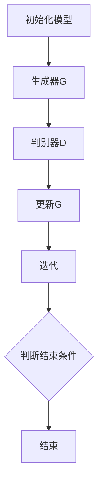

#### 3.1.3 GAN的应用案例

##### 3.1.3.1 图像生成

GAN在图像生成中的应用非常广泛，如生成逼真的图像、修复图像缺陷、生成图像的变种等。例如，在图像修复任务中，生成器可以生成损坏区域的补丁，判别器则判断修复后的图像是否真实。通过对抗性训练，生成器能够生成高质量的修复图像。

##### 3.1.3.2 文本生成

GAN不仅可以应用于图像生成，还可以应用于文本生成。例如，给定一个单词或短语，GAN可以生成相关的句子或段落。通过训练，生成器能够生成具有逻辑性和连贯性的文本，从而帮助设计师自动生成游戏剧情和角色描述。

### 3.2 VAE算法原理

变分自编码器（VAE）是一种基于概率模型的生成式算法，它在生成数据和数据压缩方面表现出色。VAE由编码器和解码器两个神经网络组成，通过学习数据分布来生成新数据。

#### 3.2.1 VAE算法的基本原理

VAE的核心思想是学习数据的概率分布，然后通过解码器生成新数据。具体步骤如下：

##### 3.2.1.1 编码器和解码器的定义

编码器（Encoder）：编码器是一个神经网络，它将输入数据（x）编码为一个隐变量（z）和一个解码器参数（解码器）。编码器的目标是学习输入数据的概率分布。

解码器（Decoder）：解码器是一个神经网络，它将隐变量（z）解码回输入数据（x'）。解码器的目标是生成与输入数据相似的新数据。

##### 3.2.1.2 VAE的训练过程

VAE的训练过程分为两个阶段：编码器训练和解码器训练。具体步骤如下：

1. **初始化编码器和解码器**：随机初始化编码器和解码器的参数。
2. **编码器训练**：编码器将输入数据编码为隐变量和解码器参数。通过最大化数据概率分布和重建概率分布之间的平衡，更新编码器的参数。
3. **解码器训练**：解码器将隐变量解码回输入数据。通过最小化输入数据和生成数据之间的差异，更新解码器的参数。
4. **迭代过程**：重复上述步骤，直至编码器和解码器达到一定的训练目标。

#### 3.2.2 VAE的mermaid流程图

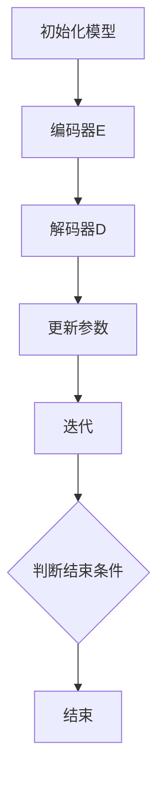

#### 3.2.3 VAE的应用案例

##### 3.2.3.1 数据降维

VAE在数据降维方面表现出色，可以将高维数据映射到低维空间，同时保留数据的主要特征。在游戏设计中，VAE可以用于提取游戏角色的关键特征，从而降低数据维度，提高计算效率。

##### 3.2.3.2 生成式文本生成

VAE在生成式文本生成中也具有广泛的应用。例如，给定一个单词或短语，VAE可以生成相关的句子或段落。通过训练，解码器能够生成具有逻辑性和连贯性的文本，从而帮助设计师自动生成游戏剧情和角色描述。

### 3.3 强化学习算法原理

强化学习是一种通过试错和反馈来学习最优策略的方法。在游戏设计中，强化学习可以用于自动生成游戏剧情，优化游戏玩法，提高用户体验。

#### 3.3.1 强化学习算法的基本原理

强化学习的基本原理是智能体通过与环境交互，不断学习最优策略。具体要素如下：

##### 3.3.1.1 强化学习的定义

强化学习是一种基于奖励机制的学习方法。智能体通过执行动作（action）来获取奖励（reward），并通过不断试错来学习最优策略（policy）。

##### 3.3.1.2 强化学习的要素

智能体（Agent）：执行动作并获取奖励的主体。

环境（Environment）：智能体执行动作的背景。

状态（State）：智能体在某一时刻所处的状态。

动作（Action）：智能体可以执行的动作。

奖励（Reward）：智能体执行动作后获得的即时奖励。

策略（Policy）：智能体的行为规则，用于指导智能体选择动作。

##### 3.3.1.3 强化学习的mermaid流程图

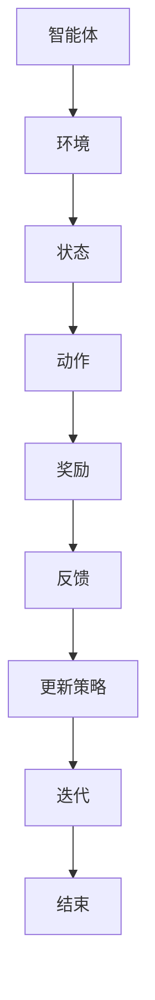

#### 3.3.2 强化学习的应用案例

##### 3.3.2.1 游戏AI

强化学习在游戏AI中具有广泛的应用。例如，在《星际争霸》（StarCraft）游戏中，智能体可以通过强化学习学习最佳战术，实现自主游戏。

##### 3.3.2.2 机器人控制

强化学习在机器人控制中也具有广泛的应用。例如，机器人可以通过强化学习学习最优路径规划、物体抓取等任务，从而实现自主操作。

### 3.4 自监督学习算法原理

自监督学习是一种不需要标签数据的学习方法，通过无监督方式自动学习数据的特征和模式。自监督学习在游戏设计中可以用于自动生成角色描述、优化游戏剧情等。

#### 3.4.1 自监督学习算法的基本原理

自监督学习的基本原理是利用数据的内在结构来学习特征表示。具体步骤如下：

##### 3.4.1.1 自监督学习的定义

自监督学习是一种无监督学习方法，它利用数据的自相似性和相关性来学习特征表示。

##### 3.4.1.2 自监督学习的应用场景

自监督学习在多种场景中具有应用价值，如图像分类、语音识别、自然语言处理等。在游戏设计中，自监督学习可以用于生成角色描述、优化游戏剧情等。

#### 3.4.2 自监督学习的mermaid流程图

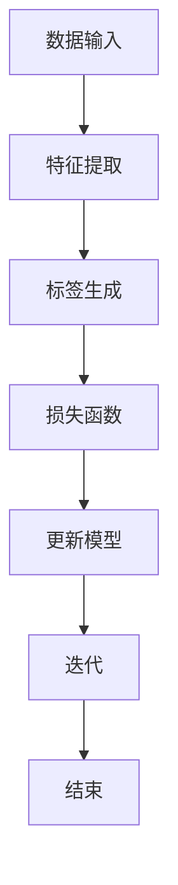

#### 3.4.3 自监督学习的应用案例

##### 3.4.3.1 图像分类

自监督学习在图像分类中具有广泛的应用。例如，使用自监督学习算法可以自动提取图像特征，从而实现图像分类。

##### 3.4.3.2 自然语言处理

自监督学习在自然语言处理中也具有广泛的应用。例如，使用自监督学习算法可以自动生成文本摘要、翻译等。

### 3.5 提示词生成算法总结

#### 3.5.1 GAN与VAE的比较

GAN和VAE都是生成式算法，但它们在原理和应用上有所不同。GAN通过对抗性训练生成数据，适用于生成高质量、多样化数据。VAE则通过编码器和解码器学习数据分布，适用于数据降维和生成式文本生成。

#### 3.5.2 强化学习与自监督学习的关系

强化学习和自监督学习都是通过无监督方式学习数据特征和模式。强化学习通过奖励机制学习最优策略，适用于游戏AI和机器人控制。自监督学习通过无监督方式学习特征表示，适用于图像分类、自然语言处理等。

#### 3.5.3 提示词生成算法的选择依据

选择提示词生成算法时，需要考虑以下因素：生成质量、多样性、连贯性和计算成本。根据具体应用场景和需求，选择合适的算法。

### 3.6 本章小结

本章详细介绍了GAN、VAE、强化学习和自监督学习等提示词生成算法的基本原理和应用案例。通过本章的学习，读者可以了解这些算法在游戏设计中的应用，为AI辅助游戏设计提供新的思路和方法。

----------------------------------------------------------------

## 第3章：提示词生成算法原理讲解

### 3.1 GAN算法原理

生成对抗网络（GAN）是由Ian Goodfellow等人于2014年提出的一种新型深度学习模型，它由生成器和判别器两个神经网络组成，通过对抗性训练生成高质量的数据。GAN在图像生成、文本生成等领域取得了显著成果，被广泛应用于各种场景。

#### 3.1.1 GAN算法的基本原理

GAN的核心思想是利用生成器和判别器的对抗性训练来生成数据。生成器的目标是生成尽可能真实的数据，而判别器的目标是区分真实数据和生成数据。通过这种对抗性训练，生成器能够不断提高生成数据的质量，使其逐渐接近真实数据。

##### 3.1.1.1 生成器和判别器的定义

生成器（Generator）：生成器是一个神经网络，它将随机噪声（z向量）映射为真实数据（x'）。生成器的目标是生成尽可能真实的数据，使得判别器无法区分生成数据和真实数据。

判别器（Discriminator）：判别器也是一个神经网络，它接收输入数据（x或x'），并输出一个概率值，表示输入数据的真实度。判别器的目标是最大化其对真实数据和生成数据的区分能力。

##### 3.1.1.2 GAN的训练过程

GAN的训练过程分为两个阶段：生成器训练和判别器训练。具体步骤如下：

1. **初始化生成器和判别器**：随机初始化生成器和判别器的参数。
2. **生成器训练**：生成器接收随机噪声（z向量）作为输入，生成虚假数据（x'）。判别器对真实数据和生成数据进行对比，更新判别器的参数。
3. **判别器训练**：判别器接收真实数据（x）和生成数据（x'）作为输入，更新判别器的参数。
4. **迭代过程**：重复上述步骤，直至生成器和判别器达到一定的训练目标。

#### 3.1.2 GAN的mermaid流程图


#### 3.1.3 GAN的应用案例

##### 3.1.3.1 图像生成

GAN在图像生成中的应用非常广泛，如生成逼真的图像、修复图像缺陷、生成图像的变种等。例如，在图像修复任务中，生成器可以生成损坏区域的补丁，判别器则判断修复后的图像是否真实。通过对抗性训练，生成器能够生成高质量的修复图像。

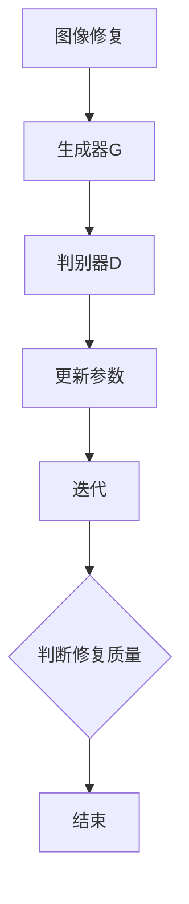

##### 3.1.3.2 文本生成

GAN不仅可以应用于图像生成，还可以应用于文本生成。例如，给定一个单词或短语，GAN可以生成相关的句子或段落。通过训练，生成器能够生成具有逻辑性和连贯性的文本，从而帮助设计师自动生成游戏剧情和角色描述。

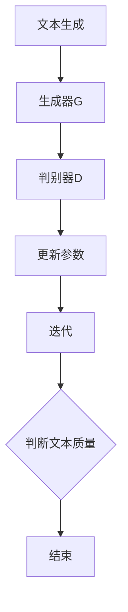

### 3.2 VAE算法原理

变分自编码器（VAE）是一种基于概率模型的生成式算法，它在生成数据和数据压缩方面表现出色。VAE由编码器和解码器两个神经网络组成，通过学习数据分布来生成新数据。

#### 3.2.1 VAE算法的基本原理

VAE的核心思想是学习数据的概率分布，然后通过解码器生成新数据。具体步骤如下：

##### 3.2.1.1 编码器和解码器的定义

编码器（Encoder）：编码器是一个神经网络，它将输入数据（x）编码为一个隐变量（z）和一个解码器参数（解码器）。编码器的目标是学习输入数据的概率分布。

解码器（Decoder）：解码器是一个神经网络，它将隐变量（z）解码回输入数据（x'）。解码器的目标是生成与输入数据相似的新数据。

##### 3.2.1.2 VAE的训练过程

VAE的训练过程分为两个阶段：编码器训练和解码器训练。具体步骤如下：

1. **初始化编码器和解码器**：随机初始化编码器和解码器的参数。
2. **编码器训练**：编码器将输入数据编码为隐变量和解码器参数。通过最大化数据概率分布和重建概率分布之间的平衡，更新编码器的参数。
3. **解码器训练**：解码器将隐变量解码回输入数据。通过最小化输入数据和生成数据之间的差异，更新解码器的参数。
4. **迭代过程**：重复上述步骤，直至编码器和解码器达到一定的训练目标。

#### 3.2.2 VAE的mermaid流程图


#### 3.2.3 VAE的应用案例

##### 3.2.3.1 数据降维

VAE在数据降维方面表现出色，可以将高维数据映射到低维空间，同时保留数据的主要特征。在游戏设计中，VAE可以用于提取游戏角色的关键特征，从而降低数据维度，提高计算效率。

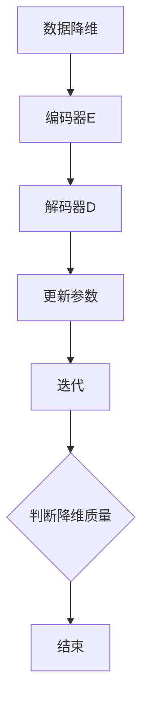

##### 3.2.3.2 生成式文本生成

VAE在生成式文本生成中也具有广泛的应用。例如，给定一个单词或短语，VAE可以生成相关的句子或段落。通过训练，解码器能够生成具有逻辑性和连贯性的文本，从而帮助设计师自动生成游戏剧情和角色描述。

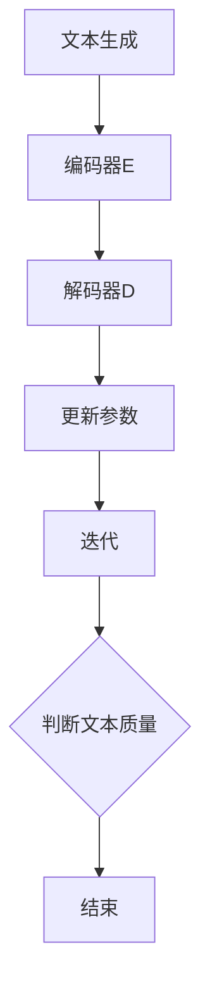

### 3.3 强化学习算法原理

强化学习是一种通过试错和反馈来学习最优策略的方法。在游戏设计中，强化学习可以用于自动生成游戏剧情，优化游戏玩法，提高用户体验。

#### 3.3.1 强化学习算法的基本原理

强化学习的基本原理是智能体通过与环境交互，不断学习最优策略。具体要素如下：

##### 3.3.1.1 强化学习的定义

强化学习是一种基于奖励机制的学习方法。智能体通过执行动作（action）来获取奖励（reward），并通过不断试错来学习最优策略（policy）。

##### 3.3.1.2 强化学习的要素

智能体（Agent）：执行动作并获取奖励的主体。

环境（Environment）：智能体执行动作的背景。

状态（State）：智能体在某一时刻所处的状态。

动作（Action）：智能体可以执行的动作。

奖励（Reward）：智能体执行动作后获得的即时奖励。

策略（Policy）：智能体的行为规则，用于指导智能体选择动作。

##### 3.3.1.3 强化学习的mermaid流程图


#### 3.3.2 强化学习的应用案例

##### 3.3.2.1 游戏AI

强化学习在游戏AI中具有广泛的应用。例如，在《星际争霸》（StarCraft）游戏中，智能体可以通过强化学习学习最佳战术，实现自主游戏。

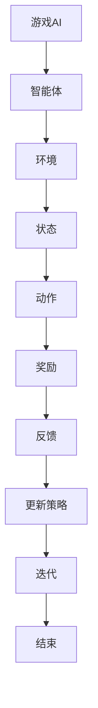

##### 3.3.2.2 机器人控制

强化学习在机器人控制中也具有广泛的应用。例如，机器人可以通过强化学习学习最优路径规划、物体抓取等任务，从而实现自主操作。

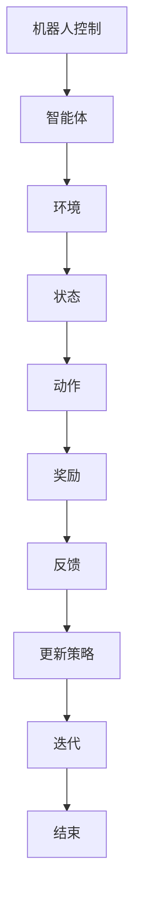

### 3.4 自监督学习算法原理

自监督学习是一种不需要标签数据的学习方法，通过无监督方式自动学习数据的特征和模式。自监督学习在游戏设计中可以用于自动生成角色描述、优化游戏剧情等。

#### 3.4.1 自监督学习算法的基本原理

自监督学习的基本原理是利用数据的内在结构来学习特征表示。具体步骤如下：

##### 3.4.1.1 自监督学习的定义

自监督学习是一种无监督学习方法，它利用数据的自相似性和相关性来学习特征表示。

##### 3.4.1.2 自监督学习的应用场景

自监督学习在多种场景中具有应用价值，如图像分类、语音识别、自然语言处理等。在游戏设计中，自监督学习可以用于生成角色描述、优化游戏剧情等。

#### 3.4.2 自监督学习的mermaid流程图


#### 3.4.3 自监督学习的应用案例

##### 3.4.3.1 图像分类

自监督学习在图像分类中具有广泛的应用。例如，使用自监督学习算法可以自动提取图像特征，从而实现图像分类。

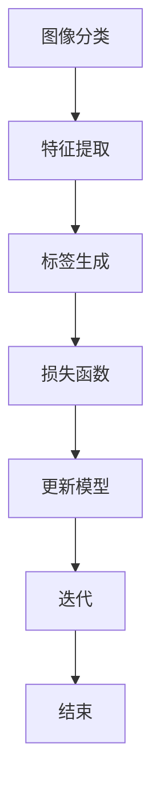

##### 3.4.3.2 自然语言处理

自监督学习在自然语言处理中也具有广泛的应用。例如，使用自监督学习算法可以自动生成文本摘要、翻译等。

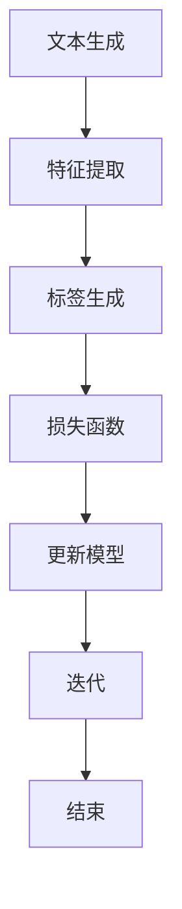

### 3.5 提示词生成算法总结

#### 3.5.1 GAN与VAE的比较

GAN和VAE都是生成式算法，但它们在原理和应用上有所不同。GAN通过对抗性训练生成数据，适用于生成高质量、多样化数据。VAE则通过编码器和解码器学习数据分布，适用于数据降维和生成式文本生成。

#### 3.5.2 强化学习与自监督学习的关系

强化学习和自监督学习都是通过无监督方式学习数据特征和模式。强化学习通过奖励机制学习最优策略，适用于游戏AI和机器人控制。自监督学习通过无监督方式学习特征表示，适用于图像分类、自然语言处理等。

#### 3.5.3 提示词生成算法的选择依据

选择提示词生成算法时，需要考虑以下因素：生成质量、多样性、连贯性和计算成本。根据具体应用场景和需求，选择合适的算法。

### 3.6 本章小结

本章详细介绍了GAN、VAE、强化学习和自监督学习等提示词生成算法的基本原理和应用案例。通过本章的学习，读者可以了解这些算法在游戏设计中的应用，为AI辅助游戏设计提供新的思路和方法。这些算法不仅提高了游戏设计的效率和质量，还为游戏产业的创新和发展带来了新的机遇。在未来，随着人工智能技术的不断进步，AI辅助游戏设计将更加成熟和普及，为游戏开发者带来更多的创作灵感和可能性。

