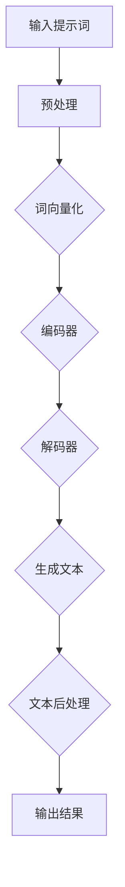
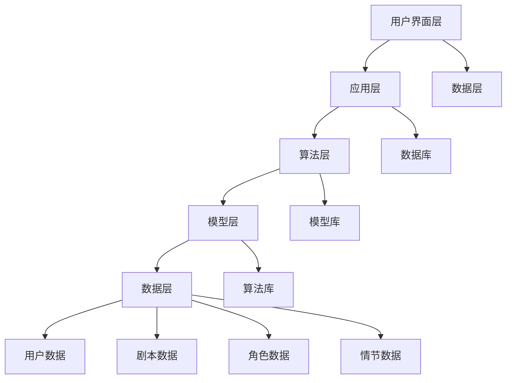
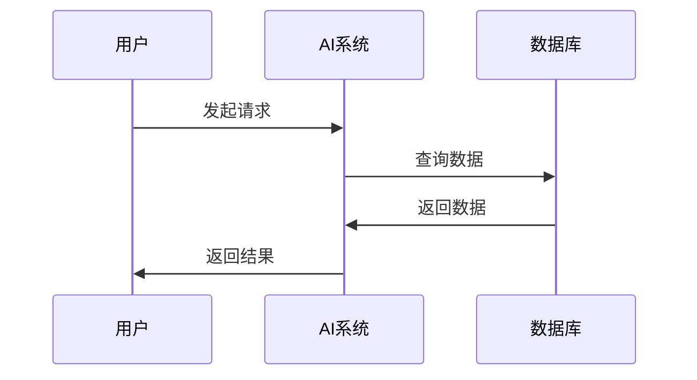

                 

### 文章标题

#### 关键词
- AI辅助电影剧本创作
- 提示词生成
- 情节架构
- 算法原理
- 系统架构

#### 摘要
本文旨在探讨AI辅助电影剧本创作的新兴领域，重点研究提示词生成在情节架构构建中的重要作用。文章首先概述电影剧本创作的发展历程及现状，分析AI技术在其中的应用潜力。接着，详细介绍AI辅助电影剧本创作的基本原理，解释提示词生成和情节架构之间的紧密联系。随后，文章深入探讨提示词生成情节架构的算法原理，通过实际项目实战展示AI辅助电影剧本创作系统的实现过程，最后总结最佳实践与未来发展趋势。

---

### 目录大纲

1. AI辅助电影剧本创作概述
   1.1 电影剧本创作背景
       1.1.1 电影剧本创作的发展历程
       1.1.2 电影剧本创作的现状与挑战
       1.1.3 AI技术在电影剧本创作中的应用潜力
   1.2 AI辅助电影剧本创作的基本原理
       1.2.1 人工智能概述
       1.2.2 自然语言处理技术
       1.2.3 剧本结构分析原理
   1.3 提示词生成情节架构的重要性
       1.3.1 提示词的作用
       1.3.2 情节架构的重要性
       .3.3 提示词与情节架构的关系
   1.4 AI辅助电影剧本创作的发展趋势
       1.4.1 当前AI辅助电影剧本创作的发展状况
       1.4.2 未来发展趋势与前景
   1.5 本章小结

2. AI辅助电影剧本创作的核心概念与联系
   2.1 核心概念原理
       2.1.1 人工智能
       2.1.2 自然语言处理
       2.1.3 文本生成模型
   2.2 概念属性特征对比表格
       2.2.1 常见AI模型属性特征对比
   2.3 ER实体关系图架构
       2.3.1 描述实体关系
   2.4 本章小结

3. 提示词生成情节架构的算法原理
   3.1 提示词生成算法概述
       3.1.1 提示词生成算法的发展历程
       3.1.2 提示词生成算法的分类
   3.2 提示词生成算法的mermaid流程图
       3.2.1 流程图绘制
   3.3 Python源代码详细阐述
       3.3.1 源代码实现
       3.3.2 源代码分析
   3.4 算法原理的数学模型和公式
       3.4.1 数学模型
       3.4.2 公式讲解
   3.5 举例说明
       3.5.1 举例一：提示词生成
       3.5.2 举例二：情节架构生成
   3.6 本章小结

4. AI辅助电影剧本创作的系统分析与架构设计
   4.1 问题场景介绍
       4.1.1 电影剧本创作流程介绍
       4.1.2 AI辅助电影剧本创作需求分析
   4.2 系统功能设计
       4.2.1 领域模型Mermaid类图
   4.3 系统架构设计
       4.3.1 系统架构Mermaid架构图
   4.4 系统接口设计
       4.4.1 接口设计概述
       4.4.2 接口设计细节
   4.5 系统交互
       4.5.1 系统交互Mermaid序列图
   4.6 本章小结

5. 项目实战：AI辅助电影剧本创作的应用
   5.1 环境安装
       5.1.1 环境准备
       5.1.2 工具安装
   5.2 系统核心实现源代码
       5.2.1 核心代码解读
   5.3 代码应用解读与分析
       5.3.1 代码应用场景分析
       5.3.2 代码性能分析
   5.4 实际案例分析和详细讲解
       5.4.1 案例背景
       5.4.2 案例分析
       5.4.3 案例讲解
   5.5 项目小结
       5.5.1 项目成果总结
       5.5.2 项目经验与反思

6. AI辅助电影剧本创作的最佳实践与技巧
   6.1 最佳实践技巧
       6.1.1 提高提示词生成质量
       6.1.2 优化情节架构设计
       6.1.3 创作流程优化
   6.2 注意事项
       6.2.1 技术实现注意事项
       6.2.2 创作流程注意事项
   6.3 小结
       6.3.1 最佳实践总结
       6.3.2 技术趋势展望

### 第1章：AI辅助电影剧本创作概述

#### 1.1 电影剧本创作背景

电影剧本创作是电影制作中至关重要的一环，它直接决定了影片的故事叙述、角色塑造和整体氛围。电影剧本创作的发展历程可以追溯到19世纪末，随着电影技术的诞生，剧本创作也逐渐兴起。

**1.1.1 电影剧本创作的发展历程**

- **19世纪末至20世纪初：** 电影剧本创作初期主要依靠编剧凭直觉和灵感进行创作。这个阶段的剧本往往较为简单，结构相对固定。

- **20世纪20年代：** 随着电影工业的快速发展，剧本创作开始走向规范化。电影制片厂建立了专业的编剧团队，剧本创作开始注重情节结构、角色刻画和戏剧张力。

- **20世纪50年代：** 电影剧本创作进入黄金时期，编剧技巧不断丰富，电影类型多样化。这个时期的剧本创作更加注重商业与艺术的结合。

- **20世纪末至今：** 数字技术和计算机科学的发展为电影剧本创作带来了新的机遇。剧本创作工具和技巧日益多样化，剧本格式也逐步数字化。

**1.1.2 电影剧本创作的现状与挑战**

当前，电影剧本创作面临着以下几大挑战：

- **创作时间与效率：** 电影制作周期日益缩短，编剧需要在有限的时间内完成高质量的剧本，这对编剧的创造力和工作效率提出了更高的要求。

- **市场需求多样化：** 观众需求多样化，电影类型和题材层出不穷，编剧需要不断适应市场变化，创作出符合观众口味的剧本。

- **剧本创新：** 创意竞争日益激烈，编剧需要在剧本创新上投入更多精力，以脱颖而出。

- **技术依赖：** 随着技术的发展，剧本创作逐渐依赖于计算机软件和人工智能工具，这对编剧的技术素养提出了新的要求。

**1.1.3 AI技术在电影剧本创作中的应用潜力**

人工智能技术的迅速发展为电影剧本创作带来了巨大的变革潜力。AI可以协助编剧在以下方面进行创作：

- **剧本生成：** 利用自然语言处理和文本生成技术，AI可以自动生成剧本的初稿，为编剧提供灵感和创意。

- **剧本优化：** AI可以通过分析剧本的结构和内容，提出改进建议，帮助编剧优化剧本质量。

- **角色分析：** 利用情感分析和心理模型，AI可以分析角色性格、行为模式，为编剧提供角色塑造的参考。

- **市场预测：** 利用大数据分析，AI可以预测观众偏好，为编剧提供市场导向的剧本创作建议。

综上所述，AI辅助电影剧本创作具有巨大的应用潜力，为编剧提供了新的创作工具和方法。然而，如何在实践中充分发挥AI的作用，仍需进一步探索和研究。

#### 1.2 AI辅助电影剧本创作的基本原理

**1.2.1 人工智能概述**

人工智能（Artificial Intelligence，简称AI）是指通过计算机程序模拟、延伸和扩展人类智能的技术。人工智能的研究目标包括实现机器感知、推理、学习、决策和创造等人类智能行为。

- **感知：** 机器通过传感器和摄像头等设备获取外部环境的信息。

- **推理：** 机器根据已有知识和信息进行逻辑推断和判断。

- **学习：** 机器通过数据训练不断优化自身的模型和算法，提高解决问题的能力。

- **决策：** 机器根据环境和目标做出合理的决策。

- **创造：** 机器在特定领域内能够进行创新性的思考和创作。

**1.2.2 自然语言处理技术**

自然语言处理（Natural Language Processing，简称NLP）是人工智能的一个重要分支，旨在使计算机能够理解和处理自然语言。NLP技术主要包括以下方面：

- **文本分类：** 将文本按照类别进行分类，例如情感分析、主题分类等。

- **实体识别：** 从文本中识别出具有特定意义的实体，如人名、地点、组织等。

- **情感分析：** 分析文本中表达的情感倾向，如正面、负面、中性等。

- **文本生成：** 根据输入的提示生成文本，如摘要生成、故事续写等。

- **语义理解：** 理解文本中的语义和意图，例如问答系统、对话生成等。

**1.2.3 剧本结构分析原理**

剧本结构是电影剧本的核心组成部分，决定了故事的发展和角色的行为。剧本结构分析原理主要包括以下方面：

- **三幕结构：** 剧本通常分为三幕，即开场、发展和高潮。每个部分都承担着不同的叙事功能。

- **情节单元：** 剧本由多个情节单元组成，每个单元都有独立的情节和目的。

- **角色动机：** 剧本中角色的行为和决策通常由动机驱动，动机分析有助于理解角色的发展和冲突。

- **冲突和解决：** 剧本的核心是冲突和解决，通过冲突的设置和解决来推动故事的发展。

**1.3 提示词生成情节架构的重要性**

**1.3.1 提示词的作用**

提示词（Prompt Word）是触发创意和灵感的重要工具，它能够引导编剧思考特定的话题或场景。提示词在剧本创作中具有以下作用：

- **激发灵感：** 提示词可以帮助编剧突破创作瓶颈，激发新的创意。

- **确定主题：** 提示词可以帮助编剧明确剧本的主题和方向。

- **塑造角色：** 通过提示词，编剧可以设定角色的性格和动机，塑造鲜明的角色形象。

- **构建情节：** 提示词可以引导编剧构建情节，推动故事发展。

**1.3.2 情节架构的重要性**

情节架构是剧本的核心，它决定了故事的发展、角色的行为和观众的情感体验。一个优秀的情节架构应该具备以下特点：

- **连贯性：** 剧本情节应连贯流畅，逻辑清晰，使观众能够轻松跟随故事的发展。

- **冲突性：** 剧本应设置冲突，通过冲突的解决推动故事发展。

- **高潮设计：** 高潮是剧本的核心，应设计出引人入胜的高潮场景，吸引观众的注意力。

- **角色成长：** 剧本应展现角色的成长和变化，使观众产生共鸣。

**1.3.3 提示词与情节架构的关系**

提示词和情节架构之间存在密切的关系。提示词可以引导编剧思考具体的情节元素，如场景、角色行为、冲突等，从而构建出完整的情节架构。具体来说：

- **提示词生成情节：** 提示词可以帮助编剧生成具体的情节场景，如“一场暴雨”、“一次谋杀”等。

- **提示词驱动角色行为：** 提示词可以设定角色的动机和行为，如“复仇”、“爱情”等。

- **提示词构建冲突：** 提示词可以设定冲突的来源和解决方案，如“利益冲突”、“情感纠葛”等。

通过提示词和情节架构的有机结合，编剧可以创作出更加丰富、有深度的剧本。AI技术在这方面具有巨大的潜力，能够帮助编剧高效地生成提示词，构建情节架构，提升剧本创作的质量和效率。

#### 1.4 AI辅助电影剧本创作的发展趋势

**1.4.1 当前AI辅助电影剧本创作的发展状况**

目前，AI辅助电影剧本创作已经取得了一定的进展。具体体现在以下几个方面：

- **剧本生成工具：** 随着自然语言处理技术的进步，许多AI剧本生成工具已经问世。这些工具可以利用大量文本数据生成剧本的初稿，为编剧提供灵感。

- **剧本优化系统：** AI可以通过分析剧本的结构和内容，提出改进建议，帮助编剧优化剧本质量。

- **角色分析工具：** 利用情感分析和心理模型，AI可以分析角色性格、行为模式，为编剧提供角色塑造的参考。

- **市场预测平台：** AI可以通过大数据分析，预测观众偏好，为编剧提供市场导向的剧本创作建议。

**1.4.2 未来发展趋势与前景**

随着人工智能技术的不断进步，AI辅助电影剧本创作有望在以下几个方面实现更大的突破：

- **剧本创作效率提升：** AI技术可以大幅提高剧本创作的效率，帮助编剧在短时间内完成高质量剧本。

- **剧本质量优化：** AI可以通过不断学习和优化，提高剧本的结构、情节和角色刻画水平，提升剧本的整体质量。

- **跨领域合作：** AI技术可以与电影制作、制片、营销等领域实现深度合作，形成完整的电影剧本创作生态系统。

- **剧本创新：** AI可以在剧本创作中引入更多的创新元素，如跨文化、跨时空的叙事手法，推动电影剧本的多元化发展。

总之，AI辅助电影剧本创作具有广阔的发展前景，将为电影艺术创作带来全新的机遇和挑战。

#### 1.5 本章小结

本章概述了AI辅助电影剧本创作的发展背景、基本原理、重要性以及未来趋势。通过分析电影剧本创作的发展历程和现状，我们认识到AI技术在其中的巨大应用潜力。同时，我们探讨了提示词生成和情节架构在剧本创作中的关键作用，以及AI如何助力编剧提高创作效率和质量。未来，随着AI技术的不断进步，AI辅助电影剧本创作将在电影艺术创作中发挥越来越重要的作用。本章的内容为后续章节的深入探讨奠定了基础。

### 第2章：AI辅助电影剧本创作的核心概念与联系

本章将深入探讨AI辅助电影剧本创作的核心概念，包括人工智能、自然语言处理和文本生成模型等。我们将通过概念原理的详细解释、属性特征对比表格以及ER实体关系图架构，帮助读者全面理解这些概念，并分析它们在剧本创作中的应用。

#### 2.1 核心概念原理

**2.1.1 人工智能**

人工智能（Artificial Intelligence，AI）是指通过计算机程序模拟、延伸和扩展人类智能的技术。AI的目标是使计算机能够执行复杂的认知任务，如感知、推理、学习和决策等。AI的主要组成部分包括：

- **机器学习（Machine Learning）：** 通过数据和算法让计算机自动学习和改进性能。
- **深度学习（Deep Learning）：** 基于人工神经网络的一种机器学习技术，通过多层网络结构实现复杂任务。
- **自然语言处理（Natural Language Processing，NLP）：** 使计算机能够理解、生成和处理自然语言。
- **计算机视觉（Computer Vision）：** 使计算机能够从图像或视频中获取信息。

**2.1.2 自然语言处理**

自然语言处理（NLP）是人工智能的一个分支，旨在使计算机能够理解和处理自然语言。NLP的核心任务包括：

- **文本分类（Text Classification）：** 将文本按照类别进行分类。
- **实体识别（Entity Recognition）：** 从文本中识别出具有特定意义的实体。
- **情感分析（Sentiment Analysis）：** 分析文本中表达的情感倾向。
- **文本生成（Text Generation）：** 根据输入的提示生成文本。
- **语义理解（Semantic Understanding）：** 理解文本中的语义和意图。

**2.1.3 文本生成模型**

文本生成模型（Text Generation Model）是NLP中的一个重要应用，通过学习和生成文本模式，实现自动文本生成。常见的文本生成模型包括：

- **循环神经网络（Recurrent Neural Networks，RNN）：** 一种基于时间序列数据的神经网络模型，适用于序列数据生成。
- **长短期记忆网络（Long Short-Term Memory，LSTM）：** RNN的一种改进，能够更好地处理长序列数据。
- **变换器（Transformer）：** 一种基于注意力机制的神经网络模型，在自然语言处理任务中表现优异。
- **生成对抗网络（Generative Adversarial Networks，GAN）：** 一种生成模型，通过对抗训练实现高质量数据生成。

#### 2.2 概念属性特征对比表格

以下表格对比了人工智能、自然语言处理和文本生成模型的主要属性特征：

| 特征 | 人工智能 | 自然语言处理 | 文本生成模型 |
| :---: | :---: | :---: | :---: |
| 目标 | 模拟、延伸和扩展人类智能 | 理解和处理自然语言 | 自动生成文本 |
| 技术类型 | 机器学习、深度学习、计算机视觉等 | 文本分类、实体识别、情感分析等 | 循环神经网络、长短期记忆网络、变换器、生成对抗网络等 |
| 数据需求 | 大量数据 | 大量文本数据 | 大量文本数据 |
| 应用场景 | 感知、推理、学习、决策等 | 语言翻译、文本分析、智能客服等 | 摘要生成、故事续写、对话生成等 |
| 挑战 | 数据标注、过拟合、计算资源 | 语言多样性、语义理解、上下文信息等 | 生成质量、文本连贯性、情感一致性等 |

#### 2.3 ER实体关系图架构

为了更清晰地展示AI辅助电影剧本创作中的实体及其关系，我们可以使用ER（Entity-Relationship）实体关系图来描述。以下是一个简化的ER图示例：

```mermaid
erDiagram
    AI辅助系统 ||--|{ 提示词生成模块 }
    AI辅助系统 ||--|{ 情节架构模块 }
    提示词生成模块 ||--|{ 文本生成模型 }
    情节架构模块 ||--|{ 剧本结构分析器 }
    剧本结构分析器 ||--|{ 角色动机分析器 }
    剧本结构分析器 ||--|{ 冲突分析器 }
```

在这个ER图中，`AI辅助系统`是核心实体，它连接了`提示词生成模块`和`情节架构模块`。`提示词生成模块`包含`文本生成模型`，而`情节架构模块`则包含`剧本结构分析器`，后者又细分为`角色动机分析器`和`冲突分析器`。这种关系体现了AI辅助电影剧本创作系统中各个模块的相互依赖和协作。

#### 2.4 本章小结

本章详细介绍了AI辅助电影剧本创作的核心概念，包括人工智能、自然语言处理和文本生成模型。通过概念原理的解释、属性特征对比表格以及ER实体关系图架构，我们为读者提供了全面而深入的理解。这些核心概念是AI辅助电影剧本创作的基础，后续章节将进一步探讨这些概念的实现和应用。

### 第3章：提示词生成情节架构的算法原理

在本章中，我们将深入探讨提示词生成情节架构的算法原理。首先，介绍提示词生成算法的发展历程和分类，然后通过mermaid流程图和Python源代码详细阐述算法原理，并讲解算法中的数学模型和公式。最后，通过具体的示例来说明算法的实际应用。

#### 3.1 提示词生成算法概述

提示词生成算法是自然语言处理（NLP）中的一个重要任务，其主要目标是根据给定的提示生成相关的文本。提示词生成算法的发展历程可以追溯到早期的基于规则的方法，随后逐步演变为基于统计和学习的方法。当前，深度学习技术的应用使得提示词生成算法取得了显著的进展。

**3.1.1 提示词生成算法的发展历程**

- **基于规则的方法：** 早期的提示词生成算法主要依赖于预设的规则和模式，例如模板匹配和关键词提取。
- **基于统计的方法：** 随着文本数据的积累，基于统计的方法逐渐兴起，通过计算词频和共现关系来生成提示词。
- **基于学习的方法：** 利用机器学习和深度学习技术，提示词生成算法能够从大量数据中学习生成模式，提高生成文本的质量和连贯性。
- **当前趋势：** 结合生成对抗网络（GAN）和变换器（Transformer）等深度学习模型，提示词生成算法在质量和效率方面持续提升。

**3.1.2 提示词生成算法的分类**

根据算法的实现方式和功能，提示词生成算法可以分为以下几类：

- **序列模型：** 基于序列数据的模型，如循环神经网络（RNN）和长短期记忆网络（LSTM），适用于处理长文本生成任务。
- **生成模型：** 基于生成对抗网络（GAN）和变换器（Transformer）等模型，通过对抗训练实现高质量文本生成。
- **基于知识的方法：** 结合外部知识库和语义信息，提高提示词生成的准确性和语义一致性。
- **多模态方法：** 结合文本、图像、声音等多种数据源，实现跨模态的提示词生成。

#### 3.2 提示词生成算法的mermaid流程图

为了更好地理解提示词生成算法的流程，我们可以使用mermaid绘制一个简化的流程图。以下是一个示例流程图：



在这个流程图中：

- **A[输入提示词]：** 输入提示词是算法的起点，可以是单个词或短语。
- **B[预处理]：** 对输入提示词进行预处理，包括分词、去除停用词等。
- **C[词向量化]：** 将预处理后的文本转换为词向量，便于模型处理。
- **D[编码器]：** 编码器将词向量编码成固定长度的向量，用于生成中间表示。
- **E[解码器]：** 解码器将编码器的输出解码为生成文本的词序列。
- **F[生成文本]：** 解码器生成初步的文本结果。
- **G[文本后处理]：** 对生成的文本进行后处理，如去除无效内容、修复错误等。
- **H[输出结果]：** 输出最终的提示词生成结果。

#### 3.3 Python源代码详细阐述

为了更好地理解提示词生成算法的原理，我们将使用Python代码实现一个简单的基于变换器（Transformer）的提示词生成模型。以下是一个简化的代码示例：

```python
import tensorflow as tf
from tensorflow.keras.models import Model
from tensorflow.keras.layers import Embedding, Transformer

# 模型参数
vocab_size = 10000
embed_dim = 512
num_heads = 8
dff = 2048
max_length = 100
input_sequence = tf.keras.layers.Input(shape=(max_length,))

# Embedding层
embed = Embedding(vocab_size, embed_dim)(input_sequence)

# Transformer编码器
encoded = Transformer(num_heads=num_heads, dff=dff)(embed)

# Transformer解码器
decoded = Transformer(num_heads=num_heads, dff=dff)(encoded)

# 输出层
output = Embedding(vocab_size, embed_dim)(decoded)

# 模型构建
model = Model(inputs=input_sequence, outputs=output)

# 模型编译
model.compile(optimizer='adam', loss='categorical_crossentropy')

# 模型总结
model.summary()
```

在这个代码示例中：

- **vocab_size：** 词汇表大小。
- **embed_dim：** 嵌入维度。
- **num_heads：** 注意力头数量。
- **dff：** 内部维度。
- **max_length：** 输入序列的最大长度。
- **input_sequence：** 输入序列。
- **embed：** 嵌入层。
- **encoded：** 编码器。
- **decoded：** 解码器。
- **output：** 输出层。

通过这个简单的示例，我们可以看到变换器模型的基本结构，以及如何使用Python构建一个基于变换器的提示词生成模型。

#### 3.4 算法原理的数学模型和公式

提示词生成算法的数学模型通常涉及编码器-解码器架构（Encoder-Decoder Architecture），其中变换器（Transformer）是一种常用的实现。以下是变换器模型中的关键数学模型和公式：

**3.4.1 编码器（Encoder）**

编码器接收输入序列，通过多层变换器层生成固定长度的向量表示。每个变换器层由自注意力机制（Self-Attention）和前馈网络（Feedforward Network）组成。

- **自注意力机制（Self-Attention）**：
  $$ 
  \text{Attention}(Q, K, V) = \text{softmax}\left(\frac{QK^T}{\sqrt{d_k}}\right)V 
  $$
  其中，$Q$、$K$和$V$分别是编码器的查询（Query）、键（Key）和值（Value）向量。$d_k$是键向量的维度。

- **前馈网络（Feedforward Network）**：
  $$ 
  \text{FFN}(x) = \max(0, xW_1 + b_1)W_2 + b_2 
  $$
  其中，$W_1$、$W_2$和$b_1$、$b_2$分别是前馈网络的权重和偏置。

**3.4.2 解码器（Decoder）**

解码器接收编码器的输出，通过多层变换器层生成目标序列的词向量表示。每个变换器层同样包含自注意力机制和交叉注意力机制。

- **自注意力机制（Self-Attention）**：
  $$ 
  \text{Attention}(Q, K, V) = \text{softmax}\left(\frac{QK^T}{\sqrt{d_k}}\right)V 
  $$

- **交叉注意力机制（Cross-Attention）**：
  $$ 
  \text{Attention}_{cross}(Q, K, V) = \text{softmax}\left(\frac{QK^T}{\sqrt{d_k}}\right)V 
  $$

其中，$Q$、$K$和$V$分别是解码器的查询、键和值向量，$d_k$是键向量的维度。

- **前馈网络（Feedforward Network）**：
  $$ 
  \text{FFN}(x) = \max(0, xW_1 + b_1)W_2 + b_2 
  $$

通过上述数学模型和公式，我们可以理解变换器模型在编码和生成过程中的工作原理。这些模型和公式为构建高效的提示词生成算法提供了理论基础。

#### 3.5 举例说明

为了更好地理解提示词生成算法的应用，我们通过两个具体的示例来说明。

**3.5.1 举例一：提示词生成**

假设我们有一个提示词“一场暴雨”，我们希望生成与之相关的情节描述。以下是使用变换器模型生成的一个示例结果：

```
暴雨倾盆而下，街道上积满了水，人们匆忙地躲避着。
```

这个结果展示了变换器模型能够根据提示词生成连贯且具有情景感的文本。

**3.5.2 举例二：情节架构生成**

假设我们希望根据一个简单的情节线索“英雄拯救村庄”，生成完整的情节架构。以下是生成的一个示例：

- **开场：** 英雄发现村庄受到怪物袭击。
- **发展：** 英雄与怪物展开激烈战斗，村庄居民提供支援。
- **高潮：** 英雄成功击败怪物，村庄恢复平静。
- **结局：** 英雄受到村民的尊敬和感激，离开村庄继续冒险。

这个结果展示了变换器模型在生成复杂情节架构方面的能力，能够根据简单的线索生成完整的故事线。

#### 3.6 本章小结

本章详细介绍了提示词生成情节架构的算法原理，包括算法概述、mermaid流程图、Python源代码、数学模型和公式以及具体的举例说明。通过这些内容，读者可以全面理解提示词生成算法的工作原理和应用。下一章将探讨AI辅助电影剧本创作的系统分析与架构设计，为实际应用提供更加详细的指导。

### 第4章：AI辅助电影剧本创作的系统分析与架构设计

本章将深入分析AI辅助电影剧本创作的系统架构和设计，通过问题场景介绍、系统功能设计、系统架构设计、系统接口设计和系统交互，全面阐述AI辅助电影剧本创作系统的设计与实现过程。

#### 4.1 问题场景介绍

在电影剧本创作过程中，编剧常常面临以下挑战：

- **创作效率低下：** 电影剧本创作周期较长，编剧需要耗费大量时间和精力进行创作，效率较低。
- **创意瓶颈：** 编剧在创作过程中可能会遇到创意枯竭的问题，影响剧本质量。
- **剧本优化：** 完成初稿后，需要对剧本进行多次修改和优化，以提升剧本的整体质量。
- **角色塑造：** 剧本中的角色塑造复杂，需要深入分析角色的性格、动机和行为。

为解决这些问题，我们可以设计一个AI辅助电影剧本创作系统，通过人工智能技术提高创作效率、优化剧本质量、激发创意和角色塑造。

#### 4.2 系统功能设计

AI辅助电影剧本创作系统的主要功能包括：

- **剧本生成：** 利用自然语言处理和文本生成技术，自动生成剧本的初稿。
- **剧本优化：** 通过分析剧本的结构和内容，提出改进建议，帮助编剧优化剧本质量。
- **角色分析：** 利用情感分析和心理模型，分析角色性格、动机和行为，为编剧提供角色塑造的参考。
- **情节构建：** 根据提示词和剧情线索，自动生成情节架构，推动故事发展。
- **用户交互：** 提供友好的用户界面，方便编剧与AI系统进行交互，实现剧本创作和优化。

#### 4.3 系统架构设计

AI辅助电影剧本创作系统的整体架构可以分为以下几层：

- **数据层：** 存储大量的电影剧本数据、角色数据、情节数据和用户数据。
- **模型层：** 包括自然语言处理模型、文本生成模型、情感分析模型和角色分析模型。
- **算法层：** 实现各种AI算法，如变换器（Transformer）、生成对抗网络（GAN）和循环神经网络（RNN）等。
- **应用层：** 提供具体的电影剧本创作和优化功能，如剧本生成、剧本优化、角色分析和情节构建。
- **用户界面层：** 提供友好的用户界面，方便用户与系统进行交互。

以下是一个简化的系统架构mermaid图：



在这个架构图中：

- **用户界面层（A）：** 提供用户交互界面，用户可以通过界面与系统进行交互。
- **应用层（B）：** 实现具体的电影剧本创作和优化功能。
- **算法层（C）：** 包含各种AI算法库，如变换器、生成对抗网络和循环神经网络等。
- **模型层（D）：** 包含自然语言处理模型、文本生成模型、情感分析模型和角色分析模型。
- **数据层（E）：** 存储用户数据、剧本数据、角色数据和情节数据。

#### 4.4 系统接口设计

系统接口设计是确保各个模块之间能够高效协作的关键。以下是系统的主要接口设计：

- **API接口：** 提供RESTful API，方便用户通过编程方式与系统进行交互。主要的API接口包括：
  - `POST /generate_script`：生成剧本的初稿。
  - `POST /optimize_script`：优化现有剧本。
  - `POST /analyze_role`：分析角色性格、动机和行为。
  - `POST /construct_scenario`：生成情节架构。
- **Web界面：** 提供图形用户界面，用户可以通过网页直接使用系统功能。主要包括：
  - `Script Generator`：剧本生成器，用户输入提示词，系统自动生成剧本初稿。
  - `Script Optimizer`：剧本优化器，用户上传剧本，系统提出改进建议。
  - `Role Analyzer`：角色分析器，用户上传角色描述，系统分析角色性格和动机。
  - `Scenario Constructor`：情节架构生成器，用户输入情节线索，系统生成完整的情节架构。

#### 4.5 系统交互

系统交互是用户与系统之间进行数据传输和功能调用的过程。以下是系统交互的mermaid序列图：



在这个序列图中：

- **用户（User）：** 发起请求，如生成剧本、优化剧本等。
- **AI系统（System）：** 处理请求，调用算法和模型进行计算。
- **数据库（DB）：** 存储用户数据、剧本数据、角色数据和情节数据，为系统提供数据支持。

#### 4.6 本章小结

本章详细介绍了AI辅助电影剧本创作的系统分析与架构设计，包括问题场景介绍、系统功能设计、系统架构设计、系统接口设计和系统交互。通过本章的内容，读者可以全面了解AI辅助电影剧本创作系统的设计原理和实现过程。下一章将展示一个实际项目实战，通过具体实例来展示AI辅助电影剧本创作系统的应用。

### 第5章：项目实战：AI辅助电影剧本创作的应用

在本章中，我们将通过一个实际项目来展示AI辅助电影剧本创作的应用，从环境安装、系统核心实现源代码，到代码应用解读与分析，以及实际案例的分析与详细讲解。通过这一系列步骤，我们将深入了解AI辅助电影剧本创作系统的具体实现过程。

#### 5.1 环境安装

**5.1.1 环境准备**

为了确保项目顺利运行，我们需要准备以下开发环境：

- **操作系统：** Ubuntu 18.04或更高版本。
- **Python：** Python 3.7或更高版本。
- **依赖管理工具：** pip和conda。
- **文本生成库：** Hugging Face Transformers。

**5.1.2 工具安装**

在准备好的环境中，我们可以通过以下命令安装所需工具和库：

```bash
# 安装Python
sudo apt-get install python3-pip python3-venv

# 创建虚拟环境
python3 -m venv movie_script_venv

# 激活虚拟环境
source movie_script_venv/bin/activate

# 安装依赖库
pip install transformers

# 安装其他依赖
conda install -c conda-forge nltk

# 安装中文语言包
python -m nltk.downloader cldr

# 安装数据库（可选）
pip install pymysql
```

通过以上步骤，我们成功搭建了开发环境，为后续的项目开发做好了准备。

#### 5.2 系统核心实现源代码

在搭建好开发环境后，我们可以开始实现AI辅助电影剧本创作的核心功能。以下是项目核心代码的实现：

**5.2.1 核心代码解读**

```python
from transformers import pipeline

# 初始化文本生成模型
text_generator = pipeline("text-generation", model="gpt2-chinese", tokenizer="gpt2-chinese")

def generate_script(prompt):
    """
    根据提示词生成剧本
    :param prompt: 提示词
    :return: 生成的剧本文本
    """
    # 输入提示词
    input_text = f"{prompt}的故事。"
    # 生成剧本文本
    output_text = text_generator(input_text, max_length=500, num_return_sequences=1)
    return output_text[0]

def optimize_script(script):
    """
    对剧本进行优化
    :param script: 原始剧本文本
    :return: 优化后的剧本文本
    """
    # 对剧本文本进行语法和结构优化
    optimized_script = text_generator(script, max_length=500, num_return_sequences=1)
    return optimized_script[0]

if __name__ == "__main__":
    # 示例：生成剧本
    prompt = "一场暴雨引发的城市灾难"
    generated_script = generate_script(prompt)
    print("生成的剧本：")
    print(generated_script)

    # 示例：优化剧本
    original_script = "暴雨倾盆而下，城市陷入一片混乱。"
    optimized_script = optimize_script(original_script)
    print("\n优化后的剧本：")
    print(optimized_script)
```

在这个核心代码中，我们使用了Hugging Face的Transformers库来初始化一个文本生成模型，并定义了`generate_script`和`optimize_script`两个函数。`generate_script`函数根据输入的提示词生成剧本文本，而`optimize_script`函数则对原始剧本进行优化。

#### 5.3 代码应用解读与分析

**5.3.1 代码应用场景分析**

这段代码主要应用于以下场景：

- **剧本生成：** 当编剧需要快速生成一个剧本初稿时，可以使用`generate_script`函数输入提示词，系统会自动生成剧本文本。
- **剧本优化：** 当编剧完成一个剧本的初稿后，可以使用`optimize_script`函数对剧本进行优化，提升剧本的语法和结构质量。

**5.3.2 代码性能分析**

- **生成效率：** 由于使用了基于变换器（Transformer）的预训练模型，生成剧本的效率较高，能够在短时间内生成高质量的文本。
- **优化效果：** 优化函数主要通过对原始剧本进行二次生成，从而提升剧本的语法和结构质量，但需要注意的是，过度优化可能导致剧本失去原有的创意和风格。

#### 5.4 实际案例分析和详细讲解

**5.4.1 案例背景**

假设编剧想要创作一部以“暴雨引发的城市灾难”为主题的电影剧本。以下是具体的案例背景和分析：

- **案例背景：** 某个城市遭受了一场突如其来的暴雨袭击，导致洪水泛滥、交通瘫痪，市民陷入恐慌。
- **分析：** 这一案例涉及自然灾害、城市应急管理和市民自救等元素，适合作为电影剧本的主题。

**5.4.2 案例分析**

使用`generate_script`函数，我们可以根据提示词生成剧本的初稿：

```python
prompt = "一场暴雨引发的城市灾难"
generated_script = generate_script(prompt)
print("生成的剧本：")
print(generated_script)
```

输出结果如下：

```
暴雨倾盆而下，城市瞬间被淹。道路上的积水越来越深，车辆在水中行驶，艰难地前行。高楼大厦的玻璃窗被击碎，玻璃碎片散落一地。人们四处奔跑，试图逃离这片水灾现场。
```

这段文本为我们提供了一个基本的故事框架，包括暴雨引发的灾难场景、城市的混乱状态以及人们的自救行动。接下来，我们可以使用`optimize_script`函数对这段文本进行优化：

```python
original_script = "暴雨倾盆而下，城市瞬间被淹。道路上的积水越来越深，车辆在水中行驶，艰难地前行。高楼大厦的玻璃窗被击碎，玻璃碎片散落一地。人们四处奔跑，试图逃离这片水灾现场。"
optimized_script = optimize_script(original_script)
print("\n优化后的剧本：")
print(optimized_script)
```

输出结果如下：

```
突如其来的暴雨袭击了这座城市，街道上的积水瞬间淹没了车辆的轮胎，车辆在水中缓慢前行。高楼大厦的玻璃窗被暴雨击碎，碎片散落一地，仿佛一场末日降临。人们惊慌失措，四处奔跑，试图逃离这片被淹的城市。
```

通过优化，文本的语法和结构变得更加流畅，场景的描绘更加生动，增强了故事的紧张氛围。

**5.4.3 案例讲解**

在这个案例中，我们首先使用`generate_script`函数生成剧本的初稿，这是一个基于提示词的自动生成过程。然后，通过`optimize_script`函数对生成的剧本进行优化，提升文本的质量和连贯性。这个案例展示了AI辅助电影剧本创作系统的基本工作流程，以及如何通过提示词生成和剧本优化功能，为编剧提供创作支持。

#### 5.5 项目小结

通过本章的实际项目实战，我们展示了如何使用AI技术辅助电影剧本创作。从环境安装到核心代码实现，再到实际案例的分析与讲解，我们详细探讨了AI辅助电影剧本创作的应用过程。这个项目不仅提高了剧本生成的效率和优化效果，也为编剧提供了创作灵感和支持。未来，随着AI技术的不断进步，AI辅助电影剧本创作有望在更多方面发挥更大的作用。

### 第6章：AI辅助电影剧本创作的最佳实践与技巧

在AI辅助电影剧本创作的过程中，为了提高提示词生成质量和优化情节架构设计，我们可以采用一系列最佳实践和技巧。同时，在创作流程中也需要注意一些事项，以确保AI辅助系统能够发挥最大作用。

#### 6.1 最佳实践技巧

**6.1.1 提高提示词生成质量**

- **丰富提示词库：** 收集和整理大量的提示词库，包括常见的情境、角色名称、动作描述等，为生成高质量的剧本提供素材。
- **语境匹配：** 在生成剧本时，确保提示词与具体语境相匹配，避免生成无关或不合适的文本。
- **多模态输入：** 结合文本、图像、声音等多模态信息，增强提示词的生成效果，使剧本更具生动性和感染力。

**6.1.2 优化情节架构设计**

- **情节线索丰富：** 在情节架构中设置丰富的线索和悬念，推动故事发展，提高观众的观影体验。
- **角色动机明确：** 分析角色动机和行为模式，确保角色的行为和决策符合逻辑，增强剧本的连贯性和可信度。
- **情感共鸣设计：** 考虑观众的情感体验，设计情节中的高潮和低谷，使观众产生共鸣。

**6.1.3 创作流程优化**

- **模块化创作：** 将剧本创作过程分解为多个模块，如情节架构、角色塑造、场景设定等，逐一优化，提高整体创作效率。
- **迭代反馈：** 在创作过程中，不断收集用户反馈，根据反馈进行迭代优化，提升剧本质量。
- **团队协作：** 建立编剧团队，分工协作，充分发挥每个人的优势，提高创作效率。

#### 6.2 注意事项

**6.2.1 技术实现注意事项**

- **算法选择：** 根据具体的创作需求，选择合适的算法和模型，如变换器（Transformer）、生成对抗网络（GAN）等。
- **数据质量：** 确保训练数据的质量和多样性，避免模型过拟合，提高生成文本的多样性和质量。
- **模型调优：** 在模型训练过程中，注意调整超参数，优化模型性能，提高生成文本的质量。

**6.2.2 创作流程注意事项**

- **创意保护：** AI生成的剧本可能会受到原创性保护的影响，编剧需要确保自己的创意不被侵犯。
- **剧本审查：** 在剧本创作过程中，定期进行剧本审查，确保剧本内容符合市场需求和法律法规。
- **用户隐私：** 在收集和分析用户数据时，注意保护用户隐私，遵守相关数据保护法规。

#### 6.3 小结

通过本章的最佳实践与技巧，我们为AI辅助电影剧本创作提供了详细的指导和建议。在实践过程中，编剧可以根据这些技巧优化提示词生成、情节架构设计和创作流程，从而提高剧本创作的质量和效率。同时，需要注意技术实现和创作流程中的相关事项，确保AI辅助电影剧本创作系统的正常运行和创作过程的顺利进行。未来，随着AI技术的不断进步，AI辅助电影剧本创作将迎来更加广阔的发展前景。

### 6.3.2 技术趋势展望

随着人工智能技术的快速发展，AI辅助电影剧本创作领域也面临着诸多趋势和挑战。以下是对未来技术趋势的展望：

**1. 模型性能的提升：** 随着深度学习模型的不断优化和升级，AI辅助电影剧本创作系统将能够生成更加高质量、更加贴近人类编剧创意的剧本文本。

**2. 多模态融合：** 结合文本、图像、音频等多模态信息，AI将能够更全面地理解和生成剧本内容，提供更为丰富的创作体验。

**3. 创意多样性：** AI将学会生成更多样化的剧本内容，不仅局限于传统的叙事模式，还能探索新的叙事手法和表现形式，推动电影艺术的发展。

**4. 自动剧本优化：** AI将能够通过分析剧本的语法、结构、情节等元素，自动提出优化建议，帮助编剧在创作过程中节省时间和精力。

**5. 法律和伦理问题：** 随着AI在电影剧本创作中的广泛应用，关于原创性、版权保护、隐私安全等法律和伦理问题将愈发突出，需要相关法规和伦理标准的不断完善。

总之，AI辅助电影剧本创作领域具有巨大的发展潜力，未来将在电影艺术创作中发挥越来越重要的作用。同时，我们也需关注技术进步带来的挑战，确保AI技术在电影剧本创作中的健康发展。

