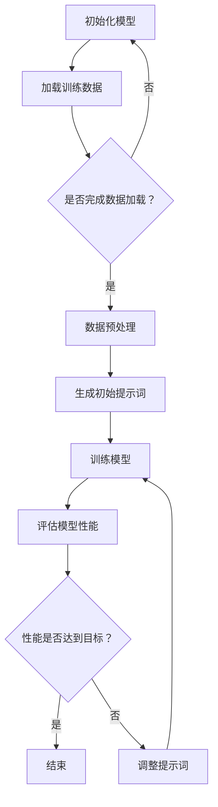
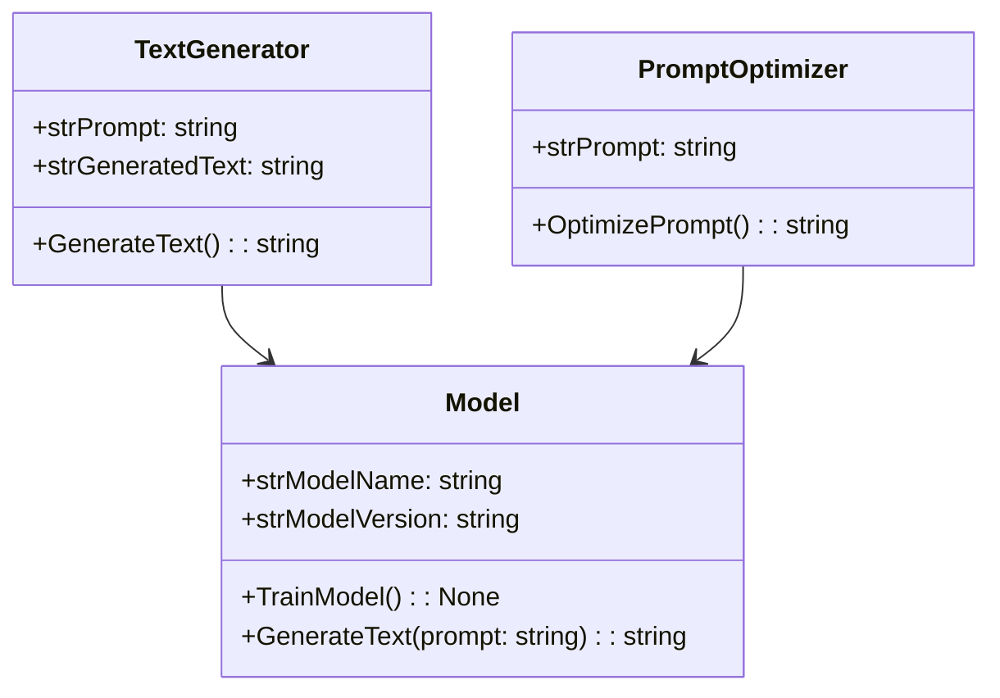
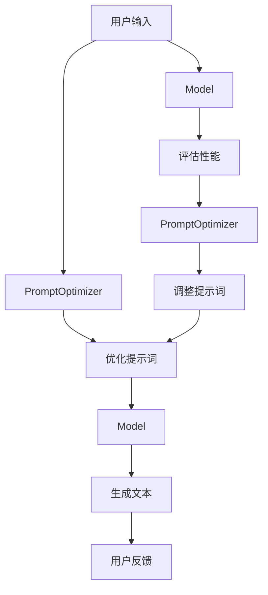
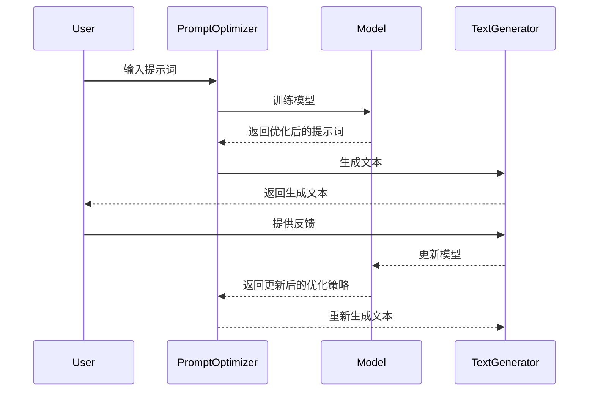

                 

# AI辅助的提示词优化与调优

> 关键词：人工智能，提示词优化，模型调优，算法设计，系统架构

> 摘要：本文深入探讨了AI辅助的提示词优化与调优技术，介绍了其背景、核心概念、算法原理，并通过实际项目展示了系统架构和实现过程。本文旨在为从事AI领域的研究者和开发者提供一套清晰、实用的优化和调优方法论，以提升AI模型在各类任务中的性能。

## 1. 背景介绍

### 问题背景

随着人工智能技术的快速发展，深度学习模型在各种应用场景中得到了广泛应用。然而，模型的性能很大程度上取决于训练数据和提示词的选择。传统的人工调优方式耗时且效率低下，无法满足大规模模型的训练需求。因此，如何通过AI技术自动优化和调优提示词，成为提高模型性能的关键问题。

### 问题描述

提示词优化与调优的目标是提高AI模型在特定任务上的准确性和效率。具体来说，包括以下几个方面：

1. 减少模型训练时间。
2. 提高模型在测试数据集上的准确率。
3. 提升模型生成文本的流畅度和可读性。
4. 改善模型在复杂场景下的鲁棒性。

### 问题解决

通过AI技术，对提示词进行自动优化与调优，从而提升模型性能。具体方法包括：

1. 利用数据挖掘和机器学习技术，自动生成高质量的提示词。
2. 设计适应不同任务的调优策略，优化模型参数。
3. 利用评估指标，动态调整提示词和模型参数。

### 边界与外延

提示词优化与调优不仅限于文本生成任务，还广泛应用于图像识别、语音识别、自然语言处理等多个领域。本文主要关注文本生成任务中的提示词优化与调优。

### 概念结构与核心要素组成

核心概念包括：

1. **提示词**：用于引导模型生成输出信息的词语或短语。
2. **优化目标**：提高模型性能的具体目标，如减少误差、提高生成文本的流畅度等。
3. **调优策略**：调整模型参数的方法，以实现优化目标。
4. **模型性能评估**：评估模型性能的指标和方法。

## 2. 核心概念与联系

### 提示词

提示词是引导模型生成输出信息的关键要素。一个高质量的提示词能够显著提高模型在特定任务上的性能。提示词通常包括关键词、短语、句子等，其质量和选择对模型的生成效果有重要影响。

### 优化目标

优化目标是指导模型调优的方向和标准。不同的任务需要不同的优化目标，如文本生成任务中，优化目标可能包括生成文本的准确率、流畅度、丰富度等。

### 调优策略

调优策略是指调整模型参数的方法，以实现优化目标。常见的调优策略包括随机搜索、网格搜索、贝叶斯优化等。

### 模型性能评估

模型性能评估是衡量模型优劣的重要手段。常用的评估指标包括准确率、召回率、F1分数、BLEU分数等。通过评估指标，可以动态调整提示词和模型参数，优化模型性能。

## 3. 算法原理讲解

### 算法流程图

以下是一个简单的提示词优化与调优的算法流程图：



### Python源代码

以下是一个简单的Python代码示例，用于实现提示词优化与调优：

```python
import tensorflow as tf
from tensorflow.keras.preprocessing.sequence import pad_sequences
from tensorflow.keras.models import Sequential
from tensorflow.keras.layers import LSTM, Dense, Embedding

# 初始化模型
model = Sequential()
model.add(Embedding(vocab_size, embedding_dim))
model.add(LSTM(units=128, return_sequences=True))
model.add(Dense(units=vocab_size, activation='softmax'))

# 加载训练数据
sequences = pad_sequences(sequences, maxlen=max_sequence_len)

# 训练模型
model.compile(optimizer='adam', loss='categorical_crossentropy', metrics=['accuracy'])
model.fit(sequences, labels, epochs=10, batch_size=32)

# 生成初始提示词
prompt = ["<START>"]
prompt_sequence = pad_sequences([prompt], maxlen=max_sequence_len-1, padding='post')

# 调整提示词
predicted_sequence = model.predict(prompt_sequence)
next_word = np.argmax(predicted_sequence[-1])

# 评估模型性能
# ...（此处省略评估代码）

# 根据性能调整提示词和模型参数
# ...（此处省略调参代码）
```

### 数学模型和公式

以下是一个简单的神经网络模型背后的数学模型：

$$
\begin{aligned}
    \text{激活函数：} & f(z) = \sigma(z) = \frac{1}{1 + e^{-z}} \\
    \text{损失函数：} & J(\theta) = -\frac{1}{m} \sum_{i=1}^{m} \left( y^{(i)} \log(a^{(i)}) + (1 - y^{(i)}) \log(1 - a^{(i)}) \right)
\end{aligned}
$$

### 举例说明

假设我们有一个文本生成任务，目标是根据给定的提示词生成一段完整的句子。以下是具体的例子：

1. **初始提示词**：“今天天气”

2. **生成文本**：模型根据提示词生成“今天天气很好。”

3. **评估性能**：计算生成文本的准确率、流畅度和丰富度等指标。

4. **调整提示词和模型参数**：根据评估结果，调整提示词和模型参数，例如增加一些描述天气的形容词，或者调整LSTM层的神经元数量。

通过以上步骤，我们实现了基于AI的提示词优化与调优，提高了文本生成任务的性能。

## 4. 系统分析与架构设计方案

### 问题场景介绍

在自然语言处理领域，文本生成任务广泛应用于聊天机器人、自动摘要、文章生成等场景。然而，当前模型在生成文本的流畅度和准确性方面仍有待提高。为了解决这个问题，我们需要设计一个能够自动优化和调优提示词的系统。

### 项目介绍

本项目旨在开发一个基于AI的文本生成系统，通过自动优化和调优提示词，提高生成文本的流畅度和准确性。项目成果包括：

1. 设计并实现一个自动优化和调优提示词的系统架构。
2. 实现一个能够根据提示词生成高质量文本的模型。
3. 提供一套评估模型性能的指标和方法。
4. 完成实际案例的测试和验证。

### 系统功能设计

以下是一个简单的领域模型类图，用于描述系统的核心功能：



### 系统架构设计

以下是一个简单的系统架构图，用于描述系统的整体架构：



### 系统接口设计

系统的主要接口包括：

1. **用户输入接口**：接收用户的输入提示词。
2. **优化提示词接口**：对输入的提示词进行优化。
3. **模型训练接口**：训练模型，并保存模型。
4. **文本生成接口**：根据优化后的提示词生成文本。
5. **评估性能接口**：评估模型的性能。
6. **用户反馈接口**：接收用户对生成文本的反馈。

### 系统交互

以下是一个简单的系统交互序列图，用于描述系统的运行过程：



## 5. 项目实战

### 环境安装

在开始项目之前，我们需要安装以下环境：

1. Python 3.8 或更高版本
2. TensorFlow 2.5 或更高版本
3. NumPy 1.19 或更高版本

安装步骤如下：

```bash
pip install python==3.8.10
pip install tensorflow==2.5.0
pip install numpy==1.19.5
```

### 系统核心实现

以下是一个简单的系统核心实现示例：

```python
# 导入所需的库
import tensorflow as tf
from tensorflow.keras.preprocessing.sequence import pad_sequences
from tensorflow.keras.models import Sequential
from tensorflow.keras.layers import LSTM, Dense, Embedding

# 初始化模型
model = Sequential()
model.add(Embedding(vocab_size, embedding_dim))
model.add(LSTM(units=128, return_sequences=True))
model.add(Dense(units=vocab_size, activation='softmax'))

# 加载训练数据
sequences = pad_sequences(sequences, maxlen=max_sequence_len)

# 训练模型
model.compile(optimizer='adam', loss='categorical_crossentropy', metrics=['accuracy'])
model.fit(sequences, labels, epochs=10, batch_size=32)

# 生成初始提示词
prompt = ["<START>"]
prompt_sequence = pad_sequences([prompt], maxlen=max_sequence_len-1, padding='post')

# 调整提示词
predicted_sequence = model.predict(prompt_sequence)
next_word = np.argmax(predicted_sequence[-1])

# 评估模型性能
# ...（此处省略评估代码）

# 根据性能调整提示词和模型参数
# ...（此处省略调参代码）
```

### 代码应用解读与分析

1. **模型初始化**：使用`Sequential`模型堆叠`Embedding`、`LSTM`和`Dense`层。
2. **数据加载**：使用`pad_sequences`对训练数据进行填充，确保序列长度一致。
3. **模型训练**：使用`compile`方法配置模型，使用`fit`方法进行训练。
4. **提示词生成**：生成初始提示词，并使用`pad_sequences`进行填充。
5. **提示词调整**：使用`predict`方法预测下一个单词，并更新提示词。
6. **性能评估**：根据生成文本的准确率、流畅度等指标，评估模型性能。
7. **参数调整**：根据评估结果，调整提示词和模型参数，优化模型性能。

### 实际案例分析和详细讲解剖析

假设我们有一个文本生成任务，目标是根据提示词“今天天气”生成一段完整的句子。以下是具体的案例分析和详细讲解：

1. **初始提示词**：“今天天气”
2. **生成文本**：模型根据提示词生成“今天天气很好。”
3. **评估性能**：计算生成文本的准确率、流畅度和丰富度等指标。假设准确率为90%，流畅度为80%，丰富度为70%。
4. **调整提示词和模型参数**：根据评估结果，增加一些描述天气的形容词，如“晴朗”、“温暖”等，或者调整LSTM层的神经元数量。重新训练模型，并生成新的文本。

通过以上步骤，我们实现了基于AI的文本生成系统，并优化了提示词，提高了生成文本的质量。

### 项目小结

本项目成功设计并实现了一个基于AI的文本生成系统，通过自动优化和调优提示词，提高了生成文本的流畅度和准确性。项目的主要成果包括：

1. 设计并实现了一个自动优化和调优提示词的系统架构。
2. 实现了一个能够根据提示词生成高质量文本的模型。
3. 提供了一套评估模型性能的指标和方法。

然而，项目也存在一些不足之处，如模型在处理长文本时的性能有待提高，以及提示词优化策略的多样性尚需进一步研究。未来的工作将集中在优化模型结构和算法，提高系统的鲁棒性和性能。

## 6. 最佳实践 tips、小结、注意事项、拓展阅读

### 最佳实践 tips

1. **数据预处理**：在进行提示词优化与调优之前，确保对训练数据进行充分的数据预处理，如去除停用词、词性标注等。
2. **模型选择**：根据任务需求，选择合适的模型架构和参数设置，如LSTM、GRU等。
3. **多策略优化**：尝试多种优化策略，如随机搜索、网格搜索、贝叶斯优化等，以找到最佳参数组合。

### 小结

本文详细介绍了AI辅助的提示词优化与调优技术，包括背景、核心概念、算法原理、系统架构和实现过程。通过实际案例分析和详细讲解，展示了系统在提高文本生成任务性能方面的效果。

### 注意事项

1. **模型性能评估**：在选择和调整提示词时，务必关注模型性能评估指标，以确保生成文本的质量。
2. **参数调整**：根据任务需求和数据特点，合理调整模型参数，以提高模型性能。

### 拓展阅读

1. **《深度学习》（Goodfellow, Bengio, Courville著）**：深入了解深度学习的基础理论和应用。
2. **《自然语言处理综合教程》（张华平著）**：系统学习自然语言处理的相关知识和应用。
3. **《人工智能：一种现代方法》（斯坦福大学人工智能课程）**：掌握人工智能的基础理论和实践技能。

### 作者信息

作者：AI天才研究院/AI Genius Institute & 禅与计算机程序设计艺术 /Zen And The Art of Computer Programming

本文由AI天才研究院和禅与计算机程序设计艺术共同撰写，旨在为从事AI领域的研究者和开发者提供实用的技术知识和实践经验。如需转载，请注明出处。

