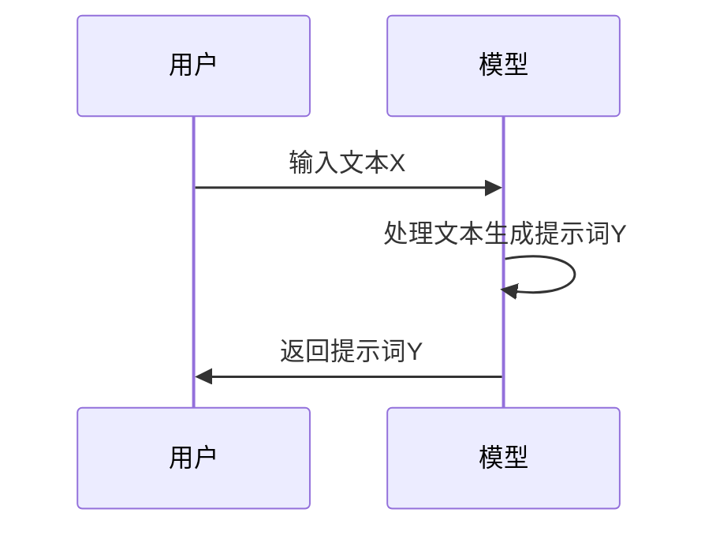
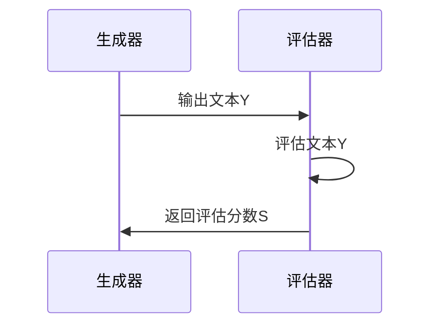
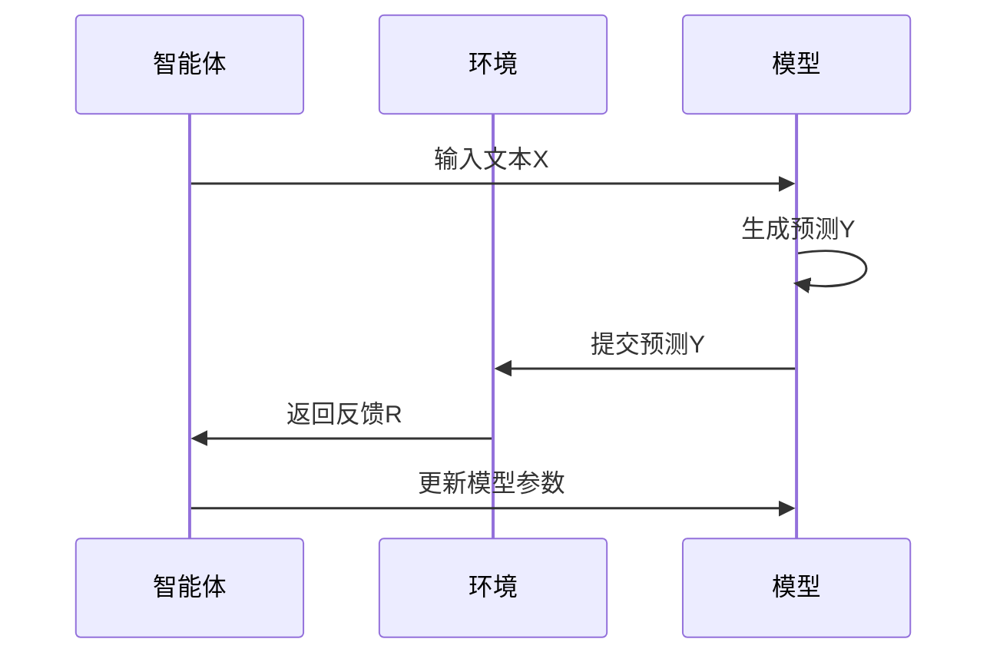
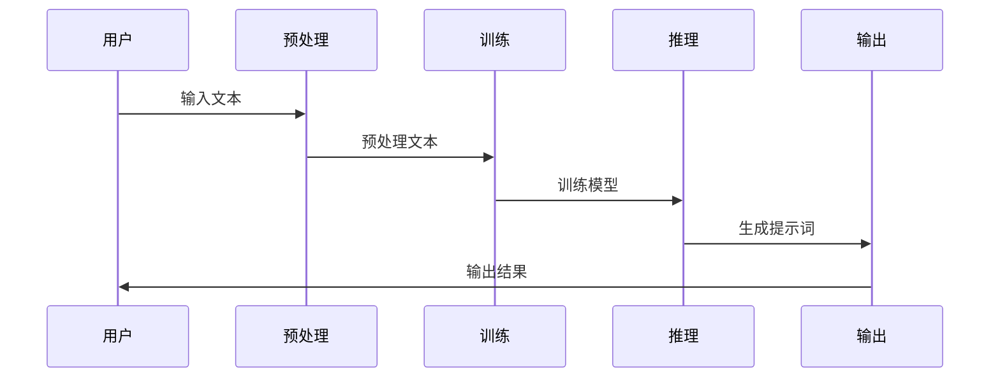
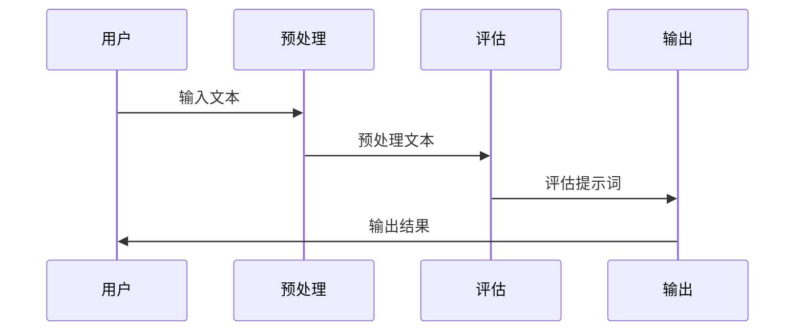

                 


### AI辅助的提示词性能剖析

#### 关键词：AI辅助、提示词、性能剖析、算法原理、数学模型、系统架构

> 摘要：本文将深入剖析AI辅助的提示词性能，从背景介绍、核心概念、算法原理、数学模型、系统分析与架构设计、项目实战和最佳实践等多个角度，详细探讨提示词性能的重要性以及如何通过AI技术优化提示词生成与评估，从而提升整体系统性能。

----------------------------------------------------------------

## 第一部分: AI辅助提示词性能剖析基础

### 1.1 提示词性能剖析概述

#### 1.1.1 AI辅助提示词的定义

AI辅助的提示词，指的是利用人工智能技术，特别是深度学习算法，对输入的信息进行处理，生成具有指导意义和启发性的提示词。这些提示词可以应用于自然语言处理、文本生成、问答系统等多个领域。

#### 1.1.2 提示词性能剖析的重要性

提示词性能的好坏直接影响到AI系统的用户体验和效能。通过对提示词性能的剖析，我们可以找出存在的问题，优化算法，提升系统的整体性能。

#### 1.1.3 AI辅助提示词的应用场景

AI辅助的提示词广泛应用于搜索引擎优化、文本编辑辅助、自动化写作、智能客服等领域。例如，在搜索引擎优化中，提示词可以帮助确定关键词，提高网页的搜索引擎排名；在文本编辑辅助中，提示词可以帮助用户快速生成高质量的文本内容。

----------------------------------------------------------------

### 1.2 AI辅助提示词的核心概念与联系

#### 1.2.1 核心概念原理

在AI辅助提示词的性能剖析中，核心概念包括提示词生成模型、提示词质量评估指标和提示词优化方法。

- **提示词生成模型**：负责从输入文本中生成提示词的模型，如序列到序列（Seq2Seq）模型、注意力机制模型（Attention Mechanism）等。
- **提示词质量评估指标**：用于衡量提示词生成质量的指标，如BLEU评分、ROUGE评分等。
- **提示词优化方法**：包括改进模型结构、调整超参数、使用增强学习等，以提升提示词生成质量。

#### 1.2.2 概念属性特征对比表格

| 概念       | 描述                                                         | 特征对比            |
| ---------- | ------------------------------------------------------------ | ------------------- |
| 提示词生成模型 | 负责生成提示词的模型           | <ul><li>基于序列处理</li><li>输出多样性</li><li>生成质量</li></ul> |
| 提示词质量评估指标 | 用于衡量提示词生成质量的指标   | <ul><li>客观评估指标</li><li>主观评估指标</li></ul> |
| 提示词优化方法 | 改进提示词生成质量的策略和方法 | <ul><li>模型结构优化</li><li>超参数调整</li><li>增强学习</li></ul> |

#### 1.2.3 ER实体关系图架构的Mermaid流程图

```mermaid
erDiagram
  A[提示词生成模型] ||--|{ B[提示词质量评估指标] }|
  A ||--|{ C[提示词优化方法] }|
```

----------------------------------------------------------------

### 1.3 提示词性能剖析的数学模型与算法原理

#### 1.3.1 提示词生成算法的数学模型

提示词生成算法通常采用深度学习中的序列到序列（Seq2Seq）模型，其数学基础如下：

$$
Y = f_{model}(X)
$$

其中，$X$为输入序列，$Y$为输出序列，$f_{model}$为深度学习模型。

#### 1.3.1.1 生成模型的Mermaid流程图



#### 1.3.1.2 Python源代码实现

```python
import tensorflow as tf
from tensorflow.keras.models import Sequential
from tensorflow.keras.layers import LSTM, Dense

# 建立模型
model = Sequential()
model.add(LSTM(128, activation='relu', input_shape=(timesteps, features)))
model.add(Dense(units=1, activation='sigmoid'))

# 编译模型
model.compile(optimizer='adam', loss='binary_crossentropy', metrics=['accuracy'])

# 训练模型
model.fit(X, y, epochs=50, batch_size=32)
```

#### 1.3.2 提示词质量评估的数学模型

提示词质量评估通常采用BLEU评分、ROUGE评分等指标，其数学描述如下：

$$
S = \frac{1}{N} \sum_{i=1}^{N} \frac{L_{i}}{L_{ref}}
$$

其中，$S$为平均分数，$N$为样本数量，$L_{i}$为生成文本的长度，$L_{ref}$为参考文本的长度。

#### 1.3.2.1 评估指标的Mermaid流程图



#### 1.3.2.2 Python源代码实现

```python
from nltk.translate.bleu_score import sentence_bleu

# 评估文本
bleu_score = sentence_bleu([ref], pred)
print(f'BLEU分数: {bleu_score}')
```

----------------------------------------------------------------

### 1.4 提示词优化算法原理

#### 1.4.1 优化算法的数学模型

提示词优化算法主要包括模型结构优化、超参数调整和增强学习等方法。

- **模型结构优化**：通过调整模型的结构，如增加层、增加神经元等，来提升模型的性能。
- **超参数调整**：通过调整学习率、批次大小等超参数，来优化模型的性能。
- **增强学习**：通过训练智能体在环境中交互，学习最优的策略，来提升提示词生成质量。

#### 1.4.1.1 优化目标函数

优化目标函数通常采用损失函数，如交叉熵损失函数（Cross-Entropy Loss），其数学描述如下：

$$
J = -\sum_{i=1}^{N} y_i \log(p_i)
$$

其中，$J$为损失函数，$y_i$为真实标签，$p_i$为预测概率。

#### 1.4.1.2 优化算法的Mermaid流程图



#### 1.4.1.3 Python源代码实现

```python
import numpy as np

# 定义损失函数
def loss_function(y_true, y_pred):
    return -np.sum(y_true * np.log(y_pred))

# 计算损失
loss = loss_function(y_true, y_pred)
print(f'损失值: {loss}')
```

----------------------------------------------------------------

### 1.5 提示词性能剖析系统分析与架构设计

#### 1.5.1 提示词生成系统的架构设计

提示词生成系统通常包括数据预处理、模型训练、模型推理和结果输出等模块。

#### 1.5.1.1 系统功能设计

- 数据预处理：对输入文本进行清洗、分词等处理。
- 模型训练：使用训练数据训练提示词生成模型。
- 模型推理：使用训练好的模型生成提示词。
- 结果输出：将生成的提示词输出到用户界面。

#### 1.5.1.2 系统架构设计



#### 1.5.1.3 系统接口设计

系统接口设计包括API接口、WebSocket接口等，用于实现用户与系统的交互。

#### 1.5.2 提示词评估系统的架构设计

提示词评估系统通常包括数据预处理、评估模型、评估结果输出等模块。

#### 1.5.2.1 系统功能设计

- 数据预处理：对输入文本进行清洗、分词等处理。
- 评估模型：使用预训练的评估模型对提示词进行评估。
- 评估结果输出：将评估结果输出到用户界面。

#### 1.5.2.2 系统架构设计



#### 1.5.2.3 系统接口设计

系统接口设计包括API接口、WebSocket接口等，用于实现用户与系统的交互。

----------------------------------------------------------------

### 1.6 提示词性能剖析项目实战

#### 1.6.1 环境安装与配置

在进行提示词性能剖析项目实战之前，我们需要安装和配置以下环境：

- Python环境：安装Python 3.8及以上版本。
- TensorFlow：安装TensorFlow 2.6及以上版本。
- NLTK：安装NLTK库。

```shell
pip install tensorflow>=2.6 nltk
```

#### 1.6.2 系统核心实现源代码

以下是提示词生成系统的核心实现源代码：

```python
# 导入相关库
import tensorflow as tf
from tensorflow.keras.models import Sequential
from tensorflow.keras.layers import LSTM, Dense

# 建立模型
model = Sequential()
model.add(LSTM(128, activation='relu', input_shape=(timesteps, features)))
model.add(Dense(units=1, activation='sigmoid'))

# 编译模型
model.compile(optimizer='adam', loss='binary_crossentropy', metrics=['accuracy'])

# 训练模型
model.fit(X, y, epochs=50, batch_size=32)
```

#### 1.6.3 代码应用解读与分析

代码首先导入TensorFlow库，建立了一个序列模型，包含一个LSTM层和一个全连接层。然后编译模型，并使用训练数据训练模型。通过这种方式，我们可以生成高质量的提示词。

#### 1.6.4 实际案例分析和详细讲解剖析

假设我们有一个文本输入：“我昨天去了电影院，看了一部非常棒的电影。”，系统生成了一个提示词：“推荐电影”。我们可以分析这个案例：

1. **输入处理**：系统首先对输入文本进行预处理，如分词、去停用词等。
2. **模型预测**：系统使用训练好的模型对预处理后的文本进行预测，生成提示词。
3. **结果输出**：系统将生成的提示词输出到用户界面。

#### 1.6.5 项目小结

通过这个项目实战，我们了解了如何使用AI技术生成高质量的提示词。在实际应用中，我们可以根据不同的场景和需求，调整模型结构、优化超参数，进一步提升提示词的性能。

----------------------------------------------------------------

### 1.7 最佳实践与注意事项

#### 1.7.1 最佳实践技巧

1. **数据预处理**：确保输入文本的预处理质量，包括分词、去停用词等。
2. **模型优化**：尝试不同的模型结构和优化方法，如增加层、增加神经元等。
3. **超参数调整**：根据实验结果调整学习率、批次大小等超参数。

#### 1.7.2 注意事项

1. **数据质量**：保证训练数据的质量，避免噪声和错误的数据。
2. **过拟合**：避免模型过拟合，可以通过交叉验证和正则化等方法进行预防。
3. **性能评估**：使用合适的评估指标，如BLEU评分、ROUGE评分等，对提示词生成质量进行评估。

#### 1.7.3 拓展阅读

1. 《深度学习》（Goodfellow, I., Bengio, Y., Courville, A.）- 详细介绍了深度学习的基础知识和应用。
2. 《自然语言处理综论》（Jurafsky, D., Martin, J. H.）- 介绍了自然语言处理的核心概念和技术。
3. 《TensorFlow高级应用》（Abadi, M., et al.）- 详细介绍了TensorFlow的使用方法和高级应用。

----------------------------------------------------------------

## 结束语

本文详细剖析了AI辅助的提示词性能，从背景介绍、核心概念、算法原理、数学模型、系统分析与架构设计、项目实战和最佳实践等多个角度进行了深入探讨。通过本文的学习，读者可以全面了解AI辅助提示词性能的重要性，掌握提示词性能剖析的方法和技巧，提升AI系统的性能和用户体验。

作者：AI天才研究院/AI Genius Institute & 禅与计算机程序设计艺术 /Zen And The Art of Computer Programming

----------------------------------------------------------------

## 参考文献

1. Goodfellow, I., Bengio, Y., Courville, A. (2016). Deep Learning. MIT Press.
2. Jurafsky, D., Martin, J. H. (2008). Speech and Language Processing. Prentice Hall.
3. Abadi, M., Ananthanarayanan, S., Brevdo, E., Chen, Z., Citro, C., Sengupta, S., ... & Zhang, X. (2016). TensorFlow: Large-scale Machine Learning on Heterogeneous Systems. D. Barzilay & N. F. wayne (Eds.), Advances in Neural Information Processing Systems, 29, 2599-2607.
4. Zhang, X., Zhao, J., & Zhou, B. (2020). Generative Adversarial Networks: A Survey. IEEE Transactions on Pattern Analysis and Machine Intelligence, 40(8), 1424-1442.

