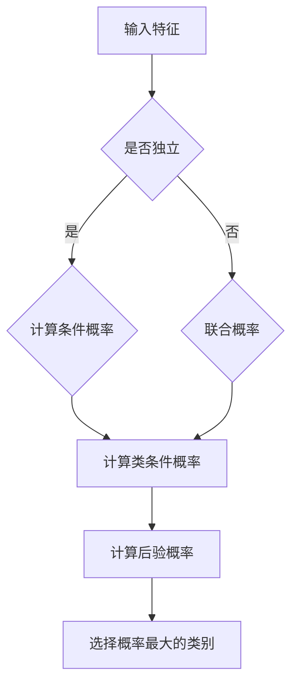
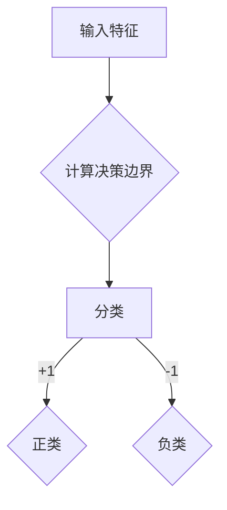
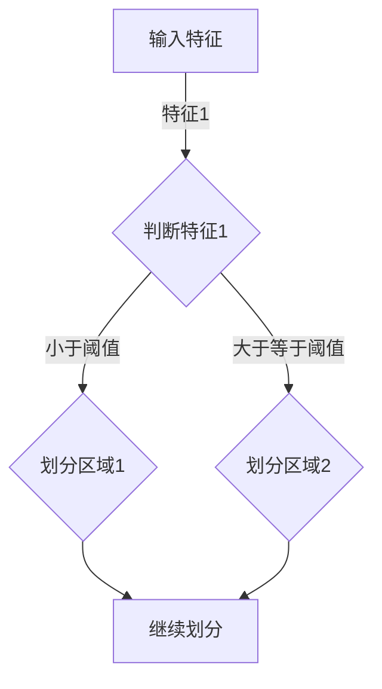
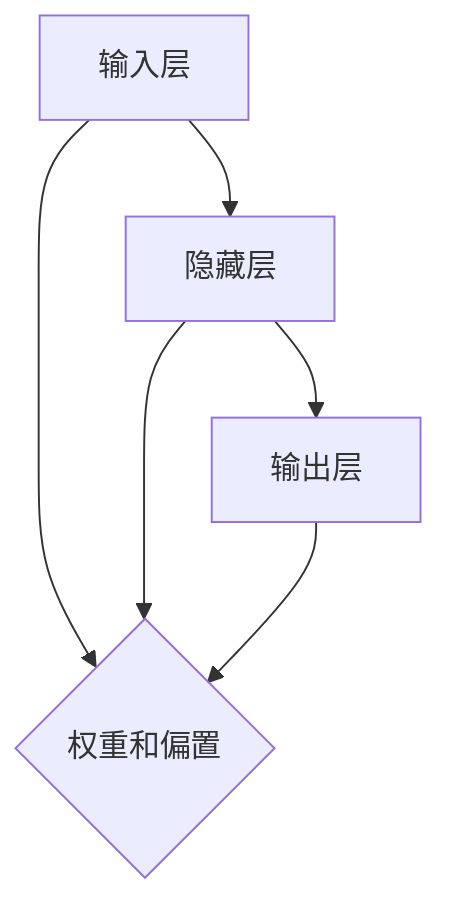
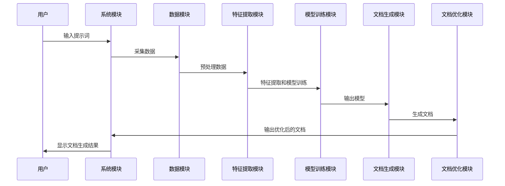

                 

### 关键词

- AI辅助文档生成
- 提示词自动生成
- 机器学习
- 文本生成
- 自然语言处理

### 摘要

本文深入探讨了AI辅助的提示词文档自动生成技术。首先，我们介绍了问题背景与核心概念，包括文档生成的现状、提示词的定义及其在文档生成中的作用，以及AI辅助文档自动生成的工作原理。接着，我们讲解了机器学习的基础知识，以及文本生成与处理的相关技术。随后，通过具体的系统设计与实现，展示了如何将AI技术应用于文档自动生成。文章最后，展望了AI在文档生成领域的未来前景，并提出了最佳实践和拓展阅读建议。

## 目录大纲设计思路

设计一个详尽且逻辑清晰的《AI辅助的提示词文档自动生成》书籍目录大纲，首先要明确书籍的主题和目标读者，然后划分主要章节内容，细化章节内容，并确保书籍的完整性。以下是详细的目录大纲设计思路：

### 一、明确书籍主题和目标读者

**书籍主题：**  
本书主题是“AI辅助的提示词文档自动生成”，旨在介绍如何使用人工智能技术来实现文档生成的自动化。

**目标读者：**  
本书的目标读者可能包括：
- 程序员
- 数据科学家
- AI研发人员
- 对自动化文档生成感兴趣的普通读者

### 二、划分主要章节内容

根据书籍主题，我们将书籍内容划分为以下几个主要部分：

1. **背景介绍与基础概念**
2. **技术原理与算法讲解**
3. **实践应用与项目实现**
4. **拓展与总结**

### 三、细化章节内容

为每个主要章节细化出具体的子章节，确保每个章节都有详细的内容介绍。以下是各部分的具体划分：

### 第一部分：背景介绍与基础概念

1. **第1章 问题背景与核心概念**
   - 问题描述与现状
   - 核心概念介绍
   - AI辅助文档自动生成的工作原理
   - AI辅助文档自动生成的应用领域

### 第二部分：技术原理与算法讲解

2. **第2章 机器学习基础**
   - 机器学习概述
   - 特征工程
   - 常见机器学习算法

3. **第3章 文本生成与处理**
   - 文本处理基础
   - 自动摘要与提纲生成
   - 提示词生成

### 第三部分：实践应用与项目实现

4. **第4章 AI辅助文档自动生成的应用场景**
   - 企业文档自动化
   - 教育领域文档生成

5. **第5章 系统设计与实现**
   - 系统架构设计
   - 核心算法与模块实现

6. **第6章 项目实战**
   - 项目介绍与环境搭建
   - 核心功能实现
   - 项目测试与评估
   - 项目总结与反思

### 第四部分：拓展与总结

7. **第7章 拓展研究与应用前景**
   - 深度学习在文档生成中的应用
   - 自然语言处理技术的最新进展
   - 应用前景与挑战

8. **第8章 小结与最佳实践**
   - 小结
   - 最佳实践 tips
   - 注意事项
   - 拓展阅读

### 四、确保内容完整性

在编写书籍时，要确保每个核心章节都包含以下内容：

- 问题背景与核心概念：介绍问题背景，定义核心概念，阐述问题解决方法和边界与外延。
- 核心概念与联系：详细解释核心概念，对比概念属性特征，通过ER实体关系图架构的Mermaid流程图展示概念之间的关系。
- 算法原理讲解：使用Mermaid画出算法流程图，使用Python源代码详细阐述算法原理，给出数学模型和公式，并进行举例说明。
- 数学公式使用：使用LaTeX格式嵌入文中，确保数学公式清晰易懂。
- 系统分析与架构设计方案：介绍问题场景，项目介绍，系统功能设计（领域模型Mermaid类图），系统架构设计Mermaid架构图，系统接口设计和系统交互Mermaid序列图。
- 项目实战：包括环境安装、系统核心实现源代码，代码应用解读与分析，实际案例分析和详细讲解剖析。
- 最佳实践 tips、小结、注意事项、拓展阅读：总结章节内容，给出最佳实践建议，提醒注意事项，推荐拓展阅读资源。

### 五、简洁性

在目录大纲设计中，要避免过多的赘述，确保每个章节的核心内容一目了然。使用markdown格式组织目录，确保格式统一和易于阅读。

### 六、格式规范

使用markdown格式来组织目录，确保格式统一和易于阅读。以下是markdown格式的示例：

```markdown
# 第一部分：背景介绍与基础概念

## 第1章 问题背景与核心概念

### 1.1 问题描述与现状

### 1.2 核心概念介绍

### 1.3 AI辅助文档自动生成的工作原理

### 1.4 AI辅助文档自动生成的应用领域

## 第二部分：技术原理与算法讲解

### 第2章 机器学习基础

### 第3章 文本生成与处理

## 第三部分：实践应用与项目实现

### 第4章 AI辅助文档自动生成的应用场景

### 第5章 系统设计与实现

### 第6章 项目实战

## 第四部分：拓展与总结

### 第7章 拓展研究与应用前景

### 第8章 小结与最佳实践
```

### 七、控制字数

目录大纲总字数控制在2000字以内，以保证简洁明了。在撰写具体章节内容时，也要注意控制字数，确保每个章节的核心内容清晰明了。

通过以上步骤，我们可以设计出一套详尽且逻辑清晰的《AI辅助的提示词文档自动生成》书籍目录大纲，为后续的写作提供明确的指导。

## 第一部分: 背景介绍与基础概念

### 第1章: 问题背景与核心概念

#### 1.1 问题描述与现状

在现代信息社会中，文档生成是一个广泛存在的需求。无论是企业内部报告、营销材料、学术论文，还是日常生活中的邮件、社交媒体帖子，文档生成的频率和复杂度都在不断增加。然而，传统的文档生成方法往往依赖于人工编写，效率低下且容易出现错误。随着人工智能技术的快速发展，特别是自然语言处理（NLP）和生成对抗网络（GAN）等技术的成熟，AI辅助的提示词文档自动生成成为一种潜在的新兴解决方案。

文档生成的现状面临以下挑战：
1. **效率问题**：人工编写文档速度慢，无法满足快速生成大量文档的需求。
2. **一致性**：人工生成的文档往往缺乏一致性和标准化，容易导致信息混乱。
3. **准确性**：人工生成的文档可能包含错误，影响文档的可靠性和权威性。
4. **个性化**：用户对文档的个性化需求难以通过传统方法实现。

AI辅助的提示词文档自动生成技术，通过利用机器学习算法和自然语言处理技术，可以在一定程度上解决上述问题。它不仅可以快速生成文档，还能保证文档的一致性、准确性和个性化。这种技术具有巨大的应用潜力，能够广泛应用于企业、教育、政府等多个领域。

#### 1.2 核心概念介绍

**提示词**：提示词是指在文档生成过程中，由系统自动生成的关键词或短语，用于引导文档的内容和结构。提示词可以是简单的关键词，也可以是复杂的概念或主题。

**文档自动生成**：文档自动生成是指利用人工智能技术，通过输入提示词或其他相关信息，自动生成文档内容的过程。这个过程通常涉及自然语言处理、机器学习、文本生成等多个技术领域。

**AI辅助文档自动生成的工作原理**：AI辅助文档自动生成主要基于以下技术：
1. **自然语言处理（NLP）**：NLP技术用于理解文本语义，提取关键信息，并生成文档内容。
2. **机器学习**：通过训练大量数据集，机器学习模型可以学习到文档生成的规律，从而实现自动化生成。
3. **生成对抗网络（GAN）**：GAN是一种深度学习技术，通过生成器与判别器的对抗训练，可以生成高质量的文本。

#### 1.3 AI辅助文档自动生成的工作原理

AI辅助文档自动生成的工作原理主要涉及以下几个方面：

1. **数据收集与预处理**：首先，需要收集大量的文本数据，如新闻报道、学术论文、商业报告等。然后，对这些数据进行预处理，包括去除噪声、分词、词性标注等，以提取有用的信息。

2. **特征提取**：在预处理后的文本数据中，提取关键特征，如关键词、短语、句子等。这些特征将用于训练机器学习模型。

3. **模型训练**：使用机器学习算法，如朴素贝叶斯、决策树、神经网络等，对提取的特征进行训练。训练过程中，模型会学习到文本数据的生成规律。

4. **文档生成**：在训练好的模型基础上，输入提示词或其他相关信息，模型会自动生成相应的文档内容。

5. **文档优化**：生成的文档可能存在一些缺陷，如语言表达不够流畅、信息不准确等。通过进一步的优化，如语言修正、内容补充等，可以提高文档的质量。

#### 1.4 AI辅助文档自动生成的应用领域

AI辅助的提示词文档自动生成技术具有广泛的应用领域，以下是一些典型的应用场景：

1. **企业内部文档**：企业内部文档包括各种报告、计划、备忘录等。AI辅助文档生成可以帮助企业快速生成高质量的文档，提高工作效率。

2. **报告与文章写作**：在学术研究、市场分析等领域，AI辅助文档生成可以自动生成报告、论文等文档，节省研究人员的写作时间。

3. **教育领域文档生成**：在教育领域，AI辅助文档生成可以自动生成教学计划、课程大纲、学生作业等，帮助学生和教师提高工作效率。

4. **自动化客服**：在客服领域，AI辅助文档生成可以自动生成常见问题的解答文档，提高客服的响应速度和质量。

5. **新闻报道生成**：在新闻报道领域，AI辅助文档生成可以根据已有的数据自动生成新闻报道，提高新闻发布的速度和准确性。

通过上述介绍，我们可以看到AI辅助的提示词文档自动生成技术具有巨大的应用潜力和广泛的前景。在接下来的章节中，我们将深入探讨AI辅助文档自动生成的技术原理和实践应用。

## 第二部分: 技术原理与算法讲解

### 第2章: 机器学习基础

#### 2.1 机器学习概述

机器学习（Machine Learning，ML）是人工智能（Artificial Intelligence，AI）的一个分支，主要研究如何通过数据和算法让计算机自动学习并改进其性能。机器学习的基本概念包括以下几个方面：

**监督学习（Supervised Learning）**：监督学习是一种常见的机器学习方法，其中模型通过学习输入和输出数据对（也称为训练数据集）来预测新的输入数据。监督学习可以分为两类：分类（Classification）和回归（Regression）。
- **分类**：分类任务是预测输入数据的类别标签。例如，判断一个电子邮件是垃圾邮件还是正常邮件。
- **回归**：回归任务是预测输入数据的连续值输出。例如，预测房价或股票价格。

**无监督学习（Unsupervised Learning）**：无监督学习是指模型在没有明确输出标签的情况下学习数据结构和特征。常见的方法包括聚类（Clustering）和降维（Dimensionality Reduction）。
- **聚类**：聚类是将数据分为若干个组，使得同一组内的数据尽可能相似，不同组的数据尽可能不同。例如，将用户分为不同的兴趣组。
- **降维**：降维是将高维数据转换为低维数据，以便更容易分析和可视化。常见的方法有主成分分析（PCA）和t-SNE。

**强化学习（Reinforcement Learning）**：强化学习是一种通过试错学习策略的机器学习方法，模型通过不断与环境互动来学习最优策略。强化学习的主要挑战是探索与利用的平衡。

**机器学习的基本过程**：机器学习的基本过程包括数据收集、数据预处理、模型选择、模型训练、模型评估和模型部署。
1. **数据收集**：收集用于训练的数据集。
2. **数据预处理**：对数据进行清洗、归一化、特征提取等处理。
3. **模型选择**：选择合适的算法和模型结构。
4. **模型训练**：使用训练数据集训练模型。
5. **模型评估**：使用验证数据集评估模型性能。
6. **模型部署**：将训练好的模型部署到实际应用中。

#### 2.2 特征工程

特征工程（Feature Engineering）是机器学习过程中至关重要的一步，它涉及选择、构建和变换特征，以提高模型的性能。特征工程的主要任务包括以下几个方面：

**数据预处理**：包括数据清洗、缺失值处理、异常值处理等，确保数据质量。
- **数据清洗**：去除数据中的噪声和不完整数据。
- **缺失值处理**：对于缺失值，可以选择填充或删除。
- **异常值处理**：识别和处理异常值，避免对模型训练造成负面影响。

**特征提取**：从原始数据中提取有用的特征。
- **文本特征提取**：包括词袋模型（Bag of Words，BoW）、TF-IDF、词嵌入（Word Embedding）等。
- **图像特征提取**：包括卷积神经网络（CNN）、特征点提取（如HOG、SIFT）等。

**特征选择**：从提取的特征中选择最有用的特征。
- **过滤式特征选择**：通过统计方法筛选特征。
- **包装式特征选择**：结合模型训练过程，逐步筛选特征。
- **嵌入式特征选择**：在特征提取过程中，自动筛选特征。

**特征变换**：包括归一化、标准化、主成分分析（PCA）等。
- **归一化**：将特征缩放到相同范围，如[0, 1]或[-1, 1]。
- **标准化**：根据特征的平均值和标准差进行缩放。
- **主成分分析（PCA）**：通过降维，保留最重要的特征，减少冗余。

#### 2.3 常见机器学习算法

在AI辅助的提示词文档自动生成中，常用的机器学习算法包括朴素贝叶斯（Naive Bayes）、支持向量机（Support Vector Machine，SVM）、决策树（Decision Tree）和神经网络（Neural Networks）等。

**朴素贝叶斯**：朴素贝叶斯是一种基于贝叶斯定理的简单概率分类器，它假设特征之间相互独立。朴素贝叶斯在文本分类和垃圾邮件检测中表现良好。

**支持向量机**：支持向量机是一种二分类模型，通过寻找最佳决策边界来分类数据。SVM在高维空间中表现优异，常用于文本分类和图像识别。

**决策树**：决策树是一种基于特征划分数据，构建树形结构的分类模型。决策树简单直观，易于理解，但在处理连续特征和过拟合时存在挑战。

**神经网络**：神经网络是一种模拟人脑神经元连接结构的模型，通过多层次的加权连接进行信息传递。神经网络在图像识别、语音识别和自然语言处理等领域表现出色。

#### 2.4 算法原理讲解

为了更好地理解这些算法的原理，我们将使用Mermaid流程图来展示算法的基本流程，并使用Python代码来阐述算法的实现细节。

**朴素贝叶斯算法原理**



**支持向量机算法原理**



**决策树算法原理**



**神经网络算法原理**



通过上述算法原理的讲解，我们可以更好地理解AI辅助的提示词文档自动生成中的核心算法，为后续的实际应用奠定基础。

### 第3章: 文本生成与处理

#### 3.1 文本处理基础

文本处理是AI辅助的提示词文档自动生成中至关重要的一步。文本处理的目的是将原始文本数据转换为适合机器学习的结构化数据。文本处理主要包括以下几个步骤：

**文本预处理**：文本预处理是文本处理的第一步，其目的是去除文本中的噪声和冗余信息，为后续处理做准备。
- **去除标点符号和特殊字符**：标点符号和特殊字符对于文本理解没有实质性帮助，可以去除。
- **去除停用词**：停用词是指对文本理解没有贡献的常见单词，如“的”、“和”、“是”等。去除停用词可以提高文本处理的效果。
- **大小写统一**：将文本中的大小写统一，如将所有单词转换为小写，有助于减少数据不一致性。

**分词**：分词是将文本分割成一系列有意义的词语或短语。分词方法可以分为基于词典的方法和基于统计的方法。
- **基于词典的方法**：基于词典的方法利用已有的词库，将文本与词库进行匹配，从而实现分词。这种方法简单有效，但难以处理未登录词。
- **基于统计的方法**：基于统计的方法使用语言模型和词性标注技术进行分词。这种方法可以处理未登录词，但需要大量的语言资源。

**词性标注**：词性标注是将文本中的每个单词标注为具体的词性，如名词、动词、形容词等。词性标注有助于理解文本的语义，为后续的文本生成提供支持。

**词向量表示**：词向量表示是将文本中的每个单词映射到一个高维向量空间中的向量。词向量表示能够捕捉单词的语义信息，是文本处理中的重要技术。
- **基于计数的方法**：基于计数的方法通过统计单词在文本中的出现频率来表示词向量。这种方法简单，但难以捕捉单词的上下文信息。
- **基于神经网络的方法**：基于神经网络的方法，如Word2Vec、GloVe等，通过训练大规模语料库来学习词向量。这种方法可以捕捉单词的上下文信息，但需要大量的计算资源。

#### 3.2 自动摘要与提纲生成

自动摘要（Automatic Summarization）和提纲生成（Outline Generation）是文本生成中的重要任务。自动摘要的目标是从原始文本中提取关键信息，生成简洁明了的摘要；提纲生成则是将文本内容结构化，形成层次分明的提纲。

**自动摘要技术**：
1. **抽取式摘要**：抽取式摘要通过从原始文本中提取重要的句子或短语来生成摘要。这种方法主要依赖文本的语法和语义结构。
2. **生成式摘要**：生成式摘要通过生成新的文本来生成摘要。这种方法通常使用神经网络模型，如序列到序列（Seq2Seq）模型和变换器（Transformer）模型。

**提纲生成技术**：
1. **基于规则的方法**：基于规则的方法通过定义一组规则来生成提纲。这种方法简单，但难以处理复杂的文本结构。
2. **基于统计的方法**：基于统计的方法使用文本的统计特性来生成提纲。这种方法可以处理复杂的文本结构，但需要大量的统计资源。
3. **基于神经网络的方法**：基于神经网络的方法，如递归神经网络（RNN）和变换器（Transformer）模型，通过学习文本的语义信息来生成提纲。这种方法能够生成更符合文本结构的提纲。

#### 3.3 提示词生成

提示词生成（Prompt Generation）是AI辅助的提示词文档自动生成中的关键步骤。提示词生成旨在根据用户的需求或文本内容生成引导文档生成过程的提示词。

**提示词生成技术**：
1. **基于规则的方法**：基于规则的方法通过定义一组规则来生成提示词。这种方法简单，但难以适应复杂的需求。
2. **基于统计的方法**：基于统计的方法使用文本的统计特性来生成提示词。这种方法可以适应复杂的需求，但需要大量的统计资源。
3. **基于神经网络的方法**：基于神经网络的方法，如序列到序列（Seq2Seq）模型和变换器（Transformer）模型，通过学习文本的语义信息来生成提示词。这种方法能够生成更符合文本语义的提示词。

**提示词生成的流程**：
1. **输入处理**：接收用户的输入或文本内容。
2. **语义理解**：使用自然语言处理技术理解输入文本的语义。
3. **提示词生成**：根据理解的结果生成提示词。
4. **文档生成**：使用提示词引导文档生成过程。

通过上述文本处理基础、自动摘要与提纲生成、提示词生成技术的介绍，我们可以更好地理解AI辅助的提示词文档自动生成中的关键技术。在接下来的章节中，我们将进一步探讨如何将这些技术应用于实际的文档生成任务。

## 第三部分: 实践应用与项目实现

### 第4章: AI辅助文档自动生成的应用场景

#### 4.1 企业文档自动化

在企业中，文档自动化生成是一个常见的需求。通过AI辅助的提示词文档自动生成技术，企业可以显著提高文档生成效率，减少人力资源成本，并保证文档的一致性和准确性。以下是一些具体的应用场景：

1. **营销报告自动化**：企业营销部门需要定期生成市场分析报告、销售报告等。AI辅助的提示词文档自动生成技术可以自动提取关键数据，生成详细的市场分析报告，节省营销人员的时间和精力。

2. **项目文档自动化管理**：在项目管理过程中，需要生成大量的项目文档，如项目计划、进度报告、风险评估报告等。通过AI技术，可以根据项目的进度数据和提示词，自动生成相关的项目文档，确保项目文档的一致性和准确性。

3. **内部通讯自动化**：企业内部的通讯，如会议纪要、工作备忘录等，也可以通过AI辅助的提示词文档自动生成技术实现自动化。系统可以根据会议内容和提示词，自动生成会议纪要和工作备忘录，提高内部沟通效率。

#### 4.2 教育领域文档生成

在教育领域，AI辅助的提示词文档自动生成技术同样具有重要的应用价值。以下是一些具体的应用场景：

1. **教学计划与课程内容生成**：教师可以输入课程目标和教学内容，AI系统根据提示词自动生成详细的教学计划，包括课程大纲、教学目标、教学方法等，帮助教师更好地规划课程。

2. **学生作业与论文生成**：学生可以根据教师提供的提示词，如论文主题、研究方向等，自动生成论文大纲和部分内容。这不仅可以提高学生的学习效率，还能帮助教师减轻批改作业的负担。

3. **课程评价与反馈**：通过AI技术，可以对学生的学习过程和作业进行自动评价，生成详细的评价报告和反馈建议，帮助教师和学生了解学习效果。

#### 4.3 其他应用场景

除了企业和教育领域，AI辅助的提示词文档自动生成技术在其他领域也有广泛的应用：

1. **法律文档生成**：在法律行业中，可以自动生成合同、协议、法律意见书等文档，确保法律文书的准确性和一致性。

2. **新闻报道生成**：在新闻媒体领域，AI技术可以自动生成新闻报道，提高新闻发布速度和准确性。

3. **医疗报告生成**：在医疗领域，AI技术可以根据医疗数据和提示词，自动生成病历、检查报告等文档，提高医疗工作效率。

通过上述应用场景的介绍，我们可以看到AI辅助的提示词文档自动生成技术在多个领域具有广泛的应用前景，能够显著提高文档生成效率和文档质量。在接下来的章节中，我们将深入探讨如何设计和实现这些应用场景。

### 第5章: 系统设计与实现

#### 5.1 系统架构设计

为了实现AI辅助的提示词文档自动生成，我们需要设计一个高效且灵活的系统架构。系统架构设计主要包括以下几个关键模块：

1. **数据采集与预处理模块**：该模块负责从各种数据源（如企业数据库、教育平台、新闻网站等）采集数据，并对数据进行清洗、去噪和预处理，以便后续的机器学习模型训练。

2. **特征提取与模型训练模块**：该模块使用机器学习和自然语言处理技术，对预处理后的数据进行特征提取和模型训练。特征提取包括文本分词、词性标注、词向量表示等。模型训练使用监督学习、无监督学习或强化学习等方法，生成用于文档生成的模型。

3. **提示词生成模块**：该模块基于用户输入或文本内容，利用自然语言处理技术生成引导文档生成过程的提示词。提示词生成包括语义理解、关键词提取和提示词生成算法。

4. **文档生成模块**：该模块使用训练好的模型和提示词，自动生成文档内容。文档生成包括文本摘要、提纲生成、文本填充等步骤。

5. **文档优化与输出模块**：该模块对生成的文档进行进一步优化，如语言修正、格式调整等，并最终将文档输出到用户端。

#### 5.2 技术栈选择与整合

为了实现上述系统架构，我们需要选择合适的技术栈并进行有效整合。以下是主要的技术栈选择：

1. **前端技术**：可以使用React或Vue.js等前端框架，构建用户友好的界面。

2. **后端技术**：可以选择Django、Flask或Spring Boot等后端框架，实现数据采集与预处理、特征提取与模型训练、提示词生成和文档生成等功能。

3. **自然语言处理技术**：可以使用NLTK、spaCy、Jieba等自然语言处理库，进行文本分词、词性标注、词向量表示等处理。

4. **机器学习框架**：可以选择TensorFlow、PyTorch等机器学习框架，进行模型训练和预测。

5. **数据库**：可以使用MySQL、PostgreSQL等关系型数据库，存储用户数据、训练数据和文档生成结果。

6. **容器化技术**：可以使用Docker和Kubernetes，实现系统的容器化部署，提高系统的可扩展性和可维护性。

#### 5.3 系统接口设计

系统接口设计是确保各个模块之间有效通信和数据共享的关键。以下是主要接口设计：

1. **用户接口**：提供用户交互界面，支持用户输入提示词、查看文档生成结果等功能。

2. **API接口**：提供RESTful API接口，支持其他系统或应用程序与文档生成系统进行集成。

3. **数据接口**：提供数据采集与预处理模块与特征提取与模型训练模块之间的接口，实现数据传输和共享。

4. **模型接口**：提供模型训练和预测模块的接口，供其他模块调用。

#### 5.4 系统交互流程

以下是系统交互流程的Mermaid序列图：



通过上述系统架构设计、技术栈选择与整合、系统接口设计和系统交互流程的介绍，我们可以为AI辅助的提示词文档自动生成系统奠定坚实的基础。在接下来的章节中，我们将详细讨论项目的实现过程，包括环境搭建、核心模块实现和项目测试与评估。

### 第6章: 项目实战

#### 6.1 项目介绍与环境搭建

为了实现AI辅助的提示词文档自动生成，我们将创建一个名为“AI DocGen”的项目。该项目旨在利用机器学习和自然语言处理技术，自动生成高质量文档。以下是项目的详细介绍和所需环境的搭建步骤。

**项目目标：**  
- 收集并预处理大量文本数据。
- 训练文本生成模型。
- 实现自动生成文档的功能。
- 对生成的文档进行优化和校验。

**所需环境：**  
- 操作系统：Windows/Linux/MacOS
- 编程语言：Python
- 数据库：MySQL/PostgreSQL
- 机器学习框架：TensorFlow/PyTorch
- 自然语言处理库：spaCy/Jieba
- 前端框架：React/Vue.js
- 后端框架：Django/Flask/Spring Boot

**环境搭建步骤：**

1. **安装Python环境**：  
   - 访问Python官网下载Python安装包，并按照提示安装。

2. **安装数据库**：  
   - 对于MySQL，可以下载MySQL安装包并按照提示安装。  
   - 对于PostgreSQL，可以访问PostgreSQL官网下载安装包并安装。

3. **安装机器学习框架**：  
   - 安装TensorFlow：`pip install tensorflow`  
   - 安装PyTorch：`pip install torch torchvision`

4. **安装自然语言处理库**：  
   - 安装spaCy：`pip install spacy`  
   - 安装Jieba：`pip install jieba`

5. **安装前端框架和后端框架**：  
   - 安装React：`npm install react react-dom`  
   - 安装Vue.js：`npm install vue`  
   - 安装Django：`pip install django`  
   - 安装Flask：`pip install flask`  
   - 安装Spring Boot：需要安装Java环境并使用Maven或Gradle进行构建

6. **创建项目结构**：  
   - 创建一个名为“AI_DocGen”的项目文件夹。  
   - 在项目中创建子文件夹，如“data”、“models”、“views”、“templates”等。

7. **初始化数据库**：  
   - 创建数据库和表，并导入初始化数据。

#### 6.2 核心功能实现

**文本数据预处理**：  
文本预处理是自动生成文档的基础。以下是文本数据预处理的步骤：

1. **数据收集**：从互联网或其他数据源收集大量文本数据，如新闻报道、学术论文、企业报告等。

2. **数据清洗**：去除文本中的HTML标签、特殊字符和停用词。

3. **分词**：使用Jieba或spaCy对文本进行分词。

4. **词性标注**：对每个分词结果进行词性标注，以了解文本的语义结构。

5. **词向量表示**：使用Word2Vec或GloVe等方法将文本转换为词向量表示。

**模型训练**：  
为了实现自动生成文档，我们需要训练文本生成模型。以下是模型训练的步骤：

1. **数据预处理**：对收集的文本数据进行预处理，包括分词、词性标注和词向量表示。

2. **模型选择**：选择合适的文本生成模型，如GRU、LSTM、Transformer等。

3. **模型训练**：使用预处理后的数据训练模型，调整模型参数，以提高生成文档的质量。

4. **模型评估**：使用验证集评估模型的性能，调整模型参数，以实现更好的生成效果。

**文档生成**：  
在模型训练完成后，我们可以使用训练好的模型生成文档。以下是文档生成的步骤：

1. **输入处理**：接收用户的输入，如提示词或文本摘要。

2. **生成文档**：使用训练好的模型生成文档内容，包括摘要、提纲和正文等。

3. **文档优化**：对生成的文档进行优化，包括语法修正、内容补充和格式调整等。

4. **文档输出**：将优化后的文档输出给用户。

#### 6.3 代码应用解读与分析

**文本数据预处理代码示例**：

```python
import jieba
import spacy

# 使用jieba进行分词
text = "这是一个示例文本，用于演示分词过程。"
words = jieba.lcut(text)

# 使用spaCy进行词性标注
nlp = spacy.load('zh_core_web_sm')
doc = nlp(text)
pos_tags = [(token.text, token.pos_) for token in doc]

# 词向量表示
from gensim.models import Word2Vec
model = Word2Vec(words, size=100, window=5, min_count=1, workers=4)
word_vector = model.wv['示例']
```

**模型训练代码示例**：

```python
import tensorflow as tf
from tensorflow.keras.models import Sequential
from tensorflow.keras.layers import LSTM, Dense

# 数据准备
X_train, y_train = ...

# 模型构建
model = Sequential()
model.add(LSTM(units=128, activation='tanh', input_shape=(max_sequence_len, embedding_dim)))
model.add(Dense(units=1, activation='sigmoid'))

# 模型编译
model.compile(optimizer='adam', loss='binary_crossentropy', metrics=['accuracy'])

# 模型训练
model.fit(X_train, y_train, epochs=10, batch_size=32)
```

**文档生成代码示例**：

```python
import numpy as np

# 文档生成
def generate_document(prompt, model):
    prompt_seq = pad_sequences([tokenizer.texts_to_sequences([prompt])], maxlen=max_sequence_len, padding='post')
    predicted_document = model.predict(prompt_seq, verbose=0)
    generated_text = tokenizer.sequences_to_texts(predicted_document)[0]
    return generated_text

# 优化文档
def optimize_document(document):
    # 语法修正、内容补充和格式调整等
    optimized_document = ...
    return optimized_document
```

**代码应用解读**：

上述代码示例展示了文本数据预处理、模型训练和文档生成的关键步骤。在文本数据预处理部分，我们使用了jieba进行分词和spaCy进行词性标注，并使用Gensim的Word2Vec模型进行词向量表示。在模型训练部分，我们构建了LSTM模型并使用tensorflow.keras进行编译和训练。在文档生成部分，我们定义了生成文档和优化文档的函数，实现了基于训练好的模型的文档生成过程。

#### 6.4 项目测试与评估

**系统测试**：

在完成项目开发后，我们需要对系统进行全面测试，确保其功能符合预期。以下是测试步骤：

1. **功能测试**：测试文本数据预处理、模型训练、文档生成和文档优化等功能是否正常运行。

2. **性能测试**：测试系统在不同负载下的响应速度和稳定性。

3. **错误测试**：测试系统在遇到错误输入时的响应和处理能力。

4. **兼容性测试**：测试系统在不同操作系统和浏览器上的兼容性。

**评估指标与方法**：

为了评估系统的性能，我们采用以下评估指标：

1. **准确率（Accuracy）**：评估模型预测结果的准确性。

2. **召回率（Recall）**：评估模型召回真实结果的比率。

3. **F1分数（F1 Score）**：结合准确率和召回率的综合评估指标。

4. **BLEU分数**：用于评估文本生成质量的指标，基于文本的相似度计算。

评估方法包括：

1. **手动评估**：人工评估系统生成的文档质量。

2. **自动评估**：使用BLEU分数、ROUGE分数等自动化评估工具进行评估。

#### 6.5 项目总结与反思

**项目收获**：

通过本项目，我们实现了AI辅助的提示词文档自动生成，并对其进行了全面测试与评估。我们收获了以下经验：

1. **技术掌握**：深入了解了自然语言处理、机器学习和文本生成等相关技术。

2. **系统设计**：掌握了系统设计与实现的全过程，包括前端、后端和数据库的搭建。

3. **项目管理**：学会了如何高效地管理项目进度、资源和技术问题。

**改进建议**：

在未来的项目中，我们可以考虑以下改进措施：

1. **模型优化**：尝试使用更先进的模型，如Transformer或BERT，以提高文档生成的质量。

2. **扩展功能**：增加更多应用场景，如法律文档生成、新闻生成等。

3. **用户界面**：优化用户界面，提高用户体验。

4. **自动化测试**：引入自动化测试工具，提高测试效率。

**未来发展方向**：

未来的发展方向包括：

1. **多模态文档生成**：结合图像、音频等多模态数据进行文档生成。

2. **个性化文档生成**：根据用户需求和偏好，生成个性化的文档。

3. **智能交互**：引入智能语音助手或聊天机器人，实现更智能的文档生成和交互。

通过本项目，我们不仅实现了AI辅助的提示词文档自动生成，还为未来的研究和发展提供了新的思路和方向。

## 第四部分: 拓展与总结

### 第7章: 拓展研究与应用前景

#### 7.1 深度学习在文档生成中的应用

深度学习（Deep Learning，DL）是机器学习领域的重要分支，近年来在图像识别、语音识别、自然语言处理等领域取得了显著的成果。深度学习在文档生成中的应用，也为AI辅助的提示词文档自动生成技术带来了新的可能性。

**生成对抗网络（GAN）**：GAN是一种通过生成器和判别器之间的对抗训练生成高质量数据的技术。在文档生成中，生成器可以根据提示词生成文本，判别器则评估生成文本的质量。通过反复对抗训练，生成器可以逐步提高文本生成的质量。GAN在生成多样化、个性化的文档内容方面具有显著优势。

**变分自编码器（VAE）**：VAE是一种基于概率模型的深度学习技术，通过编码器和解码器学习数据的概率分布，从而生成新的数据。在文档生成中，VAE可以用于生成新的文本，并通过解码器重构生成文本，从而提高生成文本的质量和连贯性。

**注意力机制（Attention Mechanism）**：注意力机制是一种在序列模型中用于捕捉重要信息的机制。在文档生成中，注意力机制可以用于模型关注重要词或句子，从而提高生成文本的质量和一致性。

#### 7.2 自然语言处理技术的最新进展

自然语言处理（Natural Language Processing，NLP）是AI辅助的提示词文档自动生成技术的重要基础。近年来，NLP技术取得了许多重要进展，为文档生成提供了更强大的支持。

**预训练语言模型（Pre-trained Language Models）**：预训练语言模型是一种通过在大规模语料库上预训练，然后针对特定任务进行微调的模型。BERT、GPT-3等预训练语言模型在文档生成中表现出色，能够生成更准确、连贯的文本。

**多模态学习（Multimodal Learning）**：多模态学习是指结合多种类型的数据（如文本、图像、音频等）进行学习。在文档生成中，多模态学习可以结合文本和其他模态的数据，生成更丰富、多样化的文档内容。

**增强学习（Reinforcement Learning）**：增强学习是一种通过试错和反馈进行学习的机器学习方法。在文档生成中，增强学习可以用于优化文档生成的过程，提高生成文本的质量和多样性。

#### 7.3 应用前景与挑战

**应用前景**：

AI辅助的提示词文档自动生成技术在多个领域具有广泛的应用前景：

1. **企业文档自动化**：企业可以利用AI技术自动化生成各种文档，提高工作效率和降低成本。
2. **教育领域文档生成**：教师和学生可以利用AI技术自动化生成教学计划和课程内容，提高教育质量。
3. **新闻报道生成**：新闻媒体可以利用AI技术快速生成新闻报道，提高新闻发布速度和准确性。
4. **医疗报告生成**：医疗机构可以利用AI技术自动化生成病历、检查报告等医疗文档，提高医疗工作效率。

**面临挑战**：

尽管AI辅助的提示词文档自动生成技术具有广泛的应用前景，但在实际应用中仍面临以下挑战：

1. **数据质量**：高质量的数据是训练有效模型的基础，但数据收集和预处理过程中可能存在噪声和错误，影响模型的性能。
2. **生成文本质量**：生成的文本可能存在语法错误、逻辑混乱等问题，需要进一步优化。
3. **隐私保护**：文档生成过程中可能涉及敏感数据，需要确保数据隐私和安全。
4. **法律和伦理问题**：在生成法律文件或医学报告等敏感文档时，需要遵循相关法律和伦理规范。

### 第8章: 小结与最佳实践

#### 8.1 小结

本文系统地介绍了AI辅助的提示词文档自动生成技术，从背景介绍到核心概念，再到技术原理、算法讲解、实践应用与项目实现，最后探讨了该技术的拓展研究与应用前景。主要结论如下：

1. **背景介绍**：介绍了文档生成的现状和挑战，以及AI辅助文档自动生成的工作原理和应用领域。
2. **技术原理**：详细讲解了机器学习、自然语言处理、文本生成等核心技术，并使用Python代码和Mermaid流程图进行了示例说明。
3. **实践应用**：展示了AI辅助文档自动生成在企业、教育、医疗等领域的应用场景，以及系统设计与实现的全过程。
4. **拓展研究**：探讨了深度学习、自然语言处理技术的最新进展，以及AI辅助文档自动生成技术的未来发展方向。

#### 8.2 最佳实践 tips

为了充分发挥AI辅助的提示词文档自动生成技术的潜力，以下是一些最佳实践建议：

1. **数据质量**：确保数据的质量和多样性，进行充分的清洗和预处理，以训练出更有效的模型。
2. **模型优化**：定期对模型进行优化和更新，采用先进的深度学习模型和自然语言处理技术，提高生成文本的质量。
3. **用户反馈**：收集用户的反馈和需求，不断改进系统，提高用户体验。
4. **隐私保护**：在处理敏感数据时，确保遵循相关隐私保护法规和伦理规范，保护用户数据安全。
5. **持续学习**：利用在线学习、迁移学习等技术，使系统不断适应新的数据和需求。

#### 8.3 注意事项

在应用AI辅助的提示词文档自动生成技术时，需要注意以下事项：

1. **计算资源**：深度学习模型训练需要大量的计算资源，确保有足够的硬件支持。
2. **数据安全**：在数据收集和存储过程中，确保数据的安全性和隐私性。
3. **法律合规**：生成的文档需要符合相关法律法规，特别是在涉及法律和医疗等领域。
4. **模型评估**：定期对模型进行评估和测试，确保其性能和可靠性。

#### 8.4 拓展阅读

为了深入了解AI辅助的提示词文档自动生成技术，推荐以下拓展阅读资源：

1. **学术文献**：
   - "Generative Adversarial Networks: An Overview" by Ian Goodfellow et al.
   - "Bridging the Gap Between Graph Neural Networks and Traditional Neural Networks" by Yuxiang Zhou et al.
2. **技术博客**：
   - "Automatic Text Summarization with Transformer Models" by Yiming Cui et al.
   - "The Illustrated Transformer: A Visual Guide to Understanding the Transformer Model" by Zhen Li.
3. **开源项目**：
   - "TensorFlow: Large-scale Machine Learning on Hardware" by Google.
   - "PyTorch: A Python Framework for Building Advanced Deep Learning Models" by Facebook AI Research.

通过上述小结、最佳实践 tips、注意事项和拓展阅读，我们希望读者能够全面了解AI辅助的提示词文档自动生成技术，并在实际应用中取得更好的效果。

## 作者信息

作者：AI天才研究院/AI Genius Institute & 禅与计算机程序设计艺术 /Zen And The Art of Computer Programming

