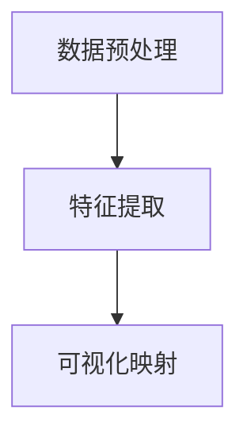

                 

# AI辅助科学可视化中的提示词设计

> 关键词：AI、科学可视化、提示词设计、算法、系统架构、实战案例

> 摘要：
随着人工智能技术的发展，AI辅助科学可视化正逐渐成为科学研究的重要工具。本文首先介绍了AI辅助科学可视化的背景和问题，接着探讨了提示词设计的基本原则和策略，然后深入分析了数据预处理、特征提取和可视化映射的算法原理，并设计了一套完整的系统架构。通过实战案例，展示了如何有效应用这些算法和设计原则，最终提出了最佳实践建议和注意事项。

----------------------------------------------------------------

## 第1章：引言与背景

### 1.1 问题背景

科学可视化（Scientific Visualization）是利用计算机技术将科学数据转化为图像、动画和交互式可视化，帮助科学家更好地理解和解释复杂的科学现象。随着科学研究的深入，数据规模和复杂度不断增加，传统的可视化手段已经难以满足需求。此时，人工智能（Artificial Intelligence，AI）技术的引入为科学可视化带来了新的可能。

AI技术具有强大的数据处理和分析能力，可以自动地从大量科学数据中提取关键信息，进行数据预处理、特征提取和可视化映射。这使得科学家能够更加高效地探索数据，发现数据中的隐藏模式，从而推动科学研究的进展。

### 1.2 问题描述

在AI辅助科学可视化中，如何设计有效的提示词（Prompt Design）是一个关键问题。提示词是引导AI系统理解和处理数据的重要工具，它能够直接影响AI系统对数据的理解深度和可视化效果。

有效的提示词设计需要考虑以下几个方面的挑战和难点：

1. **明确性**：提示词需要清晰明确，以便AI系统能够准确地理解和处理数据。
2. **精确性**：提示词需要精确，避免产生误导或错误的解读。
3. **完整性**：提示词需要涵盖所有关键信息，确保数据处理的完整性。
4. **易用性**：提示词需要易于使用，方便用户进行交互和调整。

### 1.3 问题解决

为了解决上述问题，我们需要从以下几个方面进行研究和实践：

1. **研究现状与趋势分析**：了解当前AI辅助科学可视化中提示词设计的最新研究进展和趋势。
2. **提示词设计的基本原则**：总结和归纳有效提示词设计的基本原则，为后续设计提供指导。
3. **提示词设计的策略**：提出具体的提示词设计策略，包括用户需求分析、数据驱动和专家经验等方法。

### 1.4 边界与外延

1. **提示词设计在不同领域的应用与差异**：提示词设计在不同领域（如生物、物理、化学等）的应用和差异。
2. **提示词设计的伦理与法律问题**：提示词设计过程中涉及的伦理和法律问题，如数据隐私、知识产权等。

### 1.5 概念结构与核心要素组成

**提示词**：是引导AI系统理解和处理数据的关键术语，通常是一个短语或句子。

**可视化**：是将数据转化为图像、动画和交互式可视化，以帮助科学家理解和解释数据。

本文将围绕提示词设计这一核心问题，逐步探讨AI辅助科学可视化的相关技术，旨在为读者提供一套完整、实用的解决方案。

---------------------------------------------

## 第2章：AI辅助科学可视化的基本概念

### 2.1 AI与科学可视化

**AI技术简介**

人工智能（Artificial Intelligence，AI）是指计算机系统模拟人类智能行为的技术，包括机器学习、深度学习、自然语言处理、计算机视觉等。这些技术使得计算机能够自动地从数据中学习、推理和决策，从而完成复杂的任务。

**科学可视化简介**

科学可视化（Scientific Visualization）是利用计算机图形学和图像处理技术，将科学数据转化为图形、图像和动画等可视化形式，以便于科学家更好地理解和解释科学现象。科学可视化不仅能够增强科学研究的直观性，还能够发现数据中的隐藏模式和关系。

**AI与科学可视化的关系**

AI技术为科学可视化提供了强大的支持。通过机器学习和深度学习，AI能够自动地从大量科学数据中提取关键信息，进行数据预处理、特征提取和可视化映射。这使得科学家能够更加高效地探索数据，发现数据中的隐藏模式。同时，AI技术还能够实现智能化的交互式可视化，提高用户的体验和效率。

### 2.2 提示词设计的基本原则

**明确性**

提示词需要清晰明确，以便AI系统能够准确地理解和处理数据。明确性的要求包括：

- 提示词语言简洁明了，避免使用复杂、模糊的术语。
- 提示词中的关键词需要准确，避免产生歧义。

**精确性**

提示词需要精确，避免产生误导或错误的解读。精确性的要求包括：

- 提示词需要涵盖所有关键信息，确保数据处理的完整性。
- 避免提示词中的信息过于宽泛或模糊，导致AI系统无法准确理解。

**完整性**

提示词需要涵盖所有关键信息，确保数据处理的完整性。完整性的要求包括：

- 提示词需要包含数据来源、数据类型、数据规模等关键信息。
- 避免遗漏重要数据或特征，导致数据处理结果不完整。

**易用性**

提示词需要易于使用，方便用户进行交互和调整。易用性的要求包括：

- 提示词设计应考虑用户的背景和需求，使其易于理解和操作。
- 提供丰富的交互选项，如调整参数、切换视图等，以便用户自定义可视化结果。

### 2.3 提示词设计的策略

**用户需求分析**

在提示词设计过程中，需要深入了解用户的需求，包括研究目标、研究领域、数据特点等。通过用户需求分析，可以确定合适的提示词内容，以满足用户的需求。

**数据驱动**

数据驱动是指根据数据特点进行提示词设计。通过分析数据类型、数据规模、数据分布等，确定合适的预处理、特征提取和可视化映射方法。数据驱动能够确保提示词设计更加贴近实际应用场景。

**专家经验**

专家经验是指借助领域专家的丰富经验进行提示词设计。领域专家对数据、算法和可视化方法有深入的理解，能够提供有价值的建议和指导。结合专家经验，可以优化提示词设计，提高可视化效果。

### 2.4 总结

本章介绍了AI辅助科学可视化的基本概念，包括AI技术、科学可视化和AI与科学可视化的关系。同时，讨论了提示词设计的基本原则和策略，为后续的深入探讨奠定了基础。

---------------------------------------------

## 第3章：提示词设计的核心概念与联系

### 3.1 核心概念

**数据预处理**

数据预处理（Data Preprocessing）是指对原始数据进行清洗、归一化、缺失值处理等操作，以提高数据质量和适合后续处理。在AI辅助科学可视化中，数据预处理是关键步骤，直接影响可视化效果和准确性。

- **描述**：数据预处理包括数据清洗、归一化、缺失值处理等。
- **属性特征**：输入数据质量、数据规模、数据分布等。

**特征提取**

特征提取（Feature Extraction）是从原始数据中提取关键信息，以减少数据维度、提高数据质量和可视化效果。特征提取是AI辅助科学可视化中的重要环节，能够帮助用户更好地理解和分析数据。

- **描述**：特征提取包括主成分分析、自编码器等。
- **属性特征**：特征多样性、特征重要性、特征可解释性。

**可视化映射**

可视化映射（Visualization Mapping）是将提取的特征映射到可视化空间，以生成可视化结果。可视化映射决定了数据的呈现方式和视觉效果，对用户的理解和分析具有重要影响。

- **描述**：可视化映射包括t-SNE、UMAP等。
- **属性特征**：可视化效果、交互性、可扩展性。

### 3.2 概念属性特征对比表格

| 概念 | 描述 | 属性特征 |
| --- | --- | --- |
| 数据预处理 | 数据清洗、归一化等 | 输入数据质量、数据规模 |
| 特征提取 | 从数据中提取关键信息 | 特征多样性、特征重要性 |
| 可视化映射 | 将特征映射到可视化空间 | 可视化效果、交互性 |

### 3.3 ER实体关系图架构的Mermaid流程图

### 3.4 提示词设计的关键概念与联系

**提示词**：提示词是引导AI系统理解和处理数据的关键工具，贯穿于数据预处理、特征提取和可视化映射的全过程。

- **关系**：提示词在数据预处理阶段用于指导数据清洗和归一化；在特征提取阶段用于选择合适的特征提取方法；在可视化映射阶段用于优化可视化效果和交互性。

**数据预处理**：数据预处理是提示词设计的基础，确保数据的输入质量和完整性。

- **关系**：数据预处理直接影响特征提取和可视化映射的效果，需要根据提示词进行数据清洗、归一化、缺失值处理等操作。

**特征提取**：特征提取是提示词设计的核心，通过提取关键信息，提高数据质量和可视化效果。

- **关系**：特征提取方法的选择和优化需要依据提示词中的关键信息，如数据类型、特征重要性等。

**可视化映射**：可视化映射是提示词设计的最终目标，将提取的特征映射到可视化空间，以生成直观、易懂的可视化结果。

- **关系**：可视化映射的优化需要依据提示词中的关键信息，如可视化效果、交互性等。

### 3.5 总结

本章介绍了AI辅助科学可视化中的关键概念，包括数据预处理、特征提取和可视化映射。通过对比表格和Mermaid流程图，阐述了这些概念之间的联系和作用。同时，分析了提示词设计在数据预处理、特征提取和可视化映射中的关键作用，为后续的深入探讨奠定了基础。

---------------------------------------------

## 第4章：算法原理讲解

### 4.1 数据预处理算法

数据预处理算法是AI辅助科学可视化中的关键步骤，其目的是提高数据质量和适合后续处理。以下介绍几种常见的数据预处理算法：

**数据清洗**

数据清洗（Data Cleaning）是指对原始数据进行清洗、去除错误或异常数据，以提高数据质量。数据清洗的主要方法包括：

- **缺失值处理**：缺失值处理（Missing Value Handling）是指对缺失的数据进行处理，常见的方法有填补、删除、插值等。
- **异常值处理**：异常值处理（Outlier Handling）是指对异常数据进行处理，常见的方法有删除、修正、隔离等。

**归一化**

归一化（Normalization）是指将不同尺度的数据进行标准化处理，以便于后续分析。常见的归一化方法有：

- **最小-最大归一化**：将数据缩放到[0,1]范围内。
- **Z-Score归一化**：将数据缩放到[-1,1]范围内。

**标准化**

标准化（Standardization）是指将数据缩放到标准正态分布范围内，即均值为0，标准差为1。常用的标准化公式为：

$$
X_{\text{标准化}} = \frac{X - \mu}{\sigma}
$$

其中，$X$为原始数据，$\mu$为均值，$\sigma$为标准差。

### 4.2 特征提取算法

特征提取算法是从原始数据中提取关键信息，以减少数据维度、提高数据质量和可视化效果。以下介绍几种常见的特征提取算法：

**主成分分析（PCA）**

主成分分析（Principal Component Analysis，PCA）是一种常用的降维算法，通过将数据投影到新的正交坐标系中，提取主要成分。PCA的主要步骤包括：

- **协方差矩阵计算**：计算数据的协方差矩阵。
- **特征值和特征向量计算**：计算协方差矩阵的特征值和特征向量。
- **主成分排序**：将特征向量按照特征值从大到小排序。
- **主成分投影**：将数据投影到前几个主成分上，实现降维。

**自编码器（AE）**

自编码器（Autoencoder，AE）是一种无监督学习算法，通过学习一个压缩表示，然后重构原始数据。自编码器的主要步骤包括：

- **编码器学习**：学习数据的压缩表示，通常使用神经网络实现。
- **解码器学习**：学习数据的重构，将压缩表示还原为原始数据。

### 4.3 可视化映射算法

可视化映射算法是将提取的特征映射到可视化空间，以生成直观、易懂的可视化结果。以下介绍几种常见

