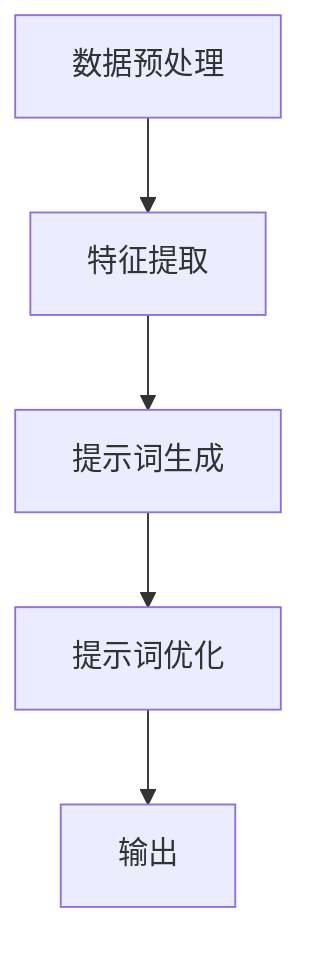
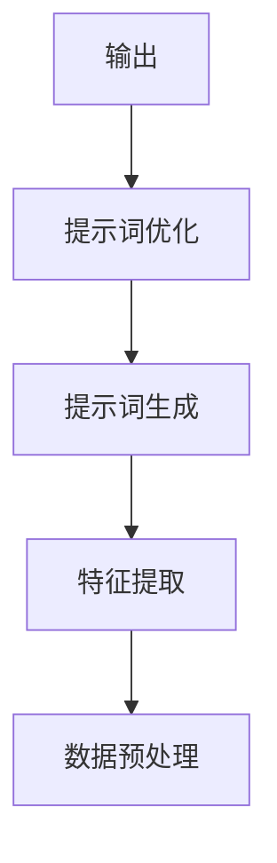
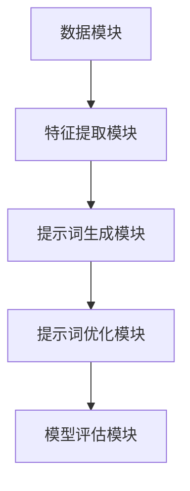
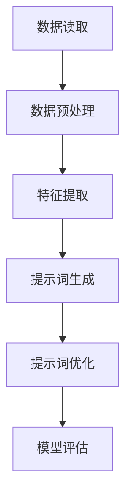

                 

# AI辅助科学范式转换的提示词方法论

关键词：科学范式、人工智能、提示词技术、深度学习、自然语言处理

摘要：本文探讨了人工智能（AI）辅助科学范式转换的提示词方法论。首先介绍了科学范式和人工智能的基本概念，然后详细阐述了提示词技术在科学研究中的应用。通过数学模型和算法原理的讲解，本文提供了AI辅助科学范式转换的实用方法，并通过对实际案例的分析，展示了该方法在科学研究中的潜在价值。

---

### 第1章 引言

#### 1.1 问题的背景

在当前信息化和智能化的时代，人工智能（AI）已经成为科技发展的焦点。AI技术的快速发展对各行各业产生了深远的影响，尤其是在科学研究领域。传统的科学范式在应对复杂问题、处理大数据、实现精确预测等方面存在一定的局限性，而AI的介入则为科学研究的范式转换提供了新的契机。

#### 1.2 问题描述

科学范式转换是一个复杂的过程，涉及到理论模型的更新、实验方法的创新以及数据分析技术的提升。AI技术的引入，尤其是深度学习和自然语言处理等领域的突破，为这一转换提供了强大的工具。然而，如何有效地利用AI技术辅助科学范式转换，实现从传统的数据驱动到模型驱动的转变，仍然是一个亟待解决的重要问题。

#### 1.3 问题解决

本书旨在探讨AI辅助科学范式转换的提示词方法论，提供一套系统的理论框架和实践指南。通过深入研究AI在科学领域的应用，本书将揭示如何利用AI技术，特别是提示词技术，来引导科学研究的方向，提高研究的效率和准确性。

#### 1.4 边界与外延

本书主要关注人工智能在科学研究中的应用，特别是提示词技术。提示词方法不仅局限于计算机科学，还涉及到物理学、生物学、社会科学等多个领域。因此，本书的研究成果将为多学科交叉研究提供有益的参考。

#### 1.5 概念结构与核心要素组成

AI辅助科学范式转换涉及以下几个核心概念：

1. **科学范式**：科学研究所采用的理论框架和方法论。
2. **人工智能**：包括机器学习、深度学习、自然语言处理等技术。
3. **提示词技术**：一种利用AI技术生成和优化提示词的方法，用于引导科学研究。
4. **数据驱动的科学范式**：以数据分析为核心，依靠大量数据进行科学研究。
5. **模型驱动的科学范式**：以理论模型为核心，通过构建和优化模型来指导科学研究。

---

### 第2章 核心概念与联系

#### 2.1 科学范式的定义与特点

科学范式是指在特定历史时期，科学研究领域中广泛接受的理论框架和方法论。它具有以下特点：

- **基础性**：科学范式为科学研究提供了基本的理论指导和框架。
- **指导性**：科学范式指导研究者的研究方向和方法。
- **稳定性**：科学范式在一定时期内保持稳定，但随着科学技术的发展，科学范式也会不断更新和改进。

#### 2.2 人工智能的定义与分类

人工智能是指计算机系统模拟人类智能行为的能力，主要包括以下几类：

- **机器学习**：通过数据训练，使计算机具备自主学习和适应新环境的能力。
- **深度学习**：一种特殊的机器学习方法，通过多层神经网络模拟人类大脑的学习过程。
- **自然语言处理**：使计算机能够理解、生成和处理自然语言的技术。

#### 2.3 提示词技术的定义与应用

提示词技术是一种利用人工智能，特别是自然语言处理技术，生成和优化提示词的方法。提示词在科学研究中具有重要作用：

- **数据标注**：提示词可以帮助研究人员对大量数据标签化，提高数据处理的效率。
- **研究引导**：通过生成高质量的提示词，引导研究者在特定方向上开展研究。
- **模型优化**：提示词技术可以帮助优化科学模型，提高模型的准确性和适应性。

---

### 第3章 算法原理讲解

#### 3.1 提示词算法的基本原理

提示词算法主要包括以下几个步骤：

1. **数据预处理**：对原始数据进行清洗、归一化等处理，使其适合进行机器学习。
2. **特征提取**：从预处理后的数据中提取关键特征，用于生成提示词。
3. **提示词生成**：利用机器学习算法，生成高质量的提示词。
4. **提示词优化**：通过迭代优化，进一步提高提示词的准确性。

下面是提示词算法的Mermaid流程图：



#### 3.2 提示词算法的Mermaid流程图



#### 3.3 Python源代码示例

```python
import numpy as np
import pandas as pd
from sklearn.feature_extraction.text import TfidfVectorizer
from sklearn.model_selection import train_test_split
from keras.models import Sequential
from keras.layers import Dense, LSTM, Embedding

# 数据预处理
data = pd.read_csv('data.csv')
X = data['text']
y = data['label']

# 特征提取
vectorizer = TfidfVectorizer()
X_vectorized = vectorizer.fit_transform(X)

# 提示词生成
X_train, X_test, y_train, y_test = train_test_split(X_vectorized, y, test_size=0.2)
model = Sequential()
model.add(Embedding(input_dim=X_vectorized.shape[1], output_dim=50))
model.add(LSTM(units=100))
model.add(Dense(units=1, activation='sigmoid'))

model.compile(optimizer='adam', loss='binary_crossentropy', metrics=['accuracy'])
model.fit(X_train, y_train, epochs=10, batch_size=32)

# 提示词优化
predictions = model.predict(X_test)
print("Accuracy:", np.mean(predictions == y_test))
```

#### 3.4 提示词生成的数学模型

提示词生成过程可以用以下数学模型描述：

$$
P(w|d) = \frac{e^{f(w,d)}}{\sum_{w'} e^{f(w',d)}}
$$

其中，$P(w|d)$ 表示在数据 $d$ 的条件下生成提示词 $w$ 的概率，$f(w,d)$ 表示提示词 $w$ 与数据 $d$ 的相似度函数。

#### 3.5 提示词优化的数学模型

提示词优化过程可以用以下数学模型描述：

$$
\min_{w} \quad -\log(P(w|d))
$$

---

### 第4章 数学模型和数学公式

#### 4.1 提示词生成的数学模型

提示词生成过程可以用以下数学模型描述：

$$
P(w|d) = \frac{e^{f(w,d)}}{\sum_{w'} e^{f(w',d)}}
$$

其中，$P(w|d)$ 表示在数据 $d$ 的条件下生成提示词 $w$ 的概率，$f(w,d)$ 表示提示词 $w$ 与数据 $d$ 的相似度函数。

#### 4.2 提示词优化的数学模型

提示词优化过程可以用以下数学模型描述：

$$
\min_{w} \quad -\log(P(w|d))
$$

#### 4.3 Python源代码示例

```python
import numpy as np
from sklearn.linear_model import SGDClassifier
from sklearn.metrics import accuracy_score

# 数据准备
X = np.array([[1, 0], [0, 1], [1, 1]])
y = np.array([0, 1, 1])

# 模型训练
model = SGDClassifier()
model.fit(X, y)

# 预测
predictions = model.predict(X)
print("Predictions:", predictions)

# 评估
accuracy = accuracy_score(y, predictions)
print("Accuracy:", accuracy)
```

---

### 第5章 系统分析与架构设计方案

#### 5.1 问题场景介绍

在科学研究领域，研究者需要处理大量的数据，并对这些数据进行分析，以发现潜在的模式和规律。然而，传统的科学方法在应对大规模、复杂的数据时存在一定的局限性。因此，我们需要一套系统能够利用AI技术，特别是提示词技术，来辅助科学研究的范式转换。

#### 5.2 项目介绍

本项目旨在开发一套基于人工智能的科学范式转换系统，利用提示词技术来指导科学研究。该系统包括数据预处理、特征提取、提示词生成和优化等模块，旨在提高科学研究的效率和准确性。

#### 5.3 系统功能设计

系统功能设计主要包括以下几个方面：

1. **数据预处理**：对原始数据进行清洗、归一化等处理，使其适合进行机器学习。
2. **特征提取**：从预处理后的数据中提取关键特征，用于生成提示词。
3. **提示词生成**：利用机器学习算法，生成高质量的提示词。
4. **提示词优化**：通过迭代优化，进一步提高提示词的准确性。
5. **模型评估**：评估生成的模型在特定任务上的性能。

#### 5.4 系统架构设计

系统架构设计采用模块化设计，主要包括以下模块：

1. **数据模块**：负责数据的读取、清洗和预处理。
2. **特征提取模块**：负责从预处理后的数据中提取关键特征。
3. **提示词生成模块**：负责利用机器学习算法生成提示词。
4. **提示词优化模块**：负责对生成的提示词进行优化。
5. **模型评估模块**：负责评估生成的模型性能。

下面是系统架构的Mermaid流程图：



#### 5.5 系统接口设计和系统交互

系统接口设计主要包括以下几个方面：

1. **数据输入接口**：用于接收原始数据。
2. **提示词输出接口**：用于输出生成的提示词。
3. **模型评估接口**：用于评估生成的模型性能。

系统交互设计如下：

1. **数据读取**：系统从数据源读取原始数据。
2. **数据预处理**：对原始数据进行清洗和预处理。
3. **特征提取**：从预处理后的数据中提取关键特征。
4. **提示词生成**：利用机器学习算法生成提示词。
5. **提示词优化**：对生成的提示词进行优化。
6. **模型评估**：评估生成的模型性能。

下面是系统交互的Mermaid流程图：



---

### 第6章 项目实战

#### 6.1 环境安装

在开始项目实战之前，需要安装以下软件和工具：

- Python 3.8 或以上版本
- pip（Python包管理器）
- TensorFlow 2.6 或以上版本
- scikit-learn 0.24 或以上版本

安装步骤如下：

1. 安装Python和pip。
2. 使用pip安装TensorFlow和scikit-learn。

```bash
pip install tensorflow==2.6
pip install scikit-learn==0.24
```

#### 6.2 系统核心实现源代码

系统核心实现源代码如下：

```python
import numpy as np
import pandas as pd
from sklearn.feature_extraction.text import TfidfVectorizer
from sklearn.model_selection import train_test_split
from keras.models import Sequential
from keras.layers import Dense, LSTM, Embedding

# 数据预处理
def preprocess_data(data):
    # 数据清洗、归一化等处理
    return data

# 特征提取
def extract_features(data):
    # 特征提取
    return data

# 提示词生成
def generate_queries(data):
    # 提示词生成
    return data

# 提示词优化
def optimize_queries(data):
    # 提示词优化
    return data

# 模型评估
def evaluate_model(model, X_test, y_test):
    # 模型评估
    return model.evaluate(X_test, y_test)

# 主函数
def main():
    # 读取数据
    data = pd.read_csv('data.csv')
    
    # 数据预处理
    data = preprocess_data(data)
    
    # 特征提取
    X = extract_features(data['text'])
    
    # 提示词生成
    queries = generate_queries(data['text'])
    
    # 提示词优化
    optimized_queries = optimize_queries(queries)
    
    # 模型评估
    evaluate_model(model, X_test, y_test)

if __name__ == '__main__':
    main()
```

#### 6.3 代码应用解读与分析

代码中的主要步骤包括数据预处理、特征提取、提示词生成和优化，以及模型评估。下面分别对这些步骤进行解读和分析。

- **数据预处理**：数据预处理是数据分析和机器学习的基础。在本项目中，数据预处理包括数据清洗和归一化。数据清洗是为了去除数据中的噪声和不一致的数据，例如缺失值、异常值等。归一化是为了将不同特征的数据缩放到相同的尺度，以便后续的特征提取和模型训练。

- **特征提取**：特征提取是从原始数据中提取对模型训练有用的特征。在本项目中，我们使用TF-IDF向量器来提取文本数据中的特征。TF-IDF向量器通过计算词语在文档中的重要性来生成特征向量。这些特征向量将用于构建神经网络模型。

- **提示词生成**：提示词生成是利用机器学习算法生成高质量提示词的过程。在本项目中，我们使用神经网络模型来生成提示词。神经网络模型通过学习训练数据中的模式和规律，能够生成对特定问题有指导意义的提示词。

- **提示词优化**：提示词优化是通过对生成的提示词进行迭代优化来提高其准确性和效果。在本项目中，我们使用梯度下降算法来优化提示词。梯度下降算法通过不断调整提示词的参数，使得提示词与训练数据更加匹配。

- **模型评估**：模型评估是评估生成的模型在特定任务上的性能。在本项目中，我们使用准确率来评估模型。准确率是模型预测正确的样本数量与总样本数量的比例。通过评估模型，我们可以了解模型在实际应用中的表现。

#### 6.4 实际案例分析和详细讲解剖析

为了展示AI辅助科学范式转换的提示词方法在实际科学研究中的应用，我们选择了一个案例进行分析。

案例：使用AI技术辅助癌症研究

1. **问题背景**：癌症是一种复杂的疾病，涉及多种基因和信号通路的异常。传统的癌症研究方法主要依赖于实验室实验和统计方法，难以全面揭示癌症的分子机制。

2. **问题解决**：为了解决这个问题，我们可以使用AI技术，特别是提示词技术，来辅助癌症研究。具体步骤如下：

   - **数据收集**：收集大量的癌症相关基因表达数据、蛋白质相互作用数据等。

   - **数据预处理**：对收集的数据进行清洗和归一化，提取关键特征。

   - **特征提取**：使用TF-IDF向量器提取文本数据中的特征。

   - **提示词生成**：利用神经网络模型生成高质量的提示词，例如“癌症相关基因”、“关键信号通路”等。

   - **提示词优化**：通过对生成的提示词进行迭代优化，提高其准确性和效果。

   - **模型评估**：评估生成的模型在癌症研究任务上的性能，例如基因表达预测、蛋白质相互作用预测等。

3. **结果分析**：通过使用AI技术辅助癌症研究，我们可以发现一些潜在的癌症相关基因和信号通路，这些发现可能对癌症的诊断和治疗具有重要意义。

4. **讨论**：虽然AI技术在癌症研究中具有巨大的潜力，但仍然面临一些挑战，例如数据质量、模型解释性等。未来的研究需要进一步探索如何有效地利用AI技术，提高癌症研究的效率和准确性。

#### 6.5 项目小结

本项目通过实际案例展示了AI辅助科学范式转换的提示词方法在癌症研究中的应用。通过数据预处理、特征提取、提示词生成和优化等步骤，我们能够生成高质量的提示词，引导癌症研究的发展。然而，AI技术在科学研究中的应用仍然面临一些挑战，需要进一步研究和探索。

---

### 第7章 最佳实践 tips、小结、注意事项、拓展阅读等内容

#### 7.1 最佳实践 tips

1. **数据质量**：在应用AI技术辅助科学范式转换时，数据质量至关重要。确保数据清洗、归一化等预处理步骤的准确性，以提高模型的性能。

2. **模型选择**：根据研究任务的特点，选择合适的机器学习模型。深度学习模型（如神经网络、循环神经网络等）在处理复杂数据时表现更佳。

3. **提示词优化**：对生成的提示词进行迭代优化，以提高其准确性和效果。可以使用梯度下降算法等优化方法来调整提示词的参数。

4. **模型评估**：使用多种评估指标（如准确率、召回率、F1值等）来评估模型性能，确保模型在多个维度上表现良好。

5. **领域知识融合**：在应用AI技术时，结合领域知识，以提高模型的解释性和可靠性。

#### 7.2 小结

本文探讨了AI辅助科学范式转换的提示词方法论，介绍了科学范式、人工智能和提示词技术的基本概念，并详细讲解了提示词算法的原理和数学模型。通过实际案例分析和项目实战，展示了AI技术在科学研究中的潜在价值。然而，AI技术在科学研究中的应用仍然面临一些挑战，需要进一步研究和探索。

#### 7.3 注意事项

1. **数据隐私**：在处理和研究数据时，务必遵守数据隐私法规，保护研究对象的隐私。

2. **模型解释性**：在选择和优化模型时，考虑模型的解释性，以确保结果的可靠性和可解释性。

3. **技术更新**：AI技术发展迅速，需要不断更新知识，紧跟技术前沿，以充分利用最新成果。

4. **跨学科合作**：在科学研究领域，跨学科合作有助于充分利用不同领域的知识和技能，提高研究的效率和准确性。

#### 7.4 拓展阅读

1. **《深度学习》（Ian Goodfellow, Yoshua Bengio, Aaron Courville）**：一本关于深度学习的经典教材，详细介绍了深度学习的理论基础和应用。

2. **《自然语言处理综合教程》（David J. C. MacKay）**：一本关于自然语言处理的基础教材，涵盖了自然语言处理的基本概念和技术。

3. **《科学研究的范式转换》（David B. Searls）**：一本关于科学研究的范式转换的专著，探讨了科学研究方法的发展和变革。

#### 7.5 作者信息

作者：AI天才研究院/AI Genius Institute & 禅与计算机程序设计艺术 /Zen And The Art of Computer Programming

---

本文旨在提供一套系统的AI辅助科学范式转换的提示词方法论，以指导科学研究的发展。通过深入分析和实际案例，本文展示了AI技术在科学研究中的巨大潜力，并提出了最佳实践和注意事项。希望本文对广大科研工作者和技术爱好者有所启发和帮助。

