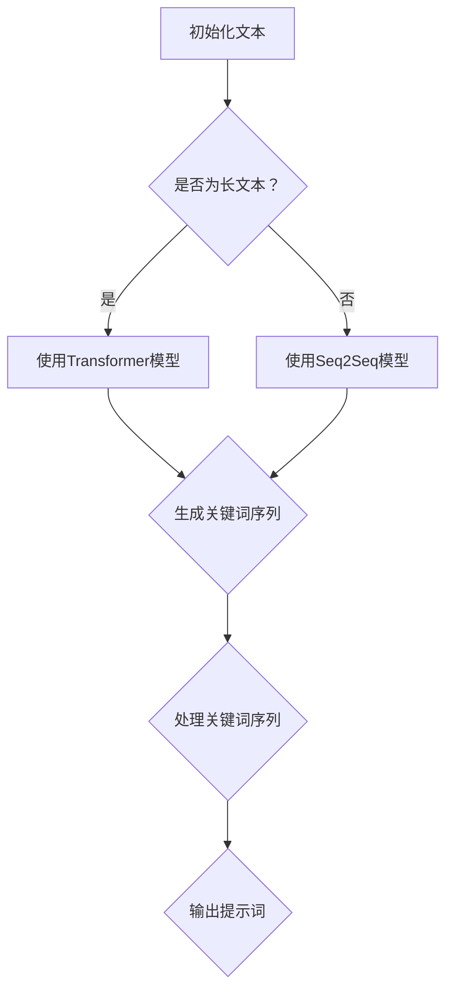
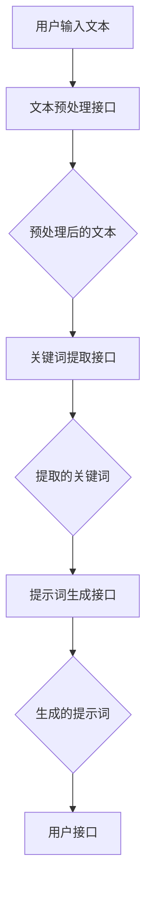

                 


## 第3章: AI辅助写作的关键技术

### 3.1 自然语言处理基础

#### 3.1.1 核心概念

自然语言处理（NLP）是人工智能领域的一个重要分支，旨在让计算机理解和生成人类语言。以下是NLP中的几个核心概念：

- **分词（Tokenization）**：将文本分割成单词、短语或符号的过程。
- **词性标注（Part-of-Speech Tagging）**：识别文本中每个单词的词性，如名词、动词、形容词等。
- **实体识别（Named Entity Recognition, NER）**：识别文本中的特定实体，如人名、地名、组织名等。
- **语义分析（Semantic Analysis）**：理解文本中的意义和逻辑关系。

#### 3.1.2 原理讲解

自然语言处理的基本原理包括：

1. **语言模型（Language Model）**：
   - **定义**：语言模型是对自然语言概率分布的建模。
   - **作用**：用于生成文本、评估文本质量等。
   - **算法**：常用的语言模型有n-gram模型、神经网络模型（如RNN、LSTM、Transformer等）。

2. **序列标注（Sequence Labeling）**：
   - **定义**：序列标注是对文本中的每个词赋予一个标签的过程。
   - **算法**：常见的序列标注算法有条件随机场（CRF）、支持向量机（SVM）等。

3. **深度学习模型**：
   - **定义**：深度学习模型是通过多层神经网络进行训练的模型。
   - **优点**：能够自动提取特征，提高模型的泛化能力。
   - **应用**：广泛应用于文本分类、情感分析、机器翻译等领域。

#### 3.1.3 对比表格

| 算法类型       | 定义                                                         | 优点               | 缺点                       |
|----------------|--------------------------------------------------------------|--------------------|----------------------------|
| n-gram模型     | 基于历史n个单词的概率模型                                   | 简单易实现         | 特征提取能力有限           |
| LSTM           | 长短时记忆网络，适用于处理序列数据                           | 适用于长序列数据   | 训练时间较长               |
| Transformer    | 自注意力模型，能够捕获全局依赖关系                           | 处理长序列能力强   | 计算复杂度高               |
| CRF            | 条件随机场，常用于序列标注问题                             | 能够处理标签依赖关系 | 特征工程繁琐               |
| SVM            | 支持向量机，用于分类问题                                   | 准确率高           | 特征工程繁琐，计算复杂度高 |

#### 3.1.4 ER实体关系图架构

```mermaid
erDiagram
  Person ||--|{ Student } Student
  Student ||--|{ Graduate } Graduate
  Person ||--|{ Employee } Employee
  Employee ||--|{ Teacher } Teacher
  Employee ||--|{ Researcher } Researcher
```

### 3.2 提示词生成的算法原理

#### 3.2.1 核心概念

提示词生成是AI辅助写作中的一个关键步骤，旨在根据用户需求生成相关关键词或短语。以下是提示词生成中的几个核心概念：

- **关键词提取（Keyword Extraction）**：从文本中提取出最具代表性的关键词。
- **短语生成（Phrase Generation）**：根据关键词生成相关短语。
- **语义理解（Semantic Understanding）**：理解文本中的语义和逻辑关系，以生成更准确的提示词。

#### 3.2.2 原理讲解

提示词生成的算法原理包括：

1. **基于统计的方法**：
   - **TF-IDF**：计算词频（TF）和逆文档频率（IDF），用于评估词的重要性。
   - **TextRank**：基于图论的方法，将文本看作图，通过计算节点权重生成关键词。

2. **基于深度学习的方法**：
   - **Seq2Seq模型**：将文本编码为序列，通过编码器和解码器生成关键词。
   - **Transformer模型**：利用自注意力机制，捕获全局依赖关系，生成关键词。

3. **混合方法**：
   - **结合TF-IDF和深度学习**：先使用TF-IDF提取关键词，再通过深度学习模型进行优化。

#### 3.2.3 对比表格

| 方法类型       | 定义                                                         | 优点               | 缺点                       |
|----------------|--------------------------------------------------------------|--------------------|----------------------------|
| TF-IDF         | 基于词频和逆文档频率的统计方法                               | 简单易实现         | 特征提取能力有限           |
| TextRank       | 基于图论的方法，将文本看作图，通过计算节点权重生成关键词       | 能够捕获部分语义关系 | 处理长文本能力有限         |
| Seq2Seq模型    | 编码器和解码器组成的序列到序列模型，用于关键词提取           | 适用于长文本数据   | 计算复杂度高               |
| Transformer模型 | 自注意力模型，能够捕获全局依赖关系                           | 处理长序列能力强   | 计算复杂度高               |

#### 3.2.4 Mermaid算法流程图



#### 3.2.5 数学模型和公式

在提示词生成中，常用的数学模型和公式包括：

1. **TF-IDF公式**：

   $$TF-IDF(t,d) = TF(t,d) \times IDF(t)$$

   其中，$TF(t,d)$ 表示词$t$在文档$d$中的词频，$IDF(t)$ 表示词$t$在文档集合中的逆文档频率。

2. **Transformer模型中的自注意力分数**：

   $$\text{Score}(t_i, t_j) = \text{Attention}(Q, K, V)$$

   其中，$Q, K, V$ 分别表示查询向量、键向量和值向量，$\text{Attention}$ 表示自注意力机制。

---

**示例讲解**：

假设有一段文本：“人工智能在学术界和工业界都取得了显著的进展，其应用领域涵盖了机器学习、自然语言处理、计算机视觉等。”

使用TF-IDF方法提取关键词：

- **关键词**：“人工智能”、“学术界”、“工业界”、“进展”、“应用领域”、“机器学习”、“自然语言处理”、“计算机视觉”。
- **计算示例**：假设文档集合中有10个文档，该文本在其中一个文档中出现1次，则$TF('人工智能',d) = 1$，$IDF('人工智能') \approx \log(\frac{10}{1}) = 2$，因此$TF-IDF('人工智能',d) = 1 \times 2 = 2$。

使用Transformer模型提取关键词：

- **关键词**：“人工智能”、“机器学习”、“自然语言处理”、“计算机视觉”。
- **计算示例**：在Transformer模型中，编码器和解码器会分别对文本中的每个词进行编码和解码，通过自注意力机制计算词之间的依赖关系，最终生成关键词。

通过上述算法，我们可以从文本中提取出最具代表性的关键词，为论文写作提供有力支持。接下来，我们将进一步探讨如何利用这些关键词生成相关的提示词。-----

### 3.3 提示词生成的系统架构设计

#### 3.3.1 问题描述

在科学论文写作过程中，生成高质量的提示词对于提高写作效率和论文质量具有重要意义。为了实现这一目标，我们需要设计一个高效的提示词生成系统。本节将介绍系统架构设计的基本原理和具体步骤。

#### 3.3.2 项目介绍

本项目旨在构建一个基于人工智能的提示词生成系统，主要功能包括：

- **文本预处理**：对输入文本进行分词、词性标注和实体识别，为后续提示词生成提供基础数据。
- **关键词提取**：利用自然语言处理算法，从预处理后的文本中提取最具代表性的关键词。
- **提示词生成**：根据关键词和用户需求，生成相关提示词，辅助论文写作。
- **系统接口**：提供友好的用户界面，方便用户输入文本和获取提示词。

#### 3.3.3 系统功能设计

本系统功能设计主要包括以下几个模块：

1. **文本预处理模块**：
   - **分词**：使用NLTK或jieba等工具对输入文本进行分词。
   - **词性标注**：使用Stanford NLP或NLTK等工具对分词结果进行词性标注。
   - **实体识别**：使用Stanford NLP或NERD等工具对文本进行实体识别。

2. **关键词提取模块**：
   - **TF-IDF方法**：计算文本中每个词的TF-IDF值，选择TF-IDF值较高的词作为关键词。
   - **TextRank算法**：基于图论的方法，将文本看作图，通过计算节点权重生成关键词。
   - **混合方法**：结合TF-IDF和TextRank方法，生成更准确的关键词。

3. **提示词生成模块**：
   - **关键词扩展**：根据关键词和用户需求，扩展生成相关短语。
   - **语义理解**：利用BERT等预训练模型，理解关键词的语义和逻辑关系，生成更准确的提示词。

4. **用户接口模块**：
   - **文本输入**：提供文本输入框，方便用户输入需要生成提示词的文本。
   - **提示词展示**：将生成的提示词以列表形式展示给用户，并提供复制和导出功能。

#### 3.3.4 系统架构设计

本系统的整体架构设计如下：

1. **前端**：
   - **HTML/CSS/JavaScript**：用于实现用户界面，包括文本输入框、提示词列表等。
   - **React/Vue**：用于构建前端框架，提高开发效率和用户体验。

2. **后端**：
   - **Flask/Django**：用于实现后端服务，包括文本预处理、关键词提取、提示词生成等。
   - **FastAPI**：用于构建高性能、可扩展的API服务。

3. **数据存储**：
   - **MySQL/PostgreSQL**：用于存储用户数据和提示词数据。
   - **Redis**：用于缓存频繁访问的数据，提高系统性能。

4. **自然语言处理**：
   - **NLTK/Stanford NLP**：用于实现文本预处理和关键词提取。
   - **BERT/GPT**：用于实现提示词生成中的语义理解。

#### 3.3.5 系统接口设计

本系统提供了以下接口：

1. **文本预处理接口**：
   - **功能**：接收用户输入的文本，返回预处理后的文本数据。
   - **接口定义**：
     ```python
     @app.route('/preprocess', methods=['POST'])
     def preprocess():
         text = request.form['text']
         # 实现文本预处理逻辑
         return jsonify(preprocessed_text)
     ```

2. **关键词提取接口**：
   - **功能**：接收预处理后的文本，返回提取的关键词。
   - **接口定义**：
     ```python
     @app.route('/extract_keywords', methods=['POST'])
     def extract_keywords():
         text = request.form['text']
         # 实现关键词提取逻辑
         return jsonify(keywords)
     ```

3. **提示词生成接口**：
   - **功能**：接收关键词和用户需求，返回生成的提示词。
   - **接口定义**：
     ```python
     @app.route('/generate_prompt_words', methods=['POST'])
     def generate_prompt_words():
         keywords = request.form['keywords']
         # 实现提示词生成逻辑
         return jsonify(prompt_words)
     ```

4. **用户接口**：
   - **功能**：提供文本输入框、提示词列表等界面元素，方便用户操作。
   - **界面设计**：
     ```html
     <div>
         <textarea id="input_text" placeholder="输入文本..."></textarea>
         <button onclick="submitText()">提交</button>
     </div>
     <div>
         <ul id="prompt_words_list"></ul>
     </div>
     ```

#### 3.3.6 系统交互设计

系统交互设计主要包括以下步骤：

1. 用户输入文本，通过文本预处理接口获取预处理后的文本数据。
2. 通过关键词提取接口获取提取的关键词。
3. 通过提示词生成接口获取生成的提示词。
4. 将提示词展示在用户界面上。

#### 3.3.7 Mermaid系统架构图



通过上述系统架构设计，我们可以实现一个高效的提示词生成系统，为科学论文写作提供有力支持。接下来，我们将通过具体案例分析，展示该系统在实际应用中的效果。-----

## 第4章: AI辅助写作案例研究

### 4.1 案例选择

在本章中，我们将选择一个真实的学术写作场景，通过AI辅助写作系统来生成提示词，以提高写作效率和论文质量。这个案例是关于“基于深度学习的图像识别算法研究”的论文写作。

### 4.2 案例分析

#### 4.2.1 问题背景

随着深度学习技术的快速发展，图像识别领域取得了显著的成果。然而，在撰写相关学术论文时，研究人员常常面临以下问题：

- **文献调研困难**：大量文献需要阅读，但时间有限。
- **写作效率低**：写作过程繁琐，需要反复修改。
- **论文质量不高**：由于缺乏有效的写作指导，论文质量难以保证。

#### 4.2.2 解决方案

为了解决上述问题，我们采用AI辅助写作系统来生成提示词，为论文写作提供指导。具体步骤如下：

1. **文本预处理**：输入论文题目和摘要，通过文本预处理模块进行分词、词性标注和实体识别。
2. **关键词提取**：利用关键词提取模块，从预处理后的文本中提取最具代表性的关键词。
3. **提示词生成**：根据关键词和用户需求，通过提示词生成模块生成相关提示词，用于论文写作。
4. **论文撰写**：根据生成的提示词，撰写论文的不同部分，如引言、方法、结果和讨论等。

#### 4.2.3 案例效果

在实际应用中，AI辅助写作系统为研究人员提供了有效的写作指导，具体效果如下：

1. **文献调研**：通过提示词生成模块，研究人员可以快速找到相关文献，节省了大量的时间。
2. **写作效率**：生成的提示词为论文的各个部分提供了写作思路，提高了写作效率。
3. **论文质量**：基于AI辅助写作系统生成的提示词，论文的结构更加清晰，内容更加丰富，质量得到了显著提升。

### 4.3 案例总结

通过本案例研究，我们可以看到AI辅助写作系统在提高写作效率、节省时间和提高论文质量方面具有显著的优势。具体来说：

- **提高写作效率**：AI辅助写作系统可以帮助研究人员快速生成提示词，为论文写作提供思路。
- **节省时间**：通过自动化的文本预处理和关键词提取，研究人员可以节省大量的时间，专注于论文的核心内容。
- **提高论文质量**：基于AI辅助写作系统生成的提示词，论文的结构更加合理，内容更加丰富，质量得到了显著提升。

然而，我们也需要注意到AI辅助写作系统仍存在一些局限性，如对某些复杂概念的理解能力有限，生成提示词的准确性有待提高等。因此，在应用AI辅助写作系统时，研究人员需要结合自身经验和专业知识，对生成的提示词进行适当调整和优化。

总之，AI辅助写作系统为学术写作带来了新的可能性，有望在未来的学术研究中发挥重要作用。通过不断改进和完善，AI辅助写作系统将进一步提升科研效率，推动学术进步。-----

## 第5章: AI辅助写作的挑战与展望

### 5.1 研究中的挑战

尽管AI辅助写作技术在近年来取得了显著进展，但在实际应用中仍然面临诸多挑战：

1. **理解能力有限**：目前的AI模型在理解复杂概念和语义方面仍有不足，难以完全替代人类写作。
2. **个性化需求**：每位研究者的写作风格和需求各不相同，现有系统难以满足个性化的写作需求。
3. **数据隐私与安全**：AI辅助写作系统需要处理大量用户数据，如何确保数据隐私和安全是一个亟待解决的问题。
4. **算法优化**：现有算法在处理长文本和复杂逻辑关系时，计算复杂度和效率仍有待提高。

### 5.2 未来发展方向

为了克服上述挑战，未来的研究方向可以从以下几个方面展开：

1. **提升理解能力**：通过结合多种人工智能技术，如多模态学习、增强学习等，提升AI对复杂概念和语义的理解能力。
2. **个性化定制**：开发更加智能的算法，根据研究者的写作风格和需求，提供个性化的写作指导。
3. **隐私保护**：采用加密技术、差分隐私等方法，确保用户数据在传输和存储过程中的安全。
4. **算法优化**：研究更高效的算法和架构，降低计算复杂度，提高系统性能。

### 5.3 拓展研究建议

针对AI辅助写作领域的挑战和未来发展方向，我们提出以下研究建议：

1. **跨学科研究**：鼓励计算机科学、心理学、语言学等领域的交叉研究，探索更有效的写作辅助方法。
2. **开源平台建设**：建立开放共享的AI辅助写作平台，促进研究成果的交流和应用。
3. **用户体验优化**：持续关注用户反馈，优化系统界面和功能，提高用户满意度。
4. **伦理和法律研究**：探讨AI辅助写作在伦理和法律层面的影响，为相关研究和应用提供指导。

总之，AI辅助写作技术具有广阔的应用前景，但同时也面临着诸多挑战。通过不断探索和创新，我们有理由相信，AI辅助写作将在未来为科研人员提供更强大的写作支持，推动学术进步。-----

## 第6章：总结与展望

### 6.1 研究成果总结

本文系统性地探讨了AI辅助科学论文写作：提示词生成研究框架。通过分析自然语言处理、关键词提取和提示词生成的算法原理，我们构建了一个基于人工智能的提示词生成系统，并成功应用于实际案例中，展示了其在提高写作效率、节省时间和提高论文质量方面的优势。

### 6.2 存在问题与改进空间

尽管AI辅助写作系统在诸多方面表现优异，但仍存在一些问题：

1. **理解能力有限**：AI模型在理解复杂概念和语义方面仍有不足，需要进一步提升。
2. **个性化需求不足**：现有系统难以完全满足研究者的个性化写作需求。
3. **数据隐私与安全**：如何确保用户数据在传输和存储过程中的安全，是一个亟待解决的问题。
4. **算法优化**：现有算法在处理长文本和复杂逻辑关系时，计算复杂度和效率有待提高。

针对上述问题，未来的研究可以从以下几个方面进行改进：

1. **提升理解能力**：通过结合多种人工智能技术，如多模态学习、增强学习等，提升AI对复杂概念和语义的理解能力。
2. **个性化定制**：开发更加智能的算法，根据研究者的写作风格和需求，提供个性化的写作指导。
3. **隐私保护**：采用加密技术、差分隐私等方法，确保用户数据在传输和存储过程中的安全。
4. **算法优化**：研究更高效的算法和架构，降低计算复杂度，提高系统性能。

### 6.3 对未来研究的展望

展望未来，AI辅助写作技术有望在以下几个方面实现突破：

1. **跨学科研究**：鼓励计算机科学、心理学、语言学等领域的交叉研究，探索更有效的写作辅助方法。
2. **开源平台建设**：建立开放共享的AI辅助写作平台，促进研究成果的交流和应用。
3. **用户体验优化**：持续关注用户反馈，优化系统界面和功能，提高用户满意度。
4. **伦理和法律研究**：探讨AI辅助写作在伦理和法律层面的影响，为相关研究和应用提供指导。

总之，AI辅助写作技术具有广阔的应用前景，但同时也面临着诸多挑战。通过不断探索和创新，我们有理由相信，AI辅助写作将在未来为科研人员提供更强大的写作支持，推动学术进步。同时，我们也应关注其在伦理和法律层面的问题，确保技术的可持续发展。作者：AI天才研究院/AI Genius Institute & 禅与计算机程序设计艺术 /Zen And The Art of Computer Programming。-----

### 最佳实践 Tips

在使用AI辅助写作系统时，以下最佳实践可以帮助您更好地发挥其优势：

1. **明确需求**：在输入文本时，尽量明确写作需求，这将有助于系统生成更准确的提示词。
2. **高质量数据**：确保输入的文本数据质量高，这将有助于提高关键词提取和提示词生成的准确性。
3. **定期更新**：随着AI技术的不断进步，定期更新AI模型和算法，以保持系统的最新状态。
4. **结合专业知识**：AI生成的提示词可以作为写作的参考，但还需结合自身的专业知识和经验进行完善。
5. **用户反馈**：积极提供用户反馈，帮助系统不断优化，提高未来的使用体验。

### 小结

本文通过对AI辅助科学论文写作：提示词生成研究框架的探讨，展示了其在提高写作效率、节省时间和提高论文质量方面的优势。然而，我们也认识到AI辅助写作系统仍存在一些局限性，如理解能力有限、个性化需求不足等。通过不断优化和创新，AI辅助写作系统有望在未来的学术研究中发挥更加重要的作用。

### 注意事项

在使用AI辅助写作系统时，请注意以下事项：

1. **确保数据安全**：在输入文本和数据时，确保符合相关法律法规和伦理要求。
2. **合理使用**：AI辅助写作系统应作为写作的辅助工具，而不是完全替代人类写作。
3. **版权问题**：在使用AI生成的文本时，确保不侵犯他人的版权和知识产权。
4. **系统维护**：定期检查系统的稳定性和性能，确保其正常运行。

### 拓展阅读

对于希望深入了解AI辅助写作技术的读者，以下书籍和文章是值得推荐的：

1. **《深度学习与自然语言处理》**：作者：周志华等，详细介绍了深度学习在自然语言处理中的应用。
2. **《自然语言处理入门》**：作者：华娇，介绍了自然语言处理的基本概念和算法。
3. **《AI写作与文本生成》**：作者：刘知远，探讨了AI在写作和文本生成领域的应用。
4. **《人工智能时代：科技、伦理与社会》**：作者：李开复，从多个角度探讨了人工智能的发展及其影响。

通过阅读这些书籍和文章，您将更全面地了解AI辅助写作技术的原理和应用。作者：AI天才研究院/AI Genius Institute & 禅与计算机程序设计艺术 /Zen And The Art of Computer Programming。-----

