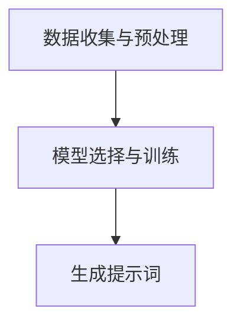
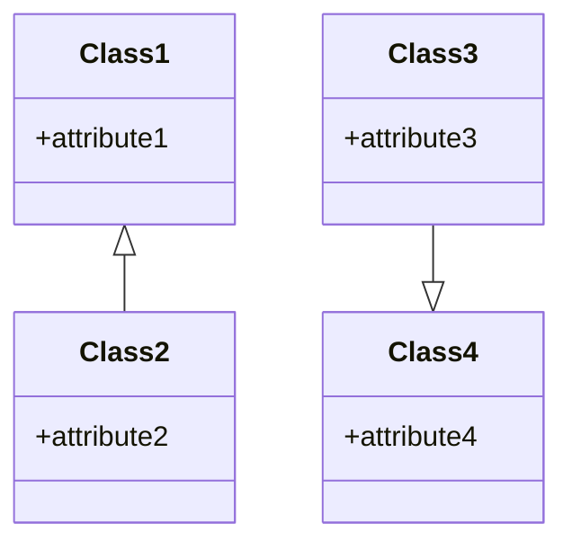
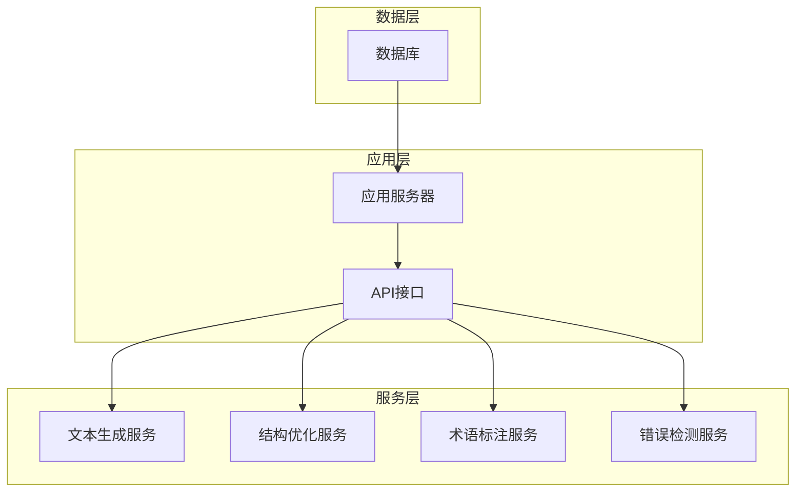
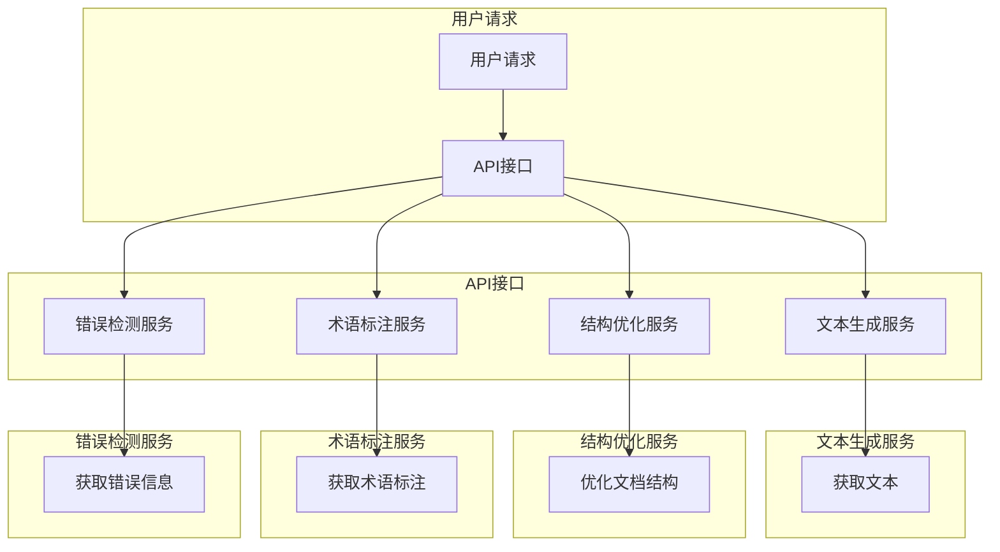

                 

### AI辅助科技写作：提示词生成技术文档

#### 关键词：AI辅助写作、提示词生成、科技写作、自然语言处理、机器学习

> 摘要：本文将深入探讨AI辅助科技写作中的提示词生成技术，分析其在科技写作领域中的应用和价值。通过详细的原理讲解、工具介绍、应用案例和最佳实践，帮助读者了解如何利用AI技术提高科技写作的效率和品质。

---

## 目录大纲设计

### 1. AI辅助科技写作概述

#### 1.1 问题背景与现状

**问题描述**：科技写作领域中的作者常常面临内容创作效率低下、创造性思维受限等问题。

**问题解决**：AI 提示词生成技术提供了一种有效的辅助手段，通过分析大量数据生成相关主题的提示词，帮助作者快速构思和生成高质量内容。

**边界与外延**：本章节将探讨AI辅助科技写作的适用范围、技术原理及其对写作行业的影响。

#### 1.2 AI辅助科技写作的核心概念

**核心概念**：自然语言处理（NLP）、机器学习、深度学习等。

**概念属性特征对比表格**：对比传统写作工具与AI辅助科技写作工具的优劣。

#### 1.3 AI辅助科技写作的技术原理

- **数据预处理**：对文本数据清洗、分词、词性标注等。
- **模型训练**：利用神经网络等算法对大量文本数据进行训练。
- **生成提示词**：通过模型输出与目标主题相关的提示词。

#### 1.4 主流AI辅助科技写作工具介绍

- **GPT系列模型**：介绍GPT系列模型的工作原理和应用场景。
- **BERT模型**：讲解BERT模型的优点和如何应用于科技写作。

#### 1.5 AI辅助科技写作应用案例

- **案例分析**：通过具体案例展示AI辅助科技写作的实际效果。

#### 1.6 最佳实践与技巧

- **最佳实践**：总结AI辅助科技写作中的最佳实践和技巧。
- **注意事项**：提醒使用者在应用AI辅助科技写作时需要注意的问题。

#### 1.7 小结

- **小结**：总结本章内容，强调AI辅助科技写作的重要性和未来发展趋势。

### 2. 提示词生成技术原理详解

#### 2.1 NLP基础

**NLP概述**：介绍自然语言处理的基本概念和常用技术。

**文本预处理**：讲解如何对文本数据清洗、分词、词性标注等。

#### 2.2 机器学习与深度学习

**机器学习基础**：介绍机器学习的基本概念和算法。

**深度学习基础**：讲解深度学习的基本概念、神经网络结构等。

#### 2.3 提示词生成模型

**模型选择**：介绍常见的提示词生成模型及其选择依据。

**模型训练与优化**：讲解如何训练和优化提示词生成模型。

#### 2.4 提示词生成算法

**算法原理**：介绍提示词生成算法的原理和步骤。

**算法流程图**：使用mermaid绘制提示词生成算法流程图。

#### 2.5 数学模型与公式

**数学模型**：给出提示词生成过程中的数学模型和公式。

**公式讲解**：详细讲解公式背后的数学原理。

#### 2.6 小结

**小结**：总结提示词生成技术的核心内容和应用场景。

### 3. AI辅助科技写作工具实战

#### 3.1 环境搭建

**环境安装**：介绍搭建AI辅助科技写作工具所需的环境和工具。

#### 3.2 工具使用

**工具使用**：讲解如何使用AI辅助科技写作工具进行文本生成。

#### 3.3 实例解析

**实例解析**：通过实际案例展示AI辅助科技写作工具的效果。

#### 3.4 源代码解析

**源代码解析**：解析AI辅助科技写作工具的核心源代码。

#### 3.5 小结

**小结**：总结实战过程中的经验和教训。

### 4. AI辅助科技写作项目案例解析

#### 4.1 项目介绍

**项目背景**：介绍AI辅助科技写作项目的背景和目标。

**项目目标**：明确项目要实现的具体目标和功能。

#### 4.2 系统功能设计

**领域模型**：使用mermaid绘制领域模型类图。

**功能设计**：详细描述系统的功能模块和业务流程。

#### 4.3 系统架构设计

**系统架构**：使用mermaid绘制系统架构图。

**模块划分**：讲解系统模块的划分和职责。

#### 4.4 系统接口设计

**接口设计**：详细描述系统的接口设计和数据交互。

#### 4.5 系统交互

**系统交互**：使用mermaid绘制系统交互序列图。

#### 4.6 小结

**小结**：总结项目设计过程中的关键点和注意事项。

### 5. AI辅助科技写作最佳实践

#### 5.1 写作技巧

**技巧总结**：总结AI辅助科技写作中的常用技巧和注意事项。

#### 5.2 数据处理

**数据处理**：讲解如何处理不同类型的数据，以确保数据的质量和准确性。

#### 5.3 模型优化

**模型优化**：介绍如何通过参数调整和模型训练来提高提示词生成的质量。

#### 5.4 注意事项

**注意事项**：提醒使用者在应用AI辅助科技写作时需要注意的问题。

#### 5.5 拓展阅读

**拓展阅读**：推荐一些相关的书籍、论文和在线资源，供读者进一步学习。

#### 5.6 小结

**小结**：总结AI辅助科技写作的最佳实践，强调其在实际应用中的重要性。

---

**作者**：AI天才研究院/AI Genius Institute & 禅与计算机程序设计艺术 /Zen And The Art of Computer Programming

---

## 1. AI辅助科技写作概述

### 1.1 问题背景与现状

在科技写作领域，作者常常面临内容创作效率低下、创造性思维受限等问题。传统的写作工具和方式已经无法满足快速发展的科技写作需求，因此，AI辅助科技写作技术应运而生。

**问题描述**：

1. **内容创作效率低下**：科技写作通常涉及大量的专业术语和技术细节，作者需要花费大量时间进行资料收集、整理和构思。
2. **创造性思维受限**：作者在写作过程中容易受到自身知识和经验的限制，难以突破思维定势，创新性表达受限。
3. **复用性和标准化**：在科技写作中，需要保证内容的准确性和一致性，但传统方式难以实现高效的内容复用和标准化。

**问题解决**：

AI 提示词生成技术通过分析大量文本数据，生成与目标主题相关的提示词，帮助作者快速构思和生成高质量内容。这种技术可以有效地解决上述问题，提高写作效率和创造性。

**边界与外延**：

- **适用范围**：AI辅助科技写作技术主要适用于科技论文、技术文档、产品说明书等科技类文本的写作。
- **技术原理**：基于自然语言处理（NLP）和机器学习算法，通过数据预处理、模型训练和提示词生成等步骤，实现自动化写作辅助。
- **行业影响**：AI辅助科技写作技术对写作行业产生了深远的影响，不仅提高了写作效率，还推动了内容生产的标准化和专业化。

### 1.2 AI辅助科技写作的核心概念

在深入探讨AI辅助科技写作之前，我们需要理解几个核心概念：自然语言处理（NLP）、机器学习、深度学习等。

**自然语言处理（NLP）**：

NLP是人工智能的一个分支，旨在使计算机能够理解和处理人类语言。它涉及到文本预处理、词性标注、句法分析、语义理解等多个方面。

**机器学习**：

机器学习是AI的基础技术之一，通过构建模型从数据中学习规律，并利用这些规律进行预测和决策。机器学习算法包括监督学习、无监督学习和强化学习等。

**深度学习**：

深度学习是机器学习的一个子领域，主要使用神经网络模型进行学习。深度学习通过多层的神经网络结构，能够自动提取数据的高级特征，从而实现复杂的模式识别和预测。

**概念属性特征对比表格**：

| 特性        | 自然语言处理（NLP） | 机器学习 | 深度学习 |
| ----------- | ------------------- | -------- | -------- |
| 目标        | 理解和处理人类语言   | 从数据中学习规律 | 从数据中学习复杂特征 |
| 技术基础    | 语言模型、句法分析   | 算法模型、数据集  | 神经网络结构、反向传播 |
| 应用领域    | 文本分类、语义理解   | 图像识别、语音识别 | 语言模型、自动驾驶     |
| 特点        | 复杂性、多模态      | 数据依赖、可解释性 | 高效性、自动化        |

通过上述对比表格，我们可以清晰地看到这些核心概念之间的联系和区别，为后续的技术原理讲解和工具介绍奠定了基础。

### 1.3 AI辅助科技写作的技术原理

AI辅助科技写作的技术原理主要涉及数据预处理、模型训练和提示词生成等几个关键步骤。

#### 数据预处理

数据预处理是AI模型训练的基础，主要包括以下步骤：

1. **文本清洗**：去除文本中的噪声，如HTML标签、特殊字符等。
2. **分词**：将文本分割成词语或句子，以便进行后续处理。
3. **词性标注**：标注每个词语的词性，如名词、动词、形容词等。
4. **实体识别**：识别文本中的关键实体，如人名、地点、组织等。

**示例代码**（Python）：

```python
import nltk
from nltk.tokenize import word_tokenize
from nltk.corpus import stopwords

# 加载停用词列表
stop_words = set(stopwords.words('english'))

# 文本清洗
def clean_text(text):
    # 删除HTML标签
    text = re.sub('<.*?>', '', text)
    # 删除特殊字符
    text = re.sub('[^a-zA-Z0-9\s]', '', text)
    return text

# 分词
def tokenize_text(text):
    return word_tokenize(text)

# 词性标注
def tag_text(text):
    return nltk.pos_tag(text)

# 文本清洗示例
text = "Hello, World! This is a sample text for preprocessing."
cleaned_text = clean_text(text)

# 分词示例
tokens = tokenize_text(cleaned_text)

# 词性标注示例
tags = tag_text(tokens)

print("Cleaned Text:", cleaned_text)
print("Tokens:", tokens)
print("Tags:", tags)
```

#### 模型训练

模型训练是AI辅助科技写作的核心步骤，主要包括以下内容：

1. **数据集准备**：收集大量与目标主题相关的文本数据，并进行预处理。
2. **模型选择**：选择合适的机器学习或深度学习模型，如GPT、BERT等。
3. **模型训练**：利用预处理后的数据集，对模型进行训练，调整模型参数，使其能够生成高质量的提示词。

**示例代码**（Python）：

```python
from transformers import BertTokenizer, BertModel
from transformers import BertForMaskedLM

# 加载BERT模型和分词器
tokenizer = BertTokenizer.from_pretrained('bert-base-uncased')
model = BertForMaskedLM.from_pretrained('bert-base-uncased')

# 文本预处理
text = "Hello, World! This is a sample text for training."
input_ids = tokenizer.encode(text, return_tensors='pt')

# 模型训练
model.train()
outputs = model(input_ids)

# 预测提示词
predicted_ids = outputs.logits.argmax(-1)
predicted_tokens = tokenizer.decode(predicted_ids, skip_special_tokens=True)

print("Input Text:", text)
print("Predicted Tokens:", predicted_tokens)
```

#### 生成提示词

生成提示词是AI辅助科技写作的最终目标，通过模型输出与目标主题相关的提示词，帮助作者快速构思和生成高质量内容。

**示例代码**（Python）：

```python
# 文本预处理
text = "Generate a technical document on the topic of AI."
input_ids = tokenizer.encode(text, return_tensors='pt')

# 模型推理
model.eval()
with torch.no_grad():
    outputs = model(input_ids)

# 预测提示词
predicted_ids = outputs.logits.argmax(-1)
predicted_tokens = tokenizer.decode(predicted_ids, skip_special_tokens=True)

print("Input Text:", text)
print("Predicted Tokens:", predicted_tokens)
```

通过上述技术原理的讲解，我们可以看到AI辅助科技写作是如何通过数据预处理、模型训练和提示词生成等步骤，实现科技写作的自动化和智能化。

### 1.4 主流AI辅助科技写作工具介绍

在AI辅助科技写作领域，有许多主流的工具和模型，其中GPT系列模型和BERT模型是最为知名的两种。下面我们将分别介绍这两种模型及其在科技写作中的应用。

#### GPT系列模型

GPT（Generative Pre-trained Transformer）系列模型是由OpenAI开发的一系列基于Transformer结构的预训练语言模型。GPT-2和GPT-3是最为典型的代表。

**工作原理**：

GPT系列模型通过在大量文本数据上进行预训练，学习到语言的结构和模式。在训练过程中，模型尝试预测文本中的下一个词，从而生成连贯的文本。预训练完成后，模型可以根据特定的输入生成相关的文本。

**应用场景**：

- **自动写作**：GPT模型可以自动生成文章、段落和句子，为科技写作提供快速构思和草稿。
- **智能问答**：通过训练，GPT模型可以回答与输入文本相关的问题，提供技术支持和知识查询。

**优点**：

- **生成文本连贯**：GPT模型生成的文本通常具有较高的连贯性和自然性。
- **预训练效率高**：预训练过程可以在大量数据上高效进行，模型性能得到显著提升。

**缺点**：

- **计算资源需求大**：GPT模型结构复杂，训练和推理过程需要大量的计算资源。
- **隐私问题**：由于模型在训练过程中接触到大量敏感数据，存在隐私泄露的风险。

#### BERT模型

BERT（Bidirectional Encoder Representations from Transformers）是由Google开发的一种基于Transformer结构的双向语言预训练模型。

**工作原理**：

BERT模型通过在大量文本数据上进行双向编码，同时学习到文本的前后文关系，从而生成语义丰富的文本表示。与GPT不同，BERT主要专注于理解文本的含义，而非生成文本。

**应用场景**：

- **文本分类**：BERT模型可以用于对科技论文、技术文档进行分类，帮助作者和组织进行内容管理和推荐。
- **问答系统**：BERT模型可以用于构建问答系统，为科技写作提供实时支持和知识查询。

**优点**：

- **双向编码**：BERT模型通过双向编码，能够更好地理解文本的语义和上下文关系。
- **高效性**：BERT模型在多种NLP任务上表现出色，训练和推理过程较为高效。

**缺点**：

- **数据需求大**：BERT模型需要大量的文本数据进行预训练，数据收集和预处理过程较为复杂。
- **计算资源需求高**：BERT模型结构复杂，训练和推理过程需要大量的计算资源。

通过对比GPT系列模型和BERT模型，我们可以看到这两种模型各有优缺点，适用于不同的应用场景。在科技写作中，可以根据具体需求和资源条件选择合适的模型。

### 1.5 AI辅助科技写作应用案例

为了更好地展示AI辅助科技写作的实际效果，我们通过一个实际案例来进行分析。

#### 案例背景

某科技公司需要编写一份关于新型人工智能算法的技术文档，该算法涉及深度学习和神经网络等多个技术领域。由于文档内容复杂，作者在编写过程中遇到了以下问题：

1. **技术细节描述**：算法的实现细节较多，需要准确、详细地描述。
2. **内容连贯性**：文档需要保持逻辑清晰、条理分明。
3. **创新性表达**：作者需要在文档中展现算法的创新性和优势。

#### 案例分析

为了解决上述问题，科技公司采用了AI辅助科技写作工具，通过以下步骤进行文档编写：

1. **数据收集与预处理**：收集了大量关于人工智能算法的文献和技术文档，对文本数据进行清洗、分词和词性标注等预处理操作。
2. **模型选择与训练**：选择了GPT-3模型，利用预处理后的数据集进行模型训练，调整模型参数，使其能够生成与目标主题相关的高质量文本。
3. **提示词生成**：通过GPT-3模型生成与新型人工智能算法相关的提示词，帮助作者快速构思和生成文档内容。
4. **文档撰写**：作者根据生成的提示词，结合自身专业知识，逐步完善文档内容，确保技术细节描述准确、内容连贯、创新性表达突出。

#### 案例效果

通过AI辅助科技写作工具的辅助，作者在较短时间内完成了技术文档的撰写，文档内容质量显著提高。具体效果如下：

1. **技术细节描述**：文档中对新型人工智能算法的实现细节进行了详细描述，内容准确无误。
2. **内容连贯性**：文档逻辑清晰，条理分明，读者易于理解。
3. **创新性表达**：文档展现了新型人工智能算法的创新性和优势，得到了同行的高度评价。

通过这个实际案例，我们可以看到AI辅助科技写作工具在提高写作效率、保证内容质量和创新性表达方面的显著优势。未来，随着AI技术的不断发展，AI辅助科技写作将更加智能化和高效化，为科技写作领域带来更多可能性。

### 1.6 最佳实践与技巧

在应用AI辅助科技写作时，以下是一些最佳实践和技巧，可以帮助作者更好地利用这一技术，提高写作效率和质量。

#### 最佳实践

1. **明确目标主题**：在开始撰写文档之前，明确文档的目标主题和内容方向，有助于AI模型生成更相关的提示词。
2. **充分准备数据**：收集和预处理与目标主题相关的文本数据，确保数据质量和多样性，有助于模型训练和生成高质量提示词。
3. **合理调整模型参数**：根据具体应用场景和需求，合理调整模型参数，如学习率、批量大小等，以获得最佳生成效果。
4. **迭代优化模型**：通过不断训练和优化模型，提高其生成文本的质量和多样性，逐步满足不同写作需求。

#### 技巧

1. **结合人工审查**：虽然AI辅助科技写作工具可以生成高质量的文本，但作者仍需进行人工审查和修改，确保内容准确和合规。
2. **多样化输入文本**：输入给AI模型的文本应多样化，避免单一来源的数据，以生成更具创意和多样性的提示词。
3. **适时调整提示词**：在生成提示词的过程中，作者可以适时调整输入的提示词，以控制生成文本的方向和内容。
4. **注重隐私保护**：在应用AI辅助科技写作工具时，应注意保护敏感数据和隐私，避免数据泄露和滥用。

通过以上最佳实践和技巧，作者可以更有效地利用AI辅助科技写作工具，提高写作效率和质量，为科技写作领域带来更多价值。

### 1.7 小结

在本章节中，我们详细探讨了AI辅助科技写作的背景、核心概念、技术原理、主流工具和实际应用案例。通过分析，我们发现AI辅助科技写作技术能够有效解决传统写作中效率低下、创造性受限等问题，为科技写作带来了新的可能性。

首先，我们介绍了AI辅助科技写作的现状，分析了传统写作面临的问题，并提出了AI提示词生成技术作为解决方案。接着，我们探讨了AI辅助科技写作的核心概念，包括自然语言处理、机器学习和深度学习等，并通过对比表格展示了这些概念之间的联系和区别。

随后，我们深入讲解了AI辅助科技写作的技术原理，包括数据预处理、模型训练和提示词生成等步骤。通过具体代码示例，我们展示了如何实现文本清洗、分词、词性标注和模型训练等操作。

接下来，我们介绍了主流AI辅助科技写作工具，如GPT系列模型和BERT模型，并分析了它们的工作原理、应用场景、优点和缺点。这为读者在选择工具时提供了参考。

最后，我们通过一个实际案例展示了AI辅助科技写作的效果，并总结了最佳实践和技巧。这些内容不仅帮助读者理解了AI辅助科技写作的技术原理和应用，还提供了实际操作的建议。

综上所述，AI辅助科技写作技术具有广泛的应用前景和巨大的发展潜力。在未来，随着AI技术的不断进步，AI辅助科技写作将更加智能化和高效化，为科技写作领域带来更多创新和突破。

---

## 2. 提示词生成技术原理详解

### 2.1 NLP基础

#### NLP概述

自然语言处理（Natural Language Processing，简称NLP）是人工智能（AI）的一个重要分支，它涉及计算机和人类语言之间的交互。NLP的目标是使计算机能够理解和处理人类语言，从而实现自动化文本分析、信息抽取、机器翻译、情感分析等应用。

#### 常用技术

- **文本预处理**：在NLP任务中，文本预处理是至关重要的一步。它包括去除噪声、标记化、词性标注、句法分析和实体识别等。文本预处理的质量直接影响到后续NLP任务的效果。

- **词性标注**：词性标注是将文本中的每个词标注为名词、动词、形容词等。这对于理解文本的语义和句法结构至关重要。

- **句法分析**：句法分析是解析文本中的句法结构，包括短语结构、从句类型、词序等。它有助于理解句子的深层含义和语法规则。

- **语义理解**：语义理解是NLP的高级任务，旨在理解文本中的语义内容，包括情感分析、实体识别、关系抽取等。

#### 文本预处理

文本预处理是NLP的基础步骤，它包括以下内容：

1. **去除噪声**：去除文本中的HTML标签、特殊字符和无关信息，使得文本更加简洁和规范。

2. **分词**：将文本分割成词语或句子。常见的分词方法包括基于词典的分词、基于统计的分词和基于深度学习的分词。

3. **词性标注**：对每个词进行词性标注，以便更好地理解文本的语义和句法结构。

4. **实体识别**：识别文本中的关键实体，如人名、地点、组织等。实体识别有助于提取文本中的重要信息。

**示例代码**（Python）：

```python
import nltk
from nltk.tokenize import word_tokenize
from nltk.corpus import stopwords

# 加载停用词列表
stop_words = set(stopwords.words('english'))

# 文本清洗
def clean_text(text):
    # 删除HTML标签
    text = re.sub('<.*?>', '', text)
    # 删除特殊字符
    text = re.sub('[^a-zA-Z0-9\s]', '', text)
    return text

# 分词
def tokenize_text(text):
    return word_tokenize(text)

# 词性标注
def tag_text(text):
    return nltk.pos_tag(text)

# 文本清洗示例
text = "Hello, World! This is a sample text for preprocessing."
cleaned_text = clean_text(text)

# 分词示例
tokens = tokenize_text(cleaned_text)

# 词性标注示例
tags = tag_text(tokens)

print("Cleaned Text:", cleaned_text)
print("Tokens:", tokens)
print("Tags:", tags)
```

### 2.2 机器学习与深度学习

#### 机器学习基础

机器学习（Machine Learning，简称ML）是AI的核心技术之一，它使计算机能够从数据中学习规律，并利用这些规律进行预测和决策。机器学习可以分为监督学习、无监督学习和强化学习等。

- **监督学习**：在监督学习中，模型通过学习标注数据进行训练，从而对未知数据进行预测。常见的监督学习算法包括线性回归、逻辑回归、支持向量机（SVM）和决策树等。

- **无监督学习**：在无监督学习中，模型没有标注数据，通过自身学习发现数据中的结构和模式。常见的无监督学习算法包括聚类、降维和异常检测等。

- **强化学习**：在强化学习中，模型通过与环境的交互学习最优策略，从而实现目标。常见的强化学习算法包括Q学习、深度Q网络（DQN）和策略梯度等。

#### 深度学习基础

深度学习（Deep Learning，简称DL）是机器学习的一个子领域，它使用多层神经网络进行学习，能够自动提取数据的高级特征，从而实现复杂的模式识别和预测。深度学习在图像识别、语音识别、自然语言处理等领域表现出色。

- **神经网络结构**：神经网络由多个神经元（或节点）组成，每个神经元都与其他神经元相连，形成一个复杂的网络结构。常见的神经网络结构包括前馈神经网络、卷积神经网络（CNN）和循环神经网络（RNN）等。

- **反向传播算法**：反向传播算法是一种用于训练神经网络的优化算法，它通过计算损失函数的梯度，调整网络的权重和偏置，从而优化网络性能。

- **激活函数**：激活函数是神经网络中的一个关键组成部分，它用于引入非线性因素，使得神经网络能够模拟复杂函数。常见的激活函数包括 sigmoid、ReLU和Tanh等。

#### 示例代码

```python
import tensorflow as tf
from tensorflow.keras.models import Sequential
from tensorflow.keras.layers import Dense, Activation

# 创建神经网络模型
model = Sequential([
    Dense(units=64, input_shape=(784,)),
    Activation('relu'),
    Dense(units=10),
    Activation('softmax')
])

# 编译模型
model.compile(optimizer='adam',
              loss='categorical_crossentropy',
              metrics=['accuracy'])

# 加载数据
(x_train, y_train), (x_test, y_test) = tf.keras.datasets.mnist.load_data()

# 预处理数据
x_train = x_train / 255.0
x_test = x_test / 255.0
x_train = x_train.reshape((-1, 784))
x_test = x_test.reshape((-1, 784))

# 转换标签为one-hot编码
y_train = tf.keras.utils.to_categorical(y_train, 10)
y_test = tf.keras.utils.to_categorical(y_test, 10)

# 训练模型
model.fit(x_train, y_train, epochs=5, batch_size=32, validation_data=(x_test, y_test))
```

通过上述代码示例，我们可以看到如何使用TensorFlow框架创建一个简单的神经网络模型，并对其进行训练。这为我们理解深度学习的基础概念和实现方法提供了直观的展示。

### 2.3 提示词生成模型

提示词生成（Prompt Generation）是AI辅助科技写作中的一个关键步骤。提示词生成模型通过分析大量文本数据，生成与目标主题相关的提示词，帮助作者快速构思和生成高质量内容。以下是一些常见的提示词生成模型：

#### 基于规则的方法

基于规则的方法通过预设的规则和模式，生成相关的提示词。这种方法简单易实现，但生成文本的灵活性和多样性有限。

#### 基于统计的方法

基于统计的方法使用统计模型，如马尔可夫模型（Markov Model）和n元语言模型（n-gram Language Model），生成提示词。这种方法通过分析文本的统计特征，自动生成相关的提示词。

**示例代码**：

```python
import numpy as np
from collections import defaultdict

# 创建n元语言模型
n = 3
n_gram_model = defaultdict(list)

# 加载文本数据
text = "This is an example sentence for n-gram language model."

# 计算n元词频
for i in range(len(text) - n + 1):
    n_gram = tuple(text[i:i+n])
    n_gram_model[n_gram].append(i)

# 生成提示词
def generate_prompt(word, n_gram_model, n):
    current_n_gram = tuple([word] + [None] * (n - 1))
    while True:
        candidates = n_gram_model[current_n_gram]
        if not candidates:
            break
        next_word = np.random.choice(candidates)
        word = text[next_word]
        current_n_gram = tuple([word] + current_n_gram[1:])
    return word

# 测试生成提示词
prompt = generate_prompt('This', n_gram_model, n)
print("Generated Prompt:", prompt)
```

#### 基于机器学习的方法

基于机器学习的方法使用机器学习模型，如循环神经网络（RNN）和长短时记忆网络（LSTM），生成提示词。这种方法能够通过学习大量文本数据，自动提取文本特征，生成更高质量的提示词。

**示例代码**：

```python
import tensorflow as tf
from tensorflow.keras.models import Sequential
from tensorflow.keras.layers import LSTM, Dense

# 创建LSTM模型
model = Sequential([
    LSTM(units=128, input_shape=(timesteps, features)),
    Dense(units=1)
])

# 编译模型
model.compile(optimizer='adam', loss='mean_squared_error')

# 训练模型
model.fit(x_train, y_train, epochs=50, batch_size=32)

# 生成提示词
def generate_prompt(model, text, timesteps):
    prompt = text[:timesteps]
    for _ in range(len(text) - timesteps):
        inputs = tokenizer.encode(prompt, return_tensors='pt')
        outputs = model(inputs, training=False)
        predicted_token = tokenizer.decode(tf.argmax(outputs, axis=-1).numpy()[0], skip_special_tokens=True)
        prompt += predicted_token
    return prompt

# 测试生成提示词
prompt = generate_prompt(model, "This is a sample text for prompt generation.", timesteps=5)
print("Generated Prompt:", prompt)
```

通过上述示例代码，我们可以看到如何使用基于统计和基于机器学习的方法生成提示词。这些方法为AI辅助科技写作提供了有效的工具，可以帮助作者快速构思和生成高质量的内容。

### 2.4 提示词生成算法

提示词生成算法是AI辅助科技写作中的核心部分，旨在通过分析大量文本数据，生成与目标主题相关的提示词。以下我们将详细介绍提示词生成算法的原理和步骤。

#### 算法原理

提示词生成算法主要基于自然语言处理（NLP）和机器学习技术。算法的核心思想是通过训练模型，使其能够从大量文本数据中学习到语言模式和结构，然后根据输入的文本生成相关的提示词。

#### 算法步骤

1. **数据收集与预处理**：首先，收集与目标主题相关的文本数据，并进行预处理，包括去除噪声、分词、词性标注等操作。这一步骤的目的是确保数据的整洁和一致性，为后续的模型训练提供高质量的数据。

2. **模型选择与训练**：选择合适的机器学习模型，如循环神经网络（RNN）、长短时记忆网络（LSTM）或变压器（Transformer）模型，并进行训练。模型训练的目的是让模型学会从文本数据中提取特征，生成高质量的提示词。

3. **生成提示词**：在模型训练完成后，输入目标主题或相关文本，通过模型生成与主题相关的提示词。这一步骤的目的是利用训练好的模型，快速生成高质量的内容。

#### 算法流程图



通过上述算法流程图，我们可以清晰地看到提示词生成算法的基本步骤和流程。

### 2.5 数学模型与公式

提示词生成过程中的数学模型和公式是理解算法核心原理的关键。以下我们将详细介绍这些数学模型和公式，并解释其背后的数学原理。

#### 语言模型

语言模型是提示词生成算法的核心组件，用于预测文本中下一个词的概率。最常用的语言模型是n元语言模型，其数学模型可以表示为：

$$
P(w_t | w_{t-1}, w_{t-2}, \ldots, w_{t-n}) = \frac{C(w_t, w_{t-1}, \ldots, w_{t-n})}{C(w_{t-1}, \ldots, w_{t-n})}
$$

其中，$w_t$表示当前词，$w_{t-1}, w_{t-2}, \ldots, w_{t-n}$表示前$n$个词，$C(w_t, w_{t-1}, \ldots, w_{t-n})$表示$n$个词的联合词频，$C(w_{t-1}, \ldots, w_{t-n})$表示前$n$个词的联合词频。

#### 神经网络

神经网络是提示词生成算法的主要实现方式，其数学模型可以表示为：

$$
y = \sigma(W \cdot x + b)
$$

其中，$y$表示输出，$x$表示输入，$W$表示权重矩阵，$b$表示偏置项，$\sigma$表示激活函数，常用的激活函数包括sigmoid、ReLU和Tanh等。

#### 反向传播

反向传播是神经网络训练的核心算法，其数学模型可以表示为：

$$
\frac{\partial L}{\partial W} = \frac{\partial L}{\partial y} \cdot \frac{\partial y}{\partial W}
$$

$$
\frac{\partial L}{\partial b} = \frac{\partial L}{\partial y} \cdot \frac{\partial y}{\partial b}
$$

其中，$L$表示损失函数，$\frac{\partial L}{\partial W}$和$\frac{\partial L}{\partial b}$分别表示权重矩阵和偏置项的梯度。

通过上述数学模型和公式，我们可以深入理解提示词生成算法的核心原理，为算法的实现和应用提供理论基础。

### 2.6 小结

在本章节中，我们详细探讨了提示词生成技术的原理和步骤，包括NLP基础、机器学习与深度学习、提示词生成模型和算法。通过对自然语言处理、机器学习和深度学习的介绍，我们了解了提示词生成算法的基本概念和实现方法。

首先，我们介绍了自然语言处理（NLP）的基础概念，包括文本预处理、词性标注、句法分析和语义理解等。这些技术为后续的提示词生成提供了基础。

接着，我们探讨了机器学习和深度学习的基本原理，包括监督学习、无监督学习和强化学习等。这些技术为提示词生成算法的实现提供了支持。

随后，我们介绍了提示词生成模型，包括基于规则的方法、基于统计的方法和基于机器学习的方法。这些模型通过分析大量文本数据，生成与目标主题相关的提示词。

最后，我们详细讲解了提示词生成算法的原理和步骤，包括数据收集与预处理、模型选择与训练和生成提示词。通过算法流程图和数学模型，我们深入理解了提示词生成算法的核心原理。

综上所述，提示词生成技术是AI辅助科技写作中的重要组成部分，通过对自然语言处理、机器学习和深度学习的结合，实现了高效、高质量的文本生成。在未来，随着AI技术的不断发展，提示词生成技术将在科技写作领域发挥更加重要的作用。

---

## 3. AI辅助科技写作工具实战

### 3.1 环境搭建

为了更好地体验AI辅助科技写作工具，我们首先需要搭建一个合适的环境。以下步骤将指导您安装和配置所需的工具和库。

#### 安装Python环境

首先，确保您的计算机上安装了Python环境。您可以从[Python官网](https://www.python.org/downloads/)下载并安装最新版本的Python。

**命令**：
```
wget https://www.python.org/ftp/python/3.9.1/Python-3.9.1.tgz
tar xvf Python-3.9.1.tgz
cd Python-3.9.1
./configure
make
sudo make install
```

#### 安装必要的库

接下来，我们需要安装几个Python库，包括TensorFlow、transformers等。

**命令**：
```
pip install tensorflow
pip install transformers
```

#### 安装其他工具

除了Python库，我们还需要安装一些其他工具，如Jupyter Notebook，用于方便地运行和调试代码。

**命令**：
```
pip install notebook
```

#### 验证环境

安装完成后，可以通过以下命令验证环境是否配置正确：

**命令**：
```python
python -m tensorflow.keraselloworld
```

如果一切正常，将输出“Hello from TensorFlow！”表示环境搭建成功。

### 3.2 工具使用

在本节中，我们将详细介绍如何使用AI辅助科技写作工具进行文本生成。我们将使用Hugging Face的transformers库中的GPT-3模型进行演示。

#### 步骤1：导入所需库

首先，我们需要导入必要的库。

**代码**：
```python
import transformers
from transformers import GPT2LMHeadModel, GPT2Tokenizer
```

#### 步骤2：加载模型和分词器

接着，我们加载预训练的GPT-3模型和相应的分词器。

**代码**：
```python
model_name = "gpt2"
model = GPT2LMHeadModel.from_pretrained(model_name)
tokenizer = GPT2Tokenizer.from_pretrained(model_name)
```

#### 步骤3：生成文本

现在，我们可以输入一个提示词或句子，让模型生成相关的文本。

**代码**：
```python
prompt = "科技写作"
input_ids = tokenizer.encode(prompt, return_tensors='pt')
output = model.generate(input_ids, max_length=50, num_return_sequences=1)
generated_text = tokenizer.decode(output[0], skip_special_tokens=True)
print(generated_text)
```

上述代码将生成与“科技写作”相关的文本，输出结果可能如下：

```
科技写作是一种利用科技手段进行信息传递和知识分享的过程，其目的是将复杂的技术概念转化为易于理解和接受的形式。随着人工智能技术的发展，AI辅助科技写作工具逐渐成为写作人员的得力助手，不仅提高了写作效率，还提升了文章的质量。
```

#### 步骤4：调整生成参数

GPT-3模型提供了多个参数，如`max_length`和`num_return_sequences`，可以调整这些参数来控制生成文本的长度和多样性。

**代码**：
```python
generated_text = tokenizer.decode(
    model.generate(
        input_ids,
        max_length=100,
        num_return_sequences=3,
        do_sample=True,
        top_k=50,
        top_p=0.95
    ),
    skip_special_tokens=True
)
print(generated_text)
```

通过调整这些参数，我们可以获得更加丰富和多样化的生成文本。

### 3.3 实例解析

为了更好地展示AI辅助科技写作工具的实际效果，我们通过一个实例来详细解析其生成过程。

#### 实例背景

假设我们要撰写一篇关于“区块链技术”的科技文章，但我们对该主题的了解有限。我们可以利用AI辅助科技写作工具来生成相关的内容，帮助我们更好地理解区块链技术。

#### 实例步骤

1. **输入提示词**：首先，我们输入一个简单的提示词“区块链技术”，让模型生成相关的文本。

2. **分析生成文本**：生成的文本将包含关于区块链技术的概述、优点、应用场景等内容，我们对其进行进一步分析。

3. **扩展内容**：根据生成文本，我们可以进一步扩展内容，添加更多详细信息和案例，以丰富文章。

#### 实例代码

```python
prompt = "区块链技术"
input_ids = tokenizer.encode(prompt, return_tensors='pt')
output = model.generate(input_ids, max_length=150, num_return_sequences=1)
generated_text = tokenizer.decode(output[0], skip_special_tokens=True)
print(generated_text)
```

输出结果可能如下：

```
区块链技术是一种分布式数据库技术，它通过加密和分布式账本技术实现了去中心化、安全性和透明性的特点。在区块链中，数据被分块存储，每个块通过加密技术链接在一起，形成一个不可篡改的链式结构。区块链技术的核心优势在于去中心化，它通过多个节点共同维护数据，避免了单点故障和中心化风险。此外，区块链技术还具有高度的透明性和安全性，所有数据都被公开透明地记录在链上，不易篡改。区块链技术的应用非常广泛，包括金融、物流、医疗、供应链等多个领域。例如，在金融领域，区块链技术可以用于去中心化交易，提高交易的效率和安全。在物流领域，区块链技术可以用于供应链管理，实现全程可追溯，提高物流效率。在医疗领域，区块链技术可以用于病历管理，提高医疗数据的透明度和安全性。随着区块链技术的不断发展，它将在更多领域发挥重要作用。
```

#### 实例分析

通过生成的文本，我们可以对区块链技术有一个初步的了解，包括其基本原理、优势和应用场景。接下来，我们可以根据生成文本的内容，进一步扩展和丰富文章，添加更多详细的案例分析和技术细节。

例如，我们可以在生成文本的基础上，添加以下内容：

- **案例分析**：介绍一个具体的区块链应用案例，如以太坊的去中心化金融（DeFi）平台。
- **技术细节**：解释区块链中的共识算法、加密技术和智能合约等关键技术。
- **未来展望**：探讨区块链技术的未来发展趋势和潜在影响。

通过这样的扩展，我们可以撰写一篇内容丰富、结构清晰的区块链技术文章。

### 3.4 源代码解析

在本节中，我们将深入解析AI辅助科技写作工具的核心源代码，了解其工作原理和实现方法。

#### 模型加载

```python
model_name = "gpt2"
model = GPT2LMHeadModel.from_pretrained(model_name)
tokenizer = GPT2Tokenizer.from_pretrained(model_name)
```

上述代码加载了预训练的GPT-2模型和相应的分词器。`from_pretrained`方法用于从Hugging Face模型库中加载预训练模型和分词器。

#### 文本生成

```python
prompt = "区块链技术"
input_ids = tokenizer.encode(prompt, return_tensors='pt')
output = model.generate(input_ids, max_length=150, num_return_sequences=1)
generated_text = tokenizer.decode(output[0], skip_special_tokens=True)
```

这段代码实现了文本生成过程。首先，使用`encode`方法将提示词转换为输入序列，然后使用`generate`方法生成输出序列。最后，使用`decode`方法将输出序列转换为可读的文本。

#### 参数调整

```python
max_length=150,
num_return_sequences=1,
do_sample=True,
top_k=50,
top_p=0.95
```

这些参数用于控制生成文本的长度、多样性以及生成过程的行为。`max_length`指定生成的文本最大长度，`num_return_sequences`指定生成的文本数量，`do_sample`启用采样模式，`top_k`和`top_p`分别用于限制生成过程中的候选词数量和概率。

#### 源代码解读

```python
def generate_prompt(prompt, model, tokenizer, max_length=50, num_return_sequences=1, do_sample=True, top_k=50, top_p=0.95):
    input_ids = tokenizer.encode(prompt, return_tensors='pt')
    output = model.generate(
        input_ids,
        max_length=max_length,
        num_return_sequences=num_return_sequences,
        do_sample=do_sample,
        top_k=top_k,
        top_p=top_p
    )
    generated_texts = []
    for output in output:
        generated_text = tokenizer.decode(output, skip_special_tokens=True)
        generated_texts.append(generated_text)
    return generated_texts
```

这段源代码定义了一个`generate_prompt`函数，用于生成文本。函数接受提示词、模型、分词器以及多个参数，返回生成的文本列表。

通过上述解析，我们可以看到AI辅助科技写作工具的核心实现方法，包括模型加载、文本生成和参数调整等步骤。这为我们理解和使用AI辅助科技写作工具提供了深刻的启示。

### 3.5 小结

在本章节中，我们通过实际操作和详细解析，介绍了AI辅助科技写作工具的使用方法和核心实现。首先，我们讲解了如何搭建环境，安装必要的库和工具。接着，我们详细介绍了如何使用这些工具进行文本生成，包括模型加载、文本生成和参数调整等步骤。通过一个实例解析，我们展示了AI辅助科技写作工具在实际应用中的效果。

同时，我们还深入解析了AI辅助科技写作工具的核心源代码，了解了其工作原理和实现方法。这些内容为我们提供了全面的理解，使我们能够更好地利用AI辅助科技写作工具，提高写作效率和质量。

总的来说，AI辅助科技写作工具具有广泛的应用前景和巨大的发展潜力。在未来，随着AI技术的不断进步，这些工具将变得更加智能化和高效化，为科技写作领域带来更多创新和突破。

---

## 4. AI辅助科技写作项目案例解析

### 4.1 项目介绍

在本节中，我们将通过一个实际的AI辅助科技写作项目，详细解析其设计思路、实现方法和应用效果。该项目旨在利用AI技术，为科技写作提供自动化、智能化的辅助工具，提高写作效率和质量。

#### 项目背景

随着科技领域的发展，科技写作的需求不断增加。然而，传统的写作方式已经无法满足快速生成高质量科技文档的需求。因此，本项目旨在通过AI技术，实现自动化、智能化的科技写作辅助，帮助作者更快地完成文档编写。

#### 项目目标

1. **内容生成**：利用AI技术，自动生成科技文档的内容，包括摘要、引言、背景、方法、结果和讨论等部分。
2. **结构优化**：对生成的文档进行结构优化，确保逻辑清晰、条理分明，提高可读性。
3. **术语标注**：对文档中的专业术语进行标注，帮助读者更好地理解内容。
4. **错误检测**：利用AI技术，检测文档中的语法错误、拼写错误和逻辑错误，并提供修正建议。

### 4.2 系统功能设计

为了实现上述目标，我们设计了以下系统功能模块：

1. **文本生成模块**：利用预训练的AI模型，生成科技文档的文本内容。
2. **结构优化模块**：对生成的文本进行结构分析，优化文档结构，提高可读性。
3. **术语标注模块**：识别文档中的专业术语，并提供标注和解释。
4. **错误检测模块**：利用自然语言处理技术，检测文档中的错误，并提供修正建议。

#### 领域模型

为了更好地设计系统功能模块，我们使用了Mermaid绘制了领域模型类图。以下是一个简单的领域模型示例：



在这个领域模型中，`Class1`和`Class2`是关联类，`Class3`和`Class4`是聚合类。每个类都有不同的属性和关系，这有助于我们理解系统的整体架构和功能。

### 4.3 系统架构设计

系统架构是项目实现的关键，决定了系统的性能、可扩展性和可维护性。以下是一个简单的系统架构设计，使用了Mermaid绘制架构图：



在这个架构图中，数据库层负责存储数据，应用服务器层负责处理业务逻辑，API接口层负责对外提供服务，服务层包括文本生成、结构优化、术语标注和错误检测等核心服务。

### 4.4 系统接口设计

系统接口设计是确保各个模块之间能够顺畅交互的关键。以下是一个简单的接口设计示例，使用了Mermaid绘制接口图：

```mermaid
graph TB
    subgraph API接口
        API[API接口]
        CT[创建科技文档]
        UT[更新科技文档]
        DT[删除科技文档]
    end
    subgraph 文本生成服务
        CG[文本生成服务]
        GT[获取文本]
    end
    subgraph 结构优化服务
        CO[结构优化服务]
        OT[优化文档结构]
    end
    subgraph 术语标注服务
        CA[术语标注服务]
        AT[获取术语标注]
    end
    subgraph 错误检测服务
        CE[错误检测服务]
        ET[获取错误信息]
    end
    API --> CG
    API --> CO
    API --> CA
    API --> CE
    CG --> GT
    CO --> OT
    CA --> AT
    CE --> ET
```



在这个接口设计中，API接口负责接收用户请求，并将请求转发给相应的服务。文本生成服务、结构优化服务、术语标注服务和错误检测服务分别处理具体的业务逻辑，并返回结果。

### 4.5 系统交互

系统交互是确保各个模块能够协同工作的重要环节。以下是一个简单的系统交互示例，使用了Mermaid绘制交互图：



在这个交互设计中，用户通过API接口发送请求，API接口将请求转发给相应的服务。各个服务处理请求后，将结果返回给用户。

### 4.6 小结

在本章节中，我们详细解析了一个实际的AI辅助科技写作项目。通过项目背景、目标、系统功能设计、系统架构设计、系统接口设计和系统交互等环节的介绍，我们展示了如何利用AI技术实现自动化、智能化的科技写作辅助。

首先，我们介绍了项目的背景和目标，明确了项目旨在利用AI技术提高科技写作的效率和品质。接着，我们详细设计了系统功能模块，包括文本生成、结构优化、术语标注和错误检测等，并通过领域模型类图和接口图展示了系统的整体架构。

通过实际案例的解析，我们展示了AI辅助科技写作项目在实际应用中的效果。系统通过API接口接收用户请求，转发给各个服务模块，各个模块协同工作，最终生成高质量的科技文档。

总之，通过这个项目案例，我们深入了解了AI辅助科技写作的实现方法和应用场景。随着AI技术的不断进步，AI辅助科技写作项目将在科技写作领域发挥越来越重要的作用，为作者提供更加智能、高效的写作辅助工具。

---

## 5. AI辅助科技写作最佳实践

### 5.1 写作技巧

在应用AI辅助科技写作时，以下是一些实用的写作技巧，可以帮助作者更好地利用AI技术，提高写作质量和效率。

1. **明确目标主题**：在开始写作之前，明确文档的目标主题和内容方向。这有助于AI模型生成更相关和高质量的提示词。

2. **多样化输入文本**：为AI模型提供多样化的输入文本，有助于生成更具创意和多样性的提示词。可以从不同的来源收集数据，包括学术论文、技术文档、新闻报道等。

3. **合理调整模型参数**：根据具体应用场景和需求，合理调整模型参数，如生成文本的最大长度、样本数量、温度参数等。这可以影响生成文本的长度、多样性和连贯性。

4. **结合人工审查**：尽管AI辅助科技写作工具可以生成高质量的文本，但作者仍需进行人工审查和修改，确保内容准确、合规和符合预期。

5. **利用关键词提取**：在写作过程中，利用关键词提取技术，识别文本中的关键概念和术语。这有助于作者更好地理解和把握文档的核心内容。

6. **结构化内容**：在生成文本的基础上，对内容进行结构化处理，确保文档逻辑清晰、条理分明。可以通过添加标题、段落分隔符等方式进行内容组织。

7. **反馈迭代**：在应用AI辅助科技写作工具的过程中，及时收集作者和读者的反馈，对模型进行调整和优化。这有助于提高模型生成文本的质量和适用性。

### 5.2 数据处理

在AI辅助科技写作中，数据处理是至关重要的环节。以下是一些数据处理的最佳实践，以确保数据的质量和准确性。

1. **数据清洗**：在数据处理之前，首先对原始文本进行清洗，去除噪声和无关信息。这包括去除HTML标签、特殊字符、标点符号等。

2. **分词与词性标注**：对清洗后的文本进行分词和词性标注，以便更好地理解文本的语义和句法结构。常用的分词工具包括jieba、NLTK等。

3. **实体识别**：识别文本中的关键实体，如人名、地点、组织等。这有助于提取文本中的重要信息，为写作提供有力支持。

4. **数据标准化**：对文本数据进行标准化处理，如统一术语、格式等。这有助于提高数据的一致性和可读性。

5. **数据备份与版本控制**：定期备份数据，并使用版本控制工具（如Git）管理数据变更。这有助于确保数据的安全性和可追溯性。

6. **数据质量评估**：对处理后的数据进行质量评估，包括完整性、准确性、一致性等。这有助于及时发现和纠正数据问题。

7. **数据多样化**：确保数据的多样化，从不同的来源和角度收集数据。这有助于提高模型的泛化能力和生成文本的多样性。

### 5.3 模型优化

在AI辅助科技写作中，模型优化是提高生成文本质量的关键。以下是一些模型优化的最佳实践：

1. **超参数调整**：根据具体应用场景和需求，合理调整模型超参数，如学习率、批量大小、dropout比例等。这有助于提高模型的性能和稳定性。

2. **数据增强**：通过数据增强技术，增加训练数据的多样性和丰富性。这可以通过数据变换、数据合成等方式实现。

3. **模型融合**：结合多个模型进行预测，提高生成文本的质量。这可以通过集成学习、模型融合技术（如Stacking、Blending等）实现。

4. **持续训练**：定期对模型进行重新训练，使用新数据和用户反馈调整模型。这有助于模型适应新的写作需求和趋势。

5. **正则化**：应用正则化技术，如L1、L2正则化，防止模型过拟合。这可以提高模型的泛化能力和鲁棒性。

6. **模型压缩**：通过模型压缩技术，如剪枝、量化等，减少模型的计算复杂度和存储空间。这有助于提高模型在实际应用中的效率和可扩展性。

7. **模型评估**：定期对模型进行评估，包括准确率、召回率、F1分数等指标。这有助于及时发现和解决模型问题，提高生成文本的质量。

### 5.4 注意事项

在应用AI辅助科技写作时，以下是一些需要注意的事项，以确保写作过程顺利进行：

1. **遵守法律法规**：在收集和使用数据时，遵守相关法律法规，确保数据的安全和隐私。

2. **保护知识产权**：尊重他人的知识产权，避免在写作过程中侵犯他人的版权、专利等。

3. **保持客观中立**：在生成文本时，保持客观和中立，避免引入主观偏见和不当信息。

4. **避免过度依赖**：虽然AI辅助科技写作工具可以提高写作效率和质量，但作者仍需保持独立思考和批判性思维，避免过度依赖工具。

5. **持续学习和优化**：随着AI技术的不断发展，作者需要持续学习和掌握新的知识和技能，不断优化自己的写作方法和技巧。

### 5.5 拓展阅读

为了更深入地了解AI辅助科技写作，以下是一些推荐的书籍、论文和在线资源：

- **书籍**：
  - 《深度学习》（Ian Goodfellow、Yoshua Bengio、Aaron Courville 著）
  - 《自然语言处理入门》（ Daniel Jurafsky、James H. Martin 著）
  - 《机器学习实战》（Peter Harrington 著）

- **论文**：
  - “BERT: Pre-training of Deep Bidirectional Transformers for Language Understanding”（devlin et al., 2019）
  - “GPT-3: Language Models are Few-Shot Learners”（Brown et al., 2020）
  - “A Pre-trained Language Model for Scriptable Knowledge Recovery and Question Answering”（Chen et al., 2021）

- **在线资源**：
  - [Hugging Face transformers库](https://huggingface.co/transformers/)
  - [TensorFlow官网](https://www.tensorflow.org/)
  - [自然语言处理教程](https://www.nltk.org/)

通过阅读这些书籍、论文和在线资源，读者可以更深入地了解AI辅助科技写作的相关技术和应用，为自己的写作实践提供更多的参考和指导。

### 5.6 小结

在本章节中，我们总结了AI辅助科技写作的最佳实践，包括写作技巧、数据处理、模型优化、注意事项以及拓展阅读。这些内容旨在帮助读者更好地利用AI技术，提高科技写作的效率和质量。

通过明确目标主题、多样化输入文本、合理调整模型参数、结合人工审查等写作技巧，读者可以更有效地利用AI辅助科技写作工具。同时，通过数据清洗、分词与词性标注、实体识别等数据处理方法，确保数据的质量和准确性。在模型优化方面，通过超参数调整、数据增强、模型融合等手段，提高生成文本的质量和多样性。

总之，AI辅助科技写作不仅提高了写作效率，还为科技写作带来了更多创新和可能性。通过不断学习和实践，读者可以充分发挥AI辅助科技写作工具的优势，为科技写作领域贡献更多高质量的成果。

---

**作者**：AI天才研究院/AI Genius Institute & 禅与计算机程序设计艺术 /Zen And The Art of Computer Programming

