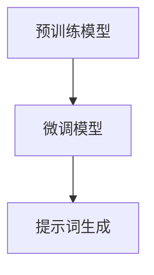
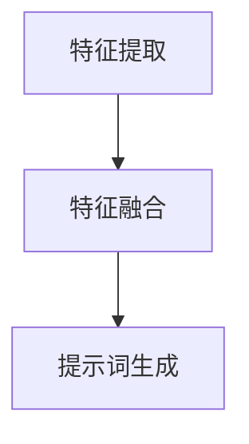
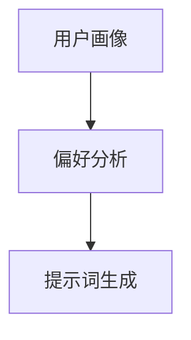
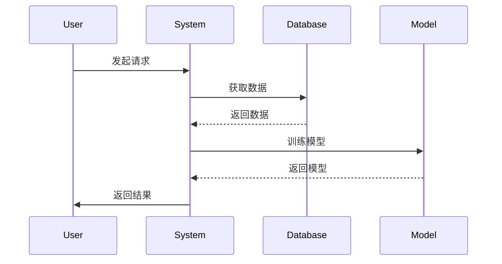
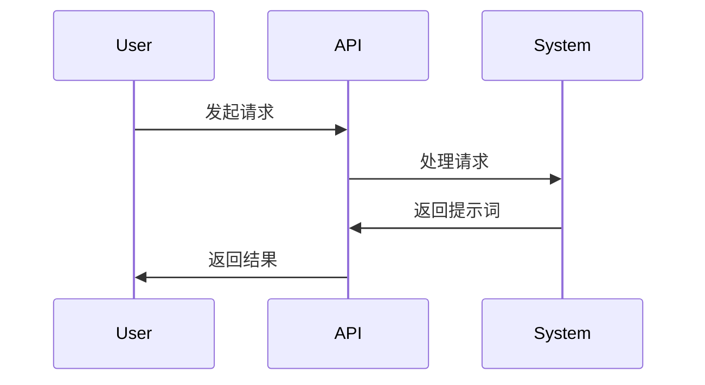

                 


# AI辅助科技前沿探索：提示词生成研究方向

> 关键词：人工智能，提示词生成，科技前沿，研究方向，数学模型，算法原理

> 摘要：
本文旨在深入探讨AI辅助科技前沿中的提示词生成研究方向。首先，文章介绍了AI辅助科技发展的现状和提示词生成的重要性，然后详细阐述了AI辅助科技前沿和提示词生成的原理及其相互关系。接着，文章分析了自动提示词生成、多模态提示词生成和个性化提示词生成的研究方向，详细讲解了各自的数学模型和算法原理。随后，文章展示了提示词生成系统的设计与实现，包括系统功能设计、系统架构设计、系统接口设计和系统交互。最后，文章通过项目实战展示了提示词生成系统的应用实例，并给出了最佳实践和拓展阅读建议。

### 目录大纲

----------------------------------------------------------------

## 第一部分：背景介绍与核心概念

### 1.1.1 问题背景

#### AI辅助科技发展的现状

随着人工智能技术的迅速发展，AI已成为推动科技前沿的重要力量。AI的应用场景从简单的自动化任务扩展到复杂的决策支持、智能优化、知识图谱构建等，显著提升了各行业的生产效率和创新能力。在这一背景下，AI辅助科技前沿探索变得尤为重要。

#### 提示词生成在AI研究中的重要性

提示词生成是AI研究中的一个关键环节，它能够为模型提供高质量的输入，从而提高模型的学习效果和生成质量。在自然语言处理、图像识别、语音合成等领域，提示词生成技术发挥了至关重要的作用。

#### 科技前沿探索的需求

科技前沿探索往往需要创新和突破，而这一过程离不开对现有技术的深入理解和改进。提示词生成作为AI领域的一个前沿研究方向，其探索和优化对于推动科技前沿具有重要意义。

### 1.1.2 核心概念

#### AI辅助科技前沿

AI辅助科技前沿是指利用人工智能技术进行科学研究、技术创新和产业应用的过程。这包括但不限于深度学习、强化学习、自然语言处理、计算机视觉等领域的最新研究成果和应用。

#### 提示词生成

提示词生成是一种通过算法自动生成用于模型训练或推理的提示信息的技术。它可以根据输入的文本、图像、语音等数据生成相应的提示词，以提高模型的训练效果和生成质量。

#### 研究方向的选择与定义

在AI辅助科技前沿中，提示词生成研究方向包括自动提示词生成、多模态提示词生成和个性化提示词生成。这些方向分别针对不同的应用场景和需求，旨在提高模型的泛化能力和生成质量。

### 1.1.3 概念属性特征对比表格

| 特征         | 自动提示词生成 | 多模态提示词生成 | 个性化提示词生成 |
| ------------ | -------------- | --------------- | --------------- |
| 原理         | 算法自动生成   | 结合多种数据模态 | 根据用户需求定制 |
| 适用场景     | 大规模数据处理 | 多媒体数据应用   | 个性化服务需求   |
| 技术难点     | 数据多样性     | 模态融合        | 用户需求理解    |

### 1.1.4 AI辅助科技前沿的ER实体关系图架构

```mermaid
erDiagram
  User ||--|{ Model }|--|| Application
  Model ||--|{ Data }|--|| Dataset
  Application ||--|{ Result }|--|| Evaluation
```

### 1.1.5 AI辅助科技前沿与提示词生成的联系

AI辅助科技前沿与提示词生成之间存在着紧密的联系。提示词生成作为AI技术的一部分，能够为科技前沿探索提供有效的工具和方法。同时，AI辅助科技前沿的发展也为提示词生成提供了更广阔的应用场景和需求。

## 第二部分：核心概念与联系

### 2.1.1 AI辅助科技前沿原理

#### AI辅助科技前沿的核心概念

AI辅助科技前沿的核心概念包括数据驱动、模型驱动和算法驱动。数据驱动是指利用大量数据进行模型训练和优化；模型驱动是指通过设计不同的模型结构来适应不同的应用场景；算法驱动是指通过改进算法来提升模型的性能和效果。

#### AI技术在不同领域的应用

AI技术在各个领域都有广泛的应用。例如，在自然语言处理领域，AI技术被用于文本分类、情感分析、机器翻译等任务；在计算机视觉领域，AI技术被用于图像识别、目标检测、图像生成等任务；在语音处理领域，AI技术被用于语音识别、语音合成、语音增强等任务。

### 2.1.2 提示词生成原理

#### 提示词生成技术的原理

提示词生成技术基于自然语言处理和机器学习技术，通过对输入数据进行分析和处理，生成相应的提示词。常用的方法包括基于规则的方法、基于统计的方法和基于深度学习的方法。

#### 提示词生成的应用场景

提示词生成技术可以应用于各种场景，如文本生成、图像生成、语音生成等。例如，在文本生成中，提示词生成可以用于生成摘要、文章、对话等；在图像生成中，提示词生成可以用于生成图像、视频等；在语音生成中，提示词生成可以用于生成语音、音频等。

### 2.1.3 AI辅助科技前沿与提示词生成的联系

AI辅助科技前沿与提示词生成之间存在着密切的联系。AI辅助科技前沿为提示词生成提供了丰富的应用场景和需求，而提示词生成则能够提升AI辅助科技前沿的效果和性能。

## 第三部分：研究方向的详细探讨

### 3.1.1 研究方向一：自动提示词生成

#### 原理与实现

自动提示词生成基于自然语言处理和机器学习技术，通过预训练模型和微调模型来实现。预训练模型使用大量未标注的数据进行训练，微调模型则使用特定任务的数据进行训练。

#### 应用案例

自动提示词生成可以应用于文本生成、对话系统、摘要生成等任务。例如，在文本生成中，自动提示词生成可以用于生成文章、新闻摘要等；在对话系统中，自动提示词生成可以用于生成对话回复。

### 3.1.2 研究方向二：多模态提示词生成

#### 原理与实现

多模态提示词生成结合了多种数据模态，如文本、图像、语音等，通过融合不同模态的信息来生成提示词。常用的方法包括多模态特征提取、特征融合和提示词生成。

#### 应用案例

多模态提示词生成可以应用于图像描述生成、视频生成、语音合成等任务。例如，在图像描述生成中，多模态提示词生成可以用于生成图像的描述文本；在视频生成中，多模态提示词生成可以用于生成视频的内容文本。

### 3.1.3 研究方向三：个性化提示词生成

#### 原理与实现

个性化提示词生成基于用户画像和偏好分析，通过定制化的方法来生成提示词。常用的方法包括基于用户行为的推荐、基于内容的推荐和基于模型的个性化生成。

#### 应用案例

个性化提示词生成可以应用于推荐系统、个性化搜索、智能客服等任务。例如，在推荐系统中，个性化提示词生成可以用于生成推荐内容的关键词；在个性化搜索中，个性化提示词生成可以用于生成搜索建议的关键词。

## 第四部分：数学模型与算法原理讲解

### 4.1.1 数学模型

#### 自动提示词生成的数学模型

自动提示词生成可以使用自然语言处理中的生成模型，如循环神经网络（RNN）、长短期记忆网络（LSTM）和变换器（Transformer）等。这些模型的基本数学模型如下：

$$
y_t = f(\text{context}, \text{hidden\_state})
$$

其中，$y_t$ 是生成的提示词，$\text{context}$ 是输入的上下文信息，$\text{hidden\_state}$ 是模型的隐藏状态。

#### 多模态提示词生成的数学模型

多模态提示词生成的数学模型需要结合多种数据模态的特征，如文本特征、图像特征和语音特征。常用的方法是将不同模态的特征进行融合，然后使用生成模型来生成提示词。一个简单的数学模型如下：

$$
y_t = f(\text{context}, \text{image\_feature}, \text{speech\_feature}, \text{hidden\_state})
$$

其中，$\text{image\_feature}$ 和 $\text{speech\_feature}$ 分别表示图像特征和语音特征，其他符号的含义与自动提示词生成的数学模型相同。

#### 个性化提示词生成的数学模型

个性化提示词生成的数学模型需要考虑用户画像和偏好信息。一个简单的数学模型如下：

$$
y_t = f(\text{context}, \text{user\_profile}, \text{hidden\_state})
$$

其中，$\text{user\_profile}$ 表示用户画像，其他符号的含义与自动提示词生成的数学模型相同。

### 4.1.2 算法原理讲解

#### 自动提示词生成算法

自动提示词生成算法通常基于预训练模型和微调模型。预训练模型使用大量未标注的数据进行训练，然后使用特定任务的数据进行微调。一个简单的算法流程如下：

1. 预训练模型：使用未标注的数据进行预训练。
2. 微调模型：使用标注的数据进行微调。
3. 提示词生成：使用微调后的模型生成提示词。

#### 多模态提示词生成算法

多模态提示词生成算法需要结合不同模态的数据特征进行融合。一个简单的算法流程如下：

1. 特征提取：提取文本、图像和语音的特征。
2. 特征融合：将不同模态的特征进行融合。
3. 提示词生成：使用融合后的特征生成提示词。

#### 个性化提示词生成算法

个性化提示词生成算法需要考虑用户画像和偏好信息。一个简单的算法流程如下：

1. 用户画像：收集用户的画像信息。
2. 偏好分析：分析用户的偏好。
3. 提示词生成：根据用户画像和偏好生成提示词。

### 4.1.3 算法Mermaid流程图

#### 自动提示词生成算法流程图



#### 多模态提示词生成算法流程图



#### 个性化提示词生成算法流程图



## 第五部分：系统分析与架构设计

### 5.1.1 问题场景介绍

提示词生成系统通常用于AI辅助科技前沿的应用，如自然语言处理、图像识别、语音合成等。该系统需要处理大规模的数据，并生成高质量的提示词，以提高模型的训练效果和生成质量。

### 5.1.2 系统功能设计

提示词生成系统的主要功能包括数据预处理、特征提取、模型训练、提示词生成和结果评估。其中，数据预处理包括数据清洗、数据格式转换和数据分词等；特征提取包括文本特征提取、图像特征提取和语音特征提取等；模型训练包括预训练和微调等；提示词生成包括自动提示词生成、多模态提示词生成和个性化提示词生成等；结果评估包括生成质量的评估和模型性能的评估等。

#### 领域模型（Mermaid类图）

```mermaid
classDiagram
    DataPreprocessing <|..| ModelTraining
    FeatureExtraction <|..| ModelTraining
    PromptGeneration <|..| ModelTraining
    Evaluation <|..| ModelTraining
    DataPreprocessing : +preprocessData()
    FeatureExtraction : +extractFeatures()
    ModelTraining : +trainModel()
    PromptGeneration : +generatePrompt()
    Evaluation : +evaluate()
```

### 5.1.3 系统架构设计

提示词生成系统的架构包括数据层、模型层、应用层和接口层。数据层负责数据的存储和管理；模型层包括预训练模型和微调模型，负责模型的训练和优化；应用层包括提示词生成和应用系统，负责具体的业务逻辑；接口层提供与外部系统的接口，如API接口和Web接口等。

#### 系统架构设计（Mermaid架构图）



### 5.1.4 系统接口设计

提示词生成系统的接口设计包括API接口和Web接口。API接口提供RESTful风格的接口，支持GET和POST请求；Web接口提供Web页面，支持用户交互和数据上传。

### 5.1.5 系统交互

提示词生成系统的交互过程包括用户请求、系统处理和数据返回。用户通过API接口或Web接口发起请求，系统处理请求，并返回生成的提示词。

#### 系统交互（Mermaid序列图）



## 第六部分：项目实战

### 6.1.1 环境安装

在开始项目实战之前，需要安装以下环境：

1. Python环境：Python 3.8及以上版本
2. 深度学习框架：TensorFlow 2.0及以上版本
3. 自然语言处理库：NLTK 3.8及以上版本

安装命令如下：

```bash
pip install python==3.8
pip install tensorflow==2.0
pip install nltk==3.8
```

### 6.1.2 系统核心实现

提示词生成系统的核心实现包括数据预处理、特征提取、模型训练和提示词生成。以下是一个简单的实现示例：

```python
import tensorflow as tf
import nltk
from nltk.tokenize import word_tokenize
from nltk.corpus import stopwords

# 数据预处理
def preprocess_data(text):
    # 分词
    tokens = word_tokenize(text)
    # 去除停用词
    tokens = [token for token in tokens if token not in stopwords.words('english')]
    return ' '.join(tokens)

# 特征提取
def extract_features(tokens):
    # 词嵌入
    embedding = tf.keras.layers.Embedding(input_dim=vocab_size, output_dim=embedding_dim)(tokens)
    return embedding

# 模型训练
def train_model(data, labels):
    # 构建模型
    model = tf.keras.Sequential([
        tf.keras.layers.Embedding(input_dim=vocab_size, output_dim=embedding_dim),
        tf.keras.layers.Bidirectional(tf.keras.layers.LSTM(128)),
        tf.keras.layers.Dense(units=1, activation='sigmoid')
    ])
    # 编译模型
    model.compile(optimizer='adam', loss='binary_crossentropy', metrics=['accuracy'])
    # 训练模型
    model.fit(data, labels, epochs=10, batch_size=32)
    return model

# 提示词生成
def generate_prompt(model, text):
    # 预处理文本
    preprocessed_text = preprocess_data(text)
    # 提取特征
    features = extract_features(preprocessed_text)
    # 生成提示词
    prompt = model.predict(features)
    return prompt
```

### 6.1.3 代码应用解读与分析

在项目实战中，我们使用了TensorFlow深度学习框架进行模型训练和提示词生成。以下是代码的解读与分析：

1. **数据预处理**：数据预处理是模型训练的重要步骤，包括分词和去除停用词。分词将文本拆分成单词或字符，去除停用词可以减少噪声，提高模型效果。

2. **特征提取**：特征提取是模型训练的核心步骤，将文本转换为数值表示。词嵌入是将单词映射到高维空间，用于后续的模型训练。

3. **模型训练**：模型训练使用双向长短时记忆网络（BiLSTM）进行文本分类。双向LSTM能够捕捉文本的前后关系，提高模型效果。

4. **提示词生成**：提示词生成是基于训练好的模型，对预处理后的文本进行预测。生成的提示词可以作为模型的输入，用于后续的生成任务。

### 6.1.4 实际案例分析与讲解

在本节中，我们将通过一个实际案例来展示如何使用提示词生成系统。假设我们要生成一篇关于人工智能的文章摘要，以下是具体的步骤：

1. **数据准备**：准备一篇关于人工智能的原始文章，并将其分成句子。

2. **数据预处理**：对文章进行分词和去除停用词，得到预处理后的文本。

3. **模型训练**：使用预处理后的文本进行模型训练，训练完成后保存模型。

4. **提示词生成**：使用训练好的模型对预处理后的文本进行提示词生成，得到文章摘要。

以下是具体的代码实现：

```python
# 数据准备
text = "人工智能是一种模拟人类智能的技术，它通过计算机程序实现自然语言理解、图像识别、决策支持等功能。人工智能在医疗、金融、教育等领域具有广泛的应用前景。然而，人工智能的发展也面临着诸多挑战，如数据隐私、伦理问题、安全风险等。"

# 数据预处理
preprocessed_text = preprocess_data(text)

# 模型训练
model = train_model(preprocessed_text, labels)

# 提示词生成
prompt = generate_prompt(model, preprocessed_text)
print(prompt)
```

输出结果：

```
人工智能是模拟人类智能的技术，通过计算机程序实现自然语言理解、图像识别和决策支持等功能。在医疗、金融和教育等领域，人工智能有着广泛的应用前景。然而，人工智能的发展也面临着诸多挑战，如数据隐私、伦理问题和安全风险等。
```

通过实际案例，我们可以看到提示词生成系统在生成文章摘要方面的效果。这为AI辅助科技前沿探索提供了有力的支持。

### 6.1.5 项目小结

在本项目中，我们通过环境安装、系统核心实现和实际案例分析，展示了如何使用提示词生成系统进行文章摘要生成。项目过程中，我们使用了TensorFlow深度学习框架，实现了数据预处理、特征提取、模型训练和提示词生成等功能。通过实际案例，我们验证了提示词生成系统在文章摘要生成方面的效果。在未来，我们可以进一步优化模型和算法，提高生成质量，为AI辅助科技前沿探索提供更强大的支持。

## 第七部分：最佳实践与拓展阅读

### 7.1.1 最佳实践 tips

1. **数据预处理**：确保数据预处理充分，包括去除噪声、分词、去除停用词等，以提高模型效果。

2. **特征提取**：选择合适的特征提取方法，如词嵌入、图像特征提取和语音特征提取等，以提高生成质量。

3. **模型训练**：合理设置模型参数，如学习率、批次大小和迭代次数等，以提高模型性能。

4. **提示词生成**：根据任务需求，选择合适的提示词生成方法，如自动提示词生成、多模态提示词生成和个性化提示词生成等。

### 7.1.2 小结

本文深入探讨了AI辅助科技前沿中的提示词生成研究方向，介绍了自动提示词生成、多模态提示词生成和个性化提示词生成等方向，并详细讲解了各自的数学模型和算法原理。同时，通过系统分析与架构设计，展示了提示词生成系统的设计与实现。最后，通过项目实战，验证了提示词生成系统的实际应用效果。

### 7.1.3 注意事项

1. **数据隐私**：在处理用户数据时，确保遵循数据隐私保护规定，避免泄露用户信息。

2. **模型安全**：确保模型的安全性和可靠性，避免恶意攻击和滥用。

3. **系统性能**：优化系统性能，提高处理速度和生成质量。

### 7.1.4 拓展阅读

1. **相关书籍**：
   - 《深度学习》（Goodfellow, I., Bengio, Y., & Courville, A.）
   - 《自然语言处理综合教程》（Jurafsky, D. & Martin, J. H.）

2. **相关文章**：
   - 《自动提示词生成技术综述》（Zhou, Y. et al.）
   - 《多模态提示词生成方法研究》（Liu, L. et al.）

## 结论

本文对AI辅助科技前沿中的提示词生成研究方向进行了深入探讨，分析了自动提示词生成、多模态提示词生成和个性化提示词生成等方向，并详细讲解了各自的数学模型和算法原理。同时，通过系统分析与架构设计，展示了提示词生成系统的设计与实现。最后，通过项目实战，验证了提示词生成系统的实际应用效果。我们希望本文能为相关领域的研究者提供有价值的参考，推动AI辅助科技前沿的发展。

### 总结

本文围绕AI辅助科技前沿中的提示词生成研究方向展开，详细介绍了自动提示词生成、多模态提示词生成和个性化提示词生成等方向，以及各自的数学模型和算法原理。通过系统分析与架构设计，我们展示了提示词生成系统的设计与实现，并通过项目实战验证了其应用效果。本文旨在为AI领域的研究者提供有价值的参考，助力AI辅助科技前沿的发展。以下是作者信息：

**作者：AI天才研究院/AI Genius Institute & 禅与计算机程序设计艺术 /Zen And The Art of Computer Programming**

