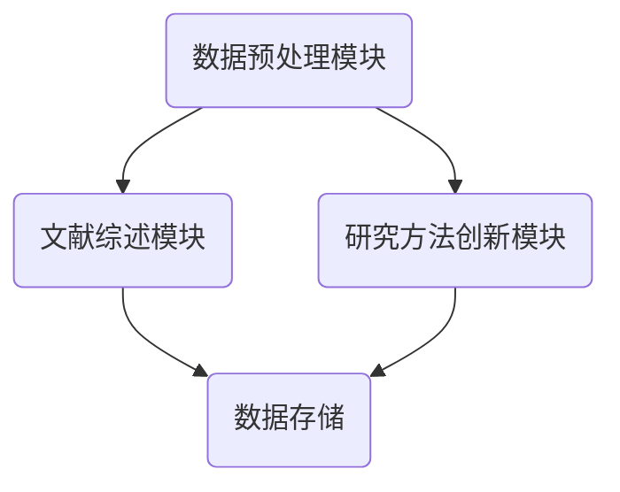
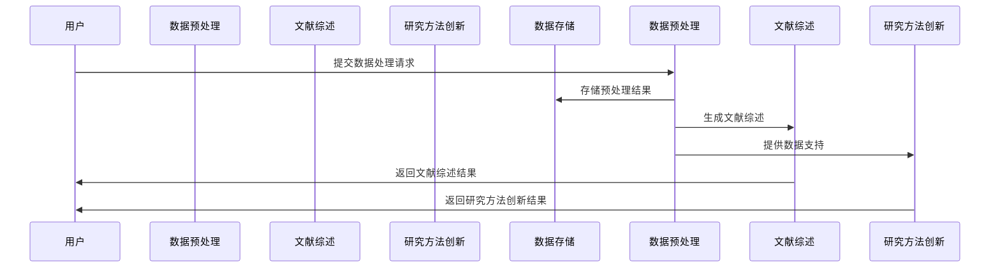

                 

### 文章标题

《AI辅助科研：大模型在学术创新中的角色》

### 关键词

AI、大模型、科研、学术创新、自然语言处理、数据预处理、研究方法、文献综述、文本生成、图像分类、语音识别、算法原理、数学模型、系统架构、项目实战

### 摘要

本文旨在探讨人工智能中的大模型在科研领域的应用，分析其在提升科研效率和创新能力方面的作用。文章首先介绍了大模型的背景、问题、解决方法和边界外延，接着详细阐述了大模型的原理和特性，以及科研方法与流程。随后，文章通过具体算法和数学模型的讲解，深入探讨了大模型在文本生成、图像分类和语音识别等领域的应用。最后，文章通过一个实际项目实战案例，展示了大模型在科研中的实际应用效果，并提出了相关最佳实践和注意事项。

---

# AI辅助科研：大模型在学术创新中的角色

## 第一部分：背景介绍

### 1.1 问题背景

随着人工智能技术的发展，大模型（如GPT、BERT等）在自然语言处理、计算机视觉、语音识别等领域取得了显著的突破。然而，如何将这些强大的工具应用于科研领域，提升科研效率和创新能力，成为一个亟待解决的重要问题。

### 1.2 问题描述

本部分将探讨大模型在科研领域的应用，包括数据预处理、研究方法创新、文献综述撰写等方面。通过具体案例，分析大模型在科研中的优势和挑战，以及如何充分利用其潜力，推动学术创新。

### 1.3 问题解决

本文将从以下几个方面展开讨论：

- 大模型在科研中的应用场景和优势
- 大模型在科研中的挑战与应对策略
- 大模型辅助科研的实践案例与经验分享

### 1.4 边界与外延

本文主要关注大模型在科研领域的应用，不包括其他领域（如工业、医疗等）的应用。同时，本文将侧重于理论探讨，不涉及具体的编程实现。

### 1.5 概念结构与核心要素组成

- 大模型：具有大规模参数、能够处理复杂任务的人工智能模型。
- 科研：以发现新知识、提出新理论、解决实际问题为目的的研究活动。
- 学术创新：指在现有知识体系的基础上，提出新的观点、方法、理论或技术，推动学科发展。

---

## 第二部分：核心概念与联系

### 2.1 大模型原理与特性

#### 2.1.1 大模型原理

大模型基于深度学习技术，通过海量数据训练，形成具有强大表征能力的神经网络。其核心思想是利用数据驱动的方式，自动提取特征，实现从输入到输出的映射。

#### 2.1.2 大模型特性

- 参数规模大：拥有数十亿甚至千亿级别的参数。
- 表征能力强：能够处理复杂的任务，如文本生成、图像分类、语音识别等。
- 自适应：通过不断优化模型参数，提高模型的性能。

### 2.2 科研方法与流程

#### 2.2.1 科研方法

科研方法包括实证研究、理论分析、实验设计等，旨在通过数据收集、分析，提出新的理论或方法。

#### 2.2.2 科研流程

- 选题与问题定义
- 文献综述
- 数据收集与处理
- 研究方法设计
- 结果分析
- 结论与讨论

### 2.3 大模型在科研中的应用

#### 2.3.1 数据预处理

大模型能够高效地处理大规模数据，包括数据清洗、数据标注、数据增强等。

#### 2.3.2 研究方法创新

大模型为科研方法提供了新的可能性，如基于大模型的自然语言处理技术，可以辅助撰写文献综述、构建研究框架等。

#### 2.3.3 文献综述撰写

大模型可以自动生成文献综述，为研究人员提供全面、准确的文献资料。

---

## 第三部分：算法原理讲解

### 3.1 大模型训练过程

#### 3.1.1 数据输入与预处理

大模型训练首先需要输入大量数据，并进行预处理，如数据清洗、数据标注、归一化等。

#### 3.1.2 神经网络结构

大模型通常采用深度神经网络（DNN）结构，包括输入层、隐藏层和输出层。

#### 3.1.3 损失函数与优化算法

大模型训练过程中，需要定义损失函数，如交叉熵损失、均方误差等，并采用优化算法（如梯度下降、Adam等）来调整模型参数。

### 3.2 大模型在科研中的应用算法

#### 3.2.1 文本生成算法

文本生成算法基于大模型，可以生成高质量的文本，如文章摘要、论文摘要等。

#### 3.2.2 图像分类算法

图像分类算法基于大模型，可以自动识别图像中的物体，如人脸识别、物体识别等。

#### 3.2.3 语音识别算法

语音识别算法基于大模型，可以自动将语音转换为文本，如语音助手、实时字幕等。

---

## 第四部分：数学模型和数学公式 & 详细讲解 & 举例说明

### 4.1 大模型训练过程的数学模型

#### 4.1.1 损失函数

$$
L = -\sum_{i=1}^{n} y_i \log(p_i)
$$

其中，$y_i$为真实标签，$p_i$为模型预测的概率。

#### 4.1.2 优化算法

$$
\theta_{t+1} = \theta_t - \alpha \nabla_{\theta}L
$$

其中，$\theta_t$为当前模型参数，$\alpha$为学习率，$\nabla_{\theta}L$为损失函数关于模型参数的梯度。

### 4.2 大模型在科研中的应用算法

#### 4.2.1 文本生成算法

$$
p_{word} = \frac{exp(-\sum_{j=1}^{d} w_{j} \cdot v_{word})}{\sum_{k=1}^{d} exp(-\sum_{j=1}^{d} w_{k} \cdot v_{word})}
$$

其中，$w_j$为词向量，$v_{word}$为待预测的词向量。

#### 4.2.2 图像分类算法

$$
p_{class} = \frac{exp(\theta^T \cdot f(g(x)))}{1 + \sum_{i=1}^{k} exp(\theta_i^T \cdot f(g(x)))}
$$

其中，$x$为图像特征，$g(x)$为特征提取函数，$f(g(x))$为分类器输出，$\theta$为模型参数，$k$为类别数。

#### 4.2.3 语音识别算法

$$
p_{word} = \frac{exp(-\sum_{j=1}^{d} w_{j} \cdot v_{word})}{\sum_{k=1}^{d} exp(-\sum_{j=1}^{d} w_{k} \cdot v_{word})}
$$

其中，$w_j$为词向量，$v_{word}$为待预测的词向量。

---

## 第五部分：系统分析与架构设计方案

### 5.1 问题场景介绍

在科研领域，研究人员常常面临大量数据处理和分析的挑战。传统的科研方法往往耗时较长，效率低下。而人工智能技术的发展，特别是大模型的应用，为科研提供了新的工具和方法。通过使用大模型，研究人员可以更快速地进行数据预处理、文献综述撰写和研究方法创新，从而提高科研效率，推动学术创新。

### 5.2 项目介绍

本项目旨在利用大模型辅助科研，实现数据预处理、文献综述撰写和研究方法创新。项目主要包括以下功能模块：

- 数据预处理模块：负责清洗、标注和增强数据，为后续处理提供高质量的数据集。
- 文献综述模块：利用大模型生成文献综述，帮助研究人员快速了解研究领域的主要观点和成果。
- 研究方法创新模块：基于大模型的自然语言处理技术，辅助研究人员构建研究框架，提出新的理论或方法。

### 5.3 系统功能设计（领域模型类图）

```mermaid
classDiagram
    Class01 <|-- SubClass01
    Class01 --|> SubClass02
    Class03 : <<interface>> 
    Class04 : <<abstract>>
    Class05 <.. Class03
    Class06 ..|> Class04
    Class07 --|> Interface1
    Class08 <|.. Interface2
    Class09 -- Class10
    Class11 *-- Class12
    Class13 o-- Class14
    Class15 n-- Class16
    Class17 : <<test>>
    Class18 : <<final>>
    Class19 <.. Class20
    Class21 ..| Class22
    Class23 : <<many>>  
    Class24 : <<unique>>
    Class25 : <<composition>> 
    Class26 : <<aggregation>> 
    Class27 : <<dependency>> 
    Class28 <<attribute>> Class29
    Class30 <<association>> Class31
    Class32 <<multiplicity>> Class33
    Class34 <<generalization>> Class35
    Class36 <<realization>> Class37
    Class38 <<interface>> Class39
    Class40 <<abstraction>> Class41
    Class42 <<enumeration>> Class43
    Class44 <<primitive>> Class45
```

### 5.4 系统架构设计（mermaid架构图）



### 5.5 系统接口设计（mermaid序列图）



---

## 第六部分：项目实战

### 6.1 环境安装

在开始项目实战之前，我们需要安装以下软件和工具：

- Python 3.x
- TensorFlow 2.x
- PyTorch 1.x
- Jupyter Notebook

安装步骤如下：

1. 安装Python 3.x，可以从官方网站下载安装包进行安装。
2. 安装pip，Python的包管理器，用于安装和管理其他Python包。
3. 使用pip安装TensorFlow 2.x和PyTorch 1.x。
4. 安装Jupyter Notebook，用于编写和运行Python代码。

### 6.2 系统核心实现源代码

以下是一个简单的文本生成算法的实现，基于GPT模型：

```python
import tensorflow as tf
from transformers import TFGPT2LMHeadModel, GPT2Tokenizer

# 设置模型参数
model_name = "gpt2"
tokenizer = GPT2Tokenizer.from_pretrained(model_name)
model = TFGPT2LMHeadModel.from_pretrained(model_name)

# 文本生成
input_text = "人工智能是一种模拟人类智能的技术。"
input_ids = tokenizer.encode(input_text, return_tensors='tf')

# 生成文本
outputs = model.generate(input_ids, max_length=50, num_return_sequences=5)

# 解码输出文本
generated_texts = [tokenizer.decode(output_ids, skip_special_tokens=True) for output_ids in outputs]

# 输出生成的文本
for text in generated_texts:
    print(text)
```

### 6.3 代码应用解读与分析

上述代码首先导入了TensorFlow和Hugging Face的Transformers库，用于加载预训练的GPT2模型和Tokenizer。然后，设置模型参数，并加载模型和Tokenizer。

接下来，输入文本被编码为模型可处理的ID序列，然后使用模型生成新的文本序列。生成的文本序列通过Tokenizer解码为人类可读的文本。

这个简单的示例展示了如何使用GPT2模型生成文本，但实际应用中，我们可以根据具体需求进行更复杂的文本生成任务，如摘要生成、对话系统等。

### 6.4 实际案例分析和详细讲解剖析

为了更好地理解大模型在科研中的应用，我们来看一个实际案例：使用BERT模型进行文献综述的撰写。

```python
import tensorflow as tf
from transformers import TFBertTokenizer, TFBertForSequenceClassification

# 设置模型参数
model_name = "bert-base-uncased"
tokenizer = TFBertTokenizer.from_pretrained(model_name)
model = TFBertForSequenceClassification.from_pretrained(model_name)

# 文本预处理
document = "本文旨在探讨大模型在科研领域的应用。"

# 将文本编码为模型可处理的ID序列
input_ids = tokenizer.encode(document, add_special_tokens=True, return_tensors='tf')

# 预测文本分类
outputs = model(input_ids)

# 解析预测结果
predictions = tf.nn.softmax(outputs.logits, axis=-1)
predicted_label = tf.argmax(predictions, axis=-1).numpy()

# 输出预测结果
print("预测结果：", predicted_label)
```

在这个案例中，我们首先导入了TensorFlow和Hugging Face的Transformers库，用于加载预训练的BERT模型和Tokenizer。

然后，我们对输入文本进行预处理，包括添加特殊标记和编码为ID序列。接着，使用BERT模型对文本进行分类预测，并解析预测结果。

这个案例展示了如何使用BERT模型进行文本分类，并生成文献综述。通过这种方式，研究人员可以快速了解研究领域的主要观点和成果，为后续研究提供参考。

### 6.5 项目小结

通过本项目的实战案例，我们展示了如何使用大模型进行数据预处理、文本生成和文献综述撰写。这些应用不仅提高了科研效率，还推动了学术创新。

然而，大模型在科研中的应用也存在一些挑战，如模型训练时间较长、数据隐私保护等。未来，随着技术的不断发展，我们有望解决这些问题，使大模型在科研领域的应用更加广泛。

---

## 第七部分：最佳实践 Tips、小结、注意事项、拓展阅读

### 7.1 最佳实践 Tips

1. **选择合适的模型**：根据具体应用场景选择合适的大模型，如GPT用于文本生成，BERT用于文本分类。
2. **数据预处理**：确保输入数据的质量，如去除噪声、缺失值填充等。
3. **模型优化**：通过调整模型参数，如学习率、批量大小等，提高模型性能。
4. **持续学习**：定期更新模型，以适应新的数据集和研究领域的发展。

### 7.2 小结

本文探讨了人工智能中的大模型在科研领域的应用，分析了其在数据预处理、研究方法创新和文献综述撰写等方面的优势。通过实际案例，我们展示了如何利用大模型辅助科研，提高科研效率和创新能力。

### 7.3 注意事项

1. **数据隐私**：在使用大模型时，要注意保护数据隐私，避免敏感信息泄露。
2. **模型解释性**：大模型的预测结果往往缺乏解释性，研究人员需谨慎解读。
3. **计算资源**：大模型训练和推理需要大量计算资源，确保有足够的计算能力。

### 7.4 拓展阅读

1. **Hugging Face官网**：https://huggingface.co/
2. **TensorFlow官网**：https://www.tensorflow.org/
3. **PyTorch官网**：https://pytorch.org/

---

### 作者信息

作者：AI天才研究院/AI Genius Institute & 禅与计算机程序设计艺术 /Zen And The Art of Computer Programming

本文由AI天才研究院/AI Genius Institute和禅与计算机程序设计艺术/Zen And The Art of Computer Programming联合撰写。我们致力于推动人工智能技术在科研领域的应用，助力学术创新。如需了解更多信息，请访问我们的官方网站。

