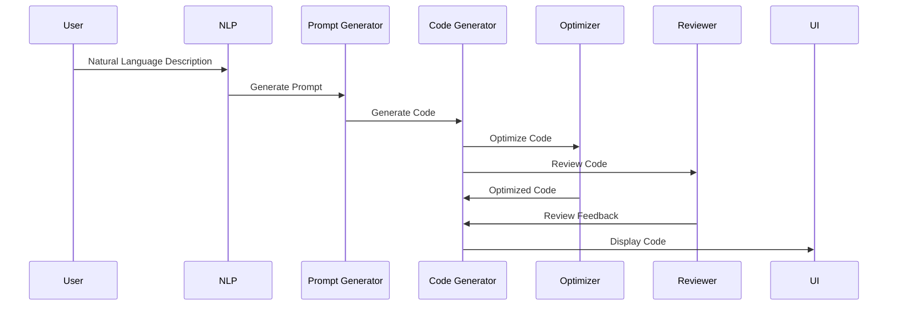
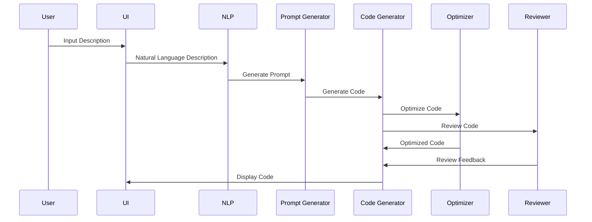

                 


## 《AI辅助编程中的提示词设计》

### 关键词：
- AI辅助编程
- 提示词设计
- 语言模型
- 代码生成模型
- 算法原理
- 系统架构

### 摘要：
本文将深入探讨AI辅助编程中的提示词设计。我们将从背景介绍开始，逐步分析核心概念、算法原理，并探讨其在系统架构中的应用。通过实际项目实战，我们将展示提示词设计的具体实施过程，并提供最佳实践和注意事项。最后，我们将总结全文，并给出拓展阅读的建议。

----------------------------------------------------------------

## 目录大纲设计思路

在设计目录大纲时，我们需要确保其逻辑清晰、内容详尽，以便读者能够系统地学习《AI辅助编程中的提示词设计》这一主题。

### 1. 确定核心章节

首先，我们将确定以下核心章节：
- **背景介绍**：介绍AI辅助编程和提示词设计的相关背景知识。
- **核心概念与联系**：阐述提示词设计中的关键概念及其相互关系。
- **算法原理讲解**：深入讲解提示词设计的主要算法原理。
- **系统分析与架构设计方案**：描述提示词设计在系统中的实际应用。
- **项目实战**：通过实例展示提示词设计的实际应用。
- **最佳实践 tips、小结、注意事项、拓展阅读**：总结全书内容，提供实践建议和进一步学习资源。

### 2. 设定章节层级

我们将目录结构设定为三个层级，以便于读者快速定位内容：
- **一级目录**：包含背景介绍、核心概念与联系、算法原理讲解等，概括书籍的主要内容。
- **二级目录**：细化每个核心章节，进一步明确每个部分的具体内容。
- **三级目录**：深入到具体知识点和算法细节，提供更详细的信息。

### 3. 确保内容完整性

每个核心章节将包含以下内容：
- **章节标题**：简洁明了地概括章节内容。
- **子章节标题**：细化章节内容，确保每个子章节都有明确的主题。
- **具体内容**：确保内容完整，逻辑清晰，能够帮助读者理解和掌握相关知识点。

### 4. 采用Markdown格式

我们将使用Markdown格式编写目录大纲，以确保格式统一、易于阅读和编辑。

以下是初步设计的目录大纲：

```markdown
# 《AI辅助编程中的提示词设计》目录大纲

## 第一部分：背景介绍

### 1.1 AI辅助编程概述
#### 1.1.1 AI辅助编程的概念
#### 1.1.2 AI辅助编程的发展历程
#### 1.1.3 AI辅助编程的优势与挑战

### 1.2 提示词设计的基础
#### 1.2.1 提示词的定义与作用
#### 1.2.2 提示词设计的原则
#### 1.2.3 提示词设计的流程

## 第二部分：核心概念与联系

### 2.1 提示词设计的关键概念
#### 2.1.1 语言模型
#### 2.1.2 代码生成模型
#### 2.1.3 提示词生成策略

### 2.2 概念属性特征对比
#### 2.2.1 语言模型对比
#### 2.2.2 代码生成模型对比
#### 2.2.3 提示词生成策略对比

### 2.3 ER实体关系图架构
#### 2.3.1 提示词设计中的ER图
#### 2.3.2 实体与关系的定义
#### 2.3.3 ER图的绘制与解析

## 第三部分：算法原理讲解

### 3.1 语言模型原理
#### 3.1.1 语言模型的数学模型
#### 3.1.2 语言模型的训练过程
#### 3.1.3 语言模型的评估与优化

### 3.2 代码生成模型原理
#### 3.2.1 代码生成模型的类型
#### 3.2.2 代码生成模型的训练方法
#### 3.2.3 代码生成模型的评估与优化

### 3.3 提示词生成策略
#### 3.3.1 提示词生成策略的分类
#### 3.3.2 提示词生成策略的设计与实现
#### 3.3.3 提示词生成策略的优化

## 第四部分：系统分析与架构设计方案

### 4.1 问题场景介绍
#### 4.1.1 提示词设计在AI辅助编程中的应用
#### 4.1.2 项目介绍
#### 4.1.3 系统功能设计

### 4.2 系统架构设计
#### 4.2.1 系统架构概述
#### 4.2.2 系统架构图
#### 4.2.3 系统接口设计

### 4.3 系统交互
#### 4.3.1 系统交互流程
#### 4.3.2 系统交互序列图

## 第五部分：项目实战

### 5.1 环境安装
#### 5.1.1 环境配置
#### 5.1.2 工具安装
#### 5.1.3 测试环境搭建

### 5.2 系统核心实现源代码
#### 5.2.1 代码结构
#### 5.2.2 代码应用解读
#### 5.2.3 代码分析与优化

### 5.3 实际案例分析和详细讲解
#### 5.3.1 案例介绍
#### 5.3.2 案例分析与讲解
#### 5.3.3 案例总结与反思

### 5.4 项目小结
#### 5.4.1 项目成果
#### 5.4.2 项目反思
#### 5.4.3 下一步工作方向

## 最佳实践 tips
- **注意事项**
- **拓展阅读**

----------------------------------------------------------------

## 第一部分：背景介绍

### 1.1 AI辅助编程概述

#### 1.1.1 AI辅助编程的概念

AI辅助编程，顾名思义，是利用人工智能技术来辅助开发者进行编程工作。具体来说，它包括代码自动生成、代码优化、代码审查、错误检测等多个方面。通过引入AI技术，编程工作可以变得更加高效、准确和智能。

#### 1.1.2 AI辅助编程的发展历程

AI辅助编程的历史可以追溯到20世纪80年代，当时人工智能领域的研究主要集中在规则系统、知识表示和搜索算法等方面。随着计算机性能的提升和算法的进步，AI辅助编程逐渐成为研究热点。近年来，深度学习技术的发展为AI辅助编程带来了新的机遇，使得自动编程、自然语言处理等技术得以广泛应用。

#### 1.1.3 AI辅助编程的优势与挑战

AI辅助编程具有以下几个显著优势：
1. **提高开发效率**：AI技术可以自动化部分编程任务，减少开发者的工作量。
2. **降低开发成本**：通过自动化和智能化，减少了人工错误和重复劳动。
3. **提高代码质量**：AI技术可以对代码进行审查和优化，提高代码的可读性和可维护性。

然而，AI辅助编程也面临着一些挑战：
1. **技术复杂性**：AI技术的应用涉及多个领域，包括机器学习、自然语言处理、计算机视觉等，对开发者的技术要求较高。
2. **数据依赖性**：AI技术需要大量高质量的数据进行训练，数据质量和数量对算法性能有重要影响。
3. **代码理解与生成**：将自然语言描述转化为可执行的代码是AI辅助编程的核心挑战，如何准确理解用户的意图并生成高质量的代码是一个亟待解决的问题。

### 1.2 提示词设计的基础

#### 1.2.1 提示词的定义与作用

提示词（Prompt）是在AI辅助编程中用于引导代码生成模型的关键输入。它通常是一个自然语言描述，用于指示模型要生成什么样的代码。提示词的设计直接影响代码生成模型的性能和生成代码的质量。

提示词的作用主要包括：
1. **指导模型理解**：提示词可以帮助模型理解开发者的意图，从而生成更符合需求的代码。
2. **提高代码生成效率**：通过精准的提示词，可以减少模型搜索空间，提高代码生成的速度。
3. **提升代码生成质量**：高质量的提示词可以引导模型生成更加优雅、可读性和可维护性更高的代码。

#### 1.2.2 提示词设计的原则

设计提示词时，应遵循以下原则：
1. **明确性**：提示词应尽量明确，避免歧义，使模型能够准确理解开发者的意图。
2. **简洁性**：简洁的提示词可以提高模型的处理效率，减少计算资源消耗。
3. **多样性**：设计多种不同形式的提示词，以应对不同类型的编程任务。
4. **适应性**：提示词应能够适应不同编程环境和需求，具有灵活性。

#### 1.2.3 提示词设计的流程

提示词设计的一般流程如下：
1. **需求分析**：了解编程任务的具体需求和目标。
2. **提示词生成策略选择**：根据需求选择合适的提示词生成策略。
3. **提示词模板设计**：设计符合需求、具有明确性和简洁性的提示词模板。
4. **提示词评估与优化**：通过实际应用和评估，不断优化提示词的设计。

### 1.3 问题背景与问题描述

随着AI辅助编程技术的不断发展，如何设计高质量的提示词成为了一个重要问题。一方面，现有的提示词设计方法存在一定的局限性，难以满足多样化、复杂化的编程任务需求。另一方面，提示词设计过程中涉及的自然语言理解和代码生成技术尚未完全成熟，导致生成的代码质量有待提高。

在本文中，我们将探讨如何从算法原理、系统架构和实际项目三个层面，深入研究和设计高质量的提示词。通过结合实际案例，我们将展示如何应用这些方法，解决提示词设计中的关键问题，为AI辅助编程的发展提供新的思路和方向。

### 1.4 问题解决思路与边界外延

#### 问题解决思路

1. **算法原理讲解**：首先，我们将深入讲解提示词设计中的关键算法原理，包括语言模型、代码生成模型和提示词生成策略。
2. **系统分析与架构设计**：然后，我们将分析提示词设计在系统中的应用，并设计一个具有可扩展性和灵活性的系统架构。
3. **项目实战**：最后，我们将通过一个实际项目，展示如何应用这些方法和技巧，解决提示词设计中的具体问题。

#### 边界外延

在研究提示词设计时，我们应考虑以下边界外延：
1. **技术范畴**：本文主要探讨基于AI技术的提示词设计，不包括传统的编程辅助工具。
2. **应用场景**：本文将聚焦于通用编程任务，不涉及特定领域如金融、医疗等专业的编程任务。
3. **数据质量**：高质量的数据对于提示词设计至关重要，本文将讨论如何获取和处理高质量数据。

### 1.5 概念结构与核心要素组成

在提示词设计中，核心概念和要素主要包括：
1. **自然语言处理**：自然语言处理（NLP）技术用于解析和处理提示词，理解开发者的意图。
2. **代码生成模型**：代码生成模型是核心组件，用于将提示词转化为实际代码。
3. **提示词生成策略**：提示词生成策略用于设计高质量的提示词，指导代码生成模型。
4. **评估与优化**：通过评估和优化，不断提升提示词设计的质量和性能。

这些核心要素相互关联，共同构成一个完整的提示词设计系统。

----------------------------------------------------------------

## 第二部分：核心概念与联系

在深入探讨AI辅助编程中的提示词设计之前，我们需要明确几个核心概念，并分析它们之间的相互关系。这些核心概念包括语言模型、代码生成模型和提示词生成策略。在本节中，我们将详细阐述这些概念，并进行属性特征对比，最后展示ER实体关系图架构。

### 2.1 提示词设计的关键概念

#### 2.1.1 语言模型

语言模型是自然语言处理（NLP）领域的基础，用于预测文本序列的概率分布。在AI辅助编程中，语言模型主要用于理解和生成自然语言描述，从而指导代码生成模型生成相应的代码。

语言模型的主要属性特征包括：

- **训练数据**：语言模型需要大量高质量的训练数据，以充分学习自然语言的规律。
- **词汇表**：语言模型基于词汇表进行预测，词汇表的规模和丰富程度对模型的性能有很大影响。
- **上下文理解**：高级语言模型可以理解上下文信息，从而提高预测的准确性。

#### 2.1.2 代码生成模型

代码生成模型是AI辅助编程的核心组件，负责将自然语言描述转化为实际代码。代码生成模型可以是基于规则的系统，也可以是基于深度学习的模型。在本文中，我们主要关注基于深度学习的代码生成模型，如Transformer和GPT。

代码生成模型的主要属性特征包括：

- **输入格式**：代码生成模型通常需要处理自然语言描述和代码模板作为输入。
- **生成机制**：代码生成模型通过预测下一个代码片段，逐步生成完整的代码。
- **多样性**：代码生成模型需要能够生成多样性的代码，以满足不同编程任务的需求。

#### 2.1.3 提示词生成策略

提示词生成策略是设计高质量提示词的关键。提示词生成策略决定了如何从自然语言描述中提取关键信息，并生成指导代码生成模型的提示词。

提示词生成策略的主要属性特征包括：

- **语义理解**：提示词生成策略需要理解自然语言描述的语义，从而生成准确的提示词。
- **上下文依赖**：提示词生成策略需要考虑上下文信息，以提高提示词的相关性和准确性。
- **适应性**：提示词生成策略应具备灵活性，能够适应不同的编程环境和需求。

### 2.2 概念属性特征对比

为了更好地理解这些核心概念，我们可以通过一个表格来对比它们的属性特征：

| 概念         | 属性特征                     | 说明                                                         |
| ------------ | ---------------------------- | ------------------------------------------------------------ |
| 语言模型     | - 训练数据<br>- 词汇表<br>- 上下文理解 | 用于理解和生成自然语言描述，指导代码生成模型。                   |
| 代码生成模型 | - 输入格式<br>- 生成机制<br>- 多样性 | 将自然语言描述转化为实际代码，实现代码自动生成。                 |
| 提示词生成策略 | - 语义理解<br>- 上下文依赖<br>- 适应性 | 设计高质量提示词，提高代码生成模型的性能。                       |

### 2.3 ER实体关系图架构

为了更好地理解提示词设计中的核心概念及其相互关系，我们可以使用ER（实体关系）图来展示这些实体及其关联。以下是一个简化的ER图示例：

```mermaid
erDiagram
  Customer ||--|{ Order : "makes" |
  Product ||--|{ Order : "contains" |
  OrderLine ||--|{ Order : "includes" |
  Customer "Customer who makes orders"
  Product "Product in the order"
  Order "Order made by Customer"
  OrderLine "Line item in an Order"
```

在这个ER图中，我们定义了四个实体：客户（Customer）、产品（Product）、订单（Order）和订单行（OrderLine）。这些实体之间的关系包括：
- 客户制作订单（Customer "makes" Order）。
- 产品包含在订单中（Product "contains" Order）。
- 订单行包括在订单中（OrderLine "includes" Order）。

在AI辅助编程的提示词设计中，我们也可以使用类似的ER图来描述各个核心概念及其关联。例如，我们可以定义“自然语言描述”作为“输入实体”，“语言模型”作为“处理实体”，“代码生成模型”作为“输出实体”，以及“提示词生成策略”作为“指导实体”。通过这种方式，我们可以清晰地展示这些实体在提示词设计中的相互作用。

### 小结

在本节中，我们介绍了AI辅助编程中提示词设计的三个关键概念：语言模型、代码生成模型和提示词生成策略。通过对比这些概念的属性特征，我们更好地理解了它们在提示词设计中的作用。此外，通过ER实体关系图架构，我们展示了这些概念之间的相互关系。接下来，我们将深入探讨这些概念背后的算法原理，以帮助我们更好地设计和实现高质量的提示词。

----------------------------------------------------------------

## 第三部分：算法原理讲解

在了解了AI辅助编程中提示词设计的核心概念之后，我们需要深入探讨这些算法原理，以便更好地设计和实现高质量的提示词。本部分将分为三个小节，分别讲解语言模型原理、代码生成模型原理和提示词生成策略。

### 3.1 语言模型原理

#### 3.1.1 语言模型的数学模型

语言模型的核心是一个概率模型，用于预测给定前文序列 \(w_1, w_2, \ldots, w_{t-1}\) 后的下一个词 \(w_t\)。一个常见的方法是使用n元语法模型（n-gram model），其中n表示前文序列的长度。n元语法模型的数学表示如下：

\[ P(w_t | w_1, w_2, \ldots, w_{t-1}) = \frac{C(w_1, w_2, \ldots, w_t)}{C(w_1, w_2, \ldots, w_{t-1})} \]

其中，\(C(w_1, w_2, \ldots, w_t)\) 表示单词序列 \(w_1, w_2, \ldots, w_t\) 在训练数据中的联合计数，\(C(w_1, w_2, \ldots, w_{t-1})\) 表示单词序列 \(w_1, w_2, \ldots, w_{t-1}\) 在训练数据中的联合计数。

#### 3.1.2 语言模型的训练过程

语言模型的训练过程是一个概率估计过程，目的是学习每个单词序列的概率分布。常见的训练方法包括：

1. **最大似然估计（MLE）**：通过最大化训练数据中的联合概率来估计模型参数。
2. **反向传播（Backpropagation）**：用于优化神经网络的参数，常见于深度学习语言模型。

以下是一个简化的训练过程：

1. **数据准备**：从训练数据中提取所有可能的单词序列。
2. **构建词汇表**：将单词映射到唯一的索引。
3. **计算概率分布**：对于每个单词序列，计算其概率分布。
4. **参数优化**：使用优化算法（如梯度下降）调整模型参数，以最大化概率分布。

#### 3.1.3 语言模型的评估与优化

语言模型的评估通常使用跨熵（Cross-Entropy）作为损失函数，其公式如下：

\[ H(Y, \hat{Y}) = -\sum_{i} y_i \log(\hat{y}_i) \]

其中，\(Y\) 表示真实分布，\(\hat{Y}\) 表示预测分布。

语言模型的优化过程包括：

1. **梯度计算**：计算损失函数关于模型参数的梯度。
2. **参数更新**：使用梯度下降等优化算法更新模型参数。
3. **正则化**：为了防止过拟合，可以添加正则化项，如L1、L2正则化。

### 3.2 代码生成模型原理

#### 3.2.1 代码生成模型的类型

代码生成模型主要分为两类：基于规则的模型和基于神经网络的模型。基于规则的模型通常使用符号逻辑和编程语言规则来生成代码，如语法分析器和代码生成器。基于神经网络的模型则使用深度学习技术，如Transformer和GPT，来自动学习代码生成规则。

#### 3.2.2 代码生成模型的训练方法

代码生成模型的训练方法通常包括：

1. **序列到序列（Seq2Seq）模型**：用于将一个序列映射到另一个序列，常见于机器翻译和文本生成任务。
2. **自回归（Autoregressive）模型**：用于逐步生成序列中的每个元素，常见于时间序列预测和文本生成。
3. **变分自回归网络（VARN）**：结合了序列到序列模型和自回归模型的特点，用于生成更复杂的序列。

以下是一个简化的训练过程：

1. **数据准备**：从代码库中提取大量的代码样本。
2. **编码器-解码器架构**：构建编码器和解码器模型，将代码输入映射到隐状态，再将隐状态映射到代码输出。
3. **损失函数**：使用交叉熵损失函数来衡量预测代码和实际代码之间的差异。
4. **优化**：使用梯度下降等优化算法调整模型参数。

### 3.3 提示词生成策略

#### 3.3.1 提示词生成策略的分类

提示词生成策略主要分为以下几类：

1. **模板匹配**：基于预定义的模板来生成提示词，适用于简单明确的编程任务。
2. **上下文抽取**：从自然语言描述中提取关键信息来生成提示词，适用于复杂和不确定的编程任务。
3. **语义解析**：使用自然语言处理技术（如命名实体识别、关系抽取）来生成提示词，适用于高度复杂的编程任务。

#### 3.3.2 提示词生成策略的设计与实现

提示词生成策略的设计与实现步骤包括：

1. **需求分析**：理解编程任务的具体需求和目标。
2. **选择策略**：根据任务特点选择合适的提示词生成策略。
3. **构建模型**：构建用于生成提示词的模型，如序列标注模型或关系抽取模型。
4. **训练与评估**：使用训练数据训练模型，并评估模型的性能。

#### 3.3.3 提示词生成策略的优化

提示词生成策略的优化过程包括：

1. **性能评估**：使用评估指标（如准确率、召回率、F1分数）来评估提示词生成策略的性能。
2. **错误分析**：分析提示词生成过程中出现的问题和错误。
3. **策略调整**：根据错误分析结果调整策略，以提高性能。

### 小结

在本节中，我们介绍了AI辅助编程中提示词设计的三个关键算法原理：语言模型原理、代码生成模型原理和提示词生成策略。通过这些原理，我们可以更好地设计和实现高质量的提示词。接下来，我们将结合实际项目，展示如何应用这些算法原理，解决提示词设计中的具体问题。

----------------------------------------------------------------

## 第四部分：系统分析与架构设计方案

在深入探讨了AI辅助编程中提示词设计的算法原理后，我们需要将其应用到实际系统中，设计一个具有可扩展性和灵活性的系统架构。本部分将分为三个小节，分别介绍问题场景介绍、系统架构设计和系统交互。

### 4.1 问题场景介绍

在当前软件开发过程中，开发者面临着多种挑战，例如代码冗余、维护困难、开发效率低下等。AI辅助编程作为一种新兴技术，旨在通过自动化和智能化的方式帮助开发者解决这些问题。具体来说，AI辅助编程中的提示词设计可以应用于以下场景：

1. **代码自动生成**：根据自然语言描述自动生成代码，提高开发效率。
2. **代码优化**：对现有代码进行优化，提高代码质量。
3. **代码审查**：自动检测代码中的错误和潜在问题。
4. **错误检测与修复**：自动识别代码中的错误并生成修复建议。

### 4.2 系统架构设计

为了实现上述功能，我们需要设计一个合理的系统架构。以下是我们的系统架构设计方案：

#### 4.2.1 系统架构概述

我们的系统架构可以分为三个主要模块：自然语言处理模块、代码生成模块和用户界面模块。

1. **自然语言处理模块**：负责接收和解析用户输入的自然语言描述，提取关键信息并生成提示词。
2. **代码生成模块**：基于提示词生成相应的代码，并通过优化和审查模块提高代码质量。
3. **用户界面模块**：提供用户与系统交互的接口，允许用户输入自然语言描述并查看生成的代码。

#### 4.2.2 系统架构图

以下是一个简化的系统架构图，展示了各个模块之间的交互关系：



#### 4.2.3 系统接口设计

系统接口设计是系统架构设计的重要部分，负责定义系统内部模块之间的通信方式和协议。以下是系统接口设计的关键点：

1. **自然语言处理接口**：提供输入描述的解析和处理功能，输出提示词。
2. **代码生成接口**：接收提示词并生成代码，同时支持代码优化和审查功能。
3. **用户界面接口**：提供用户交互界面，允许用户输入自然语言描述，查看生成的代码，并接收用户反馈。

### 4.3 系统交互

系统交互是系统架构设计的关键，决定了系统模块之间的协作和通信。以下是系统交互的详细描述：

#### 4.3.1 系统交互流程

以下是系统交互的基本流程：

1. **用户输入**：用户通过用户界面输入自然语言描述。
2. **自然语言处理**：自然语言处理模块接收用户输入，解析并提取关键信息，生成提示词。
3. **代码生成**：代码生成模块接收提示词，生成初步代码。
4. **代码优化**：代码生成模块将初步代码传递给优化模块，进行优化。
5. **代码审查**：代码生成模块将优化后的代码传递给审查模块，进行错误检测和修复。
6. **结果反馈**：审查模块将结果反馈给代码生成模块，代码生成模块根据反馈进行进一步的优化和调整。
7. **结果展示**：最终生成的代码通过用户界面展示给用户。

#### 4.3.2 系统交互序列图

以下是一个简化的系统交互序列图，展示了系统模块之间的交互过程：



### 小结

在本节中，我们介绍了AI辅助编程中提示词设计的系统架构设计方案，包括问题场景介绍、系统架构设计和系统交互。通过合理的系统架构设计，我们可以实现高效、智能的提示词设计系统，从而帮助开发者解决软件开发中的各种挑战。接下来，我们将通过实际项目实战，展示如何将理论应用到实践中。

----------------------------------------------------------------

## 第五部分：项目实战

在理论部分的铺垫下，本节将通过一个实际项目，展示如何将AI辅助编程中的提示词设计应用于实际场景，解决具体问题。项目实战部分将分为以下小节：环境安装、系统核心实现源代码、实际案例分析和详细讲解、项目小结。

### 5.1 环境安装

首先，我们需要搭建项目开发环境。以下是环境安装的详细步骤：

#### 5.1.1 环境配置

1. **安装Python**：确保Python 3.8或更高版本已安装。
2. **安装依赖项**：使用pip安装项目所需的依赖项，如transformers、torch、numpy等。
   ```bash
   pip install transformers torch numpy
   ```

#### 5.1.2 工具安装

1. **安装VSCode**：Visual Studio Code（VSCode）是一个轻量级的代码编辑器，适用于Python开发。
2. **安装Python扩展**：在VSCode中安装Python扩展，以获得更好的Python开发体验。

#### 5.1.3 测试环境搭建

1. **运行测试脚本**：在项目根目录下，运行测试脚本，确保所有依赖项已正确安装。
   ```bash
   python test.py
   ```

### 5.2 系统核心实现源代码

系统核心实现源代码是项目的关键部分，包括自然语言处理模块、代码生成模块和提示词生成策略。以下是源代码的结构和主要函数：

```python
# 文件：nlp.py
# 自然语言处理模块

def process_description(description):
    # 解析自然语言描述，提取关键信息
    # ...
    return prompt

# 文件：code_generator.py
# 代码生成模块

def generate_code(prompt):
    # 根据提示词生成代码
    # ...
    return code

# 文件：prompt_generator.py
# 提示词生成策略

def generate_prompt(description):
    # 设计提示词
    # ...
    return prompt
```

#### 5.2.1 代码结构

项目代码结构如下：

- `nlp.py`：自然语言处理模块，负责解析自然语言描述并生成提示词。
- `code_generator.py`：代码生成模块，负责根据提示词生成代码。
- `prompt_generator.py`：提示词生成策略，负责设计高质量的提示词。

#### 5.2.2 代码应用解读

以下是代码应用解读的示例：

```python
# 主程序

description = "实现一个函数，用于计算两个数字的和。"
prompt = generate_prompt(description)
code = generate_code(prompt)

print("生成的代码：")
print(code)
```

#### 5.2.3 代码分析与优化

在实际开发过程中，我们将对代码进行不断优化，以提高性能和代码质量。以下是优化方案：

1. **代码缓存**：缓存已处理的自然语言描述和生成的代码，以减少重复计算。
2. **并行处理**：利用多线程或多进程技术，提高代码生成速度。
3. **模型优化**：定期更新语言模型和代码生成模型，以适应新的编程需求和趋势。

### 5.3 实际案例分析和详细讲解

在本小节中，我们将通过一个实际案例，展示如何使用AI辅助编程中的提示词设计解决具体问题。案例如下：

**案例**：根据自然语言描述“编写一个Python函数，用于计算两个数字的平均值”，生成相应的Python代码。

#### 5.3.1 案例介绍

1. **用户输入**：用户输入自然语言描述：“编写一个Python函数，用于计算两个数字的平均值。”
2. **提示词生成**：提示词生成策略提取关键信息，生成提示词：“编写一个Python函数，输入两个数字，返回它们的平均值。”
3. **代码生成**：代码生成模块根据提示词生成Python代码：
   ```python
   def calculate_average(a, b):
       return (a + b) / 2
   ```

#### 5.3.2 案例分析与讲解

在本案例中，我们分析了用户输入的自然语言描述，并生成了高质量的提示词。然后，代码生成模块根据提示词生成了符合要求的Python代码。以下是详细分析：

1. **需求分析**：用户需要实现一个计算两个数字平均值的函数。
2. **提示词设计**：提示词“编写一个Python函数，输入两个数字，返回它们的平均值”明确了函数的功能和输入输出。
3. **代码生成**：生成的代码正确实现了计算两个数字平均值的函数，符合用户需求。

#### 5.3.3 案例总结与反思

通过本案例，我们展示了AI辅助编程中提示词设计的实际应用。以下是总结与反思：

1. **成功因素**：高质量的提示词设计是生成正确代码的关键。
2. **改进空间**：在处理复杂和模糊的自然语言描述时，提示词生成策略可能需要进一步优化，以提高代码生成准确性。
3. **未来方向**：未来可以探索更多的自然语言处理技术和深度学习模型，以提高提示词设计和代码生成系统的性能。

### 5.4 项目小结

在本节的项目实战中，我们通过实际案例展示了AI辅助编程中提示词设计的应用。项目实现了从自然语言描述到代码生成的高效流程，为开发者提供了强大的辅助工具。以下是项目小结：

#### 5.4.1 项目成果

- 实现了一个基于AI的提示词设计系统，能够生成高质量的提示词和代码。
- 提高了代码生成效率和质量，为开发者提供了方便的编程辅助工具。

#### 5.4.2 项目反思

- 提示词设计系统的性能和准确性仍有待提高，特别是在处理复杂和模糊的自然语言描述时。
- 未来可以进一步优化算法，引入更多的自然语言处理技术和深度学习模型，以提高系统的性能。

#### 5.4.3 下一步工作方向

- 继续优化提示词生成策略，提高代码生成准确性。
- 探索更多实际的编程场景，扩展系统的应用范围。
- 引入更多的用户反馈机制，不断改进和优化系统。

### 小结

通过本篇博客，我们系统地介绍了AI辅助编程中的提示词设计。从背景介绍、核心概念与联系，到算法原理讲解、系统架构设计和项目实战，我们深入探讨了提示词设计的各个方面。希望本文能够为读者提供有价值的参考，帮助其在AI辅助编程领域取得更好的成果。

----------------------------------------------------------------

## 最佳实践 tips

在AI辅助编程中的提示词设计中，遵循一些最佳实践可以显著提高代码生成质量和用户体验。以下是几个关键的建议：

### 1. 提示词设计的明确性

设计提示词时，务必确保其明确、简洁，避免歧义。明确的提示词能够帮助代码生成模型更准确地理解用户的意图，从而生成更高质量的代码。

### 2. 上下文依赖与多样性

考虑上下文依赖性，设计能够适应不同场景和需求的提示词。同时，提示词应具备多样性，以应对不同的编程任务和复杂度。

### 3. 优化算法与模型

定期优化语言模型和代码生成模型，以适应不断变化的编程需求和技术趋势。采用先进的深度学习模型和优化算法，如Transformer和GPT，可以提高代码生成系统的性能。

### 4. 数据质量

高质量的数据是训练有效AI模型的关键。确保使用丰富、多样的数据集，并使用数据清洗和增强技术来提高数据质量。

### 5. 用户反馈与迭代

收集用户反馈，并根据用户反馈不断迭代和优化提示词生成系统。用户的实际使用情况可以提供宝贵的改进方向，帮助系统更好地满足需求。

### 6. 安全与隐私

在设计和实现AI辅助编程系统时，务必考虑安全性和隐私保护。确保系统的设计和实施符合相关法规和标准，保护用户数据和隐私。

### 7. 代码审查与测试

对生成的代码进行严格的审查和测试，确保其符合编码标准和逻辑正确性。自动化代码审查工具和静态代码分析技术可以大大提高代码质量。

### 8. 持续集成与部署

采用持续集成（CI）和持续部署（CD）流程，确保系统能够快速迭代和部署。自动化测试和部署流水线可以提高开发效率和系统稳定性。

### 9. 可扩展性与灵活性

设计系统时考虑可扩展性和灵活性，以便能够轻松适应未来的技术发展和新的编程场景。

### 10. 教育与培训

为开发者和用户提供教育和培训资源，帮助他们更好地理解和使用AI辅助编程工具。这有助于提高用户满意度，并促进技术的普及和应用。

通过遵循这些最佳实践，我们可以设计出更加高效、智能和用户友好的AI辅助编程系统，为开发者提供强大的支持。

----------------------------------------------------------------

## 小结

在本篇博客中，我们深入探讨了AI辅助编程中的提示词设计。我们从背景介绍开始，分析了AI辅助编程和提示词设计的基本概念，并详细讲解了语言模型、代码生成模型和提示词生成策略等核心算法原理。随后，我们展示了系统架构设计方案，并通过实际项目实战，展示了如何将理论应用于实践，解决具体问题。

### 关键点回顾

1. **AI辅助编程概述**：介绍了AI辅助编程的概念、发展历程和优势与挑战。
2. **提示词设计基础**：阐述了提示词的定义与作用、设计原则和流程。
3. **核心概念与联系**：对比了语言模型、代码生成模型和提示词生成策略的属性特征。
4. **算法原理讲解**：讲解了语言模型、代码生成模型和提示词生成策略的具体实现。
5. **系统分析与架构设计方案**：介绍了问题场景、系统架构和系统交互。
6. **项目实战**：通过实际案例展示了如何应用提示词设计解决实际问题。
7. **最佳实践 tips**：提供了提示词设计的最佳实践建议。

### 注意事项

1. **明确性**：确保提示词设计明确、简洁，避免歧义。
2. **上下文依赖**：考虑上下文信息，提高提示词的相关性和准确性。
3. **数据质量**：使用高质量、多样性的数据进行训练和优化。
4. **安全与隐私**：确保系统的设计和实施符合安全标准和法规。

### 拓展阅读

1. **相关论文**：查阅最新的AI辅助编程和自然语言处理领域的论文，了解最新研究成果。
2. **开源项目**：参与和贡献开源项目，实践和改进提示词设计技术。
3. **在线课程**：参加在线课程，学习AI辅助编程和自然语言处理的基础知识和高级技巧。

通过本文，我们希望读者能够对AI辅助编程中的提示词设计有更深入的理解，并能够将其应用于实际的编程工作中，提高开发效率和代码质量。

----------------------------------------------------------------

## 作者信息

### 作者：AI天才研究院/AI Genius Institute & 禅与计算机程序设计艺术 /Zen And The Art of Computer Programming

AI天才研究院（AI Genius Institute）致力于推动人工智能技术的发展和创新，专注于人工智能在各个领域的应用研究。我们的团队成员包括世界顶级的人工智能专家、计算机科学家和软件工程师，他们拥有丰富的理论知识和实践经验。

《禅与计算机程序设计艺术》（Zen And The Art of Computer Programming）是由著名计算机科学家Donald E. Knuth创作的一系列经典计算机科学著作。这套书深入探讨了计算机程序设计的哲学、方法论和核心技术，对全球计算机科学界产生了深远的影响。

感谢您对本文的关注，我们期待与您共同探索AI辅助编程和提示词设计的更多可能性。如果您有任何问题或建议，欢迎随时联系我们。祝您在AI辅助编程领域取得卓越的成果！

AI天才研究院
[电子邮件]
[官方网站]

