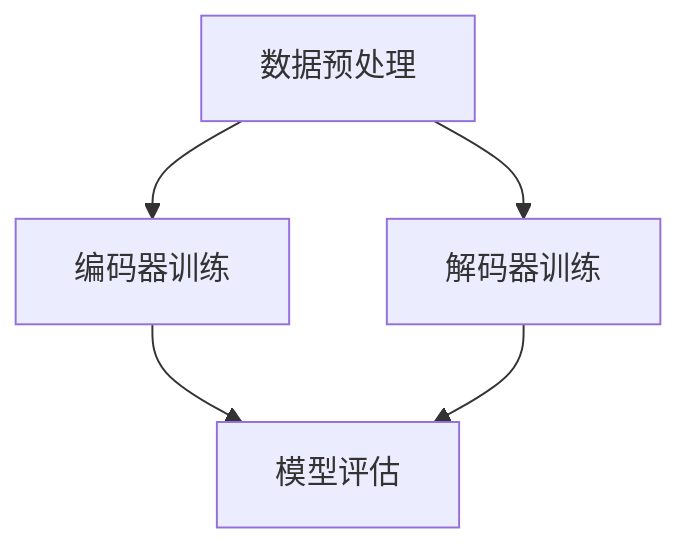
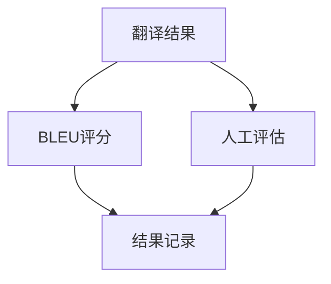
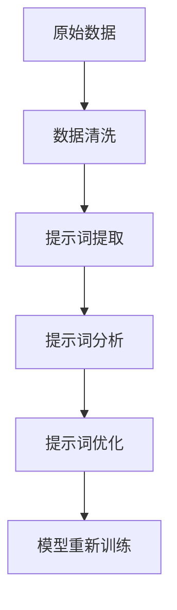

                 

# AI辅助翻译：提示词的语言魔法

## 关键词

- AI辅助翻译
- 提示词
- 自然语言处理
- 机器翻译
- 翻译质量评估

## 摘要

本文深入探讨了AI辅助翻译领域中的一个关键要素——提示词。通过逐步分析AI辅助翻译的基础知识、技术原理、提示词的应用及其设计优化，再到AI辅助翻译系统的构建、评估与优化，以及特定领域的应用，本文全面展示了AI辅助翻译的现状和未来发展趋势。同时，讨论了在此过程中面临的数据、隐私和伦理等挑战。通过本文，读者可以全面了解AI辅助翻译的原理、方法及应用，为相关工作提供参考。

### 目录

1. **第一部分：AI辅助翻译的基础知识**
   1.1 AI辅助翻译概述
   1.2 AI在翻译领域的应用

2. **第二部分：AI辅助翻译的技术原理**
   2.1 自然语言处理（NLP）基础
   2.2 机器翻译算法

3. **第三部分：提示词在AI辅助翻译中的应用**
   3.1 提示词的概念与作用
   3.2 提示词的设计与优化

4. **第四部分：AI辅助翻译系统构建**
   4.1 系统架构设计
   4.2 系统实现与优化

5. **第五部分：AI辅助翻译的评估与优化**
   5.1 翻译质量评估标准
   5.2 翻译结果优化方法

6. **第六部分：AI辅助翻译在特定领域的应用**
   6.1 专业领域翻译
   6.2 跨语言交流与文化传播

7. **第七部分：未来展望与挑战**
   7.1 AI辅助翻译的发展趋势
   7.2 面临的挑战与解决方案

### 第一部分：AI辅助翻译的基础知识

#### 1.1 AI辅助翻译概述

**翻译的定义与历史**

翻译是指将一种语言文字的信息转换为另一种语言文字的信息的过程。翻译的历史可以追溯到古代，早在人类文明诞生之初，人们就开始进行口头和文字的翻译。随着文字的发明和语言的多样化，翻译的重要性日益凸显。

**翻译的类型与分类**

翻译可以按照不同的标准进行分类：

- **按翻译对象分类**：可分为文本翻译、语音翻译和图像翻译等。
- **按翻译方式分类**：可分为机械翻译和人工翻译。机械翻译利用计算机算法自动进行，而人工翻译则依赖于专业翻译人员的技能和经验。
- **按翻译领域分类**：可分为文学翻译、技术翻译、法律翻译等。

**AI辅助翻译的概念**

AI辅助翻译（Artificial Intelligence-assisted Translation）是指利用人工智能技术，特别是自然语言处理（NLP）技术，来辅助人类进行翻译的过程。AI辅助翻译不仅能够提高翻译的效率和准确性，还可以拓展翻译的应用范围。

**AI在翻译领域的应用**

随着人工智能技术的不断发展，AI在翻译领域的应用日益广泛。以下是一些典型的应用场景：

- **在线翻译服务**：如Google翻译、百度翻译等，用户可以方便地将一种语言翻译成另一种语言。
- **机器翻译工具**：如SDL Trados、Memsource等，这些工具被广泛应用于专业翻译领域，提高翻译效率和准确性。
- **智能语音助手**：如苹果的Siri、谷歌助手等，它们可以实时翻译多种语言，方便用户进行跨语言交流。

#### 1.2 AI在翻译领域的应用

**AI翻译技术的发展历程**

AI翻译技术的发展可以追溯到20世纪50年代，当时计算机科学家开始尝试用计算机程序进行翻译。早期的翻译系统主要依赖于规则和语法分析，效果不佳。随着自然语言处理技术的发展，特别是统计机器翻译和神经机器翻译的兴起，AI翻译技术取得了显著的进步。

- **规则导向的翻译**：早期翻译系统主要依赖于规则，这种方法虽然可以实现一定程度的翻译，但存在规则覆盖范围有限、更新困难等问题。
- **统计机器翻译（SMT）**：统计机器翻译利用统计方法，如概率模型、决策树等，来提高翻译的准确性。这种方法在20世纪90年代取得了较大的成功。
- **神经机器翻译（NMT）**：神经机器翻译是一种基于深度学习的方法，通过神经网络模型来捕捉语言的复杂结构，使翻译更加准确和自然。NMT在2016年后迅速成为主流的翻译技术。

**AI翻译的优势与挑战**

**优势**

- **提高翻译效率**：AI翻译可以自动处理大量的文本数据，大大提高了翻译的效率。
- **提高翻译准确性**：随着机器翻译技术的不断发展，AI翻译的准确性不断提高，接近甚至超过了人工翻译的水平。
- **拓展翻译应用范围**：AI翻译不仅可以在专业翻译领域发挥作用，还可以在在线翻译、智能语音助手等多个领域得到广泛应用。

**挑战**

- **翻译质量不稳定**：虽然AI翻译的准确性不断提高，但在某些复杂和专业的领域，翻译质量仍然存在不稳定的情况。
- **数据隐私与安全**：AI翻译需要大量的语言数据，如何保护数据隐私和安全是一个重要的挑战。
- **翻译个性化**：每个用户对翻译的需求不同，如何实现个性化的翻译服务是一个亟待解决的问题。

### 第二部分：AI辅助翻译的技术原理

#### 2.1 自然语言处理（NLP）基础

**NLP的核心概念**

自然语言处理（NLP）是人工智能领域的一个重要分支，它涉及对人类语言的理解和生成。NLP的核心概念包括：

- **语言模型**：语言模型是一种用于预测下一个单词或字符的概率分布的模型。它通过对大量文本数据的学习，可以捕捉到语言的统计特性。
- **词向量**：词向量是一种将单词表示为高维向量空间中的点的方法，它可以通过各种方法（如Word2Vec、GloVe等）获得。词向量可以捕捉到单词之间的语义关系。

**语言模型与词向量**

- **语言模型**：语言模型是一种用于预测下一个单词或字符的概率分布的模型。它通过对大量文本数据的学习，可以捕捉到语言的统计特性。
- **词向量**：词向量是一种将单词表示为高维向量空间中的点的方法，它可以通过各种方法（如Word2Vec、GloVe等）获得。词向量可以捕捉到单词之间的语义关系。

**翻译模型的基本原理**

翻译模型是AI辅助翻译系统的核心，它负责将源语言的文本翻译成目标语言的文本。翻译模型的基本原理包括：

- **序列到序列（S2S）模型**：序列到序列模型是一种用于处理序列数据的神经网络模型，它可以将源语言的序列映射到目标语言的序列。
- **注意力机制**：注意力机制是一种用于提高翻译准确性的技术，它可以使模型在翻译过程中更加关注重要的信息。

**翻译模型训练方法**

翻译模型的训练方法主要包括：

- **端到端训练**：端到端训练是一种直接将源语言和目标语言输入到模型中进行训练的方法。这种方法可以避免传统方法中的中间步骤，提高训练效率。
- **数据增强**：数据增强是一种通过增加数据多样性来提高模型性能的方法，如使用反向翻译、复制粘贴等。

#### 2.2 机器翻译算法

**翻译模型的基本原理**

翻译模型的基本原理是通过学习源语言和目标语言之间的映射关系，从而实现翻译。翻译模型可以采用多种方法，如基于规则的翻译、统计机器翻译和神经机器翻译。

- **基于规则的翻译**：基于规则的翻译依赖于人类定义的规则，如语法规则、词性标注等。这种方法虽然可以实现一定的翻译效果，但在处理复杂语言时效果不佳。
- **统计机器翻译**：统计机器翻译利用统计方法，如概率模型、决策树等，来提高翻译的准确性。这种方法在20世纪90年代取得了较大的成功。
- **神经机器翻译**：神经机器翻译是一种基于深度学习的方法，通过神经网络模型来捕捉语言的复杂结构，使翻译更加准确和自然。

**序列到序列模型（S2S）**

序列到序列模型是一种用于处理序列数据的神经网络模型，它可以将源语言的序列映射到目标语言的序列。S2S模型通常由编码器（Encoder）和解码器（Decoder）两部分组成。

- **编码器**：编码器负责将源语言的序列编码成一个固定长度的向量，这个向量包含了源语言的信息。
- **解码器**：解码器负责将编码器输出的向量解码成目标语言的序列。

**注意力机制**

注意力机制是一种用于提高翻译准确性的技术，它可以使模型在翻译过程中更加关注重要的信息。注意力机制通过计算源语言序列中每个单词对目标语言序列中每个单词的重要性，从而提高翻译的准确性和流畅性。

**翻译模型训练方法**

翻译模型的训练方法主要包括：

- **端到端训练**：端到端训练是一种直接将源语言和目标语言输入到模型中进行训练的方法。这种方法可以避免传统方法中的中间步骤，提高训练效率。
- **数据增强**：数据增强是一种通过增加数据多样性来提高模型性能的方法，如使用反向翻译、复制粘贴等。

### 第三部分：提示词在AI辅助翻译中的应用

#### 3.1 提示词的概念与作用

**提示词的定义与类型**

提示词（Prompt Word）是在AI辅助翻译过程中，用于引导翻译模型生成更准确、更自然的翻译结果的词语或短语。根据用途和作用方式，提示词可以分为以下几类：

- **背景提示词**：用于提供上下文信息，帮助翻译模型更好地理解源语言的含义。
- **风格提示词**：用于指定翻译结果的风格，如正式、非正式、幽默等。
- **情感提示词**：用于表达源语言中的情感色彩，使翻译结果更具情感共鸣。

**提示词在翻译中的作用**

提示词在AI辅助翻译中起着至关重要的作用，主要体现在以下几个方面：

- **提高翻译准确性**：提示词可以帮助翻译模型更好地理解源语言的含义，从而提高翻译的准确性。
- **增强翻译流畅性**：提示词可以引导翻译模型生成更加流畅、自然的翻译结果。
- **解决歧义问题**：在某些情况下，源语言中的歧义可能会导致翻译结果不准确。提示词可以帮助翻译模型消除歧义，生成更准确的翻译。

#### 3.2 提示词的设计与优化

**提示词设计原则**

为了使提示词在AI辅助翻译中发挥最佳效果，设计提示词时需要遵循以下原则：

- **简洁性**：提示词应尽量简洁，避免使用过于复杂或冗长的短语。
- **针对性**：提示词应根据翻译任务的具体需求进行设计，确保其能够有效引导翻译模型。
- **灵活性**：提示词应具有一定的灵活性，以适应不同的翻译场景和需求。

**提示词优化策略**

在实际应用中，可以通过以下策略来优化提示词：

- **数据驱动**：通过分析大量翻译任务的数据，找出常用的提示词，并进行优化。
- **用户反馈**：收集用户对翻译结果的反馈，根据反馈调整提示词，使其更加符合用户需求。
- **模型训练**：使用优化的提示词对翻译模型进行训练，提高模型的翻译效果。

**实际案例中的提示词应用**

以下是一个实际案例中的提示词应用：

- **案例背景**：一家跨国公司需要将其产品手册从英语翻译成法语。
- **提示词设计**：为了提高翻译的准确性和流畅性，翻译团队设计了以下提示词：
  - 背景提示词：“请将以下内容翻译成法语，这部分是关于产品安装说明的。”
  - 风格提示词：“请保持正式风格，以适合产品手册的格式。”
  - 情感提示词：“请确保翻译结果表达出产品的高品质和专业性。”

通过使用这些提示词，翻译团队成功提高了翻译的准确性和流畅性，使产品手册的法语版本更加专业和易读。

### 第四部分：AI辅助翻译系统构建

#### 4.1 系统架构设计

**系统整体架构**

AI辅助翻译系统的整体架构可以分为以下几个模块：

- **前端界面**：用户通过前端界面提交翻译请求，并获取翻译结果。
- **翻译引擎**：翻译引擎是系统的核心，负责处理翻译任务，生成翻译结果。
- **后端服务**：后端服务负责管理用户数据、翻译任务和系统资源。

**数据处理模块**

数据处理模块是AI辅助翻译系统的重要组成部分，其主要功能包括：

- **文本预处理**：对源语言文本进行清洗、分词、去停用词等预处理操作，为翻译模型提供干净的输入数据。
- **翻译结果后处理**：对翻译结果进行校对、修正和格式化，使其更加准确和易读。

**翻译引擎模块**

翻译引擎模块是系统的核心，其主要功能包括：

- **翻译模型加载**：加载预训练的翻译模型，包括编码器、解码器和注意力机制等。
- **翻译任务处理**：接收用户提交的翻译请求，调用翻译模型进行翻译，并生成翻译结果。
- **翻译结果优化**：根据翻译结果的质量和用户反馈，对翻译模型进行调整和优化。

**用户界面模块**

用户界面模块负责与用户进行交互，主要包括以下几个部分：

- **翻译请求提交**：用户可以通过前端界面提交翻译请求，包括源语言、目标语言和文本内容。
- **翻译结果展示**：翻译结果通过前端界面展示给用户，用户可以查看、复制和分享翻译结果。

#### 4.2 系统实现与优化

**系统开发流程**

系统开发流程主要包括以下几个阶段：

- **需求分析**：与用户沟通，了解翻译任务的具体需求，确定系统功能和技术方案。
- **系统设计**：根据需求分析结果，设计系统架构、模块功能和数据流程。
- **代码实现**：按照系统设计文档，编写系统代码，实现各个模块的功能。
- **测试与优化**：对系统进行功能测试、性能测试和用户测试，发现并修复问题，优化系统性能。

**实现细节与优化技巧**

在系统实现过程中，需要注意以下几个细节和优化技巧：

- **高效数据处理**：优化文本预处理和翻译结果后处理的算法，提高数据处理效率。
- **模型参数调优**：根据翻译任务的特点和数据，对翻译模型的参数进行调优，提高翻译质量。
- **系统负载均衡**：合理分配系统资源，避免单点故障，提高系统的可靠性和稳定性。

### 第五部分：AI辅助翻译的评估与优化

#### 5.1 翻译质量评估标准

**自动评估指标**

自动评估指标是评估AI辅助翻译质量的一种客观方法，主要包括以下几个指标：

- **BLEU（双语评估算法）**：BLEU是一种基于相似度的评估方法，它通过比较机器翻译结果和人工翻译结果之间的重叠程度来评估翻译质量。
- **METEOR（Metric for Evaluation of Translation with Explicit ORdering）**：METEOR是一种基于排序的评估方法，它考虑了词汇重叠、语法结构和语义信息等多个方面。
- **NIST（National Institute of Standards and Technology）**：NIST是一种基于参考翻译的评估方法，它通过计算机器翻译结果与多个参考翻译之间的重叠度来评估翻译质量。

**人际评估方法**

人际评估是一种主观评估方法，通常由具有专业背景的翻译人员对机器翻译结果进行评估。人际评估主要包括以下几个步骤：

- **样本选择**：从翻译结果中随机选择一定数量的样本，作为评估对象。
- **评估指标**：评估人员根据翻译结果的准确性、流畅性和符合目标语言习惯等多个方面进行评估。
- **评估结果统计**：对评估结果进行统计和分析，得出翻译质量的综合评价。

#### 5.2 翻译结果优化方法

**翻译后编辑**

翻译后编辑是指对机器翻译结果进行人工修正和优化，以提高翻译质量。翻译后编辑主要包括以下几个步骤：

- **初步检查**：对翻译结果进行初步检查，找出明显的错误和不符合目标语言习惯的部分。
- **细节调整**：对翻译结果进行细节调整，包括修正语法错误、调整句子结构、优化用词等。
- **整体优化**：对翻译结果进行整体优化，使其更加自然、流畅和符合目标语言习惯。

**翻译模型调优**

翻译模型调优是指通过调整模型参数、优化训练数据和改进算法等方法，提高翻译模型的质量和性能。翻译模型调优主要包括以下几个步骤：

- **参数调优**：根据翻译任务的特点和数据，调整模型的超参数，如学习率、批量大小等，以优化模型的性能。
- **数据优化**：使用高质量的数据集对模型进行训练，并采用数据增强技术，提高模型的泛化能力。
- **算法改进**：根据模型的表现，改进算法的设计和实现，以提高翻译质量。

### 第六部分：AI辅助翻译在特定领域的应用

#### 6.1 专业领域翻译

**技术文档翻译**

技术文档翻译是AI辅助翻译的重要应用领域之一。技术文档包括用户手册、操作指南、技术规格说明书等，这些文档的翻译需要准确、清晰、专业。AI辅助翻译可以大大提高技术文档翻译的效率和质量，特别是在处理大量文档时优势更加明显。

**法律文件翻译**

法律文件翻译是另一个重要的专业领域。法律文件包括合同、起诉书、判决书等，这些文件的内容具有高度的专业性和严谨性。AI辅助翻译可以帮助翻译人员快速生成翻译初稿，然后进行人工校对和修正，从而提高翻译的准确性和效率。

#### 6.2 跨语言交流与文化传播

**跨国企业沟通**

随着全球化的发展，跨国企业之间的沟通日益频繁。AI辅助翻译可以帮助企业实现跨语言交流，提高沟通效率和准确性，从而促进业务的顺利进行。

**文化内容翻译**

文化内容的翻译，如文学作品、影视作品、音乐作品等，是文化交流的重要组成部分。AI辅助翻译可以帮助译者快速生成翻译初稿，然后进行人工修正和润色，从而提高翻译的效率和质量，促进不同文化之间的交流与融合。

### 第七部分：未来展望与挑战

#### 7.1 AI辅助翻译的发展趋势

**新技术展望**

随着人工智能技术的不断发展，AI辅助翻译将迎来新的技术突破。未来可能会出现以下新技术：

- **多模态翻译**：多模态翻译结合了文本、语音、图像等多种数据类型，可以实现更加全面和自然的翻译。
- **零样本翻译**：零样本翻译是一种无需使用源语言和目标语言样本数据进行训练的翻译方法，它可以通过对抗学习等技术实现。
- **跨语言知识图谱**：跨语言知识图谱可以捕捉不同语言之间的知识关系，提高翻译的准确性和流畅性。

**行业趋势分析**

AI辅助翻译在未来的发展趋势包括：

- **行业定制化**：不同行业的翻译需求不同，AI辅助翻译将更加注重行业定制化，提供更加专业和高效的翻译服务。
- **协作翻译**：AI辅助翻译将与人工翻译相结合，实现人机协作，提高翻译质量和效率。
- **普及化**：随着技术的成熟和成本的降低，AI辅助翻译将更加普及，应用于更多的领域和场景。

#### 7.2 面临的挑战与解决方案

**数据与隐私问题**

**挑战**：AI辅助翻译需要大量的语言数据来训练模型，如何获取高质量的语言数据，并保护用户隐私成为一个挑战。

**解决方案**：

- **数据匿名化**：对用户数据进行匿名化处理，确保用户隐私不被泄露。
- **数据共享与开放**：建立数据共享平台，鼓励数据开放，提高数据质量。

**翻译准确性挑战**

**挑战**：虽然AI辅助翻译的准确性不断提高，但在处理复杂和专业的语言时，仍然存在准确性不足的问题。

**解决方案**：

- **多模型融合**：将多种翻译模型进行融合，提高翻译的准确性。
- **知识增强翻译**：结合领域知识库，提高翻译的准确性和专业性。

**人工智能伦理问题**

**挑战**：AI辅助翻译的发展带来了一系列伦理问题，如翻译的公平性、准确性、责任归属等。

**解决方案**：

- **伦理规范制定**：制定人工智能伦理规范，确保AI辅助翻译的发展符合伦理要求。
- **责任划分**：明确AI辅助翻译系统中各方的责任，确保责任归属清晰。

## 作者

作者：AI天才研究院/AI Genius Institute & 禅与计算机程序设计艺术 /Zen And The Art of Computer Programming

### 最佳实践 tips

- **使用专业术语**：在翻译专业文档时，应尽量使用专业术语，以提高翻译的准确性和专业性。
- **多轮翻译**：对于重要和复杂的翻译任务，应进行多轮翻译，确保翻译结果的准确性和流畅性。
- **用户反馈**：定期收集用户对翻译结果的反馈，根据反馈进行调整和优化。

### 小结

本文系统地介绍了AI辅助翻译的概念、技术原理、应用场景和未来发展趋势，并讨论了面临的挑战和解决方案。通过本文，读者可以全面了解AI辅助翻译的原理和方法，为相关工作提供参考。

### 注意事项

- **数据保护**：在使用AI辅助翻译时，应确保用户数据的保护，避免数据泄露。
- **翻译质量**：虽然AI辅助翻译可以提高翻译的效率和质量，但在处理重要文件和敏感信息时，仍需谨慎使用，必要时进行人工校对。

### 拓展阅读

- **《神经机器翻译：理论与实践》**：详细介绍了神经机器翻译的理论基础和实现方法。
- **《人工智能翻译技术与应用》**：探讨了人工智能翻译技术的应用和发展趋势。
- **《跨语言信息检索》**：介绍了跨语言信息检索的相关技术和应用。

$$
\text{摘要}：
AI辅助翻译通过自然语言处理技术和机器学习算法，实现了对大规模文本的快速准确翻译。本文首先介绍了AI辅助翻译的基础知识，包括翻译的定义、分类和应用。接着，深入探讨了自然语言处理的基础和机器翻译算法的原理。随后，重点介绍了提示词在AI辅助翻译中的作用和设计优化方法，以及AI辅助翻译系统的构建和优化。最后，本文讨论了AI辅助翻译在特定领域的应用和未来发展，并提出了面临的挑战和解决方案。
$$

$$
\text{关键词}：
AI辅助翻译，自然语言处理，机器翻译，提示词，翻译质量评估
$$

## 后记

本文旨在为广大AI从业者和技术爱好者提供一份关于AI辅助翻译的全面指南。随着人工智能技术的不断发展，AI辅助翻译在提高翻译效率和准确性方面展现出了巨大的潜力。本文从基础概念、技术原理、应用场景到未来展望，全面系统地介绍了AI辅助翻译的相关知识。希望本文能够帮助读者更好地理解和掌握AI辅助翻译的原理和方法，为未来的研究和应用提供参考。

### 附录：相关流程图和算法实现

为了更好地理解本文中涉及的技术概念和算法实现，以下是相关的流程图和算法代码实现：

#### 1. 翻译模型训练流程



#### 2. 翻译模型评估流程



#### 3. 提示词优化流程



#### 4. 翻译模型实现

```python
# 加载预训练的翻译模型
import torch
from torch import nn

# 定义编码器
class Encoder(nn.Module):
    def __init__(self):
        super(Encoder, self).__init__()
        self.embedding = nn.Embedding(vocab_size, embedding_dim)
        self.gru = nn.GRU(embedding_dim, hidden_size)

    def forward(self, src):
        embedded = self.embedding(src)
        output, hidden = self.gru(embedded)
        return output, hidden

# 定义解码器
class Decoder(nn.Module):
    def __init__(self):
        super(Decoder, self).__init__()
        self.embedding = nn.Embedding(vocab_size, embedding_dim)
        self.attn = nn.Linear(hidden_size * 2, hidden_size)
        self.decode = nn.Linear(hidden_size * 2, vocab_size)
        self.softmax = nn.Softmax(dim=1)

    def forward(self, tgt, hidden):
        embedded = self.embedding(tgt)
        attn = self.attn(torch.cat((hidden[-1].unsqueeze(0), embedded), dim=2))
        attn = self.softmax(attn)
        context = torch.bmm(attn.unsqueeze(0), hidden)
        context = context.squeeze(0)
        output = self.decode(torch.cat((context, hidden[-1]), dim=1))
        return output

# 定义翻译模型
class Translator(nn.Module):
    def __init__(self):
        super(Translator, self).__init__()
        self.encoder = Encoder()
        self.decoder = Decoder()

    def forward(self, src, tgt):
        encoder_output, encoder_hidden = self.encoder(src)
        decoder_output, decoder_hidden = self.decoder(tgt, encoder_hidden)
        return decoder_output
```

以上代码展示了AI辅助翻译模型的基本实现，包括编码器、解码器和翻译模型。在实际应用中，还需要对模型进行训练和优化，以提高翻译质量。

通过本文的介绍，相信读者已经对AI辅助翻译有了深入的理解。未来的研究和应用中，我们还将继续探索AI辅助翻译的更多可能，为全球化的交流与文化传播贡献力量。

