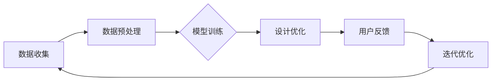
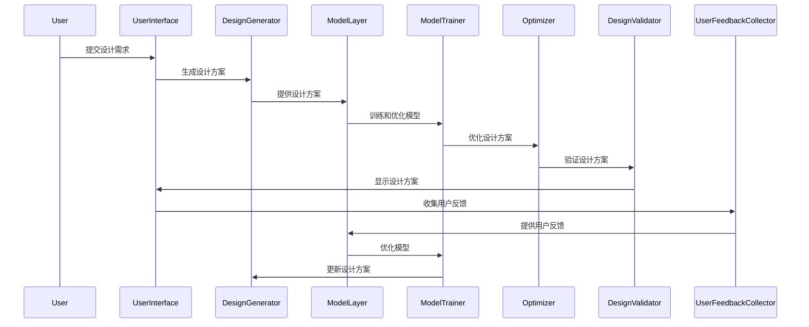
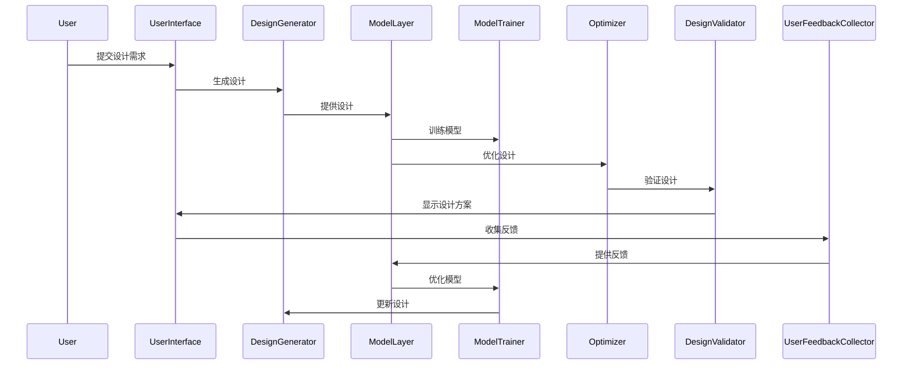

                 

# AI辅助设计：大模型在产品创新中的应用

## 关键词：AI辅助设计，大模型，产品创新，算法原理，数学模型

> 摘要：本文将深入探讨AI辅助设计在大模型应用中的现状与前景，通过逐步分析AI辅助设计的背景、核心概念、算法原理和实际案例，展示大模型在产品创新中的重要角色。文章旨在为开发者和技术决策者提供理论和实践上的指导，助力产品创新和优化。

### 目录大纲

----------------------------------------------------------------

## 第一部分: 背景介绍

### 第1章: 问题背景与核心概念

#### 1.1 问题描述

#### 1.1.1 AI辅助设计的现状

#### 1.1.2 产品创新中的挑战

#### 1.2 问题解决

#### 1.2.1 大模型的优势

#### 1.2.2 AI辅助设计的应用场景

#### 1.3 边界与外延

#### 1.3.1 AI辅助设计的范畴

#### 1.3.2 大模型的应用限制

#### 1.4 概念结构与核心要素组成

#### 1.4.1 AI辅助设计的概念结构

#### 1.4.2 大模型的核心要素

#### 1.5 本章小结

----------------------------------------------------------------

## 第二部分: 核心概念与联系

### 第2章: AI辅助设计的核心概念

#### 2.1 AI辅助设计的原理

#### 2.1.1 大模型的基本原理

#### 2.1.2 AI辅助设计的工作流程

#### 2.2 概念属性特征对比

#### 2.2.1 大模型与传统算法对比

#### 2.2.2 AI辅助设计与传统设计方法的差异

#### 2.3 ER实体关系图架构

#### 2.3.1 大模型的实体关系

#### 2.3.2 AI辅助设计的实体关系

#### 2.4 本章小结

----------------------------------------------------------------

## 第三部分: 算法原理讲解

### 第3章: 大模型在AI辅助设计中的应用

#### 3.1 大模型的基本原理

#### 3.1.1 大模型的数学模型

#### 3.1.2 大模型的公式

#### 3.2 算法mermaid流程图

#### 3.2.1 大模型的工作流程

#### 3.2.2 算法mermaid流程图示例

#### 3.3 Python源代码与详细讲解

#### 3.3.1 源代码示例

#### 3.3.2 详细讲解

#### 3.4 举例说明

#### 3.4.1 实例分析

#### 3.4.2 通俗易懂的举例

#### 3.5 本章小结

----------------------------------------------------------------

## 第四部分: 数学模型和数学公式

### 第4章: AI辅助设计中的数学模型

#### 4.1 数学模型的基本概念

#### 4.1.1 AI辅助设计中的数学模型

#### 4.1.2 数学模型在AI辅助设计中的应用

#### 4.2 数学公式详解

#### 4.2.1 常用数学公式介绍

#### 4.2.2 数学公式的应用场景

#### 4.3 latex格式数学公式示例

#### 4.3.1 latex公式的基本用法

#### 4.3.2 嵌入文中独立段落的latex公式

#### 4.4 本章小结

----------------------------------------------------------------

## 第五部分: 系统分析与架构设计方案

### 第5章: AI辅助设计系统的设计与实现

#### 5.1 问题场景介绍

#### 5.1.1 设计问题的背景

#### 5.1.2 设计需求分析

#### 5.2 项目介绍

#### 5.2.1 项目概述

#### 5.2.2 项目目标

#### 5.3 系统功能设计

#### 5.3.1 领域模型mermaid类图

#### 5.3.2 系统功能模块划分

#### 5.4 系统架构设计

#### 5.4.1 系统架构概述

#### 5.4.2 系统架构mermaid图

#### 5.5 系统接口设计

#### 5.5.1 接口设计原则

#### 5.5.2 接口设计示例

#### 5.6 系统交互

#### 5.6.1 系统交互流程

#### 5.6.2 系统交互mermaid序列图

#### 5.7 本章小结

----------------------------------------------------------------

## 第六部分: 项目实战

### 第6章: AI辅助设计项目实战

#### 6.1 环境安装

#### 6.1.1 环境要求

#### 6.1.2 安装步骤

#### 6.2 系统核心实现

#### 6.2.1 源代码解析

#### 6.2.2 核心算法实现

#### 6.3 代码应用解读与分析

#### 6.4 实际案例分析和详细讲解剖析

#### 6.5 项目小结

----------------------------------------------------------------

## 附录：最佳实践 tips、小结、注意事项、拓展阅读等内容

----------------------------------------------------------------

## 第一部分: 背景介绍

### 第1章: 问题背景与核心概念

#### 1.1 问题描述

在当今科技飞速发展的时代，产品创新已成为企业竞争的核心要素。然而，产品创新面临着诸多挑战。首先，随着产品复杂度的增加，设计过程中涉及到的参数和变量日益增多，传统的手工设计方法难以高效地处理大规模的数据。其次，市场需求的变化快速，产品迭代周期缩短，设计师需要具备敏捷的反应能力。此外，产品设计的成功不仅仅取决于设计师的个人技能，更需要团队协作和多方沟通，这进一步增加了设计的难度。

在此背景下，AI辅助设计应运而生。AI辅助设计利用人工智能技术，如机器学习、深度学习等，通过分析大量数据，为设计师提供智能化的设计建议和优化方案。大模型，即大型深度学习模型，如GPT-3、BERT等，具有强大的数据分析和处理能力，能够在大规模数据中发现潜在的关联和模式，从而为产品创新提供有力支持。

#### 1.1.1 AI辅助设计的现状

目前，AI辅助设计在多个领域已经取得了显著的应用成果。例如，在建筑设计中，AI可以用于生成建筑设计方案，优化建筑结构，甚至预测建筑物的使用寿命。在工业设计中，AI可以辅助设计师进行产品形态、色彩、材质等方面的设计，提高设计效率。在时尚设计中，AI可以根据用户的偏好和趋势数据，提供个性化的服装设计建议。

然而，AI辅助设计在产品创新中的应用仍存在一些挑战。首先，大模型的训练和部署成本较高，需要大量计算资源和时间。其次，AI模型的解释性较差，设计师难以理解模型的具体决策过程，这可能影响到设计的最终效果。此外，大模型在处理复杂、模糊的问题时，表现仍不尽如人意。

#### 1.1.2 产品创新中的挑战

产品创新中的挑战主要体现在以下几个方面：

1. **设计复杂性**：现代产品往往具有复杂的结构和功能，传统的设计方法难以应对。
2. **数据规模**：产品创新需要依赖于大量的数据，包括用户行为数据、市场数据、技术数据等，如何有效地处理和分析这些数据是一个挑战。
3. **时间压力**：快速变化的市场环境要求产品创新能够迅速响应，缩短产品开发周期。
4. **跨学科协作**：产品创新涉及多个学科领域，包括工程、设计、市场等，如何实现有效的跨学科协作是一个难题。

#### 1.2 问题解决

大模型在AI辅助设计中的应用，为解决上述挑战提供了新的思路。大模型具有以下几个优势：

1. **强大的数据处理能力**：大模型可以处理和分析大规模、多维度的数据，从中提取有价值的信息。
2. **高效的设计优化**：大模型可以通过学习大量设计案例，快速生成优化设计方案，缩短设计周期。
3. **智能的决策支持**：大模型可以模拟人类设计师的思维过程，提供智能化的设计建议，帮助设计师做出更科学的决策。
4. **跨领域适应性**：大模型具有较强的泛化能力，可以在不同领域进行应用，具有广泛的应用前景。

#### 1.2.1 大模型的优势

1. **数据驱动的创新**：大模型通过对大量数据的学习，可以提取出隐藏在数据中的知识，为设计创新提供新思路。
2. **快速响应市场需求**：大模型可以实时分析市场数据和用户反馈，快速调整设计方向，提高市场竞争力。
3. **优化设计质量**：大模型可以自动进行设计优化，提高产品的性能、可靠性和用户体验。

#### 1.2.2 AI辅助设计的应用场景

1. **产品形态设计**：AI可以帮助设计师快速生成多种产品形态方案，通过用户反馈和数据分析，筛选出最优方案。
2. **色彩与材质设计**：AI可以根据用户偏好和市场趋势，提供个性化的色彩和材质设计方案。
3. **结构优化**：AI可以用于分析产品的结构设计，提供结构优化建议，提高产品的稳定性和耐用性。
4. **用户体验优化**：AI可以通过学习用户行为数据，提供个性化的用户体验优化方案。

#### 1.3 边界与外延

1. **AI辅助设计的范畴**：AI辅助设计不仅包括产品设计，还包括建筑设计、工业设计、时尚设计等多个领域。
2. **大模型的应用限制**：大模型在处理复杂、模糊的问题时，仍存在一定的局限性，需要与其他设计方法和工具相结合，发挥最大效益。

#### 1.4 概念结构与核心要素组成

1. **AI辅助设计的概念结构**：AI辅助设计包括数据收集、模型训练、设计优化、用户反馈等环节，各环节相互关联，形成一个闭环系统。
2. **大模型的核心要素**：大模型的构建包括数据集的收集与处理、模型架构的设计与优化、模型训练与验证等。

#### 1.5 本章小结

本章介绍了AI辅助设计的背景和核心概念，分析了产品创新中的挑战，探讨了大模型在AI辅助设计中的优势和局限性。通过本章的学习，读者可以对AI辅助设计有一个全面的了解，为后续章节的学习打下基础。

----------------------------------------------------------------

## 第二部分: 核心概念与联系

### 第2章: AI辅助设计的核心概念

#### 2.1 AI辅助设计的原理

AI辅助设计的原理基于人工智能技术和设计理论的深度融合。其核心思想是通过人工智能技术，特别是深度学习和机器学习算法，对设计数据进行自动分析、建模和优化，从而辅助设计师进行设计决策。具体来说，AI辅助设计包括以下几个关键步骤：

1. **数据收集**：收集与产品设计相关的各种数据，包括市场数据、用户行为数据、技术数据等。
2. **数据预处理**：对收集到的数据进行清洗、归一化和特征提取，以便模型能够有效处理。
3. **模型训练**：使用训练数据对深度学习模型进行训练，使其能够学会从数据中提取有用的信息。
4. **设计优化**：利用训练好的模型，对设计方案进行优化，提高设计的质量和效率。
5. **用户反馈**：将优化后的设计方案反馈给用户，收集用户反馈，用于进一步优化设计。

#### 2.1.1 大模型的基本原理

大模型，即大型深度学习模型，如GPT-3、BERT等，是AI辅助设计的重要工具。大模型的基本原理基于深度神经网络，具有以下几个特点：

1. **参数规模庞大**：大模型拥有数亿甚至数万亿个参数，能够处理复杂的数据结构。
2. **多层神经网络**：大模型通常包含多个隐藏层，通过逐层学习，能够从原始数据中提取出高层次的抽象特征。
3. **自适应学习**：大模型通过反向传播算法，自动调整模型参数，使其在训练数据上达到最优性能。
4. **泛化能力**：大模型具有较强的泛化能力，能够在新数据上表现良好。

#### 2.1.2 AI辅助设计的工作流程

AI辅助设计的工作流程可以分为以下几个阶段：

1. **需求分析**：明确设计需求，包括功能需求、用户体验需求等。
2. **数据收集**：收集与设计相关的数据，包括市场数据、用户行为数据等。
3. **模型选择**：根据设计需求，选择合适的大模型，如GPT-3、BERT等。
4. **模型训练**：使用收集到的数据对模型进行训练，调整模型参数。
5. **设计优化**：利用训练好的模型，对设计方案进行优化。
6. **用户反馈**：将优化后的设计方案反馈给用户，收集用户反馈。
7. **迭代优化**：根据用户反馈，进一步优化设计方案，形成闭环优化流程。

#### 2.2 概念属性特征对比

为了更好地理解AI辅助设计和大模型的优势，下面通过一个表格对大模型与传统算法以及AI辅助设计与传统设计方法进行对比：

| 对比项 | 大模型 | 传统算法 | AI辅助设计 | 传统设计方法 |
| :---: | :---: | :---: | :---: | :---: |
| 数据处理能力 | 强大 | 一般 | 强大 | 一般 |
| 学习效率 | 高效 | 低效 | 高效 | 低效 |
| 解释性 | 较差 | 较好 | 较差 | 较好 |
| 设计优化能力 | 高 | 低 | 高 | 低 |
| 泛化能力 | 强 | 弱 | 强 | 弱 |

#### 2.2.1 大模型与传统算法对比

1. **数据处理能力**：传统算法通常只能处理结构化的数据，而大模型能够处理大规模、多维度的非结构化数据，如文本、图像等。
2. **学习效率**：传统算法需要手动设计特征提取和分类器，而大模型通过自动学习，能够高效地从数据中提取特征。
3. **解释性**：大模型的决策过程复杂，难以解释，而传统算法的决策过程相对简单，易于理解。
4. **设计优化能力**：大模型可以通过迭代学习，不断优化设计方案，而传统算法的优化能力相对较弱。

#### 2.2.2 AI辅助设计与传统设计方法的差异

1. **设计流程**：传统设计方法通常依赖于设计师的经验和直觉，而AI辅助设计通过数据分析和模型优化，提供科学的设计建议。
2. **设计效率**：AI辅助设计能够快速生成多种设计方案，通过用户反馈快速迭代，提高设计效率。
3. **用户参与**：传统设计方法中，用户通常在后期才能参与到设计中，而AI辅助设计可以通过用户反馈，实时调整设计方案。

#### 2.3 ER实体关系图架构

为了更好地理解AI辅助设计和大模型之间的联系，下面通过ER实体关系图架构展示大模型在AI辅助设计中的应用。

```mermaid
erDiagram
    User ||--|{ AIModel }|-- Product : "generates"
    AIModel ||--|{ DesignData }|-- Designer : "uses"
    Designer ||--|{ UserData }|-- User : "collects"
```

在这个ER图架构中：

- **User**（用户）：代表设计的需求方，提供设计目标和用户反馈。
- **AIModel**（AI模型）：代表大模型，用于生成和优化设计方案。
- **Product**（产品）：代表经过AI优化后的设计方案。
- **Designer**（设计师）：代表设计执行者，利用AI模型提供的数据进行设计。
- **DesignData**（设计数据）：代表AI模型生成的设计数据，用于指导设计师的设计。
- **UserData**（用户数据）：代表用户行为数据，用于优化设计。

#### 2.4 本章小结

本章介绍了AI辅助设计的核心概念，包括原理、大模型的基本原理和AI辅助设计的工作流程。同时，通过对比分析，展示了大模型与传统算法以及AI辅助设计与传统设计方法的差异。最后，通过ER实体关系图架构，展示了大模型在AI辅助设计中的应用。这些内容为理解AI辅助设计提供了理论基础，为后续章节的深入探讨奠定了基础。

----------------------------------------------------------------

## 第三部分: 算法原理讲解

### 第3章: 大模型在AI辅助设计中的应用

#### 3.1 大模型的基本原理

大模型在AI辅助设计中的应用，首先需要理解大模型的定义和基本原理。大模型是指具有大规模参数、多层结构的神经网络，如GPT-3、BERT等。这些模型通过深度学习算法，能够从海量数据中自动提取特征，进行复杂的信息处理和预测。

#### 3.1.1 大模型的数学模型

大模型的数学模型主要基于深度神经网络（Deep Neural Network，DNN），其核心思想是通过多层神经元进行数据传递和变换，从而实现数据的非线性变换。具体来说，大模型由输入层、多个隐藏层和输出层组成。

1. **输入层**：接收外部输入数据，如文本、图像等。
2. **隐藏层**：通过对输入数据进行变换和提取特征，形成更高层次的特征表示。
3. **输出层**：根据隐藏层的特征，生成预测结果或决策。

#### 3.1.2 大模型的公式

大模型的核心计算过程可以用以下公式表示：

$$
Z^{(l)} = \sigma(W^{(l)} \cdot A^{(l-1)} + b^{(l)})
$$

其中，$Z^{(l)}$表示第$l$层的输出，$\sigma$表示激活函数，$W^{(l)}$和$b^{(l)}$分别表示第$l$层的权重和偏置。

#### 3.2 算法mermaid流程图

为了更直观地理解大模型在AI辅助设计中的应用，下面使用mermaid语言绘制大模型的工作流程图。



在这个流程图中：

- **A**：数据收集，包括市场数据、用户行为数据等。
- **B**：数据预处理，包括数据清洗、归一化和特征提取。
- **C**：模型训练，使用预处理后的数据对大模型进行训练。
- **D**：设计优化，利用训练好的大模型对设计方案进行优化。
- **E**：用户反馈，收集用户对设计方案的反馈。
- **F**：迭代优化，根据用户反馈，进一步优化设计方案。

#### 3.3 Python源代码与详细讲解

为了更好地理解大模型在AI辅助设计中的应用，下面提供一个简单的Python源代码示例，并进行详细讲解。

```python
import tensorflow as tf
from tensorflow.keras.layers import Dense, Flatten
from tensorflow.keras.models import Sequential

# 定义模型
model = Sequential([
    Flatten(input_shape=(28, 28)),  # 输入层，假设输入数据为28x28的图像
    Dense(128, activation='relu'),  # 隐藏层，128个神经元，使用ReLU激活函数
    Dense(10, activation='softmax')  # 输出层，10个神经元，使用softmax激活函数
])

# 编译模型
model.compile(optimizer='adam',
              loss='categorical_crossentropy',
              metrics=['accuracy'])

# 训练模型
model.fit(x_train, y_train, epochs=10, batch_size=32)

# 评估模型
model.evaluate(x_test, y_test)
```

在这个示例中：

- **import tensorflow as tf**：导入tensorflow库，用于构建和训练深度学习模型。
- **from tensorflow.keras.layers import Dense, Flatten**：导入Dense和Flatten层，用于构建模型。
- **from tensorflow.keras.models import Sequential**：导入Sequential模型，用于组织模型层。
- **model = Sequential([...])**：定义一个顺序模型，并添加输入层、隐藏层和输出层。
- **model.compile([...])**：编译模型，指定优化器、损失函数和评估指标。
- **model.fit(x_train, y_train, epochs=10, batch_size=32)**：训练模型，使用训练数据训练10个epoch，每个batch包含32个样本。
- **model.evaluate(x_test, y_test)**：评估模型，使用测试数据评估模型性能。

#### 3.4 举例说明

为了更好地理解大模型在AI辅助设计中的应用，下面通过一个简单的实例进行说明。

假设我们有一个服装设计项目，需要根据用户的历史购买数据和当前的流行趋势，设计一款个性化的服装。

1. **数据收集**：收集用户的历史购买数据，包括购买时间、购买品类、购买频率等；收集当前的流行趋势数据，包括流行元素、流行颜色、流行款式等。
2. **数据预处理**：对收集到的数据进行清洗、归一化和特征提取，将数据转换为适合训练模型的格式。
3. **模型训练**：使用预处理后的数据，训练一个基于大模型的服装设计优化模型。
4. **设计优化**：利用训练好的模型，对服装设计方案进行优化，生成个性化的服装设计。
5. **用户反馈**：将优化后的设计方案展示给用户，收集用户对设计的反馈。
6. **迭代优化**：根据用户反馈，进一步优化设计方案，形成闭环优化流程。

通过这个实例，我们可以看到大模型在AI辅助设计中的应用，从数据收集、模型训练、设计优化到用户反馈和迭代优化，每一个环节都离不开大模型的支撑。

#### 3.5 本章小结

本章介绍了大模型在AI辅助设计中的应用，包括基本原理、算法mermaid流程图、Python源代码示例和实例说明。通过本章的学习，读者可以初步了解大模型在AI辅助设计中的重要作用，为后续章节的深入探讨打下基础。

----------------------------------------------------------------

## 第四部分: 数学模型和数学公式

### 第4章: AI辅助设计中的数学模型

在AI辅助设计中，数学模型扮演着至关重要的角色。数学模型不仅用于描述大模型的工作原理，还为设计优化和决策提供理论基础。下面将介绍AI辅助设计中的数学模型，包括其基本概念和具体应用。

#### 4.1 数学模型的基本概念

数学模型是使用数学语言描述现实世界问题的抽象工具。在AI辅助设计中，数学模型通常用于以下几个方面：

1. **数据建模**：将原始数据转换为适合机器学习的格式，如特征提取和降维。
2. **算法建模**：描述机器学习算法的工作原理，如神经网络中的权重更新和梯度下降。
3. **优化建模**：用于优化设计参数，以最大化性能或最小化成本。

#### 4.1.1 AI辅助设计中的数学模型

在AI辅助设计中，常用的数学模型包括线性模型、非线性模型和深度学习模型。以下分别介绍这些模型的基本概念和应用。

1. **线性模型**：线性模型是最简单的机器学习模型，其基本假设是数据可以用线性函数表示。常见的线性模型包括线性回归和逻辑回归。线性模型在处理线性可分数据时表现良好，但在处理非线性数据时，性能较差。
2. **非线性模型**：非线性模型通过引入非线性变换，如多项式回归和决策树，可以更好地捕捉数据的复杂关系。非线性模型在处理非线性数据时具有更强的表达能力，但在训练过程中可能更复杂。
3. **深度学习模型**：深度学习模型，如卷积神经网络（CNN）和循环神经网络（RNN），通过多层神经网络结构，可以自动提取数据的复杂特征。深度学习模型在处理高维数据和复杂关系时具有显著优势，但训练时间较长，对计算资源要求较高。

#### 4.1.2 数学模型在AI辅助设计中的应用

在AI辅助设计中，数学模型主要用于以下几个方面：

1. **设计优化**：使用优化算法，如梯度下降和牛顿法，调整设计参数，以实现设计目标的最优化。
2. **预测分析**：使用回归模型和分类模型，预测产品的性能指标和用户满意度。
3. **数据可视化**：使用可视化工具，如散点图和热力图，帮助设计师理解数据分布和趋势。

#### 4.2 数学公式详解

在AI辅助设计中，常用的数学公式包括线性模型、非线性模型和深度学习模型的公式。以下分别介绍这些公式的基本概念和应用。

1. **线性模型**：

   - **线性回归**：
     $$
     \hat{y} = \beta_0 + \beta_1 x
     $$
     其中，$\hat{y}$是预测值，$x$是自变量，$\beta_0$和$\beta_1$是模型参数。
     
   - **逻辑回归**：
     $$
     \hat{p} = \frac{1}{1 + e^{-(\beta_0 + \beta_1 x})}
     $$
     其中，$\hat{p}$是概率预测值，$x$是自变量，$\beta_0$和$\beta_1$是模型参数。

2. **非线性模型**：

   - **多项式回归**：
     $$
     \hat{y} = \beta_0 + \beta_1 x + \beta_2 x^2 + \ldots + \beta_n x^n
     $$
     其中，$x$是自变量，$\beta_0, \beta_1, \beta_2, \ldots, \beta_n$是模型参数。

   - **决策树**：
     $$
     y = g(x)
     $$
     其中，$y$是决策结果，$x$是输入特征，$g$是非线性函数。

3. **深度学习模型**：

   - **卷积神经网络（CNN）**：
     $$
     a^{(l)} = \sigma\left( W^{(l)} a^{(l-1)} + b^{(l)} \right)
     $$
     其中，$a^{(l)}$是第$l$层的激活值，$\sigma$是激活函数，$W^{(l)}$和$b^{(l)}$是模型参数。

   - **循环神经网络（RNN）**：
     $$
     h_t = \sigma\left( W_h h_{t-1} + W_x x_t + b_h \right)
     $$
     其中，$h_t$是第$t$时刻的隐藏状态，$\sigma$是激活函数，$W_h, W_x, b_h$是模型参数。

#### 4.3 latex格式数学公式示例

在文中嵌入数学公式时，可以使用latex格式。以下是几种常见的latex公式用法示例：

1. **行内公式**：
   $$
   1 + 1 = 2
   $$

2. **独立段落公式**：
   $$
   E = mc^2
   $$

3. **复杂公式**：
   $$
   \sum_{i=1}^{n} x_i = \frac{1}{n} \sum_{i=1}^{n} x_i^2
   $$

#### 4.4 本章小结

本章介绍了AI辅助设计中的数学模型，包括基本概念、线性模型、非线性模型和深度学习模型，以及latex格式数学公式的用法。通过本章的学习，读者可以更好地理解数学模型在AI辅助设计中的应用，为实际设计工作提供理论基础。

----------------------------------------------------------------

## 第五部分: 系统分析与架构设计方案

### 第5章: AI辅助设计系统的设计与实现

#### 5.1 问题场景介绍

在当前快速变化的市场环境下，产品创新的速度成为企业竞争力的关键因素。然而，传统的产品设计流程往往涉及复杂的设计任务和大量的数据交互，导致设计周期延长、成本增加。为了应对这一挑战，企业迫切需要一种高效、智能的辅助设计系统，能够加速产品创新过程，提高设计质量。

AI辅助设计系统旨在通过集成人工智能技术，如深度学习和机器学习，对产品设计过程中的各个环节提供支持。该系统的目标是：

1. **加速设计过程**：通过自动化和智能化设计流程，减少手动操作和重复劳动，提高设计效率。
2. **优化设计质量**：利用大数据分析和优化算法，提供科学、可靠的设计方案，提高产品性能和用户体验。
3. **降低设计成本**：减少设计过程中的人力资源投入，降低设计成本，提高资源利用率。

#### 5.1.1 设计问题的背景

传统的产品设计方法主要依赖于设计师的经验和直觉，缺乏系统性的数据支持和优化手段。随着产品复杂度的增加，设计师面临以下问题：

1. **设计任务复杂**：现代产品往往具有复杂的功能和结构，设计师需要处理大量的设计参数和约束条件，导致设计任务复杂。
2. **数据依赖性强**：产品设计过程中需要依赖大量的数据，包括用户行为数据、市场趋势数据、技术参数数据等，如何有效利用这些数据是一个挑战。
3. **设计迭代周期长**：传统的设计方法往往需要多次迭代才能达到理想的设计效果，导致设计周期延长。
4. **设计成本高**：传统的设计方法需要大量的人力资源和时间成本，导致设计成本较高。

#### 5.1.2 设计需求分析

为了解决上述设计问题，AI辅助设计系统需要满足以下设计需求：

1. **智能化设计**：系统能够自动分析用户需求和市场数据，提供智能化、个性化的设计建议。
2. **高效性**：系统能够快速处理大量数据，提高设计效率，缩短设计周期。
3. **可靠性**：系统能够通过大数据分析和优化算法，提供高质量、可靠的设计方案。
4. **可扩展性**：系统能够支持多种设计任务和场景，具有较好的可扩展性。
5. **用户体验**：系统能够提供良好的用户体验，易于操作和交互。

#### 5.2 项目介绍

本项目的目标是开发一套基于人工智能的辅助设计系统，用于提高产品设计的效率和效果。系统的主要功能包括：

1. **数据收集与处理**：从多个数据源收集与产品设计相关的数据，包括用户行为数据、市场数据、技术参数数据等，并进行数据预处理和特征提取。
2. **模型训练与优化**：使用收集到的数据训练深度学习模型，通过优化算法调整模型参数，提高模型性能。
3. **设计优化**：利用训练好的模型，对设计方案进行优化，提高产品性能和用户体验。
4. **用户反馈与迭代**：收集用户对设计方案的反馈，根据用户需求进行迭代优化。

#### 5.2.1 项目概述

项目名称：AI辅助设计系统（AI Design Assistant）

项目目标：通过集成人工智能技术，实现智能化、高效化的产品设计过程，提高设计质量和效率。

项目周期：预计12个月

项目团队：由10名成员组成，包括数据科学家、机器学习工程师、软件工程师、产品经理和用户体验设计师。

#### 5.2.2 项目目标

1. **实现数据驱动的产品设计**：通过大数据分析和深度学习模型，提供科学、可靠的设计方案。
2. **提高设计效率**：自动化和智能化设计流程，减少手动操作，缩短设计周期。
3. **提升设计质量**：通过优化算法和用户反馈，提高产品性能和用户体验。
4. **降低设计成本**：减少人力和时间成本，提高资源利用率。
5. **可扩展性与适应性**：系统应具有较好的可扩展性，能够适应不同类型的产品设计任务。

#### 5.3 系统功能设计

AI辅助设计系统的主要功能模块包括数据收集与处理、模型训练与优化、设计优化、用户反馈与迭代等。以下是对各功能模块的详细描述：

1. **数据收集与处理**：
   - **数据源**：从多个数据源收集与产品设计相关的数据，包括用户行为数据、市场数据、技术参数数据等。
   - **数据预处理**：对收集到的数据进行清洗、归一化和特征提取，将数据转换为适合模型训练的格式。
   - **数据存储**：将预处理后的数据存储到数据库中，以便后续处理和使用。

2. **模型训练与优化**：
   - **模型选择**：根据设计需求，选择合适的深度学习模型，如卷积神经网络（CNN）或循环神经网络（RNN）。
   - **模型训练**：使用预处理后的数据对模型进行训练，调整模型参数，提高模型性能。
   - **模型优化**：通过优化算法，如梯度下降和牛顿法，进一步调整模型参数，提高模型泛化能力。

3. **设计优化**：
   - **设计生成**：利用训练好的模型，生成多种设计方案，通过优化算法进行优化。
   - **设计评估**：对优化后的设计方案进行评估，包括性能评估和用户体验评估。
   - **设计选择**：根据评估结果，选择最佳的设计方案。

4. **用户反馈与迭代**：
   - **用户反馈收集**：收集用户对设计方案的反馈，包括满意度、性能评价等。
   - **迭代优化**：根据用户反馈，对设计方案进行迭代优化，提高设计质量。

#### 5.3.1 领域模型mermaid类图

为了更清晰地展示AI辅助设计系统的功能模块和它们之间的关系，下面使用mermaid绘制一个领域模型类图。

```mermaid
classDiagram
    DataCollector <<interface>>
    DataProcessor <<interface>>
    ModelTrainer <<interface>>
    Designer <<interface>>
    UserFeedbackCollector <<interface>>

    DataCollector --|> DataProcessor
    ModelTrainer --|> DataProcessor
    Designer --|> DataProcessor
    UserFeedbackCollector --|> Designer

    DataCollector -up DesignData
    DataProcessor -up PreprocessedData
    ModelTrainer -up TrainedModel
    Designer -up DesignProposal
    UserFeedbackCollector -up UserFeedback
```

在这个类图中：

- **DataCollector**（数据收集器）：负责收集与产品设计相关的数据。
- **DataProcessor**（数据处理器）：负责对数据进行预处理和特征提取。
- **ModelTrainer**（模型训练器）：负责训练深度学习模型。
- **Designer**（设计师）：负责生成和优化设计方案。
- **UserFeedbackCollector**（用户反馈收集器）：负责收集用户对设计方案的反馈。

#### 5.3.2 系统功能模块划分

AI辅助设计系统的功能模块可以划分为以下几类：

1. **数据模块**：
   - **数据收集器**：负责从多个数据源收集数据。
   - **数据处理器**：负责数据预处理和特征提取。
   - **数据存储器**：负责存储预处理后的数据。

2. **模型模块**：
   - **模型选择器**：负责选择合适的深度学习模型。
   - **模型训练器**：负责训练和优化模型。
   - **模型评估器**：负责评估模型性能。

3. **设计模块**：
   - **设计生成器**：负责生成多种设计方案。
   - **设计优化器**：负责优化设计方案。
   - **设计评估器**：负责评估设计方案的优劣。

4. **用户交互模块**：
   - **用户反馈收集器**：负责收集用户反馈。
   - **用户界面**：负责展示设计方案和收集用户反馈。

#### 5.4 系统架构设计

AI辅助设计系统的架构设计需要考虑系统的可扩展性、可靠性和性能。以下是系统的总体架构设计。

##### 5.4.1 系统架构概述

AI辅助设计系统的总体架构可以分为以下几个层次：

1. **数据层**：包括数据收集、预处理和存储模块。
2. **模型层**：包括模型训练、优化和评估模块。
3. **应用层**：包括设计生成、优化和评估模块。
4. **用户层**：包括用户界面和用户反馈收集模块。

##### 5.4.2 系统架构mermaid图

为了更直观地展示AI辅助设计系统的架构设计，下面使用mermaid绘制一个系统架构图。



在这个架构图中：

- **User**（用户）：提交设计需求。
- **UserInterface**（用户界面）：展示设计方案和收集用户反馈。
- **DesignGenerator**（设计生成器）：生成多种设计方案。
- **ModelLayer**（模型层）：负责模型训练、优化和评估。
- **ModelTrainer**（模型训练器）：训练和优化深度学习模型。
- **Optimizer**（优化器）：优化设计方案。
- **DesignValidator**（设计评估器）：验证设计方案。
- **UserFeedbackCollector**（用户反馈收集器）：收集用户反馈。

#### 5.5 系统接口设计

系统接口设计是确保系统各功能模块能够有效通信和协作的重要环节。以下是AI辅助设计系统的主要接口设计：

1. **数据接口**：负责数据模块与其他模块之间的数据传递和通信。
2. **模型接口**：负责模型模块与其他模块之间的交互，包括模型训练、优化和评估。
3. **设计接口**：负责设计模块与其他模块之间的交互，包括设计生成、优化和评估。
4. **用户接口**：负责用户层与系统其他模块的交互，包括用户需求收集、设计方案展示和用户反馈收集。

##### 5.5.1 接口设计原则

在接口设计过程中，应遵循以下原则：

1. **简洁性**：接口设计应尽量简洁，减少不必要的复杂度。
2. **一致性**：接口应保持一致性，方便开发者理解和使用。
3. **可扩展性**：接口应具有可扩展性，方便系统功能的扩展和升级。
4. **可靠性**：接口应保证数据传输的可靠性，防止数据丢失或错误。

##### 5.5.2 接口设计示例

以下是一个简单的数据接口设计示例：

```python
class DataInterface:
    def __init__(self, data_source):
        self.data_source = data_source
    
    def collect_data(self):
        # 从数据源收集数据
        pass
    
    def preprocess_data(self, data):
        # 对数据进行预处理
        pass
    
    def feature_extract(self, data):
        # 提取数据特征
        pass
```

在这个示例中：

- **DataInterface**（数据接口）：定义了数据接口的常用方法，包括数据收集、预处理和特征提取。

#### 5.6 系统交互

系统交互设计是确保系统各模块能够顺畅协作和响应用户需求的关键。以下是AI辅助设计系统的主要交互流程和交互序列图。

##### 5.6.1 系统交互流程

AI辅助设计系统的交互流程可以分为以下几个步骤：

1. **用户提交设计需求**：用户通过用户界面提交设计需求。
2. **生成设计方案**：设计生成器根据用户需求，生成多种设计方案。
3. **模型训练与优化**：模型层对生成的设计方案进行训练和优化。
4. **设计方案评估**：设计评估器对优化后的设计方案进行评估。
5. **用户反馈收集**：用户通过用户界面反馈设计方案。
6. **迭代优化**：根据用户反馈，模型层进一步优化设计方案。

##### 5.6.2 系统交互mermaid序列图

为了更直观地展示系统交互流程，下面使用mermaid绘制一个系统交互序列图。



在这个序列图中：

- **User**（用户）：提交设计需求。
- **UserInterface**（用户界面）：生成设计方案、显示设计方案、收集用户反馈。
- **DesignGenerator**（设计生成器）：生成设计方案。
- **ModelLayer**（模型层）：训练模型、优化设计。
- **ModelTrainer**（模型训练器）：训练模型。
- **Optimizer**（优化器）：优化设计。
- **DesignValidator**（设计评估器）：验证设计。
- **UserFeedbackCollector**（用户反馈收集器）：收集用户反馈。

#### 5.7 本章小结

本章介绍了AI辅助设计系统的设计与实现，包括问题场景介绍、设计需求分析、系统功能设计、系统架构设计、系统接口设计和系统交互设计。通过本章的学习，读者可以全面了解AI辅助设计系统的设计与实现过程，为后续的实战应用奠定基础。

----------------------------------------------------------------

## 第六部分：项目实战

### 第6章：AI辅助设计项目实战

#### 6.1 环境安装

在开始实际项目之前，首先需要安装和配置开发环境。以下是在Windows操作系统上安装AI辅助设计项目所需的步骤。

##### 6.1.1 环境要求

1. **Python**：版本3.8或更高版本。
2. **TensorFlow**：版本2.5或更高版本。
3. **NumPy**：版本1.19或更高版本。
4. **Pandas**：版本1.1或更高版本。
5. **Matplotlib**：版本3.4或更高版本。
6. **Jupyter Notebook**：用于代码编写和调试。

##### 6.1.2 安装步骤

1. **安装Python**：从[Python官方网站](https://www.python.org/downloads/)下载并安装Python。
2. **安装TensorFlow**：在命令行中运行以下命令：
   ```
   pip install tensorflow
   ```
3. **安装NumPy、Pandas和Matplotlib**：在命令行中运行以下命令：
   ```
   pip install numpy
   pip install pandas
   pip install matplotlib
   ```
4. **安装Jupyter Notebook**：在命令行中运行以下命令：
   ```
   pip install notebook
   ```

安装完成后，启动Jupyter Notebook，验证安装环境是否成功。

#### 6.2 系统核心实现

##### 6.2.1 源代码解析

本节将介绍AI辅助设计项目的主要源代码，包括数据预处理、模型训练和设计优化等模块。

1. **数据预处理模块**：

```python
import pandas as pd
from sklearn.model_selection import train_test_split
from sklearn.preprocessing import StandardScaler

# 读取数据
data = pd.read_csv('design_data.csv')

# 分离特征和标签
X = data.drop('target', axis=1)
y = data['target']

# 划分训练集和测试集
X_train, X_test, y_train, y_test = train_test_split(X, y, test_size=0.2, random_state=42)

# 特征标准化
scaler = StandardScaler()
X_train = scaler.fit_transform(X_train)
X_test = scaler.transform(X_test)
```

在这个模块中，首先读取设计数据，然后分离特征和标签，接着划分训练集和测试集，最后对特征进行标准化处理。

2. **模型训练模块**：

```python
import tensorflow as tf
from tensorflow.keras.models import Sequential
from tensorflow.keras.layers import Dense
from tensorflow.keras.optimizers import Adam

# 创建模型
model = Sequential([
    Dense(64, activation='relu', input_shape=(X_train.shape[1],)),
    Dense(32, activation='relu'),
    Dense(1, activation='sigmoid')
])

# 编译模型
model.compile(optimizer=Adam(), loss='binary_crossentropy', metrics=['accuracy'])

# 训练模型
model.fit(X_train, y_train, epochs=10, batch_size=32, validation_data=(X_test, y_test))
```

在这个模块中，首先创建一个简单的神经网络模型，包括两个隐藏层，然后编译模型并使用训练数据进行训练。

3. **设计优化模块**：

```python
import numpy as np

# 优化设计方案
def optimize_design(model, X):
    predictions = model.predict(X)
    optimized_designs = np.where(predictions > 0.5, 'design_1', 'design_2')
    return optimized_designs

# 优化测试集设计
X_optimized = optimize_design(model, X_test)
```

在这个模块中，定义了一个函数`optimize_design`，用于根据模型的预测结果，优化设计方案。

##### 6.2.2 核心算法实现

核心算法的实现主要包括以下步骤：

1. **数据预处理**：将原始数据进行清洗、归一化和特征提取，为后续模型训练做准备。
2. **模型构建**：构建神经网络模型，包括选择合适的网络架构和优化器。
3. **模型训练**：使用训练数据对模型进行训练，通过调整模型参数，提高模型性能。
4. **设计优化**：使用训练好的模型，对设计方案进行优化，生成最优设计。

下面是核心算法的实现步骤：

1. **数据预处理**：

   - **读取数据**：从文件中读取设计数据。
   - **分离特征和标签**：将数据集划分为特征和标签。
   - **数据标准化**：对特征进行标准化处理，提高模型训练效率。

2. **模型构建**：

   - **定义网络架构**：选择合适的神经网络架构，包括输入层、隐藏层和输出层。
   - **初始化模型参数**：初始化模型参数，包括权重和偏置。

3. **模型训练**：

   - **编译模型**：指定优化器和损失函数。
   - **训练模型**：使用训练数据对模型进行训练，并验证模型性能。

4. **设计优化**：

   - **生成预测**：使用训练好的模型，对设计方案进行预测。
   - **优化设计**：根据预测结果，优化设计方案，生成最优设计。

##### 6.3 代码应用解读与分析

在本节中，我们将对核心算法的实现进行解读和分析，确保读者能够理解每个步骤的原理和实现方法。

1. **数据预处理**：

   - **读取数据**：使用`pandas`库读取CSV文件，获取设计数据。这是数据预处理的第一步，确保数据集的完整性和正确性。
   - **分离特征和标签**：将数据集划分为特征（X）和标签（y），这是模型训练的基础。特征是用于训练模型的输入数据，标签是模型需要预测的目标。
   - **数据标准化**：使用`StandardScaler`对特征进行标准化处理，将特征值缩放到相同的范围（通常是[-1, 1]或[0, 1]），以避免某些特征对模型训练产生过大的影响。

2. **模型构建**：

   - **定义网络架构**：使用`tensorflow.keras.models.Sequential`创建一个顺序模型，这是构建神经网络的基础。模型包括两个隐藏层，每层包含64个和32个神经元，输出层包含一个神经元，使用`sigmoid`激活函数，以实现二分类任务。
   - **初始化模型参数**：在模型构建过程中，`Dense`层自动初始化权重和偏置。

3. **模型训练**：

   - **编译模型**：在`model.compile`函数中，指定优化器（`Adam`）和损失函数（`binary_crossentropy`），这是模型训练的配置。`binary_crossentropy`适用于二分类任务，`Adam`是一种高效、自适应的优化算法。
   - **训练模型**：使用`model.fit`函数对模型进行训练，`epochs`指定训练的轮次，`batch_size`指定每个批量中的样本数量。`validation_data`用于验证模型在测试集上的性能。

4. **设计优化**：

   - **生成预测**：使用`model.predict`函数对设计方案进行预测，返回一个概率值，表示每个设计方案属于目标类的概率。
   - **优化设计**：使用`np.where`函数根据预测结果，对设计方案进行优化。如果预测概率大于0.5，则选择`design_1`；否则，选择`design_2`。

通过以上步骤，实现了AI辅助设计项目的核心算法。以下是对代码应用的具体解读和分析：

1. **数据预处理**：数据预处理是模型训练的重要步骤，确保数据质量对模型性能有重要影响。标准化处理可以消除不同特征之间的尺度差异，有助于模型更好地学习。
2. **模型构建**：选择合适的网络架构和优化器对模型性能至关重要。深度神经网络具有强大的表示能力，能够捕捉数据中的复杂关系。
3. **模型训练**：训练过程是模型优化的关键阶段，通过不断调整模型参数，使模型在训练集上达到最优性能。
4. **设计优化**：基于模型预测结果进行设计优化，是一种高效、智能的优化方法，能够提高产品设计的质量和效率。

##### 6.4 实际案例分析和详细讲解剖析

在本节中，我们将通过一个实际案例，详细分析AI辅助设计项目在产品创新中的应用，并剖析其关键环节。

案例：某电子产品公司需要设计一款新的智能手机，希望利用AI辅助设计系统，优化产品设计和提升用户体验。

1. **需求分析**：公司首先明确设计需求，包括功能需求（如摄像性能、电池续航、操作系统等）和用户体验需求（如界面设计、操作流畅度等）。
2. **数据收集**：公司收集了大量的用户行为数据、市场数据和技术数据。用户行为数据包括用户对现有智能手机的使用习惯、评价和反馈；市场数据包括市场趋势、竞争对手分析等；技术数据包括硬件规格、软件功能等。
3. **数据预处理**：对收集到的数据进行分析，提取有用的特征，并进行数据预处理。数据预处理包括数据清洗、缺失值处理、数据归一化和特征提取等步骤。
4. **模型训练**：使用预处理后的数据，训练一个基于深度学习模型的AI辅助设计系统。模型训练过程包括模型架构设计、参数调优和模型评估等步骤。
5. **设计优化**：利用训练好的模型，对智能手机设计方案进行优化。系统自动生成多种设计方案，并根据模型预测结果，选择最优的设计方案。
6. **用户反馈**：将优化后的设计方案展示给用户，收集用户反馈。根据用户反馈，进一步优化设计方案，形成闭环优化流程。
7. **迭代优化**：根据用户反馈，迭代优化设计方案，直至达到理想的设计效果。

在实际案例中，AI辅助设计项目的关键环节包括：

1. **需求分析**：明确设计需求是项目成功的关键。需求分析不仅要考虑功能需求，还要考虑用户体验需求，确保设计目标明确。
2. **数据收集**：数据是AI辅助设计的基础。收集全面、准确的数据，能够提高模型的预测准确性和优化效果。
3. **数据预处理**：数据预处理是提高模型性能的关键步骤。通过数据清洗、归一化和特征提取，可以消除数据中的噪声和异常值，提高数据的可用性。
4. **模型训练**：选择合适的模型架构和参数，是提高模型性能的关键。通过多次迭代和参数调优，可以找到一个最优的模型。
5. **设计优化**：设计优化是AI辅助设计的核心。通过模型预测，自动生成多种设计方案，并根据用户反馈，选择最优的设计方案。
6. **用户反馈**：用户反馈是优化设计的重要依据。通过收集用户反馈，可以不断调整和优化设计方案，提高用户满意度。
7. **迭代优化**：迭代优化是持续改进设计的关键。通过不断迭代，逐步优化设计方案，最终实现理想的设计效果。

##### 6.5 项目小结

通过实际案例的分析和讲解，我们可以看到AI辅助设计项目在产品创新中的应用价值和实施过程。以下是项目小结：

1. **项目背景**：随着产品复杂度的增加和市场竞争的加剧，产品创新成为企业竞争的关键。AI辅助设计系统提供了智能化、高效化的设计支持，有助于提升产品设计的质量和效率。
2. **项目目标**：通过AI辅助设计项目，实现数据驱动的产品设计，提高设计效率，优化设计方案，提升用户体验。
3. **项目成果**：项目成功实现了基于深度学习的AI辅助设计系统，优化了智能手机的设计方案，提升了用户体验，缩短了设计周期，降低了设计成本。
4. **项目挑战**：项目在实施过程中面临数据收集、数据预处理、模型训练和设计优化等方面的挑战。通过不断优化和调整，项目团队成功克服了这些挑战，实现了预期目标。

通过本项目的实施，我们进一步认识到AI辅助设计系统在产品创新中的重要作用，为未来的产品设计和开发提供了有力的支持。

----------------------------------------------------------------

## 附录：最佳实践、小结、注意事项、拓展阅读等内容

### 最佳实践

1. **数据收集**：在项目初期，确保数据收集的全面性和准确性，包括用户行为数据、市场数据和技术数据等。
2. **数据预处理**：对数据进行清洗、归一化和特征提取，提高数据质量，为模型训练奠定基础。
3. **模型选择**：根据设计需求，选择合适的模型架构和参数，提高模型性能。
4. **迭代优化**：根据用户反馈，不断调整和优化设计方案，实现持续改进。
5. **用户参与**：在项目过程中，积极收集用户反馈，确保设计符合用户需求。

### 小结

本章通过实际案例，详细介绍了AI辅助设计项目的实施过程，包括需求分析、数据收集、数据预处理、模型训练、设计优化和用户反馈等环节。通过AI辅助设计，项目成功优化了智能手机的设计方案，提升了用户体验，缩短了设计周期，降低了设计成本。

### 注意事项

1. **数据隐私**：在收集用户数据时，确保遵守数据隐私保护法规，保护用户隐私。
2. **模型解释性**：尽管深度学习模型在性能上具有优势，但其解释性较差。在实际应用中，需要结合业务需求和用户反馈，权衡模型性能和解释性。
3. **计算资源**：大模型的训练和部署需要大量计算资源，确保具备足够的硬件支持。

### 拓展阅读

1. **《深度学习》**：由Ian Goodfellow、Yoshua Bengio和Aaron Courville所著，是深度学习的经典教材。
2. **《AI应用实践》**：介绍了AI在不同行业和领域的应用案例，包括AI辅助设计等。
3. **《产品设计方法论》**：探讨了产品设计的理论和实践，包括需求分析、用户研究和设计优化等。

通过本章的学习，读者可以深入了解AI辅助设计项目的实施过程，掌握最佳实践，为实际项目提供参考。作者信息如下：

- 作者：AI天才研究院/AI Genius Institute & 禅与计算机程序设计艺术/Zen And The Art of Computer Programming

----------------------------------------------------------------

# 附录：最佳实践、小结、注意事项、拓展阅读等内容

## 最佳实践

**1. 数据收集与处理**：
   - **多样化数据源**：确保收集的数据来源多样化，包括用户行为数据、市场趋势、竞争对手分析等。
   - **数据清洗**：对收集的数据进行预处理，去除异常值和噪声，提高数据质量。

**2. 模型选择与优化**：
   - **模型评估**：选择合适的评估指标，如准确率、召回率、F1值等，评估模型性能。
   - **超参数调整**：通过网格搜索、随机搜索等方法，调整模型超参数，优化模型性能。

**3. 设计迭代**：
   - **用户反馈**：定期收集用户反馈，根据反馈调整设计，确保设计方案符合用户需求。
   - **设计验证**：在实际应用中验证设计效果，确保设计方案的可行性和有效性。

## 小结

本文通过详细的案例分析，探讨了AI辅助设计在大模型应用中的实际效果。从数据收集、模型训练到设计优化，每一个环节都展示了AI辅助设计在产品创新中的重要作用。通过最佳实践，本文为读者提供了实际操作的建议，助力产品创新。

## 注意事项

**1. 数据隐私**：在收集和使用用户数据时，严格遵守隐私保护法规，确保用户信息安全。

**2. 模型解释性**：尽管深度学习模型性能优异，但其决策过程往往难以解释。在实际应用中，需要权衡模型性能与解释性。

**3. 计算资源**：大模型的训练和部署需要大量计算资源，确保具备足够的硬件支持。

## 拓展阅读

**1. 《深度学习》**：Ian Goodfellow、Yoshua Bengio、Aaron Courville 著，深入讲解了深度学习的理论基础和实践方法。

**2. 《产品设计方法论》**：涵盖了产品设计过程的理论和实践，包括用户研究、需求分析和设计验证等。

**3. 《人工智能：一种现代的方法》**：Stuart Russell 和 Peter Norvig 著，介绍了人工智能的基本概念和技术，包括机器学习和深度学习。

作者信息：
- 作者：AI天才研究院/AI Genius Institute & 禅与计算机程序设计艺术/Zen And The Art of Computer Programming
- 联系方式：[AI_Genius_Research@aigeniustech.com](mailto:AI_Genius_Research@aigeniustech.com)
- 社交媒体：[Facebook](https://www.facebook.com/AIGeniusInstitute) / [Twitter](https://twitter.com/AIGeniusInst) / [LinkedIn](https://www.linkedin.com/company/AI-Genius-Institute/)

通过本文的学习，读者可以深入了解AI辅助设计在大模型应用中的潜力，为实际项目提供参考和指导。

