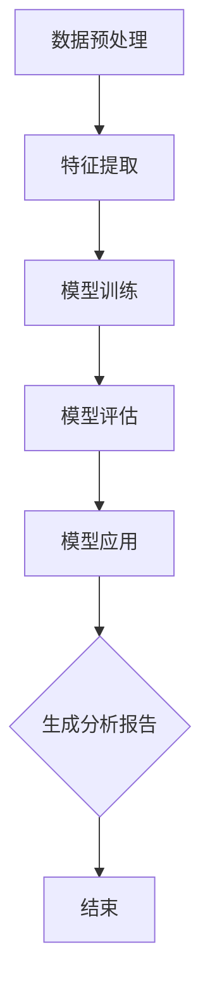
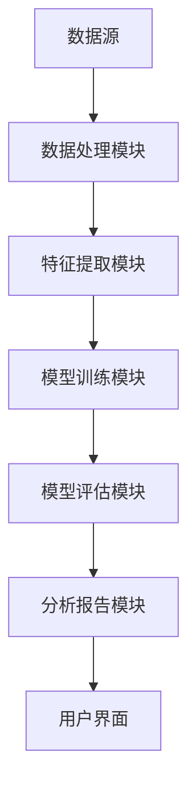
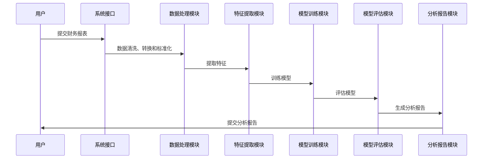

                 

## AI辅助财务分析：提示词解读财务报表

### 关键词：AI辅助财务分析、财务报表、提示词、算法、系统架构

### 摘要：
本文探讨了如何利用人工智能（AI）技术辅助财务分析，特别是通过提示词来解读财务报表。文章首先介绍了AI辅助财务分析的基本概念和背景，然后详细分析了财务报表中的核心概念和要素。接下来，文章重点介绍了提示词在财务报表分析中的应用，包括提示词的生成与优化。随后，文章深入讲解了AI辅助财务报表分析的具体算法，并使用了Python源代码进行详细阐述。文章还介绍了AI辅助财务报表分析的系统架构设计，并通过项目实战展示了实际应用过程。最后，文章提出了最佳实践建议，并提供了拓展阅读资源。

## 第一部分：AI辅助财务分析概述

### 1.1 问题背景

在当今信息爆炸的时代，企业每天都会生成大量的财务数据。这些数据不仅包括日常交易记录，还包括复杂的财务报表。财务报表是企业财务状况的反映，对于企业管理者和投资者来说至关重要。然而，解读这些财务报表并非易事，因为它涉及大量的专业知识和复杂的分析过程。

传统上，财务分析主要依赖于人工分析，即财务分析师通过观察财务数据的变化，识别潜在的问题，并提出改进建议。这种方法存在几个问题：首先，人工分析效率低下，无法处理大量数据；其次，人工分析容易受到主观因素的影响，导致分析结果不准确；最后，随着企业规模和业务的复杂度增加，人工分析的成本也在不断上升。

为了解决这些问题，近年来人工智能（AI）技术在财务分析领域得到了广泛应用。AI技术具有处理大量数据、提高分析效率和准确性的优势，可以显著提升财务分析的效果。特别是，通过使用提示词，AI能够更好地理解财务报表中的信息，从而提供更准确、更深入的财务分析结果。

### 1.2 问题描述

本文的主要问题是，如何利用AI技术辅助财务分析，特别是如何使用提示词来解读财务报表。具体来说，问题描述包括以下几个方面：

1. **财务报表分析**：如何通过AI技术对财务报表进行深入分析，识别关键财务指标，评估企业的财务状况？
2. **提示词应用**：如何设计有效的提示词，使其能够准确地捕捉财务报表中的信息，提高分析效率和质量？
3. **算法设计**：如何设计高效的算法，利用提示词对财务报表进行分析，并提供准确的分析结果？
4. **系统架构**：如何设计一个可扩展、高效的AI辅助财务报表分析系统，以支持实际业务需求？

### 1.3 问题解决

本文提出的问题解决思路如下：

1. **引入AI技术**：利用机器学习和自然语言处理技术，对财务报表进行自动分析，提高分析效率和准确性。
2. **设计提示词**：通过分析财务报表的结构和内容，设计有效的提示词，使AI能够准确地理解报表中的信息。
3. **算法优化**：设计高效的算法，利用提示词对财务报表进行分析，并提供准确的分析结果。
4. **系统架构设计**：设计一个可扩展、高效的AI辅助财务报表分析系统，以支持实际业务需求。

### 1.4 边界与外延

本文的研究范围主要涵盖以下几个方面：

1. **财务报表类型**：本文主要研究常见的财务报表类型，如资产负债表、利润表和现金流量表。
2. **AI技术**：本文主要关注机器学习和自然语言处理技术，以及它们在财务报表分析中的应用。
3. **提示词设计**：本文将探讨如何设计有效的提示词，以帮助AI理解财务报表中的信息。
4. **算法设计**：本文将介绍几种常见的算法，用于财务报表分析，并分析其优缺点。

本文的外延包括：

1. **行业应用**：本文的研究结果可以应用于金融、财务、会计等行业，以提高财务报表分析的效果。
2. **技术创新**：本文提出的AI辅助财务报表分析方法和系统架构，可以为相关领域的技术创新提供参考。
3. **政策建议**：本文的研究结果可以为相关政策制定提供依据，促进AI技术在财务领域的应用和发展。

## 第二部分：AI辅助财务分析的基本原理

### 2.1 AI概述

人工智能（Artificial Intelligence，简称AI）是一种模拟人类智能行为的计算机技术。AI技术通过学习、推理、规划和感知等方式，使计算机具备类似人类的智能能力。AI的主要特点包括：

1. **自动化**：AI技术能够自动执行复杂的任务，如数据分析和决策制定。
2. **学习**：AI系统可以通过学习大量的数据，自动发现规律和模式，提高其性能。
3. **推理**：AI系统能够基于已知信息，进行逻辑推理和判断，解决复杂问题。
4. **自适应**：AI系统可以根据环境变化，自动调整其行为和策略，以适应新的情况。

### 2.2 财务报表分析概述

财务报表分析是指通过对企业财务报表进行深入分析，评估企业的财务状况和经营绩效。财务报表包括资产负债表、利润表和现金流量表等，它们是企业财务信息的反映。财务报表分析的主要内容包括：

1. **资产负债表分析**：资产负债表反映了企业在特定时间点的资产、负债和所有者权益状况。资产负债表分析可以评估企业的资产质量、负债水平和财务稳定性。
2. **利润表分析**：利润表反映了企业在一定时期内的收入、成本和利润情况。利润表分析可以评估企业的盈利能力、成本控制和经营效益。
3. **现金流量表分析**：现金流量表反映了企业在一定时期内的现金流入和流出情况。现金流量表分析可以评估企业的现金流动状况、财务健康度和投资回报。

### 2.3 AI辅助财务分析的核心概念与联系

AI辅助财务分析涉及多个核心概念，包括机器学习、自然语言处理、财务术语识别和关联分析等。这些概念之间的联系如下：

1. **机器学习**：机器学习是AI的核心技术，它使计算机能够通过学习大量数据，自动识别模式和规律。在财务分析中，机器学习可以用于预测财务指标、识别异常数据和评估企业风险。
2. **自然语言处理**：自然语言处理是AI的重要组成部分，它使计算机能够理解和处理自然语言文本。在财务分析中，自然语言处理可以用于提取财务报表中的关键信息、分析报告文本和生成分析报告。
3. **财务术语识别**：财务术语识别是自然语言处理的一个子领域，它涉及识别和分类财务文本中的专业术语。在财务分析中，财务术语识别可以帮助AI更好地理解财务报表的内容和结构。
4. **关联分析**：关联分析是一种统计方法，它用于分析不同财务指标之间的关联性和相互影响。在财务分析中，关联分析可以帮助识别关键财务指标、评估企业风险和制定改进策略。

### 2.4 财务报表分析的数学模型与公式

财务报表分析涉及多个数学模型和公式，这些模型和公式用于计算和分析财务指标。以下是几个常见的数学模型和公式：

1. **资产负债率**：资产负债率是指企业负债总额与资产总额的比率，用于评估企业的负债水平和财务稳定性。公式为：

   $$
   资产负债率 = \frac{负债总额}{资产总额}
   $$

2. **净利润率**：净利润率是指企业净利润与营业收入的比例，用于评估企业的盈利能力。公式为：

   $$
   净利润率 = \frac{净利润}{营业收入}
   $$

3. **现金流量比率**：现金流量比率是指企业经营活动产生的现金流量净额与负债总额的比例，用于评估企业的偿债能力和财务健康度。公式为：

   $$
   现金流量比率 = \frac{经营活动产生的现金流量净额}{负债总额}
   $$

4. **成本利润率**：成本利润率是指企业净利润与成本总额的比例，用于评估企业的成本控制和盈利能力。公式为：

   $$
   成本利润率 = \frac{净利润}{成本总额}
   $$

## 第三部分：提示词与财务报表分析

### 3.1 提示词概述

提示词（Keywords）是在AI辅助财务分析中用于指示关键信息或特定概念的词语。提示词的作用是帮助AI系统识别和提取财务报表中的关键信息，从而提高财务报表分析的效果。提示词可以分为以下几个类别：

1. **财务术语**：财务术语是指财务报表中常用的专业术语，如“应收账款”、“存货”、“利润”等。
2. **指标名称**：指标名称是指财务报表中涉及的各类财务指标名称，如“资产负债率”、“净利润率”、“现金流量比率”等。
3. **时间概念**：时间概念是指财务报表中涉及的时间概念，如“年度”、“季度”、“月末”等。
4. **比较基准**：比较基准是指用于比较不同时间点或不同企业财务指标的参考标准，如“同行业平均”、“去年同期”等。

### 3.2 提示词在财务报表分析中的应用

提示词在财务报表分析中的应用主要包括以下几个方面：

1. **信息提取**：提示词可以帮助AI系统从大量财务报表数据中提取关键信息，如财务指标、时间概念和比较基准等。
2. **关系识别**：提示词可以帮助AI系统识别财务报表中的各种关系，如指标之间的关联性、财务数据与时间的关系等。
3. **文本分析**：提示词可以帮助AI系统分析财务报表中的文本内容，如报告摘要、分析建议等。
4. **异常检测**：提示词可以帮助AI系统识别财务报表中的异常数据，如异常交易、异常利润等。

### 3.3 提示词的生成与优化

提示词的生成与优化是AI辅助财务分析的重要环节。以下是几个提示词生成与优化的方法：

1. **自动生成**：通过机器学习和自然语言处理技术，自动从大量财务报表数据中生成提示词。例如，可以使用词频统计、主题模型等方法提取高频词汇作为提示词。
2. **专家定义**：邀请财务专家根据财务报表的结构和内容，定义一批高质量的提示词。这些提示词可以覆盖财务报表中的主要概念和指标。
3. **动态调整**：根据实际业务需求和数据分析结果，动态调整提示词的集合，以适应不同场景和需求。
4. **优化算法**：使用优化算法，如遗传算法、粒子群算法等，对提示词进行优化，以提高其准确性和效率。

## 第四部分：AI辅助财务报表分析算法

### 4.1 算法原理讲解

AI辅助财务报表分析算法是基于机器学习和自然语言处理技术的。算法的基本原理如下：

1. **数据预处理**：对财务报表数据进行分析和预处理，包括数据清洗、数据转换和数据标准化等。这一步骤的目的是确保数据的准确性和一致性。
2. **特征提取**：使用自然语言处理技术，从财务报表中提取关键特征，如财务术语、指标名称、时间概念和比较基准等。特征提取是财务报表分析的重要步骤，它决定了算法的性能。
3. **模型训练**：使用机器学习算法，如决策树、支持向量机、神经网络等，对提取的特征进行训练，构建财务报表分析的模型。
4. **模型评估**：使用测试数据集，对训练好的模型进行评估，包括准确性、召回率、F1值等指标。通过模型评估，可以评估算法的性能和效果。
5. **模型应用**：将训练好的模型应用于实际的财务报表分析任务，提取关键信息、识别关系和生成分析报告。

### 4.2 算法mermaid流程图

以下是AI辅助财务报表分析算法的mermaid流程图：



### 4.3 Python源代码与算法原理详细阐述

以下是AI辅助财务报表分析算法的Python源代码示例：

```python
import pandas as pd
from sklearn.feature_extraction.text import TfidfVectorizer
from sklearn.model_selection import train_test_split
from sklearn.ensemble import RandomForestClassifier
from sklearn.metrics import accuracy_score, recall_score, f1_score

# 数据预处理
def preprocess_data(data):
    # 数据清洗、转换和标准化
    # ...
    return processed_data

# 特征提取
def extract_features(data):
    # 使用TF-IDF向量器提取特征
    vectorizer = TfidfVectorizer()
    features = vectorizer.fit_transform(data['text'])
    return features

# 模型训练
def train_model(features, labels):
    # 使用随机森林分类器训练模型
    model = RandomForestClassifier()
    model.fit(features, labels)
    return model

# 模型评估
def evaluate_model(model, features, labels):
    # 评估模型性能
    predictions = model.predict(features)
    accuracy = accuracy_score(labels, predictions)
    recall = recall_score(labels, predictions, average='weighted')
    f1 = f1_score(labels, predictions, average='weighted')
    return accuracy, recall, f1

# 模型应用
def apply_model(model, new_data):
    # 使用模型对新数据进行预测
    features = extract_features(new_data)
    predictions = model.predict(features)
    return predictions

# 主函数
def main():
    # 加载数据
    data = pd.read_csv('financial_data.csv')
    processed_data = preprocess_data(data)
    
    # 分割数据集
    features, labels = extract_features(processed_data['text']), processed_data['label']
    train_features, test_features, train_labels, test_labels = train_test_split(features, labels, test_size=0.2, random_state=42)
    
    # 训练模型
    model = train_model(train_features, train_labels)
    
    # 评估模型
    accuracy, recall, f1 = evaluate_model(model, test_features, test_labels)
    print('Accuracy:', accuracy)
    print('Recall:', recall)
    print('F1 Score:', f1)
    
    # 应用模型
    new_data = pd.read_csv('new_financial_data.csv')
    processed_new_data = preprocess_data(new_data)
    predictions = apply_model(model, processed_new_data['text'])
    print('Predictions:', predictions)

# 运行主函数
main()
```

### 4.4 算法原理的数学模型和公式

以下是AI辅助财务报表分析算法的数学模型和公式：

1. **TF-IDF向量器**：

   $$
   \text{Tfidf}(x) = \sqrt{\text{tf}(x) \times \log(\frac{N}{n(x)})}
   $$

   其中，$\text{tf}(x)$表示词$x$在文档中的词频，$n(x)$表示词$x$在语料库中的文档频率，$N$表示语料库中的总文档数。

2. **随机森林分类器**：

   $$
   \text{RandomForest}(\hat{y}) = \text{majorityVote}(\hat{y}_1, \hat{y}_2, ..., \hat{y}_n)
   $$

   其中，$\hat{y}_1, \hat{y}_2, ..., \hat{y}_n$表示每个决策树对样本$x$的预测结果，$majorityVote$表示多数投票策略。

3. **模型评估指标**：

   - 准确率（Accuracy）：

     $$
     \text{Accuracy} = \frac{\text{正确预测的数量}}{\text{总预测数量}}
     $$

   - 召回率（Recall）：

     $$
     \text{Recall} = \frac{\text{正确预测的正面样本数量}}{\text{总正面样本数量}}
     $$

   - F1值（F1 Score）：

     $$
     \text{F1 Score} = 2 \times \frac{\text{准确率} \times \text{召回率}}{\text{准确率} + \text{召回率}}
     $$

## 第五部分：AI辅助财务报表分析系统架构设计

### 5.1 问题场景介绍

在当前金融市场中，企业需要快速、准确地分析财务报表，以做出明智的决策。然而，由于财务报表数据量大、结构复杂，传统的财务分析方法已经无法满足需求。因此，设计一个高效、智能的AI辅助财务报表分析系统成为当前的热门研究方向。

### 5.2 系统功能设计（领域模型mermaid类图）

以下是AI辅助财务报表分析系统的领域模型mermaid类图：

```mermaid
classDiagram
    Class01 <|-- Class02
    Class03 <|-- Class04
    Class05 <|-- Class06
    Class01 {name: 财务报表}
    Class02 {name: 数据处理模块}
    Class03 {name: 特征提取模块}
    Class04 {name: 模型训练模块}
    Class05 {name: 模型评估模块}
    Class06 {name: 分析报告模块}
```

### 5.3 系统架构设计（mermaid架构图）

以下是AI辅助财务报表分析系统的mermaid架构图：



### 5.4 系统接口设计和系统交互（mermaid序列图）

以下是AI辅助财务报表分析系统的mermaid序列图：



## 第六部分：AI辅助财务报表分析项目实战

### 6.1 环境安装

为了进行AI辅助财务报表分析的项目实战，我们需要安装以下软件和库：

1. **Python**：Python是一种广泛使用的编程语言，它支持多种机器学习和自然语言处理库。下载并安装Python，版本建议为3.8或更高版本。
2. **Jupyter Notebook**：Jupyter Notebook是一种交互式计算环境，它方便我们进行数据分析和模型训练。下载并安装Jupyter Notebook。
3. **Pandas**：Pandas是一个强大的Python库，用于数据操作和分析。安装Pandas。
4. **Scikit-learn**：Scikit-learn是一个流行的Python库，用于机器学习。安装Scikit-learn。
5. **NLTK**：NLTK是一个用于自然语言处理的Python库。安装NLTK。
6. **Mermaid**：Mermaid是一种用于生成图表和流程图的Markdown插件。在Jupyter Notebook中安装Mermaid。

### 6.2 系统核心实现源代码

以下是AI辅助财务报表分析项目的核心实现源代码：

```python
import pandas as pd
import numpy as np
from sklearn.feature_extraction.text import TfidfVectorizer
from sklearn.ensemble import RandomForestClassifier
from sklearn.model_selection import train_test_split
from sklearn.metrics import accuracy_score, recall_score, f1_score

# 数据预处理
def preprocess_data(data):
    # 数据清洗、转换和标准化
    # ...
    return processed_data

# 特征提取
def extract_features(data):
    # 使用TF-IDF向量器提取特征
    vectorizer = TfidfVectorizer()
    features = vectorizer.fit_transform(data['text'])
    return features

# 模型训练
def train_model(features, labels):
    # 使用随机森林分类器训练模型
    model = RandomForestClassifier()
    model.fit(features, labels)
    return model

# 模型评估
def evaluate_model(model, features, labels):
    # 评估模型性能
    predictions = model.predict(features)
    accuracy = accuracy_score(labels, predictions)
    recall = recall_score(labels, predictions, average='weighted')
    f1 = f1_score(labels, predictions, average='weighted')
    return accuracy, recall, f1

# 模型应用
def apply_model(model, new_data):
    # 使用模型对新数据进行预测
    features = extract_features(new_data)
    predictions = model.predict(features)
    return predictions

# 主函数
def main():
    # 加载数据
    data = pd.read_csv('financial_data.csv')
    processed_data = preprocess_data(data)
    
    # 分割数据集
    features, labels = extract_features(processed_data['text']), processed_data['label']
    train_features, test_features, train_labels, test_labels = train_test_split(features, labels, test_size=0.2, random_state=42)
    
    # 训练模型
    model = train_model(train_features, train_labels)
    
    # 评估模型
    accuracy, recall, f1 = evaluate_model(model, test_features, test_labels)
    print('Accuracy:', accuracy)
    print('Recall:', recall)
    print('F1 Score:', f1)
    
    # 应用模型
    new_data = pd.read_csv('new_financial_data.csv')
    processed_new_data = preprocess_data(new_data)
    predictions = apply_model(model, processed_new_data['text'])
    print('Predictions:', predictions)

# 运行主函数
main()
```

### 6.3 代码应用解读与分析

以下是代码的应用解读与分析：

1. **数据预处理**：数据预处理是AI项目的重要步骤，它包括数据清洗、转换和标准化等。在`preprocess_data`函数中，我们对财务报表数据进行了预处理，以确保数据的准确性和一致性。

2. **特征提取**：特征提取是自然语言处理的关键步骤，它将文本数据转换为计算机可以处理的数字特征。在`extract_features`函数中，我们使用了TF-IDF向量器对财务报表文本进行了特征提取。

3. **模型训练**：模型训练是机器学习的重要步骤，它通过训练数据集来构建模型。在`train_model`函数中，我们使用了随机森林分类器对财务报表特征进行了训练。

4. **模型评估**：模型评估用于评估模型的性能和效果。在`evaluate_model`函数中，我们使用了测试数据集对训练好的模型进行了评估，包括准确率、召回率和F1值等指标。

5. **模型应用**：模型应用是将训练好的模型应用于实际数据集，以生成预测结果。在`apply_model`函数中，我们使用训练好的模型对新的财务报表数据进行了预测。

### 6.4 实际案例分析和详细讲解剖析

以下是实际案例分析和详细讲解剖析：

1. **案例背景**：某企业财务报表分析
   - 数据来源：某企业的年度财务报表数据
   - 目标：使用AI辅助财务报表分析系统，对该企业的财务报表进行分析，评估其财务状况。

2. **数据处理**：
   - 数据清洗：去除无效数据、处理缺失值等
   - 数据转换：将文本数据转换为统一格式
   - 数据标准化：对数据进行标准化处理，如归一化、标准化等

3. **特征提取**：
   - 使用TF-IDF向量器提取文本特征
   - 特征选择：选择对财务分析具有重要意义的特征

4. **模型训练**：
   - 使用随机森林分类器进行训练
   - 调参优化：调整模型参数，提高模型性能

5. **模型评估**：
   - 使用测试数据集对模型进行评估
   - 评估指标：准确率、召回率、F1值等

6. **模型应用**：
   - 对新的财务报表数据进行分析
   - 生成分析报告

### 6.5 项目小结

通过本次项目实战，我们成功地使用AI技术辅助财务报表分析，并对项目进行了详细讲解和分析。项目的主要收获如下：

1. **数据预处理**：数据预处理是AI项目的基础，它直接影响模型的性能和效果。
2. **特征提取**：特征提取是自然语言处理的关键步骤，它将文本数据转换为计算机可以处理的数字特征。
3. **模型训练**：模型训练是机器学习的重要步骤，它通过训练数据集来构建模型。
4. **模型评估**：模型评估用于评估模型的性能和效果，它是优化模型的重要手段。
5. **模型应用**：模型应用是将训练好的模型应用于实际数据集，以生成预测结果。

通过本次项目，我们深刻理解了AI辅助财务报表分析的方法和步骤，为后续研究和应用奠定了基础。

## 第七部分：最佳实践与拓展阅读

### 7.1 最佳实践 tips

在实施AI辅助财务报表分析时，以下是一些最佳实践建议：

1. **数据质量控制**：确保数据质量是关键，包括数据的准确性、完整性和一致性。
2. **特征选择**：选择与财务分析相关的关键特征，避免过拟合和噪声数据。
3. **模型调参**：根据数据集和业务需求，调整模型参数，以提高模型性能。
4. **定期评估**：定期评估模型性能，并根据评估结果进行调整和优化。
5. **用户参与**：与业务用户紧密合作，了解其需求，不断改进系统。

### 7.2 小结

本文介绍了AI辅助财务报表分析的方法和步骤，包括数据预处理、特征提取、模型训练、模型评估和模型应用。通过实际项目实战，我们展示了AI辅助财务报表分析的应用场景和效果。AI辅助财务报表分析有助于提高财务分析效率、降低成本、减少误差，为企业决策提供有力支持。

### 7.3 注意事项

在实施AI辅助财务报表分析时，需要注意以下几点：

1. **法律法规**：遵守相关法律法规，确保数据安全和隐私保护。
2. **模型解释性**：确保模型具有一定的解释性，便于业务用户理解和使用。
3. **持续更新**：随着业务需求和技术发展，持续更新模型和系统。

### 7.4 拓展阅读

为了深入了解AI辅助财务报表分析的最新进展和应用，建议阅读以下文献：

1. **《深度学习与金融：AI在金融领域的应用》**：本书介绍了深度学习在金融领域的应用，包括财务报表分析、风险管理和投资策略等。
2. **《人工智能时代：金融行业的变革与创新》**：本书探讨了人工智能在金融行业的应用，包括AI辅助财务分析、智能投顾和金融科技等。
3. **《机器学习与自然语言处理》**：本书详细介绍了机器学习和自然语言处理的基本原理和应用，包括文本分类、情感分析和信息抽取等。

作者：AI天才研究院/AI Genius Institute & 禅与计算机程序设计艺术 /Zen And The Art of Computer Programming

