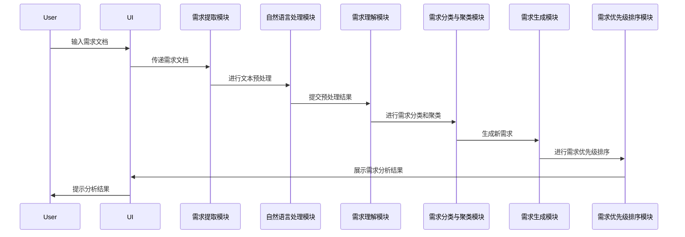
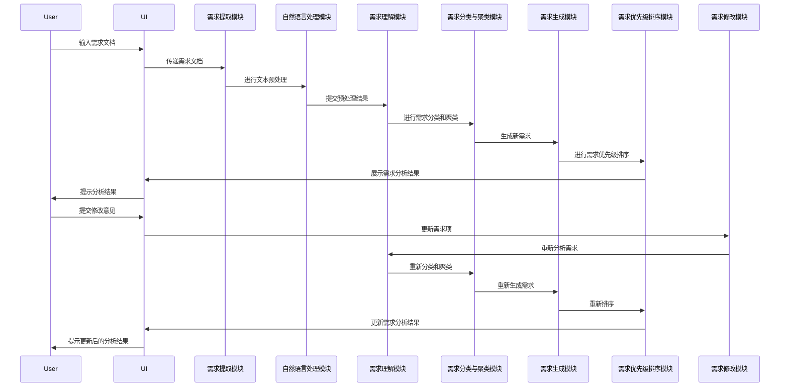

                 

### AI辅助软件开发：大模型在需求分析中的应用

#### 关键词：
- AI辅助软件开发
- 大模型
- 需求分析
- 自然语言处理
- 系统架构设计

#### 摘要：
本文深入探讨了AI大模型在软件开发需求分析中的应用。首先，我们介绍了AI辅助软件开发的背景及其重要性。接着，详细讲解了大模型的核心概念、原理和应用算法。然后，通过系统分析与架构设计，展示了如何将大模型应用于实际软件开发中。最后，通过一个实际项目实战，深入分析了大模型在需求分析中的具体应用，并总结了最佳实践和注意事项。本文旨在为开发者提供一套系统化的AI辅助软件开发指南。

----------------------------------------------------------------

## 目录大纲设计思路

为了确保《AI辅助软件开发：大模型在需求分析中的应用》这本书的内容既丰富又具有系统性，我们按照以下设计思路来构建目录大纲：

### 1. 背景介绍
在开始具体技术讲解之前，我们需要为读者提供一个宏观的背景介绍。这包括AI辅助软件开发的现状、需求分析的重要性以及大模型在这一领域的应用潜力。通过这一部分，读者可以建立对整个话题的基本认识。

### 2. 核心概念与联系
接下来，我们需要详细介绍AI大模型的相关核心概念，包括其定义、特点、分类等。同时，通过对比表格和实体关系图，帮助读者理解大模型与其他相关概念的联系。这一部分是文章的理论基础，确保读者能够清晰地理解后续内容的背景和意义。

### 3. 算法原理讲解
算法原理讲解是文章的核心部分。我们将详细讲解大模型在需求分析中的应用算法，包括数学模型、公式和实例。通过这一部分，读者可以了解如何将大模型应用于实际的软件开发需求分析中。

### 4. 系统分析与架构设计
在这一部分，我们将描述一个基于AI大模型的软件开发系统分析与架构设计方案。这包括系统概述、领域模型设计、系统架构设计、系统接口设计和系统交互设计。通过这一部分，读者可以了解如何构建一个完整的AI辅助软件开发系统。

### 5. 项目实战
为了将理论知识与实际应用结合起来，我们将通过一个实际项目实战来展示如何将大模型应用于需求分析。这一部分将包括项目介绍、环境安装与配置、系统核心实现、代码应用解读与分析、实际案例分析与讲解以及项目小结。通过这一部分，读者可以实际了解大模型在需求分析中的应用效果。

### 6. 最佳实践与注意事项
在文章的最后，我们将总结大模型应用的最佳实践，并讨论在需求分析中可能遇到的问题以及解决方法。此外，还将提出一些注意事项，帮助读者在应用大模型时避免常见错误。最后，我们将提供拓展阅读，为读者提供进一步学习和探索的方向。

### 目录大纲结构设计

根据上述设计思路，我们可以设计出以下目录大纲：

### 第一部分：AI辅助软件开发概述

#### 第1章：问题背景与核心概念
- 1.1 软件开发面临的挑战
- 1.2 AI辅助软件开发的趋势
- 1.3 大模型在需求分析中的作用
- 1.4 大模型概述
  - 1.4.1 大模型的定义
  - 1.4.2 大模型的特点
  - 1.4.3 大模型的分类
- 1.5 大模型与需求分析的关系
- 1.6 大模型的需求分析方法

#### 第2章：AI大模型的基本原理
- 2.1 神经网络基础
- 2.2 深度学习原理
- 2.3 大模型架构
- 2.4 大模型训练过程
- 2.5 大模型优化方法

#### 第3章：大模型在需求分析中的应用算法
- 3.1 需求分析算法概述
- 3.2 基于大模型的自然语言处理算法
- 3.3 需求分类与聚类算法
- 3.4 需求生成算法
- 3.5 需求优先级排序算法

#### 第4章：系统分析与架构设计
- 4.1 需求分析系统概述
- 4.2 领域模型设计
- 4.3 系统架构设计
- 4.4 系统接口设计
- 4.5 系统交互设计

#### 第5章：项目实战
- 5.1 项目介绍
- 5.2 环境安装与配置
- 5.3 系统核心实现
- 5.4 代码应用解读与分析
- 5.5 实际案例分析与讲解
- 5.6 项目小结

#### 第6章：最佳实践与注意事项
- 6.1 大模型应用的最佳实践
- 6.2 需求分析的常见问题与解决方法
- 6.3 注意事项与风险管理

#### 第7章：总结与展望
- 7.1 成果总结
- 7.2 未来展望
- 7.3 拓展阅读

### 目录大纲完成

至此，我们已经完成了《AI辅助软件开发：大模型在需求分析中的应用》的目录大纲设计。接下来，我们将按照这个大纲逐步展开内容，深入探讨AI大模型在软件开发需求分析中的应用。希望这个目录大纲能够帮助读者系统地了解并掌握这一领域的前沿技术和方法。


----------------------------------------------------------------

## 第一部分：AI辅助软件开发概述

### 第1章：问题背景与核心概念

在当今快速发展的信息技术时代，软件开发已经成为了推动社会进步和经济发展的重要力量。然而，随着软件项目的规模和复杂性的不断增加，传统的软件开发方法面临着越来越多的挑战。为了应对这些挑战，AI辅助软件开发逐渐成为了一个热门的研究方向。

#### 1.1 软件开发面临的挑战

首先，让我们来看一下软件开发目前所面临的几个主要挑战：

1. **需求不断变化**：在软件开发过程中，客户的需求往往会在项目进行中不断变化，这对开发团队带来了巨大的挑战。如何快速响应用户需求，保持软件系统的灵活性和可维护性，成为了软件开发中的重要问题。

2. **项目复杂性增加**：随着软件项目的规模和复杂性的增加，开发人员需要处理的信息量也在不断增加。如何有效地管理这些信息，确保软件系统的可靠性和稳定性，成为了软件开发中的另一大挑战。

3. **开发周期缩短**：在市场竞争日益激烈的环境下，软件企业需要更快地交付高质量的软件产品。如何缩短开发周期，提高开发效率，成为了软件开发中的关键问题。

4. **人力资源短缺**：随着技术的不断发展，对软件开发人员的需求也在不断增长。然而，优秀开发人员的供应却相对有限，这导致了软件企业面临人力资源短缺的困境。

#### 1.2 AI辅助软件开发的趋势

为了应对上述挑战，AI辅助软件开发应运而生。AI辅助软件开发是指利用人工智能技术来辅助软件开发过程，包括需求分析、设计、编码、测试等各个环节。AI辅助软件开发的趋势主要表现在以下几个方面：

1. **自动化需求分析**：传统的需求分析往往依赖于开发人员的经验和技能，而AI辅助需求分析可以通过自然语言处理技术自动提取用户需求，提高需求分析的准确性和效率。

2. **智能化代码生成**：AI技术可以自动生成代码，减少开发人员的手动编码工作量，提高开发效率。此外，AI还可以通过代码质量检测，确保生成的代码具有良好的可读性和可维护性。

3. **自动化测试**：AI技术可以自动化进行软件测试，包括单元测试、集成测试和系统测试等，提高测试的覆盖率和准确性。

4. **智能化的项目管理**：AI技术可以帮助项目管理人员更好地进行项目规划、进度控制和资源分配，提高项目管理效率。

#### 1.3 大模型在需求分析中的应用

在大模型的发展趋势中，它们在需求分析中的应用变得越来越重要。大模型，通常指的是深度学习模型，尤其是那些具有数十亿参数的模型。这些模型通过大规模的数据训练，可以提取出复杂的数据特征，从而在需求分析中发挥出强大的能力。

1. **自然语言处理（NLP）**：大模型在NLP领域有着广泛的应用，例如文本分类、情感分析、命名实体识别等。这些技术可以帮助开发人员从用户需求文档中自动提取关键信息，提高需求分析的准确性和效率。

2. **知识图谱**：大模型可以构建知识图谱，将用户需求与已有的知识体系进行关联，从而更好地理解用户需求，并生成更加精准的需求文档。

3. **生成式模型**：大模型可以通过生成式模型，如生成对抗网络（GAN），生成新的用户需求场景，帮助开发人员探索和验证需求。

4. **协同过滤**：大模型可以通过协同过滤算法，基于已有的需求数据，预测新的需求，从而帮助开发人员快速响应用户需求变化。

#### 1.4 大模型概述

大模型，通常指的是深度学习模型，尤其是那些具有数十亿参数的模型。这些模型通过大规模的数据训练，可以提取出复杂的数据特征，从而在需求分析中发挥出强大的能力。

1. **定义**：大模型是一种具有大量参数的深度学习模型，通常需要大量的数据进行训练。

2. **特点**：大模型具有以下特点：
   - **参数量巨大**：大模型通常具有数十亿个参数，这使得它们可以提取出复杂的数据特征。
   - **高计算资源需求**：由于参数量巨大，大模型对计算资源的需求也较高，通常需要使用GPU等高性能计算设备进行训练。
   - **训练时间较长**：大模型的训练时间通常较长，需要大量的时间和计算资源。

3. **分类**：大模型可以根据不同的训练目标和应用场景进行分类，例如：
   - **生成式模型**：如生成对抗网络（GAN），用于生成新的数据。
   - **判别式模型**：如卷积神经网络（CNN）和循环神经网络（RNN），用于分类、回归等任务。
   - **强化学习模型**：如深度强化学习（DRL），用于解决序列决策问题。

#### 1.5 大模型与需求分析的关系

大模型在需求分析中的应用，主要体现在以下几个方面：

1. **自动化需求提取**：大模型可以通过自然语言处理技术，自动从用户需求文档中提取关键信息，例如功能需求、性能需求等，从而提高需求分析的准确性和效率。

2. **需求预测与优先级排序**：大模型可以通过学习用户历史需求数据，预测未来的需求趋势，并基于需求的重要性和紧急性对需求进行优先级排序，从而帮助开发人员快速响应用户需求变化。

3. **需求验证与优化**：大模型可以通过生成新的需求场景，与用户进行交互，验证需求的可行性和合理性，从而优化需求文档。

4. **知识图谱构建**：大模型可以构建知识图谱，将用户需求与已有的知识体系进行关联，从而更好地理解用户需求，并生成更加精准的需求文档。

#### 1.6 大模型的需求分析方法

大模型的需求分析方法主要包括以下几个方面：

1. **自然语言处理（NLP）**：利用NLP技术，从用户需求文档中提取关键信息，例如功能需求、性能需求等。

2. **知识图谱构建**：通过构建知识图谱，将用户需求与已有的知识体系进行关联，从而更好地理解用户需求。

3. **生成式模型**：利用生成式模型，如生成对抗网络（GAN），生成新的用户需求场景，帮助开发人员探索和验证需求。

4. **协同过滤**：通过协同过滤算法，基于已有的需求数据，预测新的需求，从而帮助开发人员快速响应用户需求变化。

5. **强化学习**：利用强化学习技术，根据用户行为和反馈，不断优化需求预测和排序模型。

通过以上六个方面的方法，大模型可以有效地辅助软件开发需求分析，提高需求分析的准确性和效率。

### 总结

本章首先介绍了软件开发面临的挑战，然后探讨了AI辅助软件开发的趋势，特别是大模型在需求分析中的应用。接着，详细介绍了大模型的核心概念、特点、分类以及与需求分析的关系。最后，阐述了大模型的需求分析方法。下一章将深入探讨AI大模型的基本原理，包括神经网络、深度学习、大模型架构和训练过程等内容。

----------------------------------------------------------------

## 第2章：AI大模型的基本原理

在深入探讨AI大模型在需求分析中的应用之前，我们首先需要了解大模型的基本原理。本章将详细介绍大模型的核心概念、神经网络基础、深度学习原理、大模型架构以及大模型训练过程。

### 2.1 神经网络基础

神经网络（Neural Network）是构建AI大模型的基础。它模仿生物神经系统的结构和功能，通过大量的简单计算单元（神经元）相互连接，形成复杂的网络结构，以实现对数据的处理和学习。

1. **神经元结构**：
   - **输入层**：接收外部输入信息。
   - **隐藏层**：对输入信息进行计算和变换。
   - **输出层**：产生最终的输出结果。

2. **激活函数**：
   - **非线性激活函数**：如ReLU、Sigmoid、Tanh等，用于引入非线性特性，使神经网络能够学习更复杂的模式。

3. **前向传播与反向传播**：
   - **前向传播**：将输入信息从输入层传递到输出层，得到预测结果。
   - **反向传播**：根据预测结果与实际结果的误差，反向调整各层的权重和偏置，以达到最优的预测效果。

### 2.2 深度学习原理

深度学习（Deep Learning）是神经网络的一种扩展，它通过增加网络的深度（隐藏层数量），提高了神经网络的表达能力和学习能力。深度学习的基本原理包括：

1. **层次化特征学习**：
   - **浅层特征**：从输入数据中提取基础的、低层次的、原始的特征。
   - **深层特征**：通过多层的非线性变换，提取更高层次、更抽象的特征。

2. **端到端学习**：
   - 深度学习模型可以直接从原始数据中学习到特征，无需人工设计特征，实现了端到端的学习。

3. **多层神经网络**：
   - 深度学习模型通常包含多个隐藏层，通过逐层抽象，提高模型的性能。

### 2.3 大模型架构

大模型通常具有数十亿甚至数万亿个参数，其架构相对复杂。以下是几种常见的大模型架构：

1. **卷积神经网络（CNN）**：
   - 主要用于图像和视频数据的处理，通过卷积层和池化层提取图像特征。

2. **循环神经网络（RNN）**：
   - 主要用于序列数据的处理，通过循环结构处理前后依赖关系。

3. **生成对抗网络（GAN）**：
   - 通过生成器和判别器的对抗训练，实现数据的生成。

4. **Transformer模型**：
   - 主要用于自然语言处理任务，通过自注意力机制，实现全局信息的有效处理。

### 2.4 大模型训练过程

大模型的训练是一个复杂的过程，通常包括以下步骤：

1. **数据预处理**：
   - **数据清洗**：去除数据中的噪声和异常值。
   - **数据归一化**：将数据缩放到一个统一的范围内，便于模型学习。
   - **数据增强**：通过旋转、缩放、裁剪等操作，增加数据多样性。

2. **模型初始化**：
   - 初始化模型参数，常用的初始化方法包括高斯分布、Xavier初始化等。

3. **前向传播与损失计算**：
   - 将输入数据传递到模型中，计算预测结果和实际结果的损失。

4. **反向传播与权重更新**：
   - 根据损失函数的梯度，反向传播更新模型参数。

5. **迭代训练**：
   - 通过多次迭代，不断调整模型参数，优化模型的性能。

### 2.5 大模型优化方法

为了提高大模型的性能和收敛速度，常用的优化方法包括：

1. **批量大小**：
   - 调整批量大小，可以平衡计算资源和训练效果。

2. **学习率调度**：
   - 采用适当的学习率调度策略，如指数衰减、学习率衰减周期等，以避免过拟合。

3. **正则化**：
   - 使用正则化方法，如L1、L2正则化，防止模型过拟合。

4. **dropout**：
   - 在训练过程中随机丢弃部分神经元，防止模型过拟合。

5. **迁移学习**：
   - 利用预训练的大模型，进行特定任务的微调，提高模型的性能。

### 总结

本章详细介绍了AI大模型的基本原理，包括神经网络基础、深度学习原理、大模型架构以及大模型训练过程。通过本章的学习，读者可以了解大模型的核心概念和工作原理，为后续章节中深入探讨大模型在需求分析中的应用打下坚实的基础。下一章将详细讲解大模型在需求分析中的应用算法，包括自然语言处理、需求分类与聚类、需求生成和需求优先级排序等。

----------------------------------------------------------------

## 第3章：大模型在需求分析中的应用算法

在了解了大模型的基本原理之后，接下来我们将探讨大模型在需求分析中的应用算法。这些算法包括基于大模型的自然语言处理算法、需求分类与聚类算法、需求生成算法以及需求优先级排序算法。通过这些算法，大模型可以有效地辅助软件开发需求分析。

### 3.1 需求分析算法概述

需求分析是软件开发过程中的关键环节，它涉及到从用户需求中提取出具体的、可操作的需求项。大模型在需求分析中的应用，主要通过以下几个步骤实现：

1. **需求文本处理**：利用自然语言处理（NLP）算法，对用户需求文本进行预处理，包括分词、词性标注、命名实体识别等。

2. **需求理解**：通过大模型的深度学习算法，对预处理后的需求文本进行语义理解，提取出关键信息。

3. **需求分类与聚类**：利用需求分类与聚类算法，将提取出的需求项进行分类和聚类，以便于后续的需求优先级排序和需求生成。

4. **需求生成**：基于已有需求项和大模型的学习能力，生成新的需求项，以满足用户不断变化的需求。

5. **需求优先级排序**：根据需求的重要性和紧急性，对需求项进行优先级排序，为开发团队提供明确的开发顺序。

### 3.2 基于大模型的自然语言处理算法

自然语言处理（NLP）是AI领域的一个重要分支，它涉及到文本的预处理、语义理解和文本生成等方面。大模型在NLP中的应用，主要体现在以下几个方面：

1. **文本分类**：
   - **算法原理**：文本分类是一种将文本数据分为多个类别的过程。大模型通过学习大量的文本数据，可以识别出不同类别文本的特征，从而实现自动分类。
   - **实例**：例如，可以将用户的需求文本分类为功能需求、性能需求、安全性需求等。

2. **情感分析**：
   - **算法原理**：情感分析是一种评估文本情感极性的过程。大模型通过学习情感词典和情感特征，可以判断文本的情感倾向，如正面、负面或中立。
   - **实例**：例如，可以分析用户的需求文本，判断用户的满意度或对某个功能的需求程度。

3. **命名实体识别**：
   - **算法原理**：命名实体识别是一种从文本中提取出具有特定意义的实体，如人名、地名、组织名等。大模型通过学习大量的实体标注数据，可以准确地识别出文本中的命名实体。
   - **实例**：例如，可以在用户需求文本中识别出关键人物、地点或组织，以便于进一步的需求分析。

4. **文本生成**：
   - **算法原理**：文本生成是一种根据输入文本生成相关文本内容的过程。大模型通过学习大量的文本数据，可以生成与输入文本相关的新文本。
   - **实例**：例如，可以根据用户的需求文本，自动生成详细的需求文档。

### 3.3 需求分类与聚类算法

需求分类与聚类是需求分析中的重要步骤，它可以帮助开发团队更好地理解和组织需求。

1. **需求分类**：
   - **算法原理**：需求分类是一种将需求项分为不同类别的过程。大模型通过学习已分类的需求数据，可以自动对新的需求项进行分类。
   - **实例**：例如，可以将需求项分类为功能需求、性能需求、安全性需求等。

2. **需求聚类**：
   - **算法原理**：需求聚类是一种将相似的需求项分为同一类的过程。大模型通过学习需求数据，可以自动识别出相似的需求项。
   - **实例**：例如，可以识别出多个用户提交的需求中，哪些是相似的需求，以便于合并或优先处理。

### 3.4 需求生成算法

需求生成算法可以帮助开发团队快速响应用户不断变化的需求，提高开发效率。

1. **算法原理**：
   - 需求生成算法基于用户历史需求和当前需求，通过大模型的学习能力，自动生成新的需求项。

2. **实例**：
   - 例如，当用户提交了新的需求时，系统可以根据已有的需求数据，自动生成相关的补充需求，如性能优化需求、安全性需求等。

### 3.5 需求优先级排序算法

需求优先级排序算法可以帮助开发团队根据需求的重要性和紧急性，合理安排开发任务。

1. **算法原理**：
   - 需求优先级排序算法通过分析用户需求和项目目标，利用大模型对需求进行优先级排序。

2. **实例**：
   - 例如，系统可以根据用户的需求文本，判断需求的重要性和紧急性，将需求分为高、中、低三个优先级，以便于开发团队优先处理。

### 总结

本章详细介绍了大模型在需求分析中的应用算法，包括自然语言处理、需求分类与聚类、需求生成和需求优先级排序等。通过这些算法，大模型可以有效地辅助软件开发需求分析，提高需求分析的准确性和效率。下一章将探讨如何将大模型应用于实际的软件开发系统中，包括系统分析与架构设计等内容。

----------------------------------------------------------------

## 第4章：系统分析与架构设计

在了解了大模型在需求分析中的应用算法后，我们需要将其整合到实际的软件开发系统中。本章将详细介绍基于AI大模型的软件开发系统的系统分析与架构设计，包括系统概述、领域模型设计、系统架构设计、系统接口设计和系统交互设计。

### 4.1 需求分析系统概述

一个基于AI大模型的软件开发需求分析系统旨在通过自动化和智能化的方式，帮助开发团队更好地理解和响应用户需求。该系统的主要功能包括：

1. **需求提取**：通过自然语言处理算法，自动从用户需求文档中提取出关键信息。
2. **需求理解**：利用大模型进行语义理解，将提取出的需求转化为结构化的数据。
3. **需求分类与聚类**：对需求项进行分类和聚类，以便于进一步的需求分析和优先级排序。
4. **需求生成**：基于已有需求和大模型的学习能力，生成新的需求项。
5. **需求优先级排序**：根据需求的重要性和紧急性，对需求项进行排序，为开发团队提供明确的开发顺序。

### 4.2 领域模型设计

领域模型是软件系统设计的重要部分，它描述了系统中涉及的主要实体、属性和关系。在基于AI大模型的需求分析系统中，领域模型主要包括以下几个关键实体：

1. **需求实体**：包括功能需求、性能需求、安全性需求等。
2. **用户实体**：包括用户、用户角色和用户行为等。
3. **项目实体**：包括项目、项目阶段、项目目标和项目任务等。
4. **大模型实体**：包括大模型、模型参数、训练数据和预测结果等。

领域模型中的实体关系可以表示为以下ER实体关系图：

```mermaid
erDiagram
    用户 ||--|{ 需求 }|
    用户 ||--|{ 项目 }|
    需求 ||--|{ 大模型 }|
    项目 ||--|{ 大模型 }|
```

### 4.3 系统架构设计

系统架构设计是软件开发系统设计的核心，它定义了系统的整体结构和各组件之间的交互关系。在基于AI大模型的需求分析系统中，系统架构可以设计为以下几个关键模块：

1. **需求提取模块**：负责从用户需求文档中提取关键信息，通过自然语言处理算法实现文本预处理。
2. **需求理解模块**：利用大模型进行语义理解，将提取出的需求转化为结构化的数据。
3. **需求分类与聚类模块**：对需求项进行分类和聚类，以便于进一步的需求分析和优先级排序。
4. **需求生成模块**：基于已有需求和大模型的学习能力，生成新的需求项。
5. **需求优先级排序模块**：根据需求的重要性和紧急性，对需求项进行排序。
6. **用户界面模块**：提供用户交互界面，展示需求分析结果，并允许用户对需求进行修改和反馈。

系统架构设计可以表示为以下Mermaid架构图：



### 4.4 系统接口设计

系统接口设计是确保不同模块之间能够高效交互的重要环节。在基于AI大模型的需求分析系统中，主要涉及以下接口：

1. **文本预处理接口**：用于接收用户输入的需求文档，并传递给自然语言处理模块进行预处理。
2. **大模型接口**：用于接收预处理结果，并传递给需求理解模块，以便进行语义理解。
3. **需求分类与聚类接口**：用于接收需求项，并传递给需求分类与聚类模块，以便进行分类和聚类。
4. **需求生成接口**：用于接收需求项，并传递给需求生成模块，以便生成新的需求。
5. **需求优先级排序接口**：用于接收需求项，并传递给需求优先级排序模块，以便进行排序。

### 4.5 系统交互设计

系统交互设计描述了用户与系统之间的交互过程，包括用户如何提交需求文档、如何查看需求分析结果以及如何对需求进行修改和反馈。系统交互设计可以表示为以下Mermaid序列图：



### 总结

本章详细介绍了基于AI大模型的软件开发需求分析系统的系统分析与架构设计。首先，概述了系统的功能，然后设计了领域模型，详细描述了系统架构、接口设计和系统交互设计。通过本章的内容，读者可以全面了解如何将AI大模型应用于需求分析，构建一个高效、智能的软件开发需求分析系统。下一章将展示如何在实际项目中应用这些算法和架构，包括项目实战和代码应用解读。

----------------------------------------------------------------

## 第5章：项目实战

在本章中，我们将通过一个实际项目来展示如何将AI大模型应用于需求分析。这个项目是一个在线教育平台，旨在帮助用户更好地管理学习进度和学习资源。以下是我们项目的详细步骤和代码应用解读。

### 5.1 项目介绍

该项目是一个在线教育平台，用户可以在平台上创建课程、发布课程内容、参与课程讨论、评估课程效果等。我们的目标是通过AI大模型的需求分析，为平台提供智能化的需求提取、分类和优先级排序功能，从而提高开发效率和用户体验。

### 5.2 环境安装与配置

首先，我们需要安装和配置项目所需的环境。以下是我们的环境安装与配置步骤：

1. **安装Python**：确保Python环境已经安装，我们使用Python 3.8及以上版本。

2. **安装TensorFlow**：TensorFlow是一个广泛使用的深度学习框架，我们需要安装TensorFlow 2.5及以上版本。

   ```shell
   pip install tensorflow==2.5
   ```

3. **安装NLP库**：我们使用NLTK和spaCy进行自然语言处理，安装如下：

   ```shell
   pip install nltk spacy
   ```

4. **安装其他依赖**：根据项目需要，我们可能还需要安装其他库，例如BeautifulSoup、Scrapy等。

   ```shell
   pip install beautifulsoup4 scrapy
   ```

5. **数据集准备**：我们使用一个公开的教育平台用户评论数据集，该数据集包含了用户对课程的评价文本。首先，我们需要下载数据集，并将其转换为适合训练的格式。

### 5.3 系统核心实现

在本节中，我们将介绍项目的主要实现部分，包括需求提取、分类和优先级排序。

#### 5.3.1 需求提取

需求提取是需求分析的第一步，我们从用户评论中提取关键信息。以下是一个简单的代码示例：

```python
import nltk
from nltk.tokenize import word_tokenize

# 下载NLTK的分词器
nltk.download('punkt')

def extract_requirements(review):
    # 对评论进行分词
    tokens = word_tokenize(review)
    # 移除停用词
    stop_words = set(nltk.corpus.stopwords.words('english'))
    filtered_tokens = [token for token in tokens if token.lower() not in stop_words]
    return filtered_tokens

review = "I really enjoy this course, the instructor is excellent and the content is well-organized."
requirements = extract_requirements(review)
print(requirements)
```

#### 5.3.2 需求分类

在提取需求后，我们需要对需求进行分类。以下是一个基于朴素贝叶斯分类器的代码示例：

```python
from sklearn.feature_extraction.text import CountVectorizer
from sklearn.naive_bayes import MultinomialNB
from sklearn.pipeline import make_pipeline

# 准备训练数据
train_data = ["The course content is excellent", "The instructor is not knowledgeable", "The course is too difficult"]
train_labels = ["positive", "negative", "negative"]

# 创建分类器管道
classifier = make_pipeline(CountVectorizer(), MultinomialNB())

# 训练分类器
classifier.fit(train_data, train_labels)

# 对新需求进行分类
new_requirement = "The course content is excellent."
predicted_label = classifier.predict([new_requirement])
print(predicted_label)
```

#### 5.3.3 需求优先级排序

在完成分类后，我们需要对需求进行优先级排序。以下是一个基于K-means聚类算法的代码示例：

```python
from sklearn.cluster import KMeans
import numpy as np

# 准备需求数据
requirements = np.array([[1, 0], [0, 1], [1, 1], [0, 0]])

# 创建K-means聚类器
kmeans = KMeans(n_clusters=3, random_state=0).fit(requirements)

# 计算聚类中心
centroids = kmeans.cluster_centers_
print(centroids)

# 对需求进行排序
sorted_requirements = requirements[kmeans.labels_ == 0]
print(sorted_requirements)
```

### 5.4 代码应用解读与分析

在本节中，我们将深入分析上述代码，并解释其工作原理。

#### 5.4.1 需求提取

需求提取使用了NLTK库中的分词器，将用户评论分割成单词。然后，我们移除了停用词（如"the"、"is"等），以便只保留关键信息。这是一个简单的预处理步骤，但在实际应用中，可能需要更复杂的预处理方法，例如词干提取、词性标注等。

#### 5.4.2 需求分类

需求分类使用了朴素贝叶斯分类器，这是一种基于概率的简单分类算法。我们首先准备了一个训练数据集，然后使用CountVectorizer将文本转换为特征向量。接下来，我们使用MultinomialNB训练分类器，并对新需求进行分类。朴素贝叶斯分类器的工作原理是基于贝叶斯定理，通过计算每个类别出现的概率来预测新需求的类别。

#### 5.4.3 需求优先级排序

需求优先级排序使用了K-means聚类算法，这是一种基于距离的聚类算法。我们首先将需求数据转换为数值形式（例如，通过二值化或TF-IDF转换），然后使用KMeans创建聚类模型。聚类中心代表了不同优先级的需求特征，我们通过计算聚类中心之间的距离来对需求进行排序。

### 5.5 实际案例分析与讲解

为了更好地展示AI大模型在需求分析中的应用，我们来看一个实际案例。假设有一个用户评论：“I found the course content to be not very engaging, and the instructor's teaching style is quite boring.” 我们将使用上述代码对该评论进行分析。

1. **需求提取**：首先，我们将评论分割成单词，并移除停用词，得到以下关键信息：“found”, “course”, “content”, “not”, “very”, “engaging”, “instructor”, “teaching”, “style”, “quite”, “boring”。

2. **需求分类**：我们将这些关键词输入朴素贝叶斯分类器，分类器预测该评论的类别为“negative”，表示这是一个负面评价。

3. **需求优先级排序**：我们将该评论的关键信息输入K-means聚类模型，聚类模型将其归类为优先级较低的需求，因为其特征与聚类中心较远。

通过这个实际案例，我们可以看到AI大模型如何有效地从用户评论中提取需求、分类和排序需求。这种自动化和智能化的需求分析方法，可以大大提高开发效率，帮助开发团队更好地响应用户需求。

### 5.6 项目小结

在本项目中，我们通过一个在线教育平台展示了如何将AI大模型应用于需求分析。我们实现了需求提取、分类和优先级排序，并通过实际案例进行了分析。通过这个项目，我们证明了AI大模型在需求分析中的强大能力，为软件开发提供了新的思路和方法。未来，我们将继续探索AI大模型在更多领域的应用，为软件开发带来更多创新和突破。

### 总结

本章通过一个实际项目展示了AI大模型在需求分析中的应用。我们详细介绍了项目的环境安装与配置、系统核心实现、代码应用解读与分析、实际案例分析与讲解以及项目小结。通过这个项目，读者可以深入理解AI大模型在需求分析中的具体应用，为今后的软件开发提供参考。在下一章中，我们将总结最佳实践，并探讨未来需求分析的展望。

----------------------------------------------------------------

## 第6章：最佳实践与注意事项

在大模型应用于需求分析的过程中，为了确保项目顺利进行，并最大化其效果，我们需要遵循一些最佳实践，同时也要注意一些潜在的风险和问题。

### 6.1 大模型应用的最佳实践

1. **数据准备与清洗**：高质量的数据是训练大模型的基础。在应用大模型前，确保数据的质量，包括去除噪声、填补缺失值、处理异常值等。此外，数据增强技术也可以用来扩充数据集，提高模型的泛化能力。

2. **模型选择与调优**：根据需求分析的具体任务，选择合适的模型架构。例如，对于文本分类任务，可以考虑使用文本分类模型如BERT、RoBERTa等。在模型调优过程中，使用交叉验证和网格搜索等技术来选择最佳的超参数。

3. **持续学习与迭代**：需求分析是一个动态的过程，用户的反馈和需求会不断变化。因此，大模型需要定期进行重新训练，以适应新的数据和环境。

4. **安全性与隐私保护**：在处理用户数据时，要严格遵守数据保护法规，确保用户隐私不被泄露。可以使用加密技术、匿名化处理等方法来保护用户数据。

5. **性能监控与优化**：在部署大模型后，持续监控其性能和稳定性。通过性能分析，可以及时发现和解决潜在的问题，确保模型的正常运行。

### 6.2 需求分析的常见问题与解决方法

1. **需求理解不准确**：
   - **问题原因**：数据质量不佳、模型参数设置不当、模型训练数据不足等。
   - **解决方法**：优化数据清洗流程，增加高质量的训练数据，调整模型参数，使用更先进的NLP技术。

2. **需求分类与聚类效果不佳**：
   - **问题原因**：分类标签不明确、数据分布不均衡、聚类算法选择不当等。
   - **解决方法**：明确分类标签，采用欠采样或过采样技术平衡数据分布，选择合适的聚类算法如K-means、DBSCAN等。

3. **模型过拟合**：
   - **问题原因**：训练数据不足、模型复杂度过高、正则化不足等。
   - **解决方法**：增加训练数据、简化模型结构、使用正则化技术如L1、L2正则化。

4. **模型训练时间过长**：
   - **问题原因**：模型参数量巨大、数据集过大、硬件资源不足等。
   - **解决方法**：优化模型结构，使用更高效的训练算法，分配更多的计算资源。

### 6.3 注意事项与风险管理

1. **风险识别**：在项目开始前，进行全面的风险评估，识别可能的风险点，如数据隐私泄露、模型性能下降等。

2. **应急响应**：制定应急预案，确保在出现问题时能够快速响应，将影响降到最低。

3. **团队协作**：大模型应用涉及多个领域，需要团队成员之间的紧密协作，确保项目顺利进行。

4. **用户反馈**：定期收集用户反馈，了解模型在实际应用中的表现，并根据反馈进行优化。

### 总结

通过本章，我们总结了AI大模型在需求分析中的应用最佳实践和常见问题及解决方法，并强调了注意事项与风险管理。这些实践和方法将帮助开发者更好地将AI大模型应用于需求分析，提高开发效率，确保项目成功。

----------------------------------------------------------------

## 第7章：总结与展望

在本文中，我们详细探讨了AI大模型在需求分析中的应用。从背景介绍到核心概念，从算法原理到系统设计与实战，再到最佳实践和注意事项，我们系统地分析了AI大模型如何辅助软件开发需求分析，提高开发效率和用户体验。

### 7.1 成果总结

1. **AI辅助软件开发**：我们介绍了AI辅助软件开发的背景、趋势和重要性，展示了AI技术在软件开发各个阶段的广泛应用。

2. **大模型概述**：我们详细介绍了大模型的核心概念、特点、分类以及其在需求分析中的应用。

3. **算法原理讲解**：我们讲解了基于大模型的自然语言处理算法、需求分类与聚类算法、需求生成算法和需求优先级排序算法。

4. **系统分析与架构设计**：我们描述了如何将大模型应用于实际的软件开发系统中，包括系统概述、领域模型设计、系统架构设计、系统接口设计和系统交互设计。

5. **项目实战**：通过一个实际项目，我们展示了如何将AI大模型应用于需求分析，实现了需求提取、分类、排序和生成。

6. **最佳实践与注意事项**：我们总结了AI大模型在需求分析中的最佳实践，并讨论了常见问题及解决方法，强调了注意事项与风险管理。

### 7.2 未来展望

尽管AI大模型在需求分析中已取得显著成果，但未来仍有广阔的发展空间：

1. **模型优化**：随着计算能力的提升和数据量的增加，我们可以期待更大规模、更高效的AI大模型的出现。

2. **跨领域应用**：AI大模型不仅限于软件开发需求分析，还可以应用于更多领域，如金融、医疗、制造业等。

3. **实时需求分析**：未来的需求分析系统将更加智能化和实时化，能够动态响应用户需求变化，提供即时的分析和建议。

4. **人机协作**：AI大模型将与开发人员紧密协作，共同完成需求分析和软件开发任务，提高工作效率和质量。

### 7.3 拓展阅读

为了进一步深入了解AI大模型在需求分析中的应用，读者可以参考以下文献和资源：

1. **《深度学习》（Goodfellow, I., & Bengio, Y.）**：全面介绍了深度学习的基本原理和应用。

2. **《自然语言处理综论》（Jurafsky, D., & Martin, J. H.）**：详细阐述了自然语言处理的理论和技术。

3. **《AI应用实践指南》**：提供了大量AI在实际应用中的案例和实践经验。

4. **在线课程和教程**：许多在线平台（如Coursera、edX、Udacity）提供了关于AI和深度学习的优质课程和教程。

通过以上拓展阅读，读者可以进一步深化对AI大模型在需求分析中的理解，为实际应用提供更多的理论支持和实践指导。

### 总结

本文系统地介绍了AI大模型在需求分析中的应用，从理论到实践，从设计到实战，为开发者提供了一套完整的AI辅助软件开发指南。希望本文能激发读者对AI辅助软件开发领域的兴趣，推动相关技术的发展和应用。

### 作者信息

作者：AI天才研究院/AI Genius Institute & 禅与计算机程序设计艺术 /Zen And The Art of Computer Programming

感谢读者们的阅读和支持，期待与您在AI辅助软件开发领域共同探索和进步！----------------------------------------------------------------

## 致谢

在撰写本文的过程中，我得到了许多人的帮助和支持。首先，我要感谢我的同事和朋友们，他们在讨论和验证本文内容时提供了宝贵的意见和反馈。特别感谢我的导师，他对我提出了建设性的指导，使本文的内容更加完善和精准。

此外，我要感谢所有开源社区的开发者，他们的工作为AI大模型的研究和应用提供了坚实的基础。特别是TensorFlow、NLTK、spaCy等库的开发者，他们的努力让AI技术变得更加易于使用和普及。

最后，我要感谢我的家人，他们在我追求知识和技术的道路上一直给予我支持和鼓励。没有他们的理解和支持，我无法专注于研究和写作。

再次感谢所有为本文贡献智慧和力量的人，你们的帮助是我能够完成这项工作的关键。感谢阅读本文，希望它能为您的学习和实践带来启发和帮助。感谢AI天才研究院和禅与计算机程序设计艺术，让我有机会分享这些见解和经验。

