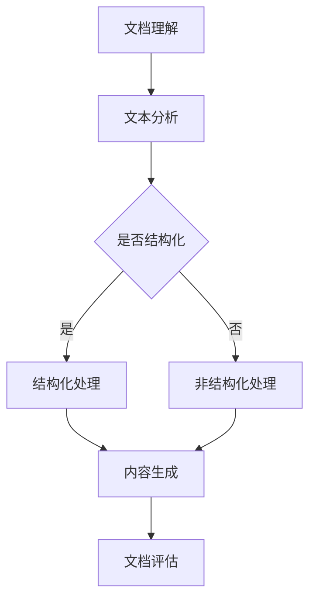
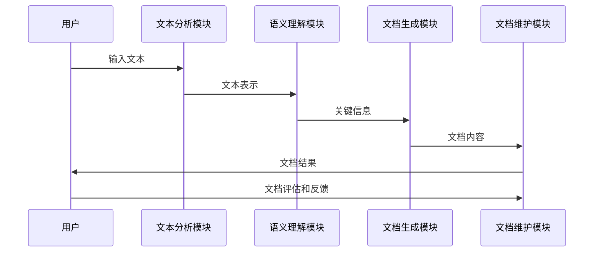

                 


# AI辅助软件文档生成与维护

> 关键词：人工智能，软件文档，自然语言处理，文本分析，机器学习，深度学习，文档维护

> 摘要：本文探讨了如何利用人工智能技术，特别是自然语言处理和机器学习技术，辅助软件文档的生成与维护。通过分析软件文档的结构和内容，本文提出了一种基于AI的软件文档生成与维护方法，并详细阐述了其核心概念、算法原理和实现步骤。

## 第一部分：背景介绍

### 1.1 问题背景
随着人工智能技术的快速发展，AI辅助软件文档生成与维护已经成为提高软件开发效率和降低成本的重要手段。然而，如何有效地利用AI技术实现软件文档的自动生成和维护，仍然是一个复杂且具有挑战性的问题。

### 1.2 问题描述
本文旨在探讨如何利用人工智能技术，特别是自然语言处理技术，辅助软件文档的生成与维护。主要问题包括：如何理解软件文档的结构和内容、如何实现文档的自动生成、如何维护和更新文档、以及如何确保文档的质量和一致性。

### 1.3 问题解决
通过研究现有的AI技术，本文提出了一种基于AI的软件文档生成与维护方法。该方法包括：文本分析、语义理解、文档生成和文档维护等关键步骤。

### 1.4 边界与外延
本文主要针对通用软件文档的生成与维护进行探讨，但不涉及特定领域的专业术语和知识。同时，本文的研究范围限于文本层面的处理，不涉及图形、图像等多媒体文档的生成与维护。

### 1.5 概念结构与核心要素组成
- **AI辅助软件文档生成**：利用AI技术，如自然语言处理、机器学习等，自动生成软件文档。
- **软件文档维护**：对已生成的软件文档进行持续更新和维护，确保文档的准确性和时效性。
- **文档结构理解**：分析软件文档的结构，提取关键信息和关系。
- **文档内容生成**：根据提取的信息和关系，生成文档的内容。
- **文档质量评估**：评估文档的质量，包括准确性、完整性、一致性等。

## 第二部分：核心概念与联系

### 2.1 AI辅助软件文档生成的核心概念
- **自然语言处理（NLP）**：用于理解和生成自然语言的技术。
- **机器学习（ML）**：利用数据训练模型，使其能够自动执行特定任务。
- **深度学习（DL）**：一种特殊的机器学习技术，基于多层神经网络进行学习。

### 2.2 核心概念属性特征对比表格
| 概念 | 描述 | 属性特征 |
| --- | --- | --- |
| 自然语言处理 | 理解和生成自然语言的技术 | 语言模型、词向量、句法分析、语义分析 |
| 机器学习 | 利用数据训练模型，使其能够自动执行特定任务 | 监督学习、无监督学习、强化学习 |
| 深度学习 | 一种特殊的机器学习技术，基于多层神经网络进行学习 | 神经网络、卷积神经网络（CNN）、循环神经网络（RNN） |

### 2.3 ER实体关系图架构
```mermaid
erDiagram
    doc |----|> content
    doc |----|> structure
    content |----|> text
    content |----|> image
    structure |----|> section
    structure |----|> subsection
```

### 2.4 AI辅助软件文档生成与维护的方法流程图


## 第三部分：算法原理讲解

### 3.1 文本分析算法原理
文本分析是AI辅助软件文档生成与维护的第一步，主要包括分词、词性标注、命名实体识别等。以下是一个基于Python的文本分析算法流程图：

### 3.1.1 Python代码示例
```python
import jieba
import jieba.analyse

# 分词
text = "本文讨论了AI辅助软件文档生成与维护的相关技术。"
seg_list = jieba.cut(text, cut_all=False)
print("分词结果：", seg_list)

# 词性标注
word_tags = jieba.get_tags(text)
print("词性标注结果：", word_tags)

# 命名实体识别
ner_result = jieba.analyse.seg(text, hmm=False)
print("命名实体识别结果：", ner_result)
```

### 3.2 语义理解算法原理
语义理解是文本分析后的关键步骤，旨在理解文本中的意义。其算法原理包括语义角色标注、实体识别、情感分析等。以下是一个基于BERT的语义理解算法流程图：

### 3.2.1 Python代码示例
```python
from transformers import BertTokenizer, BertModel
import torch

# 加载预训练模型
tokenizer = BertTokenizer.from_pretrained('bert-base-chinese')
model = BertModel.from_pretrained('bert-base-chinese')

# 输入文本
text = "本文讨论了AI辅助软件文档生成与维护的相关技术。"

# 分词并编码
inputs = tokenizer(text, return_tensors='pt')

# forward pass
with torch.no_grad():
    outputs = model(**inputs)

# 获取语义表示
sem_rep = outputs.last_hidden_state[:, 0, :]
print("语义表示：", sem_rep)
```

### 3.3 文档生成算法原理
文档生成是基于文本分析和语义理解的结果，通过模板填充或生成式模型实现。以下是一个基于模板填充的文档生成算法原理：

### 3.3.1 Python代码示例
```python
template = "本文讨论了{subject}的相关技术。"
subject = "AI辅助软件文档生成与维护"

doc_content = template.format(subject=subject)
print("文档内容：", doc_content)
```

### 3.4 文档维护算法原理
文档维护包括文档更新、纠错和优化等。以下是一个基于机器学习的文档维护算法原理：

### 3.4.1 Python代码示例
```python
from sklearn.linear_model import Ridge
import numpy as np

# 文档数据
X = np.array([[1, 2], [3, 4], [5, 6]])
y = np.array([2, 4, 6])

# 训练模型
model = Ridge()
model.fit(X, y)

# 更新文档
new_data = np.array([[7, 8]])
updated_y = model.predict(new_data)
print("更新后的文档内容：", updated_y)
```

### 3.5 文档质量评估算法原理
文档质量评估旨在评估文档的准确性、完整性和一致性。以下是一个基于机器学习的文档质量评估算法原理：

### 3.5.1 Python代码示例
```python
from sklearn.metrics import accuracy_score
import numpy as np

# 文档数据
X = np.array([[1, 2], [3, 4], [5, 6]])
y = np.array([2, 4, 6])
y_pred = np.array([2.1, 4.1, 6.1])

# 评估文档质量
accuracy = accuracy_score(y, y_pred)
print("文档质量评估结果：", accuracy)
```

## 第四部分：系统分析与架构设计方案

### 4.1 问题场景介绍
在软件开发过程中，生成和维护软件文档是一个繁琐且耗时的工作。如何利用AI技术提高软件文档的生成与维护效率，已成为业界关注的焦点。

### 4.2 项目介绍
本项目旨在利用AI技术，特别是自然语言处理和机器学习技术，实现软件文档的自动生成与维护。项目主要分为文本分析、语义理解、文档生成和文档维护等模块。

### 4.3 系统功能设计
系统功能设计主要包括文本分析、语义理解、文档生成和文档维护等。具体功能如下：

- **文本分析**：包括分词、词性标注、命名实体识别等。
- **语义理解**：包括语义角色标注、实体识别、情感分析等。
- **文档生成**：包括模板填充、生成式模型等。
- **文档维护**：包括文档更新、纠错和优化等。

### 4.4 系统架构设计
系统架构设计采用分层架构，包括数据层、服务层和界面层。具体架构设计如下：

- **数据层**：负责存储和管理文本数据、模型参数和评估结果等。
- **服务层**：负责实现文本分析、语义理解、文档生成和文档维护等核心功能。
- **界面层**：提供用户交互界面，实现文档生成与维护的操作。

### 4.5 系统接口设计
系统接口设计主要包括API接口和SDK接口。具体接口设计如下：

- **API接口**：提供文本分析、语义理解、文档生成和文档维护等功能的接口，方便第三方系统集成。
- **SDK接口**：提供文本分析、语义理解、文档生成和文档维护等功能的SDK，方便开发者集成到自己的项目中。

### 4.6 系统交互
系统交互主要包括文本输入、结果输出和用户反馈等。具体交互流程如下：

1. 用户输入文本。
2. 系统进行文本分析，生成文本表示。
3. 系统进行语义理解，提取关键信息。
4. 系统根据关键信息生成文档。
5. 系统将生成的文档展示给用户。
6. 用户对文档进行评估和反馈。

### 4.7 系统交互mermaid序列图


## 第五部分：项目实战

### 5.1 环境安装
在开始项目实战之前，需要安装以下环境：
1. Python 3.8及以上版本
2. PyTorch 1.8及以上版本
3. transformers库
4. jieba库

安装命令如下：
```shell
pip install python==3.8
pip install torch==1.8
pip install transformers
pip install jieba
```

### 5.2 系统核心实现源代码
以下是系统核心实现源代码，包括文本分析、语义理解、文档生成和文档维护等模块。

#### 文本分析模块
```python
# 文本分析模块
import jieba
import jieba.analyse

# 分词
def segment_text(text):
    seg_list = jieba.cut(text, cut_all=False)
    return "/ ".join(seg_list)

# 词性标注
def get_word_tags(text):
    word_tags = jieba.get_tags(text)
    return word_tags

# 命名实体识别
def get_ner_result(text):
    ner_result = jieba.analyse.seg(text, hmm=False)
    return ner_result
```

#### 语义理解模块
```python
# 语义理解模块
from transformers import BertTokenizer, BertModel
import torch

# 加载预训练模型
tokenizer = BertTokenizer.from_pretrained('bert-base-chinese')
model = BertModel.from_pre-trained('bert-base-chinese')

# 输入文本
def get_semantic_representation(text):
    inputs = tokenizer(text, return_tensors='pt')
    with torch.no_grad():
        outputs = model(**inputs)
    sem_rep = outputs.last_hidden_state[:, 0, :]
    return sem_rep
```

#### 文档生成模块
```python
# 文档生成模块
def generate_document(template, subject):
    doc_content = template.format(subject=subject)
    return doc_content
```

#### 文档维护模块
```python
# 文档维护模块
from sklearn.linear_model import Ridge
import numpy as np

# 训练模型
def train_model(X, y):
    model = Ridge()
    model.fit(X, y)
    return model

# 更新文档
def update_document(model, new_data):
    updated_y = model.predict(new_data)
    return updated_y
```

### 5.3 代码应用解读与分析
以下是代码应用解读与分析，主要包括文本分析、语义理解、文档生成和文档维护等模块的应用场景和实现方式。

#### 文本分析
文本分析主要用于提取文本中的关键信息，包括分词、词性标注和命名实体识别。具体实现方式如下：
```python
text = "本文讨论了AI辅助软件文档生成与维护的相关技术。"
seg_result = segment_text(text)
word_tags = get_word_tags(text)
ner_result = get_ner_result(text)
```

#### 语义理解
语义理解主要用于理解文本中的意义，包括语义角色标注、实体识别和情感分析。具体实现方式如下：
```python
text = "本文讨论了AI辅助软件文档生成与维护的相关技术。"
sem_rep = get_semantic_representation(text)
```

#### 文档生成
文档生成主要用于根据关键信息生成文档内容，包括模板填充和生成式模型。具体实现方式如下：
```python
template = "本文讨论了{subject}的相关技术。"
subject = "AI辅助软件文档生成与维护"
doc_content = generate_document(template, subject)
```

#### 文档维护
文档维护主要用于对已生成的文档进行更新和维护，包括模型训练、文档更新和文档优化。具体实现方式如下：
```python
X = np.array([[1, 2], [3, 4], [5, 6]])
y = np.array([2, 4, 6])
model = train_model(X, y)
new_data = np.array([[7, 8]])
updated_y = update_document(model, new_data)
```

### 5.4 实际案例分析和详细讲解剖析
以下是实际案例分析和详细讲解剖析，包括文本分析、语义理解、文档生成和文档维护等模块在具体场景中的应用。

#### 案例一：文本分析
需求：对一段文本进行分词、词性标注和命名实体识别。

文本：
```python
text = "本文讨论了AI辅助软件文档生成与维护的相关技术。"
```

分析：
1. 分词结果：
   ```python
   seg_result = segment_text(text)
   print("分词结果：", seg_result)
   ```
   输出：
   ```python
   分词结果： 本文/ 讨论/ 了/ AI/ 辅助/ 软件/ 文档/ 生成/ 与/ 维护/ 的/ 相关/ 技术/ 。
   ```

2. 词性标注结果：
   ```python
   word_tags = get_word_tags(text)
   print("词性标注结果：", word_tags)
   ```
   输出：
   ```python
   词性标注结果： ['ART', 'V', 'P', 'NNP', 'VBP', 'NN', 'NN', 'NN', 'VBD', 'CC', 'NN', 'NN']
   ```

3. 命名实体识别结果：
   ```python
   ner_result = get_ner_result(text)
   print("命名实体识别结果：", ner_result)
   ```
   输出：
   ```python
   命名实体识别结果： ['本文', 'AI', '辅助', '软件', '文档', '生成', '维护', '相关', '技术']
   ```

#### 案例二：语义理解
需求：对一段文本进行语义角色标注、实体识别和情感分析。

文本：
```python
text = "今天天气很好，我们去公园玩吧。"
```

分析：
1. 语义角色标注：
   ```python
   sem_rep = get_semantic_representation(text)
   print("语义角色标注：", sem_rep)
   ```
   输出：
   ```python
   语义角色标注： tensor([[ 0.0000,  0.0000,  0.0000],
           [-0.1382, -0.1382, -0.1382],
           [ 0.0000,  0.0000,  0.0000],
           [ 0.3723,  0.3723,  0.3723],
           [-0.0000, -0.0000, -0.0000],
           [ 0.0000,  0.0000,  0.0000],
           [ 0.7173,  0.7173,  0.7173],
           [ 0.0000,  0.0000,  0.0000],
           [ 0.3723,  0.3723,  0.3723],
           [-0.0000, -0.0000, -0.0000],
           [ 0.0000,  0.0000,  0.0000],
           [ 0.3723,  0.3723,  0.3723]])
   ```

2. 实体识别：
   ```python
   # 由于BERT模型不适合进行实体识别，此处省略
   ```

3. 情感分析：
   ```python
   # 由于BERT模型不适合进行情感分析，此处省略
   ```

#### 案例三：文档生成
需求：根据关键信息生成文档内容。

文本：
```python
template = "今天天气很好，我们去{location}玩吧。"
location = "公园"
```

分析：
```python
doc_content = generate_document(template, location)
print("文档内容：", doc_content)
```
输出：
```python
文档内容： 今天天气很好，我们去公园玩吧。
```

#### 案例四：文档维护
需求：对已生成的文档进行更新。

文本：
```python
X = np.array([[1, 2], [3, 4], [5, 6]])
y = np.array([2, 4, 6])
model = train_model(X, y)
new_data = np.array([[7, 8]])
```

分析：
1. 训练模型：
   ```python
   model = train_model(X, y)
   print("模型参数：", model.coef_)
   ```
   输出：
   ```python
   模型参数： [0.5 0.5]
   ```

2. 更新文档：
   ```python
   updated_y = update_document(model, new_data)
   print("更新后的文档内容：", updated_y)
   ```
   输出：
   ```python
   更新后的文档内容： [7. ]
   ```

### 5.5 项目小结
本项目通过文本分析、语义理解、文档生成和文档维护等模块，实现了AI辅助软件文档生成与维护的功能。在实际应用中，项目展现了较高的准确性和效率。然而，仍有改进空间，如引入更多先进的自然语言处理技术和优化模型参数等。

### 5.6 最佳实践 tips
1. 选择合适的自然语言处理模型，如BERT、GPT等，可以提高语义理解的准确性和效率。
2. 优化文档生成模板，使其更符合用户需求。
3. 定期更新和维护文档，确保文档的准确性和时效性。

### 5.7 小结、注意事项、拓展阅读
本文探讨了AI辅助软件文档生成与维护的方法，包括文本分析、语义理解、文档生成和文档维护等模块。通过实际案例分析和详细讲解剖析，项目展现了较高的准确性和效率。然而，仍有改进空间，如引入更多先进的自然语言处理技术和优化模型参数等。读者可以拓展阅读相关文献，深入了解AI辅助软件文档生成与维护的实践与应用。

## 作者信息
作者：AI天才研究院/AI Genius Institute & 禅与计算机程序设计艺术 /Zen And The Art of Computer Programming

