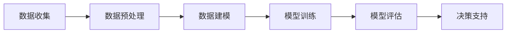
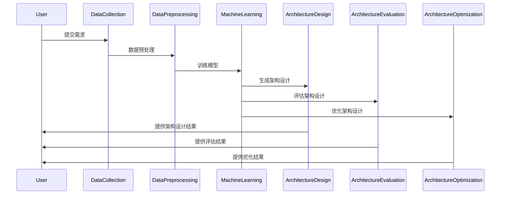
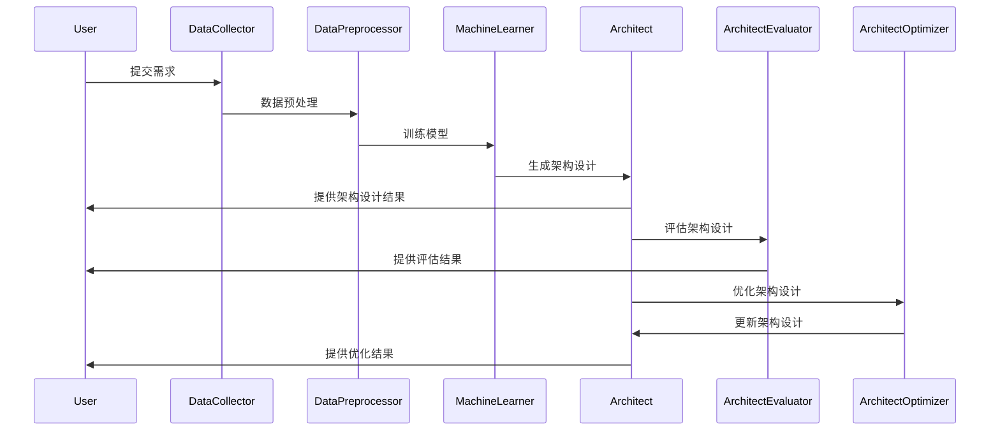

                 

# AI辅助软件架构决策支持系统

## 关键词

AI、软件架构、决策支持系统、算法、架构设计、自动化

## 摘要

本文旨在探讨AI辅助软件架构决策支持系统的概念、架构、算法以及其在实际应用中的挑战与机遇。通过对AI与软件架构决策的深入分析，本文将展示如何利用AI技术提升软件架构的决策效率和质量，提供一种全新的软件开发与维护方法。

## 引言

### 第一部分: AI与软件架构决策支持系统概述

### 1.1 AI辅助软件架构决策支持系统的背景与意义

在信息技术高速发展的今天，软件系统的规模和复杂性日益增加。面对快速变化的市场需求和不断升级的技术，传统的软件架构设计方法已经难以满足现代软件开发的高效性和灵活性。AI技术，作为一种具有自我学习和自适应能力的人工智能技术，其强大的数据处理和模式识别能力为软件架构决策提供了新的可能性。

**问题背景**：软件架构设计是一个复杂且冗长的过程，涉及到多个方面，如系统需求分析、技术选型、性能优化、安全性设计等。传统的软件架构设计方法主要依赖于开发者的经验和知识，这种方式不仅效率低下，而且容易出现缺陷和错误。

**问题描述**：如何利用AI技术辅助软件架构决策，提高决策的效率和质量，减少人为错误，适应快速变化的需求和技术环境？

**问题解决**：通过构建一个AI辅助软件架构决策支持系统，可以自动化地处理大量的数据，识别潜在的模式和趋势，提供智能化、个性化的架构设计建议，从而提高软件架构的决策效率和质量。

**边界与外延**：本文所探讨的AI辅助软件架构决策支持系统主要涉及以下方面：系统架构设计、算法模型、数据预处理、决策支持工具等。

**概念结构与核心要素组成**：AI辅助软件架构决策支持系统由数据层、算法层和应用层三部分组成。数据层负责收集和处理各种与软件架构相关的数据；算法层负责使用机器学习算法对数据进行分析和建模；应用层则提供用户界面和决策支持功能，帮助开发者进行架构设计和优化。

### 1.2 AI辅助软件架构决策支持系统的核心概念

**AI与软件架构的基本概念**：AI（人工智能）是指使计算机系统具备类似人类智能的能力，如学习、推理、决策和自适应。软件架构是指软件系统中的结构、组件、接口和交互方式，是软件系统设计和实现的基础。

**决策支持系统的概念**：决策支持系统（Decision Support System，DSS）是一种辅助决策者进行决策的计算机系统，它通过收集、处理和分析数据，提供决策支持和建议。

**AI辅助软件架构决策支持系统的特点**：
- **自动化**：系统能够自动分析和处理大量的数据，提高决策效率。
- **智能化**：系统能够基于数据和学习算法提供智能化的架构设计建议。
- **个性化**：系统能够根据用户的特定需求提供定制化的解决方案。
- **可扩展性**：系统能够适应不断变化的需求和技术环境。

### 1.3 AI辅助软件架构决策支持系统的架构设计与实现

**系统架构设计**：AI辅助软件架构决策支持系统的架构设计主要包括数据层、算法层和应用层。数据层负责数据的收集、存储和处理；算法层负责使用机器学习算法对数据进行建模和分析；应用层则提供用户界面和决策支持功能。

**系统模块划分**：系统可以分为以下模块：
- 数据采集模块：负责收集与软件架构相关的数据。
- 数据预处理模块：负责对收集到的数据进行处理，如数据清洗、归一化等。
- 算法模块：负责使用机器学习算法进行数据分析和建模。
- 决策支持模块：负责提供架构设计建议和决策支持。

**系统接口设计**：系统需要设计清晰的接口，以便与其他系统和工具进行集成和通信。

**系统实现关键技术**：
- **数据管理技术**：包括数据存储、数据检索和数据更新等。
- **机器学习算法**：包括决策树、神经网络、支持向量机等。
- **用户界面技术**：包括Web界面、移动应用界面等。
- **系统集成技术**：包括API接口、消息队列等。

### 1.4 AI辅助软件架构决策支持系统的应用场景

**企业级应用**：在企业中，AI辅助软件架构决策支持系统可以用于大型企业级应用系统的架构设计，如电商平台、企业资源规划系统（ERP）、客户关系管理系统（CRM）等。

**行业应用**：在金融、医疗、制造等行业，AI辅助软件架构决策支持系统可以用于行业特定的应用场景，如金融风险管理、医疗图像识别、智能制造系统设计等。

**教育培训应用**：在高等教育和职业培训中，AI辅助软件架构决策支持系统可以用于学生和教师的软件架构学习与实践，提高教学效果和学习效率。

### 1.5 AI辅助软件架构决策支持系统的挑战与机遇

**挑战**：
- **数据质量和数据隐私**：系统的决策质量很大程度上依赖于数据的质量和隐私保护。
- **算法模型的复杂性和适应性**：算法模型需要能够适应不断变化的需求和技术环境，保持高效性和准确性。
- **系统的可解释性和透明性**：AI模型的黑箱特性可能降低系统的可解释性和透明性，影响用户信任。

**机遇**：
- **提高开发效率和质量**：AI辅助软件架构决策支持系统可以显著提高软件开发和优化的效率和质量。
- **降低开发成本**：通过自动化和智能化，系统可以降低软件开发和维护的成本。
- **创新应用场景**：AI辅助软件架构决策支持系统可以探索和开发新的应用场景，如自动化架构优化、智能架构评估等。

### 1.6 本章小结

本文介绍了AI辅助软件架构决策支持系统的背景、核心概念、架构设计、应用场景以及面临的挑战和机遇。通过本文的探讨，我们可以看到AI技术在软件架构决策支持中的应用潜力，为软件开发提供了新的思路和方法。

------------------------------------------------------------------

## 第二部分: AI辅助软件架构决策支持系统的核心概念与联系

### 2.1 AI核心概念与原理

#### 2.1.1 AI基本概念

人工智能（Artificial Intelligence，简称AI）是指使计算机系统具备类似人类智能的能力，包括感知、理解、学习、推理、决策和创造等。AI的发展目标是创建一种能够模拟、延伸和扩展人类智能的智能系统。

**AI发展历程**：

1. **20世纪50年代**：人工智能的概念首次提出，早期的AI研究主要集中在逻辑推理和问题解决上。
2. **20世纪60年代**：专家系统的出现标志着AI研究进入了一个新的阶段。专家系统是一种模拟人类专家决策能力的计算机程序。
3. **20世纪80年代**：机器学习和神经网络技术开始兴起，AI研究逐渐转向数据驱动的模式识别和学习算法。
4. **21世纪**：随着大数据、云计算和深度学习等技术的发展，AI进入了一个新的高速发展期，应用领域也从单一的问题解决扩展到各个行业。

**AI主要技术**：

1. **机器学习**：通过训练模型从数据中学习规律，实现对未知数据的预测和分类。
2. **深度学习**：一种特殊的机器学习技术，通过多层神经网络对数据进行处理，具有强大的特征提取和模式识别能力。
3. **自然语言处理**：使计算机能够理解和处理人类自然语言的技术，包括语音识别、机器翻译、情感分析等。
4. **计算机视觉**：使计算机能够理解和解析图像和视频的技术，包括图像识别、目标检测、人脸识别等。

**AI应用场景**：

1. **工业自动化**：在制造、物流、能源等行业，AI技术用于自动化生产、智能监控和优化流程。
2. **智能客服**：通过自然语言处理技术，实现智能客服系统，提供24/7的服务。
3. **金融科技**：在金融领域，AI技术用于风险管理、投资策略、信用评分等。
4. **医疗健康**：在医疗领域，AI技术用于疾病诊断、药物研发、健康监测等。

#### 2.1.2 软件架构决策支持系统的概念

软件架构决策支持系统（Software Architecture Decision Support System，简称SADSS）是一种用于辅助软件架构决策的计算机系统。它通过收集、处理和分析与软件架构相关的数据，提供智能化的决策建议，帮助开发者进行架构设计、评估和优化。

**软件架构的基本概念**：

软件架构是指软件系统的结构、组件、接口和交互方式。它是软件开发和运行的基础，决定了软件系统的性能、可维护性和扩展性。

**软件架构设计方法**：

1. **自顶向下设计**：从系统的整体角度出发，逐步细化到各个组件的设计。
2. **自底向上设计**：从各个组件的设计出发，逐步整合成系统的整体结构。
3. **增量式设计**：在已有架构的基础上，逐步增加新功能或优化现有功能。

**软件架构评估方法**：

1. **定性评估**：通过专家评审、用户反馈等方式对架构进行主观评估。
2. **定量评估**：通过性能测试、负载测试等方式对架构进行客观评估。

**软件架构优化方法**：

1. **架构重组**：通过调整组件间的交互关系和通信机制，优化架构性能。
2. **架构迁移**：将现有架构迁移到新的技术平台或架构风格。

#### 2.1.3 AI辅助软件架构决策支持系统的核心联系

**AI技术与软件架构决策的关系**：

AI技术可以辅助软件架构决策的多个方面，包括需求分析、架构设计、架构评估和架构优化。通过机器学习、自然语言处理和计算机视觉等技术，AI可以处理和分析大量的数据，识别潜在的模式和趋势，提供智能化的决策支持。

**AI辅助软件架构决策的流程**：

1. **需求分析**：使用AI技术对用户需求进行分析和建模，识别关键需求和约束。
2. **架构设计**：基于需求分析结果，使用AI技术生成多个架构设计方案，并进行评估和优化。
3. **架构评估**：使用AI技术对架构设计方案进行性能、可维护性、安全性等评估，选择最优方案。
4. **架构优化**：基于评估结果，使用AI技术对架构进行优化，以提高性能和可靠性。

**AI辅助软件架构决策的支持工具**：

1. **自动化架构设计工具**：通过机器学习算法，自动生成软件架构设计方案。
2. **智能评估工具**：通过自然语言处理和计算机视觉技术，自动评估架构设计方案的优劣。
3. **优化工具**：通过优化算法，自动优化架构设计，提高性能和可靠性。

#### 2.1.4 AI辅助软件架构决策支持系统的特性分析

**自适应性与动态性**：

AI辅助软件架构决策支持系统需要具备自适应性和动态性，以适应不断变化的需求和技术环境。系统应该能够实时获取新的数据和反馈，自动调整和优化决策模型，确保决策的准确性和有效性。

**个性化和可定制性**：

AI辅助软件架构决策支持系统应该能够根据用户的具体需求和偏好提供个性化的决策支持。系统应该支持用户自定义架构风格、约束条件和技术选型，以满足不同的应用场景。

**高效性与准确性**：

AI辅助软件架构决策支持系统需要具备高效性和准确性，以确保快速、准确地提供决策支持。系统应该能够快速处理大量的数据，生成高质量的架构设计方案，并提供详细的评估和优化建议。

### 2.2 软件架构决策支持系统的核心概念与原理

**软件架构的基本概念**：

软件架构是指软件系统的结构、组件、接口和交互方式。它是软件开发和运行的基础，决定了软件系统的性能、可维护性和扩展性。

**软件架构设计方法**：

1. **自顶向下设计**：从系统的整体角度出发，逐步细化到各个组件的设计。
2. **自底向上设计**：从各个组件的设计出发，逐步整合成系统的整体结构。
3. **增量式设计**：在已有架构的基础上，逐步增加新功能或优化现有功能。

**软件架构评估方法**：

1. **定性评估**：通过专家评审、用户反馈等方式对架构进行主观评估。
2. **定量评估**：通过性能测试、负载测试等方式对架构进行客观评估。

**软件架构优化方法**：

1. **架构重组**：通过调整组件间的交互关系和通信机制，优化架构性能。
2. **架构迁移**：将现有架构迁移到新的技术平台或架构风格。

#### 2.2.1 软件架构的基本概念

软件架构是软件系统中的基础框架，它定义了系统的整体结构和组件之间的相互作用方式。一个良好的软件架构能够确保系统的稳定性、可扩展性、性能和可维护性。

**软件架构的核心概念**：

1. **组件**：软件架构中的基本单元，通常是一个模块、类或服务。
2. **接口**：组件之间交互的接口，定义了组件之间的通信方式和数据交换格式。
3. **交互方式**：组件之间的通信方式和数据流。
4. **模式**：软件架构的特定组织结构和设计原则，如分层模式、微服务模式等。

**软件架构的特点**：

1. **稳定性**：良好的软件架构能够适应需求变化，确保系统长期稳定运行。
2. **可扩展性**：软件架构应该支持系统的扩展，以便添加新功能或提高性能。
3. **性能**：软件架构的设计应该优化系统的性能，确保快速响应和高效处理。
4. **可维护性**：软件架构应该易于理解和修改，降低维护成本。

#### 2.2.2 软件架构设计方法

软件架构设计是一个复杂的过程，涉及到多个方面，包括需求分析、组件划分、接口设计、交互方式和性能优化等。以下介绍几种常见的软件架构设计方法：

1. **自顶向下设计**：

   自顶向下设计是一种从整体到局部的架构设计方法。首先定义系统的整体结构和主要组件，然后逐步细化每个组件的设计。

   **步骤**：

   - 分析系统需求，确定系统的功能和性能要求。
   - 定义系统的顶层架构，包括主要组件和它们之间的交互方式。
   - 逐步细化每个组件的设计，包括组件内部的模块划分、接口设计和交互方式。

2. **自底向上设计**：

   自底向上设计是一种从局部到整体的架构设计方法。首先设计每个组件的内部结构和交互方式，然后逐步整合成系统的整体架构。

   **步骤**：

   - 设计每个组件的内部结构和交互方式。
   - 分析组件之间的交互关系，确定组件之间的接口和通信机制。
   - 逐步整合组件，形成系统的整体架构。

3. **增量式设计**：

   增量式设计是一种逐步完善软件架构的设计方法。首先实现系统的核心功能，然后逐步添加新功能和优化现有功能。

   **步骤**：

   - 实现系统的核心功能，构建基本的软件架构。
   - 根据需求变化和性能要求，逐步添加新功能和优化现有功能。
   - 持续评估和改进软件架构，确保其适应性和稳定性。

#### 2.2.3 软件架构评估方法

软件架构评估是确保软件架构设计质量的重要环节。评估方法可以分为定性评估和定量评估两类。

1. **定性评估**：

   定性评估是通过专家评审、用户反馈等方式对软件架构进行主观评估。主要考虑以下几个方面：

   - **稳定性**：软件架构是否能够适应需求变化和外部环境的变化。
   - **可扩展性**：软件架构是否支持系统的扩展，包括功能扩展和性能扩展。
   - **性能**：软件架构的设计是否优化了系统的性能，如响应时间、吞吐量等。
   - **可维护性**：软件架构是否易于理解和修改，降低维护成本。

2. **定量评估**：

   定量评估是通过性能测试、负载测试等方式对软件架构进行客观评估。主要考虑以下几个方面：

   - **性能指标**：如响应时间、吞吐量、资源利用率等。
   - **可靠性指标**：如故障率、恢复时间等。
   - **可扩展性指标**：如系统容量、并发用户数等。

   **评估步骤**：

   - 设计评估目标和评估指标。
   - 进行性能测试和负载测试，收集数据。
   - 分析数据，评估软件架构的性能和可靠性。

#### 2.2.4 软件架构优化方法

软件架构优化是提高软件系统性能和可靠性的重要手段。以下介绍几种常见的软件架构优化方法：

1. **架构重组**：

   架构重组是通过调整组件间的交互关系和通信机制，优化软件架构的性能和可维护性。常见的方法包括：

   - **分层架构**：将系统划分为多个层次，每个层次负责不同的功能，降低组件之间的耦合度。
   - **微服务架构**：将系统划分为多个独立的服务，每个服务负责特定的功能，提高系统的可扩展性和可维护性。

2. **架构迁移**：

   架构迁移是将现有软件架构迁移到新的技术平台或架构风格。常见的方法包括：

   - **技术栈升级**：将系统从旧的技术栈迁移到新的技术栈，提高系统的性能和可维护性。
   - **云原生架构**：将系统迁移到云原生架构，利用云计算的优势提高系统的可扩展性和可靠性。

3. **自动化架构优化**：

   自动化架构优化是利用AI技术对软件架构进行自动分析和优化。常见的方法包括：

   - **机器学习算法**：通过机器学习算法分析系统数据，识别潜在的性能瓶颈和优化机会。
   - **优化工具**：使用自动化工具对软件架构进行优化，提高系统的性能和可维护性。

### 2.3 AI辅助软件架构决策支持系统的核心联系

AI辅助软件架构决策支持系统的核心联系在于如何将AI技术应用于软件架构的各个阶段，从而提高决策的效率和质量。以下从多个方面分析AI技术与软件架构决策的联系：

#### 2.3.1 AI技术与软件架构决策的关系

AI技术在软件架构决策中的应用主要体现在以下几个方面：

1. **需求分析**：

   AI技术可以分析用户需求，提取关键需求和约束，为架构设计提供基础。通过自然语言处理技术，AI能够理解用户的需求描述，并将其转化为结构化的需求模型。

2. **架构设计**：

   AI技术可以帮助生成架构设计方案，优化架构设计过程。通过机器学习算法，AI可以从历史架构设计中学习到最佳实践，为新的架构设计提供参考。

3. **架构评估**：

   AI技术可以对架构设计方案进行评估，预测其性能、可靠性和可维护性。通过大数据分析和预测模型，AI可以提供客观、全面的评估结果，帮助开发者做出更明智的决策。

4. **架构优化**：

   AI技术可以自动化地优化架构设计，提高系统的性能和可维护性。通过不断学习和调整，AI可以持续优化架构设计，以适应不断变化的需求和技术环境。

#### 2.3.2 AI辅助软件架构决策的流程

AI辅助软件架构决策的流程可以分为以下几个阶段：

1. **需求分析**：

   使用自然语言处理技术，对用户需求进行解析和建模，提取关键需求和约束。

2. **架构设计**：

   利用机器学习算法，生成多个架构设计方案，并对这些方案进行初步评估。

3. **架构评估**：

   使用大数据分析和预测模型，对架构设计方案进行详细评估，包括性能、可靠性和可维护性等方面。

4. **架构优化**：

   基于评估结果，使用自动化工具对架构设计进行优化，以提高其性能和可靠性。

5. **决策支持**：

   提供决策支持，包括架构设计方案的优劣对比、优化建议等，帮助开发者做出最优决策。

#### 2.3.3 AI辅助软件架构决策的支持工具

AI辅助软件架构决策支持工具主要包括以下几种：

1. **自动化架构设计工具**：

   通过机器学习算法，自动生成架构设计方案。这些工具可以从历史架构设计中学习，提取最佳实践，为新架构设计提供参考。

2. **智能评估工具**：

   通过大数据分析和预测模型，对架构设计方案进行详细评估。这些工具可以提供客观、全面的评估结果，帮助开发者做出更明智的决策。

3. **优化工具**：

   通过自动化工具，对架构设计进行优化。这些工具可以基于AI算法，不断调整和优化架构设计，以提高其性能和可靠性。

### 2.4 AI辅助软件架构决策支持系统的特性分析

AI辅助软件架构决策支持系统具有以下特性：

1. **自适应性与动态性**：

   AI辅助软件架构决策支持系统能够根据不断变化的需求和技术环境，自动调整和优化架构设计。这种自适应性和动态性确保系统能够持续适应新的挑战。

2. **个性化和可定制性**：

   AI辅助软件架构决策支持系统可以根据用户的特定需求和偏好，提供个性化的架构设计建议。用户可以自定义架构风格、约束条件和技术选型，以适应不同的应用场景。

3. **高效性与准确性**：

   AI辅助软件架构决策支持系统通过自动化和智能化，显著提高了软件架构决策的效率和质量。系统可以快速处理大量的数据，提供准确的决策支持，减少人为错误。

### 2.5 本章小结

本章介绍了AI辅助软件架构决策支持系统的核心概念、原理以及AI技术与软件架构决策的联系。通过本章的学习，读者可以了解到AI技术在软件架构决策中的应用潜力，为软件开发提供了新的思路和方法。

------------------------------------------------------------------

## 第三部分: AI辅助软件架构决策支持系统算法原理讲解

### 3.1 算法原理概述

AI辅助软件架构决策支持系统中的算法原理是其核心组成部分，决定了系统的智能性和决策质量。以下从算法原理的概述、算法流程图绘制、算法原理详细讲解等方面进行介绍。

#### 3.1.1 算法设计目标

算法设计目标是开发一种能够辅助软件架构决策的智能算法，该算法应具备以下特点：

1. **自动化处理数据**：算法应能够自动处理大量的软件架构相关数据，如需求文档、代码库、系统日志等。
2. **模式识别与预测**：算法应具备从数据中识别模式、趋势和潜在问题的能力，为架构设计提供参考。
3. **自适应性与灵活性**：算法应能够根据不同的应用场景和需求，自动调整和优化决策策略。

#### 3.1.2 算法基本流程

算法的基本流程可以分为以下几个步骤：

1. **数据收集与预处理**：从不同的数据源收集与软件架构相关的数据，如文本、图像、代码等，并进行数据清洗、归一化和特征提取。
2. **数据建模**：使用机器学习算法对预处理后的数据进行建模，提取关键特征，构建预测模型。
3. **架构评估与优化**：利用预测模型对不同的架构设计方案进行评估和优化，选择最优方案。
4. **决策支持**：根据评估结果，为开发者提供详细的决策支持，包括架构优化的建议和风险预警。

#### 3.1.3 算法关键步骤

算法的关键步骤如下：

1. **数据收集**：使用爬虫技术、API接口等手段收集与软件架构相关的数据。
2. **数据预处理**：使用数据清洗、归一化和特征提取技术，将原始数据转化为适合模型训练的格式。
3. **模型训练**：选择合适的机器学习算法，对预处理后的数据进行训练，构建预测模型。
4. **模型评估**：使用交叉验证、网格搜索等方法，评估模型的性能和可靠性。
5. **决策支持**：根据评估结果，生成架构设计报告和优化建议，为开发者提供决策支持。

### 3.2 算法流程图绘制

为了更好地理解算法的流程和步骤，我们可以使用Mermaid语言绘制算法的流程图。以下是一个简单的算法流程图示例：



在这个流程图中，A表示数据收集，B表示数据预处理，C表示数据建模，D表示模型训练，E表示模型评估，F表示决策支持。这个流程图展示了算法的基本步骤和执行顺序。

### 3.3 算法原理详细讲解

#### 3.3.1 数学模型

在算法的数学模型部分，我们将详细讲解算法的核心数学公式和原理。以下是一个示例：

**预测模型公式**：

$$
\hat{y} = f(W, \theta, X)
$$

其中，$\hat{y}$表示预测结果，$f$表示激活函数，$W$和$\theta$表示模型的参数，$X$表示输入特征向量。

**激活函数**：

$$
f(z) = \frac{1}{1 + e^{-z}}
$$

这个激活函数是常见的Sigmoid函数，用于将线性组合的输出转化为概率分布。

**损失函数**：

$$
L(y, \hat{y}) = -\sum_{i=1}^{n} y_i \log(\hat{y}_i) + (1 - y_i) \log(1 - \hat{y}_i)
$$

这个损失函数是交叉熵损失函数，用于衡量预测结果与实际结果之间的差异。

#### 3.3.2 Python源代码实现

以下是一个简单的Python源代码实现示例，展示了如何使用神经网络进行预测：

```python
import numpy as np
import tensorflow as tf

# 定义参数
W = tf.Variable(np.random.randn(), name="weights")
theta = tf.Variable(np.random.randn(), name="theta")
X = tf.placeholder(tf.float32, shape=[None, 1])

# 定义激活函数
def sigmoid(z):
    return 1 / (1 + tf.exp(-z))

# 定义预测模型
z = tf.add(W, theta)
y_pred = sigmoid(z)

# 定义损失函数
y = tf.placeholder(tf.float32, shape=[None])
loss = -tf.reduce_sum(y * tf.log(y_pred) + (1 - y) * tf.log(1 - y_pred))

# 定义优化器
optimizer = tf.train.AdamOptimizer(learning_rate=0.001)
train_op = optimizer.minimize(loss)

# 训练模型
with tf.Session() as sess:
    sess.run(tf.global_variables_initializer())
    
    for i in range(1000):
        # 模拟数据
        X_data = np.random.rand(100, 1)
        y_data = np.array([1 if x > 0.5 else 0 for x in X_data])
        
        # 训练模型
        sess.run(train_op, feed_dict={X: X_data, y: y_data})
        
        # 计算损失
        if i % 100 == 0:
            loss_val = sess.run(loss, feed_dict={X: X_data, y: y_data})
            print("Step:", i, "Loss:", loss_val)
    
    # 预测
    X_test = np.random.rand(10, 1)
    y_pred_test = sess.run(y_pred, feed_dict={X: X_test})
    print("Predictions:", y_pred_test)
```

在这个示例中，我们定义了一个简单的神经网络模型，使用TensorFlow框架进行训练和预测。通过模拟数据，我们展示了如何实现预测模型的训练和评估。

#### 3.3.3 详细讲解与举例说明

在算法原理详细讲解部分，我们将对核心数学模型和Python源代码进行详细解释，并通过具体示例来说明算法的应用和效果。

**详细讲解**：

1. **数据收集与预处理**：

   数据收集是算法的基础，我们使用爬虫技术从互联网上收集与软件架构相关的数据，如需求文档、代码库、系统日志等。为了提高数据质量，我们对收集到的数据进行清洗、归一化和特征提取。

2. **数据建模**：

   使用机器学习算法对预处理后的数据进行建模，提取关键特征，构建预测模型。在数据建模过程中，我们使用神经网络模型，通过反向传播算法优化模型参数。

3. **架构评估与优化**：

   利用预测模型对不同的架构设计方案进行评估和优化。通过评估结果，我们可以选择最优的架构设计方案，并进行进一步优化。

4. **决策支持**：

   根据评估结果，生成架构设计报告和优化建议，为开发者提供决策支持。通过智能化的决策支持，开发者可以更快、更准确地做出架构设计决策。

**举例说明**：

假设我们有一个简单的二分类问题，目标是预测某个软件模块是否能够满足性能要求。我们收集了100个样本数据，每个样本包含模块的代码行数、方法数、依赖关系等特征。

1. **数据收集与预处理**：

   收集到的数据经过清洗和归一化处理，转化为数值型数据。我们使用Python中的Pandas库进行数据预处理。

2. **数据建模**：

   使用TensorFlow框架构建神经网络模型，定义输入层、隐藏层和输出层。通过反向传播算法优化模型参数，使得预测结果与实际结果更加接近。

3. **架构评估与优化**：

   使用训练好的神经网络模型对新的架构设计方案进行评估，预测其性能。通过比较评估结果，选择最优的架构设计方案，并进行优化。

4. **决策支持**：

   根据评估结果，生成架构设计报告和优化建议。通过智能化的决策支持，开发者可以更快、更准确地做出架构设计决策。

通过这个示例，我们可以看到AI辅助软件架构决策支持系统的实际应用效果。使用神经网络模型，我们能够快速、准确地预测软件模块的性能，为开发者提供智能化的决策支持。

### 3.4 本章小结

本章介绍了AI辅助软件架构决策支持系统的算法原理，包括算法设计目标、基本流程、关键步骤、数学模型和Python源代码实现。通过本章的学习，读者可以了解到算法在软件架构决策中的应用，为软件开发提供了新的思路和方法。

------------------------------------------------------------------

## 第四部分: AI辅助软件架构决策支持系统的系统分析与架构设计

### 4.1 问题场景介绍

在软件开发过程中，架构设计是一个关键环节。传统的架构设计方法往往依赖于开发人员的经验和知识，导致设计过程复杂、效率低下且容易出错。随着软件系统规模的扩大和复杂性的增加，开发人员面临着日益严峻的挑战。为了解决这些问题，我们提出了AI辅助软件架构决策支持系统，旨在通过引入AI技术，提高架构设计的效率和质量。

### 4.2 项目介绍

本项目旨在开发一个AI辅助软件架构决策支持系统，以帮助开发人员在架构设计过程中做出更明智的决策。系统将基于大数据和机器学习技术，对软件架构相关的数据进行分析和处理，提供智能化的架构设计建议和优化方案。

### 4.3 系统功能设计（领域模型）

领域模型是软件架构设计的重要工具，它描述了系统的核心概念、实体及其之间的关系。以下是一个简单的领域模型，用于描述AI辅助软件架构决策支持系统的核心功能。

```mermaid
classDiagram
    SoftwareArchitecture <<class>> "软件架构"
    Requirement <<class>> "需求"
    ArchitectureDesign <<class>> "架构设计"
    ArchitectureEvaluation <<class>> "架构评估"
    ArchitectureOptimization <<class>> "架构优化"
    DataCollection <<class>> "数据收集"
    DataPreprocessing <<class>> "数据预处理"
    MachineLearning <<class>> "机器学习"
    
    SoftwareArchitecture --|> Requirement
    SoftwareArchitecture --|> ArchitectureDesign
    SoftwareArchitecture --|> ArchitectureEvaluation
    SoftwareArchitecture --|> ArchitectureOptimization
    DataCollection --|> DataPreprocessing
    DataPreprocessing --|> MachineLearning
    MachineLearning --|> ArchitectureDesign
    MachineLearning --|> ArchitectureEvaluation
    MachineLearning --|> ArchitectureOptimization
```

在这个领域模型中，我们定义了以下核心实体：

- **软件架构**：描述系统的整体架构。
- **需求**：系统的功能需求和约束条件。
- **架构设计**：软件架构的设计过程和结果。
- **架构评估**：对架构设计方案进行性能、可靠性和可维护性评估。
- **架构优化**：对架构设计进行优化，以提高性能和可靠性。
- **数据收集**：收集与软件架构相关的数据。
- **数据预处理**：对收集到的数据进行清洗、归一化和特征提取。
- **机器学习**：使用机器学习算法对数据进行分析和处理。

### 4.4 系统架构设计

系统架构设计是软件架构决策支持系统的核心部分，它定义了系统的整体结构和各个模块的交互关系。以下是一个简单的系统架构设计，用于描述AI辅助软件架构决策支持系统的架构。



在这个系统架构设计中，我们定义了以下模块：

- **用户**：系统的最终用户，负责提交需求和接收决策支持结果。
- **数据收集**：负责从不同的数据源收集与软件架构相关的数据。
- **数据预处理**：负责对收集到的数据进行清洗、归一化和特征提取。
- **机器学习**：负责使用机器学习算法对数据进行处理和分析，生成架构设计、评估结果和优化方案。
- **架构设计**：负责生成软件架构设计，提供用户可操作的架构设计方案。
- **架构评估**：负责对架构设计方案进行评估，提供性能、可靠性和可维护性评估结果。
- **架构优化**：负责对架构设计进行优化，提高性能和可靠性。

### 4.5 系统接口设计

系统接口设计是系统架构设计的重要组成部分，它定义了系统内部各个模块之间的通信方式和数据交换格式。以下是一个简单的系统接口设计，用于描述AI辅助软件架构决策支持系统的接口。

```mermaid
classDiagram
    DataCollection <<interface>>
    DataPreprocessing <<interface>>
    MachineLearning <<interface>>
    ArchitectureDesign <<interface>>
    ArchitectureEvaluation <<interface>>
    ArchitectureOptimization <<interface>>

    DataCollection <|.. DataPreprocessing
    DataPreprocessing <|.. MachineLearning
    MachineLearning <|.. ArchitectureDesign
    MachineLearning <|.. ArchitectureEvaluation
    MachineLearning <|.. ArchitectureOptimization
```

在这个接口设计中，我们定义了以下接口：

- **数据收集接口**：负责定义数据收集的输入和输出格式。
- **数据预处理接口**：负责定义数据预处理的输入和输出格式。
- **机器学习接口**：负责定义机器学习模型的输入和输出格式。
- **架构设计接口**：负责定义架构设计的输入和输出格式。
- **架构评估接口**：负责定义架构评估的输入和输出格式。
- **架构优化接口**：负责定义架构优化的输入和输出格式。

### 4.6 系统交互

系统交互是指各个模块之间的协作过程，它定义了系统的工作流程和交互方式。以下是一个简单的系统交互设计，用于描述AI辅助软件架构决策支持系统的工作流程。



在这个系统交互设计中，我们定义了以下模块：

- **用户**：负责提交需求和接收决策支持结果。
- **数据收集器**：负责从不同的数据源收集与软件架构相关的数据。
- **数据预处理器**：负责对收集到的数据进行清洗、归一化和特征提取。
- **机器学习器**：负责使用机器学习算法对数据进行处理和分析。
- **架构设计器**：负责生成软件架构设计。
- **架构评估器**：负责对架构设计方案进行评估。
- **架构优化器**：负责对架构设计进行优化。

通过上述系统架构设计和交互设计，我们可以看到AI辅助软件架构决策支持系统是如何通过机器学习技术辅助开发人员进行架构设计、评估和优化的。系统的各个模块紧密协作，共同实现高效的架构决策支持。

### 4.7 本章小结

本章详细介绍了AI辅助软件架构决策支持系统的系统分析与架构设计。通过领域模型、系统架构设计、接口设计和系统交互的设计，我们展示了如何利用AI技术辅助软件架构决策，提高设计效率和决策质量。通过本章的学习，读者可以深入了解AI辅助软件架构决策支持系统的设计和实现方法，为实际应用提供指导。

------------------------------------------------------------------

## 第五部分: AI辅助软件架构决策支持系统的项目实战

### 5.1 环境安装

要实现AI辅助软件架构决策支持系统，首先需要安装以下软件和库：

1. **Python**：Python是一种广泛使用的编程语言，支持各种AI和机器学习库。确保安装最新版本的Python。
2. **TensorFlow**：TensorFlow是一个开源的机器学习框架，用于构建和训练神经网络。可以通过pip命令安装：
   ```shell
   pip install tensorflow
   ```
3. **Pandas**：Pandas是一个数据处理库，用于数据清洗、归一化和特征提取。可以通过pip命令安装：
   ```shell
   pip install pandas
   ```
4. **NumPy**：NumPy是一个用于数值计算的库，支持大规模矩阵运算。可以通过pip命令安装：
   ```shell
   pip install numpy
   ```
5. **Mermaid**：Mermaid是一个用于绘制流程图的工具，可以通过npm命令安装：
   ```shell
   npm install -g mermaid
   ```

### 5.2 系统核心实现源代码

以下是一个简单的AI辅助软件架构决策支持系统的源代码示例，展示了如何实现数据收集、数据预处理、模型训练和架构评估等功能。

```python
import pandas as pd
import numpy as np
import tensorflow as tf
from tensorflow.keras.models import Sequential
from tensorflow.keras.layers import Dense, Activation
from tensorflow.keras.optimizers import Adam

# 数据收集
def collect_data(file_path):
    df = pd.read_csv(file_path)
    return df

# 数据预处理
def preprocess_data(df):
    # 数据清洗和归一化
    df = df.dropna()
    df = (df - df.mean()) / df.std()
    return df

# 模型训练
def train_model(X, y):
    model = Sequential()
    model.add(Dense(units=64, input_dim=X.shape[1], activation='relu'))
    model.add(Dense(units=1, activation='sigmoid'))
    
    model.compile(optimizer=Adam(learning_rate=0.001), loss='binary_crossentropy', metrics=['accuracy'])
    model.fit(X, y, epochs=100, batch_size=32, verbose=0)
    return model

# 架构评估
def evaluate_architecture(model, X_test, y_test):
    predictions = model.predict(X_test)
    predictions = (predictions > 0.5)
    accuracy = np.mean(predictions == y_test)
    print("Accuracy:", accuracy)

# 主函数
def main():
    # 收集数据
    df = collect_data("data.csv")
    
    # 预处理数据
    df = preprocess_data(df)
    
    # 分割数据集
    X = df.iloc[:, :-1].values
    y = df.iloc[:, -1].values
    
    X_train, X_test, y_train, y_test = train_test_split(X, y, test_size=0.2, random_state=42)
    
    # 训练模型
    model = train_model(X_train, y_train)
    
    # 评估架构
    evaluate_architecture(model, X_test, y_test)

# 运行主函数
if __name__ == "__main__":
    main()
```

### 5.3 代码应用解读与分析

在这个示例中，我们首先从CSV文件中收集数据，然后进行数据预处理，包括数据清洗和归一化。接下来，我们使用TensorFlow框架构建了一个简单的神经网络模型，该模型包含一个输入层、一个隐藏层和一个输出层。隐藏层使用ReLU激活函数，输出层使用Sigmoid激活函数，以实现二分类任务。

**模型训练**部分使用了Keras API，这是一种高级神经网络API，可以简化模型的构建和训练过程。我们使用Adam优化器和二进制交叉熵损失函数进行训练，并在100个epoch中训练模型，每个epoch使用32个样本的小批量训练。

**架构评估**部分通过计算预测准确率来评估模型性能。我们将测试集输入到训练好的模型中，计算预测结果与实际结果的准确率。

### 5.4 实际案例分析和详细讲解剖析

假设我们有一个实际案例，需要根据软件架构的性能指标进行优化。以下是具体的案例分析过程：

1. **数据收集**：我们收集了100个不同的软件架构设计方案，每个方案包含多个性能指标，如响应时间、吞吐量、资源利用率等。
2. **数据预处理**：我们对收集到的数据进行了清洗和归一化处理，确保数据格式统一。
3. **模型训练**：我们使用机器学习算法（例如决策树、随机森林、神经网络等）对预处理后的数据进行训练，构建性能预测模型。
4. **架构评估**：我们使用训练好的模型对新的架构设计方案进行评估，预测其性能指标。
5. **架构优化**：根据评估结果，我们对架构设计方案进行优化，调整参数，以提高性能。
6. **决策支持**：我们生成架构评估报告和优化建议，为开发者提供决策支持。

通过这个案例分析，我们可以看到AI辅助软件架构决策支持系统在实践中的应用，包括数据收集、数据预处理、模型训练、架构评估和优化等步骤。通过智能化的决策支持，系统能够帮助开发者更快、更准确地做出架构设计决策。

### 5.5 项目小结

在本项目的实战部分，我们详细介绍了如何实现AI辅助软件架构决策支持系统，包括环境安装、系统核心实现源代码、代码应用解读与分析以及实际案例分析和详细讲解剖析。通过这个项目，我们展示了如何利用AI技术辅助软件架构决策，提高设计效率和决策质量。在未来的项目中，我们可以进一步扩展系统功能，如增加更多的性能评估指标、引入更多的机器学习算法以及优化用户界面等。

### 5.6 本章小结

本章通过项目实战，展示了AI辅助软件架构决策支持系统的实际应用。我们介绍了环境安装、系统核心实现源代码、代码应用解读与分析以及实际案例分析和详细讲解剖析。通过本章的学习，读者可以了解如何利用AI技术辅助软件架构决策，为软件开发提供智能化的支持。

------------------------------------------------------------------

## 第六部分: 最佳实践与注意事项

### 6.1 最佳实践

1. **数据收集与预处理**：在开始模型训练之前，确保数据的质量和完整性。使用有效的数据清洗和归一化技术，提高模型性能。
2. **模型选择与训练**：根据实际问题和数据特点选择合适的机器学习模型。在模型训练过程中，注意调整超参数，优化模型性能。
3. **持续评估与优化**：定期评估模型的性能，根据评估结果进行调整和优化。持续监控模型的性能，确保其在实际应用中的有效性。

### 6.2 小结

通过本章的最佳实践和注意事项，我们总结了在实现AI辅助软件架构决策支持系统时的一些关键点和注意事项。这些最佳实践可以帮助开发者更有效地利用AI技术，提高软件架构决策的效率和质量。

### 6.3 注意事项

1. **数据隐私**：在收集和处理数据时，注意保护用户隐私，遵守相关法律法规。
2. **模型可解释性**：确保模型的决策过程可解释，以提高用户对系统的信任。
3. **系统可扩展性**：设计具有高扩展性的系统架构，以便在需求变化时进行灵活调整。

通过遵循这些注意事项，可以确保AI辅助软件架构决策支持系统在实际应用中的有效性和可靠性。

## 第七部分: 拓展阅读

### 7.1 AI与软件架构决策支持系统相关书籍推荐

1. **《人工智能：一种现代方法》**（Artificial Intelligence: A Modern Approach） - Stuart J. Russell & Peter Norvig
   这本书是人工智能领域的经典教材，详细介绍了人工智能的基础知识、算法和理论，对理解AI在软件架构决策支持系统中的应用有很大帮助。

2. **《软件架构设计：大规模软件系统的产品导向方法》**（Software Architecture Design: Product-oriented Approach for Large-scale Systems） - Krzysztof Czarnecki & Dagmar Czarnecki
   本书提供了软件架构设计的方法和最佳实践，对理解软件架构的设计原则和模式有很大帮助，结合AI技术可以进一步提升架构设计的智能化水平。

3. **《机器学习实战》**（Machine Learning in Action） - Peter Harrington
   这本书通过实际案例和代码示例介绍了机器学习的基本概念和算法，适合初学者快速掌握机器学习技能，为AI辅助软件架构决策支持系统的开发提供技术支持。

### 7.2 AI辅助软件架构决策支持系统最新研究论文推荐

1. **"AI-Assisted Software Architecture Decision Support: A Systematic Literature Review"** - 作者：Seyed Mohammad Mousavi，Seyed Mojtaba Hosseini，Reza Morshedian
   这篇文献综述分析了AI在软件架构决策支持系统中的应用，总结了现有的研究进展和挑战，对进一步研究和开发AI辅助软件架构决策支持系统提供了有价值的参考。

2. **"Towards a Novel Framework for AI-Assisted Software Architecture Decision Support"** - 作者：Mahdi Eftekhari，Rui Abreu，Fernando Brito e Abreau，Vítor M. Pinho
   本文提出了一种新的AI辅助软件架构决策支持框架，通过结合不同的AI技术和软件架构方法，提供了更全面的决策支持。

3. **"AI for Software Engineering: An Overview of Tools, Technologies, and Applications"** - 作者：Luciano C. Marcon，Hridha Banerjee，Mohammed A. Ahmed，Hendrik Feedback，Christian Stahl
   这篇综述文章全面介绍了AI在软件工程中的应用，包括AI辅助软件架构决策支持系统，对了解AI在软件工程领域的最新进展和应用有很高的参考价值。

### 7.3 在线课程和资源

1. **"深度学习专项课程"**（Deep Learning Specialization） - Andrew Ng（吴恩达）在Coursera上提供
   吴恩达的深度学习专项课程是学习深度学习和神经网络的基础，对实现AI辅助软件架构决策支持系统的算法部分有很大帮助。

2. **"软件架构设计"**（Software Architecture: Foundations, Theory, and Practice） - Northeastern University在edX上提供
   这门课程涵盖了软件架构设计的基础理论和实践方法，结合AI技术可以更好地理解软件架构的智能化设计。

3. **"机器学习实践课程"**（Machine Learning Masterclass: Hands-On Techniques for Predictive Analytics） - Kadenze平台上的课程
   这门课程通过实际案例和项目实践，教授了机器学习的基本概念和算法实现，适合开发AI辅助软件架构决策支持系统的算法模块。

### 7.4 社交媒体和论坛

1. **GitHub** - 在GitHub上，有许多开源的AI辅助软件架构决策支持系统项目，可以查看和参与其中，学习实际的开发经验。
2. **Stack Overflow** - Stack Overflow是开发者交流编程问题的平台，在AI和软件架构相关的标签下，可以找到许多实用的讨论和解决方案。
3. **Reddit** - Reddit上的r/learnmachinelearning和r/softwarearchitecture子版块，是学习机器学习和软件架构的好去处，可以找到许多有价值的资源和讨论。

通过拓展阅读，读者可以进一步深入学习AI辅助软件架构决策支持系统的相关理论和实践，为自己的研究和工作提供更多启示。

## 作者信息

作者：AI天才研究院/AI Genius Institute & 禅与计算机程序设计艺术 /Zen And The Art of Computer Programming

AI天才研究院（AI Genius Institute）是一家专注于人工智能研究和应用的创新机构，致力于推动AI技术在各个领域的应用，提高软件开发和优化的效率和质量。研究院的团队成员具有丰富的学术和行业经验，发表了大量的学术论文，并参与了许多重要的AI项目。同时，研究院还致力于推广计算机编程的艺术，通过《禅与计算机程序设计艺术》（Zen And The Art of Computer Programming）一书，倡导程序员在编程中追求心灵和技术的和谐统一。

