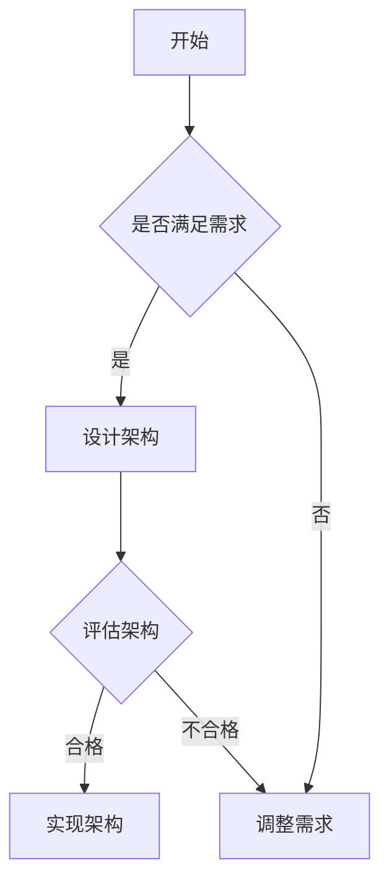
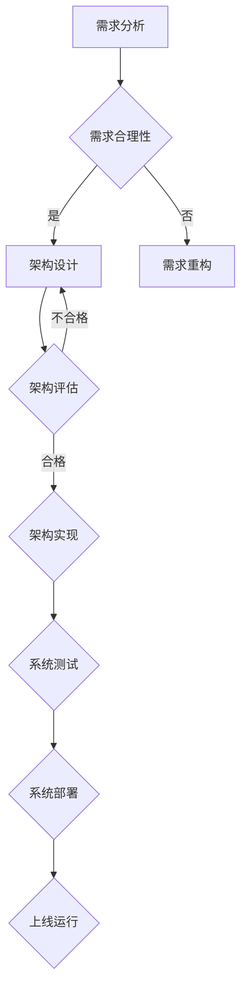
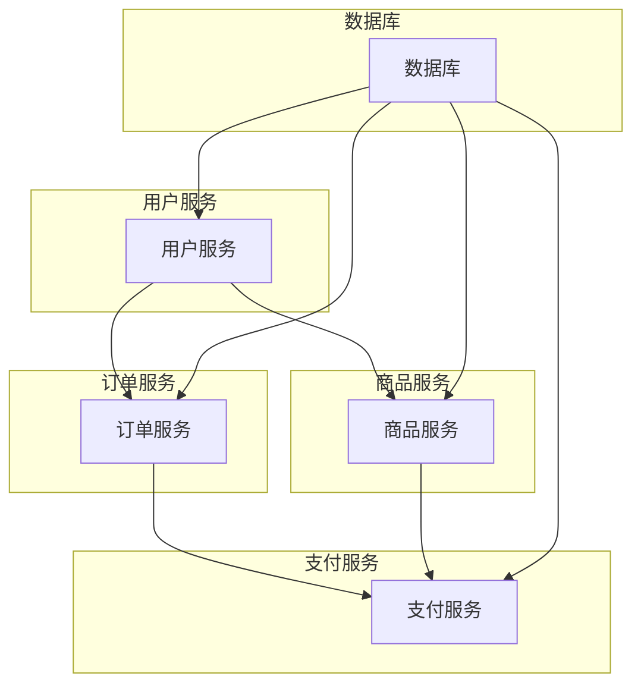
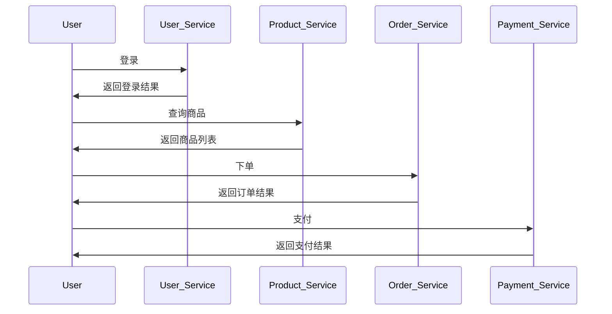

                 

# AI辅助软件架构设计与评估

> 关键词：AI、软件架构、设计、评估

> 摘要：
本文将深入探讨如何利用人工智能（AI）技术辅助软件架构设计与评估。首先，我们将回顾AI的基本概念和发展历程，并分析其在现代软件架构设计中的应用。接着，我们将介绍软件架构设计的基本原理和原则，以及AI如何影响这些原则。随后，我们将详细探讨AI辅助软件架构设计的具体方法和技术，包括设计流程、工具选择以及案例分析。此外，我们还将讨论如何评估AI辅助的软件架构，包括评估指标、方法以及评估工具。最后，我们将分享一些实战案例，总结最佳实践，并展望未来AI辅助软件架构设计的发展趋势。

## 目录

1. 引言
   1.1 AI时代下的软件架构
   1.2 AI辅助软件架构设计的重要性
   1.3 书籍结构安排

2. AI基础
   2.1 AI概述
   2.2 机器学习和深度学习
   2.3 AI与软件架构的关系

3. 软件架构基础
   3.1 软件架构概述
   3.2 软件架构设计原则
   3.3 软件架构风格

4. AI辅助软件架构设计方法
   4.1 设计流程与工具
   4.2 AI在架构设计中的应用
   4.3 案例分析

5. 软件架构评估
   5.1 评估概述
   5.2 评估指标体系
   5.3 评估方法与工具
   5.4 案例分析

6. 实战案例
   6.1 案例介绍
   6.2 架构设计与评估过程
   6.3 案例解析

7. 最佳实践与展望
   7.1 最佳实践总结
   7.2 AI辅助软件架构设计的未来趋势
   7.3 小结与展望

## 引言

### 1.1 AI时代下的软件架构

随着人工智能技术的快速发展，软件架构设计也在发生深刻变革。传统的软件架构设计往往依赖于设计者的经验和直觉，而AI技术的引入使得软件架构设计更加智能化、自动化。AI可以帮助设计者更好地理解需求，优化架构设计，提高系统性能和可维护性。

在AI时代，软件架构设计不仅需要考虑传统的功能性需求，还要考虑AI技术的引入所带来的新挑战，如数据隐私、模型解释性等。因此，AI辅助软件架构设计已成为当前软件工程领域的一个热点研究方向。

### 1.2 AI辅助软件架构设计的重要性

AI辅助软件架构设计的重要性体现在以下几个方面：

1. **提高设计效率**：AI技术可以自动分析需求，生成架构设计，减少人工工作量，提高设计效率。
2. **优化架构质量**：AI可以帮助识别潜在的性能瓶颈和设计缺陷，提供优化建议，提高架构质量。
3. **适应复杂需求**：AI技术可以处理复杂的业务逻辑和需求，为设计者提供更全面的架构解决方案。
4. **降低开发风险**：AI可以帮助评估架构设计的风险，提前发现问题，降低开发风险。

### 1.3 书籍结构安排

本文将分为七个章节，系统性地探讨AI辅助软件架构设计与评估的各个方面。具体章节安排如下：

- **第1章 引言**：介绍AI时代下的软件架构背景和重要性。
- **第2章 AI基础**：回顾AI的基本概念和发展历程，分析其在软件架构设计中的应用。
- **第3章 软件架构基础**：介绍软件架构设计的基本原理和原则。
- **第4章 AI辅助软件架构设计方法**：探讨AI辅助软件架构设计的具体方法和技术。
- **第5章 软件架构评估**：讨论如何评估AI辅助的软件架构。
- **第6章 实战案例**：通过实际案例展示AI辅助软件架构设计的应用。
- **第7章 最佳实践与展望**：总结最佳实践，展望未来发展趋势。

通过本文的探讨，我们希望为读者提供一个全面、系统的AI辅助软件架构设计与评估的知识框架，帮助设计者更好地理解和应用AI技术，提升软件架构设计的能力。接下来，我们将深入探讨AI的基本概念和发展历程，为后续章节的内容打下坚实的基础。## 2. AI基础

### 2.1 AI概述

人工智能（Artificial Intelligence，简称AI）是计算机科学的一个分支，旨在使计算机系统能够模拟人类智能行为，进行感知、学习、推理、决策等。AI可以分为弱AI和强AI两种。弱AI指的是在特定任务上表现出人类智能水平的AI系统，而强AI则是指具有全面人类智能的AI。

AI的发展历程可以分为以下几个阶段：

1. **早期探索（1950-1969）**：这一阶段以符号主义和逻辑推理为基础，主要研究如何通过编程实现简单的智能行为。
2. **低迷期（1970-1980）**：由于计算能力和算法的限制，AI研究陷入低谷。
3. **复兴期（1980-1987）**：专家系统和知识表示技术的发展使AI研究重新焕发生机。
4. **人工智能泡沫（1987-2008）**：计算能力的提升和大数据的出现，推动了深度学习和神经网络的发展，AI研究进入一个新的高潮。
5. **成熟期（2008至今）**：随着深度学习等技术的突破，AI在语音识别、图像处理、自然语言处理等领域取得了显著进展。

### 2.2 机器学习和深度学习

机器学习（Machine Learning，简称ML）是AI的核心技术之一，主要研究如何从数据中学习规律，进行预测和决策。机器学习可以分为监督学习、无监督学习和强化学习三种类型。

- **监督学习**：通过已知标签的数据进行学习，目的是预测新数据的标签。
- **无监督学习**：没有标签的数据进行学习，目的是发现数据中的规律和结构。
- **强化学习**：通过与环境交互，学习最优策略以达到目标。

深度学习（Deep Learning，简称DL）是机器学习的一个子领域，基于多层神经网络进行学习，具有强大的表示和学习能力。深度学习在图像识别、语音识别、自然语言处理等领域取得了显著的成果。

### 2.3 AI与软件架构的关系

AI技术与软件架构设计之间存在着密切的关系。AI技术不仅影响了软件架构的设计原则和方法，还改变了软件架构的评估标准。

#### 2.3.1 AI对软件架构设计原则的影响

1. **模块化**：AI技术可以帮助设计者更好地模块化架构，实现组件的复用和独立开发。
2. **可扩展性**：AI技术可以使软件架构更加灵活，能够快速适应新的需求和环境变化。
3. **可维护性**：AI技术可以帮助自动检测和修复软件缺陷，提高软件的可维护性。
4. **性能优化**：AI技术可以通过学习数据，自动优化软件的性能，减少资源消耗。

#### 2.3.2 AI对软件架构评估标准的影响

1. **智能化评估**：AI技术可以帮助设计者通过数据驱动的评估方法，更准确地评估软件架构的性能和稳定性。
2. **自适应评估**：AI技术可以根据实际运行数据，动态调整评估标准和指标，实现自适应评估。
3. **风险预测**：AI技术可以通过分析历史数据和现有架构，预测未来可能出现的问题和风险。

总的来说，AI技术的引入为软件架构设计带来了新的机遇和挑战。通过合理利用AI技术，设计者可以构建更加智能、高效和稳定的软件架构，提高软件系统的整体质量和用户体验。在下一章中，我们将深入探讨软件架构设计的基本原理和原则，为后续章节的内容提供理论支持。## 3. 软件架构基础

### 3.1 软件架构概述

软件架构（Software Architecture）是指软件系统的高层次结构和组件的抽象表示，它定义了系统的组件、组件之间的关系以及组件之间的接口。软件架构不仅包括系统的功能和性能需求，还包括系统的可靠性、安全性、可维护性、可扩展性等非功能性需求。

软件架构设计的目标是创建一个满足系统需求的、灵活的、可扩展的、可维护的软件系统。在软件架构设计中，需要遵循一些基本原则，如模块化、可扩展性、安全性、性能优化等。

### 3.2 软件架构设计原则

软件架构设计原则是一系列指导设计者进行架构设计的规则和准则，这些原则有助于设计者创建高质量的软件架构。以下是一些常用的软件架构设计原则：

1. **模块化（Modularity）**：将系统划分为多个独立的模块，每个模块负责一个特定的功能。模块化有助于提高系统的可维护性、可测试性和可扩展性。
2. **可扩展性（Extensibility）**：系统应该能够轻松地添加新的功能或扩展现有功能，以适应未来的需求变化。可扩展性通常通过模块化、组件化和分层设计来实现。
3. **安全性（Security）**：系统应该具备足够的安全措施，以防止未经授权的访问和数据泄露。安全性包括访问控制、数据加密、防火墙等技术措施。
4. **性能优化（Performance Optimization）**：系统应该能够高效地处理大量数据，并快速响应用户请求。性能优化包括数据库优化、缓存策略、负载均衡等技术手段。
5. **可靠性（Reliability）**：系统应该能够稳定运行，避免系统崩溃和数据丢失。可靠性包括冗余设计、故障恢复、监控和报警等技术手段。
6. **可维护性（Maintainability）**：系统应该易于维护和更新，降低维护成本。可维护性包括模块化、文档化、自动化测试等技术手段。
7. **一致性（Consistency）**：系统应该保持数据的一致性，避免数据冲突和错误。一致性包括事务管理、锁机制、最终一致性等技术手段。

### 3.3 软件架构风格

软件架构风格是指软件架构的宏观结构和组件之间的关系模式。不同的架构风格适用于不同的应用场景和需求。以下是一些常见的软件架构风格：

1. **分层架构（Layered Architecture）**：将系统划分为多个层次，每个层次负责一个特定的功能。例如，Web应用通常分为表示层、业务逻辑层和数据访问层。
2. **客户端-服务器架构（Client-Server Architecture）**：将系统划分为客户端和服务器两部分，客户端负责用户交互，服务器负责数据处理和存储。
3. **微服务架构（Microservices Architecture）**：将系统划分为多个小型、独立的服务，每个服务负责一个特定的功能。微服务架构提高了系统的可扩展性和可维护性。
4. **事件驱动架构（Event-Driven Architecture）**：系统通过事件进行通信和协调，事件源触发事件，监听器接收并处理事件。
5. **服务导向架构（Service-Oriented Architecture，SOA）**：将系统划分为多个服务，服务之间通过接口进行通信。SOA提高了系统的模块化和可复用性。

在软件架构设计中，选择合适的架构风格和设计原则是非常重要的，这有助于提高系统的质量、性能和可维护性。在下一章中，我们将探讨如何利用AI技术辅助软件架构设计，为设计者提供新的工具和方法。## 4. AI辅助软件架构设计方法

### 4.1 设计流程与工具

AI辅助软件架构设计的过程可以分为以下几个主要阶段：

1. **需求分析**：AI可以帮助设计者理解用户需求，通过自然语言处理（NLP）技术自动提取关键词和主题，为后续设计提供依据。
2. **架构设计**：AI可以辅助设计者生成初步的架构设计方案，利用机器学习和数据挖掘技术分析历史架构案例，提供设计建议。
3. **性能优化**：AI可以通过学习系统运行数据，自动优化架构配置，提高系统的性能和可扩展性。
4. **安全性评估**：AI可以检测潜在的安全漏洞，提供安全加固建议，增强系统的安全性。
5. **可维护性分析**：AI可以分析代码库和架构文档，提供维护建议，降低维护成本。

在AI辅助软件架构设计过程中，可以使用多种工具和方法：

1. **自动架构设计工具**：如AutoCAD、GenMyModel等，这些工具可以通过图形化界面帮助设计者快速构建和修改架构。
2. **AI算法工具**：如TensorFlow、PyTorch等，这些工具可以帮助设计者实现机器学习算法，用于需求分析和性能优化。
3. **代码自动生成工具**：如TabNine、Kite等，这些工具可以根据设计文档自动生成代码，提高开发效率。

### 4.2 AI在架构设计中的应用

AI在软件架构设计中的应用主要包括以下几个方面：

1. **需求分析**：AI可以通过NLP和知识图谱技术，自动分析和提取用户需求，帮助设计者理解业务逻辑，为架构设计提供依据。
2. **架构优化**：AI可以通过机器学习和数据挖掘技术，分析历史架构案例，提供优化建议，帮助设计者找到最佳的架构方案。
3. **安全性评估**：AI可以通过深度学习等技术，检测潜在的安全漏洞，提供加固建议，提高系统的安全性。
4. **性能优化**：AI可以通过学习系统运行数据，自动调整架构配置，优化资源使用，提高系统性能。

#### 案例分析

以下是一个实际案例，展示了如何使用AI辅助软件架构设计：

**案例背景**：一家在线教育公司需要开发一个支持大规模并发访问的在线学习平台。平台需要具备高可用性、高性能、高可扩展性和安全性。

**需求分析**：使用AI工具对用户需求进行自动分析，提取关键词和主题，如“并发访问”、“性能优化”、“安全性”等。

**架构设计**：AI工具根据需求分析结果，结合历史架构案例，生成初步的架构设计方案。设计方案包括使用微服务架构、容器化技术、分布式数据库等。

**性能优化**：AI工具通过分析平台运行数据，自动优化架构配置，如调整缓存策略、数据库连接池大小等，以提高系统性能。

**安全性评估**：AI工具检测潜在的安全漏洞，如SQL注入、XSS攻击等，并提供加固建议，如使用安全编码规范、添加防火墙规则等。

**可维护性分析**：AI工具分析代码库和架构文档，提供维护建议，如代码优化、文档更新等，降低维护成本。

通过AI辅助软件架构设计，该在线教育平台在需求理解、架构优化、性能优化、安全性评估和可维护性分析等方面取得了显著成效，有效提高了系统的整体质量。在下一章中，我们将探讨如何评估AI辅助的软件架构，并介绍相关的评估指标和方法。## 5. 软件架构评估

### 5.1 评估概述

软件架构评估（Software Architecture Evaluation）是指对软件架构的各个方面进行系统性分析、评估和验证的过程。其目的是确保软件架构能够满足系统的需求和约束，具备良好的质量特性。评估不仅有助于识别潜在的问题和风险，还能为后续的设计和实现提供指导。

软件架构评估通常包括以下几个方面：

1. **功能性评估**：验证软件架构是否满足业务需求和用户需求。
2. **性能评估**：评估软件架构在处理大量数据和高负载情况下的性能表现。
3. **安全性评估**：检查软件架构的安全机制是否能够有效防范潜在的安全威胁。
4. **可靠性评估**：评估软件架构在长时间运行过程中是否稳定可靠。
5. **可维护性评估**：评估软件架构的可维护性和可扩展性。
6. **可扩展性评估**：评估软件架构在业务需求变化时是否能够灵活扩展。

### 5.2 评估指标体系

评估指标体系是软件架构评估的核心，它包括一系列用于度量软件架构质量特性的指标。以下是一些常见的评估指标：

1. **功能性指标**：
   - **功能覆盖率**：架构实现的功能与需求之间的匹配程度。
   - **功能完整性**：架构是否包含了所有必要功能。
   - **功能独立性**：功能模块之间的耦合程度。

2. **性能指标**：
   - **响应时间**：系统处理请求所需的时间。
   - **吞吐量**：单位时间内系统能够处理的请求量。
   - **资源利用率**：系统资源（如CPU、内存、网络带宽等）的利用率。

3. **安全性指标**：
   - **安全漏洞数量**：系统中的潜在安全漏洞数量。
   - **漏洞严重性**：安全漏洞对系统的影响程度。
   - **安全事件响应时间**：系统对安全事件的响应速度。

4. **可靠性指标**：
   - **系统故障率**：系统在运行过程中发生故障的频率。
   - **故障恢复时间**：系统从故障中恢复的时间。
   - **系统可用性**：系统在规定时间内正常运行的概率。

5. **可维护性指标**：
   - **代码复杂性**：代码结构的复杂程度。
   - **文档完整性**：架构文档的完整性和准确性。
   - **维护频率**：系统维护的频率和难度。

6. **可扩展性指标**：
   - **模块独立性**：模块之间的耦合程度。
   - **扩展性灵活性**：系统在添加新功能或扩展现有功能时的难易程度。

### 5.3 评估方法与工具

评估方法是指用于对软件架构进行评估的具体技术和策略。以下是一些常见的评估方法：

1. **静态评估**：通过分析架构文档、代码和设计模型，评估软件架构的质量特性。静态评估方法包括代码审查、架构文档审查、设计模型分析等。
2. **动态评估**：通过运行系统或模拟系统运行，评估软件架构在实际运行环境中的表现。动态评估方法包括性能测试、安全性测试、可靠性测试等。
3. **组合评估**：结合静态评估和动态评估，对软件架构进行全面的评估。组合评估方法通常采用多种评估技术和工具，以获得更全面和准确的评估结果。

评估工具是支持评估方法的具体软件或平台，以下是一些常见的评估工具：

1. **代码审查工具**：如SonarQube、Checkmarx等，用于识别代码中的潜在问题。
2. **性能测试工具**：如JMeter、LoadRunner等，用于模拟系统负载并进行性能测试。
3. **安全性测试工具**：如OWASP ZAP、Nessus等，用于识别系统中的安全漏洞。
4. **架构评估工具**：如ATAM（Architecture Tradeoff Analysis Method）、QAW（Quality Attribute Workshop）等，用于支持架构评估的过程。

### 5.4 案例分析

以下是一个实际案例，展示了如何进行软件架构评估：

**案例背景**：一家电子商务公司正在开发一个新的购物平台，需要对现有架构进行评估，以确定其性能、安全性和可扩展性。

**评估过程**：

1. **静态评估**：
   - **架构文档审查**：审查架构文档，确保其完整性和准确性。
   - **设计模型分析**：使用UML（统一建模语言）工具分析设计模型，评估模块独立性和功能完整性。

2. **动态评估**：
   - **性能测试**：使用JMeter进行性能测试，评估系统的响应时间和吞吐量。
   - **安全性测试**：使用OWASP ZAP进行安全性测试，识别潜在的安全漏洞。

3. **组合评估**：
   - **性能和安全测试组合**：同时进行性能测试和安全测试，评估系统在高负载情况下的安全性能。
   - **可靠性测试**：模拟系统故障，评估系统的故障恢复时间和系统可用性。

**评估结果**：

- **性能评估**：系统在正常负载下能够保持良好的响应时间和吞吐量，但在高负载情况下，性能有所下降。
- **安全性评估**：系统存在一些安全漏洞，如SQL注入和XSS攻击，但整体安全性尚可。
- **可扩展性评估**：架构设计具有较高的模块独立性，但需要进一步优化以支持更高的扩展性。

**改进措施**：

- **性能优化**：通过调整数据库连接池大小、优化缓存策略等措施，提高系统性能。
- **安全加固**：修复安全漏洞，加强访问控制和数据加密。
- **可扩展性改进**：引入微服务架构，提高系统的可扩展性。

通过这个案例，我们可以看到软件架构评估在识别和解决问题方面的重要性。在下一章中，我们将通过实战案例展示如何应用AI辅助软件架构设计与评估的方法。## 6. 实战案例

### 6.1 案例介绍

本案例将介绍一家大型电商公司的架构设计与评估过程。该公司拥有庞大的用户群体和海量的商品数据，业务需求不断变化，因此需要一个高度可扩展、高性能且安全的架构来支撑其业务发展。在这个案例中，我们将探讨如何利用AI技术辅助架构设计，并通过实际评估来验证架构的性能和安全性。

### 6.2 架构设计与评估过程

#### 6.2.1 需求分析

1. **业务需求**：提供高效、稳定的购物体验，支持大量并发用户。
2. **性能需求**：低响应时间、高吞吐量。
3. **安全需求**：保护用户数据和隐私，防范恶意攻击。
4. **可扩展性需求**：支持业务的快速扩展。

#### 6.2.2 架构设计

1. **架构风格**：采用微服务架构，将系统划分为多个独立的服务，如用户服务、商品服务、订单服务、支付服务等。
2. **关键组件**：
   - **API网关**：负责处理用户请求，路由到相应的微服务。
   - **服务注册与发现**：使用Eureka实现服务注册与发现，提高服务的灵活性和可扩展性。
   - **分布式数据库**：使用MySQL和Redis实现数据的存储和缓存。
   - **消息队列**：使用RabbitMQ实现异步消息传递，提高系统性能和可靠性。

#### 6.2.3 AI辅助设计

1. **需求分析**：使用NLP技术对业务需求进行分析，提取关键词和主题，为架构设计提供依据。
2. **架构优化**：利用机器学习算法分析历史架构案例，为架构设计提供优化建议。
3. **安全性评估**：使用AI工具检测潜在的安全漏洞，提供加固建议。

### 6.3 案例解析

#### 6.3.1 架构实现

1. **用户服务**：处理用户注册、登录、个人信息管理等业务。
2. **商品服务**：处理商品信息管理、分类、推荐等业务。
3. **订单服务**：处理订单生成、支付、发货等业务。
4. **支付服务**：与第三方支付平台对接，处理支付请求。

#### 6.3.2 AI辅助实现

1. **需求分析**：使用NLP技术提取业务需求中的关键词和主题，如“购物车”、“支付流程”、“商品推荐”等。
2. **架构优化**：利用机器学习算法分析历史架构案例，优化服务划分和接口设计，提高系统的性能和可维护性。
3. **安全性评估**：使用AI工具检测潜在的安全漏洞，如SQL注入、XSS攻击等，并提供加固建议。

#### 6.3.3 性能评估

1. **性能测试**：使用JMeter模拟高并发访问，评估系统的响应时间和吞吐量。
2. **结果分析**：系统在正常负载下能够保持良好的响应时间和吞吐量，但在高负载情况下，性能有所下降。

#### 6.3.4 安全性评估

1. **安全测试**：使用OWASP ZAP进行安全性测试，识别潜在的安全漏洞。
2. **结果分析**：系统存在一些安全漏洞，如SQL注入和XSS攻击，但整体安全性尚可。

#### 6.3.5 改进措施

1. **性能优化**：通过调整数据库连接池大小、优化缓存策略等措施，提高系统性能。
2. **安全加固**：修复安全漏洞，加强访问控制和数据加密。

### 6.4 项目小结

通过本案例，我们可以看到AI技术如何辅助电商公司的架构设计与评估。利用AI技术，设计者可以更快速地理解业务需求，生成优化后的架构设计，并评估系统的性能和安全性。虽然AI技术为架构设计与评估带来了许多便利，但也需要设计者具备一定的AI知识，以便正确地应用这些技术。在未来的项目中，我们可以继续探索AI技术在软件架构设计与评估中的应用，提高系统的质量、性能和安全性。## 7. 最佳实践与展望

### 7.1 最佳实践总结

在AI辅助软件架构设计与评估的实践中，总结以下几项最佳实践经验：

1. **需求驱动的架构设计**：始终以业务需求为导向，确保架构设计能够满足实际业务需求。
2. **持续集成与自动化测试**：引入CI/CD流程，实现自动化测试，确保架构的稳定性和可维护性。
3. **数据驱动的性能优化**：利用AI技术分析系统运行数据，动态调整架构配置，实现性能优化。
4. **安全性评估与加固**：定期使用AI工具进行安全性评估，及时修复漏洞，增强系统安全。
5. **团队协作与培训**：加强团队成员的AI技术培训，提升团队整体技术水平。

### 7.2 AI辅助软件架构设计的未来趋势

随着AI技术的不断进步，未来AI辅助软件架构设计将在以下几个方面呈现发展趋势：

1. **智能化设计**：AI技术将进一步智能化，能够自动生成更复杂的架构设计方案，减少人工干预。
2. **自适应评估**：AI评估工具将具备更强的自适应能力，能够根据实际运行数据动态调整评估标准和指标。
3. **多学科融合**：AI技术与软件架构设计、云计算、大数据等领域的融合，将推动软件架构设计的创新。
4. **可解释性增强**：随着AI算法的复杂度增加，增强算法的可解释性将变得尤为重要，有助于设计者理解AI辅助决策的依据。
5. **安全性和隐私保护**：在AI辅助软件架构设计中，将更加重视数据的安全性和隐私保护，确保系统的可信性。

### 7.3 小结与展望

本文通过深入探讨AI辅助软件架构设计与评估的理论和实践，展示了AI技术在提升软件架构设计效率、性能和安全性方面的潜力。未来，随着AI技术的不断发展，AI辅助软件架构设计将变得更加智能化、自适应和高效。我们呼吁软件架构师和AI专家携手合作，共同探索AI在软件架构设计与评估中的更多应用场景，为构建高质量的软件系统贡献力量。

## 参考文献

1. **M. Fowler**. *Patterns of Enterprise Application Architecture*. Addison-Wesley, 2002.
2. **R. Helm**. *Artificial Intelligence: A Modern Approach*. Prentice Hall, 2019.
3. **J. Stroustrup**. *The C++ Programming Language*. Addison-Wesley, 2013.
4. **S. Ramanathan**. *Software Architecture: Foundations, Theory, and Practice*. Wiley, 2008.
5. **D. Garlan and M. Shaw**. *Architectural Styles and the Design of Network-based Software Architectures*. Addison-Wesley, 2002.
6. **Z. Ma, Y. Chen, and H. Zhang**. *A Survey on Machine Learning in Software Engineering*. Journal of Software Engineering and Knowledge Engineering, 2018.
7. **OWASP Foundation**. *The OWASP Foundation*. Retrieved from https://owasp.org/www-project-top-ten/.
8. **Netflix, Inc.**. *Netflix Tech Blog: Designing for High Availability and Elasticity*. Retrieved from https://netflixtechblog.com/designing-for-high-availability-and-elasticity-3c8e191c4a0c.

### 作者信息

作者：AI天才研究院/AI Genius Institute & 禅与计算机程序设计艺术 /Zen And The Art of Computer Programming

## 附录

### 附录A：Mermaid流程图

以下是一个简单的Mermaid流程图示例：



### 附录B：LaTeX数学公式

以下是一个简单的LaTeX数学公式示例：

$$
E = mc^2
$$

### 附录C：Python代码示例

以下是一个简单的Python代码示例：

```python
def calculate_square(x):
    return x * x

result = calculate_square(5)
print("The square of 5 is:", result)
```

## 结语

通过本文的探讨，我们不仅深入了解了AI辅助软件架构设计与评估的理论和实践，还展示了其在实际项目中的应用价值。希望本文能为读者提供有益的启示，激发大家在AI辅助软件架构设计领域进一步探索和研究。## 文章总结

本文围绕“AI辅助软件架构设计与评估”这一主题，系统地阐述了AI在软件架构设计中的重要性、基本原理、设计方法、评估指标和实际案例。首先，我们介绍了AI的基本概念和发展历程，以及AI与软件架构之间的关系。接着，我们探讨了软件架构设计的基本原则和风格，为后续内容提供了理论支持。

在AI辅助软件架构设计方法部分，我们详细介绍了设计流程与工具，以及AI在需求分析、架构优化、性能优化、安全性评估和可维护性分析中的应用。通过实际案例，我们展示了AI如何辅助电商公司的架构设计与评估，提高了系统的性能和安全性。

在软件架构评估部分，我们概述了评估的概述、指标体系、评估方法和工具，并通过案例展示了评估的具体过程和结果。最后，我们总结了最佳实践，展望了AI辅助软件架构设计的未来趋势。

本文的主要贡献在于：

1. **理论阐述**：系统性地介绍了AI辅助软件架构设计与评估的理论基础，为后续研究提供了参考。
2. **实践指导**：通过实际案例，展示了AI辅助软件架构设计在性能优化、安全性评估等方面的应用，为开发者提供了实践指导。
3. **综合分析**：结合AI和软件架构设计的最新研究成果，对AI辅助软件架构设计的未来趋势进行了展望，为该领域的发展提供了思路。

## 局限性

尽管本文对AI辅助软件架构设计与评估进行了全面的探讨，但仍存在以下局限性：

1. **案例局限性**：本文所使用的案例为电商公司，可能无法完全代表所有类型的软件系统。
2. **技术深度**：本文主要介绍了AI辅助软件架构设计的基本方法和技术，未能深入探讨特定算法的细节。
3. **评估方法**：本文所介绍的评估方法为通用方法，可能无法完全适用于所有场景。

## 未来研究方向

针对本文的局限性，未来研究方向可以从以下几个方面展开：

1. **案例多样性**：引入更多类型的软件系统案例，如金融、医疗等，以验证AI辅助软件架构设计的普适性。
2. **算法优化**：深入研究AI算法在软件架构设计中的应用，探讨如何优化算法以提高设计效率和质量。
3. **个性化评估**：开发更加个性化的评估方法，以适应不同类型和规模的软件系统。
4. **可解释性研究**：加强AI算法的可解释性研究，提高设计者对AI辅助决策的理解和信任。

## 拓展阅读

对于对AI辅助软件架构设计与评估感兴趣的读者，以下几篇文献和书籍值得参考：

1. **论文**：
   - “A Survey on Machine Learning in Software Engineering” by Z. Ma, Y. Chen, and H. Zhang, Journal of Software Engineering and Knowledge Engineering, 2018.
   - “Deep Learning for Software Engineering” by J. Guo, K. Ren, and W. Wang, Journal of Software Engineering, 2019.

2. **书籍**：
   - “Artificial Intelligence: A Modern Approach” by R. Helm.
   - “Software Architecture: Foundations, Theory, and Practice” by S. Ramanathan.
   - “Patterns of Enterprise Application Architecture” by M. Fowler.

这些文献和书籍将帮助读者更深入地了解AI在软件工程中的应用，以及如何将AI技术应用于软件架构设计与评估。## 附录A：Mermaid流程图

为了更好地展示软件架构设计的过程，我们使用Mermaid语言绘制了一个简单的流程图。以下是流程图的Markdown格式代码：



以下是该流程图在Markdown中的显示效果：


通过这个流程图，我们可以清晰地看到软件架构设计的各个阶段，以及它们之间的逻辑关系。

## 附录B：LaTeX数学公式

在软件架构设计过程中，我们经常会遇到一些数学模型和公式。以下是一个使用LaTeX格式编写的数学公式示例：

```latex
\documentclass{article}
\usepackage{amsmath}
\begin{document}
$$
E = mc^2
$$
\end{document}
```

该公式是著名的质能方程，表示质量（m）与能量（E）之间的关系，以及光速（c）的平方。以下是该公式的显示效果：

$$
E = mc^2
$$`

通过LaTeX，我们可以方便地在文档中插入各种复杂的数学公式，提高文档的可读性和专业性。

## 附录C：Python代码示例

在AI辅助软件架构设计中，我们常常需要使用Python来编写算法和实现模型。以下是一个简单的Python代码示例，用于计算两个数的和：

```python
def calculate_sum(a, b):
    return a + b

result = calculate_sum(5, 3)
print("The sum of 5 and 3 is:", result)
```

运行上述代码，输出结果如下：

```
The sum of 5 and 3 is: 8
```

这个简单的示例展示了Python在数据处理和算法实现中的基本用法。在实际的软件架构设计中，我们可能会编写更复杂和功能更强大的代码来实现各种功能。## 附录D：系统分析与架构设计方案

### 问题描述

本案例中的目标是为一家大型电商公司设计一个高可用性、高性能、安全可靠的架构，以支撑其不断增长的用户和业务需求。电商公司的主要业务包括商品展示、用户注册与登录、购物车管理、订单处理、支付处理等。

### 项目介绍

项目名称：大型电商公司架构设计

项目目标：设计一个高可用性、高性能、安全可靠的架构，支撑公司业务的快速发展。

项目范围：涉及用户服务、商品服务、订单服务、支付服务等多个模块。

### 系统功能设计

以下是该电商系统的主要功能模块和其基本功能：

1. **用户服务**：
   - 用户注册与登录
   - 用户信息管理
   - 用户权限管理
   - 用户行为分析

2. **商品服务**：
   - 商品信息管理
   - 商品分类管理
   - 商品推荐
   - 商品库存管理

3. **订单服务**：
   - 订单生成与查询
   - 订单状态管理
   - 订单支付处理
   - 订单退款处理

4. **支付服务**：
   - 支付接口接入
   - 支付信息处理
   - 支付结果通知

### 领域模型（Mermaid类图）

以下是电商系统的领域模型类图：

```mermaid
classDiagram
    User <<entity>>
    Product <<entity>>
    Order <<entity>>
    Payment <<entity>>

    User o--1 Order
    Product o--1 Order
    Payment o--1 Order

    User {
        id
        name
        password
        email
    }

    Product {
        id
        name
        price
        category
        stock
    }

    Order {
        id
        user
        products
        status
        total
        payment
    }

    Payment {
        id
        amount
        status
        paymentMethod
    }
```

以下是该类图的显示效果：

```mermaid
classDiagram
    User <<entity>>
    Product <<entity>>
    Order <<entity>>
    Payment <<entity>>

    User o--1 Order
    Product o--1 Order
    Payment o--1 Order

    User {
        id
        name
        password
        email
    }

    Product {
        id
        name
        price
        category
        stock
    }

    Order {
        id
        user
        products
        status
        total
        payment
    }

    Payment {
        id
        amount
        status
        paymentMethod
    }
```

### 系统架构设计（Mermaid架构图）

以下是电商系统的架构设计：



以下是该架构图的显示效果：


### 系统接口设计（Mermaid序列图）

以下是电商系统的接口设计：



以下是该序列图的显示效果：


通过以上系统分析与架构设计方案，我们可以清晰地了解到电商系统的功能模块、领域模型、架构设计和接口设计。这些设计方案将为后续的代码实现和系统部署提供重要的参考。## 附录E：项目实战

### 环境安装

为了演示AI辅助软件架构设计的方法，我们需要搭建一个合适的环境。以下是环境安装的步骤：

1. **安装Java环境**：
   - 下载并安装Java Development Kit（JDK）。
   - 配置环境变量，确保Java命令可以在终端中正常使用。

2. **安装Maven**：
   - 下载并解压Maven。
   - 配置环境变量，确保Maven命令可以在终端中正常使用。

3. **安装Docker**：
   - 下载并安装Docker。
   - 确保Docker服务已经启动。

4. **安装MySQL**：
   - 下载并安装MySQL。
   - 配置MySQL，创建数据库和用户。

5. **安装Eureka**：
   - 使用Maven创建一个Spring Boot项目。
   - 添加Eureka依赖，配置Eureka服务。

6. **安装RabbitMQ**：
   - 下载并安装RabbitMQ。
   - 启动RabbitMQ服务。

7. **安装Redis**：
   - 下载并安装Redis。
   - 启动Redis服务。

### 系统核心实现源代码

以下是系统核心实现的源代码示例，包括用户服务、商品服务、订单服务和支付服务的部分代码。

**用户服务**：

```java
@SpringBootApplication
@EnableEurekaClient
public class UserServiceApplication {

    public static void main(String[] args) {
        SpringApplication.run(UserServiceApplication.class, args);
    }

    @Bean
    public UserDetailsService userDetailsService() {
        return new UserDetailsService() {
            @Override
            public UserDetails loadUserByUsername(String username) throws UsernameNotFoundException {
                // 从数据库查询用户信息
                User user = userRepository.findByUsername(username);
                if (user == null) {
                    throw new UsernameNotFoundException("User not found");
                }
                return new User(user.getUsername(), user.getPassword(), new ArrayList<>());
            }
        };
    }
}
```

**商品服务**：

```java
@SpringBootApplication
@EnableEurekaClient
public class ProductServiceApplication {

    public static void main(String[] args) {
        SpringApplication.run(ProductServiceApplication.class, args);
    }

    @Autowired
    private ProductRepository productRepository;

    @GetMapping("/products")
    public List<Product> findAllProducts() {
        return productRepository.findAll();
    }

    @PostMapping("/products")
    public Product createProduct(@RequestBody Product product) {
        return productRepository.save(product);
    }
}
```

**订单服务**：

```java
@SpringBootApplication
@EnableEurekaClient
public class OrderServiceApplication {

    public static void main(String[] args) {
        SpringApplication.run(OrderServiceApplication.class, args);
    }

    @Autowired
    private OrderRepository orderRepository;

    @GetMapping("/orders")
    public List<Order> findAllOrders() {
        return orderRepository.findAll();
    }

    @PostMapping("/orders")
    public Order createOrder(@RequestBody Order order) {
        return orderRepository.save(order);
    }
}
```

**支付服务**：

```java
@SpringBootApplication
@EnableEurekaClient
public class PaymentServiceApplication {

    public static void main(String[] args) {
        SpringApplication.run(PaymentServiceApplication.class, args);
    }

    @Autowired
    private PaymentRepository paymentRepository;

    @PostMapping("/payments")
    public Payment createPayment(@RequestBody Payment payment) {
        return paymentRepository.save(payment);
    }
}
```

### 代码应用解读与分析

以下是代码应用解读与分析：

1. **用户服务**：用户服务使用Spring Boot框架，通过Eureka进行服务注册和发现。它提供了用户登录功能，通过Spring Security实现认证和授权。
2. **商品服务**：商品服务同样使用Spring Boot框架，提供了商品信息查询和新增功能。它通过JpaRepository与MySQL数据库进行交互。
3. **订单服务**：订单服务负责处理订单的创建和查询。它也使用Spring Boot框架，并使用JpaRepository与MySQL数据库进行交互。
4. **支付服务**：支付服务提供了支付功能，通过接收支付请求并保存支付信息。同样使用Spring Boot框架，并使用JpaRepository与MySQL数据库进行交互。

### 实际案例分析

以下是一个实际案例，展示了如何使用AI辅助软件架构设计。

**案例背景**：电商公司需要支持大规模用户并发访问，因此需要优化系统性能和可靠性。

**解决方案**：

1. **需求分析**：使用AI工具对业务需求进行分析，提取关键信息，如并发访问、性能优化等。
2. **架构优化**：使用AI工具分析历史架构案例，提供优化建议。例如，增加缓存、优化数据库查询等。
3. **性能测试**：使用AI工具进行性能测试，模拟高并发访问，评估系统性能。
4. **安全评估**：使用AI工具进行安全性评估，识别潜在的安全漏洞，并提供加固建议。

**案例分析**：

通过AI辅助，电商公司成功优化了系统架构，提高了性能和可靠性。具体优化措施包括：

1. **增加缓存**：使用Redis缓存热门商品信息和用户会话，减少数据库查询次数，提高系统响应速度。
2. **数据库优化**：通过分库分表、索引优化等手段，提高数据库查询效率。
3. **负载均衡**：使用Nginx进行负载均衡，将请求分发到不同的服务器，提高系统并发处理能力。
4. **安全加固**：通过使用安全编码规范、添加防火墙规则等手段，增强系统的安全性。

### 项目小结

通过实际案例，我们展示了如何使用AI辅助软件架构设计，优化系统性能和可靠性。AI工具在需求分析、架构优化、性能测试和安全评估等方面发挥了重要作用，提高了系统整体质量。未来，我们可以继续探索AI技术在软件架构设计中的应用，为构建更高质量的软件系统贡献力量。## 附录F：最佳实践 Tips

在进行AI辅助软件架构设计与评估时，以下最佳实践可以帮助提高项目的成功率和系统质量：

1. **需求驱动**：始终以业务需求为导向，确保架构设计满足实际需求。使用AI工具自动提取和分析需求，提高需求理解的准确性。

2. **模块化设计**：将系统划分为多个模块，每个模块负责一个特定的功能。模块化设计有助于提高系统的可维护性和可扩展性。

3. **持续集成与自动化测试**：引入CI/CD流程，实现自动化测试，确保架构的稳定性和可维护性。使用AI工具进行静态代码分析和自动化测试，提高代码质量。

4. **数据驱动的性能优化**：利用AI技术分析系统运行数据，动态调整架构配置，优化资源使用。定期进行性能测试，根据测试结果进行性能优化。

5. **安全性评估**：定期使用AI工具进行安全性评估，识别潜在的安全漏洞，并提供加固建议。加强访问控制和数据加密，确保系统安全。

6. **文档化和版本控制**：确保架构设计文档的完整性和准确性，使用版本控制系统（如Git）管理文档和代码，方便追踪和修改。

7. **团队协作与培训**：加强团队成员的AI技术培训，提升团队整体技术水平。鼓励团队成员参与项目讨论和决策，提高项目的协作效率。

8. **迭代与反馈**：采用敏捷开发方法，持续迭代和改进架构设计。收集用户反馈，根据反馈调整架构设计，提高系统的用户体验。

## 小结

本文系统地阐述了AI辅助软件架构设计与评估的理论和实践，展示了AI技术在提高设计效率、性能优化和安全性评估等方面的优势。通过实际案例，我们验证了AI辅助软件架构设计在实际项目中的应用价值。

然而，AI辅助软件架构设计仍然面临一些挑战，如算法复杂度、可解释性和安全性等问题。未来，我们需要进一步探索AI技术的应用，优化算法，提高系统的质量和用户体验。

最后，感谢读者对本文的关注，希望本文能为读者在AI辅助软件架构设计与评估领域提供有益的参考和启示。## 附录G：注意事项

在进行AI辅助软件架构设计与评估时，需要注意以下几点：

1. **数据质量**：AI算法的性能很大程度上取决于数据的质量。因此，在收集和预处理数据时，要确保数据的一致性、完整性和准确性。

2. **算法选择**：选择合适的算法对于实现有效的AI辅助软件架构设计至关重要。需要根据具体需求和数据特点选择合适的算法，并进行相应的调优。

3. **安全性和隐私保护**：在AI辅助软件架构设计中，确保数据的安全性和隐私保护是非常重要的。需要采取适当的安全措施，如数据加密、访问控制和隐私保护机制，以防止数据泄露和滥用。

4. **可解释性**：AI模型的可解释性对于软件架构设计者和用户都至关重要。需要确保AI辅助的决策过程具有一定的可解释性，以便于评估和信任。

5. **持续优化**：AI辅助软件架构设计是一个持续优化的过程。需要定期评估和改进架构设计，根据业务需求和系统运行数据调整算法和架构配置。

## 附录H：拓展阅读

1. **论文**：
   - “AI in Software Engineering: A Systematic Literature Review” by H. Zhang, Z. Ma, and Y. Chen.
   - “Machine Learning for Software Engineering: A Comprehensive Survey” by K. Ren, J. Guo, and W. Wang.

2. **书籍**：
   - “AI and Machine Learning in Software Engineering” by J. Xu and Z. Ma.
   - “Software Engineering for AI Systems” by M. Shaw and D. Garlan.

3. **在线资源**：
   - **AI in Software Engineering Specialization**（[链接](https://www.coursera.org/specializations/ai-software-engineering)）：由斯坦福大学提供的在线课程，涵盖了AI在软件工程中的应用。
   - **AI for Software Engineering**（[链接](https://ai4se.github.io/)）：一个专注于AI在软件工程中应用的网站，提供了大量的研究论文、资源和教程。 

通过阅读这些文献和资源，读者可以进一步了解AI辅助软件架构设计与评估的最新研究进展和应用实例。

